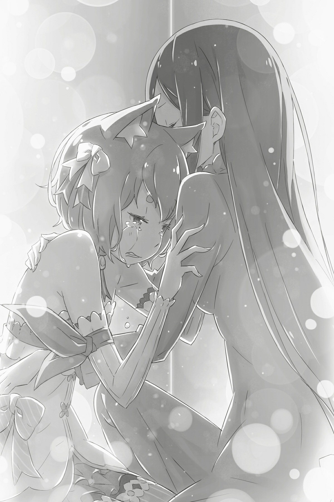
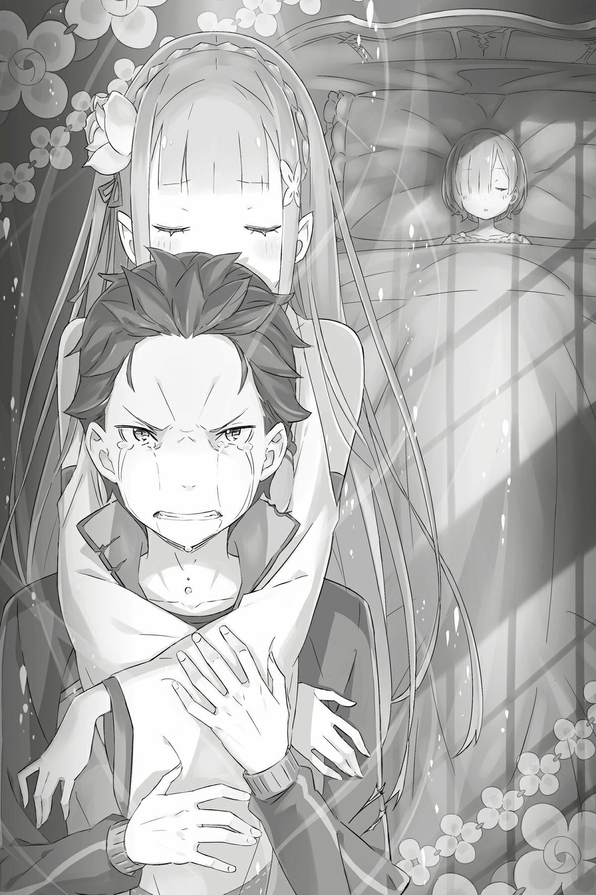
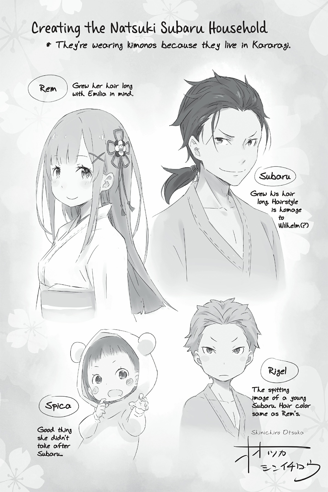

## 1

Она лежала на кровати, лицо было умиротворенным и спокойным, как у спящей. Глядя на её ресницы, окаймлявшие закрытые веки, он рассеянно отметил их длину. В безмятежных чертах девушки, обычно нарочито сдержанной и холодной, теперь можно было разглядеть детскую наивность, характерную для её возраста. Он подумал, что ещё ни разу не видел её спящей. Она всегда вставала спозаранку, была строга к себе. Но любил он её именно в редкие моменты, когда девушка становилась мягче и покладистее.

Он понял это лишь сейчас. А ведь судьба подарила ему столько моментов: когда она удивлялась, когда краснела от смущения, когда дулась, когда плакала, когда улыбалась после примирения…

— Рем, — позвал он и коснулся её щеки, но ответа не получил. На ней не было привычного платья горничной, украшенного цветами. Боевой наряд теперь ни к чему. Субару бесцельно сидел в тихой комнате, где не было слышно ни шороха.

— Вот вы где, — раздался женский голос.

Он медленно обернулся и увидел на пороге женщину с красивыми длинными волосами, одетую в темно-синеё платье. Она направилась к Субару изящной, но в то же время немного неуверенной походкой. Казалось, ей что-то мешает, диссонирует с прирожденной утонченностью. Субару стало не по себе.

— Как она? — спросила женщина.

— Без изменений, — ответил юноша, повесив голову. — Не стоит рассчитывать, что моё присутствие ей поможет. Пора набраться смелости и признать, что от меня никакого толку.

Женщина попыталась робко возразить:

— Вовсе нет. Полагаю, она рада вашему присутствию.

Но для Субару эти слова были слабым утешением. Он машинально поднял взгляд.

— Простите, что вмешиваюсь, — сказала она. — Боюсь, я задела вас за живое.

— Это я должен извиниться, — ответил Субару, потупившись.

Что-то нашло на него. Рем точно рассердилась бы: «Субару, не смей опускать руки!» Последнюю фразу он произнес, копируя интонации Рем, а затем слабо улыбнулся. В голове будто бы прозвучал её голос, но никто этого не услышал. И никто не сказал Субару, что изобразил Рем он совсем не похоже.

В ответ на бессмысленные речи Субару женщина лишь понурилась. Она машинально обхватила правой ладонью левое плечо, совсем недавно присоединенное к её туловищу.

Повисло молчание. Наконец Субару тряхнул головой: так больше продолжаться не может! Впасть в отчаяние и опустить руки способен каждый. Но это не то, что может позволить себе мужчина, в которого верила Рем.

— У тебя ко мне какое-то дело? — спросил он женщину.

— Да, — ответила та, обрадовавшись, что Субару сменил тему. — Я хотела поговорить. Все уже собрались в совещательной комнате. Так что…

Женщина виновато замялась с беспомощным выражением лица. Тогда Субару показал пальцем на себя и произнес:

— Субару Нацуки.

— Прошу прощения… Конечно, господин Субару Нацуки. Как я могла забыть имя человека, которому стольким обязана! ещё раз прошу меня извинить.

— Ничего, не волнуйся. Сейчас, конечно, не до того, — мягко ответил Субару.

Всякий раз, когда она вела себя так учтиво и по-женски, Субару оказывался не в своей тарелке. К счастью, ему хватало тактичности не говорить об этом.

Юноша тряхнул головой и нежно погладил Рем по прекрасным голубым волосам:

— Ладно, Рем, ещё увидимся.

Грудь девушки мерно поднималась и опускалась. Прикасаясь к Рем, Субару ощущал тепло её тела. Живая плоть никуда не делась, и её можно было потрогать. Но, кроме этой плоти, у девушки, исчезнувшей из людской памяти, не осталось ничего…

— Нас ждут в совещательной комнате? Что ж, тогда пойдем.

— Да, господин Субару Нацуки, — очень женственно и нежно улыбнулась она.

Не в силах этого видеть, Субару отвернулся и сказал, пряча истинные чувства за вежливым тоном:

— Благодарю, что пришла за мной, леди Круш.

## 2

К тому времени, когда Субару добрался до столицы, всё уже было кончено.

«Кто такая Рем?» — спросила тогда Эмилия, вопросительно склонив голову.

Будь в её интонации и жестах хоть малейший намек на шутку, Субару, вероятно, откликнулся бы с остротой. Но облик девушки будто говорил: не тешь себя пустой надеждой. Да и сама Эмилия не засмеялась и не сказала: «Я тебя разыграла!»

И Петра, и остальные — никто не помнил Рем. Субару не мог поверить, что это какое-то недоразумение, такого не может быть. В отчаянии юноша погнал в столицу.

«Ведь всё получилось! — думал он. — Удача повернулась ко мне лицом! Я сумел защитить тех, кто мне дорог, и достиг цели! Я преодолел и боль, и муки! Да, порою сердце рвалось на части, но ведь я не сдался и вышел победителем!»

Однако…

Субару ступил на порог совещательной комнаты, и взгляды присутствующих устремились на него. Стало неуютно. Похоже, угрызения совести довели его до паранойи.

В комнате собралось пятеро: Субару, Круш, Эмилия, Феррис и Вильгельм.

— Ах, вы вернулись, как хорошо! — заговорил Феррис дружеским тоном, увидев Круш. — Госпожа Круш, простите, что отправили именно вас.

— Бросьте, господин Феррис, мне не трудно.

— Просто Феррис! Мы знакомы бог знает сколько лет, и мне невыносимо слышать от вас «господин». Ну как можно!..

В этот раз на Феррисе не было формы рыцаря-гвардейца: он красовался в короткой юбочке. Феррис схватил озадаченную Круш за руку и усадил рядом с собой.

— Боюсь, — сказала Круш, — я не скоро привыкну и стану вести себя как прежде… Но я буду стараться, гос… то есть Феррис, — добавила она решительно.

— Не надо торопиться, — сказал Феррис, не выпуская её руку из своей. — Я никуда от вас не денусь, госпожа Круш, можете рассчитывать на меня в любое время, р-мяу. К тому же должен заметить, в вас появилось новое очарование!

Феррис держался как и прежде — игриво и легко. Глядя на него, Субару испытал смешанные чувства. Круш было не узнать, но Феррис общался с ней, словно ничего не произошло. Сложно представить, какое смятение царило в душе рыцаря.

Субару все ещё стоял на пороге, когда Эмилия позвала его с озабоченным видом:

— Субару…

Встретившись с её печальным взором, юноша выдохнул и опустился рядом.

— Все хорошо, Эмилия-тан. Я в норме. Со мной… всё в порядке, — голос его был спокоен и ровен. Но посмотреть Эмилии в глаза Субару не решался. Он даже не заметил, что его руки, сложенные на коленях, непроизвольно подрагивают.

— Итак, — негромко произнес Вильгельм, прежде чем повисла неприятная тишина, — поскольку мастер Субару и госпожа Круш уже с нами, давайте начнем.

— Да, сперва предлагаю вспомнить последние события, — согласился Феррис и пересказал подробности сражений с Белым Китом и архиепископом Лени.

В обстоятельствах возвращения Рем и отряда Круш не было никаких загадок. Расставшись с Субару, они повезли голову Белого Кита в столицу и по дороге были атакованы новыми адептами Культа. В итоге половина отряда погибла. Другой же половине, а именно бойцам «Железного клыка», удалось выжить: им был отдан приказ немедленно уходить.

Ребята из «Клыка» вскоре вернулись с подкреплением, но… греховных архиепископов и след простыл. На поле боя остались убитые и…

— И люди, которым так же не повезло, как и мне, — закончила Круш с мученическим выражением лица.

Вероятно, герцогиня очень переживала из-за своего бессилия. Ей казалось, что речь идет о ком-то другом, но только не о ней.

— Как я понимаю, мои воспоминания стерли… Дело рук архиепископов?

— Почти наверняка, — отозвался Феррис. — Вы, госпожа Круш, далеко не первая, кто вот так потерял память. Говорят, пострадавшим не помогала даже исцеляющая магия. До сих пор причина несчастья оставалась неизвестной, но если предположить, что это Лень…

— Несомненно, это Полномочие греховного архиепископа Культа Ведьмы, — значительно произнес Вильгельм, скрестив руки на груди. Взгляд сурового старика, острый как лезвие, упал на герцогиню, и она непроизвольно съежилась. — Нет, госпожа Круш, вы здесь ни при чем. Прошу прощения, что напугал.

— Это вы простите никчемную хозяйку. Я изо всех сил пытаюсь вспомнить вас, господин Вильгельм.

При слове «господин» щека пожилого мечника слегка дернулась, как при болезненном спазме. Вильгельму горько было смотреть, в кого превратилась его госпожа, передавшая рыцарю свой фамильный меч. Как верный вассал, он винил себя. Схожее чувство вины одолевало и Субару, потому он прекрасно понимал старика.

— Вот это подлость, р-мяу! Мы разобрались с Ленью, и тут возникли новые архиепископы. Впрочем, как только госпожа Эмилия объявила об участии в королевских выборах, стало ясно, что намечается большая заваруха.

— Так и знала, все из-за меня… — еле слышно пробормотала Эмилия и слегка потупилась.

— Культ Ведьмы не мог оставить без внимания полуэльфа, коим вы являетесь. Сами видите: до жути тихая и скрытная шайка вдруг устроила страшный переполох!

— Значит, это люди, которые хотят всем зла, потому что ненавидят полудемонов…

— Ненавидят — мягко сказано! Они одержимы желанием стереть полуэльфов, в том числе и вас, госпожа Эмилия, с лица земли. И случившееся — лишь начало.

— Начало, которое уже принесло столько бед! Субару, ты… — голос Эмилии дрогнул, но юноша понял все по её глазам. Эмилия будто хотела спросить: «Субару, ты тоже сердишься на меня?»

— Глупости! Феррис, следи за языком. Тебя послушать, так во всем виновата Эмилия, а не эти подонки! — грозно посмотрел на Ферриса, чьи слова больно задели Эмилию. — Ты не по адресу! Обвиняя своего союзника, делу не поможешь!

— Какое красноречие, Субарунчик. Где научился? — сказал Феррис с явным намерением уязвить.

Субару скрежетнул зубами и попытался было подняться, но его остановил неожиданный упрек Круш:

— Феррис, ты слишком много себе позволяешь! Извинись.

Ещё недавно растерянное, лицо герцогини вновь стало благородно-суровым. Нахального рыцаря следовало поставить на место.

— Господин Субару Нацуки прав, и ты не должен насмехаться над ним. Понятно? — сказала она уже мягче.

— Да, госпожа Круш, — сдался Феррис.

Субару удивился внезапному возвращению герцогини к обычному образу. Феррис тоже не мог скрыть потрясения. Он повернулся к Эмилии и Субару, склонил голову и сказал:

— Госпожа Эмилия, прошу прощения за грубость. Субарунчик, ты тоже не дуйся, ладно? — Феррис дурачился до последнего.

— Эй! Ладно, хватит, вернемся к делу, — сказал Субару и перешел к главному, — к разговору о Рем. — С потерей памяти леди Круш все более-менее ясно. А Рем?.. Как быть с бойцами, стертыми из людской памяти? Поверьте, Рем не плод моей больной фантазии. Она очень важна для всех нас! Если бы не Рем, мы бы ни за что не одолели Белого Кита!

Субару было обидно до слез: никто, кроме него, не помнил Рем! Но тут раздался тихий голос Вильгельма:

— Мастер Субару…

Да, о Рем никто не помнил, но все понимали, на что похож этот случай.

— Подобное воздействие оказывает Туман Белого Кита, — сказал Феррис. — Человек, попавший в этот Туман, исчезает из памяти других!

— Я помню, мастеру Субару рассказали, что Белый Кит связан с Чревоугодием. А значит, весьма вероятно, что греховный архиепископ, напавший на госпожу Круш и отряд, олицетворяют этот порок, — предположил Вильгельм.

— Он использовал своё Полномочие?.. Феррис, ты же осматривал Рем?

Феррис, лечивший Рем, наверняка сделал свои выводы. Но лекарь отрицательно покачал головой:

— Не обнаружил ничего необычного. Но сам этот факт очень даже необычен! Как и то, что она спит беспробудным сном. Симптомы «спящей красавицы» налицо.

— Что ты сказал? — удивился Субару.

— Я слышала об этом, — подхватила Эмилия. — Такая болезнь, при которой спишь и не просыпаешься. Говорят, во время такого сна человек не стареет и не испытывает голода…

— Во всем королевстве таких людей единицы, — добавил Вильгельм. — И никто из них не проснулся. Если не считать потерю воспоминаний о человеке, мы имеем дело с аналогичным случаем.

Вильгельм говорил так, словно лично соприкоснулся с этим недугом. Быть может, в состояние «спящей красавицы» впал кто-то из его близких. Но утверждать, что Рем стала «спящей красавицей», было преждевременно.

— Узнать правду мы сможем только у Чревоугодия. Увы, столкновения с Культом Ведьмы не избежать. И лично я готов! — заявил Субару, исподволь поглядывая на Эмилию.

Рано или поздно одержимый ненавистью к полуэльфам Культ снова встанет на пути Эмилии. Определенно произойдет очередная стычка.

— Значит, Субарунчик готов опять броситься в бой… — сказал Феррис и устало вздохнул. — А что же союз двух лагерей? Сделаем вид, что никакого союза и не было?

Все присутствующие в комнате изумленно застыли. Сначала Субару даже не сообразил, о чём речь. Но когда смысл наконец дошел, внутри все закипело от негодования.

— Ты на что намекаешь? Аннулировать союз в такое время?!

Однако, несмотря на лавину эмоций, Субару удалось сохранить спокойствие. Феррис был не из тех, кто болтает, не думая о последствиях. По крайней мере, юноше хотелось в это верить, потому он сдержал гнев.

— Да ни на что я не намекаю! — удивился Феррис. — Союз должен быть интересен обеим сторонам. Но принесет ли он нам какие-то выгоды? Думаю, работать вместе нет смысла.

— А права на добычу камней в лесу? Да, вы здорово помогли в борьбе с Белым Китом и Культом, и теперь мы вроде как в расчете, но…

— Хочешь сказать, мы и дальше должны защищать госпожу Эмилию, на которую Культ объявил охоту? А ты, Субарунчик, можешь гарантировать, что госпожа Круш больше не пострадает?

— Но я… — Субару замялся.

Феррис имел все основания для таких опасений, и Субару не мог этого отрицать. Однако возражение всё же последовало — от Вильгельма.

— Я не согласен с тобой, Феррис, — сказал сидящий на стуле мечник.

— Почему же, старик Вил? — сердито осведомился Феррис, не ожидавший услышать подобное от члена своего же лагеря. — Тебе мало того, что случилось с госпожой Круш?!

— Мы получим шанс отомстить Чревоугодию за нашу хозяйку, — спокойно сказал Вильгельм.

— Месть для тебя важнее, чем безопасность госпожи Круш?! — взорвался Феррис и с горечью посмотрел на свои ладони. — Если мы снова свяжемся с Культом Ведьмы, беды не избежать! Госпожа Круш уже не сможет защитить себя, да и я никак не помогу ей!..

— Феррис…

Лекарь смотрел на свои тонкие, белые пальцы почти с ненавистью. Субару наконец сообразил, о чем так горько сожалеет Феррис. Их мучило одно и то же чувство — бессилие.

Феррис очень дорожил Круш и ненавидел себя за то, что не мог защитить герцогиню. Даже его целительная магия, пускай и самая лучшая в королевстве, не предотвратила беды.

— Вам будет очень тяжело, госпожа Круш! Вы многого не помните… Сейчас вам точно не до войны! Ну разве я не прав? — жалобно увещевал Феррис.

На рыцаре лица не было. ещё недавно хладнокровный и самоуверенный, теперь Феррис едва сдерживал слёзы. Ради благополучия Круш он был готов пожертвовать собою…

— Я сделаю всё, чтобы вернуть вам память, — продолжал умоляюще Феррис. — Пока не получилось, но я уверен, что с помощью магии решу проблему. Поэтому, пожалуйста, не подвергайте себя…

— Я благодарна тебе за заботу, Феррис, — ласково улыбнулась Круш. Но в её улыбке не было страха перед опасностью — напротив, герцогиня исполнилась твердой решимости сражаться.

Круш Карстен потеряла память, но не свою непоколебимую волю. Это было видно даже Субару. Феррису тоже стало ясно, что её не разубедить. Круш положила на дрожащую руку Ферриса свою ладонь и решительно посмотрела на собравшихся.

— Я пока мало что понимаю, — призналась она, — и ничего не помню о своем прошлом. Думаю, вы сомневаетесь, стоит ли иметь со мной дело. Но спасибо за то, что по-прежнему считаетесь со мной.

— Госпожа Круш… — заволновался Феррис.

— Я прекрасно понимаю, что ты беспокоишься обо мне и пытаешься уберечь от опасности. Но… — Она обвела взглядом присутствующих и наконец остановилась на Феррисе. — Я не хочу пребывать в неведении. И если уж я должна сделать выбор, то не стану прислушиваться к чужим советам. Я выберу то, что велит сердце. И впредь буду прикладывать все силы, чтобы идти своим путём.

Слова Круш доказывали: даже человек, потерявший память, способен сохранить высокие устремления.

«Но где же находятся воля и характер, если не в памяти? — подумал Субару, глядя на Круш, по-прежнему сильную и смелую, хоть и потерявшую прошлое. — Должно быть, в той самой душе, о которой когда-то говорила герцогиня».

Феррис принялся всхлипывать. Судя по всему, продолжать беседу он был не в состоянии. Вместо него заговорил Вильгельм:

— Если госпожа Круш желает сохранить союз, полагаю, никто не станет возражать.

— Да! — подтвердила герцогиня, обняв Ферриса за плечи. — Прошу прощения у госпожи Эмилии и господина Субару Нацуки за огромное беспокойство, что причинила.

— Всё в порядке, — заверила Эмилия. — Мы и сами виноваты, что не действовали сообща.

Когда Рам, которая эвакуировалась с остальными в Святилище, вернется домой, нужно будет обсудить этот вопрос с Розваалем.

— Благодарю, — ответила Круш. — А вас, господин Субару Нацуки, такой расклад устраивает?

— Да, вполне. А что мы скажем Анастасии?

Анастасия Хосин принимала участие, пускай опосредованное, и в битве с Белым Китом, и в боях с Культом Ведьмы, однако на совещание её не пригласили. Потому вопрос Субару оказался непростым для обоих лагерей.

— Не знаю, как Юлиус, но госпожа Анастасия обязательно воспользуется ситуацией. Это как пить дать-мяу! — с отвращением протянул сквозь всхлипы Феррис, уткнувшись в грудь Круш.

В самом деле, когда новость о состоянии герцогини разлетится по стране, Анастасия может присвоить себе лавры победителя в войне с Белым Китом и стать самой перспективной претенденткой на престол. Вряд ли она упустит такой шанс.

— Но свою порцию славы она получит в любом случае… Может, стоит сохранить в тайне историю, приключившуюся с леди Круш? — предложил Субару.

— Мы сами решим, как поступить, р-мяу. А до тех пор, Субарунчик, держи язык за зубами, — сказал Феррис и добавил скороговоркой: — Пусть это будет дополнительным условием нашего союза.

«Сначала хотел расторгнуть союз, а теперь придумывает новые условия! Эгоист, какого поискать!» — возмутился про себя Субару, но вслух сказал:

— Ладно, согласен. Но только из сочувствия, которое вызывает твоя зареванная физиономия.

Возможно, именно на такой язвительной ноте и стоило закончить разговор. Субару прекрасно понимал рыцаря и не понаслышке знал, каково это — чувствовать бессилие и гнетущую досаду, когда тебя утешает самый дорогой человек…

## 3

Беседа подошла к концу, и все, кроме продолжавшего хныкать Ферриса и утешавшей его Круш, покинули совещательную комнату. Оказавшись в коридоре, Субару окликнул Вильгельма:

— Спасибо, что встали на мою сторону.

Мечник обернулся.

— Не стоит благодарности, — ответил он, пытаясь скрыть накопившуюся усталость. — Увы, в самый ответственный момент я был бесполезен…

— Ничего подобного! Без вас мы бы не справились с Белым Китом, а ещё вы позаботились об Эмилии. Спасибо!

Результат был далек от безупречного, но Субару говорил абсолютно искренне. И всё же, несмотря на благодарность, Вильгельм выглядел по-прежнему мрачным. Он был человеком долга и потому считал себя виноватым. А ещё Дьявольский Мечник был чрезвычайно добрым. Но эта мысль почему-то вызвала у Субару улыбку.

— Расслабляться нам, конечно, рано… Вы, наверное, пойдете на могилу жены? Как-никак с главным врагом вы расквитались.

Вильгельм сжал челюсти. Субару растерялся и глядел на старика, не понимая, в чём дело. Но тут Вильгельм сделал нечто совершенно неожиданное. Он вдруг глубоко поклонился и сказал:

— Мастер Субару, я должен принести вам извинения.

— Вильгельм, прекратите! Я правда очень благодарен и…

— Вы неправильно меня поняли. Там, в комнате, я принял вашу сторону не из желания помочь. Да, это низко, но я настоял на продлении союза по личным причинам. Я скрыл этот факт, и мне стыдно за недостойное поведение.

Субару, недоумевая, слушал исповедь Вильгельма. Внезапно Вильгельм закатал левый рукав, и юноша увидел повязку, пропитавшуюся кровью.

— Должно быть, вам больно… Думаю, нужно показаться Феррису, он…

— Эту рану невозможно залечить, — медленно покачал головой Вильгельм. — её нанесли с помощью Божественной защиты Бога Смерти. Такие раны не заживают…

— Серьезно?.. Но ведь тогда…

Субару не верил своим ушам. Он прекрасно понимал, как ужасны неизлечимые раны: если не остановить кровотечение, впору прощаться с жизнью! Однако Вильгельм, в отличие от всполошившегося Субару, был спокоен:

— Моей жизни ничто не угрожает.

— Да о чем вы говорите?! Вашу рану надо как-то…

— Я был ранен не сегодня и не вчера, а давным-давно. Но сейчас она снова открылась. И этот факт значит для меня очень много.

Слушая тихий голос Вильгельма, Субару задрожал. Сначала стали трястись конечности, потом застучали зубы. И тут он понял: причина в жутком потоке энергии меча, исходящем от Дьявольского Мечника.

— Подобные раны, — тихо продолжил Вильгельм, — начинают кровоточить, почуяв обладателя Божественной защиты Бога Смерти. Если приблизиться к тому, кто когда-то нанес рану, она снова даст о себе знать. Вот так.

— Значит, ваш враг где-то рядом?

Слова Вильгельма потрясли Субару. Он увидел, как в зрачках мечника вспыхнул огонек.

— Эту рану мне нанес прежний Великий Мечник — Терезня ван Астрея! — сказал Вильгельм. — Рана, нанесенная женой, снова кровоточит. И я продолжу преследовать Культ Ведьмы, чтобы выяснить истину.

## 4

Субару бесцельно брел по коридору, как вдруг обнаружил, что стоит у двери в комнату Рем. Он проводил рядом с девушкой всё своё свободное время, хоть и понимал, что цепляется за неё, как за последнюю ниточку…

— Ты сказала, я сильный, но… откуда мне взять эти силы, если тебя, Рем, нет рядом?..

Вид неподвижно лежащей на кровати Рем оставался неизменным. Она дышала, сердце продолжало отбивать свой ритм. Но то были единственные признаки жизни. Рем и жила, и не жила одновременно. Теперь она существовала лишь в сердце Субару.

Он сел на краешек кровати и, глядя на её безмятежное лицо, вспомнил, как проткнул себе горло кинжалом, чтобы вернуть никак не желавшую просыпаться Рем. Картина была смутной, но Субару знал: он ни секунды не колебался, отказываясь от всего, что было достигнуто совместными усилиями многих… Жизнь без Рем, будущее, в котором нет Рем, были Субару не нужны. Ради Рем он готов вечно сражаться с Ленью, готов снова пройти через ад…

Лезвие кинжала вонзилось в горло, хлынула кровь. Боль, жар и ощущение утраты чего-то очень важного охватили Субару… А когда он очнулся, перед ним, распростершись на кровати, лежала Рем.

— Откуда мне было знать, что контрольная точка окажется перед самоубийством?! Какая подлость…

В тот момент он подумал, что в механизме автосохранения произошел сбой, и хотел было повторить самоубийство, но занесенная рука с ножом остановилась. Субару понял: Посмертное возвращение не поможет ему спасти Рем. Кинжал упал на пол, вслед за ним рухнул как подкошенный и Субару.

Посмертное возвращение переместило бы его в момент, далекий от нынешнего, и Субару при всём желании не догнал бы её и не предотвратил трагедию. А если бы, предположим, и догнал, что бы он сделал против нового архиепископа? Да и в этом случае никто не помешал бы Петельгейзе учинять зверства, и Эмилия снова бы пала жертвой архиепископа Лени.

Как ни крути, жертв не избежать: чтобы спасти Рем, надо пожертвовать Эмилией, а чтобы спасти Эмилию, надо пожертвовать Рем. Когда Субару осознал, перед каким жестоким выбором стоит, он отказался от идеи наложить на себя руки.

И вот он сидел рядом с Рем, не зная, что делать…

— Так и знала, что ты здесь, — раздался нежный голос, похожий на звон серебряного колокольчика.

Субару вздрогнул и обернулся. В дверях робко улыбалась его любимая девушка, последние несколько часов она провела в полном одиночестве.

«Каким же надо быть подлецом, чтобы называть её любимой!» — подумал Субару.

— Эмилия?.. Тебе что-нибудь нужно?

— А если не нужно, то зря пришла? Эта девушка… леди Рем, она ведь мне тоже не чужая, верно?

— Леди Рем…

Эмилия подошла к кровати, встала возле Субару и, приглаживая свои волосы, принялась смотреть на Рем. Когда Эмилия назвала Рем официальным «леди», юноше сделалось как-то не по себе.

— А, так значит, я звала её просто Рем? — тихо спросила Эмилия.

— Да, — ответил Субару. — Она была младшей сестрой Рам. Они похожи как две капли воды. Отличались только цветом волос и глаз и размером груди.

При мысли о том, что теперь даже Рам не вспомнит о своей сестре, на душе у Субару заскребли кошки.

— Субару, ты совсем не спишь. Тебе нужно отдохнуть.

— Да я и не работал, чтобы устать. Всё равно ничего не делаю…

— Но я вижу, как ты переживаешь. Если продолжишь в таком духе, силы окончательно тебя покинут. Прошу, отдохни! — взмолилась Эмилия.

Субару наконец поднял на неё глаза. С тех пор как девушка появилась, их взгляды встретились впервые. Глаза Эмилии были полны тоски. Субару вздохнул. До него наконец дошло, с какой целью она пришла.

— Я, наверно, жалок?

— Вовсе ты не жалок! — замотала головой Эмилия. — Ты очень помог. Правда-правда!

Она пришла потому, что Субару очень исхудал, и это сильно тревожило девушку. Она хотела успокоить его и приободрить своей лаской и заботой. Эмилия села рядом, взгляды их оказались на одном уровне. Смотря Субару в глаза, Эмилия собралась с силами.

— Субару, я не могу утверждать, что всё непременно наладится. Мне это неизвестно. Я бы очень хотела войти в твоё положение, но… я совсем не знаю эту девочку, и всё, что скажу, причинит тебе боль… Но… позволь мне взять на себя хотя бы часть твоих страданий…

— Эмилия… — Субару остолбенел и уставился на Эмилию. Её слова потрясли своей неожиданностью. — Но ты же совсем не помнишь Рем!..

— Да, не помню, но хочу помочь. Я вижу, как ты грустишь, значит, она тебе очень дорога, верно? Почему же тебя смущает моё намерение?

Субару промолчал.

— Ты помог мне, стало быть, теперь я должна помочь тебе.

Доверие Эмилии было безграничным, а любовь её не подлежала никакому сомнению. Девушка говорила так убедительно, что ей удалось сломить упрямство Субару. Только сейчас юноша по-настоящему осознал, каким настырным дураком был.

— Эмилия, какая же ты хорошая!..

— Правда? Я думаю, ты намного, намного лучше меня!

— Нет, не лучше… Я рад, что ты рядом.

Эмилия поглядела растерянно, как бы понимая и в то же время не понимая, что имеется в виду. Субару усмехнулся. На его губах мелькнула улыбка, и тут он заметил, что в нем просыпаются эмоции. Первые с тех пор, как Рем впала в кому.

— Эмилия, у меня есть одна просьба.

— Какая?

— Отвернись, пожалуйста. Я хочу немного поплакать.

— Ага, хорошо, — согласилась Эмилия и без лишних вопросов повернулась к нему спиной.

Субару был благодарен за её заботу. Он уставился на свои колени и, шмыгая носом, дал волю нахлынувшим чувствам. Из глаз его покатились слёзы.

Субару вспомнил, как, подавленный собственной беспомощностью, зря тратил время, сидя около спящей Рем. Он причинял беспокойство Эмилии и даже не замечал этого. Каким же он был заносчивым, полагая, что больше никто не волнуется о Рем и не хочет её спасти! Субару оплакивал свою глупость. Комната наполнилась его всхлипами, но тут… Он затаил дыхание от теплого прикосновения. То была Эмилия: она обхватила юношу за плечи и ласково погладила по голове.

Слова исчезли, они были больше не нужны. Была лишь доброта Эмилии, остановившая поток слез.

— Я обязательно верну тебя, Рем! — поклялся Субару. — Обязательно!

«Я стану героем, достойным тебя!»

А значит, впереди ещё долгий путь…

— Я обязательно… твой герой обязательно спасет тебя. Дождись!

Субару дал клятву самому себе и бросил вызов Судьбе.

«Вы, стоящие на моем пути и желающие мне зла! Вы, обижающие тех, кого обижать никак нельзя! Знайте, я доберусь до вас!»

— Я справлюсь! Обещаю!

«Этот мир, жизнь в котором я не раз начинал с нуля, немыслим без того, кто мне дорог. Без тебя, Рем! Поэтому я обязательно спасу тебя. Я верну потерянные дни, и мы снова будем идти вместе, рука об руку. Я попробую ещё раз, и у меня получится, вот увидишь!»

