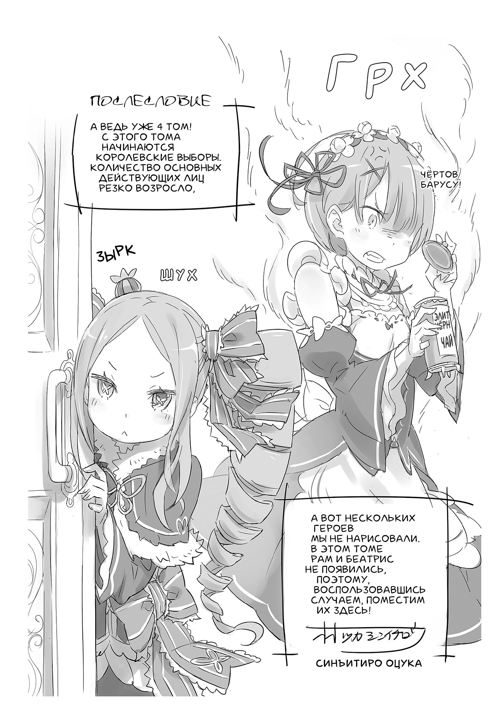
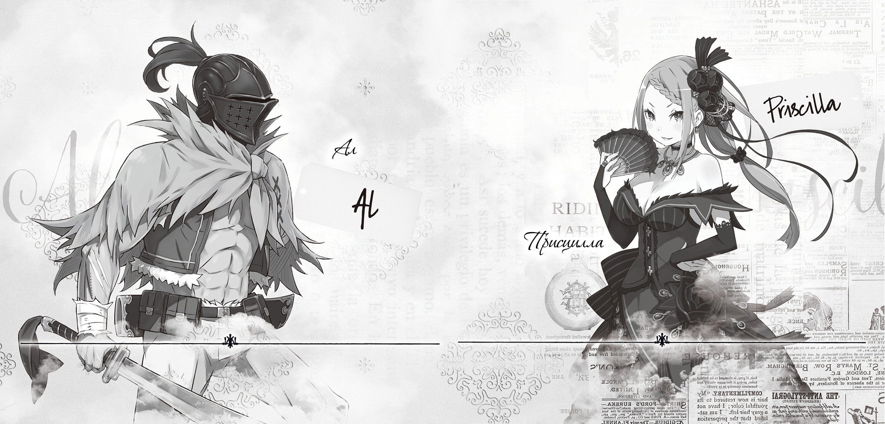

Здравствуйте, с вами Таппэй Нагацуки! А ещё меня зовут Нэдзуми-иро Нэко, то есть Мышиный Кот![^9] Хотя у меня есть и настоящее имя!

Наверное, кому-то покажется, что иметь несколько имён довольно обременительно, однако спешу вас успокоить. В восьмом классе у меня было не три, а целых шесть имён! Два — унаследованные из прошлой жизни, и ещё одно… указывающее на мою истинную сущность. Но хватит! Не спрашивайте меня о тёмном прошлом! Кто знает, к чему это приведёт?..

Итак, история возвращения в столицу, которая начинается в данном томе, была описана в третьем томе веб-романа. До настоящего момента действие разворачивалось в ограниченном пространстве, да и персонажей было немного, но в этом томе я смело раздвинул рамки!

Женские образы получились до жути яркими. Покорившись творениям Оцуки-сэнсэя, я был вынужден изрядно поколдовать над текстом, но, чёрт, это оказалось по-настоящему весело!

В общем и целом работа над четвёртым томом протекала весьма напряжённо. Большую часть времени я писал в ресторанчике по соседству.

Работники заведения, разумеется, уже знают меня в лицо и, когда я расплачиваюсь на кассе, интересуются, как дела с рукописью. Представьте себе, они даже наградили меня прозвищем. Догадаетесь каким? Овощной Сок!

То есть Таппэй Нагацуки, он же Мышиный Кот, он же Овощной Сок, и его настоящее имя… Впрочем, довольно! Кто знает, к чему это приведёт?..

Ну, поскольку мы благополучно добрались до конца, приступлю к традиционным благодарностям.

Господин Икэмото, это удивительно, но мы справились с адским графиком! Получая от вас письма в четыре часа утра, я неизменно беспокоюсь о вашем здоровье. Да, потрудились мы на славу!

А ещё хочу поблагодарить вас, Оцука-сэнсэй. В четвёртом томе я безбожно увеличил количество действующих лиц, но вы отлично справились с дизайном персонажей и даже ни разу не пожаловались. Каждый герой вышел просто отлично! Мне уже не терпится написать сцены, в которых они предстанут во всей красе.

Великий маг и волшебник, он же Кусано-сэнсэй, с помощью искусства иллюзии подарил нам великолепную обложку. Я благодарен за его страсть и упорство, ведь книга получилась действительно превосходной!

А ещё я хочу поблагодарить корректоров и других сотрудников издательства. В этой работе участвовало огромное количество людей! Многие книжные магазины провели акции, приуроченные к выпуску, и вручили покупателям тематические подарки. Большое вам спасибо!

Всем преданным читателям, кто остаётся с нами на протяжении четырёх томов, я должен сказать главное: лишь благодаря вам я могу писать то, что действительно хочу! Большое вам спасибо!

Итак, встретимся в следующем, пятом томе, где Субару ждут невероятные испытания!

*Таппэй Нагацуки, май 2014 года*

*(сижу в ресторане уже Двенадцать часов, официанты косятся)*

— Принцесса, нам поручено проанонсировать следующий том, что будем делать?

— «Что делать, что делать»! И так всё ясно, Ал! Жалкие глупые простолюдины отданы мне на милость. Я пролью на нах свет своего величия и заставлю пасть ниц. Надеюсь, это хоть как-то развлечёт меня.

— То есть сделаешь всё как надо. Теперь я спокоен. Итак, в следующем томе…

— …Итак, этот жалкий, упрямый и к тому же глупый мальчишка остался в столице, когда от него отвернулась даже полуэльфийка. И разумеется, впал депрессию. Он ищет, на кого бы выплеснуть раздражение…

— Да, братишка приходится несладко!..

— Он же тупица и плебей. Переживание людей подобного сорта неведомы мне.

— Ну, у него непростая история. Об, этом, наверное, что-то можно прочитать в манге.

— Кроме публикации в ежемесячнике *ComicAlive* начался выпуск отдельных томов и сборников рассказов. По-моему, слишком много чести для простолюдина!

— А ещё напечатают в журнале *BigGanggan!* «Проект Re:Zero» набирает обороты, и есть ещё масса задумок, о которых мы пока не расскажем. Но скучно не будет, это точно!

— Ха! Разумеется. Нужно привлечь внимание публики и подготовить мой выход, чтобы все моментально пали ниц.

— Принцесса, так держать! Мне нравится твой настрой.

— Этот мир существует ради меня. Такова воля небес.

— А что же будет с братишкой, от которого они отвернулись?

— Об этом мы узнаем в пятом томе «Re:Zero. Жизнь с нуля в альтернативном мире». Книга поступит в продажу в октябре. Это так нескоро… Ал, сделай же что-нибудь!

— Как ты сама говоришь, принцесса, на то воля небес, и всё, что бы ни случилось, в твою пользу!

— Да, верно мыслишь. А ты сообразительный, Ал, и знаешь своё место. Можешь и дальше служить мне.

— Понял-понял. Как нравится мне, что ты умеешь всё взять в свои руки. Это просто очаровательно!

— Что касается прочих плебеев, которые горазды таращиться на принцессу, пусть изо всех сил постараются угодить мне. Ведь в этом заключается единственный смысл существования!

[^9]: В оригинале — Кот Мышиного Цвета.
