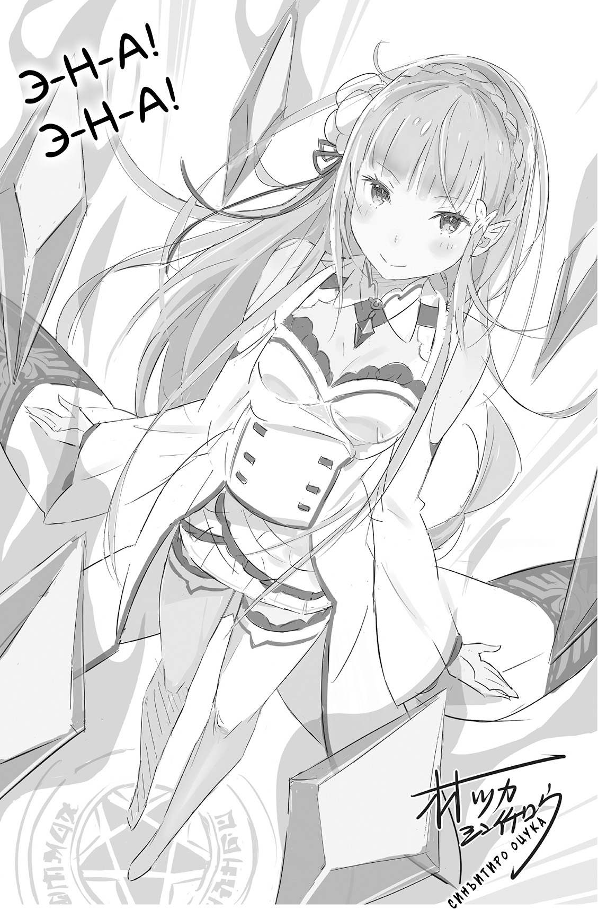
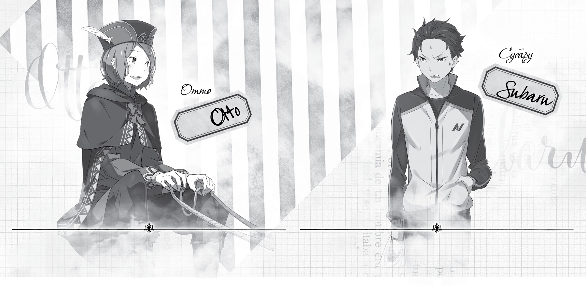

Добрый день! Добрый вечер! Доброе утро!

На связи Таппэй Нагацуки, он же Мышиный Кот[^5]. Спасибо, что приобрели пятый том!

Общение надо начинать с приветствия, не так ли? Кстати, на моей работе мы всегда желаем друг другу доброго утра, причём в любое время суток. А если кто-то хочет сходить в туалет, для этого у нас есть специальная секретная фраза: «Пойду в кабинет № 5». Но к пятому тому это никоим образом не относится.

Не успели мы оглянуться, а уже добрались до пятой книги «Re:Zero. Жизнь с нуля в альтернативном мире». Когда выходит пятый том какой-либо серии, читатели ожидают сюжетных потрясений: внезапно откроется какая-нибудь существенная тайна, а вяло развивающиеся любовные отношения главных героев станут ещё более запутанными.

Но нет! Только не в этой книге! Существенные тайны здесь не раскрываются, более того, события только начинают набирать обороты. А главный герой с героиней вместо того, чтобы признаться наконец в своих чувствах, разрывают отношения и начинают всё сначала. Иными словами, в пятом томе напряжение лишь нарастает.

Поскольку в своей личной жизни автор тоже крутится как белка в колесе, душевное напряжение не позволяет ему подарить персонажам спокойную, размеренную жизнь.

Я пишу об этом в каждом послесловии, но над пятым томом мне пришлось работать действительно в суровой обстановке.

Во-первых, было лето, самая середина.

Услышав одно это слово, большинство уже начинает обливаться потом. Обливался и я. Плавящийся от жары компьютер тоже не прибавлял мне производительности. Кто этот человек, который вселил в меня надежду на прохладное лето? Нострадамус? Или моя бабуля?

Вдобавок меня преследовала череда встрясок. Это был ещё один суровый фактор, повлиявший на работу.

Не успел я почтить духов усопших предков во время летнего праздника Обон, как произошёл целый ряд событий, из-за которых я сам чуть не присоединился к предкам. Причём всё было для меня в новинку. Удивительное лето!

Первая автограф-сессия, первая настольная ролевая игра, первая платная игра для смартфонов… Каждый новый опыт принёс мне свои радости и трудности. В общем, всего оказалось вдоволь.

На автограф-сессии было очень здорово! Наверно, именно я и получил больше всего удовольствия. Клянусь, если снова представится возможность, я подготовлю нечто особенное, и все участники мероприятия останутся довольны не меньше моего.

Про платную игру лучше не спрашивайте. Это результат моей добродетельной жизни. Я ни о чём не жалею.

Гм, содержания книги я так и не коснулся, а объём послесловия уже на исходе. Тогда приступлю к традиционным благодарностям.

Хочу поблагодарить своего редактора, господина Икэмото, ибо нет числа тем хлопотам, которые я ему доставляю. Никогда не забуду наши ночные переписки по электронной почте из-за абсолютно разного графика работы. Извините, что в последний раз я не додумался вам перезвонить и целых полдня не отвечал на письмо. Кстати, *тонкацу* и рис *тако* были великолепны! Огромное спасибо!

Нет таких слов, чтобы выразить благодарность художнику господину Оцуке, который всегда готов воплотить в жизнь мои сумасбродные идеи. Я безумно доволен тем, как получились два новых персонажа, а благородный образ госпожи Круш на обложке тронул меня до глубины души! Большое спасибо, продолжайте в том же духе!

Дизайнер, господин Кусано. Оформление — как всегда на высоте! Моё беспричинное беспокойство о расположении логотипа было развеяно в один миг! Впрочем, кто бы сомневался!

И ещё: недавно началась публикация манги по «Re:Zero»! Над первой аркой, которая выпускается в ежемесячнике *Comic Alive*, работает Даити Мацусэ. Вторая арка увидит свет в журнале *Big Gangan*, а мангакой выступит Макото Фугэцу. Стиль рисунка у обоих необычайно экспрессивный, поэтому для меня огромная удача работать с ними! Спасибо вам, ребята!

Как и предыдущие тома, эта книга увидела свет благодаря совместным усилиям многих-многих людей. Сотрудники редакции *MF Bunko*, редакторы и корректоры, работники отдела продаж, продавцы в книжных магазинах — большое всем вам спасибо за труд!

Не могу не упомянуть тёплые письма читателей, которые поддерживают меня и дают силы трудиться дальше. Низкий вам поклон!

Ну что ж, надеюсь увидеться с вами снова в шестом, самом важном, томе истории!

*Таппэй Нагацуки,*

*август 2014 года*

*(под жалобное хныканье*

*малолетних школьников по поводу*

*завершения летних каникул)*

— Ну вот, свершилось!.. Наконец-то и мне достался кусочек свободного пространства под названием «рекламная страница»! В основной части книги у меня всё шло наперекосяк, так что хотя бы здесь покажу себя! Что скажешь, Отто?

— Как бы там ни было, главное в книге — основная история, а не рекламные страницы! Честно говоря, у меня большие сомнения, что такой незначительный персонаж, как я, имеет право красоваться рядом с вами.

— Сегодня просто море новостей, поэтому выбор пал на тебя! И пусть в истории у тебя не самая заметная роль, но кому же доверить рекламу, как не Отто, человеку с коммерческим чутьём? Давай покажем, на что способен наш тандем!

— Может, вы и правы… Нет, всё-таки деловая хватка — великая вещь! Ну, начнём! Значит, та-ак… Пока в журнале *Comic Alive* публикуется всем полюбившаяся манга *Re:Zero*, на прилавках уже появился первый отдельный том! Лимитированный тираж дополнен небольшим рассказом и снабжён новыми потрясающими иллюстрациями!

— Раз речь зашла о манге, да будет всем известно, что уже в октябре ежемесячник *Big Gangan* начнёт печатать вторую арку! Рисуют два разных художника: Даити Мацусэ и Макото Фугэцу, а это значит, *Re:Zero* станет в два раза интересней!

— Дополнительные рассказы в *Comic Alive* будут также печататься с продолжением, а потом их соберут в кучу, добавят ещё один новый эпизод и уже в декабре выпустят отдельным сборником. Просто не дают опомниться!

— Я бы тоже сделал паузу, однако новости всё не кончаются. Итак, франшиза *Re:Zero* взяла новую высоту — совместный проект с сетью *Ministop*! Как тебе такое?

— Что?.. Да ну?!

— Спасибо, я знал, что ты это скажешь. Отныне сопутствующие товары будут доступны в круглосуточных магазинах *Ministop* и *Lawson* по всей стране! Море оригинального мерчандайза, который будет продаваться только здесь! Подробности читайте на следующей странице, а то, боюсь, я совсем сорву голос.

— Раз вы не хотите больше говорить о столь крутой новости, тогда поведайте об основной серии. Когда нам ждать шестой том?

— Книга должна увидеть свет в марте 2015 года. К сожалению, придётся подождать, зато уже известно, что она будет издана со специальным бонусом — брелоком в виде фигурки персонажа. Бонус добавят не только к ранобэ, но и к манге, а также к журналу *Comic Alive*! Собрав все бонусы, вы станете обладателем прекрасной, уникальной коллекции!

— Это всё, о чём мы хотели сообщить, однако будьте бдительны, срок предварительного заказа ограничен. Как уже сказал сэр Нацуки, подробности на следующей странице. Не пропустите!

— О! Как торговец, который однажды упустил момент и теперь балансирует на грани разорения, Отто знает, о чём говорит! Молодчина, Отто!

— Могли бы закончить и без этих издёвок!

[^5]: В оригинале — Кот Мышиного Цвета.
