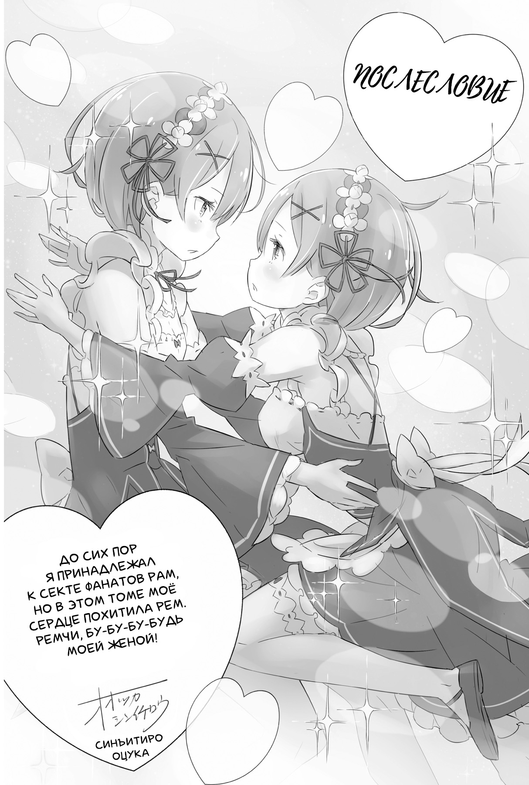
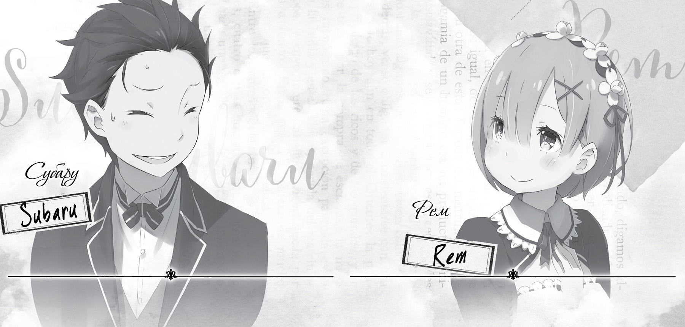

Приветствую! На связи Таппэй Нагацуки, он же Мышиный Кот[^3].

Вот и шестой том! На этот раз позвольте сразу начать с благодарности, ибо я чрезвычайно признателен за то, что вы остаётесь верными читателями романа «Re:Zero. Жизнь с нуля в альтернативном мире»!

К шестому тому я шёл как к одной из важных вех всего повествования. Ещё во время публикации романа в интернете, дописав историю до событий, на которых заканчивается шестой том, я испытал удовлетворение достигнутым. И я неописуемо рад, что мне довелось испытать это чувство ещё раз — теперь уже держа в руках данную книгу. Для меня это большая честь. Огромное вам спасибо!

Надеюсь, вам, мои постоянные читатели, том пришёлся по душе. Как автор, я вложил в него уйму сил. Кстати, именно эта часть романа вызвала шквал откликов, когда была опубликована в сети. Тогда читатели веб-версии тоже испытали чувство сродни моему. Для меня будет высшей наградой, если вы, прочтя эту книгу, получили не меньшее удовольствие.

«На этом можно было бы и закончить:)», — написал один из комментаторов веб-версии, но спешу вас успокоить: история обязательно получит продолжение: главный герой возродится и нанесёт ответный удар. Мы уж с ним постараемся сделать так, чтобы вы, пройдя вместе с Субару долгий путь обид и разочарований, остались довольны!

А теперь обязательные для послесловия слова благодарности тем, кто работал над книгой. Огромное спасибо редактору — господину Икэмото — за труд, который он вкладывает в эту серию. Господин Икэмото, я очень рад, что мы преодолели все трудности и выпустили шестой том, ведь именно его содержание, как мне кажется, в наибольшей степени повлияло на ваше решение предложить мне сотрудничество.

Хочу извиниться перед Оцукой-сэнсэем за то, что при работе над этим томом с моей стороны было особенно много пожеланий касательно иллюстраций: начиная с начальных иллюстраций, в которых не должно быть спойлеров, и заканчивая всеми остальными. Особенно пришлось помучиться с последним рисунком, за что вам большая-большая благодарность! Обложки для двух видов изданий, обычного и специального, — тоже выше всяких похвал! Особенно для специального издания получилось очень круто! Вы случайно не бог?

Спасибо Кусано-сэнсэю за стильный дизайн нового тома! На этот раз ваш блестящий талант глубоко проявил себя не только при оформлении обложки, но и в других проектах, связанных с *Re:Zero*, за что я крайне вам признателен. Надеюсь на вашу помощь и впредь!

Манга-адаптация тоже получается великолепная! Главы первой арки рисовал Даити Мацусэ и выходят они в журнале *ComicAlive*. Вторую арку рисует Макото Фугэцу для *BigGangan*. Стараниями художников новые главы обоих комиксов увидели свет одновременно с шестым томом, за что им огромная благодарность! Теперь Мацусэ-сэнсэй возьмётся за третью арку. Большое ему спасибо за труд!

Помимо этого, хочу искренне поблагодарить редакцию *MFBunkoJ*, редакторов и корректоров: всех, кто участвует в производстве и продаже этой книги. Она — плод наших совместных усилий.

Конечно же, от всего сердца благодарю вас, дорогие читатели, за тёплые письма и сообщения. Спасибо вам, что прочитали этот том.

Итак, увидимся опять в следующем томе! Будьте уверены, я и главный герой сделаем всё, что в наших силах!

*Таппэй Нагацуки*

*февраль, 2015 г. (вспоминаю, как поставил*

*не ту дату во время первой*

*в новом году автограф-сессии).*

— Итак, пришло время сделать очередной анонс. На этот раз сообщать читателям о новинках будем мы с Рем. В этом томе наш дуэт опять не сходил со страниц от начала до самого конца. Ну что, Рем, не подкачаем?

— Можешь на меня положиться, Субару! Ради тебя я постараюсь сделать всё, что в моих силах!

— Смотри, не увлекайся! Мне тоже оставь! Я, конечно, на тебя рассчитываю, но, если честно, ты вгоняешь меня в краску.

— Хи-хи, Субару, ты такой милый, когда смущаешься! Итак, давай знакомить читателей с новинками. В этот раз опять много новостей, правда?

— Вот уж точно! Сперва поведаем о манга-адаптациях *Re:Zero*, которые выходят в журналах *ComicAlive* и *BigGangan*. Вторая глава в *ComicAlive* и первая глава в *BigGangan* увидели свет одновременно с шестым томом ранобэ! Номера под завязку набиты всякими плюшками, так что не пропустите!

— Также в каждом номере *ComicAlive* публикуются рассказы по *Re:Zero*. А уже в июне запланирован выход второго тома с такими рассказами! В этих коротких историях можно увидеть, как усердно Субару трудится в особняке, чему я очень рада!

— Вообще-то мне мало радости от того, что я постоянно мелькаю на глазах у людей… Раз уж ты заговорила о втором томе с рассказами, у меня есть новость о другом камбэке! Совместный проект с сетью *Mimistop* возвращается! Товары по *Re:Zero* снова будут доступны в круглосуточных магазинах сети!

— И подушки-обнимашки с Субару наконец появятся? Я куплю сто штук!

— Можешь чекнуть на официальном сайте *Re:Zero* и в «Твиттере», но подушек-обнимашек там, скорее всего, не будет! А вот ультраклёвый мерчандайз и столпотворение фанатов гарантирую!

— Вот как… Значит, не будет… Очень жаль. Тогда придётся искать утешение в брелоках, которые пойдут в качестве дополнения к журналу *Comic**Alive* и специальному изданию шестого тома ранобэ.

— Надо же, как ловко ты перешла от одного к другому! Рем, ты просто мастер презентаций!

— Уже решено, что за третью арку манга-адаптации для *ComicAlive* возьмётся Даити Мацусэ. Ох, сколько всего! Манга, сборник с рассказами, а там и седьмой том основной истории не за горами. Субару, теперь за тобой нужно следить ещё бдительней!

— И не только за мной, но и за другими героями! Надеюсь, читатели убедятся, что ожидание того стоило! Итак, до встречи в следующей части истории!

— Мне нравится, как ты краснеешь и уходишь от темы! Какой ты милый, Субару!

[^3]: В оригинале — Кот Мышиного Цвета.
