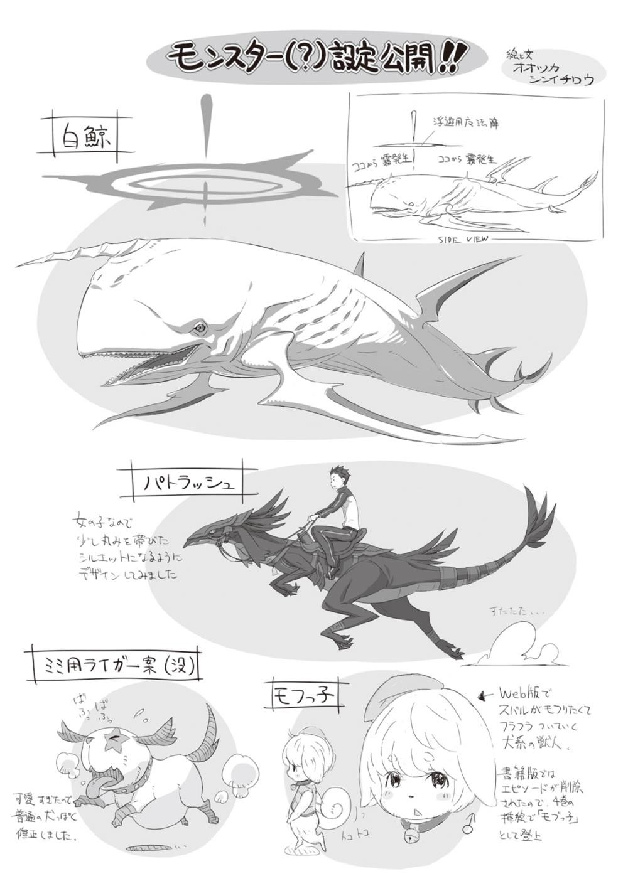
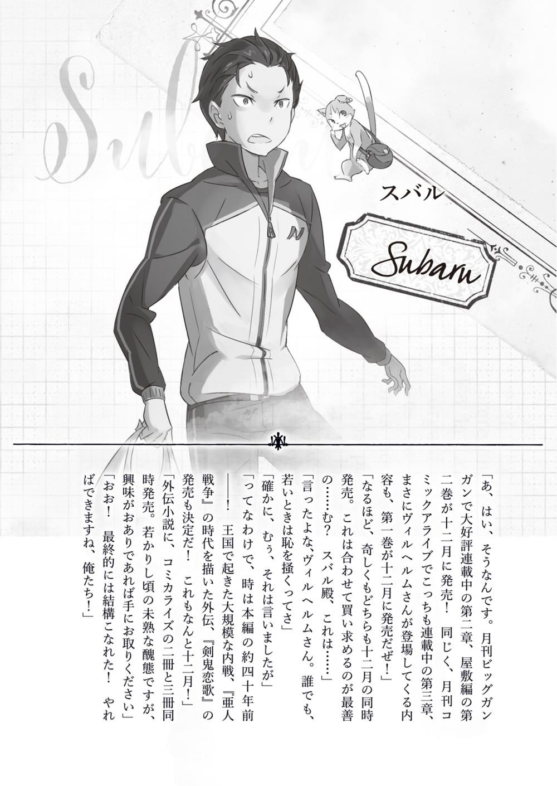
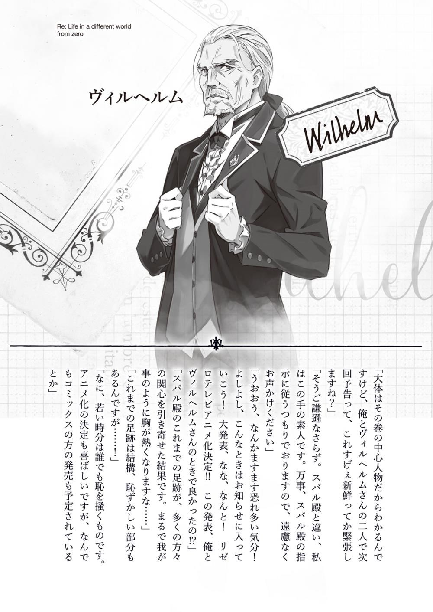

Всем привет! Это Таппэй Нагацуки. Некоторым из вас я известен как Кот Мышиного Цвета. Спасибо, что прочитали очередной том Re:Zero! Это седьмой по счёту том, что звучит уже довольно внушительно! Герой истории взрослеет от книги к книге, а вместе с ним и автор. Хотя в моём случае уместнее сказать «стареет»…

Итак, на этот раз у меня для вас важное сообщение! Наверное, многим уже известно, а тех, кто пока не в курсе, хочу известить, что аниме-экранизация «Re:Zero. Жизнь с нуля в альтернативном мире» подтверждена! И случилось это благодаря вашей поддержке! Огромное-преогромное вам спасибо!

В постскриптумах предыдущих томов я уже писал, что эта история началась как веб-роман на сайте Shousetsuka ni narou более трёх лет назад. Роман пришёлся по душе множеству читателей, и вскоре я получил предложение опубликовать ранобэ. Такое ощущение, что это случилось только вчера! Хотя на самом деле прошло уже больше двух лет, и всё это время, вплоть до настоящего момента, у меня не было ни одного спокойного дня. Помимо семи основных томов, мы издали два тома с дополнительными историями. О таком успехе я и мечтать не мог! За то, что это произошло, я должен благодарить всех вас! Стоит ли говорить, как я счастлив объявить о предстоящей анимеэкранизации! Ещё раз большое вам спасибо!

И всё же экранизация — не конечная цель моей работы. Впереди ещё много-много глав! Персонажам есть что рассказать о себе, и я буду рад, если вы, дорогие читатели, пройдёте этот путь со мной! Я надеюсь, с выходом аниме у произведения появится ещё больше поклонников и это непременно придаст мне сил трудиться дальше и писать ещё интереснее!

Однако место для постскриптума не безгранично, поэтому перехожу к словам признательности тем, кто помогал создавать эту книгу.

Во-первых, хочу поблагодарить редактора, господина И. Без вашего многолетнего содействия этой серии не было бы на свете! Большое спасибо, что подарили всем нам Re:Zero!

Иллюстратор, господин Оцука. Вы придали персонажам форму и цвет, именно вас мы должны благодарить за то обаяние, которым вы их наделили. Иллюстрация на обложке нового тома получилась очень мощной! Жду не дождусь, когда нарисованные вами персонажи обретут жизнь на экране!

Большое спасибо дизайнеру, господину Кусано, не только за великолепное оформление книги и логотипа названия, но и за дизайн всех многочисленных сопутствующих товаров по серии Re:Zero! Надеюсь, в будущем наше сотрудничество принесёт ещё больше плодов!

Не могу не упомянуть художников Даити Мацусэ и Макото Фугэцу, создающих очаровательный, а порой душераздирающий мир Re:Zero в манге! Последнее время всё больше читателей пишут мне, что увлеклись ранобэ именно благодаря манге. Большое вам за это спасибо и низкий поклон!

Также благодарю всех сотрудников редакции MF Bunko J, редакторов, корректоров и сотрудников книжных магазинов. Огромное вам спасибо!

Наконец, самую большую благодарность я выражаю вам, дорогие читатели, за тёплые слова поддержки, которые придают мне сил двигаться дальше. Спасибо!

Что ж, увидимся в следующем томе!

*Таппэй Нагацуки, август 2015г.* *(в возбуждённо-восторженном состоянии *

*после объявления об экранизации, хотя прошел уже целый месяц) *

