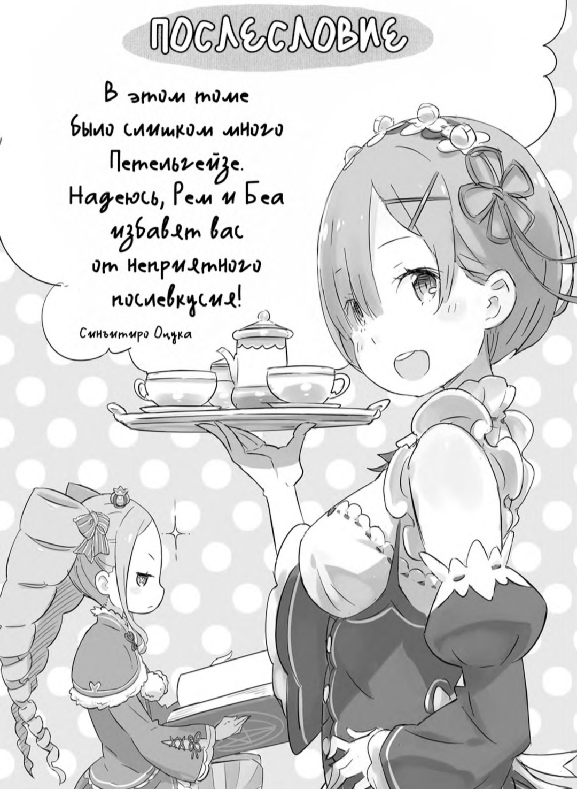
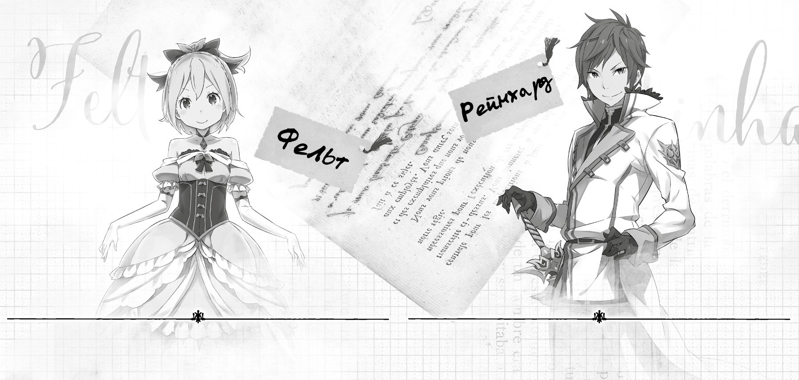

Привет! Это Таппэй Нагацуки. Некоторым из вас я известен как Кот Мышиного Цвета.

И снова благодарю за то, что прочитали очередной том RerZero!

Общий объём серии уже превысил десяток томов, эта книга — одиннадцатая по счету! История набирает обороты!

Также хочу отметить, что данный, восьмой, том выходит в преддверии телевизионной аниме-адаптации RerZero. Каждый день предвкушаю начало показа — и как автор, и как зритель.

Итак, с вашего позволения, слегка коснусь темы аниме адаптации. На официальной странице RerZero уже опубликованы имена создателей сериала, и, как вы можете сами убедиться, список весьма впечатляющий!

На самом деле, о создателях я сначала узнал от своего редактора, господина И. Признаться, я просто не поверил своим ушам, да и глазам тоже. Шли дни, на протяжении которых я узнавал всё больше об аниме-проекте, что приводило меня в полнейший восторг. А потом, когда появилась возможность встретиться вживую с создателями, я сначала подумал: «Ничего себе! Может быть, я сплю?!» А потом: «Если это реальность, то просто фантастическая реальность!»

С того дня, как объявили об аниме-экранизации, меня просто заваливают поздравлениями. Пишут и те, кто познакомились с этой историей благодаря книгам, и те, кто следят за моим творчеством со времён публикаций в интернете, а также друзья, старые приятели и знакомые. Ваши теплые слова очень вдохновляют, и мне неловко оставлять многочисленные вопросы без ответа. Разумеется, я должен соблюдать правила конфиденциальности и к тому же сам мало что знаю.

Не то чтобы мне совсем ничего не рассказывали, просто я из тех, кто боится спросить. Я опасался, что ответы прозвучат слишком хорошо, чтобы являться правдой. Думаю, вы согласитесь, что людям свойственно испытывать подобные опасения. Аниме-экранизация Re:Zero — предел моих мечтаний. Вот я и тревожился, что любое неосторожно сказанное слово превратит мечту в мыльный пузырь… Поэтому предпочёл забиться в свою авторскую скорлупу и липший раз не высовывать носа.

Конечно, я приходил на встречи, где обсуждали сценарий, и на студию озвучивания. Как автор оригинала, я старался быть максимально полезным. И должен сказать, создатели аниме — настоящие профессионалы! Можно только подивиться их мастерству! Думаю, аниме Re:Zero станет просто бомбой! Трансляция начнётся в апреле, так что не пропустите!⁵

(⁵В тексте указана информация, актуальная на момент выхода восьмого тома ранобз в Японии.)

Обычно я пишу небольшие послесловия, но на этот раз постскриптум будет чуть длинней. Спросите почему? Потому что очень о многом хочется рассказать!

В этом месяце, то есть в феврале 2016 года, у меня состоялась автограф-сессия на одном из тайваньских аниме-фестивалей. Это было моё первое путешествие за границу! Первый раз на Тайване! Первая автограф-сессия! Хотя нет, извините, насчёт автограф-сессии соврал, эта была третья. Но всё равно так много нового опыта я давно не получал!

Быть может, вы удивитесь, но Re:Zero издаётся и в других странах. За границей любят не только Re:Zero, но и аниме, и мангу, и вообще японскую литературу. Вот и этот фестиваль был посвящён популярным на Тайване японским комиксам и аниме. Каждый уголок площадки фестиваля был чем-нибудь занят!

Ещё меня поразили тайваньские фанаты: настолько тёплую встречу они устроили! Поскольку это была моя первая поездка за границу, честно говоря, я трясся от волнения. Прилететь в другую страну, преодолеть языковой барьер, встретиться с фанатами, которых, может, будет не так уж много…

Но всё прошло на ура! Я даже успел обняться с каждым читателем! Спасибо, Тайвань! А языковой барьер мы легко преодолели, так как гости фестиваля превосходно говорили по-японски.

Поскольку серия издаётся за рубежом, разумеется, книги печатаются в переводе. На Тайване рапобэ было выпущено издательством «Цинвэнь», и я склоняю голову перед его сотрудниками. Как бережно они передали тайваньскому читателю задумку автора!

Пока я гостил на Тайване, меня всё время сопровождали сотрудники издательства «Цинвэнь». Встретили, словно какую-нибудь знаменитость, кормили вкусными обедами и невероятным фруктовым льдом с манго. В общем, сделали мою поездку незабываемой!

До сих пор не верится, что мой роман, который сначала публиковался лишь в интернете, читают за рубежом! А теперь ещё и готовят по нему аниме-адантацию! Всё это похоже на сон! Не хватает храбрости ущипнуть себя. Но я обещаю, что приложу все усилия, чтобы эта чудесная явь и впрямь не обратилась в мираж.

Спасибо вам, тайваньские читатели! Надеюсь на вашу поддержку и в будущем! И на вашу, конечно, тоже, читатели из Японии!

Так-так, страницы книги уже на исходе, поэтому перехожу к традиционным благодарностям.

Первым делом хочу поблагодарить редактора, господина И, за то, что он всегда с улыбкой откликается на мои бредовые пожелания. Спасибо и за то, что сопровождали меня в поездке на Тайвань. Благодаря вам я чувствовал себя уверенней.

Далее снова хочу сказать спасибо художнику Оцука-сенсею. Ваши иллюстрации и рисунок для обложки, как всегда, великолепны! Отдельная благодарность за специальные рисунки, которые вы так быстро подготовили для тайваньского фестиваля.

Также благодарю дизайнера, Кусано-сенсея. Серия насчитывает уже более десятка книг, и как же потрясающе они смотрятся, если выставить их в ряд! Уверен, этот том тоже будет блестяще оформлен! Спасибо вам большое!

От всей души благодарю художников, что упорно трудятся над созданием манги по Re.Zero: Мацусэ-сенсея и Фугэцу-сенсея. Всякий раз, глядя на ваши рисунки, я думаю, какие всё-таки у вас очаровательные героини! Спасибо вам за это!

Не могу не упомянуть сотрудников редакции MF Bunko J, редакторов, корректоров, работников книжных магазинов.

Всем вам я крайне признателен. Большое спасибо!

Также я очень благодарен сотрудникам издательства «Цинвэнь», в особенности господину Лю. Пользуясь случаем, выражаю вам искреннюю признательность!

Наконец, самую большую благодарность я выражаю читателям этой серии, всем тем, кто посылает мне слова поддержки. Надеюсь, аниме вам тоже очень понравится!

Итак, встретимся в следующем томе!

*Таппэй Нагацуки.*

*Февраль 2016 года*

*(трясясь от волнения*

*в преддверии выхода аниме)*

— Госпожа Фельт, не смущайтесь вы так! Вам очень идёт это платье!

— Вы все сговорились, что ли?! Даже дед Ром — и тот пытается убедить меня в этом… Неужели у меня не осталось ни одного друга?!

— Вовсе нет. Я ваш друг, госпожа Фельт. Я ваш и только ваш рыцарь.

— Да ты рыцарь только на словах! Ладно, давай побыстрее закончим, чтобы я могла наконец переодеться. Переходи к делу!

— Как пожелаете. В таком случае сперва сделаю объявление. С апреля-месяца начнётся ТВ-трансляция аниме «Re:Zero. Жизнь с нуля в альтернативном мире».

— Ого, аниме? Ты не шутишь?! И где об этом сказано?

— На оби этой книги, а также об этом объявлено на официальном сайте Re: Zero. В аниме покажут не только подвиги Субару, но и его судьбоносные встречи с вами, госпожа Фельт, и со мной.

— Прям уж судьбоносные! Можно подумать, что-то особенное… Это была всего лишь случайность! Далее… Одновременно с выходом восьмого тома будет опубликован второй том третьей арки Re:Zero, выходящий частями в журнале Comic Alive!*

(*В тексте указана информация о публикации ранобэ и манги в Японии на момент выхода восьмого тома ранобэ.)

— Второй том третьей арки, именно в этом томе госпожа Фельт назначит меня своим рыцарем…

— Перестань каждый раз говорить так, будто мы парочка! Меня это бесит!.. Ох, в общем, ещё выйдет очередной том комикса, уже в июне этого года. Как раз в период трансляции аниме!

— Можно будет перечитать роман, посмотреть аниме, почитать комиксы… Прекрасный шанс полностью погрузиться в мир Re:Zero! Госпожа Фельт, может, и вам воспользоваться этим шансом и хорошенько взяться за книги и письмо?

— Ха, ну даешь! Нет у меня времени сидеть за партой. Мы же с тобой основная движущая сила этой истории, нам нельзя останавливаться!

— Госпожа Фельт…

— Всё, разговор окончен. Сейчас быстро переоденусь, а потом пойду к деду Рому и скажу всё, что я о нём думаю!

— Хорошо. В следующий раз я дам вам более свободное платье.

— Ты глухой, что ли?! Говорю же: я ненавижу платья!
