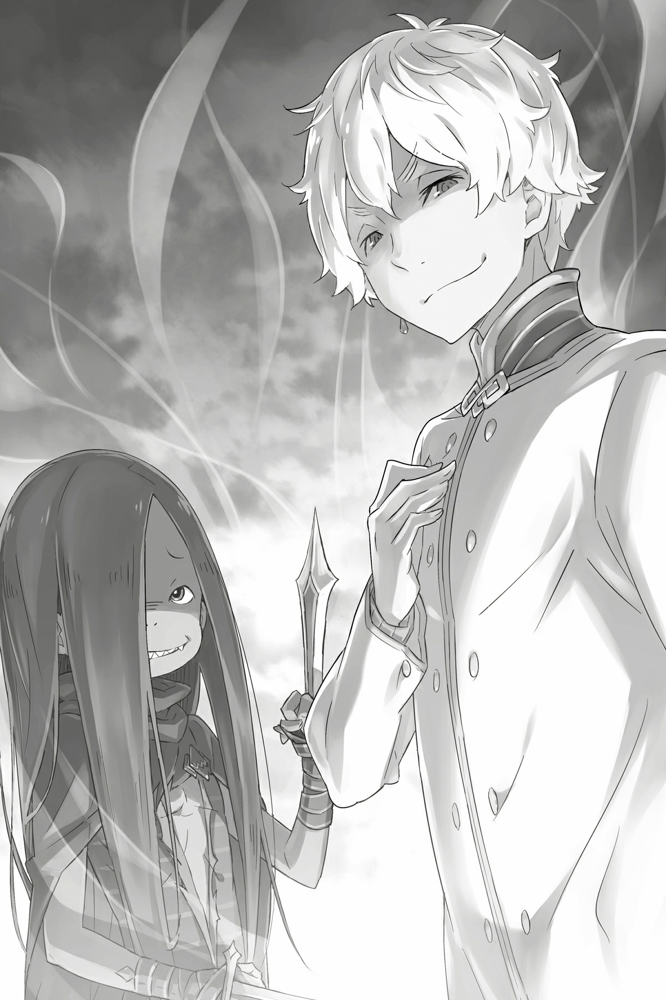

## 1

Повозка двигалась по тракту. Отдавшись тряске, Рем понуро сидела внутри и думала только о нём.

Девушка подняла лицо, прищурилась от слепящего утреннего солнца и теплого ветерка, посмотрела вдаль и увидела колонну драконьих повозок, возвращавшихся в столицу. В повозках лежали бойцы, пострадавшие в схватке с Белым Китом. Среди них были и тяжелораненые, которым оказали лишь первую помощь.

Но, несмотря на это, воинов переполняла радость победы: они возвращались в столицу триумфаторами. Бойцы исполнили заветную мечту, и чувство удовлетворения перекрывало физическую боль. Они везли отрубленную голову Белого Кита и воображали, с каким восхищением их будут встречать. Однако Рем не разделяла этой радости: её голова была занята мыслями о юноше, с которым пришлось разлучиться.

— Выглядишь невеселой, Рем. Тебя что-то гложет? — спросила госпожа Круш.

Рядом с Рем сидела Круш Карстен. Из-под лёгких доспехов виднелись бинты, но герцогиня держалась так, словно не была ранена. И всё же в её величественном облике сквозила усталость. Не желая показываться воинам в таком виде, она ехала в повозке, а не верхом на драконе.

Стоило Круш заговорить, как от её усталости не осталось и следа. Герцогиня кивнула Рем и сказала:

— С Феррисом и Вильгельмом остались храбрые воины, лучшие из лучших. Рикардо и его «Железный клык» тоже помогут. К тому же трудно представить, чтобы у Анастасии Хосин не осталось других козырей. Конечно, военная мощь Культа Ведьмы доподлинно неизвестна, но наша позиция отнюдь не проигрышная!

— Значит, я веду себя эгоистично, переживая за него? — спросила Рем.

— Тревога — такая вещь, которую при всём желании очень трудно унять. Но если причина в тебе самой, твердая воля и упорство помогут преодолеть напасть. Сложнеё, когда дело в другом человеке… Извини, я не мастер утешений.

Рем приуныла ещё сильнее. Заметив это, Круш поняла, что сказала лишнее, и потупилась. В тот же миг Рем неожиданно улыбнулась, ведь о ней заботилась сама герцогиня, всегда такая отстраненная. Увидев перемену в лице девушки, Круш удовлетворенно выпрямилась:

— Субару Нацуки был прав, у тебя красивая улыбка. Я думала, это бредни влюбленного подростка, но, как ни странно, он не преувеличивал!

— Я думаю, смех преобразит и вас, госпожа Круш. Обычно вы такая серьезная… Но улыбка определенно вас украсит, — ответила Рем.

— Возможно… Однако я из тех женщин, которые не умеют смеяться. Увы, этого не исправить, — пробормотала Круш, отведя взгляд. На её губах все же возникла легкая улыбка, но то была, скорее, насмешка над собой.

Самоирония Круш не на шутку удивила неуверенную Рем. В глазах девушки смелая и величественная герцогиня была лучшей из женщин. Конечно же, после Рам. Но признаться в этом Рем не успела. Стерев с лица тень улыбки, Круш сменила тему:

— Что касается Субару Нацуки и остальных… Все дело в Эмилии, точнее, в её происхождении. Я с самого начала подозревала, что Культ Ведьмы не оставит Эмилию без внимания. Должно быть, граф Мейзерс принял необходимые меры предосторожности.

— Я могу только догадываться о планах господина Розвааля. Поэтому расспросами вы ничего не добьетесь!

— Как жёстко! Мы же теперь союзники. Полагаю, он тебя не осудит, если поделишься со мной своими соображениями, — сказала Круш полушутливо, очевидно, желая разрядить обстановку.

Такая манера речи и правда ослабила тревогу Рем. К тому же догадка Круш не была лишена здравого смысла. Наверняка Розвааль подготовился к такому развитию событий. Усилия Субару окажутся спасительными для Розвааля и непременно вернут самому юноше уважение окружающих, которое он имел несчастье потерять. Даже иначе: благодаря победе над Белым Китом Субару не только восстановил свою репутацию, но и обрел мировую славу! Субару Нацуки — герой!

Для Рем было естественным думать о нем именно так, ведь Субару являлся её спасителем. Юноша, которого несомненно ждало великое будущее, — настоящий герой! И желания Рем были скромны: находиться с ним рядом и хоть иногда ловить на себе его взгляд. Всего лишь. Когда Рем думала о Субару, сердце её переполняли смешанные чувства. Умиротворение омрачалось мучительной тревогой, которая не давала расслабиться ни на минуту. Никто, кроме Субару, не вызывал у девушки таких перемен настроения.

— Субару и впрямь… очень трудный человек… — прошептала она, с нежностью вспоминая о возлюбленном, и грустно улыбнулась.

Глянув на неё искоса, Круш с удовлетворением откинула назад свои длинные волосы и стала молча смотреть вперёд. Вдруг она сощурила глаза цвета янтаря и тихонько произнесла:

— Хм…

В следующую секунду Рем услышала странный звук и уставилась на дорогу. Янтарные глаза Круш впились в драконьи повозки, ехавшие перед ними. Подозрительный шум доносился оттуда же. И в следующий миг причина беспокойства явила себя. Внезапно одна из повозок буквально разлетелась в щепки: чудовищный удар превратил её в груду обломков. Звук, последовавший за ударом, Рем ошибочно приняла за шум дождя: в воздух взлетел алый фонтан. Кровавая трагедия разыгралась в мгновение ока!

— Враг атакует! — прокричала Круш, потрясенная, но тут же стряхнувшая с себя оцепенение.

Бойцы моментально схватились за оружие. Рем тоже, несмотря на усталость, взяла в руку моргенштерн и поднялась. В кровавом тумане возник силуэт — безоружный, беззащитный человек, словно не сознающий опасности. Но то было зло. Безжалостное и абсолютное, бьющее наугад и без церемоний…

— Дави его! — закричала Круш рыцарю на козлах.

Тот, не теряя времени, изо всех сил хлестнул дракона поводьями. Издав рёв, похожий на боевой клич, зверь ускорился. Дракон мчался прямо на человека, стоявшего во весь рост и не думавшего двигаться с места. Но прежде чем зверь врезался в противника и превратил его в лепешку…

— Госпожа Круш!.. — закричала Рем, схватила герцогиню за тонкую талию и соскочила с повозки в сторону.

До рыцаря, сидящего на козлах, было не дотянуться. От досады Рем стиснула зубы. И тут послышался голос:

— Чёрт бы вас побрал! Может, хватит? Стоишь, никого не трогаешь, а тебя пытаются задавить! Полагаю, честные люди так не поступают!

Голос был спокойным и расслабленным, словно его обладатель вышел прогуляться по парку перед обедом. И если бы Рем действительно услышала его в парке, то не испытала бы такого потрясения. Но обстоятельства были совершенно иными: разнесенная в щепки повозка, разлившееся море крови…

На первый взгляд, человек был ничем не примечателен. Среднего телосложения, седоволосый, не высокий, но и не низкий. Белая одежда выглядела не богато и не бедно. Лицо тоже было обыкновенным. Одним словом, самая заурядная наружность. Вот только дракон, несшийся на этого человека, оказался рассечен на части, а управлявший им рыцарь превратился в кровавую кашу. Но больше, чем жестокости незнакомца, Рем поразилась его невозмутимости: человек стоял как ни в чем не бывало!

— Благодарю тебя, Рем, ты меня спасла! Но дела наши плохи… — Круш отстранила от себя одеревеневшие пальцы девушки и поднялась. С опаской поглядывая на безоружного мужчину, герцогиня бросила угрюмый взгляд на лужу крови, в которой плавали обломки повозки. — Да как ты посмел убить моего вассала?! Кто ты вообще такой, мерзавец? — холодно бросила она, испепеляя противника гневным взором.

Мужчина коснулся рукой подбородка и закивал:

— Да, точно, ты же ничего не знаешь обо мне! А вот я лучше осведомлен. Теперь в столице — да что в столице, по всей стране! — только о вас и говорят. Как-никак претендентки на престол. Конечно, меня всё это не интересует, но могу представить, какую невероятную тяжесть ты готова взвалить на свои плечи! Нелегко тебе придётся…

— Не заговаривай мне зубы! Отвечай, или прирежу! — прервала его Круш.

— Какое ужасное заявление! — продолжал тараторить мужчина, не обращая внимания на угрозу. — Но, не будь ты столь надменной, вряд ли захотела бы отвечать за всю страну! Правда, я нисколько не понимаю твоих чувств. Интересно, чем руководствуется человек, готовый взвалить на себя такую ношу? Но нет, я не умаляю твоих достоинств! А вот мне чужда подобная надменность. В отличие от тебя…

— Я предупреждала! — отрезала Круш и взмахнула клинком.

Клинок, соединявший в себе магию Ветра и Божественную защиту Наблюдения Ветра, отправил врагов на тот свет подобно молнии: они даже не успевали осознать факт удара. То был удар, который прозвали «Один взмах — сотня трупов». Так прозвали Круш после её боевого крещения. Она прогнала Великого Кролика — зверодемона, который вторгся во владения герцога Карстен. Меч Круш, способный рассечь даже толстенную шкуру Белого Кита, внес огромный вклад в победу над этим чудовищем. И если уж массивная туша была клинку нипочем, что и говорить о человеческом теле. Но…

— Разве станет воспитанный человек набрасываться с мечом на собеседников?!

Демонстративно отряхнувшись от невидимой пыли и вопросительно склонив голову, человек продолжал стоять на прежнем месте. Он не пытался уйти от удара и не сдвинулся ни на миллиметр. Но на его теле… Да что на теле, даже на одежде не было ни пореза! Совершенно необъяснимо!

Круш онемела от изумления, а Рем замерла, словно зачарованная неправдоподобным зрелищем. Мужчина нарочито вздохнул и нервно откинул назад прядь волос.

— Я не договорил. Не слишком учтиво перебивать другого, не находишь? Увы, ты совсем не знаешь этикета. Если человек говорит, не нужно мешать ему. Слушать или нет, решай сама, мне всё равно. Но затыкать человеку рот — это уже ни в какие ворота! Вопиющее неуважение! — тараторил мужчина и недовольно стучал носком обуви о землю.

Круш и Рем онемели от жуткой сцены. Незнакомец ткнул в них пальцем и продолжил, всё больше распаляясь:

— А теперь воды в рот набрала?! И как это понимать? Я задал вопрос и хочу получить ответ! Говори! Когда спрашивают, надо отвечать. Но ты молчишь! Ах, это же ваша свобода! Вот как вы ею распоряжаетесь! Ладно, дело хозяйское. Но ты хоть понимаешь, что это значит?

Незнакомец приблизился к Рем и Круш, блеск в его безумном взгляде стал ярче.

— Это значит, вы игнорируете мои права! То немногое, что у меня есть!

По спине Рем пробежал холод. Мужчина небрежно взмахнул рукой. В воздухе возникло слабое движение. И тут же всё, что было на линии взмаха, — земля, воздух, само пространство — раскололось! В воздухе закружилась отсеченная левая рука Круш, по-прежнему сжимавшая невидимый меч, и, разбрызгивая кровь, упала на землю. Герцогиня рухнула на землю и задергалась в конвульсиях от адской боли.

— Госпожа Круш!.. — Несколько секунд Рем ничего не соображала, затем очнулась и бросилась к герцогине.

Девушка приложила руки к кровоточащей ране и, выжимая из себя последнюю ману, попыталась остановить кровь. Срез оказался идеально ровным, и оружие, которым он был сделан, вызвало у Рем неуместное восхищение.

— Феррис… Фе… а-а… — Круш ошалело вращала глазами, из её горла вырывались нечленораздельные стоны.

Правой рукой она схватила Рем за ногу и сдавила её до треска костей. Стиснув зубы и стойко снося эту боль, Рем бросила на злодея взгляд, полный ярости. Девушка никак не могла взять в толк, как ему удалось уйти от удара и нанести ответный.

Заслонив своим телом Круш, Рем думала, как же сбежать, и тут её посетила неприятная мысль. Рем внезапно осознала, что ни один из рыцарей не пришел на помощь!

Рем содрогнулась от дурного предчувствия. В тот же миг позади неё раздался пронзительный юношеский голос:

— А-а… Сколько ни ем, никак не могу насытиться! Вот ради чего мы живем! Чтобы жрать, вгрызаться, впиваться, глодать, набивать пузо! Чтобы обжираться! А-а! Вкуснотища!

Рем снова продрал мороз по коже. Девушка испуганно обернулась и увидела окровавленного юношу. Он стоял посреди скопления повозок и пинал лежавших на земле рыцарей. Это был невысокий человек с гривой темно-каштановых волос, которая спускалась до самых колен. Ростом он был примерно с Рем, но младше её на два-три года. Под грязными волосами виднелись лохмотья одежды. Ступни и кисти были измазаны в грязи и чужой крови. Рыцари у его ног лежали неподвижно. Пока седовласый мужчина атаковал Круш, малец взял на себя рыцарей и погубил всех до одного!

— Кто… вы?.. — проговорила Рем дрожащими губами. Девушка была потрясена тем, что не заметила сражения. Зажатая с двух сторон странными незнакомцами, Рем подняла Круш на руки и сделала шаг назад. Кровь из раны герцогини окрашивала землю темно-красным. Воздух стал холодным, точно природа насмехалась над Рем, и без того испуганной.

Услышав дрожащий голос Рем, мужчина и юноша переглянулись. Затем, словно репетировали заранее, кивнули и скорчили дьявольские ухмылки:

— Я — греховный архиепископ Культа Ведьмы, олицетворяющий Жадность, Регул Корниас!

— А я — греховный архиепископ Культа Ведьмы, творящий Чревоугодие, Лей Батенкайтос!

## 2

Снова Культ Ведьмы, и снова архиепископы греха!

Услышав эти слова, Рем оцепенела. Тем временем юноша, назвавшийся Леем Батенкайтосом, заинтересованно оглядел лежащие на земле тела рыцарей и облизнулся:

— Идея отобедать тут поистине прекрасна! Богатый урожай! Великолепный! Замечательный! Чудесный! Восхитительный! Потрясающий! Наконец-то мы утолим голод!

— Честно говоря, вот этого я в тебе не понимаю, — вмешался Регул. — Почему ты не можешь довольствоваться тем, что имеешь? Человек не в состоянии взять больше, чем вмещают его ладони. Пойми это и умерь свои аппетиты!

— Мы не нуждаемся в проповедях, мы их ненавидим! Нам нет никакого дела до твоих нравоучений! А волнует нас только пустой желудок, на всё остальное плевать! — с этими словами архиепископ Чревоугодия Батенкайтос звучно втянул повисшую на губе слюну.

Архиепископ Жадности Регул пожал плечами.

Появление сразу двух архиепископов вогнало Рем в ступор. Но девушка сумела преодолеть оцепенение и напрягла все умственные ресурсы, отчаянно придумывая способ выбраться из беды. Силовые методы не годились — двоих не одолеть. Остановить кровотечение у Круш удалось, но состояние герцогини было по-прежнему тяжелым. Живы ли рыцари, Рем не знала, поэтому рассчитывать на их поддержку не могла. Да и сама Рем истратила на лечение последнюю ману, поэтому даже превращение в демона вряд ли спасло бы ситуацию.

Рем мельком поглядела по сторонам, но не обнаружила поблизости бойцов «Железного клыка». Наемники везли раненых и голову Белого Кита. Возможно, командовавший ими Хэтаро улучил момент и отдал приказ уходить. Если Рем выиграет время, не исключено, что он успеет вернуться с подкреплением… Однако верилось в это с трудом.

— Вы здесь потому, что мы убили Белого Кита? Хотите отомстить за зверодемона? — спросила Рем, пытаясь понять мотивы врагов.

— О, превратно! Нас интересует не мертвый Белый Кит, а те, кто его убил. С большим трудом, но убили! А ведь он творил, что хотел, целых четыреста лет! Я рассчитывал на богатый стол, но реальность превзошла все ожидания! — воскликнул Батенкайтос, обнажив острые, как иголки, зубы. — Любовь! Рыцарский дух! Ненависть! Одержимость! Радость победы! Они копили это долгие годы! Осталось довести до кипения, подержать на огне и с чувством удовлетворения проглотить! Что может быть изысканней такой пищи?! Ничего! Ровным счетом ничего! О ненасытность! Ах, обжорство! Да возрадуются наши сердца и наши желудки!

Сказанное было за гранью понимания Рем.

Батенкайтос разошелся не на шутку. Он продолжал извиваться, словно в припадке, перевёл взгляд на Регула. Тот сделал удивленное лицо и замахал руками:

— Будь спокойна! Я совсем не такой. Я здесь по совершенной случайности. Разве я похож на этого обжору? Ничего общего с этим хамом у меня не было и нет! В отличие от него, жалкого и вечно голодного, я довольствуюсь тем, что имею. — Регул развел руками, которыми только что искалечил Круш, и широко, радостно улыбнулся. — Терпеть не могу конфликты! Я самый что ни на есть обыкновенный и миролюбивый человек и буду только рад, если в мире воцарится спокойствие. Большего и не надо. Лучшего и не пожелать. Такими крохотными ладонями, как мои, много не нагрести. Сохранить бы, что имеешь: себя самого как отдельную личность.

Регул, сжав кулаки, упоенно произносил свою речь. Правда, она плохо вязалась с его недавними действиями, когда он одним взмахом убил дракона и нескольких рыцарей, а также нанес тяжёлую рану женщине.

Таких, как Батенкайтос и Регул, называют помешанными. Первого били судороги от необъяснимого аппетита, второй самодовольно упивался эгоистичными речами. Оба были типичными адептами Культа.

В Рем все сильнее вскипала ярость. Девушка положила на землю Круш, которая была уже без сознания, и поднялась. В руках Рем возникло шипастое орудие. Последние остатки маны завертелись в пространстве вихрем, образуя вокруг Рем частокол из сосулек.

При виде этого Батенкайтос и Регул изменились в лице.

— Ты меня слышала? Я же сказал, что не желаю никому зла! Похоже, ты меня ни во что не ставишь и нарушаешь мои права! Даже такой бескорыстный и великодушный человек, как я, не может закрыть на это глаза! — возмутился Регул, и в глазах его вспыхнул свет.

— Ты закончил, бесстыжий адепт? — бросила Рем в лицо Регулу. — Когда-нибудь непременно явится герой, чтобы истребить вас всех до единого. И вы очень пожалеете, что были такими эгоистичными и самодовольными и принесли столько бед! Это будет тот самый герой, которого я люблю!

— Что?! Герой? Мы только за! Если ты настолько в нём уверена, этот парень станет настоящим деликатесом! — неожиданно обрадовался Батенкайтос и, восторженно хлопая в ладоши, вонзил в Рем оценивающий взгляд.

Юноша глядел на неё не как на врага и уж тем более не как на женщину. То был взор голодного демона, предвкушающего пир.

Рем гордо подняла голову:

— Старшая служанка в доме графа господина Розвааля… Мейзерса… — Рем вдруг умолкла и помотала головой. сейчас надо было назваться по-другому. Так, как она действительно хочет: — Рем, помощница Субару Нацуки, моего единственного и самого любимого человека. Того, о ком будут слагать легенды!

На лбу Рем сверкал прекрасный белый рог, питавший демоницу маной из пространства. Тело девушки наполнила сила, рука, державшая моргенштерн, начала ритмично покачиваться. А зависшие в воздухе сосульки в любой момент были готовы поразить врага. Рем широко распахнула глаза, в её сознании возник образ возлюбленного:

— Трепещите, адепты Культа. Мой герой обязательно придет, чтобы наказать вас!

Рем взмахнула железным шаром, сосульки сорвались с места, но тут… девушку подхватило, точно порывом ветра! Рем понеслась прямо на Батенкайтоса, разинувшего зубастый рот.

— Да-а, великолепная стойкость! Что ж, кушать подано! — воскликнул он.

Дальше было столкновение. Рем успела лишь подумать: «Надеюсь, когда он узнает о моей гибели, его сердце сожмется хоть на миг…»

То было последнее желание…
