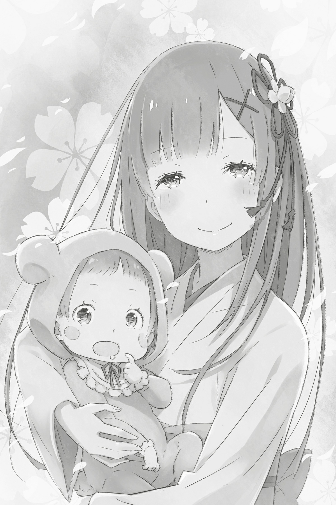

## 1

Под безоблачным небом раздавался громкий плач. Рыдала совсем маленькая девочка: кричала изо всех сил, надрываясь. Увы, привилегией беззастенчиво выражать свои чувства обладают только младенцы…

Подумав об этом, Субару ужаснулся, ведь такая мысль могла прийти в голову лишь тому, кто уже распрощался с детством.

— Золотая пора… — пробормотал Субару, мысленно сетуя на скоротечность времени. — Может, впасть в младенчество, как Спика?

— Если взрослый дядя будет так себя вести, прикрывать его я не стану! — серьезно предупредил стоявший рядом мальчик.

Между тем Спика — именно так звали младенца, которого Субару держал на руках, — сделала глубокий вдох и…

— А-а-а-а-а!

— Опять за своё! Эй, Ригель, ты брат ей или нет? Придумай что-нибудь!

— Неужели ты сам ничего не можешь сделать?!

Так и топтались они по оживленной улице, спихивая друг на друга ответственность за ревущего малыша. Шум привлекал внимание прохожих, но, увидев крикливую троицу, люди тут же теряли интерес — дело-то житейское. Ребенок продолжал кричать, а няньки-мужчины ходить кругами. Находясь в центре этой комичной, но утомительной ситуации, Субару закрыл лицо рукой и простонал:

— Чёрт, как же очерствели сердца людей! Ребенок визжит как резаный, а им плевать! Никто не протянет руку помощи!

— Нашел время драматизировать! Вот вернется мама, покажет тебе!

— А я уже здесь.

Мальчик по имени Ригель внезапно умолк и в испуге обернулся. Субару обратил взгляд за спину ребенка и нахмурился:

— Закончила с покупками?

— Да, взяла все, что надо. Вижу, вам тут несладко приходится…

— Ещё бы! Из Спики энергия так и прёт! Научится ходить — будет из мужиков веревки вить! Просто дьяволенок, ужас!

Пока Субару причитал, держа Спику на руках, девочка протянула к женщине свои маленькие ладошки. Ей определенно хотелось сменить няню.

— В общем, если она снова разревётся, я не выдержу! Все, пост сдал.

— Пост принял.

Несмотря на раздражение, передавая младенца, Субару был чрезвычайно осторожен и обращался с ребёнком как с сокровищем. Происходящее вызвало у женщины легкую улыбку. Взяв Спику на руки, она прижала малышку к груди и принялась тихонько убаюкивать:

— Нехорошие папа с братиком! Ну ничего, скоро Спика станет большой и задаст им!

— Эй, может, не надо делать из ребенка вундеркинда! Она ведь ещё ни слова не понимает!

Субару представилось, как жена и дочь, зажав их с Ригелем с двух сторон, распекают незадачливых шутников на все лады.

— Слушай, а это не так плохо, как я думал! Совсем не плохо! Я бы даже сказал, прекрасная картина вырисовывается!

— Ну уж нет! Не хватало мне нагоняев от младшей сестры! Как я людям в глаза буду смотреть?!

— Пока мы тут суетились, от нашей репутации камня на камне не осталось! Я вижу твоё будущее! Старший брат, который в конце концов без ума от сестренки и так балует её, превращается в тряпку. Ты — король сискона![^3] — заявил Субару, хищно шевеля пальцами.

— Если ты ведешь себя как тряпка, не значит, что я такой же! Не дождётесь! — с негодованием возразил Ригель.

Но женщине с голубыми волосами и младенцем на руках слова Ригеля явно не понравились.

— Ригель! — сказала она, нахмурившись. — Как ты смеешь болтать такое на людях?! Бессовестный!

— Но… ведь…

— Твоя мать не потерпит никаких «но» и никаких «ведь»! К тому же всё это глупости! — Выбранив Ригеля, она чмокнула Спику в щечку и гордо заявила: — Я никогда не относилась к твоему отцу как к тряпке! Он всегда для меня номер один!

А затем стыдливо залилась румянцем. Уж лучше плакать и кричать на всю улицу, чем повторять такие слова.

Ригель вскинул руки в знак капитуляции. Субару, чувствуя неловкость, поскрёб щеку. Рем с любовью поглядела на свою семью и провела рукой по прекрасным длинным волосам цвета небесной лазури, которые нежно ласкал ветерок.

## 2

Дело происходило в городе Банан государства Карараги. Субару сидел на скамейке в парке со множеством игровых площадок и рассеянно глядел по сторонам.

Мальчик с зачесанными назад голубыми волосами, Ригель, скакал по парку вместе с другими ребятишками. Они играли в «колдунчики». Хотя отцу он дерзил, было в этом нахаленке и детское очарование.

— Сделать бы что-нибудь с его убийственным взглядом… — вздохнул Субару.

— Это невозможно. Недобрый взгляд Ригеля — часть его индивидуальности. Как бы он ни веселился, незнакомцам всегда будет казаться, что мальчишка замышляет какую-то гнусность. Такой уж наш сынок!

— Эй, я все слышу! А от твоей защиты, мамочка, мне ещё больней! — сердито заметил Ригель.

Мальчик замер на месте, так как в данный момент был «заколдован», а родители, Субару и Рем, замахали на любимого сынишку руками.

Недоброе выражение лица Ригель унаследовал от папы. Мальчик был точь-в-точь Субару в детстве. Выходит, его ждёт похожее будущее…

— Если б двадцать лет назад мне сказали, что стану вот таким, я бы покрылся мурашками!

— Хочешь сказать, судьба подарит ему идеальную жену, которая будет прекрасно готовить, безупречно вести домашнеё хозяйство и делать всё, чтобы угодить мужу? Такое будущее ты имел в виду?

— Это бывает только в сказках… Стоп, так ты о нас?! — Субару хлопнул себя по лбу, а Рем прыснула со смеху:

— Если будешь соглашаться с каждым моим словом, я точно зазнаюсь!

— Но с чем тут спорить? Истинная правда! Я и впрямь живу как в сказке!

Рем действительно упомянула далеко не все свои достоинства. Но после полудня в парке было полно народа. Начни Субару с Рем прилюдно ворковать, назавтра только о них бы и шептались. Хотя в проявлении чувств и не было ничего постыдного, сейчас Субару хотел просто наслаждаться своим счастьем.

Мальчик резвился на игровой площадке, а Рем нежно обнимала дочку сидя рядом с Субару. Незаметно он стал клевать носом.

— Ой!..

— Если хочешь вздремнуть, можешь опереться на меня. Прижать тебя к груди не могу — у меня на руках Спика.

Субару приоткрыл один глаз и вдруг понял, что его голова уже лежит на плече Рем. Рядом с ней витал аромат угля, и было тепло. Субару улыбнулся и посмотрел на Спику. Волосы чёрные, как у папы, черты прелестные, как у мамы… Невинное и хрупкое, славное создание!

— Эй, Спика! Вот уж не думал, что любимая дочурка окажется хитрой бестией и захватит священную территорию, которая по праву принадлежит мне!

— Моя грудь будет занята до вечера, так что тебе придётся подождать.

— Эй, следи за тем, что болтаешь в парке средь бела дня!

Субару сконфуженно огляделся, а когда увидел, что его избранница покрылась ярким румянцем, добавил: — Ты просто прелесть!

— Потому что у меня любящий муж.

Субару застенчиво отвел взгляд и положил голову на плечо Рем. Её колышущиеся на ветерке голубые волосы приятно касались лица Субару, и он потёрся щекой о её плечо.

— Извини. Просто мне так хорошо с тобой. Вот я и беру пример со Спики — сижу тихо и мирно. Не то что Ригель — никак не угомонится. Эй, Ригель!

— Да слышу я! Хватит меня дергать!

— Ригель, потише, сестренка спит!

— Так нечестно! — прокричал Ригель, застыв на месте, но ни отец, ни мать не обратили на него внимания. Что ни говори, а положение у заколдованного Ригеля было крайне незавидным.

Внешне и по характеру мальчик был похож на отца, но дети не делали его изгоем. Ригелю повезло с добрыми друзьями, которые не допускали в его адрес злых шуток.

— Ты не можешь стать такой, Спика! Твоего старшего брата хватает с лихвой! Хотя ты похожа на свою маму, так что у тебя светлое будущее. Молюсь лишь о том, чтобы тебе не повстречался такой нехороший человек, как я.

— А таких, как ты, больше и нет. Мой дорогой — лучший во всем мире.

Субару натянуто улыбнулся в ответ на восторженный возглас Рем. На какое-то время между ними повисло молчание, но его никак нельзя было назвать неловким. В лучах заходящего солнца он с тоской смотрел на своего сына, которого дразнили друзья, а сам прижимался к жене, держа на руках их дочь, и отдыхал. То было чудесное, счастливое время.

— Субару…

Субару услышал своё имя и утонул в прозрачной голубизне влажных глаз Рем.

— Давно ты не называла меня по имени… Все «дорогой» да «наш папа».

Рем поджала дрожащие губы. Раньше, в те времена, когда они только-только стали любить друг друга, Субару часто видел на её лице такое выражение. Рем пыталась это скрывать, но Субару всё равно замечал. Потому что не мог оторвать от неё глаз.

Ветер трепал его волосы. Субару улыбнулся. Выйти всей семьей на прогулку предложила Рем. И Субару кое о чем догадывался…

— Сегодня ровно восемь лет с того самого дня.

— Ты вспомнил?

— Это ведь был поворотный момент для меня. Точнее, для нас обоих… Я не «вспомнил», я никогда не забывал! Да разве забудешь такое?..

В тот день они подчинились судьбе: бросили все и сбежали вдвоем. Махнули рукой на всё, кроме одного… Решение, принятое тогда, и любовь Рем — вот то, чему Субару был обязан своим счастьем.

— Субару…

С тех пор как они сбежали в Карараги, Рем умышленно перестала называть его по имени. Видимо, так девушка хотела распрощаться с прежней жизнью. Субару не решался спросить её об этом, а Рем никогда не объясняла причин. Но сегодня она нарушила традицию и назвала его по имени, чтобы задать вопрос:

— Ты… не жалеешь?

— Жалею?!

— Да… Что мы сбежали. Что мы всех бросили. Что ты…

— Так, я забираю Ригеля и Спику, и мы уходим домой! А, ладно, Ригелю и тут неплохо…

Ригель скорчил недовольную гримасу.

— У нас с мамой важный разговор! — сообщил ему Субару, чем поверг сына в бездну отчаяния. Субару снова повернулся к Рем: — Нашла время! Прошло целых восемь лет! Я сто двадцать пять раз говорил, но, похоже, все без толку!..

— Да…

— Я люблю тебя больше всех на свете! Ты — моя единственная, а я — твой. И ты не какая-нибудь дешёвка, чтобы использовать тебя как запасной вариант!

Глядя в голубые глаза, он тихонько щелкнул Рем по носу. А затем приблизил лицо почти вплотную и добавил:

— В тот день я поклялся, что буду твоим без остатка. И с тех пор ничего не изменилось. Ради тебя я готов на всё, на любые жертвы! Я живу ради тебя. Ради тебя и ради наших детей!

Рем наморщила носик и закрыла глаза, а Субару неожиданно коснулся её губ. Они были так близко, что чувствовали дыхание друг друга. На лице Субару заиграла шаловливая улыбка. Время шло, но Субару оставался все тем же озорником.

— Ну что, успокоилась?

— Прости… Мне постоянно неспокойно. Ведь я люблю тебя все сильней и сильней. И хотя

кажется, что лучше не бывает, ты делаешь меня счастливей с каждым днем! Я очень счастлива, и я тебя люблю, потому мне и тревожно, — проговорила Рем со слезами на глазах, слегка качая головой.

— Будь спокойна! Я тебя не отпущу и сам никуда не денусь. Мы будем вместе, пока ты меня не разлюбишь.

— Субару, я никогда тебя не разлюблю! — заверила Рем, переполняемая чувствами.

— Значит, мы всегда будем вместе. Я люблю тебя, Рем, — ответил Субару и снова поцеловал её.

От неожиданности Рем застыла: горячий язык Субару проник между её губ. Когда Субару отнял губы, Рем дышала глубоко и часто.

— И вообще, — снова заговорил Субару назидательным тоном, — не смей думать, что я выбрал тебя, пойдя на компромисс. А то что же получается? Ригель и Спика родились из сочувствия? Нет! Спика — плод нашей любви, причем спланированный, а Ригель родился в результате нашей молодой, бурной страсти!

— Помнишь, нам так тяжело было, когда он появился… — Рем улыбнулась трогательным воспоминаниям.

— Мы только нашли работу и дом. Надо было потихоньку налаживать быт… Мы были молоды и нетерпеливы, — отозвался Субару.

— Ты очень уставал на работе, но с приближением ночи в тебе откуда-то возникали новые силы.

— О, тогда я был полон энергии!

— Помнишь, я забеременела в самый неподходящий момент — меня только приняли на работу. Голова шла кругом! — все больше предавалась воспоминаниям Рем.

— Никто не любит признавать ошибки молодости… — взволнованно пробормотал Субару, глядя издалека на недовольного Ригеля.

По-видимому, мальчик понял, что в разговор родителей лучше не встревать, и потому смолчал. Субару мысленно похвалил сына.

— Но я очень обрадовалась, когда забеременела Ригелем!

— Я тоже обрадовался! Помню, узнав, чуть штаны не обмочил от восторга. А когда спросил, не сон ли это, ты так мне вмазала, что случился кровавый потоп…

Рем тогда была в панике и зарядила Субару таким хуком, что он едва не пробил дыру в стене съемного жилища. Очнувшись, Субару почувствовал то же, что и после Посмертного возвращения.

В общем, тот момент, когда Рем объявила о своей беременности, Субару помнил в мельчайших деталях. Помнил он и те теплые чувства, что всколыхнулись тогда в груди. Однако Рем отрицательно дернула головой и возразила:

— Моя радость была совсем другого рода, не такая, как твоя! Тогда я обрадовалась тому… что ты останешься со мной. — Рем сделала паузу и продолжила: — Ригель послужил связью между мной и тобой. Связью, которая обрела определенную форму. Пусть нехорошо так говорить, но благодаря малышу мы оказались скреплены прочными узами, которые не разорвать. Вот чему я обрадовалась!

В те дни Рем была охвачена мучительной тревогой. Спалив все мосты, разорвав прежние связи, сбежав в другую страну, Субару и Рем могли положиться лишь друг на друга. Поэтому мысль о том, что Субару бросит её, приводила Рем в ужас. Её неуверенность могла сравниться только с неуверенностью Субару. Сомнения в себе обрекали Рем на бесконечные метания между радостью и страхом. Жизнь с Субару была для неё одновременно и высшим счастьем, и страшной мукой. Но с появлением их крохи муки кончились…

— Ты не верила?!

— Я верю тебе, Субару, больше, чем кому бы то ни было на свете!

— Нет, я о другом. Ты не верила в себя?

Слова Субару заставили Рем встрепенуться. В конце концов она кивнула. Рем считала, что недостойна мужа. Она ощущала себя незначительной по сравнению с ним, и это её беспокоило. Беспокоило настолько, что Рем не замечала: похожее чувство не дает покоя и самому Субару!

Представив, как они с женой соревнуются в самоуничижении, Субару грустно усмехнулся. Рем надула щеки:

— Можешь смеяться! Да, я и правда была дурочкой. Остается только потешаться надо мной…

— Вовсе нет! Я просто подумал, что наши характеры похожи как две капли воды! И вновь убедился, что у меня самая прелестная на свете жена!

От неожиданности Рем смутилась и залилась краской. Глядя на неё, Субару ощутил в груди тепло и ясно осознал, как любит жену. Рем была для него всем. Субару любил её и хотел кричать об этом. Иногда он так и делал.Страстную пару знали все в округе.

— Ригель, Спика… — вдруг ласково произнесла Рем.

— А? — Субару повернулся к жене.

Рем мотнула головой и, глядя на мужа исподлобья, сказала:

— Звездные имена. Ведь в стране, где ты жил, так зовутся звезды.

— Ну да. У моего отца был скверный характер, но я искренне восхищен тем, что он назвал меня Субару[4]. Классное имя! Тоже, кстати, звездное.

Когда Субару учился в начальной школе, ему дали домашнеё задание: исследовать происхождение своего имени. Тогда-то он и обнаружил, что имя связано с астрономией. С тех пор атлас звёздного неба стал его настольной книгой. Субару выучил названия почти всех звёзд и планет и, когда нужно было придумать какое-нибудь имя…

— Я всегда брал название одного из небесных тел. В интернете тоже сидел под никами, которые позаимствовал у звёзд. Если потребуется взять псевдоним, воспользуюсь тем же методом. Оригинально ведь!

— Я мало что поняла… Но заимствовать имена звёзд, по-моему, прекрасная идея. Когда у нас родится третий малыш, снова так и сделаем!

— Не слишком ли рано говорить о третьем? Спика ещё младенец!

— Все, что не связано с кормлением, можно поручить Ригелю. Думаешь, почему я говорила, что никаких детей, пока Ригель не подрастет?

— С тобой не забалуешь! Хотя я тоже спуску не дам, — усмехнулся Субару.

Затем он встал со скамейки, отряхнул зад и протянул руку Рем, глядящей на него снизу вверх.

— Пойдем домой? Столько народу, что не пообнимаешься вволю!

— Это точно, — сказала Рем и взяла его за руку. — Давно мы не тискались, а я бы сейчас затискала тебя до смерти!

— О, даже не знаю, справится ли теперь моё либидо с энергией демона… — боязливо пробормотал Субару и помог Рем подняться.

Не успела Рем и пикнуть, как Субару заключил их со Спикой в объятия и наслаждался теплом родных людей.

— Ну что, пойдем? В наш дом…

— Да, дорогой.

В одну руку Субару взял сумку с покупками, в другую — ладонь Рем и зашагал вперёд. Рем со Спикой шла на полшага позади.

— Продолжаешь в одиночку изображать ледяную статую? — окликнул Субару Ригеля, который так и стоял, застыв посреди парка. — Нам скучно наблюдать за вашей вялой игрой, поэтому мы решили вернуться домой. А ты сегодня заночуй у кого-нибудь из друзей.

— Уже из дому готовы меня выгнать, как не стыдно! Думаете, я не видел, как вы средь бела дня целовались и обнимались?!

— Ах ты ревнивец! Ригель, имей совесть. Сейчас Рем моя и только моя.

— Да ну тебя! — огрызнулся Ригель, но его показное возмущение быстро иссякло. Мальчик сделал глубокий вдох и сказал: — Так, спокойно! Не позволяй папаше вить из тебя веревки. Спокойно, спокойно… Всё, я спокоен. Так о чём вы там с мамой трепались?

— О твоём имени. Сначала мы подумывали назвать тебя Вегой.

— Звучит круто! Почему же не назвали?

— Вспомнил связанную с Вегой легенду и решил, что это будет слишком жестоко. Пускай я не идеальный отец, но обрекать сына на то, чтобы он виделся с возлюбленной раз в год, это уж слишком! Без близкого человека нельзя. Вот я без своей Рем и минуты не протяну!

— Да, Субару, и я без тебя!

— А давайте вы не будете впутывать меня в свои любовные разговорчики! — вновь вспылил Ригель и топнул ногой.

Другие дети, игравшие в «колдунчики», уже забыли о Ригеле, чем тот и воспользовался. Наконец ребятня всё-таки заметила его движения.

— Ригель шевельнулся! Правила нарушать нельзя! — рассердился один из мальчиков.

Ригель фыркнул и снова замер. Субару похлопал его по плечу и сказал:

— Того, кто нарушил правила, ждёт наказание. «Колдун» должен щекотать его до тех пор, пока нарушитель не взмолится о пощаде. Держись!

— Да ты только что придумал это правило и бровью не повел… Эй, ребята, вы чего? Подождите! Не слушайте его! Не надо… А-а-а-а!..

Друзья всей гурьбой стали наступать на Ригеля, и он бросился наутек. Однако далеко убежать не успел. Мальчика повалили на землю, и к нему приблизилось несколько хищных рук…

— Не поминай лихом, дружок! Ты был хорошим сыном, только вот отец у тебя негодяй.

— Ригель, у нас с папой очень важный разговор, поэтому не возвращайся домой до вечера. И ещё: я запрещаю тебе использовать рог. И одежду не порви!

— Я вам это припомню, предки-изверги! — прокричал Ригель сквозь хохот. Ребята набросились на него со всех сторон и стали щекотать. Вопли старшего брата оказались так заразительны, что Спика тоже принялась визжать и радостно смеяться.

Субару возлагал большие надежды на Ригеля. Он искренне любил сына, но проявлял своё чувство несколько странно… Так, рука об руку с Рем, они отправились домой. Туда, где Субару проводил время с любимой семьей, безмятежно и счастливо.

— Субару…

— А?

Рем вдруг потянула его за руку. Субару остановился. В тот же миг налетел сильный порыв ветра. Субару машинально зажмурился, а открыв глаза, увидел, как трепетно дрожат и сверкают на солнце голубые волосы Рем.

В глубине души Субару догадывался, кому подражает Рем, отращивая волосы. Но теперь при упоминании длинноволосых женщин первой на ум Субару приходила та, что глядела сейчас ему в глаза, — самая дорогая женщина на свете!

Длинные волосы Рем трепал ветер. Она поудобнеё перехватила любимое дитя и улыбнулась. И не было для Субару улыбки милее и дороже, чем эта…

— Я самая счастливая на свете! — сказала Рем.

[^3]: Субару — так в Японии называют звездное скопление Плеяды.
