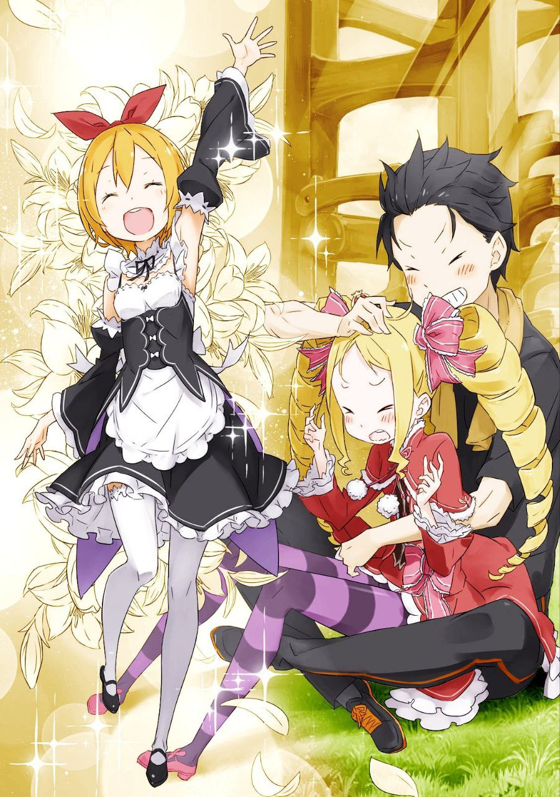

※ ※ ※ ※ ※ ※ ※ ※ ※ ※ ※ ※ ※

Сильно оттолкнувшись от земли, он рванул вперёд.

Пот, стекающий со лба, подхватывался ветром и скользил по краям глаз, но Субару лишь моргнул, игнорируя его. Лёгкие болели от вдыхаемого кислорода, а тело словно сжималось, сосредоточив напряжение в районе солнечного сплетения.

«—Тц!»

Стиснув зубы, он вытеснил боль из сознания целиком. В голове оставалась лишь одна мысль, одно-единственное слово — «финиш».

«—!»

Казалось, где-то вдалеке послышался чей-то высокий голос. Он становился всё ближе, догоняя бегущего Субару. Ориентируясь на этот звук, он тянулся вперёд, вперёд, вперёд—

«—!»

Подгоняемый отчаянным зовом, он бежал, не обращая внимания на то, как белёсая дымка застилала всё поле зрения. И вот, наконец—

«Финиш, я полагаю!»

Перепрыгнув через неровную белую линию, нарисованную на земле, он в тот же миг почувствовал, как мир перевернулся. Чуть не врезавшись головой в невысокую траву, Субару инстинктивно выставил руки вперёд и кувыркнулся. Движение, уже ставшее привычкой, смягчило удар. Прокатившись ещё пару раз, он растянулся на земле в позе звезды.

«Фух! Ах! Тяжело! Больно! Но всё, закончил! Доделал!»

Тяжело дыша, он всё равно продолжал выкрикивать слова. Эти грубоватые возгласы были нужны, чтобы подстегнуть угасающий дух. Нельзя позволить усталости остаться просто усталостью, а усилиям — просто трудом. Это не конец, впереди ещё немного — так надо думать, чтобы сердце не остановилось. Каждый раз, когда ему хотелось самому провести черту и сказать «хватит», Субару прикладывал руку к груди и вспоминал ту ночь.

« Субару, ты хорошо постарался, наверное?»

Над распростёртым на земле Субару возникла маленькая тень, влезшая в его перевёрнутое поле зрения. Девочка с кремовыми длинными волосами, роскошно завитыми, и очаровательным личиком — Беатрис.

Сквозь траву, не слишком подходящую к её платью, она мягко протянула Субару полотенце. Приняв его, он накинул ткань на голову и принялся грубо вытирать пот.

«Ах, выручила. Эта лёгкая прохлада — такая забота.»

«Это заслуга Петры, которая охладила его, прежде чем передать мне, я полагаю. Скажешь ей спасибо позже — она будет прыгать от радости, наверное.»

«Петра, как всегда, мастерица заботы. Но чтобы Беако сама сюда заявилась — это редкость. Что, настроение вдруг поменялось?»

Субару встряхнул руками, поднялся и, подвинувшись на месте, повернулся к Беатрис. Она стояла, уперев руки в бока, и отвела взгляд от смотрящего снизу вверх Субару.

«Да ничего такого, просто прихоть, я полагаю.»

«Ого, вот как, прихоть, значит?»

«…Может, ещё хотелось своими глазами увидеть, что это за Субару, который каждый день строит из себя такого трудягу, я полагаю.»

Отвернувшись, она всё же легко выдала своё настоящее желание. Субару почувствовал удовлетворение от того, как долго и терпеливо он растапливал её сердце, чтобы добиться такой откровенности. Ухмыляясь, он смотрел на неё, а Беатрис бросила на него выразительный взгляд, но в итоге лишь тихо вздохнула.

«И что, ты просто так носился как сумасшедший, и на этом всё, я полагаю? Что собираешься делать дальше?»

«Даже просто носиться как сумасшедший — это, между прочим, довольно серьёзное дело, юная леди. Не знаю, оправдаю ли твои ожидания, но теперь начинается моя мечта — зона атлетических испытаний.»

«…А, поняла, о чём ты, я полагаю. Это про те деревянные конструкции в лесу, что Гарфиэль соорудил? Как там… ас-ле-тик?»

«Зона атлетических испытаний. Не напрягайся, можешь не запоминать. Просто пропусти мимо ушей.»

«Я хочу понимать все слова Субару, я полагаю.»

Эта неожиданная фраза заставила улыбку Субару стать ещё шире. Беатрис подозрительно посмотрела на него, затем осознала смысл своих слов и резко изменилась в лице. Её слегка покрасневшие щёки напоминали спелый фрукт — мило и очаровательно.

«Н-нет, я не то имела в виду… Просто случайно так вышло, я полагаю!»

«Да ладно, ладно, не переживай, я не неправильно понял. Спокойно, я тоже тебя люблю.»

«Ты вообще ничего не понял, идиот!»

Смеясь, Субару вскочил на ноги и, подойдя к хмурой Беатрис, подхватил её под колени, легко подняв на руки. Она недовольно скривилась, но не стала возражать против того, что её несут.

« Субару, от тебя пахнет потом, я полагаю.»

«Тогда дыши ртом. Или напрямую высасывай ману.»

«Если бы мне разрешили высосать тебя до суха, я бы так и сделала, я полагаю.»

«И плакать потом будешь ты, наверное.»

«К-кто тут будет плакать, я полагаю?! Это не шутки!»

Продолжая пререкаться, Субару с Беатрис на руках снова побежал. Дыхание восстановилось, пока они болтали. Вес Беатрис был идеальной нагрузкой для бега от луговой тропы до лесной зоны упражнений. Эта девочка, несмотря на свой вид, была невероятно лёгкой — словно пёрышко.

И потому, словно с крыльями за спиной, Субару с Беатрис на руках бежал стремительно, как ветер.

※※ ※ ※ ※ ※ ※ ※ ※ ※ ※ ※ ※

Новая усадьба, заменившая сгоревшую, была окружена зеленью, как и прежняя. Густые заросли травы и деревьев, глубокая горная зелень. Прохладный ветерок обдувал лицо, и Субару, отталкиваясь от земли, чувствовал, как короткая чёлка колышется на ветру.

«Йо! Хоп, и раз!»

В лесу, где всё поле зрения заполняла зелень, Субару мчался вперёд. Легко коснувшись рукой поваленного бревна, он одним прыжком и переносом веса преодолел препятствие. Это была техника под названием «вольт» — способ передвижения, эффективный в местах с множеством препятствий, вроде леса или городских улиц с плотной застройкой. Спорт, использующий такие техники, назывался паркуром. В прошлом мире Субару не раз смотрел по телевизору, как мастера паркура демонстрировали сверхчеловеческие способности, и только поражался.

Он и представить не мог, что сам однажды освоит хотя бы часть этих удивительных навыков.

«Я, ха, вот!»

Следующим испытанием была конструкция из брёвен, сколоченная по просьбе Субару Гарфиэлем — главная гордость зоны атлетических испытаний. Огромное дерево служило основой, а брёвна были переплетены в разных направлениях, создавая нечто вроде авангардного джунгли-джима.

На первый взгляд, даже неспешное восхождение могло вызвать затруднения — куда ставить руки и ноги, было не сразу понятно. Но Субару, не сбавляя скорости, бросился к конструкции, цепляясь за малейшие выступы и опираясь кончиками пальцев ног. Словно взбираясь по вертикальной стене, он в одно мгновение забрался вверх.

До вершины джунгли-джима он добрался с молниеносной скоростью. Но суть паркура и цель этого сооружения на этом не заканчивались.

«Хоп, хоп, хоп!»

Достигнув вершины, Субару перепрыгивал с одной узкой перекладины на другую, пока не оказался у края. Заглянув вниз, он прикинул высоту — около шести метров. На земле, покрытой травой и мхом, не было никакого мягкого покрытия. Даже земля, которая могла бы смягчить падение, была плотно утрамбована.

Обычная посадка наверняка принесла бы повреждения, и ноги бы задрожали от страха. Но—

«—Р-ря!»

Без малейшего колебания Субару прыгнул вниз, прямо на твёрдую землю. Этот безрассудный прыжок мог показаться пиком его привычной безбашенности. Однако он не стал беспомощно падать и корчиться от боли.

«—»

Согнув колени и опустив корпус, он распределил удар, а затем кувыркнулся вперёд, ещё больше смягчив нагрузку. Прокатившись пару раз, он поднялся на четвереньки. Тело осталось невредимым. Легко отряхнув грязь с джерси, он стряхнул пыль с рук.

Это тоже была техника паркура — «лендинг» и «ролл». Приземление — это искусство посадки, а кувырок — способ рассеять удар. С определённой высоты можно было падать и тут же продолжать движение без вреда. Для сверхлюдей это, может, и мелочь, но для обычного человека вроде Субару это было вопросом жизни и смерти.

Освоение этих навыков значительно расширило его возможности.

«Ну вот, пока результаты примерно такие. Пересмотрела своё мнение обо мне?»

Разведя руки в стороны, Субару посмотрел на Беатрис, наблюдавшую за его действиями. Она сидела на пеньке для зрителей, широко раскрыв круглые глаза.

«Серьёзно, я немного удивилась, я полагаю. Возможно, чуть-чуть пересмотрела, наверное.»

«Заново влюбилась?»

« Субару, я в последнее время вообще не понимаю, что ты хочешь от меня услышать!»

«Я просто хочу чувствовать, что ты меня любишь.»

На самом деле Беатрис и так ясно показывала это своим поведением. Покраснев от возмущения, она сердито посмотрела на него, а Субару, смеясь, взглянул назад.

Как он только что продемонстрировал, часть леса была переделана в зону атлетических испытаний специально для его тренировок. Поскольку это владения Розвааля, никто не возражал, но Субару всерьёз задумался о том, чтобы предложить Гарфиэлю заняться строительным делом — так ловко тот расчистил лес и соорудил всё это.

Кстати, у Гарфиэля неожиданно оказались ловкие руки и внимание к мелочам. Его молодой, бурлящий талант наверняка ещё раскроется в самых разных областях.

«Ладно, на сегодня, пожалуй, хватит.»

«Вот, держи, я полагаю.»

Схватив брошенное полотенце, Субару вытер пот, как делал это на лугу. Затем принялся растягиваться, разминая ноги и поясницу. Важность гибкости тела обсуждалась и в прошлом мире, но только начав серьёзно работать над собой, он по-настоящему ощутил её эффект.

До шпагата он пока не дотягивал, но суставы стали заметно податливее. Закинув ногу на ствол дерева, он потянулся. Сев на землю и разведя ноги, он не успел ничего сказать, как Беатрис сама подошла сзади и надавила ему на спину, помогая наклониться вперёд.

«Растяжка закончена. Всё, возвращаемся в усадьбу и валяем дурака.»

«Так и сделаем, я полагаю.»

Раньше она бы яростно возразила, но теперь не спорила.

Беатрис уже привыкла к манере Субару, и её ответы стали обыденностью. Взяв её за протянутую ладонь, он направился к выходу из леса, держась за руку.

«Беако, ты что, сдерживаешь мана-дренаж? Чувствую, будто сегодня ты забрала меньше, чем обычно.»

«У меня хватает такта не изматывать уставшего человека, я полагаю.»

«Ого, всего за пару часов твоё мнение круто поменялось. Но если из-за этого ты сама будешь не в форме, смысла нет. Делай как обычно.»

Улыбнувшись сдержанной Беатрис, Субару поднял их сцепленные руки. Она бросила на него взгляд и вздохнула, после чего знакомое ощущение вернулось.

Внутри закрытых врат Субару, не проходя через обычный путь, Беатрис напрямую вмешивалась как сосуд. Это был особый обходной вход, доступный только ей, вытягивающий ману из тела Субару.

Для Субару, полностью потерявшего функциональность своих врат из-за их чрезмерного использования, это теперь было lifeline — спасением.

Хотя врата исчезли, малая толика маны, исходящая из его одо внутри, никуда не делась. Напротив, несмотря на отсутствие выхода, мана продолжала накапливаться.

Если оставить всё как есть, мана, не находящая выхода в теле Субару, могла выйти из-под контроля и привести к взрыву — словно лягушка, надутная воздухом. Так Субару это себе представлял.

Взорвётся ли он на самом деле — вопрос спорный, но опасность такую озвучила именно Беатрис. Поэтому, чтобы одновременно поддерживать контракт и решать проблему с маной, они с Субару каждый день обязательно вступали в физический контакт.

Субару, у которого мана накапливалась в небольших количествах, и Беатрис, которой мана нужна для активности, идеально подходили друг другу не только по характеру, но и по физиологии.

Хотя—

«Если бы твой мана-дренаж работал и на других, кроме меня, ты могла бы легко поддерживать свою старую мощную лоли-форму.»

«Не говори так тоскливо, я полагаю. Мы давно это обсудили и пришли к согласию. К тому же я понемногу коплю ману, хоть и в малых количествах — как слёзы птички, наверное.»

Проблема была в том, что мана-дренаж Беатрис работал только с её контрактором.

В старой усадьбе Розвааля она, кажется, без разбора вытягивала ману у всех, кто туда заходил, через особый метод с использованием Запретной библиотеки.

«Запретная библиотека служила посредником для моего мана-дренажа, собирая ману с тех, кто находился в усадьбе, я полагаю,» — так объяснила Беатрис.

Поэтому идея получать ману от Гарфиэля, у которого её в избытке, или от Эмилии, которая вначале после выхода из «Святилища» не знала, что делать со своим огромным запасом, провалилась. Субару чувствовал себя так, словно кто-то молча сказал ему: «Не бывает такого лёгкого пути».

Сначала он расстроился, но теперь считал, что так даже лучше. Регулярный контакт с Беатрис стал важным ритуалом, укрепляющим их связь, и это положительно сказывалось на них обоих.

Отношения между Субару, укротителем духов, и Беатрис, его контрактным духом, отличались от обычных связей такого рода. Эти моменты подтверждали их уникальность, их собственный стиль.

«Всё, закончила, я полагаю. На сегодня я достаточно насытилась, наверное.»

«Вот как, ха… Легко… справился… Ха, ха.»

«Больше не стану ничего говорить про твоё притворство, я полагаю.»

Завершив ежедневную рутину, Беатрис посмотрела на Субару с тёплой снисходительностью.

На обратном пути они вышли из лесной тропы на мощёную дорогу — знак, что усадьба уже близко. Путь напоминал дорогу к деревне Алам, но в отличие от прежнего окружения, другая сторона вела к городу Костул, значительно снижая ощущение глухомани.

«Но мне больше нравился тот тихий лес, я полагаю,» — сказала Беатрис.

«Я думаю, у шумного города свои плюсы, у тихого леса — свои. Нельзя сказать, что лучше. Хотя больших городов, кроме столицы, я не видел, так что Костул для меня в новинку.»

«Му, я полагаю. У нас с тобой вкусы не совпадают, наверное.»

Недовольно надув губы, Беатрис выразила своё несогласие. Субару, держа её за руку, примирительно сказал: «Ну-ну,» и направился к усадьбе.

«— Субару-сама! Беатрис-чан!»

Высокий голос окликнул их имена. Субару и Беатрис одновременно подняли головы. Перед ними по дороге от усадьбы бежала девочка.

Знакомый голос, знакомое лицо. Увидев их, она расплылась в улыбке. Короткие каштановые волосы с красноватым оттенком развевались на ветру. Большие круглые кошачьи глаза делали её выразительное лицо ещё очаровательнее. Её естественная милота могла растопить сердце любого.

Дикий цветок, распустившийся в поле, не тронутый рукой человека — так можно было описать Петру Лейт.

«Я как раз собиралась вас позвать. Хорошо, что не разминулись,» — сказала Петра, подбежав к ним и приложив руку к груди, переводя дыхание.

Субару потрепал её по голове — она уже выросла почти до уровня его груди — и спросил:

«Что-то ты торопилась. Что случилось? Мы бы и так никуда не делись. Может, тарт в духовке до идеала допёкся?»

«Если бы так, я бы поняла, почему она так спешила, я полагаю. Важное дело, наверное?»

«Да ну вас! Конечно, не про это! Субару-сама и Беатрис-чан только и делают, что подшучивают!»

Петра надула щёки и пожурила кивающую Беатрис. Попыталась убрать руку Субару с головы, но, схватив её обеими руками, передумала и просто сжала её.

Щёки её раскраснелись от бега, и, всё ещё держа руку Субару, она сказала:

«Тарт подождёт, тут другое. В усадьбу пришли гости. Эмилия-сама попросила позвать вас…»

«Стоп, Петра. Хватит. Этот поворот будит во мне дурные предчувствия.»

«Э?»

Субару насторожился и прервал её. Петра удивилась, но Беатрис лишь понимающе кивнула. И неудивительно — с тех пор, как они переехали в эту усадьбу, она видела то же, что и Субару.

После выхода из «Святилища» и до сегодняшнего дня произошло множество событий.

«И в большинстве случаев всё начиналось с похожего сценария. Когда зовёт Петра, или Фредерика, или Отто с Гарфиэлем — обычно это к неприятностям. Даже я уже научился.»

«Неожиданный гость и Субару, который как раз вышел… Это точно схема для беды, я полагаю.»

«Даже ты, Беатрис-чан, начала говорить, как Субару-сама… Субару-сама, не учи её плохому!»

«Как растить Беако, мы всей усадьбой решили — пусть растёт свободно. Но вернёмся к гостям. Петра, скажи, что у нас с Беатрис живот болит, мы не придём.»

«Ни-за-что! Эмилия-сама рассердится! Я не дам ей повода на меня злиться. Давай, идём, идём!»

Субару сопротивлялся, но Петра, горящая чувством долга, была непреклонна. Когда-то она во всём слушалась Субару, но жизнь здесь сделала её сильнее, и теперь она открыто ему возражала.

Обхватив правую руку Субару обеими руками, она тянула его с силой, несмотря на свой лёгкий вес. Субару взглянул на Беатрис, всё ещё державшую его левую руку.

«Беако.»

«Иди с миром, я полагаю.»

«Ты идёшь со мной!»

«Гиня, я полагаю!»

Просьба о помощи мгновенно превратилась в попытку втянуть её в неприятности. Беатрис попыталась вырвать руку, но Субару крепко держал её. Правая рука была схвачена Петрой, так что выхода не было ни у кого.

В итоге Субару не отпускал упирающуюся Беатрис, а Петра не отпускала Субару. В таком странном строю троица направилась к усадьбе.

«Я понимаю, что незваного гостя уже не выгнать, но могли бы хоть заранее предупредить.»

«Послать вестника для вестника? Тогда вообще непонятно, как далеко забегать вперёд. Даже я это понимаю.»

«Ради нашего душевного спокойствия и будущих отношений хотелось бы побольше предусмотрительности. Кстати, Петра, ты знаешь, кто сегодня пожаловал?»

Раз гость пришёл в усадьбу, встречать его могли Петра, Фредерика или Рам. Поскольку Петра позвала их, скорее всего, сейчас гостя занимают две другие. Но—

«Эм, я не совсем поняла, кто это.»

«Не поняла? Может, герба ты не видела, но посланника-то рассмотрела? Или хотя бы что-то сказали, когда тебя отправили нас звать?»

«Все были в панике, сказали, что это важные гости. Но они совсем не выглядели так.»

«Не выглядели? Судить по внешности нехорошо. Даже если волосы закручены в дикие вертикальные локоны, это может быть малышка с жуткой силой. Пусть кажется, что это просто лоли в роскошном платье, её мощь может быть сверхчеловеческой…»

«Замолчи, я полагаю!!»

Беатрис прервала подколки, и Субару замолчал. Петра, смущённо глядя на него, сказала:

«Я больше не сужу людей по внешности, после того как пожалела об этом однажды.»

«О, молодец, Петра! Не знаю, что там было, но это важный урок.»

«Один новенький разнорабочий в деревне с недобрым взглядом показался мне странным, но оказался совсем не таким.»

«Бумеранг!!»

Получив неожиданный удар, Субару задумался над её словами. Первое впечатление Петры о нём — это одно, но важнее было то, что она сказала перед этим. Даже решив не судить по внешности, она всё равно сочла кого-то странным.

«И кто же это был?»

«Если коротко… Котик?»

«Котик?»

Слово «кот» вызвало в памяти образ серого котёнка-духа с длинным хвостом. Для Субару это была фигура, связанная со сложными чувствами, с которой рано или поздно придётся встретиться и кое-что сказать.

«Надо будет заявить: “Отдайте мне вашу юную госпожу”», — пробормотал он.

«Я тоже вспомнила нии-ча, но Петра ведь его видела, я полагаю. Значит, не он. Петра, какой это был котик?»

«Беатрис-чан тоже говорит “котик”, как мило!»

«Пе-т-ра!»

Петра поддразнила возмущённую Беатрис, затем подняла взгляд, вспоминая:

«“Котик” — это, наверное, не совсем точно. Я не разглядела толком, но, кажется, это был коточеловек из зверолюдей. Я, когда слышу про зверолюдей, всегда думаю о братике Гарфиэле.»

«Гарф — полукровка, и у него не так много заметных черт. Разве что взгляд опасный, если присмотреться.»

Ещё были слишком острые клыки — тоже отличие. Гарфиэль как-то рассказывал, что его клыки, как у грызунов, растут постоянно, и чтобы держать их в форме, ему нужно что-то грызть. Иногда его ловили за тем, как он жуёт перила в усадьбе, и Рам с Фредерикой отчитывали его за это.

«Значит, появился настоящий зверочеловек. Коточеловек — это, скорее всего, из зверолюдей. Тогда я могу припомнить пару знакомых лиц.»

В столице и в Костуле Субару часто встречал зверолюдей. В землях Розвааля, известного своей любовью к зверолюдям, веками боролись с предрассудками против них. Поэтому здесь им жилось лучше, чем в других местах, — так говорил знакомый бармен с кроличьими ушами. Но для Петры, работающей в усадьбе и в выходные бывающей только в Аламе, это было в новинку.

«Вот как. Тогда в следующий выходной покажешь мне Костул?»

«Хм, ладно. Всё равно туда часто ездим за покупками, так что заводи друзей сколько влезет.»

Субару легко согласился, и Петра сжала свободную руку в кулак в жесте победы. Беатрис вздохнула, а Субару, соединённый руками с обеими девочками, лишь горько усмехнулся.

«Вот и пришли. Родной дом, привет!»

Пока они болтали, показались ворота. Подняв руки с девочками вверх, он проигнорировал их протесты и выпрямился, глядя на усадьбу.

Новая усадьба, заменившая сгоревшую, внешне походила на прежнюю — тот же стиль западного особняка. Расстояние от ворот до входа увеличилось, по бокам гравийной дорожки лежал подстриженный газон. Справа от ворот был фонтан, слева — дорога к боковой части усадьбы, где стояли конюшни для драконьих повозок и земляных драконов.

За фонтаном раскинулась клумба с разноцветными цветами. Фонтан включался в определённое время, одновременно поливая растения. На краю клумбы Субару и Петра разбили небольшой огород, где выращивали сезонные овощи, которые в хорошие времена пользовались популярностью.

Пройдя двор и ступив на гравий, они подошли к большим двустворчатым дверям. На дверном молотке красовался герб дома Мейзерс — птица, похожая на ястреба, что идеально соответствовало облику главной резиденции Мейзерсов.

«У конюшен стоит незнакомая повозка. Это, наверное, от гостей?»

«Повозка есть, но тащил её не такой дракон, как Патраш. Это был не земляной дракон, а большая собака-сама.»

«Большая собака тащила… Постой, это что, неужели…»

Субару вспомнил знакомое существо, и у него появилась зацепка о личности гостя. Но прежде чем он успел додумать, ответ пришёл сам — быстрее, чем он ожидал.

«— Оо! Онии-сан, давно не виделись! Как дела!?»

Громкий, полный энергии высокий голос ворвался в уши, и Субару, открывший дверь, замер от удивления. Петра рядом горько улыбнулась, а Беатрис, кажется, сильнее сжала его руку. Не обращая внимания на их реакции, он посмотрел на маленькую фигуру, радостно подбежавшую к нему.

Маленькая тень.

Ростом ниже Петры, но чуть выше Беатрис — детский размер. Возможно, это был предел её роста. Оранжевая короткая шерсть покрывала всё тело, острые кошачьи уши мило торчали вверх. Любопытные круглые глаза и озорной рот, издающий звонкие возгласы. Длинные оранжевые волосы заплетены в косичку, что придавало ей девчачий вид, а белая роба, укутывающая тело, выглядела очаровательно.

Словно котёнок, вставший на задние лапы, — мечта любого кошатника.

Котолюди. И к тому же знакомая.

«Мими! Давно не виделись. Ты, как всегда, полна энергии!»

«Ага! Точно! Мими супер-энергичная! Онии-сан знает! А ещё я выросла и стала взрослее. Эхех!»

Горделиво уперев руки в бока и виляя хвостом, Мими хвасталась. Она выглядела просто как бойкая и дерзкая девочка, но на деле была вице-капитаном наёмничьей группы «Железный клык», состоящей только из зверолюдей, и обладала немалой боевой силой — настоящий сюрприз в маленьком теле.

Когда-то она сражалась бок о бок с Субару против Белого Кита и Петельгейзе. Оба — открытые и дружелюбные ко всем — быстро нашли общий язык в тех событиях и стали, пожалуй, самыми близкими товарищами из той кампании.

К слову, «Железный клык» служил чем-то вроде личной армии Анастасии Хосин, политической противницы Эмилии, так что формально Субару и Мими были врагами. Но испытывать к Мими враждебность было бы просто глупо.

«Вот как, молодец, добралась издалека. Кстати, познакомлю. Вот эта милая горничная — Петра. Будущий универсальный талант нашей усадьбы. А вот эта настороженная лоли — Беатрис.»

«Оо! Поняла! Горничная Петра и ребёнок Субару, да? Запомнила! Мими запомнила!»

«М-меня как-то совсем странно запомнили, я полагаю…!»

Беатрис вздрогнула и спряталась за Субару, явно смущённая напором Мими. Но та, не обращая внимания на её реакцию, продолжала наступать.

«Чтоо? Если так прятаться, не вырастешь большой, как Мими! Давай, выходи, выходи!»

«П-подожди, хватит, я полагаю! Мне плевать, что я маленькая, и вообще, ты сама не можешь этим похвастаться!»

«Хехе, дилетанты такие дилетанты. У Мими внутри всё большое, и скоро снаружи тоже станет большим-большим. Данчо так сказал!»

«Ничего не понимаю, я полагаю!»

Мими схватила её за руку и вытащила вперёд, полностью завладев инициативой. Беатрис бросила на Субару взгляд, молящий о помощи, но тот лишь смотрел на неё с отеческой улыбкой, радуясь, что она, хоть и стесняясь, обзаводится друзьями.

«Эй, Субару-сама. Беатрис-чан смотрит на тебя очень страшно.»

«Люди растут, сражаясь с тем, что им не нравится. У Беако слишком много предубеждений, так что ей надо постепенно учиться быть смелее. Давай просто понаблюдаем, мама.»

«М-мама… Л-ладно, поняла.»

Петра покраснела и замолчала, а Субару пожалел о неудачном выборе слов. Исправляться было поздно, так что он оставил всё как есть.

Затем он перевёл взгляд на Мими, которая кружилась, держа Беатрис за руку.

«Раз ты тут, значит, и остальные… Братья твои, Рикардо или кто ещё? Только не говори, что этот Юлиус заявился без предупреждения, я этого не переживу.»

С Юлиусом Юклиусом, рыцарем Анастасии, у Субару были крайне сложные отношения. Честно говоря, он не представлял, как сможет спокойно с ним общаться. К самой Анастасии он тоже испытывал лёгкую неприязнь, но по сравнению с Юлиусом это было терпимо.

Однако Мими покачала головой: «Н-нет.»

«Ни Хетаро, ни Тиви, ни Данчо, ни Юлиус, ни госпожа не пришли! Сегодня только Мими! Одна справилась, эхех!»

«Молодец, молодец, но… Зачем тогда приехала?»

«Эм, а, вспомнила!»

Наклонив голову в ответ на вопрос, Мими вдруг запрыгнула на Беатрис. Игнорируя её попытки удержать равновесие, она радостно улыбнулась и объявила:

«Приглашение на вечеринку! Госпожа сказала, давай повеселимся вместе! Вот я и приехала позвать! Будет круто! Супер-круто!»

※ ※ ※ ※ ※ ※ ※ ※ ※ ※ ※ ※ ※
