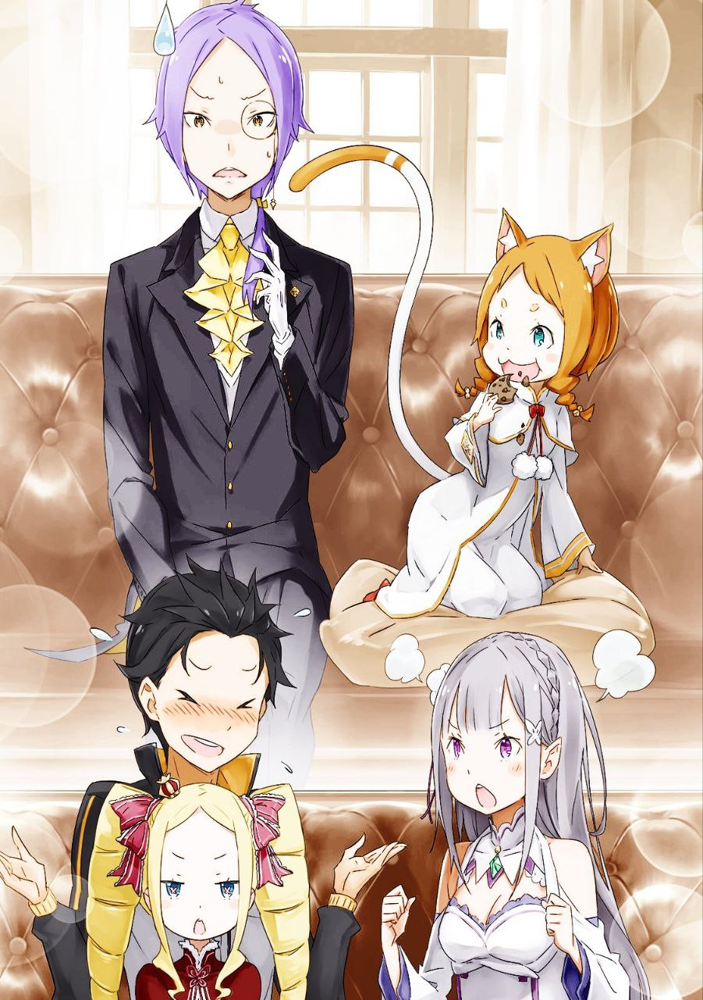

※ ※ ※ ※ ※ ※ ※ ※ ※ ※ ※ ※ ※

Перед Субару, который слегка склонил голову набок, Мими размахивала руками и весело подпрыгивала.

Слово «вечеринка» прозвучало неожиданно ярко и празднично.

— «Приглашение на вечеринку… от Анастасии? Это что, с чего вдруг так внезапно? Что-то радостное случилось?»

— «Радостное? Счастливое? Не знаааю! Но ведь это не так важно, правда? Вкусная еда, вино, веселье — звучит здорово! Офигееенно здорово!»

— «Вино, говоришь? Да ты же явно не в том возрасте, чтобы пить.»

— «Хе-хе! Мими за этот год стала совсем взрослой! Данчо сказал, что можно пить, значит, можно! Хотя госпожа против, конечно.»

Мими гордо выпятила грудь, позвякивая колокольчиками на заколках в своих косичках. Субару, услышав это, вытаращил глаза от удивления.

— «Можно пить!? Ты что, уже взрослая!? Враньё, сколько тебе лет-то?»

— «Недавно исполнилось пятнадцать! Так что Мими — взрослая-взрослая. Взрослая женщина!»

— «Какая взрослая женщина так скачет, как школьница из старших классов!? Хотя…»

Субару немного успокоился и провел рукой по груди, осознавая, что понятие совершеннолетия в этом мире отличается от его родного. Здесь пятнадцать лет — это как обряд взросления.

В этом мире совершеннолетие наступает в пятнадцать, и с этого возраста разрешается пить алкоголь и курить.

— «Так правильно понимаю, Петра?»

— «Да, всё верно. Если чуть подробнее, то мальчики в пятнадцать лет начинают работать и покидают дом, а девочки в этом возрасте уже могут выходить замуж. Даже если не замуж, то примерно в это время начинают работать где-нибудь. Как я сейчас, например.»

— «Получается, ты довольно рано ушла из дома, да? Маленькая хитрюга.»

— «Эхе-хе, я такая хитр… Хотя, кажется, это не совсем похвала.»

Субару, поймав острый взгляд Петры, устало подошёл к Беатрис, которая выглядела измотанной. Освободившись от Мими, девочка слегка опустила свои вертикальные локоны и с укором посмотрела на приближающегося Субару.

— «Субару меня тренировал, а теперь ещё эта кошачья девчонка меня измотала. Я вся выдохлась, я полагаю… Субару, возьми меня на руки.»

— «Тренировал, говоришь? Ты же просто смотрела со стороны…»

Не став спорить по мелочам, Субару протянул руки и поднял Беатрис. Он стал сильнее благодаря тренировкам, а она была лёгкой, как пёрышко, так что вес его не беспокоил.

Правда, картинка немного напоминала отца с ребёнком, что слегка смущало.

— «Оо, малышку взяли на ручки! Классноо! Мими тоже хочет! Мими тоже!»

— «Твой Данчо, может, и справится, но с моим телосложением это нереально. Отказ, полный отказ.»

— «Эээ, нечестно! Нечестно! Это подло! Подлоо!»

Мими начала бегать вокруг Субару, который держал Беатрис на руках. Та, в свою очередь, почему-то выглядела так, будто хотела сказать «Ха, победила!» с довольным видом.

В итоге Мими схватила Субару за край куртки.

— «Ладно, тогда я сама заберусь!»

— «Дура! Стой, мы же перевернёмся! Петра, останови её… Ты что делаешь?»

— «Ой, эээ, я вовсе не из зависти, но… можно мне тоже забраться на вас, Субару?»

— «Нет, нельзя!»

Субару, держа на руках одну малышку, оказался атакован ещё и кошачьей девочкой с подростком. Они продолжали шуметь в холле у входа, не продвигаясь в разговоре ни на шаг.

И тут раздался голос:

— «Долго не возвращаетесь, и вот что я вижу — вы возитесь у входа. Что вы вообще делаете?»

Холодный, лишённый эмоций голос заставил Субару и Петру одновременно выпрямиться. Мими же с любопытством уставилась на источник звука, а Беатрис лишь вздохнула.

Голос доносился сверху, с большой лестницы, которая возвышалась над холлом. Подняв взгляд, они увидели девушку, смотрящую на них сверху вниз.

Розовые волосы, короткая перешитая форма горничной, холодные розовые глаза, в которых не было ни капли тепла. Лицо, которое можно было бы назвать милым, но без малейшего намёка на доброту.

Это была Рам — коллега Петры и главная служанка поместья.

Рам окинула всех ледяным взглядом и фыркнула.

— «Развратно.»

— «При таких лицах и такой сцене у тебя рождаются такие мысли!? Это ты развратна! Может, тут и есть о чём поспорить в плане невинности, но это точно ничего кроме милой суеты!»

— «Вот так ты и переворачиваешь факты в свою пользу. Но запомни, Барусу: оценка Рам — это то, что видят её глаза, и ничего больше.»

— «Может, начнёшь с того, что снимешь свои странные фильтры восприятия?»

Рам равнодушно отвела взгляд, явно не собираясь его слушать. Субару скривился, но она уже переключила внимание на Петру. Та вздрогнула, её маленькие плечи задрожали.

— «Петра. Я велела тебе привести Барусу за шиворот, если понадобится, раз у нас гости. Почему ты вместо этого веселишься с ним у входа?»

— «П-прости, сестрица Рам…»

— «Кажется, ты не расслышала, Петра. Рам спросила, почему ты играешь, а не выполняешь поручение.»

— «Не будь к ней так строга, как злая тёща! Это я начал дурачиться. Петра не виновата.»

— «Не виновата? Не смеши. Сейчас по шее получишь, Барусу.»

— «Ну, может, чуть-чуть виновата!»

Уступив немного, Рам, видимо, осталась довольна. Она слегка кивнула в сторону и сказала:

— «Нельзя заставлять Эмилию и остальных ждать вечно. Барусу, быстро поднимайся в гостиную. Петра — в столовую. Беатрис, идёшь с Барусу.»

— «Естественно, я полагаю.»

— «А Мими? Эй, сестрёнка, а куда Мими?»

Петра нехотя отпустила край одежды Субару, но другая энергичная кошечка всё ещё крепко держалась за него.

На вопрос Мими Рам откинула волосы с лица и ответила:

— «Гостей тоже прошу в гостиную вместе с Барусу. Ваши спутники, кажется, беспокоятся без вас, Мими.»

— «Ага, значит, надо вернуться, да? Нельзя их бросить!»

Рам, несмотря на свою холодность, с гостями вела себя вежливо. Мими весело рассмеялась, но Субару уловил в её словах кое-что интересное.

— «Спутники, говоришь? Но ты же вроде сказала, что пришла одна?»

— «Сказала, и это не враньё! Правда-правда, ни Хетаро, ни Тиви, ни Данчо, ни Юлиус, ни госпожа со мной не пришли! Но вот Джошуа со мной. Мими одна с Джошуа, её го… Гоэ?»

— «Гоэ — это что, охрана?»

— «Точно, Гоэ!»

Мими гордо выпятила грудь и состроила довольную физиономию. Субару потрепал её по голове, а затем снова посмотрел на Рам, стоящую наверху.

— «Прости, я думал, Мими одна, и не знал, что кого-то заставляю ждать.»

— «Понятно. Ладно, иди уже. Эмилия, наверное, уже устала ждать.»

— «Ох, это страшно. Тогда, Петра, увидимся позже. Пошли, Мими.»

— «Йес!»

Джошуа — имя незнакомое. Видимо, кто-то из лагеря Анастасии, кого Субару не знал. Если его прислали в качестве охраны для Мими, значит, он занимает не последнее место. Хотя тот факт, что Мими зовёт его просто по имени, мог бы намекать на невысокий статус, но, зная её беспристрастность, это не показатель.

— «Когда всё уляжется, испеку тарт, попробуешь, Субару,» — шепнула Петра на прощание и убежала мелкими шажками.

В столовой её, скорее всего, ждала Фредерика. Подавать в гостиной она вряд ли будет, но в любом случае тарт от Петры Субару попробует нескоро.

— «А кто сейчас в гостиной с Эмилией?»

— «Розвааль ещё не вернулся, так что там Отто и Гарф. Если бы гости оказались замаскированными убийцами, Гарфа одного хватило бы с лихвой.»

— «Я не про прямую атаку беспокоюсь. Эмилии я велел в крайнем случае использовать Отто как щит.»

— «Тогда я тоже так поступлю, если почувствую опасность.»

«Бедный Отто, его участь нелегка», — подумал Субару, но вслух этого не сказал.

Если в гостиной сейчас эта троица, то, скорее всего, Отто сейчас старается изо всех сил. Надо поторопиться, чтобы снять с него часть нагрузки, иначе можно потерять ценного помощника по внутренним делам.

— «Тоже тот ещё неудачник, я полагаю. Почему он вообще дружит с Субару — загадка,» — заметила Беатрис.

— «У нас с Отто связь, которую посторонним не понять. Мужская дружба, крепкая, как скала. Каменная, понимаешь?»

— «Оо! Каменная!»

На слова Беатрис откликнулись Субару и Мими, а Рам, вздохнув, повела их в гостиную. Они поднялись по большой лестнице в холле и вошли в первую комнату внутри особняка.

Рам постучала в дверь, и та тут же открылась изнутри. Показалось знакомое лицо.

— «О, наконец-то наш генерал явился. Я уж думал, щас сам пойду его искать, раз он так задерживается.»

— «Представь, вы все идёте меня искать, а Отто остаётся один — было бы забавно, но не вышло.»

— «Да уж, смешно бы вышло. Прям вижу, как Отто-братишка мечется в панике.»

Субару обменялся ухмылкой с парнем — короткие светлые волосы, острые клыки и белый шрам на лбу. Это был Гарфиэль. Он стоял у двери, скрестив руки, и кивнул внутрь.

— «Заходи. Гости говорят, что без тебя разговор не начнётся. Отто-братишка и Эмилия их встречают, но выглядит это как комедийный дуэт.»

— «Звучит как представление, которое я бы с радостью посмотрел.»

— «Хватит болтать, заходи уже. За тобой очередь,» — оборвала его Рам и пнула Субару в спину.

— «Ух!»

Субару, спотыкаясь, ввалился в комнату под давлением удара. На него тут же обрушились несколько взглядов — облегчение, удивление и настороженность.

Подавив желание оправдаться перед теми, кто смотрел с облегчением и удивлением, Субару первым делом повернулся к обладателю настороженного взгляда.

— «…»

Перед ним стоял молодой человек с тонкими чертами лица. Худощавое тело в строгом костюме, длинные светло-фиолетовые волосы, собранные в хвост на затылке. Атмосфера учёного, подчёркнутая моноклем. Жёлтые глаза с приподнятыми уголками внимательно изучали Субару. Сжатые губы могли намекать на недовольство.

Первое впечатление было не самым приятным для обоих.

— «Это и есть…?»

Молчание прервал гость, заговорив первым. Его взгляд переместился с Субару на двоих, сидящих напротив. На вопрос юноши кивнула красивая девушка с серебристыми волосами, струящимися по спине.

— «Да. Простите, что заставили ждать. Это мой рыцарь — Нацуки Субару.»

Эти слова девушки наполнили Субару волнением. Фраза «мой рыцарь» звучала так прекрасно, что он никогда не уставал её слышать.

— «Почему-то он выглядит… как будто в экстазе?»

— «Субару, прекращай строить странные лица, я полагаю. Гость подумает что-то не то… Эй, хватит! Ты слишком сильно сжимаешь! Субару, Субару! Больно! Мне больно, я полагаю!»

— «Ой! Прости, я немного замечтался.»

Субару чуть не задушил Беатрис, пытаясь скрыть свои чувства. Объятия Беатрис, или, сокращённо, «Беа-хаг». Вот оно что.

Кашлянув, он аккуратно опустил всё ещё морщившуюся от боли Беатрис и посмотрел на гостя, который смотрел на него с недоумением.

— «Только что представили меня — Нацуки Субару. Служу рыцарем вот этой Эмилии. Рад знакомству.»

— «…»

Несмотря на простую одежду, жесты Субару были безупречны, как у настоящего рыцаря.

Когда-то он скептически смотрел на такие манеры, но, попробовав сам, понял, что они ему «идут». Не в смысле внешности, а в ощущении, что он приближается к образу рыцаря.

Ощущение, которое можно было бы назвать горячечным бредом, он воплощал с серьёзностью, находя в этом смысл. Под руководством Гарфиэля, знатока рыцарских традиций, Субару довёл свои манеры до уровня, достойного настоящего бойца.

Он мельком глянул на дверь — Гарфиэль одобрительно кивнул. Заметив взгляд Субару, тот показал средний палец. Субару сам его этому научил, но сейчас был явно не тот момент. Как учитель Гарфиэль был хорош, а вот как ученик — провалился.

— «Благодарю за учтивость. Я… зовусь Джошуа Юклиус, прибыл как посланник Анастасии Хосин.»

— «Джошуа, да? Красивое имя. И ещё раз извините за опоздание… Юклиус?»

Отвечая на приветствие Джошуа, Субару вдруг замер, уловив знакомое слово. Джошуа кивнул и добавил:

— «Да, Субару. Джошуа — младший брат Юлиуса. Оба брата служат Анастасии — это ведь здорово, правда?» — сказала девушка с улыбкой, растеряв весь свой прежний строгий вид.

Это было её настоящее лицо. Субару тихо выдохнул и, извинившись взглядом, внимательно посмотрел на Джошуа, садясь рядом с Эмилией.

— «А, брат Юлиуса. Теперь вижу сходство. Не ехидство… а острый взгляд. Не насмешка… а изящный рот. И не дьявол… а красивый цвет волос.»

— «Может, не стоит выдавливать комментарии, если это так сложно?»

Острый выпад пришёл от сероволосого юноши — Отто. Главный советник по внутренним делам лагеря Эмилии — точнее, единственный, кто мог взять на себя эту роль. Как миротворец, он явно нервничал.

— «Ты что, похудел немного?»

— «Здешняя жизнь слишком насыщенна! Особенно такие моменты, как сейчас — сплошной стресс, худеешь без всякого спорта!»

— «Худющий! Худющий!»

Мими весело подхватила, невольно поддразнивая Отто. Тот, не в силах возразить гостье, лишь страдальчески смотрел, как она подбежала к Джошуа и плюхнулась рядом с ним.

Беатрис, спущенная Субару, оглядела сидячих. Места занимали Субару, Эмилия и Отто — можно было бы потесниться, но это выглядело бы нелепо. Поэтому Беатрис без колебаний села Субару на колени. Тот привычно обнял её за талию, чтобы она не упала.

— «Ну что ж, перейдём к теме, из-за которой я задержался…»

— «П-постойте! А эта девочка кто?»

Джошуа запаниковал, указывая на Беатрис. Монокль чуть не слетел, когда он подался вперёд. Видимо, он не обладал такой же выдержкой, как Юлиус. Субару это даже понравилось, но ответила за него Мими, сидящая рядом с Джошуа.

— «Эй, Джошуа, ты отстал! Это Беа-ко, дочка Субару. Разве не видно? Рядом мама, а дальше… О-сан-дон?»

— «Кто тут О-сан-дон!? Не говорите так передо мной, когда я сам не уверен в своём положении!»

— «О-сан-доон! О-сан-доон! Прямо как имя какого-то мага, крутоо!»

Наивная Мими не реагировала на крик Отто. Все дружно проигнорировали его уныние, а Субару положил руку на голову Беатрис.

— «Прости, что не представил. Это стало так привычно, что я чуть не продолжил без объяснений.»

— «Отто-кун тоже забыл указать, да? Я прям обалдела,» — добавила Эмилия.

— «“Обалдела” — это что-то из прошлого века…»

Эмилия высказалась в своём духе, но Субару с ней согласился. Если даже Отто упустил такой момент, значит, эта сцена стала обыденностью. Роскошная проблема, однако.

— «Это Беатрис. Как сказала Мими, моя и Эмилии дочь.»

— «Чтооо!?»

Джошуа был в шоке.

— «Да ну, Субару, не то же! Джошуа теперь удивлён. Я с тобой целовалась, но от поцелуев дети не появляются, верно? Я учила это.»

— «Ой, прости, Эмилия-тан. Кажется, я слишком открыто выдал личное. Моя вина, сейчас нормально представлю.»

— «Из-за того, что используешь меня как повод, так и получается, я полагаю. Одумайся,» — сказала недовольная Беатрис.

Субару улыбнулся обоим — невинной Эмилии и ворчливой Беатрис. К слову, знания Эмилии о деторождении застряли на уровне «от поцелуев дети не появляются». Дальше объяснять Субару не решался, а женщины в доме решили, что Эмилия пока не готова к таким откровениям и ждут её взросления. Все её чрезмерно опекали.

— «Эм, так какова же роль этой Беатрис на самом деле?»

Джошуа поправил монокль, явно смущённый хаосом в доме Розвааля. Субару задумался: разве лагерь Анастасии с их «Железным клыком» не такой же шумный?

— «Извини, разговор ушёл в сторону. Беатрис на вид — просто милая малышка, но на деле мой контрактный дух. Лоли-бабушка.»

— «Да, я дух, я полагаю. А “лоли-бабушка” звучит как насмешка.»

Беатрис смахнула руку Субару с головы и начала снизу толкать его подбородок. Живя здесь, она освоила его сленг и не прощала промахов. «Лоли-бабушка» — сочетание уже объяснённых «лоли» и «бабушки», так что её реакция была ожидаемой.

Со стороны их перепалка казалась трогательной, но реакция Джошуа была куда более яркой.

Его лицо, до того слегка чопорное, но обаятельное, вдруг стало холодным.

— «Вот как. Дух, значит.»

В его тихом бормотании было столько эмоций, что никто не мог их разгадать. Он не скрывал чувства — они были слишком смешаны, чтобы понять, что лежало в основе. Но ясно было одно: это не дружелюбный тон, и все в комнате это почувствовали.

— «Эй, гость. Что-то не так с тем, что наш генерал таскает с собой духа?»

Гарфиэль, как всегда прямолинейный, первым нарушил неловкость. Он без страха влез в ситуацию, где другие колебались.

Джошуа покачал головой и коротко ответил:

— «Нет, ничего такого. Просто подумал, что Нацуки тоже рыцарь-духовник. Вы, наверное, знаете, что мой брат — тоже рыцарь-духовник. В этом королевстве это редчайший титул.»

— «Да, знаю. Он мне здорово помог в бою с Культом Ведьмы… Ну, как бы… Помог, короче.»

— «Так не хочется это признавать, да?» — встрял Отто.

— «Не в том дело! Просто вспоминать, как мы с Юлиусом сражались вместе, неловко. А ещё эти воспоминания о том, как он меня уделал на тренировке…»

— «Я слышала, что есть ещё рыцари, использующие духов, помимо нас с Субару, я полагаю. То, что это твой брат, — занятное совпадение,» — сказала Беатрис.

— «Совпадение? В каком смысле, дух?»

— «Всё просто, я полагаю. Старших всегда обгоняют младшие. Так что постарайся стать достойным украшением нашего с Субару пути… Ня-ня!»

— «Не начинай ссору с ходу! И вообще, с Юлиусом мне не тягаться — слишком разные уровни. Это как если бы мастеру пазлов бросили вызов не в пазлах, а в гонках. Вот так мы и побеждаем.»

Субару растрепал волосы Беатрис и поклонился Джошуа, заодно пригибая её голову.

— «Прости. Не хотел задеть твоего брата. Мы признаём, что уступаем ему в силе. Просто этот дух немного любит похвастаться.»

— «Мудрое решение. Сравнивать себя с моим братом и признавать свои слабости — естественно.»

— «Ээ?»

Субару пытался сгладить конфликт, но Джошуа вдруг повёл себя высокомерно, и атмосфера снова накалилась. Не замечая смятения Субару, он продолжил, сверкая моноклем:

— «Да, мой брат — выдающийся человек. В свои двадцать он уже второй по значимости в Королевской гвардии — элите рыцарей. Сейчас он оставил службу ради Анастасии, но если она достигнет своей цели, место главы гвардии ему обеспечено. Он близок с нынешним Мечным Святым Райнхардом, безупречен в делах и личной жизни, строг к себе и другим, всегда стремится к совершенству. Его изящная внешность и благородный дух пленяют женщин. Да, мой брат велик. А ты… даже рядом не стоишь.»

— «…Ох.»

Джошуа говорил с жаром, раскрасневшись от возбуждения. Субару лишь выдавил одно слово, Беатрис смотрела с ужасом, Гарфиэль и Отто молчали, не зная, что сказать, а Мими увлечённо ела печенье, не обращая внимания на происходящее.

В этой тишине лишь один человек мог ответить.

— «Хи-хи. Джошуа, ты правда очень любишь своего брата Юлиуса, да?»

Эмилия, как всегда, видела всё в добром свете. Джошуа осознал, что наговорил лишнего, и покраснел уже от стыда. Кашлянув, он попытался взять себя в руки.

— «П-простите. Увлёкся. Когда речь о семье, я теряю контроль.»

— «Ничего страшного. Мне даже захотелось послушать ещё о Юлиусе. Я видела его в столице всего пару раз и хочу узнать больше.»

— «Правда!? Тогда я расскажу о наших с братом воспоминаниях…»

— «Может, отложим это на потом и перейдём к делу!? Правда ведь, Отто, Гарфиэль?»

— «Э!?»

Субару резко прервал его, переведя разговор на двоих, которые тут же синхронно посмотрели на него с выражением «Не втягивай нас!». Но оба быстро закивали в поддержку.

Джошуа понял, что слишком увлёкся, и сказал:

— «Тогда… истории о славе брата оставим на другой раз. Мне… то есть, мне нужно выполнить поручение и вернуться к Анастасии.»

— «Да. Я очень жду этих рассказов. Так что за дело, которое мы всё откладывали?»

Джошуа старался сохранять спокойствие, хоть и выглядел натянуто, а Эмилия естественно перешла в режим кандидата на трон. Её тон стал строже, и атмосфера в комнате ощутимо напряглась. Это умение создавать напряжение говорило о её росте как будущего правителя.

— «Как посланник Анастасии Хосин, я передаю слова моей госпожи Эмилии.»

Напряжение отразилось на лице Джошуа, вернув ему первоначальную серьёзность. Он достал из кармана письмо, положил его на стол и, раскрыв, начал читать чёрные чернила.

— «Анастасия приглашает Эмилию и её соратников в город Пристеллу.»

— «Пристелла… Это же водный город, да? Большой город у границы королевства Лугуника и городских государств Карараги?»

— «Всё верно. Сейчас Анастасия находится там, а не в столице, и хочет пригласить вас.»

Эмилия подтвердила свои знания, а Джошуа тихо склонил голову. Она посмотрела на Субару, взглядом спрашивая: «Что думаешь?»

Его ощущения совпадали с её. Все знали, что у Анастасии есть особняк в аристократическом районе столицы. Услышав от Мими про вечеринку, Субару предположил, что их зовут туда, но…

— «Пристелла — живописное место, известное своей уникальностью и популярное среди туристов. Анастасия говорит, что даже простая прогулка там успокаивает душу.»

— «Если это просто желание показать красивое место, я только за… Но ведь не всё так просто, да? Эмилия и Анастасия — не подруги.»

Субару помнил, что на собрании в замке Анастасия была особенно резка с Эмилией. Среди кандидатов именно она и Присцилла выделялись своей холодностью. Круш не судила по расе, а Фельт даже была обязана Эмилии. Хотя сражение с Белым Китом и Культом Ведьмы сблизило их, личного расположения к Анастасии у Субару не было.

Он подозревал, что это приглашение не из чистой доброты. И улыбка Джошуа подтвердила его сомнения.

— «Анастасия зовёт вас из добрых побуждений. Она слышала, что в Пристелле видели редкую вещь, которую ищет Эмилия.»

— «То, что я ищу?»

Эмилия оживилась, а Отто тут же напрягся, словно говоря «Попались!». Субару понял это по его реакции, но не успел вмешаться — ключевой момент ещё не прояснился.

Этот промах отдал инициативу гостю.

С улыбкой Джошуа продолжил:

— «В Пристелле, у торговца магическими камнями, есть бесцветный магический кристалл высочайшей чистоты, который нужен Эмилии. Говорят, вы ищете катализатор для великого духа.»

И с этим ходом решение о поездке лагеря Эмилии в Пристеллу было практически предрешено.

※ ※ ※ ※ ※ ※ ※ ※ ※ ※ ※ ※ ※
