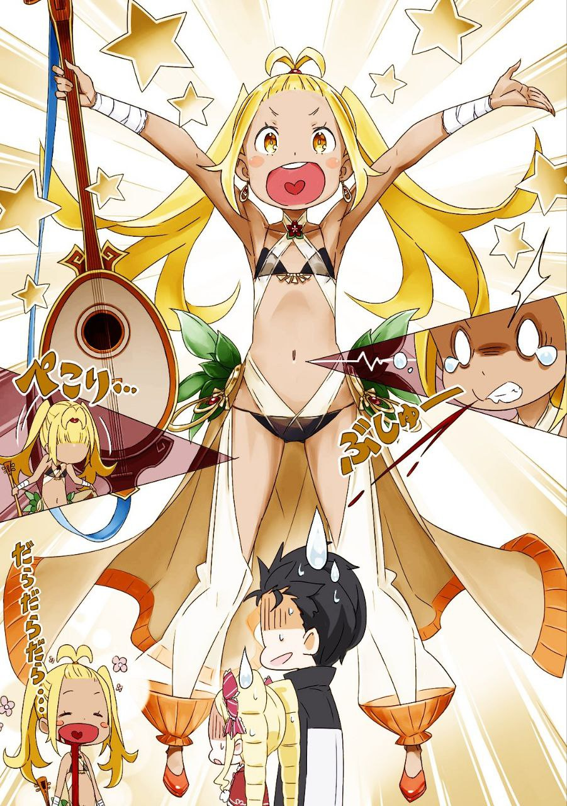
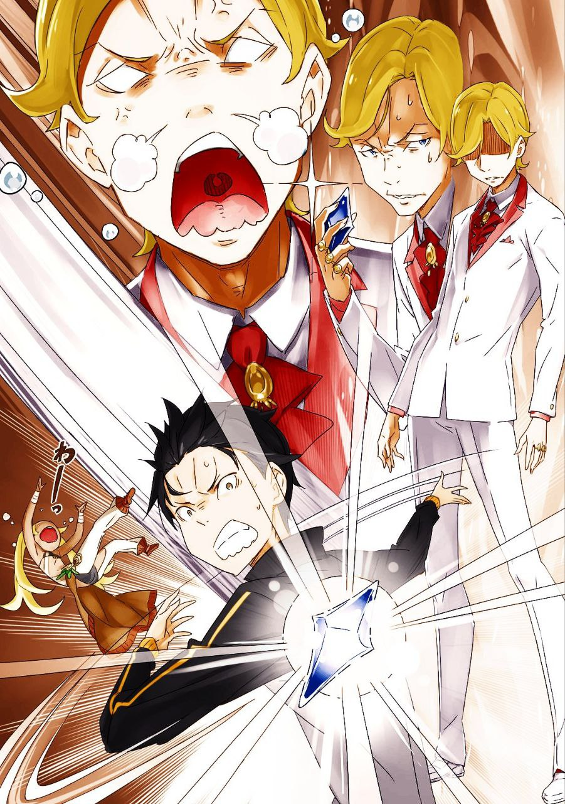

※ ※ ※ ※ ※ ※ ※ ※ ※ ※ ※ ※ ※

— «Ну что ж, позвольте ещё раз представиться. Я — Лилиана. Сейчас я не так уж часто странствую, но когда-то бродила по всему континенту — направо, налево, куда ветер подует, куда душа пожелает. Я свободно скитаюсь и зарабатываю на жизнь только своим люлире и пением, будучи настоящей менестрелькой. Приятно познакомиться, прошу любить и жаловать!»

— «Ты прикусила язык-то», — заметила Беатрис.

С изящным поклоном, держа инструмент в руках, Лилиана расплылась в улыбке, из уголка её рта обильно текла кровь. Похоже, она здорово прикусила язык.

Заметив, как Беатрис слегка отшатнулась, Лилиана приложила к губам платок и сказала:

— «Простите. Сильно прикусила».

— «Да уж, это и так видно. Значит, ты и есть та самая “певица”, о которой все говорят? Знаменитая на всю округу? Конечно, трудно представить, что где-то есть другая певица с таким же прозвищем, но всё же, на всякий случай уточню», — сказал Субару.

— «Эм, ну, мне немного неловко, когда меня так называют, так что, если можно, не надо, пожалуйста. Я считаю, что мне ещё многому нужно учиться, и называть меня “певицей” — это слишком громко. Это как будто меня ставят на вершину музыкального искусства, а я до такого ещё не доросла — только нос задеру и стану посмешищем», — ответила Лилиана, смущённо ёрзая.

Она вытирала кровь так небрежно, что нижняя половина её лица уже покраснела. Субару на мгновение задумался, стоит ли указать ей на это, но решил промолчать и сосредоточиться на разговоре.

Её слова показались ему довольно зрелыми для ремесленника, стремящегося к совершенству.

— «Хоть ты и говоришь, что это не твоя цель, но то, что тебя так высоко оценивают, — это повод для похвалы, и ты можешь гордиться этим искренне. Но всё равно, мне нравится твоё отношение к делу», — сказал Субару.

— «Ой, нет-нет, что вы, это слишком! Мне ещё работать и работать над собой. Так что вот», — ответила Лилиана и внезапно протянула руку с улыбкой.

В её руке ничего не было, и Субару, не понимая, чего она хочет, наклонил голову. Лилиана, не теряя улыбки, продолжила:

— «Вы послушали пение певицы, так что давайте выкладывайте, что положено. Не собираетесь же вы, дорогой гость, слушать бесплатно? Это было бы уж слишком!»

— «Верни мне моё уважение обратно! Ты же сама только что размахивала вывеской “певицы” направо и налево!» — возмутился Субару.

— «Что вы такое говорите! Скорее, похвалите меня за то, что я не теряю дух менестреля, зарабатывающего песнями на жизнь! Или вы хотите сказать, что я должна питаться воздухом и раздавать свои чувства бесплатно? Это уж слишком!» — воскликнула Лилиана, обхватив голову руками и топнув ногой.

Её доводы казались вполне логичными, но с каждой минутой впечатление Субару о “певице” стремительно ухудшалось. Судя по всему, то же самое происходило и с Беатрис — её большие глаза заметно остыли, и это было видно невооружённым взглядом.

— «Ладно, понял. Если чаевые помогут делу пойти быстрее, то я заплачу. Сколько хочешь?» — сдался Субару.

— «Ой, нет-нет, это уж как ваше сердце подскажет. Давайте всё, что у вас есть!» — ответила Лилиана, обнажив зубы, испачканные красными пятнами, в широкой улыбке.

— «Ты серьёзно? Хватит уже», — оборвал её Субару.

В тот же момент он схватил Лилиану за голову — её маленькое личико оказалось неожиданно удобным для захвата — и хорошенько потряс её, после чего отпустил. Закружившаяся Лилиана надула губы и пробормотала:

— «Да я же пошутила…»

— «Кстати, раз ты направляешься в торговую компанию Мьюз, значит, ты гостья Киритаки, верно? Тогда я точно не стала бы вымогать у вас чаевые — это было бы слишком невежливо с моей стороны. Тьфу, вот так», — сказала она, игриво высунув язык.

— «Мы тебя ещё недостаточно знаем, чтобы так думать. И чем больше узнаём, тем меньше тебе доверяем. Так что давай-ка уже выдвигайся», — сказал Субару.

Затянувшееся перед отправлением топтание начинало превышать пределы его терпения.

Они и так уже сильно задержались, заблудившись по дороге, а дальнейшее промедление могло привести к тому, что они не успеют завершить переговоры вовремя. Если дело сорвётся и придётся начинать заново — это ещё полбеды, но если всё уже будет решено без него, Субару окажется в неловком положении.

Лилиана тряхнула головой, отчего её завязанные волосы запрыгали, затем отдала честь и бодро ответила:

— «Поняла вас!»

С этими словами она развернулась и пошла вперёд.

— «Кстати, гость, а по какому делу вы идёте к Киритаке?» — спросила она через плечо.

— «Любопытных не любят, я полагаю. Ты, похоже, ещё не поняла своего места, но тебе достаточно просто молча довести нас до цели», — резко ответила Беатрис.

— «Пи-и!» — Лилиана издала короткий визг, словно птичка.

Субару слегка потянул за один из локонов-дрелей Беатрис, чтобы урезонить её, и сказал:

— «Не слишком дави на неё. Но и мы не собираемся болтать о своих делах направо и налево — язык у нас не такой длинный. Так просто ничего не расскажем».

— «Я ведь связана с Киритакой, так что рано или поздно всё равно узнаю, не так ли?» — возразила Лилиана.

— «Вот именно, рано или поздно. Так что я предпочитаю перестраховаться — и это не твоя забота», — парировал Субару.

— «На каждый аргумент у вас ответ… Характер у вас, прямо скажем, не сахар», — заметила Лилиана.

— «А ты слишком прямолинейная. Если бы не твой талант к пению, тебе бы пришлось туго», — ответил Субару.

Говорят, что гении с выдающимися талантами часто оказываются чудаками, и Лилиана явно была из их числа. Её эксцентричность прощалась только благодаря её способностям — и то на грани.

— «Но если честно, я немного волнуюсь по делу. Меня попросили на несколько часов уйти из дома», — добавила Лилиана.

— «Ну да, при серьёзных торговых переговорах ты бы только мешалась. Это понятно», — кивнул Субару.

— «И мне тоже понятно, я полагаю», — согласилась Беатрис.

— «Эй! Что-то мне не нравится, как вы это понимаете! Это обидно!» — воскликнула Лилиана, надув щёки от недовольства.

Затем она слегка постучала пальцами по своему люлире в руках и сказала:

— «Придумала! Послушайте: “Бушующие волны, высокие волны, волны судьбы…”»

— «Нет, спасибо», — тут же прервал её Субару.

Он выхватил люлире у неё из рук, не дав начаться импровизированному концерту. Лилиана потянулась за инструментом с возгласом «А-а!», но из-за разницы в росте не могла дотянуться до поднятой руки Субару.

— «Это теперь не заложник, а инструмент в заложниках. Если доберёмся до компании без лишних отклонений, верну его тебе», — заявил Субару.

— «Какое злодейство! Какая подлость! Какая низость! Какая мерзость!» — запричитала Лилиана.

— «Ха-ха-ха, переборщила с выражениями!» — рассмеялся Субару.

Её слова звучали так, будто он воплощение мирового зла. Субару легонько щёлкнул по струнам люлире — звук напоминал акустическую гитару.

К слову, Субару был разносторонне одарённым человеком с множеством хобби, пусть и поверхностных. Он вполне мог исполнить песни фолк-музыки семидесятых, которым научился дома, аккомпанируя себе на гитаре.

Возможно, он мог бы возродить классические мелодии своего мира здесь и перевернуть музыкальную сцену.

— «Хотя, если просто помечтать, я и про майонез так же думал», — пробормотал он.

Тогда у него не хватило ни идей, ни понимания, с чего начать, и план провалился.

В старом мире истории про попаданцев в иные миры часто строились на том, как герои используют современные знания для экономического господства. Но на деле, оказавшись здесь, Субару понятия не имел, с чего начать.

Расширение рынка с помощью майонеза? Создание производства? Он не знал, как подступиться к этому.

— «Вот и гитара у меня осталась просто хобби, а сказки — развлечением для деревенских ребятишек», — вздохнул он.

— «Эй, эй, погодите! Если вы, дилетант, будете так небрежно трогать мой инструмент и сломаете его, мне нечем будет зарабатывать! …Ого!? Вы круто играете на люлире!? И это мелодия, которую я никогда не слышала! Что!? Что это такое!?» — Лилиана от изумления вытаращила глаза.

Субару, шагая вперёд, наигрывал аккорды фолк-песни. Лилиана, ошеломлённая, таращилась на него, пока они двигались к торговой компании Мьюз.

— «Ну и дела, я полагаю…» — устало пробормотала Беатрис, следуя за ними.

Однако её шаги невольно подстраивались под ритм мелодии, которую наигрывал Субару.

※※ ※ ※ ※ ※ ※ ※ ※ ※ ※ ※ ※

Фасад торговой компании Мьюз не слишком отличался от соседних зданий.

Первая и вторая улицы Пристеллы делили город на зоны для местных жителей и приезжих торговцев, а здание компании находилось как раз на границе этих двух районов.

С точки зрения удобства входа логичнее было бы расположить его у главных ворот на первой улице, но в городе расположение здания отражало и статус его владельца. Компания Мьюз, занимая промежуточную позицию между глубиной города и его фасадом, словно заявляла о своей значимости, но при этом не перегибала палку.

— «Вот мы и пришли — торговая компания Мьюз, как и обещала!» — объявила Лилиана, театрально развернувшись и указав на каменное здание впереди.

Четырёхэтажное строение выглядело внушительно для торгового офиса. По крайней мере, соседние дома такой высоты не попадались, и здание явно выделялось на фоне остальных.

Однако Субару отметил с лёгким разочарованием:

— «С главных ворот его не видно, так что это ожидаемо, но… всё-таки никакого сюрприза вроде здания в японском стиле, как “Гостиница Водяного Пера”, тут нет».

— «“Гостиница Водяного Пера” — это та странная гостиница на первой улице? Да уж, если сравнивать с ней, то даже Киритака может показаться не таким уж оригинальным. Но всё же, важнее другое», — сказала Лилиана.

Она начала размахивать руками и ногами, словно танцуя, и с преувеличенной экспрессией придвинулась к Субару, открывая и закрывая ладони:

— «Ну же, ну же, я выполнила обещание, так что верните мне мою милую люлиречку! Без неё я завтра останусь без хлеба!»

— «А, да, понял. Держи», — ответил Субару.

Он уже устал играть по дороге и использовал инструмент как чесалку для спины или похлопывал им по плечу. Лилиана поспешно схватила люлире, сначала прижав его к щеке и шумно вдыхая, а затем даже поцеловала его.

— «Ухе-хе, слава богу, ты вернулся целым и невредимым. Больше не отпущу тебя. Чмок-чмок!» — приговаривала она.

— «Ну ты даёшь. Так сильно заставить меня отшатнуться своим обычным поведением — это, пожалуй, удавалось только Петельгейсу до тебя», — сказал Субару.

— «Ого, не знаю, кто это, но, похоже, у этого Петельгейса был талант! Если бы мы где-нибудь пересеклись, он мог бы стать моим вечным соперником! Расскажите, кто он такой, прошу вас!» — оживилась Лилиана.

— «Архиепископ Греха Культа Ведьмы», — сухо ответил Субару.

— «Ну вы и шутник! Вот это мастер слова, браво!» — воскликнула Лилиана.

Одета она была как танцовщица — с открытыми участками тела. Откуда-то она достала горсть конфетти и бросила его в воздух, всячески превознося шутку Субару.

Однако, заметив его сдержанную реакцию, она склонила голову набок, а затем её лицо медленно стало серьёзным.

— «Погодите… Это что, правда было?» — спросила она.

— «Именно так. Но того парня больше нет, так что сравнивать тебя с ним в будущем никто не будет. Живи своей жизнью», — ответил Субару небрежно.

— «Стоп-стоп-стоп-стоп, подождите!» — Лилиана вскинула руки, явно возмущённая его тоном.

Субару подумал, что даже она, со всей своей эксцентричностью, не захочет, чтобы её ставили на одну доску с архиепископом. Но её следующие слова оказались совсем не тем, чего он ожидал.

— «Вы сказали это так, будто сами видели, как этот архиепископ умер?» — спросила она.

— «…И что с того?» — Субару нахмурился, не понимая, к чему она клонит.

Её реакция после упоминания Петельгейса и его статуса насторожила его. Эти архиепископы были как ядовитые насекомые — никогда не знаешь, где они могут вылезти.

Субару внутренне напрягся, а Беатрис рядом прищурила глаза, внимательно следя за ситуацией. В случае чего она готова была вмешаться — медлить с козырями было бы опасно.

Напряжение витало в воздухе.

Всё зависело от следующего шага Лилианы.

И вот она сказала:

— «Вы случайно не… Нацуки Субару, “Повелитель малышек”?»

— «Ух», — вырвалось у Субару.

— «Ох, я полагаю», — одновременно простонала Беатрис.

Глаза Лилианы засияли от восторга, а Субару и Беатрис синхронно застонали.

Этот титул — “Повелитель малышек” — был самым позорным прозвищем, которое Нацуки Субару заработал за последний год. После того как его посвятили в рыцари и он официально стал рыцарем Эмилии, молва разнесла о нём такую славу.

А именно: “Первый рыцарь полуэльфийки — загадочный человек, всегда сопровождаемый маленькой девочкой”.

— «Вы тот самый, кто оказал неоценимую помощь герцогине Круш Карстен в битве с одним из трёх великих магических зверей — “Белым Китом”! Даже мечник Вильгельм назвал вас своим благодетелем, и вы стали свидетелем исторического события! Сразу после этого вы, заручившись поддержкой герцогини Круш и Анастасии Хосин из торговой компании Хосин, уничтожили одного из архиепископов Культа Ведьмы — “Леность”, что потрясло весь мир! Более того, хоть доказательств нет, ходят слухи, что вы также победили другого великого зверя — “Великого Кролика”, сдвинув с мёртвой точки четыреста лет застоя! Вы — новейший герой!» — выпалила Лилиана, сложив ладони и глядя на Субару с мечтательным выражением.

— «Чешется-чешется-чешется-чешется!» — забормотал Субару, чувствуя, как всё тело зудит от смущения.

— «От таких оценок мурашки по коже, я полагаю», — добавила Беатрис.

Субару был ошеломлён этим неожиданным ударом из засады, а Беатрис, стоящая рядом, раздувала ноздри, явно довольная происходящим.

— «А после этого вы носились с востока на запад ради своей госпожи, везде проявляя себя в сопровождении малышки, владеющей мощной магией! Это ведь вы, Нацуки Субару, да!?» — продолжала Лилиана.

— «Хе-хе. Неплохо разбираешься в сути вещей, я полагаю. Да, Субару — партнёр Бетти, тот, кто в будущем затмит всех великих героев прошлого и станет ярчайшей звездой! Уважай его и превозноси ещё больше!» — гордо заявила Беатрис.

— «Хе-хе-е!» — Лилиана тут же рухнула на колени, будто поддавшись порыву.

После всей этой неловкой шумихи Субару окончательно растерялся. Люди вокруг — прохожие и работники компании — заметили их комичное представление у входа и начали пялиться. Но стоило им узнать Лилиану, как все тут же потеряли интерес и вернулись к своим делам.

— «Ты что, всегда так себя ведёшь? Реакция окружающих типа “А, это просто Лилиана” — это что-то с чем-то», — заметил Субару.

— «Эй, не трогайте меня так! А то жар начнётся! Ой-ой-ой, передо мной легенда, настоящая легенда! Ухи-хи!» — заверещала Лилиана, едва не пуская слюни от восторга.

Субару потряс её за плечи, пытаясь привести в чувство, но она только сильнее впала в экстаз. Внезапно её лицо просветлело, и она воскликнула:

— «Постойте, а вдруг тот, с кем вы собираетесь встретиться в компании, это именно тот, о ком я думаю!?»

— «…Нет?» — неуверенно ответил Субару.

— «Да нет же! По дороге вы что-то говорили про любовную песню для Эмилии-тан и играли на люлире! Если Эмилия-тан — это имя, то это точно та, о ком я думаю! Ух ты, какой урожай!» — закричала Лилиана, не обращая внимания на его слабую попытку солгать.

Она рванула внутрь компании, а Субару, опешив, замер на мгновение, прежде чем броситься за ней.

— «Субару! Эта девчонка уронила свой инструмент!» — крикнула Беатрис, подбирая люлире и бросая его Субару.

— «Да что ж она так наплевательски относится к своему инструменту, которым зарабатывает!?» — воскликнул он, ловя люлире и вместе с Беатрис врываясь в здание.

Девушка на стойке регистрации удивлённо посмотрела в сторону лестницы — похоже, Лилиана побежала туда.

— «Г-господа, вы…» — начала она.

— «Мы — сопровождающие госпожи Эмилии, которая сейчас должна быть на встрече внутри. Вам не сообщили, что мы задержимся?» — спросил Субару.

— «С-сообщили, да. Сейчас я провожу вас в комнату… Ой, но сейчас там Лилиана…» — растерялась девушка.

— «Мы знаем направление. Лестница туда?» — уточнил Субару.

Девушка кивнула, и Субару помчался вверх по лестнице за Лилианой.

Его терзало смутное беспокойство — не столько страх, сколько предчувствие, что встреча Лилианы с Эмилией обернётся чем-то невероятно запутанным и хлопотным.

Ещё страшнее было осознание, что эта эксцентричная Лилиана и Эмилия, скорее всего, отлично поладят. Эмилия, к добру или к худу, катастрофически неопытна в общении и лишена всякой настороженности. Субару искренне надеялся, что она хоть чему-то научится на его примере.

— «Что странные люди, которые несут странности, — это действительно странные люди!» — пробормотал он.

— «Какое-то уж слишком личное сожаление в твоих словах, я полагаю», — заметила Беатрис.

Не обращая внимания на её колкость, Субару поднялся на третий этаж, следуя за звуком шагов. На лестничной площадке мелькнул подол юбки Лилианы, и он бросился за ней, перепрыгивая ступеньки в стиле паркура.

— «Докажи!» — крикнул он.

Субару прыгнул через лестницу, приземлился в коридоре, кувыркнулся и, не теряя темпа, погнался за тенью Лилианы. Она остановилась у одной из дверей, и он догнал её.

— «Лилиана, стой!» — рявкнул он.

— «Гав!?» — взвизгнула она, подпрыгнув от резкого окрика.

Субару схватил её, пока она стояла как вкопанная, и слегка запыхался.

— «Т-ты догнал меня, но мои мечты так просто не сломить! Я не сдамся, буду бороться до победы!» — заявила Лилиана.

— «Если тебе так уж хочется встретиться с Эмилией-тан, я потом попрошу её выделить тебе время. Но сейчас она ведёт важный разговор. Отойди», — серьёзно сказал Субару.

— «Ух… Ладно. Погорячилась я», — Лилиана понурила голову.

Субару вздохнул, глядя на её опущенные плечи, почесал затылок и протянул ей люлире, который всё ещё держал в руке.

— «О, спасибо», — тихо сказала она.

— «Это же твоя рабочая вещь, важная, да? Не бросай её где попало. Если кто-нибудь подберёт инструмент знаменитой певицы, его могут загнать за большие деньги», — заметил Субару.

— «Если такое случится, то купит его, скорее всего, Киритака», — усмехнулась Лилиана.

— «Твой покровитель — тот ещё тип!» — рассмеялся Субару.

Лилиана прижала люлире к груди с серьёзным видом, и на миг можно было поверить в её искренность. Но эта же девчонка только что бросила свой инструмент ради сиюминутной цели. Её улыбкам, даже секундной давности, нельзя было доверять полностью.

— «Так что, разговор с госпожой Эмилией откладывается… Но может, тогда Нацуки Субару расскажет мне что-нибудь?» — спросила она с надеждой.

— «Прекрати называть меня так, от этого аж зудит! И что за разговоры?» — поморщился Субару.

— «Да всё подряд! Хочу знать, насколько правдивы слухи, что до меня дошли. Узнать, послушать, спеть! Может, из этого выйдут новые песни… да что там, героические саги, которые будут передавать из поколения в поколение! Это же вдохновляет!» — Лилиана сжала кулаки, её глаза загорелись энтузиазмом.

Субару растерялся от её напора, а тут подоспела поднявшаяся по лестнице Беатрис. Увидев, как Лилиана надвигается на Субару, она воскликнула:

— «Эй, ты, странная девчонка! Не лезь к Субару, отойди, я полагаю!»

— «Да что такого, я же его не съем! И вообще, я хотела поговорить ещё и с малышкой, что ходит с “Повелителем малышек”!» — возразила Лилиана.

— «Хватит называть меня малышкой! Бетти — не малышка, а достойная леди, я полагаю. Это просто невежливо!» — возмутилась Беатрис.

— «Да хватит вам обеим чирикать, как птички! Угомонитесь уже! Там внутри Эмилия-тан сейчас ведёт переговоры…» — рявкнул Субару, пытаясь утихомирить спорящих.

Но в этот момент раздался голос:

— «Субару?»

Дверь перед ними неожиданно открылась, и изнутри послышался звонкий, как серебряный колокольчик, голос, назвавший его имя.

В открытой комнате — видимо, гостиной или приёмной — на диване сидела удивлённая компания: Эмилия, Отто и Гарфиэль — вся команда Эмилии. Напротив них расположился худощавый молодой человек в хорошо сшитой одежде.

Дверь открыл, судя по всему, мужчина средних лет, стоявший рядом с юношей.

— «Э-э, привет, Эмилия-тан. Вот так встреча», — неловко поднял руку Субару.

— «Какая уж тут встреча, вы так шумели… Ой, Киритака?» — растерянно ответила Эмилия.

Она посмотрела на молодого человека напротив, который встал и с призрачной грацией взял что-то со стола.

Затем он повернулся к Субару и закричал дрожащим голосом:

— «Н-н-н-не трогай мою Лилиану!!!»

С этими словами он швырнул в Субару магический камень, испускающий голубое сияние.

Чистая энергия взорвалась прямо перед ошеломлённым Субару. Мир перед его глазами окрасился в ярко-голубой цвет, и он успел подумать: «О, красиво», прежде чем ударная волна поглотила его.

И так переговоры первого дня провалились с треском.

※ ※ ※ ※ ※ ※ ※ ※ ※ ※ ※ ※ ※
