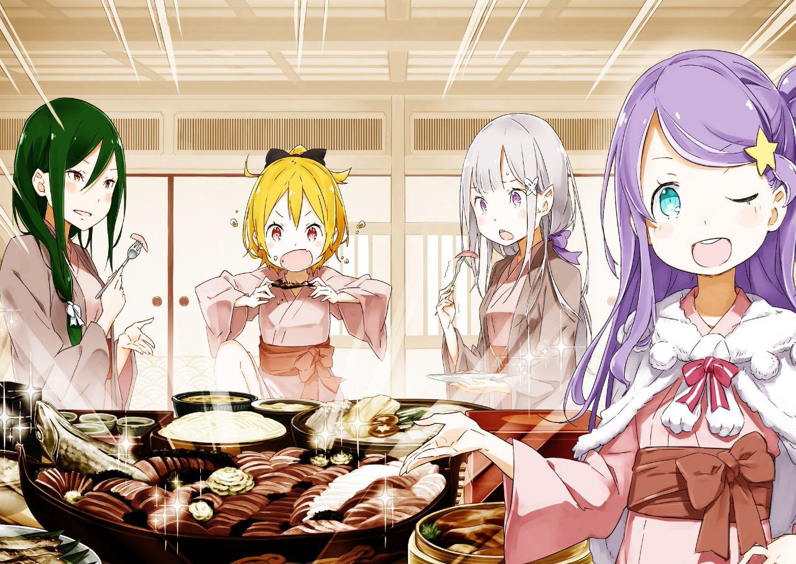

※ ※ ※ ※ ※ ※ ※ ※ ※ ※ ※ ※ ※

Сад на территории гостиницы «Водяное оперение» был оформлен в стиле японского сада с гравием, что придавало ему атмосферу традиционного постоялого двора. Конечно, ожидать пруда или отпугивателя оленей было бы слишком, но аккуратно выложенные камни и растения, напоминающие бамбук, вполне заслуживали похвалы.

— «И всё же Вильгельм так и не спустился сюда», — пробормотал Субару, сидя на краю веранды с видом на сад и лениво перебирая носком ботинка мелкие камешки.

Перед глазами всплывало лицо седовласого старика с виноватым выражением. Вильгельм отклонил приглашение Субару, и теперь тот гадал, чем старик занимается в своей комнате. Время до ужина в одиночестве, должно быть, тянется скучно.

— «Хотя, если подумать, он точно не из тех, кто ради развлечения спустится сюда посмотреть», — добавил Субару, усмехнувшись.

— «Тогда получается, что мы, последовавшие за твоим приглашением, выглядим как какие-то чудаки», — заметил Юлиус, сидящий рядом с изящно скрещёнными ногами.

— «Ну, не скажу, что у нас с вами утончённый вкус. И я в том числе», — с лёгкой иронией ответил Субару.

Юлиус улыбнулся и кивнул, соглашаясь с «действительно», но не все разделяли это мнение. Человек, сидящий по другую сторону от Юлиуса, явно был не в восторге.

— «Ой, ну как же гадко сказано! Фели-чан ведь не по своей воле сюда пришёл, понимаешь? Просто Субару-кун так настаивал, мол, вдруг что-то случится, и я нужен», — возмутился Феликс, покачивая кошачьими ушами.

— «Да, прости, что затащил тебя сюда. Но если что-то пойдёт не так, с тобой рядом я могу позволить себе больше вольностей. Хотя, похоже, ты оказался не нужен», — ответил Субару, подмигнув одним глазом.

Его взгляд устремился вперёд, на сад, где разворачивалось стремительное сражение. Для глаз Субару движения были слишком быстрыми, чтобы уследить за деталями, но одно он мог утверждать с уверенностью.

— «Честно говоря, этот Райнхард — просто монстр», — выдохнул он.

— «Сложно возразить, но это не то описание, которое хотелось бы слышать о друге», — заметил Юлиус.

— «Не поспоришь, но это и правда так», — подхватил Феликс.

Перед глазами троицы, делящей схожие впечатления, разворачивалось зрелище, подтверждающее их слова. В саду, на гравиевой дорожке, лицом к лицу стояли двое: рычащий златовласый юноша, излучающий звериную ярость, и красноволосый герой, с лёгкостью отражавший его натиск. Гарфиэль, бросивший вызов, использовал всё своё тело как пружину, атакуя Райнхарда с невероятной подвижностью. Но тот, не теряя спокойствия, предугадывал каждое движение — когти, зубы, ноги, локти, колени — и уверенно уклонялся.

— «Он ведь реально ни на шаг не сдвинулся с места, да?» — удивился Субару.

— «Таковы были условия с самого начала. Райнхард не нарушит их ни при каких обстоятельствах. Хотя для Гарфиэля неспособность заставить его отступить — настоящее унижение», — пояснил Юлиус.

Гарфиэль метался вверх и вниз, пытаясь найти брешь в защите Райнхарда, но ни одна атака не достигала цели. Более того, его удары без труда отводились, а сам он терял равновесие. Райнхард же стоял как вкопанный на том же месте, где начался этот безрассудный поединок, принимая атаки Гарфиэля, не сходя с двух ног.

Когда Гарфиэль впервые явился в комнату Райнхарда и бросил ему вызов, Субару посчитал это безрассудством по множеству причин. Во-первых, он сомневался, что Райнхард поддастся на провокацию. Это было чистой прихотью Гарфиэля, и у Райнхарда не было никаких причин соглашаться. К тому же, учитывая отсутствие у Райнхарда мальчишеского желания доказывать своё превосходство, вызов казался пустой тратой времени. Их сложные отношения как рыцарей противоборствующих лагерей тоже играли роль — в худшем случае это могло бы разжечь ненужный конфликт. Хотя Субару и верил, что Гарфиэль не станет прибегать к подлым уловкам, минусов в этой затее было предостаточно. Он почти смирился с тем, что поединок не состоится.

Но в глубине души Субару хотел, чтобы это произошло.

Гарфиэль Тинзель, безусловно, был сильнейшим бойцом в стане Эмилии. Конечно, исход битвы зависел от множества факторов и совместимости, и никто не мог похвастаться постоянными победами. У Гарфиэля тоже были слабости. Но за этот год он стал стержнем военной мощи их лагеря — это признавали все, включая самого Гарфиэля, который неустанно доказывал свою силу результатами.

Однако у Гарфиэля была одна проблема. Покинув «Святилище», он лишь раз столкнулся с противником, равным ему по силе — Эльзой, наёмной убийцей, атаковавшей старый особняк Розвааля. Даже её он в итоге одолел, и с тех пор не встречал достойного вызова. Да, Субару и его союзники однажды победили Гарфиэля, но лишь благодаря хитроумной стратегии, а не честному бою. В прямом столкновении Гарфиэль Тинзель никогда не знал поражений.

И потому Субару, зная, насколько это жестоко, желал увидеть схватку Гарфиэля с Райнхардом. Если бы Гарфиэль мог достичь вершины, не познав поражения, — прекрасно. Но оставаться сильнейшим лишь за счёт удачи, сражаясь с заведомо слабыми противниками, было слишком ненадёжно. Поэтому Субару решил довериться силе Райнхарда ван Астреи — героя, чьё мастерство он видел лишь однажды.

— «Вот только я не ожидал, что разница окажется такой огромной», — пробормотал Субару, ошеломлённый исходом, который превзошёл все его ожидания.

Когда он привёл разгорячённого Гарфиэля к Райнхарду, тот с улыбкой согласился на их дерзкую просьбу, чем изрядно озадачил Субару. Гарфиэль хотел выйти за пределы города, чтобы не навредить окружению, но Райнхард лишь сказал:

— «Двора гостиницы вполне хватит. Я поговорю с хозяевами, чтобы не повредить участок», — и улыбнулся.

Для Райнхарда это не было насмешкой, но для Гарфиэля его слова стали настоящим вызовом. Стоя рядом, Субару чувствовал, как от Гарфиэля исходила почти осязаемая ярость, направленная на Райнхарда.

В саду гостиницы назначили правила: никаких оружия, травм и опасных благословений. Так начался поединок. Субару позвал Феликса на случай ранений, а Юлиуса и Вильгельма — для комментариев. Вильгельм, правда, отказался, едва услышав суть, но Юлиус и Феликс остались наблюдать. Отто же ещё не вернулся.

— «Женщин и младших братьев Мими я звать не стал», — добавил Субару.

— «Мудрое решение, я полагаю. Анастасия не из тех, кто упустит шанс. Узнав об этом, она бы мигом превратила всё в представление. А если бы слух дошёл до Хетаро и Тиви, Мими бы точно подняла шум», — согласился Юлиус, не отрывая глаз от боя.

Перед немногочисленными зрителями поединок начался. Вероятно, Гарфиэль изначально думал так: «Заставлю его пожалеть о самоуверенных словах и выгоню на настоящее поле боя». Даже просторный сад гостиницы был лишь декоративным уголком, явно не подходящим для серьёзной схватки. А Райнхард ещё и добавил условие «не повредить участок» — явный намёк на своё превосходство. Естественно, Гарфиэль хотел доказать обратное. Но реальность оказалась иной.

— «Эй, Юлиус, можно один вопрос?» — спросил Субару.

— «Спрашивай сколько угодно. Отвечу или нет — другой разговор», — с лёгкой насмешкой ответил Юлиус.

— «Не язви, а то я тебя и правда недолюбливаю», — буркнул Субару, опираясь подбородком на руку и глядя вперёд. — «Как тебе Гарфиэль с твоей точки зрения?»

— «Он силён. Слухи не врали — одна из двух опор Эмилии не просто громкое имя. Признаюсь, из-за того, что второй опорой называют тебя, я не ждал многого. Но он меня удивил», — начал Юлиус.

— «Смотри, доиграешься», — огрызнулся Субару.

— «Гарфиэль силён, и это не пустые слова. Одними навыками фехтования я бы не поручился за победу над ним. У него ещё есть куда расти. Если он пробьёт свои пределы, то станет одним из лучших воинов. Это бесспорный талант», — твёрдо заключил Юлиус.

В его словах чувствовалось восхищение и лёгкая зависть. Даже для Юлиуса, идущего путём воина, потенциал Гарфиэля был очевиден.

— «Но даже с таким блестящим будущим наш Гар-нян сейчас только и может, что беспомощно барахтаться», — с холодной насмешкой добавил Феликс.

Возразить никто не смог. Всё было ясно зрителям, и, что важнее, самому Гарфиэлю. Он мог бы однажды стать одним из сильнейших, но сейчас, перед сильнейшим мира сего, он был лишь игрушкой.

— «Тц!» — вырвалось у Гарфиэля.

— «Почти. Ты поторопился», — спокойно заметил Райнхард.

Гарфиэль широко замахнулся, но мечник проскользнул в брешь, схватил его за руку и высоко подбросил. Юноша рухнул спиной на гравий, подняв облако пыли. Он тяжело дышал, лёжа на земле, а Райнхард мягко положил руку ему на лоб. Гарфиэль замер, словно его сковали, и длинно выдохнул.

— «Я проиграл», — тихо признал он.

Сказать это самому, не дожидаясь чужих слов, было для него способом сохранить гордость. Оставалось лишь надеяться, что это хоть немного утешит его.

На ужине Гарфиэль так и не появился.

— «И почему вы устроили такое веселье без меня?» — с лёгкой обидой спросила Анастасия, оглядывая мужчин, собравшихся в комнате.

Она была не в привычном платье с белым мехом, а в юкате, струящейся по спине фиолетовой волной волос. Её бледная кожа слегка порозовела, добавляя нотку зрелого очарования к её юному облику.

— «Мы решили не звать вас, зная, что вы так скажете. Вы ведь налаживали связи с другими, верно?» — с лёгкой улыбкой ответил Юлиус, садясь рядом.

Анастасия хитро улыбнулась, сверкнув глазами:

— «Ох, мой рыцарь, как всегда, мастер сладких речей. Я ведь не всё подряд в деньги превращаю, знаешь? Просто душа из Карараги требует, чтобы всё интересное стало большим шумным праздником».

— «Пожалей нашего сильнейшего щита, а то его душевная рана станет глубже. Думаю, ночь посидит, обхватив голову, и вернётся как ни в чём не бывало. Тогда будь с ним как обычно, ладно?» — попросил Субару, думая о расстроенном Гарфиэле.

Все присутствующие понимающе кивнули, но тут вмешалась Фельт:

— «Это небось опять этот никчёмный рыцарь всех безжалостно уделал? Прости, братан», — сказала она, хлопая Райнхарда по плечу и показывая клыки в ухмылке.

Райнхард лишь горько улыбнулся:

— «Фельт, такие слова могут ввести в заблуждение. Этот поединок не был односторонним избиением. У меня самого сердце не раз ёкало — это было насыщенное сражение».

— «После того, как ты гоняешь Гастона и остальных, твои слова неубедительны. Ты ведь и с ними не церемонишься, находя в каждом что-то достойное», — фыркнула Фельт.

— «Я не могу позволить себе расслабляться с кем бы то ни было — это неуважение. И я не настолько самоуверен, чтобы думать, что могу победить, не выкладываясь», — твёрдо ответил Райнхард.

Фельт лишь хмыкнула и отвернулась. Их отношения как госпожи и слуги вызывали вопросы, но слова Райнхарда задели Субару сильнее. Он видел бой в саду и понимал, что это была лишь вежливая попытка смягчить правду. Но в голосе Райнхарда не было фальши — он говорил искренне, и это делало его опасно притягательным.

— «Кстати, Фельт, что это за наряд?» — спросил Юлиус.

— «Чё, не нравится? Мы с девчонками были в большом бассейне, и все переоделись в это. Не собираешься же ты сказать, что я выгляжу нелепо?» — огрызнулась она.

— «Нет-нет, я лишь хотел сказать, что тебе идёт», — поспешил заверить Райнхард.

— «Отстань», — буркнула Фельт, отмахнувшись.

Рыцарь, которого обожали все в королевстве, предлагал ей комплимент, а она отбросила его с искренним раздражением. Её небрежно завязанная юката и грубоватые манеры только усиливали это впечатление.

Как выяснилось, пока Райнхард и Гарфиэль сражались, женщины наслаждались купанием в большом бассейне. Теперь все они явились на ужин в юкатах: Анастасия, Фельт, Мими, Круш и даже Эмилия с Беатрис.

— «Беако, ты когда успела в баню?» — удивился Субару.

— «Пока ты бросил Бетти и ушёл в сад, я бродила по гостинице одна, и тут меня поймала Эмилия. Я говорила, что не хочу, но она всё равно затащила меня, я полагаю», — ответила Беатрис, отводя взгляд.

Её светло-голубая юката удивительно гармонировала с её западной внешностью. Влажные волосы, всё ещё сохраняющие форму вертикальных локонов, слегка покачивались, чуть тяжелее обычного.

— «Так говорит Беатрис, а как было на самом деле?» — спросил Субару, повернувшись к Эмилии.

— «Ну, она пожаловалась, что ты её бросил, и выглядела одиноко, вот я и позвала её с собой в баню. Мне показалось, ей понравилось», — ответила Эмилия.

— «Это ложь, я полагаю! Чистая ложь! Субару, кому ты поверишь — мне или Эмилии?» — возмутилась Беатрис.

— «Ты сама себя выдала», — усмехнулся Субару.

Итог был очевиден: Беатрис дулась, а Эмилия весело смеялась. Её длинные серебряные волосы, ещё влажные после бани, были собраны в хвост, открывая белую шею — зрелище, достойное восхищения.

— «Субару, ты как-то громко дышишь. Не заболел?» — обеспокоилась Эмилия.

— «Просто лёгкая лихорадка любви. Эмилия-тан, можно я заплету тебе косу?» — спросил он.

— «Можно, но скоро подадут еду. Может, потом?» — предложила она, указывая на стол.

Субару неохотно убрал руку от её волос, заметив странные взгляды окружающих. Он вопросительно посмотрел на Фельт:

— «Что-то не так?»

— «Вы с сестрицей какие-то странные. Вроде бы близко, а романтики никакой. Да и в последний раз, когда я вас видела, вы вообще были на ножах», — хмыкнула Фельт.

— «Что значит «нет романтики» в нормальных отношениях парня и девушки? И, пожалуйста, не напоминай про замок — сердце болит», — вздохнул Субару.

Он понимал, о чём она. За год в роли рыцаря Эмилии он стал ей ближе, но романтической дистанции не сократил. Скорее, их связь стала менее чувственной, чем раньше. Причина была в эмоциональной зрелости Эмилии — она ещё не готова воспринимать его чувства как любовь между мужчиной и женщиной. Это заставило Субару относиться к ней проще, хотя его любовь не угасла. Пока Эмилия не изменит своё отношение, всё останется так.

— «Если уж на то пошло, это немного похоже на отношения Круш и Феликса», — задумчиво добавил он.

— «Наши отношения?» — переспросила Круш, удивлённо склонив голову.

Она тоже была в юкате, и тонкая ткань подчёркивала её женственные формы, скрытые обычно мужской одеждой. Её красота теперь казалась более мягкой, почти беззащитной, но всё ещё изящной.

— «Ага. Феликс к Круш очень привязан, но не переходит границ, учитывая её чувства. У меня, конечно, изначально были всякие мыслишки, но подход к любимому человеку у нас с ним похож», — пояснил Субару, потирая нос.

— «Сказать так — немного неловко. Правда, Феликс?» — улыбнулась Круш.

— «Фели-чан к Круш-сама очень даже неравнодушен», — заявил Феликс с широкой улыбкой.

Комната замерла. Улыбка Круш застыла, а Феликс смотрел на неё с невинным видом. Он тоже переоделся в юкату, и, надо признать, смотрелся в ней не хуже других женщин.

— «Прости, что ляпнул лишнего. Давайте ужинать», — поспешил сменить тему Субару.

— «Не уходи от темы после такого!» — воскликнула Круш со слезами на глазах.

Субару не хотел копаться в этом, но тут вмешался Вильгельм, молчавший до сих пор:

— «Феликс, не стоит так пугать Круш. В последнее время твои шутки становятся всё более язвительными».

Старик, единственный из мужчин в юкате, излучал гармонию с традиционной атмосферой. Ему бы ещё меч рядом — и образ был бы идеальным.

— «Ой, даже дедуля Виль меня отчитывает?» — надулся Феликс.

— «Уважение, привязанность, любовь — естественно испытывать такие чувства к своему господину. Но скрывать правду ради мелкой шалости — это уже не детская проказливость, а отсутствие вкуса. Если не одумаешься, придётся говорить строже», — наставительно произнёс Вильгельм.

— «Ну всё, сдаюсь, строг он, конечно», — вздохнул Феликс, прислонившись к плечу Круш. — «Не бойтесь так, это же шутка. Если бы Фели-чан с такой внешностью всерьёз строил планы на Круш-сама, это бы вызвало кучу проблем».

— «Да, точно. Фух, напугал ты меня. Я сейчас не могу полноценно использовать благословение, вот и подумала, что неправильно поняла твои чувства», — с облегчением выдохнула Круш.

— «Ничего подобного», — тихо ответил Феликс.

Субару уловил в его взгляде мимолётную тень — возможно, сомнение. За год Феликс, как и он сам, наверняка боролся с трудностями, поддерживая госпожу, потерявшую память.

— «Ужин готов. Можно подавать?» — раздался голос работника гостиницы.

Джошуа, сидевший в углу, дал разрешение, и блюда начали вносить. Все ахнули, увидев угощения, но Субару удивился иначе. Если другие поражались новизне, он был ошеломлён знакомыми вкусами в этом мире. Моря тут не было, так что живой рыбы не подали, но ассорти из сырой рыбы всё равно потрясло его.

— «Это что, так и едят?» — спросил он.

— «Не привык, да? Такое только у воды попробуешь. В «Водяном оперении» это фирменное блюдо», — пояснила Анастасия.

На столе было не только сашими, но и другие блюда, похожие на японскую кухню. Пока все колебались, Субару взял кусочек рыбы, обмакнул в соус, напоминающий соевый, и отправил в рот.

— «Ах!» — одновременно воскликнули Эмилия и Беатрис, но он лишь улыбнулся. О паразитах он подумал уже после, но в такой гостинице с такими гостями это было исключено.

— «Вкуснота! Ох, как же я скучал по сашими! Просто объедение!» — воскликнул он.

— «Правда вкусно?» — спросила Эмилия.

— «Не просто вкусно, а шедевр! Может, из-за свежести, но по моим меркам — это топ. Будь тут рис и уксус для суши, я бы показал вам, как делаю эдомаэ-дзуси», — воодушевился Субару.

— «Прости, я не всё поняла. Но раз вкусно, то здорово», — улыбнулась Эмилия.

Она последовала его примеру, попробовала сашими и радостно сжала кулак, воскликнув: «Мм!» Остальные тоже начали пробовать. Анастасия слегка дулась, что её обошли, но, увидев искренние реакции Субару и Эмилии, смягчилась и тоже принялась за еду.

Несмотря на некоторые тревоги и отсутствие нескольких лиц, ужин прошёл в тёплой и весёлой атмосфере.

— В эту ночь луна и весь мир словно даровали им мирное перемирие.

※ ※ ※ ※ ※ ※ ※ ※ ※ ※ ※ ※ ※
