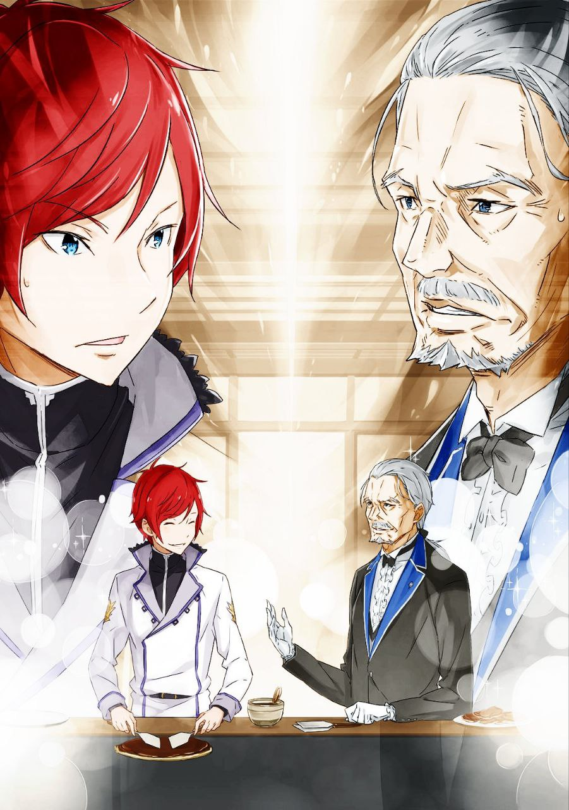
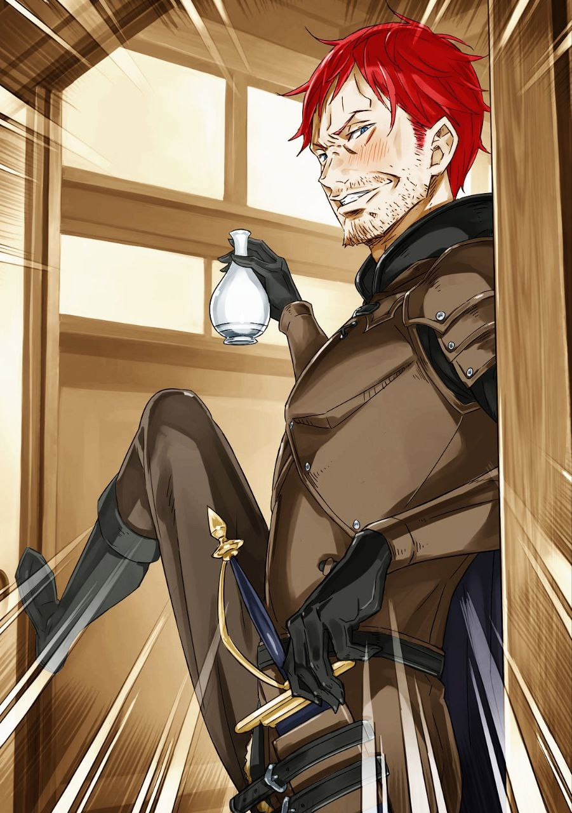

※ ※ ※ ※ ※ ※ ※ ※ ※ ※ ※ ※ ※

На следующее утро Субару проснулся в отличном настроении и теперь стоял в саду, освещённом утренним солнцем.

Ощущая под подошвами хруст гравия, он вдыхал свежий утренний воздух. Издав довольное «М-м!», Субару заметил, как стоящая рядом Эмилия тихо рассмеялась.

— «Что такое? Субару, ты сегодня утром просто сияешь от счастья. Случилось что-то хорошее?» — спросила она.

— «Ну, во-первых, с утра любуюсь милыми волнами твоих косичек, Эмилия-тан. А ещё вчера перед сном произошло кое-что приятное. Да и размер ванны мне тут понравился», — ответил он.

— «О, да-да, я тоже! Ванна была просто замечательная, правда? В особняке ванны тоже большие, но тут ещё и камни вокруг — это так необычно и свежо», — согласилась Эмилия.

Серебристые волосы Эмилии, которые Субару накануне вечером заплёл в косички, теперь, распущенные, мягко струились на ветру, образуя плавные волны — всё, как он и задумал. Прямые волосы подчёркивали её естественную красоту, но такие изменения тоже раскрывали её очарование с новой стороны. Это было настоящим преимуществом юной красавицы.

В глубине души Субару подумал, что, как ни крути, милая девушка остаётся милой, что бы она ни делала.

Пока он размышлял об этом, его разум автоматически соглашался со словами Эмилии.

Она упомянула большой общий бассейн в гостинице. Пусть он и не был настоящей открытой купальней, но явно создавался с такой идеей. Хотя ванна находилась внутри здания, её постарались максимально открыть природе: убрали все лишние перегородки, а сам бассейн выложили камнями.

Особая атмосфера, где края ванны были из камня, не могла быть передана холодной мраморной плиткой.

— «Это была моя первая такая ванна, так что я даже с Круш и Фельт немного пошумела от восторга», — добавила Эмилия.

— «Это что, какой-то рай на земле? Будь это галге, тут точно был бы момент для сбора CG», — усмехнулся Субару.

— «Что такое “си-джи”?» — переспросила она.

— «Да так, ерунда. Главное, что тебе весело, Эмилия-тан. Понравилось?» — отмахнулся он.

— «Очень», — с улыбкой кивнула она.

Эмилия заметила приподнятое настроение Субару, но и её собственное веселье было очевидно. Их поездка в Пристеллу начиналась с тревог и сомнений, но, похоже, для этой пары господина и слуги она оказалась весьма полезной. Однако была одна загвоздка.

— «А что с этими двумя, которые вон там сидят с кислыми лицами?» — спросил Субару, указывая в сторону.

— «…Ничего страшного», — буркнула одна из фигур.

— «Не обращайте внимания. Просто… уф, перебрал вчера, уф. Чувствую себя… уф», — простонал другой.

Девушка с вертикальными локонами отвернулась с недовольным видом, а бледный молодой человек с трудом сдерживал тошноту.

Это были, конечно же, Беатрис и Отто. Субару решил сначала обратиться к тому, чьё состояние выглядело более тревожным.

— «Отто, ты вчера даже к ужину не вернулся. Где тебя носило?» — спросил он.

— «Я же говорил перед уходом. Раз уж, уф, приехал в Пристеллу, хотел поговорить с людьми, с которыми, уф, не так просто встретиться, уф», — ответил Отто, с трудом выдавливая слова.

— «Что за “окитауф”? Ты пьян, как в день нашей первой встречи», — заметил Субару.

— «…Что? По-моему, когда мы с вами впервые встретились, у меня не было времени на выпивку…» — удивился Отто.

— «Если ты так считаешь, значит, так оно и есть. В твоей голове, по крайней мере», — пожал плечами Субару.

Отто выглядел растерянным, словно его несправедливо обвинили, но Субару понимал, что эти слова могли бы бумерангом вернуться к нему самому.

С его точки зрения, первая встреча с Отто произошла в столице, когда тот напился в период своих скитаний. Но тот цикл завершился неудачей, и для Отто их знакомство началось позже — когда его схватили ведьмины культисты.

Разумеется, обсуждать это не имело смысла.

— «Не порти воспитание Беако такими вещами. Хотя я понимаю, что ты стараешься ради нашего лагеря», — сказал Субару.

— «Меня никто об этом, уф, не просил. Я сам так решил. И… не только поэтому», — слабо отозвался Отто, качая головой.

Затем он оглядел сад и, словно меняя тему, добавил:

— «Кстати, а где Гарфиэль? Странно, что его нет с утра. Обычно он встаёт раньше всех и воет на вершине горы».

— «Не нашёл подходящего холма для воя, наверное. И сейчас это немного деликатная тема, так что не стоит её бездумно поднимать. Если встретишь его, будь с ним помягче», — посоветовал Субару.

— «Как я должен быть мягче, если не знаю подробностей!? …Ох, от этого голова ещё сильнее болит», — простонал Отто, схватившись за виски.

— «Сам себя загнал», — усмехнулся Субару.

Он бросил взгляд на Отто, который, шатаясь, рухнул на край веранды, чтобы отдохнуть, и перевёл внимание на молчавшую всё это время Беатрис.

— «А ты что, Беако? Вчера так веселилась, а сегодня вдруг надулась. Это не мило, знаешь ли», — сказал он.

— «Я не надулась, я полагаю. Не выдумывай. Просто у Бетти есть кое-какие мысли, и я их обдумываю, вот и всё», — ответила она.

— «Мысли? Если что-то случилось, расскажи. Если это что-то опасное, мне будет неспокойно», — нахмурился Субару.

Слова Беатрис встревожили его, и он прищурился, ожидая подробностей. Эмилия тоже кивнула, готовая выслушать, и Беатрис, закусив губу, немного помедлила.

Но через несколько секунд её колебания исчезли, и она неохотно заговорила.

— «Это произошло вчера, после того как ты, Субару, бросил Бетти и ушёл играть с Гарфиэлем, я полагаю», — начала она.

— «Ну, это немного преувеличено, но продолжай», — заметил он.

— «Бетти пошла к Эмилии, чтобы скоротать время. И по дороге столкнулась с одним из работников гостиницы и поговорила с ним, я полагаю», — продолжила она.

— «Беако… разговаривала с незнакомцем!?» — Субару от удивления потерял дар речи.

Он бросил взгляд на Эмилию, и та кивнула, явно думая о том же.

Это было невероятно. Беатрис, которая обычно избегала общения с незнакомцами, заговорила с кем-то в путешествии. Возможно, раскрепощающая атмосфера поездки благотворно повлияла на её развитие.

«Надо будет сразу по возвращении обновить “Дневник роста Беатрис”», — подумал Субару. Этот дневник, уже третий по счёту, подробно фиксировал её повседневный прогресс. Благодаря этому путешествию в нём скоро появится новая страница.

Беатрис, не подозревавшая, что её жизнь так тщательно документируется, возмутилась реакцией Субару и Эмилии.

— «Вы слишком преувеличиваете, я полагаю!» — воскликнула она, не замечая куда более значительного факта.

— «Продолжай. Что сказал работник?» — попросил Субару.

— «Когда он увидел Бетти, то решил, что должен сообщить это именно мне. Он понизил голос и сказал: “В этой гостинице по ночам иногда можно увидеть нечто, что не принадлежит людям”», — рассказала она.

— «…» — Субару замолчал.

— «Честно говоря, Бетти сомневалась, стоит ли это рассказывать, я полагаю. Это могло бы вызвать лишний переполох, так что я сначала решила держать это при себе. Но была настороже. А потом прошлой ночью что-то произошло…» — она оборвала фразу.

Беатрис увлекалась всё сильнее, оставляя молчавшего Субару позади, и наконец понизила голос, раскрывая свою главную тайну.

— «Ночью Бетти проснулась от какого-то присутствия, я полагаю. И, чтобы не разбудить Субару с его глупой спящей физиономией, я тихонько пошла проверить», — сказала она.

— «Не пялься на моё спящее лицо, это неприлично», — возмутился он.

— «Я не пялилась, я полагаю! Я смотрела украдкой, как подобает леди!» — возразила она.

Её оправдания не отрицали сам факт, но Субару решил пропустить это мимо ушей, потому что она была слишком милой.

Беатрис кашлянула и продолжила, снова создавая атмосферу:

— «Следуя за этим присутствием, Бетти смело отправилась по гостинице. И у входа наконец нашла источник этого ощущения…»

— «И что?» — нетерпеливо спросил Субару.

— «В темноте появилось бледное лицо, я полагаю. Сразу стало ясно, что это опасно. Оно тоже насторожилось, и мы долго смотрели друг на друга», — добавила она.

Вспоминая напряжение прошлой ночи, Беатрис слегка вспотела. Почему дух вообще может потеть, оставалось загадкой, но это добавляло рассказу живости, так что Субару промолчал.

— «В конце концов, оно не выдержало давления Бетти, я полагаю. Наше противостояние быстро закончилось, и оно исчезло. Убедившись, что оно не вернётся, Бетти спокойно вернулась в комнату, перешагнула через твою глупую физиономию и легла спать», — закончила она.

— «Опять ты за моё спящее лицо? Это непристойно», — укорил он.

— «Я просто проверяла, всё ли с тобой в порядке, я полагаю! Я не гладила тебя по голове и не трогала твои ресницы!» — возмутилась она.

Её слова выдали её с головой, но Субару снова пропустил это, потому что она была слишком милой.

Похоже, рассказ о её ночном приключении подошёл к концу. Субару задумчиво кивнул, потирая подбородок, и начал анализировать услышанное.

В японской гостинице — и история о привидениях. Всё сходится.

За год жизни в этом мире Субару заметил, что здесь почти нет подобных страшилок. Возможно, потому, что невидимые сущности вроде духов, таких как Беатрис, и так известны всем.

Если существование невидимых созданий общепризнанно, спрос на страшные истории, вероятно, невелик. Но эта гостиница, похоже, унаследовала японский дух даже в таких мелочах, что впечатляло.

Удовлетворённо выдохнув, Субару спросил:

— «Так как всё было на самом деле, Отто?»

— «Ну, я заметил, как Беатрис внимательно смотрела на меня, когда я чуть не блеванул у входа. Но мне было так плохо, что я не мог даже рта открыть. В итоге я не выдержал, выбежал к кустам снаружи, и когда вернулся, её уже не было», — объяснил Отто.

— «Вот так», — подытожил Субару.

— «…Не может быть, я полагаю», — пробормотала Беатрис.

«Призрак оказался пьяным Отто» — вот уж действительно печальный финал.

Беатрис, чьи фантазии разбились о реальность, выглядела настолько потрясённой, что готова была рухнуть. Субару успокаивающе погладил её по голове, решив, что в незнакомой обстановке она, видимо, просто спросонья всё напутала.

Работник гостиницы, рассказавший ей эту байку, наверняка разглядел в Беатрис редкую ауру «её легко обмануть, и это будет мило». Теперь, когда она злилась и краснела от досады, это и правда было очаровательно. Субару мысленно похвалил того сотрудника.

— «Эй, все в сборе, да? Рановато вы сегодня», — раздался звонкий голос.

К группе из четырёх человек подошла девушка с короткими золотистыми волосами, небрежно размахивающая ими. Это была Фельт.

Сейчас она сменила юкату на удобную лёгкую одежду, обнажающую длинные руки и ноги. Хоть её фигура и начала приобретать женственные черты, в душе она оставалась уличной девчонкой.

— «Доброе утро, но если будешь так одеваться, Райнхард опять начнёт ворчать», — заметил Субару.

— «Ха, только не начинай мне читать нотации. Этот парень уже задолбал своими наставлениями, а теперь ещё и старик Ром подключился», — фыркнула Фельт, отмахиваясь.

Она легко спрыгнула в сад, проигнорировала валяющегося в углу Отто и склонила голову, глядя на стоящих рядом Субару и остальных.

— «Кстати, давно хотела спросить», — начала она.

— «Что?» — отозвался Субару.

— «Вы чего с утра все вместе странные танцы отплясываете?» — удивилась она, указывая на них.

Фельт с недоумением смотрела на их утреннюю привычку — радио гимнастику.

Где бы они ни были — в путешествии или в пути, — каждое утро начиналось с гимнастики. В особняке Розвааля это давно стало обыденностью, а в землях Мейзерса даже начало распространяться как утренняя традиция.

Эмилия, уже привыкшая к этому, растерянно посмотрела на Фельт, не понимая, о чём та говорит. Субару, любуясь её озадаченным профилем, сделал глубокий вдох и обратился к Фельт:

— «Это секрет здоровья и долголетия. От детей до стариков — все поколения обожают “радио гимнастику”. Если Эмилия-тан станет королевой, каждое утро по закону будет начинаться с неё».

— «Да, это правда. Вместе делать её очень приятно», — поддержала Эмилия.

— «Серьёзно…? Если такое будет в её программе, я точно за неё голосовать не стану», — пробормотала Фельт, скорчив гримасу.

Разница во взглядах огорчала, но Субару был уверен: даже если сначала она сопротивлялась бы, со временем оценила бы удобство и пользу упражнений. В деревнях, где он распространял эту идею, её уже приняли на ура.

— «Беако и Отто тоже сначала ворчали, но теперь, будь то утро после встречи с призраками или с похмелья, они с энтузиазмом присоединяются», — похвалился Субару.

— «Меня просто Субару заставил, я полагаю», — возразила Беатрис.

— «Я вообще хотел спать из-за головной боли, но он хлопал в ладоши у меня над ухом и танцевал…» — пожаловался Отто.

— «“Не хочу, не хочу” — это тоже признак увлечённости», — подытожил Субару.

— «Увлечённости, я полагаю», — эхом отозвалась Беатрис.

Реакции Беатрис и Отто были не слишком восторженными, но Субару и Эмилия гордо выпятили грудь.

Фельт, глядя на этот контраст, почесала свою белую шею и сказала:

— «Слышала, что в землях сестрицы какие-то странные обычаи прижились. Чудные танцы, вырезание масок из тыкв, отправка печенья от девушек парням и наоборот…»

— «Пока это лишь местные чудачества, но я мечтаю сделать их национальными проектами. Может, стоит обсудить это с Анастасией?» — задумался Субару.

Говорят, День святого Валентина — это заговор кондитерской индустрии, и это сулит большие деньги. Анастасия наверняка заинтересуется.

Субару решил при первой возможности поговорить с ней об этом.

— «Слушай, этот парень всегда такой?» — спросила Фельт у Эмилии.

— «Да, Субару почти всегда такой. Кажется, что он шутит, но на деле он серьёзно обдумывает кучу вещей. Хотя иногда притворяется серьёзным, а сам дурачится», — ответила она.

— «То есть пока не увидишь результат, не поймёшь, шутит он или нет?» — уточнила Фельт, насторожившись.

Эмилия порой из-за своего ментального возраста путала, кто младше, а кто старше собеседник, и с Фельт это тоже сработало. Хотя уличная закалка Фельт делала её более опытной в житейских делах.

— «Кстати, Фельт, ты одна? Райнхард не ругается, что ты без него?» — спросила Эмилия.

— «Я не ребёнок, чтоб за мной постоянно ходили. Это только раздражает. Сестрица и остальные не такие идиоты, чтоб нападать здесь. И, как ни бесит, если что-то случится, этот парень примчится за секунду», — ответила Фельт.

— «Тогда ладно, я спокойна», — улыбнулась Эмилия.

Угрожающий тон Фельт её не смутил — она просто приняла это с улыбкой. Фельт, наоборот, выглядела озадаченной такой реакцией и раздражённо взъерошила свои золотистые волосы.

— «Фельт, у тебя такие красивые волосы, не стоит их так грубо теребить. Мне Субару и Фредерика тоже об этом говорят, так что я стараюсь следить», — мягко упрекнула Эмилия.

— «Чёрт, ты правда сбиваешь с толку! Не лезь к моим волосам! И хватит звать меня “Фельт-чан”, от этого аж мурашки!» — вспыхнула Фельт.

— «Но просто “Фельт” как-то не выходит. Постараюсь исправиться, но если забуду — прости», — извинилась Эмилия.

— «Тьфу!» — Фельт фыркнула, как кошка, вымещая раздражение.

Без злого умысла со стороны Эмилии Фельт оставалось только шипеть от досады. Со стороны это выглядело как милое общение подружек.

— «Ладно, гимнастика закончена, давайте разойдёмся до завтрака. Может, сходить в утреннюю ванну? Отто, ты же не мылся», — предложил Субару.

— «Я ополоснулся водой… Простите, что от меня всё ещё пахнет алкоголем», — виновато ответил Отто.

— «Лучше смой это до того, как вернётся Гарфиэль и даст тебе подзатыльник. У нас дома говорят, что горячие ванны помогают от похмелья», — посоветовал Субару.

— «Звучит так, будто я только хуже себя почувствую… Но попробую, раз вы советуете», — согласился Отто.

Субару помог подняться ослабевшему Отто, поддерживая его шаткое тело. Вздохнув перед бессильно хлопающим себя по бокам Отто, он случайно поднял взгляд к небу.

Утро было ясным, облаков почти не видно — день обещал быть солнечным.

И в этот момент…

— «Доброе утро, жители Пристеллы! Прекрасное утро, не правда ли?» — раздался голос с неба.

— «Что?» — удивился Субару, невольно издав возглас.

Он запаниковал, думая, не галлюцинация ли это, но, оглядевшись, заметил, что Эмилия, Фельт и Беатрис тоже замерли от удивления, услышав тот же голос.

— «Эй, что за чертовщина? Голосина громкий», — сказала Фельт.

— «Не может такого быть. Просто громкий голос не разнесётся по всему городу. Но…» — начал Субару, подозревая магию.

Магия, способная передать голос множеству людей одновременно, напомнила ему о «Некте» — заклинании Юлиуса для связи сознаний. Но оно работало как телепатия, а не передавало звук напрямую в уши.

И тут у Субару возникла догадка.

— «Это похоже на громкоговоритель или динамик», — сказал он.

Выражение Фельт «громкий голос» оказалось неожиданно близким к его предположению.

Голос, разносившийся с неба и, вероятно, слышимый по всему городу, напоминал звук из динамиков. Проблема была в том, что в этом мире не существовало подобных технологий.

— «О, вы не знали? Это вещание через магический прибор, установленный в городской ратуше Пристеллы», — пояснил Отто.

— «Магический прибор… А, точно!» — воскликнул Субару.

Отто кивнул на его удивление и продолжил:

— «Я вчера услышал об этом, пока пил с разными людьми. Утреннее вещание через магический прибор — это ежедневная традиция в Пристелле».

— «Зачем им такая странная традиция?» — спросил Субару.

— «Это удобно, чтобы разом сообщить жителям важные новости. К тому же, из-за структуры города в случае бедствия пути эвакуации ограничены. Чтобы избежать паники в такие моменты, они приучают людей к этому заранее», — объяснил Отто.

— «Хм, продуманно», — впечатлился Субару.

Идея использовать магический прибор для подготовки к чрезвычайным ситуациям его удивила.

Если в деревне это ещё можно организовать, то в городе любая проблема вызывает хаос. Заранее готовиться к этому и приучать жителей — свежая и разумная мысль.

— «Похоже, у них тут головастый мэр», — заметил Субару.

— «Нет, это всё заслуга Киритаки. Он не только внедрил эту традицию, но и сам предоставил прибор. Говорит, что для тех, кто управляет городом, это само собой разумеющееся», — уточнил Отто.

— «Что…» — Субару замер от неожиданности.

Его впечатлённые мысли прервались, словно получив удар. Перед глазами промелькнули воспоминания о вчерашней встрече с Киритакой: его сорвавшийся голос, брошенный магический камень, слёзы при упоминании Лилианы…

— «Нет, не сходится», — сказал Субару.

— «Не сходится, я полагаю», — согласилась Беатрис.

— «Это уж слишком…» — добавила Эмилия.

Все трое синхронно выразили сомнение, и Отто горько усмехнулся.

— «Я ожидал такой реакции, но это правда — вещание организовано Киритакой. Слушайте, голос ведь знакомый», — настаивал он.

— «С помощью магического прибора я передаю свой голос всему городу. Прошу прощения, если это удивило новоприбывших. Надеюсь, вы ненадолго прислушаетесь к этой необычной традиции Пристеллы», — раздалось с неба.

— «Кто это вообще?» — спросил Субару.

Несмотря на поддержку Отто, голос не ассоциировался у Субару с вчерашним Киритакой. Слишком нормальный. Не похоже на голос лоликона.

— «Хотя… Клинд тоже на первый взгляд кажется нормальным. Может, лоликоны вообще мастера притворяться? Высокопоставленные лоликоны — это жутко», — пробормотал Субару.

Перед глазами возник образ голубоволосого дворецкого с тонким лицом: невероятный талант, способности, нерациональная энергия и странные наклонности. Клинд — не лучший пример, но всё же показательный случай.

— «Хотя это может быть и не Киритака. Просто ошибка», — предположил Субару.

— «А теперь я хочу подарить всем вам скромное… нет, великолепное благословение! Сегодня утром я снова уговорил её прийти! Прошу насладиться голосом “примадонны” Лилианы!» — продолжил голос.

— «А, точно он», — вздохнул Субару.

Голос сорвался от восторга, и воспоминания совпали с вещанием. Утро омрачилось усталостью, а шум из прибора указывал на смену позиций. Затем послышался кашель и лёгкий смех.

— «Эм, привет всем! Это Лилиана, которую только что представили. Каждое утро зваться примадонной — тяжеловато, как гора на плечах, но я постараюсь спеть и сыграть так, чтобы вам понравилось. Поддержите меня!» — раздался её голос.

Её манера речи была настолько узнаваемой, что казалось, будто её жесты видны даже через прибор.

Странно, но если голос Киритаки слегка искажался, то голос Лилианы звучал чисто, без помех. Возможно, это связано с совместимостью прибора и её таланта. Голос девушки, благословлённой музой песен, словно охранялся от любых искажений.

— «Итак, я спою. Послушайте. — “Песнь любви мечника, вторая часть”», — объявила она.

Послышался звук настройки инструмента и лёгкий вдох Лилианы.

Субару замер, заворожённый названием «Песнь любви мечника». Если оно означало то, о чём он подумал, то это…

Это была печальная, но трогательная история любви мечника, жившего ради клинка, и женщины.

После «террористического» выступления Лилианы в роли примадонны Субару и остальные поспешили в зал, чтобы дождаться завтрака.

«Песнь любви мечника» стала для Субару полной неожиданностью.

Он должен был это предвидеть. В любом мире, в любую эпоху великие события передаются потомкам в той или иной форме — подвиги или злодеяния, через тексты, картины или песни.

История героя, закончившего гражданскую войну, и мечника, ставшего его женой, вполне могла сохраниться в виде песни. В этом не было ничего удивительного.

Но даже если бы Субару предугадал это, он не смог бы предотвратить утренний «террор». Не зная о приборе, он не мог заранее предупредить Лилиану, чтобы она не пела ничего лишнего.

Теперь оставалось лишь мысленно проклинать «примадонну» за её безрассудный выбор песни в худший момент.

Репутация Лилианы и без того была на дне, но она каким-то загадочным рвением ухитрялась опускать её ещё ниже. «Дура Лилиана. Идиот Киритака», — думал Субару.

— «Вильгельм ещё не пришёл?» — спросил он.

В зале первыми оказались те, кто был в саду. Фельт, с которой они разошлись раньше, должна была прийти позже с Райнхардом.

Песня и вчерашние слова Вильгельма о жене и внуке всё ещё стояли перед глазами Субару. Он ясно видел улыбку старика и не мог сдержать волнения.

Он не знал, что сказать или что хотел бы услышать при встрече.

Но был уверен, что обменяться словами — уже само по себе важно.

В глубине души он надеялся, что Вильгельм пропустил песню мимо ушей, но…

— «Эти ребята слишком дисциплинированны, чтобы проспать все разом», — пробормотал Субару.

Он знал, что лагерь Круш, включая Феликса, живёт по строгому расписанию — это подтверждалось за дни, проведённые вместе. В незнакомом месте они бы тем более не расслабились и не пропустили бы вещание.

— «Субару, у тебя страшное лицо. Что-то не так?» — обеспокоенно спросила Эмилия.

Субару плюхнулся на подушку и нервно затряс ногой. Это он позвал всех в зал после вещания, а теперь сидел молча, не объясняя своего состояния. Неудивительно, что Эмилия волновалась.

Она и другие искренне наслаждались трогательными словами «Песни любви мечника» и голосом Лилианы. Они не знали, что мечник из песни — это Вильгельм, и не ведали, чем окончилась его история.

Поэтому их не терзала та же тревога, что Субару.

Но страшно было даже Субару, знающему обстоятельства, поддаться очарованию голоса Лилианы.

Услышав название «Песнь любви мечника» и предчувствуя неладное, он всё равно не смог уйти из сада, прервав песню. Эта мысль даже не пришла ему в голову.

В голосе Лилианы было что-то магическое. Очнувшись, Субару направил всё своё раздражение на эту беспечную смуглую девчонку.

— «Да ничего страшного. Просто проголодался немного. Еда в гостинице вкусная, но не особо сытная, знаешь? В гостях перекусить не выйдет, а растущий организм требует пищи», — отмахнулся он.

— «Если ты так говоришь, я пока поверю. Ну же», — мягко сказала Эмилия.

Обычно её легко обмануть, но в ключевые моменты она без труда видела его притворство. Неужели он настолько прозрачен? Это подрывало его уверенность.

— «Нацуки-сан, не знаю, что вас так раздражает, но вы прервали обсуждение планов на вторую половину дня. Вы же слушали, да?» — спросил Отто.

— «Планы? А, переговоры с Киритакой? Это где мы берём Лилиану в заложники и обмениваем её на магический камень?» — уточнил Субару.

— «Как вообще можно прийти к такому радикальному предложению!?» — воскликнул Отто, морщась от боли в голове.

Субару задумчиво склонил голову. Возможно, его гнев на Лилиану подтолкнул к такой идее. И, честно говоря, шансы на успех казались неплохими.

— «В общем, план на сегодня — попросить Киритаку возобновить переговоры о камне. Хорошо бы, если бы кто-то из его приближённых, например, из “Чешуи белого дракона”, помог договориться», — пояснил Отто.

— «“Чешуя белого дракона”? Крутое название. Это тот, кто вчера был в комнате?» — спросила Эмилия.

— «Да, точно. “Чешуя белого дракона” — известная наёмная группа, хоть и с оговоркой, что это было в прошлом. Недавно они возродились и служат личной охраной Киритаки. Вчера, скорее всего, присутствовал их представитель», — ответил Отто.

— «Тот, кто был в комнате… А, тот, с кем можно нормально говорить?» — припомнил Субару.

Он не долго разглядывал людей в комнате, но вытащил из памяти образ до того, как всё пошло наперекосяк. Мужчина средних лет в белой одежде.

По сравнению с Киритакой, который сходил с ума из-за Лилианы, и самой вечно безумной Лилианой, этот казался вполне адекватным для общения.

— «Судя по утреннему вещанию, гнев Киритаки, похоже, не задержался, так что он нас выслушает. Но если пойдёте вы, Нацуки-сан, он может вспыхнуть снова», — заметил Отто.

— «Я знаю, что моё лицо не всем нравится с первого взгляда, но это уже перебор», — вздохнул Субару.

— «Ничего страшного, Субару. Мне твой взгляд нравится. У моей мамы тоже был суровый взгляд, но она была очень доброй», — утешила Эмилия.

— «Это не делает лицо Субару лучше, я полагаю. …Ой, ошиблась. Взгляд, я хотела сказать», — поправилась Беатрис.

— «Лучше бы не исправляла, так бы проскочило. Не заставляй меня смотреть правде в глаза», — проворчал Субару.

Получив мягкие, но колкие утешения от девушек, он кивнул Отто продолжать.

— «Поэтому я думаю, вам лучше не ходить на переговоры. Что скажете?» — предложил Отто.

— «Выбора нет, соглашусь. Но если честно, что тогда? Если всё пройдёт гладко без меня, зачем я вообще сюда приехал?» — спросил Субару.

— «Если вы один окажетесь лишним, это лучше, чем если все мы зря потратим время. Оставайтесь с Беатрис и играйте», — ответил Отто.

— «Почему-то кажется, что меня недооценивают, я полагаю! Это возмутительно!» — возмутилась Беатрис.

Её протест проигнорировали, и план лагеря был утверждён. Однако у Субару, помимо осторожных идей Отто, были свои мысли.

— «Тогда я во второй половине дня погуляю в парке с Эмилия-тан и Беако», — сказал он.

— «Что? Разве я не должна пойти с Отто к Киритаке?» — удивилась Эмилия.

— «Они наверняка ждут предложения о переговорах, но если мы приведём вас, Эмилия-сама, это будет внезапный визит без договорённости. Как вчера. …Нацуки-сан это понимает, но что-то задумал», — сказал Отто, подозрительно прищурившись.

Субару присвистнул, уходя от ответа.

Он рассказал о вчерашней случайной встрече с Лилианой, но не уточнил, где это было. Киритака, вероятно, предвидел, что лагерь Эмилии захочет возобновить переговоры.

Не желая сталкивать Субару с Лилианой, он, скорее всего, что-то предпримет. Подсказка — вчерашнее поведение Лилианы.

— «Я нашёл симпатичный парк. Хочу прогуляться там с Эмилия-тан, держась за руки и поставив Беако между нами», — сказал Субару.

— «О, звучит весело! Но можно ли нам так расслабляться? Отто, как думаешь?» — спросила Эмилия.

— «Когда вы так на меня смотрите, я не могу отказать. Ладно, ни вас, ни Нацуки-сана взять нельзя по понятным причинам. Я пойду к ним с Гарфиэлем. Только не натворите ничего странного», — строго сказал Отто.

Субару и Эмилия серьёзно кивнули, но мысленно Субару показал Отто язык и извинился.

Скорее всего, Лилиану снова отстранили от дел Мьюз商会. Тогда она, вероятно, отправится туда же, куда и вчера — в тот самый парк.

Если встретить её не удастся, запасного плана не будет, но Субару хотел наладить с ней контакт.

Если Киритака без ума от Лилианы, то её просьбу он вряд ли проигнорирует — таков расчёт Субару.

Конечно, он не собирался просто использовать Лилиану. Если она попросит что-то взамен, это будет честное сотрудничество.

Эмилия не одобрила бы манипуляций, да и совесть Субару бы возмутилась. Он готов открыто рассказать Лилиане о своём пути, если она захочет послушать.

Если она узнает, что их история далека от героической саги, и разочаруется — что ж, так тому и быть.

Мысль о том, чтобы остаться в истории как герой в песнях, вызывала у него мурашки.

Он не собирался приукрашивать факты, но и скрывать ничего не станет. Честный рассказ о том, сколько позора и слабости пришлось пережить Субару, наверняка отобьёт у неё желание видеть в нём героя.

— «Доброе утро! Ого, вы все рано встали», — раздался голос.

Как раз когда лагерь Эмилии определился с планами, в зал вошла Анастасия, открыв раздвижную дверь. Сегодня вместо привычного лисьего воротника она была в кимоно.

Субару замер от неожиданности, а Эмилия и остальные с любопытством разглядывали её наряд. Анастасия гордо улыбнулась.

— «Отлично, похоже, я снова всех удивила», — сказала она.

— «Анастасия, ты шикарно выглядишь! Это то самое, о чём ты вчера говорила?» — спросила Эмилия.

— «Ага. Это кимоно, о котором мы болтали в ванной. Похоже на юкату, но надеть его чуть сложнее», — ответила Анастасия, довольная.

Она покружилась на месте, демонстрируя синее кимоно с узором из лепестков. Мастерство Карараги в воссоздании японского стиля поражало. И это подтверждало догадку Субару.

В Карараги явно прослеживались следы японской культуры, знакомой ему.

— «Это кимоно тоже из древних традиций Карараги?» — спросил он.

— «Ого, ты в курсе, Нацуки-кун? Говорят, такие вещи были ещё со времён Хосина. Правда, какое-то время их делать перестали, и только лет десять назад мастера начали возрождать ремесло», — пояснила она.

— «Со времён Хосина, значит», — задумчиво повторил Субару.

Перед ним снова возник загадочный «Хосин из пустошей».

Теперь Субару не мог не подозревать этого человека. Скорее всего, Хосин, как и он сам с Алом, был призван в этот мир — но четыреста лет назад.

— «После дел здесь стоит всерьёз заняться расследованием о Хосине», — пробормотал он.

Копаться в деталях призыва у него не было особого желания.

Скорее, он инстинктивно понимал: ни механизма призыва, ни целей того, кто это сделал, он не узнает. Это был односторонний процесс — вернуться невозможно.

У него было множество мыслей на этот счёт, но решения не предвиделось. Субару интересовало другое: какие следы оставили в этом мире его предшественники и как завершилась их судьба.

— «Доброе утро, Субару. Хорошо ли спал? Спасибо, что вчера попросил Фельт вернуться в комнату. Чуть не упустил её снова», — сказал вошедший Райнхард, держа за шкирку недовольную Фельт.

— «Заткнись! Я вообще не собиралась возвращаться, а ты меня выследил и поймал! Что у тебя с нюхом!?» — возмутилась она.

Райнхард усадил ворчащую Фельт на подушку и сел рядом, не выказав никакого беспокойства из-за утренней песни.

Он не мог не знать, о ком «Песнь любви мечника», но вёл себя как ни в чём не бывало.

— «Анастасия-сама, вы сегодня ещё прекраснее. Я волновался, что вы скрываете от меня свой облик, но это было напрасно», — сказал Юлиус, присоединившись к группе.

— «Хе-хе, это мой козырь! Кимоно закончили и привезли прямо перед поездкой в Пристеллу. Спрятать от Юлиуса было непросто», — похвасталась Анастасия.

Она продемонстрировала наряд своему рыцарю, собрав комплименты, а затем склонила голову.

— «А где Мими и остальные?» — спросила она.

— «Рикардо уехал за пределы города по моему поручению ещё вчера. А Мими… похоже, увязалась за Гарфиэлем, одним из слуг Эмилии-сама», — ответил Юлиус.

— «За Гарфиэлем?» — удивилась Эмилия, услышав знакомое имя.

— «Да», — кивнул Юлиус. — «Мими заметила, как Гарфиэль выходил из гостиницы, и побежала за ним. Хетаро бросился её догонять…»

— «А Тиви пришлось идти за ними, и сообщение передал Джошуа. Так ведь?» — уточнила Анастасия, глядя на Джошуа, прячущегося за высоким Юлиусом.

Худощавый юноша вышел вперёд, виновато опустив голову.

— «П-простите. Я пытался их остановить, но Мими и Хетаро меня не послушали. Тиви сказал, что разберётся сам», — объяснил он.

— «Если Тиви с ними, ничего страшного не случится, так что всё в порядке. Незачем нам, хозяевам, суетиться и позориться перед гостями», — успокоила его Анастасия, похлопав по плечу.

Она обвела взглядом всех присутствующих, мягко покачивая волосами и теребя воротник.

— «Слышала, что мои ребята — сплошное недоразумение, и это печально, но простите уж. Моя милая помощница, похоже, совсем потеряла голову от первой любви», — сказала она с улыбкой.

То, что Мими влюблена в Гарфиэля, было очевидно всем, кроме, пожалуй, самой Эмилии, которая всё ещё недоумённо склоняла голову, и Джошуа, пробормотавшего: «Так вот оно что…!»

— «Так кстати, у Фельт тоже не видно её придурков. Они что, не в этой гостинице остановились?» — спросил Субару.

— «Ты про Гастона и остальных? Конечно, такую дорогую гостиницу для них жалко — это шутка, но и расслабляться им не по нраву. Я дала им работу, и они вроде в каком-то дешёвом постоялом дворе в городе. Но…» — начала Фельт и ухмыльнулась, показав зубы. — «“Придурки” — это классно. Гастон, Рачинс, Кан — всё в точку, и звучит как-то по-ихнему. Мне нравится».

— «Хочу похвалить себя годичной давности за такое удачное прозвище. Услышал их имена и обалдел от совпадения», — сказал Субару.

Придурков обозвали придурками, а не болванами — за это стоило выпить за себя прошлого. Фельт, похоже, тоже впечатлилась, и теперь их будут звать так даже хозяева.

— «Простите за опоздание. Кажется, мы последние», — раздался голос.

Последними в зал вошли Круш с убранными сегодня зелёными волосами, Феликс и Вильгельм. Круш сохраняла свою изящную манеру, а заколка с цветами добавляла яркости её образу.

Она вежливо поклонилась, входя, за ней следовали Феликс и Вильгельм.

— «…» — Субару невольно дёрнулся, увидев старика.

Вильгельм, как всегда, был в строгом наряде, с прямой спиной. Субару затаил дыхание, пытаясь украдкой взглянуть на его профиль, и вдруг поймал его взгляд.

Он замер, их глаза встретились. И тогда…

— «…» — Вильгельм слегка улыбнулся и, следуя за госпожой, спокойно сел.

Субару воспринял эту улыбку как сигнал: «Не волнуйся». Он облегчённо выдохнул.

Затем он заметил, что Феликс, сидящий рядом с Круш, подмигнул ему и показал знак мира.

«Мы тут сами разобрались», — словно говорил этот жест.

Феликс быстро убрал руку, повиснув на Круш в своей привычной манере.

Субару наконец понял, что зря беспокоился и вмешивался.

Круш и Феликс лучше него знали о делах Вильгельма и песне. Они ближе к нему, они и позаботятся о его душевном состоянии. Это была естественная товарищеская поддержка, о которой Субару не стоило волноваться.

— «Скорее уж нам надо решать проблему Гарфиэля, а не лезть к другим», — пробормотал он.

«Чужие ошибки укажут на свои» — не совсем так, но пора бы заняться своим лагерем, а не чужими делами.

Тоска Гарфиэля могла разрешиться только его собственным решением, и это усложняло задачу.

— «Ну что ж, кое-кого не хватает, но, похоже, они точно не придут. Раз утром все собрались, давайте завтракать», — сказала Анастасия, хлопнув в ладоши.

Участников было меньше, чем вчера, из-за отсутствия некоторых, но состав всё равно впечатлял. После вчерашнего ужина еда вызывала особые ожидания.

Что подадут сегодня? С этой скромной надеждой Анастасия улыбнулась.

— «Заносите», — скомандовала она.

Дверь открылась, и работники гостиницы внесли что-то тяжёлое. Несколько человек ловко установили на длинный стол огромный чёрный объект — железную плиту.

— «Сегодня угощаю вас народным блюдом Карараги — дайскияки!» — объявила Анастасия, закатав рукава кимоно.

Все замерли от удивления, а работники быстро смазали плиту маслом и начали заносить круглые ёмкости с тестом и ингредиентами.

Дайскияки — название, плита, продукты… Субару мгновенно понял, что это.

— «Это… окономияки!?» — воскликнул он.

Перед ними предстали окономияки, известные в Карараги как дайскияки.

— «Субару, смотри! Я красиво перевернула! Мой шедевр! Ешь!» — воскликнула Эмилия с широкой улыбкой.

— «Неплохо получилось, я полагаю. Субару, раз уж так вышло, можешь попробовать дайскияки, который Бетти для тебя испекла», — добавила Беатрис, слегка покраснев.

Эмилия и Беатрис с гордостью предлагали свои изделия, приготовленные на плите. Но Субару видел перед собой лишь чёрные угольки.

Выбросить их он не мог — это противоречило его принципам, учитывая их старания.

— «Сначала попробуйте сами, а потом угощайте других», — мудро посоветовал он.

Девушки послушались, и Субару краем глаза заметил, как они корчились от вкуса. Затем он оглядел остальные лагеря.

— «Готово, Фельт-сама», — сказал Райнхард.

— «О, ловко, ловко! Продолжай в том же духе. Твои кулинарные навыки — единственное, за что я тебя ценю», — похвалила Фельт.

— «Было бы честью, если бы вы ценили и другие мои качества», — ответил он.

Лагерь Фельт наслаждался шедеврами, которые Райнхард создавал с невероятной сноровкой. Они исчезали в желудке Фельт один за другим.

Глядя на неё, сложно было понять, куда в её маленьком теле всё это помещается. Обжора, а не мужик. Хотя какая разница.

Райнхард едва успевал готовить и уже испёк около десяти штук, не успевая поесть сам.

В лагере Эмилии дела обстояли как описано: Эмилия и Беатрис были бесполезны, и успехи зависели от Субару и Отто.

— «Вот, Эмилия-сама, Беатрис, берите. Они нормально испеклись… Ой! Эмилия-сама! Понимаю, что вы расстроены из-за пережаренного, но сырое не ешьте! Беатрис, не лей столько соуса!» — суетился Отто, как заботливая мама.

Благодаря ему удалось избежать желудочных проблем.

Среди других выделялся лагерь Анастасии — неудивительно, ведь она сама организовала этот сюрприз и явно разбиралась в дайскияки.

— «Раз-раз-раз! Готово! Вот настоящий дайскияки!» — объявила она, ловко орудуя двумя лопатками.

Но её идеально чёрный результат полетел на тарелку Юлиуса, доказывая, что энтузиазм — не всё.

— «Впечатляюще, Анастасия-сама. Но я предпочитаю чуть менее прожаренное. Не хочу утруждать вас, но…» — мягко сказал Юлиус.

— «Ладно, поняла. Покороче, да? Юлиус — парень, а язык такой тонкий», — ответила она, не обидевшись.

В отличие от Субару, который заставлял создателей пробовать свои ошибки, Юлиус доел горелое и вежливо предложил улучшение. Истинный рыцарь. Субару бы так не смог и не захотел.

Рядом Джошуа неуклюже готовил свой кусок, и его неряшливый дайскияки почему-то вызывал умиление. Он забыл о запотевшем монокле, из-за чего терял ориентацию, но старался это скрыть. Зная, что он недолюбливает Субару, тот решил промолчать.

Разница между братьями была разительной, но стабильнее всех оказался лагерь Круш напротив.

— «О, Круш-сама, смотрите, как красиво у Фели-чан получилось!» — похвалился Феликс.

— «Правда? Но я тоже не отстаю. Посмотри», — ответила Круш с улыбкой.

Их милый девичий разговор сопровождался делом: их дайскияки были идеальны. Феликс даже придал своему кошачьи ушки.

— «Ну, Фели-чан вложит в свой дайскияки всю любовь и угостит Круш-сама. Открой ротик — а-а-а!» — пропел он.

— «Э? Эм… А-а-а», — растерялась Круш, но подчинилась.

Это было уже не просто мило, а почти греховно — ведь Субару знал, что Феликс парень. Или дело в невинной ауре Круш, потерявшей память?

В любом случае, они справлялись. А вот Вильгельм, сидя рядом с этой розовой идиллией, сосредоточенно возился со своим дайскияки.

— «Хм…» — пробормотал он, прищурившись.

Его тесто прилипло к плите — видимо, передержал — и развалилось, когда он попытался перевернуть его силой. Неожиданная неловкость Вильгельма удивила Субару.

— «Такое чувство, будто увидел что-то запретное. Но если так…» — начал он, собираясь встать и помочь.

Однако тут же передумал и сел обратно, задумавшись.

— «Вильгельм-сан», — позвал он.

— «…Субару-дono?» — старик поднял взгляд.

Субару указал на его неудачу, и Вильгельм смущённо нахмурился. Тогда Субару кивнул и подбородком показал в сторону.

Вильгельм понял намёк и затаил дыхание.

Субару указал на сидящего рядом Райнхарда, который, следуя указаниям Фельт, мастерски пёк дайскияки, не замечая их разговора.

Но Вильгельм понял, что хотел сказать Субару.

Сначала в его глазах мелькнуло удивление, затем борьба, сомнения, колебания. Долгие раздумья привели к решению.

— «Райнхард», — тихо позвал он.

— «…» — движения Райнхарда замерли.

Он остановился на полпути, переворачивая дайскияки, и Фельт ловко подставила тарелку, поймав кусок. Это было некрасиво, но Райнхард не обратил внимания.

Он широко раскрыл глаза, глядя на позвавшего его Вильгельма. Тот встретил его взгляд прямо, сдерживая дыхание.

— «…» — молчание.

— «…» — тишина.

Тишина накрыла не только их, но и всех, кто заметил эту сцену.

В наступившей тишине лишь шипение дайскияки на плите звучало оглушительно.

Когда напряжение достигло предела…

— «Вот… понимаешь…» — начал Вильгельм.

— «Да, что именно?» — отозвался Райнхард.

— «…Не получается перевернуть. Не подскажешь ли, как это сделать?» — выдавил он прерывисто.

Субару и Круш, понимающие, каких усилий стоили эти слова Вильгельму, замерли с широко раскрытыми глазами.

Сам Вильгельм, высказав это, обессиленно расслабился.

Райнхард, услышав, затаил дыхание и замялся с ответом.

На его красивом лице и в голубых глазах промелькнула незнакомая волна эмоций — близкая к внутренней борьбе. Он закрыл глаза, выдохнул и скрыл её.

А затем…

— «Конечно, понял. Дедушка», — сказал он, смягчив губы и прищурив глаза.

Как назвать это выражение, если не улыбкой? Не той, что он обычно показывал, чтобы успокоить других, а настоящей — той, что Райнхард, человек, а не «Святой Меч», мог позволить себе лишь сняв маску долга.

Вильгельм замер в изумлении, затем медленно осознал услышанное. Опустил лицо, закрыл глаза, сдерживая что-то внутри.

Сразу принять это он, возможно, не мог.

Но осознание придёт, пусть и с опозданием.

А когда придёт, останется лишь принять и заполнить пустоту.

Разрыв между дедом и внуком, копившийся годы, можно будет преодолеть за столько же времени.

Субару представил это будущее и сжал кулак, переполненный чувствами.

Он искренне хотел словами выразить радость за Вильгельма.

И тут…

— «Это уж слишком, отец. Не поздновато ли для таких удобных речей?» — раздался голос.

Дверь резко открылась, и в зал вошёл красноволосый мужчина.

Его слова, полные злобы, заставили всех застыть, забыв о времени.

※ ※ ※ ※ ※ ※ ※ ※ ※ ※ ※ ※ ※
