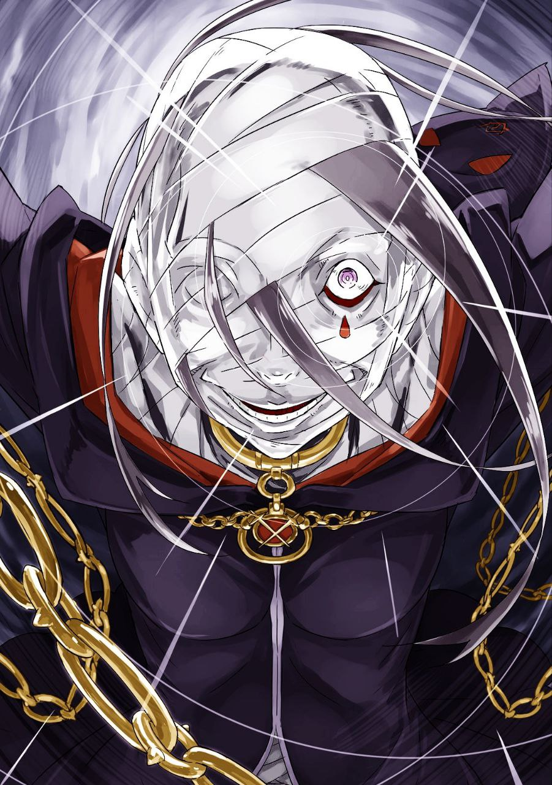

※ ※ ※ ※ ※ ※ ※ ※ ※ ※ ※ ※ ※

Субару завершил важный, но в то же время непринуждённый разговор с Юлиусом и теперь покидал «Гостиницу Водяного Пера» в компании Эмилии и Беатрис.

— «Во дворе ты так мило болтал с Юлиусом, будто лучшие друзья. О чём говорили?» — спросила Эмилия.

— «С чего ты взяла, что мы с ним друзья? Это первое заблуждение. А как думаешь, о чём мы могли говорить?» — отозвался Субару.

— «Ну, может, куда сходить погулять в следующий раз?» — предположила она.

— «Как школьные приятели, что ли?» — усмехнулся он.

Отношения с Юлиусом у Субару были далеко не такими дружескими, как предположила Эмилия. Даже если представить, что они учились бы в одной школе, их места в школьной иерархии были бы настолько разными, что они никогда не оказались бы в одной компании. Школа — это, в сущности, маленькое общество с чётким разделением на слои.

«Если подумать, здесь и там — везде свои сложности и несправедливости…» — пробормотал Субару себе под нос.

— «Эй, эй, так о чём вы всё-таки говорили?» — не унималась Эмилия.

— «Просто выпытывал у него последние новости, типа разведки. Развивал темы из разговора в зале. Что сейчас в моде? Как дела с тем или этим? Ничего особенного,» — ответил Субару.

— «Разве это не то, о чём говорят друзья?» — удивилась Эмилия.

Она наклонила голову в недоумении, и Субару, пожав плечами, тоже задумчиво склонил голову. Да, если судить по лёгкости беседы, можно было бы подумать о дружбе, но между ним и Юлиусом всё было иначе. Это не дружба, а что-то куда более странное и неприятное.

Что именно — он не мог выразить словами, но всё же уверенно заявил:

— «Нет, точно не друзья. Это уж наверняка.»

— «Упрямец…» — вздохнула Эмилия с лёгким укором и посмотрела на Беатрис, идущую рядом. Та ответила не словами, а красноречивым молчаливым вздохом.

Обе девушки, похоже, прекрасно понимали друг друга, и эта их молчаливая солидарность заставила Субару почувствовать себя слегка лишним.

Но вернёмся к сути. Во дворе он действительно обсуждал с Юлиусом дела семьи Астрея — Райнхарда, Вильгельма и того самого Хейнкеля. Однако Субару не решился пересказать всё это Эмилии как есть. Его сдерживало чувство вины.

С одной стороны, он не хотел легкомысленно разглашать чужие семейные тайны. Но главная причина была в другом — он не желал обременять Эмилию лишними заботами, которые она всё равно не могла бы решить.

Проблема семьи Астрея была из тех глубоких, запутанных проклятий, к которым посторонним лучше не прикасаться. Юлиус, видимо, это понимал и поделился этим только с Субару — своего рода признание его как достойного собеседника.

«И почему-то от этого у меня только желудок крутит…» — подумал Субару с лёгким раздражением.

— «Так вот, Субару. Я рада, что ты позвал меня прогуляться, но что ты задумал?» — внезапно спросила Эмилия, прерывая его мысли.

— «…» — Субару замялся.

Пока он боролся с внутренним раздражением, Эмилия вдруг улыбнулась и задала этот вопрос. Субару на мгновение замер от неожиданности, моргнул, а затем пожал плечами.

— «Звучит так, будто я что-то коварное замышляю, Эмилия-тан. Ничего подобного! Я просто хотел прогуляться с тобой по этому прекрасному водному городу, чисто из моего искреннего желания побродить вместе в романтичной обстановке. Ну, может, и была крохотная мыслишка заманить тебя к месту, где водяные драконы обливают водой, чтобы полюбоваться мокрой и прозрачной Эмилией-тан, но это совсем чуть-чуть, честно!» — выпалил он с шутливой интонацией.

— «Вот как? Значит, ты так говоришь. Ну и упрямец же ты, Субару, и к тому же вредина. Даже я понимаю, что такие воздушные объяснения — не настоящая причина,» — ответила Эмилия, слегка надув губы.

— «…» — Субару умолк.

Она посмотрела на него с лёгким недовольством, а Субару лишь приложил руку ко лбу, изображая растерянность. Он бросил взгляд на Беатрис в поисках поддержки, но та, шагая между ним и Эмилией, посмотрела на него с тем же укоризненным выражением, что и Эмилия.

Оставшись без союзников, Субару быстро сдался и поднял обе руки в знак капитуляции.

— «Ладно, сдаюсь. Прости. От плана с мокрой Эмилией-тан отказываюсь,» — сказал он с улыбкой.

— «Су-ба-ру,» — строго произнесла Эмилия, выделяя каждый слог.

Её тон заставил его опустить руки и сдаться уже окончательно.

— «Субару — пошляк,» — добавила она.

— «Я сам тебя этому научил, но, черт возьми, тайминг идеальный, Эмилия-тан. Хотя в моём случае это сейчас больше похоже на награду… Ладно, ладно, скажу правду,» — сдался он.

— «Ну вот ещё!» — возмутилась она.

Эмилия сделала вид, будто собирается его шлёпнуть, а Субару лишь горько улыбнулся.

— «Я не то чтобы скрывал, просто хотел тебя удивить. Мы сейчас идём в городской парк Пристеллы. Вчера я там столкнулся с ‘Певицей’,» — признался он.

— «Ого, с той самой ‘Певицей’? Ты имеешь в виду… сегодня она тоже там будет?» — глаза Эмилии загорелись.

— «Какие у тебя блестящие глазки, прелесть просто. Да, я подумал, что было бы неплохо наладить контакт с этой ‘Певицей’. Не то чтобы я не доверяю переговорным талантам Отто, но я так же верю в его способность проваливать всё, кроме самых критических моментов. Так что это запасной план,» — пояснил Субару.

— «Поняла. Значит, подружиться с ‘Певицей’, чтобы она сама попросила Киритаку отдать нам магические камни?» — уточнила Эмилия.

— «Точно. Молодец, всё правильно поняла,» — похвалил он, изображая круг над её головой.

Эмилия радостно улыбнулась, довольная собой. На самом деле, план был не таким уж чистым и простым, как она себе представляла, но Субару не стал её разочаровывать и портить энтузиазм. Ей действительно хотелось подружиться с Лилианой, и это было искренне. А все закулисные махинации он мог взять на себя незаметно.

«Главное — следить, чтобы Эмилия-тан и Лилиана не устроили какой-нибудь взрывной реакции…» — подумал он.

— «Химическая реакция?» — переспросила Эмилия.

— «Ну, мне кажется, что у тебя с Лилианой может быть хорошая совместимость,» — пояснил Субару.

— «Правда? Хихи, было бы здорово,» — улыбнулась она.

Субару чувствовал лёгкую усталость, предвидя грядущие хлопоты, но не мог не умиляться её чистой радости. Он молился, чтобы Лилиана оказалась в парке, хотя часть его надеялась, что её там не будет — странное противоречие. Если она не придёт, это будет просто прогулка с Эмилией, что тоже неплохо, но…

— «Эмилия-тан, а не прокатиться ли нам вдвоём на водяном драконе? Кажется, это было бы полезнее и для нашего будущего тоже,» — предложил он вдруг.

— «Кру-зинг? Я не знаю, что это, но если это про лодку, ты же укачаешься, Субару. А тащить тебя на спине мне будет тяжеловато, так что не хочу,» — ответила она.

— «Тем более парк уже прямо перед нами. Пора смириться, я полагаю,» — добавила Беатрис, тянувшая его за руку вперёд.

Субару, упрямый до последнего, всё же сдался, когда вход в парк показался на горизонте.

Городской парк с фонтаном в центре уже с утра был полон народу, особенно в этот промежуток между утром и днём. Сегодня толпа у дальнего конца парка казалась даже больше, чем вчера.

— «Я думал, что мы пришли слишком рано и Лилианы может не быть…» — начал Субару.

Но, судя по скоплению людей, его опасения были напрасны. Певица снова выступала, и её рецитал пользовался успехом — зрители неустанно хлопали в ладоши и подпевали, наполняя парк живой энергией.

— «Хлопают и подпевают?» — удивился Субару.

— «Сегодня, похоже, куда оживлённее, чем вчера, я полагаю,» — заметила Беатрис, тоже склонив голову в недоумении.

Утреннее выступление Лилианы по магическому устройству оставило впечатление нежного, завораживающего голоса, который уводит слушателей из реальности. Но сейчас перед ними была настоящая буря восторга, и это вызывало странное чувство — словно что-то чужеродное смешалось с привычным.

— «Все такие весёлые. Вот это ‘Певица’!» — восхитилась Эмилия, глядя на толпу с сияющими глазами.

Но Субару, напротив, ощутил смутное беспокойство. Что-то подсказывало ему, что если они подойдут к окружённому толпой месту, то пожалеют об этом.

— «…» — он замялся, не находя слов.

Однако это предчувствие не обрело чёткой формы, и он не успел остановить Эмилию. Её глаза горели ожиданием, и он не смог бы разбить эту искру в её фиолетовых зрачках. Решение было принято слишком поздно.

Ритмичные хлопки переросли в гром аплодисментов. Это означало, что представление, окружённое толпой, подошло к финалу. Зрители начали вставать, их возбуждённые лица повернулись к центру внимания.

И там…

— «Это был потрясающий танец! Я чуть не описалась от восторга, такие невероятные движения!» — раздался звонкий голос.

— «А ты сама неплохо позабавила меня своим пением и игрой. Молодец. Давненько я так не наслаждалась искусством,» — ответил другой, более властный голос.

Перед толпой крепко пожимали друг другу руки ‘Певица’ и некая рыжая женщина.

Предчувствие Субару оправдалось.

Сегодня Лилиана снова принимала слёзные благодарности от слушателей, которые не могли сдержать эмоций после её пения и игры. Но в отличие от вчерашнего дня, рядом с ней стояла Присцилла, и толпа осыпала её похвалами: «Танец был невероятный!», «Я так тронута!», «Приду ещё раз!». Присцилла, явно в хорошем настроении, величественно кивала, обмахиваясь веером.

Когда общение с поклонниками закончилось, остались только они — Лилиана, Присцилла и подошедшая троица Субару. Лилиана заметила их, стоящих в стороне, и её хвостики подпрыгнули — непонятно, как это физически возможно.

— «Ой-ой! А это не Нацуки Субару и Эмилия ли собственной персоной? И даже малышка Нацуки с вами! Что вас сюда привело?» — воскликнула она.

— «Малышка? Это ещё что такое? Субару, объясняй, я полагаю,» — нахмурилась Беатрис.

— «Пусть она сама объясняет. На, держи конфету и сиди тихо,» — отмахнулся Субару, протягивая ей леденец.

— «Меня так просто не обманешь…

чмок

… я полагаю…

чмок

…» — пробормотала Беатрис, катая конфету во рту.

Субару оставил её в покое и подошёл к Лилиане, чьи хвостики крутились, словно собачий хвост. Эмилия, стоя рядом, округлила глаза от чрезмерной экспрессии певицы, но это было только начало.

— «Вчера виделись, но сегодня ты снова на высоте. Опять Киритака тебя выгнал утром, да?» — спросил Субару.

— «Не-е-ет! Ну, почти. Я же такая обаятельная, и когда меня так искренне просят, я просто не могу отказать — это мой звёздный момент!» — гордо заявила Лилиана.

— «Ладно, устроила рецитал после того, как тебя выставили за дверь, но…» — начал Субару, переводя взгляд на Присциллу.

Та стояла рядом, обнимая руками свою пышную грудь. Заметив его взгляд, она высокомерно фыркнула:

— «Что пялишься с самого начала, ничтожество? Я могу простить, что мой танец тебя заворожил, но продолжать пожирать меня похотливым взглядом — это уже дерзость. Пусть мужская природа и склоняет тебя к моему обаянию, но я дозволяю лишь глотать слюни и фантазировать о моём аромате в одиночестве.»

— «Я твой танец вообще не видел и не впечатлялся. Мне нравятся скромные девушки вроде Эмилии-тан. А когда кто-то так откровенно выставляет себя напоказ, как ты, у меня наоборот всё желание пропадает,» — парировал Субару.

— «Предпочесть мне жалкую полудемоншу — это уже не оправдать. Впрочем, я не настолько мелочна, чтобы не терпеть в мире любителей дурного вкуса. А если ты вообще не способен распознать истинную красоту, то твоя недалёкость вполне объяснима,» — отрезала Присцилла.

Субару понял, что спорить с ней бесполезно — их ценности были слишком разными. Присцилла считала себя центром мира, и его здравый смысл тут был бессилен.

Тем временем Эмилия, удивлённо глядя на неё, спросила:

— «Танец? Так ты танцевала, Присцилла?»

— «Жалей, что пропустила. Я редко танцую без настроения, но пение этой девки его вызвало,» — ответила Присцилла, указав на Лилиану.

Субару удивился, а Лилиана закатила глаза и чуть не упала в обморок. Не обращая внимания на её реакцию, он внимательно посмотрел на Присциллу:

— «Ты танцевала? С трудом верится.»

— «Как тогда объяснишь восторг этих глупцов? В голосе этой девки есть магия, но без моего танца толпа осталась бы просто куклами, что слушают. Это тоже способ наслаждаться песней, но мне он не по вкусу. Раз уж эти недоумки такие тупые, пусть хотя бы своими выходками добавляют красок в моё настроение,» — заявила она.

— «…То есть дуракам лучше дурачиться по-дурацки, чтобы было веселее?» — уточнил Субару.

— «О, для тупицы ты неплохо соображаешь,» — кивнула Присцилла с ноткой удивления, хотя похвала эта его не обрадовала.

К тому же он подозревал, что она могла вообще забыть их встречу в зале. Главное, чтобы она помнила Эмилию — это уже не так важно.

— «Но всё же, Присцилла и Эмилия! Такие известные личности почтили меня своим визитом — я в восторге!» — вмешалась Лилиана, спасая ситуацию от накала.

Её реакция смягчила напряжение. Зная о противостоянии сторон, она явно старалась сгладить углы. Её дурашливость, возможно, была намеренной.

— «Хе-хе! Это всё потому, что мои песни такие чудесные? Ой, я прям засмущалась, хи-хи-хи!» — захихикала Лилиана.

— «Нет, это просто ты такая,» — вздохнул Субару, понимая, что переоценил её осознанность.

Тут он заметил, что Присцилла одна, и спросил:

— «Ты что, одна? Где Ал, тот придурок и милый дворецкий?»

— «Шульт потеряется, если его отпустить гулять. Он старательный, но ничего не доводит до конца — милый в своей бесполезности. Ал раздражает своими нотациями, так что я отправила его по делам. А про придурка не знаю. Наверное, шатается по тавернам,» — ответила она.

— «Придурок, значит, универсальное слово…» — удивился Субару её откровенности.

Её отношение к Хейнкелю, которого она вроде бы приняла в свою команду, тоже поражало. Если он ей так не нравится, зачем вообще его держать?

— «Всё равно скажешь, что это ради забавы…» — пробормотал он.

— «Знаешь и спрашиваешь? Причина его присутствия — мелочь. Я взяла его, потому что он показался полезным для развлечений. Станет обузой — выгоню. Он это понимает,» — отмахнулась Присцилла.

— «Сомневаюсь. Мне он показался не таким уж сообразительным,» — возразил Субару.

Именно из-за этого Хейнкель и попал под её гнев. Или для неё это уже не важно?

— «Но тебе не опасно одной? Хотя у меня с Эмилией-тан тоже не особо убедительно звучит…» — добавил он.

— «Какая мне опасность без трёх слуг? Их присутствие разве что спину прикрывает, и то с натяжкой,» — фыркнула она.

Субару почти пожалел Ала и остальных — их даже за силу не считали. Но после того, что он видел в зале, это казалось правдой. Движения Присциллы были сверхчеловеческими.

«Кстати, она мне челюсть ломала когда-то…» — вспомнил он вдруг.

В одном из кругов в столице Присцилла ударила его так, что он взлетел к потолку и чуть не умер. Воспоминание вызвало фантомную боль в челюсти.

— «Так ты гуляла без них и встретила Лилиану?» — спросил он.

— «Городской пейзаж сам по себе неплохо скрасил мою скуку. Здесь не так тесно, как в столице, есть на что посмотреть. Слушала журчание воды, а потом услышала её пение,» — пояснила Присцилла.

— «Да уж, когда она вдруг ворвалась с танцем, я думала, всё пропало! Бывает, знаете, такие смельчаки лезут в моё выступление и портят атмосферу. Обычно я их песней вырубаю и перевоспитываю!» — вставила Лилиана.

— «Ты точно не похожа на ‘Певицу’…» — вздохнул Субару.

Отбиваться песнями от хулиганов — это слишком круто. И внезапный танец Присциллы тоже ошеломлял. Судя по реакции толпы, её танец был невероятным.

— «Привлекать внимание толпы без моего участия — это уже перебор. Но твои песни того стоят. Как насчёт того, чтобы пойти со мной? В моём поместье ты будешь играть для меня, когда я пожелаю,» — предложила Присцилла.

— «…» — Лилиана замерла.

Её голос явно понравился Присцилле, и это было типичное для неё требование — забрать себе то, что ей приглянулось. Но в этом чувствовалась угроза: не отдашь добровольно — возьму силой.

И тут Лилиана ответила:

— «Спасибо огромное! Это такая честь, правда! Но… но… но я откажусь!»

Она не знала тёмной стороны Присциллы и не умела читать атмосферу. С бесстрашной улыбкой она отвергла предложение.

— «Отказываешься? Почему?» — голос Присциллы стал ниже, а взгляд потемнел.

Субару почувствовал холодок — её тон предвещал беду.

В напряжённой тишине Лилиана погладила футляр своего инструмента и сказала:

— «Я Лилиана, бард. Сейчас я задержалась в городе по просьбе, но в душе я вольный странник, следующий за ветром. Я не привязываюсь ни к месту, ни к людям — таков мой путь и моя жизнь.»

— «И потому не примешь моё предложение?» — уточнила Присцилла.

— «Моя мать, её мать и её мать до неё — все женщины моего рода жили так. Мы не оставляем материальных следов, только песни в сердцах людей. Ветер нельзя поймать, песню нельзя заглушить. Поэтому…» — она подняла инструмент с гордостью. — «Я благодарна за приглашение, но откажусь. Где будет звучать моя песня — я и сама не знаю, это решает ветер.»

В её словах не было ни тени сомнения. Здесь не было привычной легкомысленности или раздражающей дерзости — только гордость барда, несущего истории через песни.

Присцилла, скрестив руки, закрыла один глаз, а вторым, пылающим как магма, уставилась на Лилиану. Затем она выдохнула и произнесла:

— «Хорошо. Твоя верность делу забавна. Прощаю. Это я была груба.»

— «Да нет же! Это мне жаль, что так вышло,» — ответила Лилиана с улыбкой.

Субару смотрел на них в полном изумлении. Присцилла бросила на него недовольный взгляд:

— «Что за глупая рожа, простолюдин? О чём ты думаешь?»

— «О чём? Да я в шоке, вот о чём! Думал, ты сейчас Лилиану на куски разорвёшь за отказ…» — честно признался он.

— «Какая нелепая тревога,» — фыркнула она.

Но Субару так не казалось. До ответа Лилианы Присцилла точно была готова её убить — он видел это в её глазах. Лилиана выжила лишь благодаря случайному везению.

— «Я тоже немного удивилась. Думала, Присцилла хочет держать всё желаемое при себе,» — вдруг сказала Эмилия.

Субару замер, боясь, что она наступила на мину. Присцилла прищурила глаз:

— «Не болтай глупостей, полудемонша. С твоими мутными глазами ты смеешь судить обо мне? Это уже не просто дерзость, а оскорбление.»

— «Только и умеешь, что языком молоть, я полагаю. Вместо того чтобы цепляться к чужому происхождению, посмотрела бы на себя — все вокруг считают тебя такой же. Это было бы куда полезнее для всех,» — вмешалась Беатрис, держа Эмилию за руку.

Присцилла подняла бровь, впервые заметив её:

— «Девочка осмеливается много говорить. Знай, моя милость не зависит от возраста. Если думаешь, что твоя юность оправдает твою наглость, исправься прямо сейчас.»

— «Не твоё дело, я полагаю. Если считаешь меня ребёнком по виду, то сама напросишься на неприятности,» — огрызнулась Беатрис.

Между ними искры летели. Их совместимость явно стремилась к нулю. Субару не сомневался в победе Беатрис, но драка между ними была бы катастрофой — всё-таки речь о кандидатах.

— «Хватит, Беако. Присцилла, конечно, бесит, но с ней спорить бесполезно,» — попытался он вмешаться.

— «Не останавливай меня, Субару! Тебя не злит, как она унизила Эмилию? Где твоя мужская гордость, я полагаю?» — возмутилась Беатрис.

— «Не говори такие страшные вещи! И вообще…» — начал он.

Беатрис злилась за Эмилию, а не за себя, и это тронуло Субару. Эмилия, похоже, чувствовала то же самое.

— «Беатрис, всё в порядке,» — мягко сказала она, погладив её по голове.

Беатрис на миг показала слёзы, но тут же вернула себе обычное выражение, бросив взгляд на Присциллу:

— «Благодари судьбу за спасение, я полагаю.»

— «Это тебе стоит благодарить свою милую внешность,» — парировала Присцилла, фыркнув.

Кажется, она всё-таки похвалила внешность Беатрис, но та, кипя от злости, этого не заметила. Что вообще творится в голове у этой женщины?

— «Ты реально непонятная…» — пробормотал Субару.

— «Естественно. Пытаться понять женщину, тем более меня, — это уже слишком самонадеянно,» — ответила она.

— «Так это я виноват теперь? Хотя всё началось с того, что ты захотела забрать Лилиану…» — возразил он.

Почему Присцилла всё-таки отпустила Лилиану, оставалось загадкой. Он посмотрел на неё, и она, закрыв рот веером, сказала:

— «Всё в этом мире — моё. Зачем мне держать подле себя прекрасное и благородное? Оно и так будет там, где ему место.»

— «…» — Субару замолчал.

— «Если весь мир — мой сад, неважно, где поёт птица. Запирать её в клетку — грубо, защищать от врагов — лишнее. Всё это раздражает,» — добавила она.

Её философия отталкивала и поражала одновременно. Субару понимал её слова, но масштаб их миров был несопоставим. Он никогда не поймёт её полностью.

Это пугало. Но он подумал, что кто-то, возможно, восхищается этим страхом. Может, поэтому Ал следует за ней?

— «Так-так-так! А давайте я спою для всех, чтобы разрядить обстановку и подружиться!» — внезапно предложила Лилиана, вынимая лютню и быстро перебирая струны.

Она закружилась, привлекая внимание:

— «На этот раз, Присцилла, просто наслаждайтесь песней без танцев! Я покажу вам настоящую Пе-ви-цу на полную мощь!»

— «Ого,» — заинтересовалась Присцилла.

— «Эмилия, вы, кажется, пропустили начало прошлого раза. Докажу, что я не просто милашка, а поэт, зарабатывающий голосом и мастерством!» — добавила Лилиана.

— «Серьёзно?» — удивилась Эмилия.

— «Ты довольна таким скучным описанием?» — усмехнулся Субару.

Эмилия явно заинтересовалась, несмотря на недавний спор. Она и Присцилла стояли на расстоянии, а Лилиана готовилась. Затем она подозвала Субару и шепнула:

— «Нацуки, мне кажется, Эмилия и Присцилла не очень ладят?»

— «Это очевидно, если знаешь их положение. Плюс Присцилла вообще со всеми не в ладах, вот Эмилия-тан и такая,» — ответил он.

— «Это проблема!» — воскликнула Лилиана, и её волосы подпрыгнули, как у встревоженной собаки.

— «Тогда я их заворожу песней! О, ты что, подумал что-то пошленькое, когда я сказала ‘сниму кожу’? Нельзя так, это неприлично!» — добавила она.

— «Утомительно, когда ты заставляешь восхищаться и презирать тебя в одном предложении,» — вздохнул Субару.

Её идея разрядить обстановку песней была понятна. Обе заинтересованы в её пении, и даже Присцилла не станет мешать Эмилии во время выступления.

— «А после песни, Нацуки, купи что-нибудь вкусное! Сладости растопят сердца и сблизят всех, разве нет? Разве нет?» — предложила она.

— «Нет,» — отрезал он.

— «А после песни, Нацуки, купи что-нибудь вкусное! Сладости растопят сердца и сблизят всех, разве нет? Разве нет?» — повторила она слово в слово.

— «Это что, выбор, где надо сказать ‘да’, чтобы продолжить?» — сдался он, выбрав «да».

Лилиана просияла. Её идея не лишена смысла — забота о других от неё была неожиданной.

— «Короче, я схожу за едой, пока Лилиана поёт. Эмилия-тан, не ссорьтесь и жди меня спокойно,» — сказал Субару.

— «Не волнуйся, я справлюсь. Я же не хочу ругаться с Присциллой,» — заверила она с улыбкой.

Субару верил ей, но Присцилла могла спровоцировать сама.

— «Беатрис, присмотри за Эмилией-тан, если что,» — попросил он.

— «Я знаю, я полагаю. Если эта девка снова скажет ерунду, сожгу её дотла,» — ответила она.

— «И ты тоже не ссорьтесь, пожалуйста,» — добавил он.

Оставив горящую энтузиазмом Беатрис, он пошёл к выходу из парка, но остановился:

— «Присцилла, ты что-то не ешь?»

— «Удивительно, что у тебя, простолюдина, есть зачатки заботы. Ладно, поднеси мне достойное. Если принесёшь ерунду, положишь свою голову вместе с ней,» — ответила она.

— «Я не проиграл в камень-ножницы-бумагу, чтобы бегать за тобой! Почему такие жестокие условия?» — возмутился он.

Он подумал принести ей что-то экзотическое из мести, а Присцилла нахмурилась:

— «Камень-ножницы… что?»

Кажется, она забыла не только его, но и игру. Сложная девица.

— «Субару, осторожнее,» — сказала Эмилия.

— «Зови меня сразу, если что, я полагаю,» — добавила Беатрис.

Попрощавшись с ними, Субару помахал рукой. Лилиана попыталась подмигнуть, но закрыла оба глаза — он махнул ей в ответ и побежал прочь.

Вскоре до него донеслись звуки лютни, и он ускорил шаг, чтобы вернуться и успеть на выступление.

Через десять минут после ухода Субару:

— «Я и правда трус, а…» — вздохнул он, глядя в бумажный пакет.

Купив сладости, он вышел из магазина. По пути его заинтересовало местное лакомство — «Желе Гина», но он не решился взять его для Присциллы. Официально — из-за боязни испортить отношения между лагерями, но на деле он просто побоялся её реакции.

— «Похоже на угря в желе… Интересно, вкус такой же? Жалко, что не хватило смелости проверить, но мне и так нормально,» — пробормотал он, ускоряя шаг к парку.

Десять минут — не так много, и через связь с Беатрис он не чувствовал тревоги. Но всё равно хотел вернуться скорее.

— «Ой, прости!» — воскликнул он, чуть не врезавшись в кого-то на повороте.

Он увернулся и обернулся извиниться:

— «Прости, кажется, не задел. Всё нормально?»

— «Эй, братишка, это что, извинение? Надо больше искренности, или… уф!» — начал грубый голос, но осёкся.

Субару тоже узнал собеседника и вздохнул:

— «Чин? Ты что, даже с работой у Фельт всё ещё играешь в бандита?»

— «Заткнись! Я не Чин, сколько раз говорить! И какого ты тут шатаешься?» — рявкнул Рачинс, плюясь.

— «Тон и Кан не с тобой? Один — это редкость,» — заметил Субару.

— «Редкость? Да что ты обо мне знаешь, чтобы судить? Отвали, не до тебя!» — отмахнулся он.

— «Не будь таким холодным. Мы же через смерть прошли вместе,» — подмигнул Субару.

— «Ни черта я такого не помню!» — возмутился Рачинс.

Субару шутил, но Рачинс явно не был в настроении. Почему-то он чувствовал к нему симпатию — возможно, из-за того, что Тон, Чин и Кан казались ему обычными людьми в мире, полном выдающихся личностей. После стольких встреч с героями такие ребята были как глоток свежего воздуха. Даже несмотря на то, что они однажды его убили.

— «Короче, не лезь ко мне! Я на задании!» — бросил Рачинс.

— «Ты, который только и делал, что людям мешал, теперь на работе? Я прям прослезился,» — поддразнил Субару.

— «Кто ты такой вообще!» — цыкнул Рачинс и скрылся в толпе.

Субару почесал голову, признавая, что перегнул с дружелюбием. Он двинулся к парку, но вдруг остановился.

— «Хм?» — промычал он, оглядываясь.

Толпа, в которой скрылся Рачинс, замерла, глядя куда-то вверх. Субару тоже невольно остановился. Рачинс, застряв в людской массе, выругался и высунулся из неё:

— «Чёрт возьми, что все уставились?»

Он посмотрел туда же, куда и остальные — на крышу высокого здания с магическим кристаллом на вершине. Это была башня времени — обычная для крупных городов вещь, одна из многих в Пристелле.

Но там, на краю открытого окна башни, стоял человек.

— «Привет всем! Извините за беспокойство, простите,» — раздался голос.

Фигура в странном одеянии привлекала взгляды толпы, дрожа от восторга под их вниманием.

— «Спасибо. Дайте мне всего пару минут вашего времени,» — продолжил голос, полный эгоизма, несмотря на извинения.

Его дрожащий, надтреснутый тон вызывал неприятное чувство, царапая душу. Возможно, это было связано с его видом.

Голову незнакомца покрывали небрежно намотанные бинты, из-под которых сверкали безумные глаза. Чёрный плащ скрывал тело, а руки опутывали длинные цепи, волочащиеся по полу. Он беспокойно ходил туда-сюда по краю башни.

Толпа не могла отвести взгляд, а он, вероятно, улыбаясь под бинтами, исказил лицо в жуткой гримасе:

— «Простите. Я из Культа Ведьмы, Архиепископ Греха, ответственный за ‘Гнев’.»

Он назвал своё звание с ужасающей уверенностью.

— «Меня зовут Сириус Романеконти,» — закончил он, и в его голосе прозвучала злоба, сопровождаемая смехом.

※ ※ ※ ※ ※ ※ ※ ※ ※ ※ ※ ※ ※
