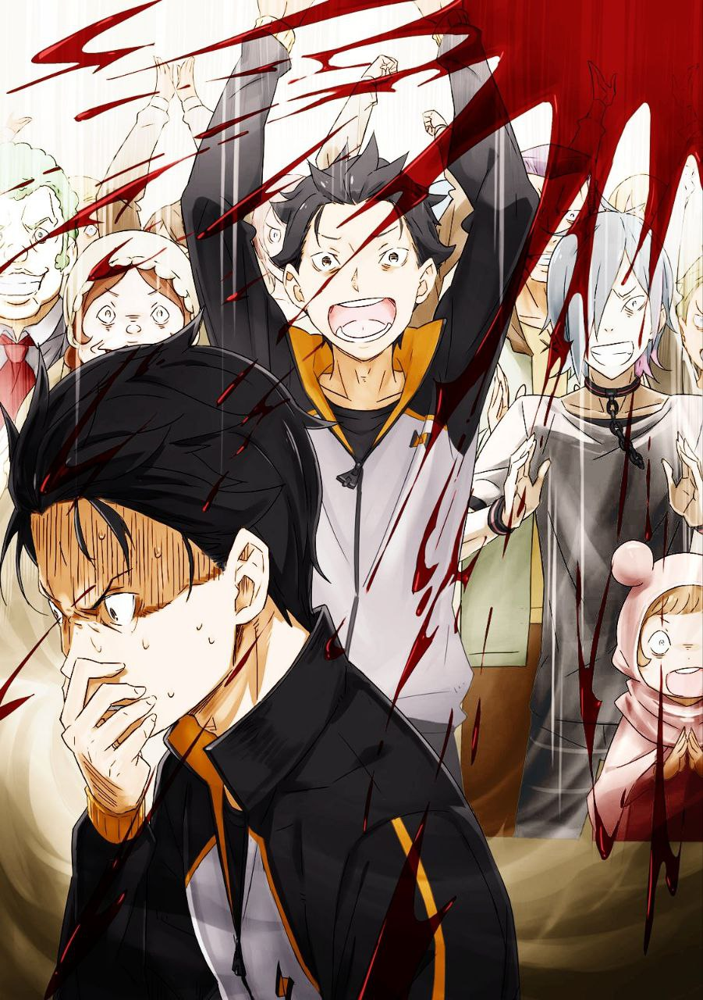

※ ※ ※ ※ ※ ※ ※ ※ ※ ※ ※ ※ ※

Слова, произнесённые сверху, звучали то ли дружелюбно, то ли официально, и толпа, задравшая головы, замерла в молчании.

Отчасти это объяснялось тем, что фигура, стоящая над ними, выглядела до крайности необычно и притягивала взгляды. Но ещё большее значение имели слова, которые невозможно было пропустить мимо ушей.

Впрочем, всё это, вероятно, было лишь побочным эффектом.

Настоящая причина, по которой никто не мог отвести глаз или отвлечься от этой фигуры, была куда проще и понятнее.

Это можно было назвать первобытным инстинктом живого существа.

— Перед лицом врага, угрожающего твоей жизни, только глупец отведёт взгляд.

— «Э, что?»

— «Что этот человек только что сказал?»

— «Это что, шутка? Культ Ведьмы здесь?..»

Сначала толпу охватило замешательство, а затем понимание начало медленно распространяться среди людей. Но никто не был способен сразу же действовать. Все сомневались в услышанном, обмениваясь растерянными взглядами с окружающими, словно пытаясь разделить своё непонимание.

— «Что этот ублюдок только что сказал? Ты слышал?!» — крикнул Рачинс, заметив Субару и пробираясь к нему сквозь толпу.

Пока Рачинс, оглядываясь на фигуру сверху, приближался, Субару стоял чуть в стороне от толпы, не отрывая глаз от того, кто возвышался над ними. Отвести взгляд сейчас означало бы допустить непоправимое.

В личности этого существа не было никаких сомнений.

— Это тот же тип тварей, что и Петельгейс, — пробормотал Субару.

— И к тому же… Романée-Конти?

Фигура в бинтах представилась — Сириус Романée-Конти.

Звучало абсурдно, но фамилия Романée-Конти совпадала с той, что носил Петельгейс Романée-Конти. Конечно, между злым духом Петельгейсом и кем-то, кто мог бы быть его кровным родственником в прямом смысле, не могло быть никакой связи.

— Неужели все Архиепископы Греха решили взять себе одинаковую фамилию? — усмехнулся Субару.

Если бы существовала семья Романée-Конти, это был бы настоящий кошмар. Династия, из поколения в поколение поставляющая Культу Ведьмы Архиепископов Греха? Слишком нелепая и извращённая идея, от которой даже нос воротило, словно от зловония.

Но вместе с этим в душе Субару поднималась неугасающая ярость к Культу Ведьмы. Пусть это и не тот «Чревоугодие», за которым он охотился, но раз перед ним стоял Архиепископ Греха…

— Я схвачу его и заставлю выложить всё, что он знает, — решил Субару.

Приняв решение, он тут же подавил вспыхнувший в сердце огонь, сосредоточившись на связи с Беатрис, что теплилась в его груди. Стоило позвать её, и она явилась бы к нему — таков был эффект контракта между ним и духом, связывающий их невидимой нитью.

Субару ощутил эту горячую связь с другим существом глубоко внутри себя, ухватился за неё, потянул…

— «А вот и всё!» — раздался громкий хлопок и крик сверху, прервав его на полпути.

— !?

Субару замер, не успев вызвать Беатрис. Сухой звук хлопка и громкий голос эхом разнеслись по городу, заставив его невольно затаить дыхание. Фигура в бинтах — Сириус — хлопнула в ладоши так сильно, что звук, казалось, достиг каждого уголка площади. Субару широко распахнул глаза, а Сириус, обведя толпу выпученными глазами, заговорила:

— «Вам понадобилось целых двадцать две секунды, чтобы затихнуть. Но спасибо, что всё-таки успокоились. Я очень рада. И ещё…»

С лёгкой насмешкой, но при этом с благодарностью, Сириус покачивала телом из стороны в сторону, сложив руки. Она выглядела искренне довольной, хотя цепи, свисавшие с её запястий, всё ещё позвякивали, царапая стену башни, и этот звук неприятно резал слух.

— «Ты там, и ты, и вон те ребята, и ты поближе… Простите, не сердитесь так сильно. Мне правда очень жаль отнимать ваше драгоценное время. Простите. И спасибо.»

— Фу… — выдохнул Субару.

Сириус извивалась, словно змея, и её слова звучали искренне, но Субару не успел выкрикнуть «хватит дурить». Причина была проста: среди тех, кого она только что указала пальцем, призывая «не сердиться», был и он сам.

Субару оглянулся. Среди тех, кого выделила Сириус, оказались ещё четверо: зверочеловек, опустивший меч, женщина с повязкой на глазу, сам Рачинс, побледневший от страха, и ещё один мужчина. Судя по всему, это были те, кто, возможно, имел какой-то боевой опыт. Сириус явно заметила их готовность действовать и указала на них заранее, предупреждая: «Я всё вижу».

— …

По лбу Субару стекал пот, и он решил пока не вызывать Беатрис. Он слишком хорошо понимал, насколько опасно позволить Культу Ведьмы захватить инициативу, но выбора не было. На площади вокруг него сгрудилось не меньше тридцати человек. Если нельзя допустить, чтобы враг взял верх, то эта ситуация уже была ошибкой.

Субару взглядом попытался связаться с остальными четырьмя, которых выделила Сириус. Зверочеловек-женщина, похожая на авантюристку, и суровый горожанин кивнули, уловив его намерение. Но Рачинс, встретившись с ним глазами, лишь неуверенно отвёл взгляд, не скрывая сомнений.

Скорее всего, козырь Рачинса — призыв Райнхарда. Вчера тот велел ему подать сигнал в случае беды. Если бы Рачинс исполнил договорённость, Райнхард явился бы сюда и с лёгкостью одолел бы даже Архиепископа Греха, каким бы сильным тот ни был. Но что делать с жертвами, которые могли возникнуть в процессе? Именно это, вероятно, заставляло Рачинса колебаться.

Если отбросить страх перед жертвами, у них был способ устранить Сириус. Но стоило ли прибегать к нему прямо сейчас? Можно ли было смириться с неизбежными потерями?

— «Спасибо! Кажется, вы все немного успокоились, да? Я понимаю ваше беспокойство. Слово “Культ Ведьмы” вряд ли вызывает у кого-то приятные чувства. Поэтому я и не собираюсь делать ничего особенного. Просто сегодня мне нужно кое-что проверить, вот и всё. Потому я и заняла немного вашего времени,» — сказала Сириус.

— Проверить кое-что?.. — переспросил Субару.

— «Простите, не шумите, пожалуйста. Если вы все заговорите разом, я запутаюсь — я ведь не слишком умная. Мне станет грустно. А это ведь плохо, правда? Если у вас есть вопросы, говорите со мной. Я чувствую себя виноватой за то, что отнимаю ваше время, так что отвечу почти на всё, что спросите.»

Её дружелюбный тон и рациональные доводы вызывали скорее отвращение. Зубы, обнажённые до предела из-за отсутствия губ, и лицо, почти полностью скрытое бинтами, с вырезом только для глаз, не внушали доверия. Очевидно, все испытывали то же самое — никто не решался заговорить, лишь обмениваясь взглядами.

— «Тогда позволь задать вопрос, раз уж ты сама предложила,» — сказал Субару, поднимая руку.

Он почувствовал, как вокруг него распространилось удивление, но не отвёл глаз от Сириус, стоящей наверху. Она посмотрела на него сверху вниз и ответила:

— «Конечно, пожалуйста! Спасибо. Ты тот самый сердитый парень оттуда, да? Я рада, что ты решил поговорить со мной. Что ты хочешь узнать?»

— «Не знаю, зачем ты здесь, но я заставляю ждать девушек. Четырёх, между прочим. Так что было бы здорово, если бы ты поскорее закончила свои дела и отпустила нас.»

— «Ого! Это серьёзно, прости. Но ты не промах, да? Четыре девушки — это же мечта любого мужчины! Нехорошо так поступать. Ты ведь не заставляешь их плакать, страдать и мучиться, правда? Это неправильно, нельзя так, это недопустимо, абсолютно недопустимо!»

— «Эй, ты чего?..»

Сначала её голос звучал весело, но затем стал тише, она опустила голову и начала быстро бормотать. Услышав растерянный возглас Субару, Сириус резко вскинула голову:

— «Ой, прости, чуть не сорвалась. Я стараюсь держать себя в руках, но если не слежу, то слишком увлекаюсь. Спасибо, что переживаешь. Так… ты говорил про то, чтобы вас отпустить?»

— «Да, именно. Было бы здорово, если бы всё прошло мирно.»

— «Прости, что заставила тебя волноваться. Но не переживай! В Культе Ведьмы я считаюсь одной из самых спокойных и безобидных. Правда, другие иногда доставляют неприятности, и мне за них стыдно.»

Разговор шёл на удивление гладко, и Субару начал подозревать неладное. Мягкий тон, готовность к диалогу… И вдруг ему показалось, что Сириус, возможно, женщина. Лицо скрывали бинты, тело — слишком большой плащ, а голос, хоть и высокий, звучал скорее механически, чем женственно. Но интуиция подсказывала ему, что это могла быть женщина.

Пока что в её поведении не было ничего особенно угрожающего. Если забыть о её эффектном появлении, принадлежности к Культу и странной внешности, она казалась даже более адекватной, чем Присцилла. Напряжение в толпе тоже начало спадать — люди уже не столько боялись, сколько ждали, чем всё закончится. Даже Субару почувствовал, как его собственная тревога немного утихла.

— «Спасибо. И прости, кажется, я вас всех напугала. Но я рада, что вы готовы меня выслушать,» — сказала Сириус.

— «Это не значит, что я тебя одобряю или прощаю. Просто скажи, зачем пришла, а там посмотрим,» — ответил Субару.

— «Да, спасибо, что напомнил. Тогда перейду к делу. Я появилась здесь, чтобы проверить одну простую вещь.»

Она покачивала телом, позвякивая цепями на руках, и этот звук уже не казался таким зловещим — скорее забавным, как у шута или уличного артиста. Субару расслабился, отпуская напряжение и мысль о вызове Беатрис. Он решил выслушать её и поскорее уйти.

— «И что ты хочешь узнать?» — спросил он.

— «Да, скажи уже поскорее!» — подхватил кто-то из толпы.

— «Точно, а то я на работу опоздаю!» — добавил другой, указывая на магический кристалл времени над головой Сириус.

Толпа разразилась смехом. Субару тоже невольно улыбнулся, а Сириус, смущённо коснувшись головы, ответила:

— «Простите, простите, правда простите! Я знаю, что вы заняты. Скоро закончу, потерпите ещё чуть-чуть.»

— «Так давай быстрее!» — крикнули из толпы.

— «Да! Хорошо! Я хочу проверить одну простую вещь. А именно — “любовь”. Ой, как неловко,» — сказала Сириус, прикрывая лицо руками, словно стесняясь.

Её щёки не было видно из-за бинтов, но жест вызвал улыбки в толпе. Атмосфера становилась всё более непринуждённой, и Сириус, смущённо теребя цепи, продолжила:

— «Я знала, что надо мной посмеются, но всё равно неловко. Спасибо, что слушаете. И раз уж вы такие добрые, у меня есть просьба.»

— «Какая просьба?» — спросил Субару.

— «Не могли бы вы немного помочь мне с проверкой этой “любви”? Простите, что прошу о таком эгоистичном.»

Её скромный тон и робкие движения вызвали у толпы реакцию вроде «да ладно, всего-то?». Субару, скрестив руки, тоже кивнул, умиляясь этой сцене. Сириус, заметив это, хлопнула в ладоши, её глаза заблестели:

— «Правда? Спасибо, спасибо, простите! Мир всё-таки добрый. Полон доброты и любви. Каждый раз, когда я это чувствую, мне хочется благодарить. Прощать друг друга, уступать друг другу… Может, я и говорю “спасибо” и “прости”, чтобы убедиться в этом?»

— «Да понял, понял! Сириус, что дальше-то?» — крикнула женщина с повязкой на глазу, подбадривая её, словно старая подруга.

— «Ой, прости!» — ответила Сириус, смеясь.

Она подошла к окну башни, из которой выглядывала, и засунула туда руку.

— «Прости, что заставила тебя ждать. Иди сюда,» — мягко сказала она.

— !..

С этими словами Сириус вытащила из окна маленькую фигурку — ребёнка, который отчаянно вырывался и стонал. Это был мальчик, ещё совсем юный, скованный цепями по всему телу. Цепи опутывали его от ног до плеч, даже рот был затянут ими, и из уголков губ стекала кровь. Он отчаянно мотал головой — единственной свободной частью тела — и плакал, словно умоляя о чём-то.

— «Прости, что тебе тесно. Но ты же мальчик, не плачь так сильно. И, хоть я хотела это скрыть, кажется, ты ещё и обмочился. Это ведь стыдно, и будет грустно, если все узнают, да?» — сказала Сириус.

— «М-м! М-м-м!!» — промычал мальчик.

— «Точно, стыдно!» — крикнул кто-то из толпы.

— «Ты же мальчик, не плачь, не плачь!» — подхватил другой.

— «Мужчина может плакать только три раза в жизни! Ха-ха-ха!» — добавил третий.

Толпа начала подтрунивать над плачущим мальчиком, вторя Сириус. Все когда-то переживали подобные детские страхи и слёзы, так что в их словах не было злобы — лишь лёгкая бестактность.

— «Ну-ну, не надо так говорить! Да, сейчас он маленький, но этот мальчик очень храбрый. Правда, Люсбел?» — сказала Сириус, обращаясь к ребёнку.

— !..

Сириус легко подняла мальчика одной рукой, несмотря на тяжесть цепей, и мягко погладила его по голове, укоряя толпу. Люсбел — так его звали — изо всех сил пытался отстраниться от её лица, отчаянно мотая головой. Это выглядело немного комично, и некоторые невольно сдерживали смешки.

— «Итак, внимание, пожалуйста! Простите. Его зовут Люсбел, ему девять лет, и он живёт здесь, в Пристелле. Его полное имя — Люсбел Каллард. Его отец, Муслан Каллард, работает наблюдателем, следящим за стабильностью водных потоков в городских каналах. Мама, Ина Каллард, сейчас беременна, её живот уже заметно округлился, и Люсбел с нетерпением ждёт братика или сестричку. Семья Каллард живёт в третьем районе, и Люсбел каждый день ходит играть в городской парк вместе со своей подружкой Тиной. Они с Тиной — друзья детства, и им друг друга не разлюбить. Тина поддерживает мечту Люсбела. Кстати, Тина — это девочка с бледно-золотыми кудряшками, настоящая маленькая красавица, из которой вырастет что-то невероятное. А мечта Люсбела, которую она поддерживает, — стать знаменитым авантюристом, как Драфин из песни “Драфин, преданный заходящим солнцем”, и обрести много товарищей. Мечта простая, мальчишеская, трогательная. Кто-то, может, и посмеётся над её детскостью, но я так не считаю. Кто посмеет высмеять искренние чувства мальчика? Тина, наверное, тоже так думает, раз от всего сердца его поддерживает. Да, Люсбел хочет стать авантюристом, но он очень ждёт рождения братика или сестрички. Хоть ему и хочется прямо сейчас отправиться в приключения, он терпит ради них. Они будут намного младше, и он наверняка будет их обожать. Люсбел — добрый мальчик, который умеет думать о других, и станет отличным старшим братом. Я была бы рада, если бы вы все поддержали его чувства. О, чуть не забыла про Тину! Сначала я хотела привести сюда её, а не Люсбела. Думала, девочка ближе к той “любви”, которую я хочу проверить. Но Люсбел так отчаянно умолял меня, что тронул моё сердце. Простите, я не слишком твёрдая в своих решениях. Часто меняю мнение… Хотя нет, это только в обычных делах, а в чувствах к кому-то я верна. Ой, как неловко! Ладно, хватит обо мне. Люсбел и Тина — такие влюблённые уже сейчас, что же будет дальше? Мне было тяжело их разлучать, так что я решила уважить мнение Люсбела и взять его. Он сейчас плачет и немного сломлен, но он очень храбрый. Спасибо и прости. Я всё объяснила, чтобы вы поняли.»

— «М-м! М-м-м! М-гх!» — стонал Люсбел, скованный цепями.

Услышав историю мальчика, все закивали. Да, сейчас он выглядел немного жалко, но его храбрость заслуживала похвалы. Субару даже захотелось дать себе пощёчину за то, что минуту назад считал его поведение странным. Но сейчас было не время себя корить. Храбрецу нужно было воздать должное.

— «Люсбел, не плачь! Ты лучший!» — крикнул Субару, восхваляя смелость мальчика.

Как можно было смеяться над его слезами, зная, какие настоящие чувства за ними стоят? Рядом с Субару заговорил и Рачинс:

— «Точно, не реви! Ты показал себя мужиком! Так покажи ещё больше крутости, малец!»

— «Да, Люсбел, молодец! Ты гордость Пристеллы!»

— «Люсбел! Ты классный! Вырастешь настоящим мужчиной!»

Толпа разразилась овациями и аплодисментами. Это было прекрасное зрелище — все чествовали самоотверженность и храбрость одного мальчика, прославляя добро в людских сердцах. Неважно, насколько жалким он выглядел, насколько нелепо смотрелся — его воля защищать важное сияла, как меч, и это сияние завораживало людей, заставляя их стремиться к такому же.

— «Ах, ах… Спасибо, спасибо, спасибо! Это потрясающе! Я верила, что вы поймёте храбрость Люсбела! Я верила, что вы будете её восхвалять! Потому что в его поступке есть “любовь”! Зная его, вы полюбите его. Понимание, глубокое знание, единение чувств — вот что такое “любовь”!» — воскликнула Сириус.

— «Сириус! Спасибо! Спасибо тебе!» — кричали из толпы.

— «Люсбе-е-ел!!!»

Сириус подняла Люсбела над головой обеими руками, и слёзы текли по её лицу, смачивая бинты вокруг глаз. Субару тоже почувствовал жар в глазах. Рачинс толкнул его плечом, посмеиваясь над тем, что он чуть не заплакал, но Субару заметил слёзы и в его глазах.

Толпа вокруг обнималась за плечи и руки, делясь эмоциями. Субару вспомнил, как смотрел чемпионат мира по футболу: люди, сражаясь с миром, объединялись с незнакомцами, разделяя радость. Сейчас происходило то же самое — сердца сливались в едином порыве.

— «Разногласия рождаются, потому что мы не знаем друг друга. Конфликты возникают, потому что мы не делимся чувствами. Узы не завязываются, потому что мы сдаёмся, считая себя разными. Это грустно. Это трагедия. Вам сейчас грустно? Вы сейчас печалитесь?» — спросила Сириус.

— «Нет! Никто из нас не грустит!» — крикнул кто-то.

— «Спасибо! А радуетесь ли вы? Веселитесь ли?» — продолжила она.

— «Конечно! Давно не чувствовал себя так хорошо! Спасибо, Сириус! Молодец, Люсбел!»

Аплодисменты захлестнули площадь, и благодарность Люсбелу объединила всех. В этот момент сердца людей стали единым целым, направленным на двоих, стоящих на вершине башни.

Люсбел извивался, плакал, пока наконец не разорвал себе уголки рта, не обращая внимания на боль. Он грыз цепи, словно кляп, ломая зубы и крича:

— «Гх, ги! А-у-р! Т-да-г! Даг, гетте… даз-ге…!»

— «Мы восхваляем твою храбрость и любовь, Люсбел! Посмотри вниз! Все эти люди, столько людей одобряют твои действия! Спасибо! Прости, Люсбел. Может, ты и не хотел этого, но я хотела это проверить. Ах, ах, мир всё-таки добрый!» — сказала Сириус.

Она опустила Люсбела и обняла его. Толпа взорвалась овациями, а Субару сунул пальцы в рот и засвистел. Под гул восторга Люсбел в изнеможении уронил голову. Он сражался до последнего, и даже если силы покинули его, никто не посмел бы над ним посмеяться.

— «Она есть! “Любовь” есть! Она существует! Все сердца стали едины в радости. Трагедии не нужны. Мир, где кто-то должен плакать, отвратителен. Никто этого не хочет. Даже если сердца объединяются, это должно быть в радости и веселье. Трагедии! “Гнев”! Они не нужны!» — провозгласила Сириус.

— «Верно! К чёрту трагедии!» — поддержали её.

— «О, проклятый “Гнев”, что заставляет сердца дрожать! Гнев — это сильные эмоции! Если страсть — великий грех, укоренённый в людях, неотделимая карма, то сердца нужно наполнять радостью! Как сейчас, когда все мы едины!»

Сириус громко воззвала и снова подняла Люсбела к небу. Но на этот раз она не остановилась. Под восхищёнными взглядами толпы она швырнула мальчика в воздух.

— «Гром аплодисментов!» — крикнула она.

— !..

Люсбел взлетел, словно на величайшей сцене, подаренной Сириус. Под солнцем он кувыркался в воздухе, и Субару первым захлопал, а за ним — вся толпа. Громкий гул аплодисментов приветствовал летящего мальчика.

Его маленькое тело вращалось, достигло пика и начало падать прямо вниз, головой к земле. Толпа поспешно расступилась, освобождая место падения.

Это был триумф героя.

Несмолкающие аплодисменты восхваляли падающего мальчика.

— «М-м-м-м!!» — Люсбел поднял голову, глядя прямо на землю, и закричал.

Он из последних сил пытался вывернуться, избежать столкновения с твёрдым камнем, не сдаваясь до конца. В этом люди увидели человеческую силу и прослезились.

И затем…

— «Ах, добрый мир!» — воскликнула Сириус за миг до удара.

Её голос слился с громким хлопком толпы, и…

— …

Раздался звук, словно яйцо разбилось о пол — твёрдое и хрупкое раздавилось. Мир окрасился красным.

Люсбел, рухнувший головой вниз, превратился в кровавый ком мяса. Его тело разлетелось на куски, разбрызгивая кровь по площади. Герой рассыпался.

А сразу после этого…

— Б…

Звук раздавленных яиц смешался с неумолкающими аплодисментами.

Площадь утонула в алой луже крови.

Это был конец.

— «Для беседы после песни, господин Нацуки, не приготовить ли вам перекус? Сладости ведь здорово поднимают настроение и сближают людей, не думаете? А?» — раздался голос.

Субару моргнул, и перед ним возникла смуглая девушка. Она неуклюже подмигнула, высунула язык и приняла кокетливую позу.

Он медленно повернул голову. Рядом стояла улыбающаяся сереброволосая девушка, напротив — рыжая женщина с высокомерным лицом, а его руку сжимала маленькая девочка…

— «Эй, что с вами? Игнор? Меня игнорируют!? Н-не надо так, пожалуйста, это подло… Ох, ох, не надо, не вздыхайте после моей песни… Не смотрите так разочарованно, простите…» — затараторила Лилиана, дрожа, словно её задели за живое.

Субару молчал, и она, глядя на него, начала паниковать. Наконец он открыл рот:

— «…Мерзко.»

— «Чтооо!? Какой ужас! Смотреть на девушку, вот так близко, и сказать “мерзко”! Я, Лилиана, от имени вашей мамы заявляю, что это позор! Позорище!» — воскликнула она, притворно всхлипывая и отворачиваясь, но продолжая коситься на него.

Субару не обратил внимания на её выходку. Его пошатнуло, и он рухнул на колени.

— «Субару? Что случилось?» — встревожилась Эмилия.

— «Эй, что с тобой? Субару, Субару?» — Беатрис, державшая его за руку, тоже склонилась к нему.

Обе девушки в панике заглянули ему в лицо и ахнули — оно побледнело. Субару, дрожа, выдавил:

— «…Мерзко.»

Не «смерть», впервые за год вернувшая его в цикл, а события перед ней вызвали у него такое отвращение, что он не мог сдержать дрожь и тошноту.

Так началась новая спираль «смерти».

Цикл, чтобы пережить худший день в городе Пристелла.

— Всё начинается заново.

※ ※ ※ ※ ※ ※ ※ ※ ※ ※ ※ ※ ※
