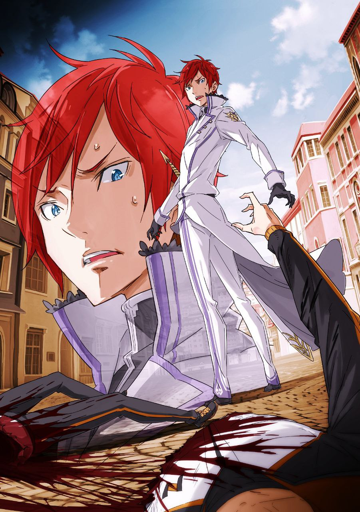

※ ※ ※ ※ ※ ※ ※ ※ ※ ※ ※ ※ ※

Можно ли это назвать воздушным боем?

Резко атаковав Сириус, что одним прыжком взобралась на высоту, Райнхард, словно преследуя подброшенную ударом ноги противницу, снова зацепился носками за белый край Башни Курантов и, лишь слегка согнув и разогнув колени, взмыл ввысь, точно пуля.

— «Фу-фу-фу! Ах, какая подавляющая сила!»

Увидев устремившегося к ней алого героя, Сириус взмахнула руками, её голос был полон ликования. Железная цепь, в несколько слоёв обмотанная вокруг её рук, с воющим звуком рассекла воздух.

Цепь, которую можно было использовать и как ударное оружие в смотанном виде, и как хлыст в размотанном, своим видом и звуковой жестокостью куда больше, чем удобством, ясно показывала отклонение от нормы того, кто выбрал её своим оружием.

Железная змея, познавшая вкус крови уже не одного и не двух человек, и в этот раз, как обычно, пронзила воздух, ликующе стремясь растерзать добычу своими стальными челюстями.

Однако эта тусклая змея, чья скорость приближалась к звуковой, и не подозревала.

— Что в мире существуют люди, выходящие за рамки обычного в ином смысле, чем такие, как Сириус.

— «Цепи, значит. Неприятно».

Перед ударом цепи, оставляющим звук позади, Святой Меча пробормотал это, нахмурив брови.

Он пробормотал это посреди скоростного боя, с такой обыденной атмосферой, словно это было незначительное ворчание в повседневной сцене.

— «Фу-фу-фу!»

Сириус выдохнула смешок, словно вздохнув горячим воздухом.

Вероятно, она не могла поступить иначе. Была ли эта улыбка вымученной или искренне весёлой, неизвестно, но и Субару, смотревший снизу вверх, и все остальные собравшиеся на площади поняли.

Поняли, что в такой ситуации остаётся только смеяться, будь ты хоть Сириус, хоть кто другой.

— «…»

Райнхард прыжком снизу настигал Сириус, летящую ввысь.

Сириус, целясь точно в Райнхарда, обрушила на него цепи с обеих рук. В ответ на стремительно приближающийся удар Райнхард не потянулся к рукояти меча на поясе.

Если то, что Субару слышал раньше, было правдой, он не то чтобы не обнажал меч — он не мог его обнажить. Святой Меч Райнхарда, по-видимому, устроен так, что его нельзя вынуть из ножен, если противник не достоин.

Значит, ему придётся сражаться с этой ужасной безумицей голыми руками. Даже такому, как Райнхард, не избежать тяжёлой битвы — возможно, Субару хотелось в это верить, потому что он хотел считать Райнхарда кем-то, кого всё ещё можно воспринимать в рамках человеческих возможностей.

Если так, то этому доверию суждено было разбиться вдребезги.

Второй удар цепи, нацеленный на Райнхарда, был отбит с пронзительным звуком.

Возникшая ударная волна и сноп искр так яростно заплясали в воздухе, что Субару и остальным внизу показалось, будто сверкнула молния.

Именно эта молниеносная техника, позволившая совершить такое, была доказательством того, что Райнхард — существо за гранью человеческого понимания.

Первый удар цепи, летевший в Райнхарда, он отразил, подставив под него свою длинную правую ногу.

Само по себе отражение атаки хоть и удивляло, но ещё не вызывало смеха. Потрясение пришло мгновением позже, когда Райнхард, поймав конец цепи подошвой ботинка, вращательным движением лодыжки обмотал цепь вокруг ноги, подчинив её своей воле.

Ничего особенного. Райнхард встретил летящую цепь правой ногой, обмотал её вокруг этой ноги, создав импровизированное оружие, и этой же цепью отбил второй удар.

Вся эта атака и защита произошли за доли секунды.

Разумеется, не все простые смертные вроде Субару смогли уследить за этим глазами. Лишь несколько мастеров боевых искусств поняли эту невероятную технику сразу, а большинство обывателей осознало произошедшее только во время последующего обмена ударами.

Как только пришло понимание, возникло желание рассмеяться. Выдохнуть, расслабить плечи. Никогда ещё Субару так не радовался, что Райнхард — союзник. Будь он врагом, сейчас бы у Субару ослабли не только плечи, но и колени с мочевым пузырём.

— «Фу-фу, фу-фу-фу! А-ха-ха, фу-фу-фу-фу!!»

Громко смеясь, Сириус завертела правой рукой, словно торнадо.

Поскольку цепь с левой руки была захвачена Райнхардом, безумица могла атаковать только правой. Воющая тусклая змея беспорядочно рассекала воздух, но каждый её удар с громким звоном и искрами сбивался цепью на правой ноге Райнхарда.

Каждый раз в синем небе рождался небольшой фейерверк, и на залитой полуденным солнцем площади разворачивалось зрелище: звуки, похожие на игру музыкальных инструментов, и пляшущие красно-жёлтые искры.

Удар, ещё удар, но с каждым мгновением расстояние между Райнхардом и Сириус сокращалось, и вот их бой перешёл в ближнюю дистанцию…

— «Не может быть, чтобы настолько! Вы слишком невероятны!»

— «Твои навыки тоже весьма отточены. Тем более прискорбно, что они используются во зло».

В момент сближения оба противника, обменявшись словами, нанесли удар.

Райнхард отдёрнул правую ногу и вместо неё выбросил вперёд левую руку ребром ладони, как нож. Сириус, пытаясь отразить атаку, с особой силой взмахнула рукой вниз, и извивающаяся цепь оскалила клыки.

Зрелище того, как прочный стальной предмет рассекается простым ударом руки, было почти трогательным.

Субару когда-то видел трюк для вечеринок, где палочки для еды разрезали их же бумажной обёрткой. Райнхард, наверное, смог бы разрезать бумагой стальной меч.

Удар его руки был настолько по-самурайски красив, что в это легко верилось.

Обрубок цепи, рассечённой надвое, по инерции отлетел прочь. Он врезался в белую стену Башни Курантов, пробил её и влетел внутрь здания. Увидев, как на площадь посыпались дым и обломки, Субару наконец пришёл в себя.

Он засмотрелся.

На битву Райнхарда и Сириус… нет, на то, как сражался Райнхард. Неважно, было ли это восхищение или благоговейный страх.

— «Эту битву можно оставить на Райнхарда. Тогда я…!»

Нельзя просто стоять здесь и ждать развязки.

Словно отряхиваясь от собственного неприглядного вида — с разинутым ртом, — Субару проскользнул сквозь толпу и вбежал в Башню Курантов. Сейчас, когда Сириус была полностью занята Райнхардом, Люсбел, подготовленный как часть её «представления», должен был оставаться в башне без присмотра.

Нужно забрать его и устранить повод для беспокойства.

Чтобы Сириус ни в коем случае не смогла использовать Люсбела как заложника и поколебать Райнхарда.

В полумраке Башни Курантов, наполненной сырым воздухом, Субару спешно взбегал по винтовой лестнице.

Видно было лучше, чем в прошлый раз, всего пятнадцатью минутами ранее, благодаря дыре в стене, проделанной обрубком цепи, только что вырвавшейся из правой руки Сириус.

Благополучно добравшись до верха винтовой лестницы, Субару обнаружил на верхнем этаже связанного Люсбела. Мальчик лежал ничком, под ним растекалась лужа мочи, а его всхлипывания разрывали сердце.

— «Люсбел! Всё уже хорошо, не бойся!»

Подбежав, Субару приподнял Люсбела, которому засунули в рот кляп из цепи.

Его не волновало тёплое и влажное ощущение. Мальчик, рыдающий в три ручья, увидел лицо Субару и в ужасе отчаянно отвернулся.

— «Мм-м!»

— «Не бойся. Я твой союзник. Я враг той чудовищной бабы, а она сейчас снаружи дерётся с героем, ей не до нас. Поэтому я вытащу тебя отсюда, пока есть время».

— «~~~!»

Субару изо всех сил старался встретиться с ним взглядом, искренне убеждая его. Постепенно тело Люсбела перестало дёргаться, напряжение ушло, и его полные слёз глаза посмотрели на Субару с проблеском разума.

Когда Субару кивнул в ответ на его взгляд, мальчик снова всхлипнул, но уже по другой причине.

— «Подожди. Сейчас сниму».

Погладив всхлипывающего мальчика по голове, Субару начал осторожно снимать цепи, стараясь не поранить его.

Цепи плотно обвивали его от плеч до лодыжек, а ещё одна была обмотана вокруг лица, как кляп. Субару аккуратно снял их, следя, чтобы цепи не повредили нежную кожу мальчика.

— «Так, готово. Сам встать сможешь? Если нет, я понесу на спине».

— «В-всё в порядке… С-спасибо вам большое…»

Люсбел мужественно встал на дрожащие ноги и поблагодарил Субару. Хотя слёзы всё ещё пачкали его лицо, Субару подумал, что он сильный мальчик, и снова погладил его по голове.

Затем он бросил взгляд наружу, откуда по-прежнему доносились звуки ожесточённой битвы,

— «Возможно, оставаться здесь небезопасно. На всякий случай, лучше выйти из башни. Сможешь идти? Где-нибудь болит?»

— «Правая рука, только что, немного…»

Поморщившись, Люсбел честно показал рану Субару.

На протянутой правой руке мальчика был синяк, словно от хватки змеи, и острая рваная рана. Увидев ужасный шрам, из которого сочилась кровь, Субару страдальчески скривился.

— «Вот же тварь, мало того, что связала такого малыша, так ещё и ранила».

— «Н-нет, это не она. Эта рана, она вдруг… когда я был связан, вдруг заболела».

— «Вдруг?»

Услышав слова Люсбела о том, что это случилось, пока он был связан, Субару склонил голову набок.

Он точно не ранил мальчика, пока развязывал его. Он действовал осторожно, и уж такую ужасную рану он бы заметил.

— Какое-то очень дурное предчувствие зашевелилось у него в груди.

— «…Идём. В любом случае, здесь оставаться нельзя».

Схватив Люсбела за здоровую левую руку, Субару потащил мальчика за собой и побежал. Они одним махом спустились по винтовой лестнице на нижний этаж, и вдвоём выбежали из башни.

И когда Субару вернулся на площадь…

— «— УБЕЙ! УБЕЙ! УБЕЙ! УБЕЙ!»

…гремел кровожадный клич толпы, требующей казни загнанной в угол безумицы.

— «— УБЕЙ! УБЕЙ! УБЕЙ! УБЕЙ!»

С налитыми кровью глазами, оскалив зубы, топая ногами по брусчатке, люди в один голос требовали бойни.

Неиссякаемая ненависть к злодеяниям. Отвращение к безумице, вызывающей у других дискомфорт. Враждебность, желание изгнать того, кто вызывает физиологическое неприятие. Эти негативные эмоции порождали жажду убийства.

Знаете ли вы, как люди называют всё это вместе взятое?

— Люди называют это «Гневом».

— «— УБЕЙ! УБЕЙ! УБЕЙ! УБЕЙ!»

Незнакомые друг с другом люди, обнявшись за плечи, устремились к единой цели.

— «— УБЕЙ! УБЕЙ! УБЕЙ! УБЕЙ!»

Сердца, объединяющиеся перед лицом трудностей; человеческая мораль, подвергаемая испытанию в необычных обстоятельствах.

— «— УБЕЙ! УБЕЙ! УБЕЙ! УБЕЙ!»

Если люди выбирают объединение в экстремальной ситуации, то это…

— «— УБЕЙ! УБЕЙ! УБЕЙ! УБЕЙ!»

— «Возможность стать единым целым… Разве это не ‘Любовь’? Если так, то не кажется ли вам, что это зрелище, несомненно, сотворено ‘Любовью’?»

Перед картиной, которую иначе как адской и не назовёшь, прошептала Сириус голосом, полным экстаза.

Прислонившись спиной к Башне Курантов, на брусчатке, безумица была загнана в угол героем. Окружающая толпа жаждала её смерти, а Святой Меча, их союзник, обладал достаточной силой, чтобы прикончить её.

Загнанная в угол Сириус, похоже, лишилась и цепи на левой руке. В условиях, когда оба были безоружны, у безумицы не было способа отразить удар руки-ножа Райнхарда.

Отчаянное положение — но несмотря на это, Сириус продолжала смеяться, ничуть не изменившись в лице.

— «Есть последние слова?»

— «Спасибо. Тогда лишь одно предостережение. Другие Архиепископы Греха не такие смирные, как я, так что если попытаетесь выслушать их предсмертные слова, наверняка попадёте в ужасную переделку».

— «— Я приму это к сведению».

В ответ на милосердие Райнхарда Сириус выплюнула откровенно провокационные слова. Райнхард вежливо кивнул и, приготовив руку-нож для казни, шагнул вперёд.

— «— УБЕЙ! УБЕЙ! УБЕЙ! УБЕЙ!»

Накал толпы нарастал всё сильнее, судьба Сириус была уже решена.

Но почему?

У входа в Башню Курантов Субару чувствовал леденящий душу озноб, словно что-то скреблось у него в груди.

Что было его причиной, что он означал? Он отчаянно пытался выразить это словами, но рот не слушался. Если бы он заговорил, то выкрикнул бы слова, которых не хотел.

Наверняка он тоже закричал бы: «УБЕЙ!».

— «Узнавать друг друга. Уступать друг другу. Признавать друг друга. Прощать друг друга. Становиться единым целым — вот истинная, правильная форма ‘Любви’».

Не обращая внимания на охватившего Субару беспокойство, Сириус навязчиво излагала свою теорию.

На первый взгляд, это звучало правильно, но стоило учесть сущность самой Сириус, как это утверждение мгновенно приобретало зловещий оттенок.

— «…»

Райнхард, видимо, решил так же, как Субару.

Он шагнул вперёд, чтобы больше не позволить Сириус говорить. Но перед ним Сириус усмехнулась и вскинула руку к небу.

В тот же миг из рукава её плаща со щелчком выстрелила цепь — запущенная скрытым в рукаве механизмом, она обвилась вокруг шпиля башни, и Сириус резко взмыла вверх.

Побег — увидев это движение, Райнхард без всякой сдержанности ударил ногой по земле.

Поднялся взрывной порыв ветра, и алое пламя устремилось к Сириус, взлетающей на цепи.

Занесённая рука-нож несла смертельный удар, превосходящий любой обычный клинок.

В тот миг, когда он достигнет цели, жизнь Сириус оборвётся.

— «— УБЕЙ! УБЕЙ! УБЕЙ! УБЕЙ!»

Крик толпы — он будет исполнен.

Леденящий ужас с невероятной силой пробежал по спине Субару. Поддавшись импульсу,

— «РАЙНХАРД!!»

Субару выкрикнул имя героя, ведомый своим беспокойством.

— «— УБЕЙ!!»

Рука-нож сверкнула.

Оставив белый след, она наискось разрубила тело Сириус от левого плеча до правого бока.

Блестящий удар был настолько чистым, что разрубленное тело даже несколько секунд не осознавало произошедшего. Спустя мгновения, когда понимание наконец настигло, из раны хлынула алая кровь, и тело Сириус, разделённое по диагонали, начало разваливаться.

— «…Ах, какой добрый мир».

Вываливая внутренности, тело Сириус разделилось на две части.

Верхняя часть, подтягиваемая цепью, взмыла в небо, разбрызгивая кровь и кишки, а нижняя, оставшись на земле, упала на площадь, фонтаном извергая алую кровь.

Кошмарное зрелище, разбросанное между небом и землёй.

Катастрофа, от которой любой захотел бы отвернуться. Но никто не отвернулся.

Было не до того.

— «…Не может быть».

Приземлившись и обернувшись, Райнхард ошеломлённо пробормотал.

Субару увидел, как его голубые глаза затуманились от печали, а на безупречный профиль легла тень отчаяния.

— Это было последнее, что увидел Субару.

— «…»

И Субару, и толпа — все были разбросаны по площади, превратившейся в лужу крови.

С зияющей раной, идущей наискось от левого плеча до правого бока.

— «…»

Истекая кровью и внутренностями, не понимая, что произошло, сознание Субару утягивала смерть. Но прямо перед этим ему показалось, что он почувствовал.

Как левая рука мальчика, которую он всё ещё держал, левая рука мальчика, разрубленная надвое так же, как и у Субару, слабо сжала его правую руку, словно моля о спасении.

Ему показалось, что он это почувствовал.

*

— «Может быть, господину Нацуки стоит подготовить какие-нибудь закуски для беседы после песни? Уверена, если вы приготовите сладости, это поднимет всем настроение, и мы сразу станем ближе друг к другу, не думаете? А? Не думаете?»

— «—!»

— «Ай-яй! Ай-яй-яй! Больно! Больно же, Субару!!»

Сразу после того, как он моргнул, услышанный голос заставил Субару подпрыгнуть от удивления.

В то же мгновение унаследовалось движение, которое он пытался сделать прямо перед переключением сознания — сильно сжать руку в ответ. Его бесполезная сила хвата, способная раздавить рингу, стиснула маленькую ручку Беатрис.

От внезапного зверства Субару Беатрис со слезами на глазах пнула его по голени. Боль вернула Субару в чувство, он отпустил руку Беатрис и попятился.

— «Ч-ч-ч-что с вами? Вы вдруг попытались сломать руку Беатрис… Бедная её милая ручка. Я-я, я могу её облизать и исцелить, хаа, хаа».

— «Достаточно, я полагаю! От тебя вдруг повеяло чем-то неприятным, так что не подходи!»

Лилиана схватила руку Беатрис, покраснев и тяжело дыша. Беатрис вырвала руку и с испуганным лицом спряталась за Субару. Даже после того, как её руку чуть не раздавили, доброта Беатрис, не теряющей доверия к своему партнёру, тронула Субару до глубины души.

Но сейчас было не до этого.

— «Субару, ты в порядке? Ты сейчас внезапно побледнел как полотно».

— «А, Эмилия-тан…»

Подойдя совсем близко, Эмилия с беспокойством коснулась рукой щеки Субару. Он вздохнул, увидев своё отражение в её фиолетовых глазах, обрамлённых длинными ресницами.

Похоже, он вернулся.

Он похлопал себя по плечу и боку — тому месту, где его разрубили надвое. У него была уверенность в том, что он уже умирал ужасными способами — ему вспарывали живот, ему раздавливали голову, — но полноценное разрубание было для него в новинку. Удивление и чувство потери преобладали над болью; ощущение, будто тело и душа разом рухнули перед фактом «Смерти». Даже Субару, сомелье по способам убийства, был удовлетворён этим способом умереть.

— «Хотя кому я вру, смириться с этим невозможно…»

Когда понимание догнало унаследованные воспоминания, Субару накрыло запоздалое осознание «Смерти».

Сам факт разрубания не передал боли, но чувство потери и шок нахлынули на него. И когда он в полной мере осознал случившееся, осталось лишь то, что лежало за пределами этого понимания.

А именно, причина этой смерти…

— «Это же читерство…»

Излишне говорить, что он понял.

То, как разрубили Субару в этот раз, было точь-в-точь таким же, как смерть Сириус мгновением ранее. Проще говоря, Субару умер точно так же, как умерла Сириус. Оглядываясь на первый раз, тридцать минут назад, Субару умер сразу после того, как стал свидетелем смерти Люсбела посреди всеобщего ликования, но причина смерти, непонятная тогда, прояснилась сейчас.

— Каким-то образом Сириус может наложить ту же «Смерть» на тех, кто стал свидетелем её «Смерти».

Это было не просто промывание мозгов, вроде изменения или разделения эмоций. Следовало считать, что она заставляла разделять даже физические изменения. Не промывание мозгов, а, скажем, промывание жизни или промывание души.

То есть, убить её означало навредить всем, кто был там.

— «И что мне делать?..»

Цель остановить бесчинства Сириус была достигнута вызовом Райнхарда.

Однако ценой стали жизни всех присутствующих. В таком случае результат ничем не отличался от того, что произошло бы, если бы Сириус действовала сама.

Вызов Райнхарда был не чем иным, как неправильным ответом, который на первый взгляд казался очевидно верным. Так что же делать?

— «Вызвать Райнхарда и попросить его захватить её живьём?..»

Возможно ли это? Если говорить о возможности, то, вероятно, да.

Раз Райнхард способен её убить, он должен быть способен и просто лишить её сознания. Проблема в том, что нет уверенности, что даже при захвате её живьём это ментальное доминирование прекратится.

Субару умер безумной смертью, став свидетелем её смерти. Если эта необъяснимая заразная мания продолжится даже после её захвата, то её нельзя будет взять живьём.

Убьёшь её — умрёшь сам вместе со всеми.

Оставишь в живых — нельзя отрицать возможность распространения неодолимого безумия.

Она как бомба, угрожающая другим самим своим существованием. Как и ожидалось от Архиепископа Греха.

— «Можно ли… что-то сделать?..»

Не видя никакого выхода, мысли Субару зашли в тупик.

Если позвать Райнхарда, он наверняка сможет одолеть и захватить Сириус. Но стоит ли довольствоваться этим? Закрыть глаза на возможность распространения безумия.

— «…»

Пока Субару размышлял, время шло.

Эмилия и Лилиана с тревогой смотрели на замолчавшего Субару. Он хотел избежать и беспокойства с их стороны, и того, чтобы они узнали о грядущих событиях.

Субару поспешно надел маску,

— «А, ничего. Просто это… да, утренний дайсукияки вдруг подкатил к горлу. Немного подташнивало».

— «А-а, понимаю, понимаю. Со мной тоже часто бывает, вместо отрыжки выходит рвотный позыв, или вместо пука…»

— «Дальше не надо. Ты всё-таки девушка, так что дальше ни слова, ни в коем случае».

Заставив замолчать Лилиану, которая весело переходила на пошлые темы, Субару улыбнулся Эмилии. В ответ на его улыбку Эмилия слегка опустила взгляд, но…

— «Раз Субару так говорит, я тебе поверю. …Но это только для тебя».

— «Ага, спасибо. …Тогда я, как предложила Лилиана, пойду куплю чего-нибудь сладкого. А Эмилия-тан наслаждайся пока песней».

Воспользовавшись добротой Эмилии, Субару легко поднял руку и объявил об этом. Затем он взял за руку Беатрис, которая стояла рядом и смотрела на него снизу вверх,

— «Беако. Ты тоже пойдёшь со мной за покупками. Пойдём, будем мило флиртовать по дороге».

— «Что это вдруг?.. Н-нет. Поняла, я полагаю».

Беатрис, которая мгновенно покраснела и уже собиралась повести себя как обычно колко, увидела выражение лица Субару и смягчилась. Вернее, она заметила мольбу в его взгляде и уступила.

Показав лишь Беатрис своё настоящее, уязвимое лицо, Субару потянул её за руку и в четвёртый раз выбежал из парка.

На этот раз не оставляя Беатрис, взяв с собой надёжную напарницу.

И всё же, по-прежнему не имея ни малейшего понятия, как найти выход из ситуации.

— «— Хм».

— За спинами Субару и Беатрис многозначительным взглядом наблюдала женщина в красном.

※ ※ ※ ※ ※ ※ ※ ※ ※ ※ ※ ※ ※
