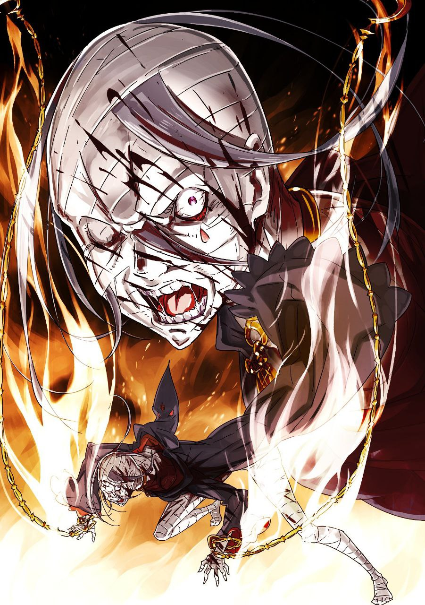

※ ※ ※ ※ ※ ※ ※ ※ ※ ※ ※ ※ ※

— «Так что? Не пора ли тебе наконец объяснить, что случилось?»

Как только они, всё ещё держась за руки, вышли из парка и потеряли Эмилию из виду, Беатрис замедлила шаг и произнесла эти слова.

Беатрис хотела остановиться и поговорить, но Субару потянул её за руку, не разжимая пальцев.

— «Субару?»

— «Прости. Я бы и сам хотел выбрать безлюдное место и всё спокойно обсудить, но времени совсем нет. У нас… меньше пятнадцати минут.»

— «…Понятно, я полагаю. Говори на ходу, так и быть.»

Заметив тревогу на лице Субару, Беатрис без возражений подчинилась.

Испытывая облегчение от покладистости своей партнёрши, Субару быстрым шагом двинулся вперёд, осторожно делясь с Беатрис ещё не упорядоченными мыслями.

— «На площади, куда мы идём, появится Культ Ведьмы. Мы должны остановить его злодеяния.»

— «Культ Ведьмы…!» — выдохнула Беатрис.

Субару продолжил, тщательно подбирая слова.

Сложность заключалась в правилах и наказаниях, связанных с передачей информации о «Посмертном возвращении». Можно ли было рассказать Беатрис то же самое, что и Рачинсу? Не факт, что это безопасно — в этом и заключалась коварная суть тёмной длани, сковывающей Субару.

Эта тёмная длань, мешающая раскрыть информацию о «Посмертном возвращении», похоже, судила не только по содержанию слов Субару, но и по тому, кому он их говорил, решая, применять ли наказание.

Иначе как объяснить то, что сердце Эмилии было сжато, когда он раскрыл ей тайну? Другого объяснения не находилось.

Поэтому Субару приходилось быть предельно осторожным с каждым словом, сказанным Беатрис.

Уж лучше бы страдал он сам. Хотя это и страшно. Очень страшно. Но терпимо. Однако если эта тёмная длань коснётся Эмилии или Беатрис, Субару будет раздавлен чувством вины.

Ведь если к Субару она ещё могла проявить снисхождение, то к другим — никогда.

— «Как и прежде, ты не можешь сказать, откуда это узнал, я полагаю?»

— «…Прости. Не могу.»

— «Ничего страшного. Я поверю и без доказательств, я полагаю. То, что это сказал Субару, — вот причина, по которой Бетти верит.»

Беатрис сжала его руку в ответ, чувствуя его беспомощность.

Согретый её теплом, Субару искал нужные слова.

Сириус, «Гнев», разделение чувств, разделение эмоций… Он взвешивал информацию и возможности, которые мог передать, чтобы постепенно разделить с Беатрис осознание опасности.

— «Во-первых, появится Архиепископ Греха Культа Ведьмы, олицетворяющий „Гнев“, и… э-э-э… она извращенка.»

— «Если Субару считает, что это самая важная информация, которую нужно было сообщить во что бы то ни стало, то Бетти думает, что он совсем безнадёжен, я полагаю.»

— «Я просто прощупываю границы дозволенного. Ладно, за „извращенку“ наказания нет. Дальше — её способность… это вроде как разделение эмоций и чувств?»

— «Разделение эмоций и чувств?» — Беатрис склонила голову набок.

Похоже, она не могла представить себе это конкретно. И неудивительно. Сам Субару не до конца понимал эффект этой Власти.

— «Сложно объяснить… но если сама Архиепископ ликует, то все вокруг неё, как бы они ни были злы, тоже начинают ликовать, точно как она.»

— «…Не совсем понимаю, почему это представляет угрозу.»

— «Главное — теряется способность воспринимать опасность как опасность. Что бы опасного с тобой ни делали, чувства угрозы не возникает. Ты принимаешь это с ликованием. Теряется способность правильно оценивать ситуацию, так понятнее?»

Он вспомнил толпу, которая с распростёртыми объятиями приветствовала плачущего мальчика, умолявшего не убивать его.

Испытывать только радость перед лицом любых событий — это ужасно. Наверняка, будь Субару и остальные в том состоянии, когда им отрубали бы головы, они бы до последней секунды перед ударом клинка радостно этого ждали.

— «Разделение эмоций понятно, я полагаю. А какой эффект у разделения чувств?»

— «Именно то, что значит. Если противнику больно, то и тебе больно. Отрубишь Архиепископу голову — и у всех, кто это видит, головы тоже слетят. …Это же полная безнадёга.»

Произнеся это вслух, он вновь осознал, насколько это проблематично.

Отрубить ей голову — значит, лишиться своей. Сложно представить более сильный сдерживающий фактор. «Посмертное возвращение» позволяло заранее продумать стратегию, но если победа над Сириус обернётся полным уничтожением его союзников, то всё бессмысленно.

— «Но и пытаться схватить её живьём рискованно — есть шанс сойти с ума от одного лишь контакта. Что живая, что мёртвая, она — худший враг, доставляющий неприятности в любом случае.»

Во время второй смерти Субару сошёл с ума от ужаса.

Вероятно, потому что разделил страх Лусбела, которого пытался спасти.

Но если так, то Лусбел, должно быть, постоянно испытывал такой ужас. Это также могло означать, что ментальная стойкость Субару слабее, чем у того мальчика.

В этом плане Субару не был уверен, что «я точно сильнее», но трудно было поверить, что Лусбел, с которым он только что нормально разговаривал, сопротивлялся этому всепоглощающему ужасу.

Должно быть, во время второй смерти на Субару обрушилось нечто большее, чем просто разделённый страх.

Что-то помимо простого разделения эмоций и чувств… Пока это неизвестно, разработать надёжный план по нейтрализации Сириус было совершенно невозможно.

— «…………»

Субару молча крепче сжал руку Беатрис.

Он привёл её сюда, но решения всё не было видно. Он просто втянул Беатрис в битву, шансов на победу в которой не предвиделось.

Что делать? Закрыть глаза на риск безумия и попросить Райнхарда схватить Сириус живьём? Но сможет ли он, вызвав его так же, как в прошлый раз, дать Райнхарду достаточно объяснений, чтобы тот именно схватил Сириус?

А что, если вызвать Райнхарда ещё до появления Сириус?

Если он внезапно нападёт на Рачинса на площади, не почувствует ли тот угрозу для жизни и не призовёт ли Райнхарда? Прибывший Райнхард ведь не станет рубить Субару сплеча, не выслушав причин? Если объяснить, что вызов был экстренным, то можно выиграть несколько минут до появления Сириус…

— «Идиот я, что ли? Да, идиот. Если Рачинс начнёт призывать Райнхарда, Сириус не может не отреагировать. Это лишь ускорит события, а времени на объяснения Райнхарду всё равно не будет.»

Кричать «Хватай живьём!» прямо перед началом битвы Райнхарда и Сириус?

Сможет ли он? Столкнувшись с Сириус, Субару совершенно не доверял собственному рассудку. Он мог внушать себе отдать приказ о захвате, но не крикнет ли он вместо этого «Убей!»? Прецедент уже был. Оснований отрицать такую возможность не было.

— «Субару. Вообще-то, есть плохие новости, о которых я должна тебе рассказать.»

— «…Серьёзно? Я больше не хочу слышать никаких плохих новостей.»

— «Понимаю, я полагаю. Но я должна сказать… Если ты рассчитываешь на Райнхарда как на боевую силу, то на одном поле боя с ним Бетти станет бесполезной. Просто милой девочкой, я полагаю.»

— «А?»

От внезапного заявления Беатрис Субару опешил и округлил глаза.

Беатрис, потупив взгляд, с трудом продолжила:

— «Это из-за особенностей Райнхарда. Он — вершина аномалий этого мира, я полагаю. Одно его присутствие заставляет окружающую ману слепо ему подчиняться. Это нарушает её нормальное течение и, наоборот, становится для него помехой. Не только он сам не может толком использовать магию, но и все маги и пользователи духов поблизости тоже становятся бесполезны, я полагаю.»

— «Что… за… бред? Такого просто не может…» — Начал было Субару, но тут кое-что вспомнил.

Это было в первый день его призыва в этот мир, во время инцидента с эмблемой, дающей право участвовать в королевских выборах, когда в последней петле Райнхард столкнулся с Эльзой.

Он припомнил, как Эмилия, лечившая Старика Рома, сказала, что магия станет бесполезной, если Райнхард использует всю свою силу.

Тогда он не понял, но теперь… значит, вот что это было?

— «Если Райнхард сможет справиться в одиночку, то неважно, что Бетти будет бесполезна. Но если одного Райнхарда окажется недостаточно…»

— «Значит, вариант, при котором Беако становится бесполезной, вообще не рассматривается?»

Вот так «разрушитель иллюзий».

Одним своим присутствием он сводит на нет все магические функции. В духе Райнхарда, конечно, но сейчас это очень плохие новости.

— Плохо. Плохо. Плохо, плохо, плохо, плохо, плохо, плохо.

Субару не видел ни единого проблеска надежды.

Правильно ли звать Райнхарда или нет? Что делать Беатрис, раз он её привёл? Что делать ему самому?

Может, наплевать на действия Сириус и сосредоточиться на спасении людей на площади? Но тогда Сириус просто устроит то же самое в другом месте. Бессмысленно.

Мысли Субару неслись вскачь, тревога выжигала часть его мозга.

С налитыми кровью глазами он отчаянно искал ответ, но тот по-прежнему не показывался.

А время безжалостно утекало, оставляя Субару позади…

— «…Мы пришли на площадь, я полагаю, Субару.»

— «…!»

Субару резко поднял голову и увидел площадь.

Они прибыли на место грядущей трагедии.

Так ничего и не придумав. Просто потратив оставшееся время.

Белая Башня Курантов. Толпа, заполнившая площадь.

По его расчётам, до трагедии оставалось меньше десяти минут.

Что делать? Как поступить правильно? Что предпринять?

— «Субару, возможно… у меня появилась одна идея.»

У Субару дрожали губы, лицо застыло. Его разум был пуст, и он опешил от сладости её голоса.

— «Идея? Решение?!»

— «Это лишь предположение, я полагаю. Но если способность Архиепископа, о которой говорил Субару, заключается в разделении с другими… то можно предположить, что это похоже на эффект высшей магии „Нэкт“.»

— «Нэкт…!»

Субару затаил дыхание.

Нэкт — магия, которую он сам когда-то испытал. Она разделяет волю и чувства между заклинателем и другими, что действительно похоже на эффект Власти Сириус.

Почему он сам об этом не подумал? Субару усомнился в собственных мозгах.

— «Если предположить, что это то же самое, что Нэкт, как с этим бороться?»

— «…Вообще-то, изначально Нэкт — это не та магия, с которой нужно бороться, я полагаю. Цель эффекта Нэкт — объединение воли союзников, общение без слов. Использовать Нэкт против врага, в атакующих целях, — сама эта идея в корне неверна, я полагаю.» — недовольно ответила Беатрис на нетерпение Субару.

Действительно, когда Субару использовал Нэкт, это было для того, чтобы, пусть и неохотно, разделить зрение с Юлиусом для противостояния «Незримой Длани» Петельгейзе. Субару мог видеть руки, а Юлиус — сражаться.

Истинное предназначение Нэкт — координация союзников.

А вовсе не связывание врагов и использование их тел в качестве заложников.

— «Изначально для связи через Нэкт есть условия. Она не должна работать без достаточного доверия между сторонами, чтобы между ними установился путь маны, я полагаю. Власть Архиепископа явно игнорирует эту область.»

— «На то она и Власть, чтобы насильно этого добиваться. Но важнее другое…»

— «Контрмера, я полагаю? Проще говоря, пришло время „Шамака“.»

— «Старый добрый Шамак! Как всегда универсален!» — невольно воскликнул Субару.

Шамак был для Субару очень знакомой магией. В трудные, болезненные, опасные, тяжёлые времена Шамак всегда был рядом с Субару.

Можно без преувеличения сказать, что до контракта с Беатрис его опорой были Рем, Патраш и Шамак.

Субару думал, что эта связь оборвалась после разрушения его собственных врат, но даже через Беатрис, посредством контракта, Шамак мог помочь ему.

— «Точно, Шамак… С Шамаком наверняка всё как-нибудь…!»

— «Я поняла, что Субару питает к Шамаку какое-то невероятное доверие, я полагаю. На самом деле, Шамак — это самая основа магии Тьмы, почти бесполезное заклинание.»

— «Даже тебе, Беако, я не позволю плохо говорить о Шамаке!..»

— «Что же заставляет Субару так говорить на полном серьёзе?» — Беатрис, не понимая, вздохнула, глядя на пыл Субару. Затем она настороженно огляделась, всё ещё держа один палец поднятым.

— «Шамак вызывает потерю сознания — он принудительно разрывает связь с окружением, я полагаю. Если бы заклинателем был Субару, эффект был бы сомнителен, но для Бетти это не проблема. Кем бы ни был противник, я смогу идеально отключить его сознание, я полагаю.»

— «То есть…?»

— «Если я погружу сознание толпы, которая вот-вот попадёт под действие заклинания, во тьму с помощью Шамака, то они смогут избежать Власти Архиепископа. Это соответствует опасениям Субару — не вовлекать окружающих людей, я полагаю.»

Уловив все опасения Субару, Беатрис уверенно выпятила грудь.

От её обнадёживающего ответа Субару сжал кулак. Ему показалось, что он увидел слабый проблеск надежды.

— «Отлично, хорошо. Если способность до них не доберётся, то дело в шляпе. Осталось… что осталось?»

— «Боевая сила, способная разделаться с этим Архиепископом без Райнхарда.»

— «…………»

Если Райнхард будет здесь, тактика Беатрис с Шамаком неприменима. Следовательно, Райнхарда нужно исключить из расчётов.

Но в таком случае, нужно победить Сириус без него.

— «Сразу скажу: Бетти будет полностью занята Шамаком, и мне нужно будет наложить Шамак на того, кто будет сражаться с ней, в момент её поражения. Я не смогу сражаться, я полагаю.»

— «Логично… Чёрт, в итоге всё возвращается на круги своя.»

Без поддержки Беатрис, даже если закрыть глаза на атаки безумием, у Субару, вероятно, нет шансов против Сириус. Даже если он использует свой скрытый козырь, сможет ли он сражаться на равных? То, что его отработанный кнут оказался бесполезен, тоже подкосило его уверенность.

— «Кто ещё тогда был на площади и выглядел способным сражаться…»

Он вспомнил первую петлю на площади.

Тех, кто сразу среагировал на появившуюся на башне Сириус. Кажется, мужчина-зверочеловек, женщина с повязкой на глазу, мужчина с суровым лицом и Рачинс.

Даже если не считать Рачинса боевой единицей, что насчёт остальных троих? Плюс Субару — итого четверо. Даст ли это хоть какой-то шанс на победу?

— «Чушь собачья. Насколько можно доверять людям с неизвестными способностями? Я ведь с ними даже не разговаривал…»

— «— В таком случае, не моя ли очередь? Ты знаешь мои способности, и со мной можно поговорить.»

— «—!?»

От внезапно раздавшегося за спиной голоса, слишком знакомого, Субару и Беатрис удивлённо обернулись. Позади них, уперев руки в бока, стояла…

— «Э-Эмилия-тан? Почему ты здесь?..»

— «Ты вёл себя странно, поэтому я пошла за тобой, и оказалось, что ты опять взвалил на себя что-то ужасное. Пытаться вот так держать меня в стороне — это плохая черта Субару, я считаю.»

От её слов, будто она ругала нашалившего ребёнка, Субару только и мог, что беззвучно открывать и закрывать рот.

Он был ошеломлён появлением Эмилии, которую меньше всего хотел здесь видеть. Вместо Субару, потерявшего дар речи, к Эмилии обратилась Беатрис:

— «Я ведь сказала тебе ждать в парке. Почему ты пошла за нами, я полагаю?»

— «…Честно говоря, я и собиралась ждать. Было видно, что Субару не хотел, чтобы я шла за ним. Но Присцилла…»

— «Та рыжая девица?»

— «Сказала, что я могу пожалеть, если не пойду за Субару прямо сейчас. Я думала, если ничего не случилось, тихонько вернусь, но вы оба так серьёзно разговаривали всё время. Я не могла просто развернуться и уйти.»

В голове Субару всплыло лицо виновницы, подтолкнувшей Эмилию и загнавшей её сюда.

Он стиснул зубы, мысленно ударив по смеющемуся лицу Присциллы. Эта девица вечно всё взбаламучивает.

Её злой умысел и убийственно неподходящий момент идеально создали ситуацию, которой Субару так хотел избежать.

— «Эмилия-тан, я ценю твои чувства. Правда ценю, но, э-э, здесь сейчас…»

— «Появится Культ Ведьмы, верно? Я всё прекрасно слышала… Даже если Субару скажет мне вернуться, я не вернусь. Для меня это тоже не чужое дело.»

— «Эмилия!»

Он не без причины пытался удержать Эмилию подальше от опасности.

Она и Культ Ведьмы не должны встречаться.

Он не знал почему. Не было твёрдой логики. Но есть вещи, не требующие логики и причин.

Эмилия и Культ Ведьмы ни в коем случае не должны встречаться. Для Эмилии люди из Культа Ведьмы были сродни смертельному яду, которого нужно избегать.

Это было верно для многих людей в этом мире, но для Эмилии — особенно. Поэтому…

— «Мы как-нибудь справимся. Эмилии не нужно вмешиваться. Пожалуйста, не вмешивайся.»

— «И снова закрывать глаза на то, как Субару и остальные получают раны, пытаясь защитить меня? Абсолютно нет. Когда Субару сражается, я тоже сражаюсь. Когда Субару пытается кого-то защитить, я тоже хочу помочь. Так же, как Субару защищает меня…»

— «…………»

— «Я тоже хочу защитить Субару. Ведь Субару… ты сейчас вот-вот расплачешься.»

Сердце, которое не должно было дрогнуть, готово было сломаться от мольбы Эмилии.

Чтобы уберечь её от опасности, Субару должен был собрать всё своё мужество. Встретить все трудности со стальным сердцем.

Но сейчас Субару было страшно. Он был в ужасе. Он боялся битвы.

Трижды.

Субару уже трижды проиграл битву с Сириус и погиб.

Трижды всего за один час — такого короткого промежутка между смертями не было даже в послужном списке смертей Нацуки Субару.

«Смерть» всегда ужасна. К ней невозможно привыкнуть, и нельзя привыкать.

Лишиться жизни — значит, лишиться пути. Твой образ жизни отрицается, твоё существование растаптывается, твоя душа оскверняется. Вот что значит быть убитым.

Сколько бы он ни пытался скрыть это за легкомыслием, его терзало нечто неоспоримое.

Сколько бы он ни пытался сохранить твёрдость духа ради защиты, слабое чувство «не хочу умирать» вылезало наружу.

Нацуки Субару так и не смог преодолеть эту слабость.

— «…Субару. Лучше уже сдаться.»

— «Беатрис…»

— «Эмилия упряма, я полагаю. Раз уж она узнала, то, наверное, уже ничего не поделаешь. К тому же, Бетти понимает чувства Эмилии, я полагаю. Желание защитить Субару у Бетти такое же… И отрицать это Бетти не может.»

Беатрис — опора плана и орган принятия решений для Субару. Если она подняла белый флаг, Субару трудно было сопротивляться.

Эмилия смотрела искренне, Беатрис — с нежностью, обе смотрели на Субару.

Под их взглядами сердце Субару наконец сломалось.

— «…Люди из Культа Ведьмы наверняка нацелятся на тебя. Если что-то случится, пожалуйста, думай в первую очередь о собственной безопасности.»

— «М-м, поняла. Даже если меня схватят, Субару ведь придёт на помощь? Веря в это, я постараюсь.»

— «Не говори таких недобрых вещей… Так, до какого момента ты слышала?»

Эмилия с облегчением улыбнулась, видя, что Субару согласился.

Субару почувствовал себя опустошённым от её поведения, словно она забыла о грозном враге. Эмилия приложила палец к губам.

— «Думаю, я слышала почти всё. Придёт плохой человек из Культа Ведьмы, он использует магию вроде Нэкт. Беатрис нейтрализует её эффект Шамаком, а мы тем временем должны постараться и победить этого плохого человека.»

— «Объяснение такое простое, что даже младшеклассник поймёт, но да, всё верно. Эмилия-тан, я могу на тебя положиться?»

— «Положись на меня. Я ведь стала по-настоящему сильнее.»

Эмилия сделала боевую стойку перед грудью.

Милый жест, лишённый напряжения, но она всё поняла быстро.

Беспокойство из-за того, что приходится полагаться на Эмилию, чувство собственной неполноценности, сложность с выбором момента для магии Беатрис — факторов провала было бесконечно много. И всё же…

— «Раз Эмилия-тан и Беако здесь, я не могу позволить себе провал!..»

Настоящий мужчина превратит это в мотивацию.

— «К тому же, уже почти время.»

Принятие предложения Беатрис, встреча с Эмилией — на это ушла бо́льшая часть времени. Теперь оставалось решить, как действовать при появлении Сириус.

В идеале — сбить Сириус с башни, пока Лусбел всё ещё находится внутри.

— «Эмилия-тан. Скоро на вершине башни появится явно подозрительная личность. Как только она появится, нанеси упреждающий удар, да помощнее. Лучше всего — сбить её с башни. После этого Беако сделает своё дело, и по её сигналу начнём бой.»

— «М-м, поняла. Не знаю, получится ли у меня хорошо, но я попробую.»

Выражение лица Эмилии стало серьёзным. Субару и Беатрис кивнули друг другу.

И сразу после того, как план был утверждён…

— «— Пришла!»

Из окна Башни Курантов высунулась и показалась странная фигура.

Стройное тело, облачённое в плащ, лицо замотано бинтами. С рук свисали цепи, концы которых скребли по полу, издавая неприятный звук. Фигура смотрела вниз.

Толпа ещё не заметила странную фигуру.

Сириус, стоя на этой большой сцене, задрожала, словно смакуя вид совершенно не подозревающей о близкой угрозе толпы, а затем широко раскинула руки.

Когда они соединятся в хлопке, оглушительный звук привлечёт взгляды толпы, и начнётся та речь.

— «…………»

Затаив дыхание, Субару наблюдал за приближением этого момента.

Руки набирали скорость, готовясь с силой хлопнуть перед грудью Сириус…

— «Ур Хьюма!!»

Прямо перед этим над башней возникла гигантская ледяная глыба и обрушилась на стоявшую на краю Сириус.

Ледяной снаряд толщиной в пять Субару с ужасающим грохотом и силой удара проломил белую стену Башни Курантов. Стена, отнюдь не хрупкая, рухнула, и остриё глыбы вонзилось внутрь башни. У Субару отвисла челюсть.

— «Э-Эмилия-тан?»

— «Субару сказал нанести упреждающий удар, вот я и нанесла… Неудачно?»

— «Нет, отличная работа. Просто я удивился, не ожидал, что ты ударишь до того, как она успеет представиться.»

Субару не указал точный момент, и в этом была часть его вины, но главная проблема, вероятно, была в самой Сириус, которая выглядела настолько подозрительно, что Эмилия мгновенно вынесла ей приговор.

Этот удар, нанесённый без малейшего промедления или желания понаблюдать, вполне мог раздавить неподготовленную Сириус. Если так, то, возможно, они смогли бы пропустить всю эту историю с разделением чувств и одержать победу.

В таком случае Эмилия была бы просто невероятной героиней.

— «Беако, что думаешь?»

— «Думаю, для начала стоит развеять недоразумение с окружающими.» — Беатрис смерила его измученным взглядом и дёрнула подбородком.

Субару посмотрел и увидел, что толпа медленно окружает их с Эмилией, разрушившей башню. Среди них были мужчина-зверочеловек и женщина с повязкой на глазу. Субару охватила грусть от того, что люди, которых он рассматривал как потенциальных союзников, теперь относились к ним с опаской.

— «Не время для сантиментов. Так, что делать? Прежде всего, объяснить, что мы сделали это не со зла?»

— «— Нет. Важнее другое. Субару, тебе лучше отойти.» — Эмилия потянула Субару за плечо.

Вынудив Субару отступить, Эмилия вышла вперёд и резко взмахнула рукой сверху вниз.

В воздухе раздался звон, и в руке Эмилии появился синий ледяной меч. Она направила его остриё на окружающую их толпу.

— «Эмилия-тан? Не нужно так уж вживаться в роль злодейки…»

— «Дело не в этом. Посмотри внимательно, Субару. Их глаза… они не в своём уме.»

— «— А?»

Резкий тон Эмилии заставил Субару вздрогнуть. Он посмотрел на лица людей вокруг и затаил дыхание. Эмилия была права — это были лица безумцев.

Все в окружившей их толпе были красными от шеи и выше, словно помидоры, все вены на лицах вздулись, а налитые кровью глаза сверлили их взглядом.

Не просто вызывающие сомнения в здравомыслии, а несомненно безумные лица.

— «Беако! Шамак?!»

— «…Я просчиталась, я полагаю.»

— «Что?»

— «Это… фундаментально отличается от Нэкт… н-нет, это злые чары! Это вообще не магия, я полагаю! Это проклятие… колдовство!» — Голос Беатрис был полон отвращения и гнева.

Субару нахмурился. Он не понимал разницы в принципах, но Беатрис решила, что план с Шамаком неприменим. Осознав эту неудачу, он понял, что есть ещё одна проблема.

Если вся толпа сошла с ума, это значит…

— «— Воняет. Воняет. Воняет. Воняет. Воняет. Воняет. Воняет. Воняет. Воняет. Воняет воняет воняет воняет воняет воняет воняет воняет воняет воняет воняет воняет воняет воняет воняет воняет воняет воняет воняет воняет воняет воняет воняет воняет воняет воняет воняет воняет воняет воняет воняет воняет воняет воняет воняет воняет воняет воняет воняет воняет».

Это был вязкий, полный ненависти ко всему сущему стон.

— «…………»

С грохотом обрушилась внешняя стена Башни Курантов.

Гигантская ледяная глыба, вонзившаяся в неё, пошла трещинами и в мгновение ока разлетелась на куски. Среди сверкающих на солнце ледяных кристаллов послышались шаги.

Странная фигура.

Она не была невредима — половина бинтов на лице окрасилась в красный. С бессильно повисшей левой руки капала кровь, походка была нетвёрдой, цепи волочились по земле.

Упреждающий удар Эмилии определённо возымел эффект.

Но также он стал спусковым крючком, который не следовало нажимать.

— «Воняет, чувствую… Запах женщины. Грязный и отвратительный запах полудемоницы, что отнимает у меня его . Сколько ни убивай, они всё плодятся без конца, как личинки, вонючая грязь. Это не шутка. Ненавижу. Столько сожгла, и всё равно мало?»

— «…Что ты несёшь?»

— «Чувствую и другой женский запах. Не его , но похожий на его запах. Омерзительный, подлый и низкий, будто запах сгнившей, изменившей цвет, кишащей червями женщины. А-а, а-а-а-а! А-а-а-а-а-а! Как же бесит! Отвратительно! Ненавижу!»

Стоя на уцелевшем краю, фигура пронзительно кричала, раздирая кровоточащую голову. Брызгая слюной, топая ногами, она вела себя совершенно безумно, не так, как знал её Субару. Безумие осталось, но вектор явно изменился.

— «Мою! Любовь к мужу испытываешь, дух?! Тебе! Мало было отнять у меня мужа, шлюха полудемоница?!»

Оскалив зубы, Сириус с яростным воплем прыгнула вниз.

Падая с башни, она соединила руки над головой, и оттуда вырвалось алое пламя. Оставляя огненный след, она приземлилась на площади.

Приземлившись на четвереньки, с всё ещё горящими руками, фигура подняла голову.

Она увидела Эмилию с ледяным мечом и Беатрис, заслонявшую Субару. Переводя взгляд с одной на другую, Сириус завопила, захлёбываясь яростью:

— «Я! Архиепископ Греха Культа Ведьмы! Олицетворяю „Гнев“!!»

Взметнулось пламя, толпа, окутанная волной жара, вскинула руки к небу и закричала.

Вихрь безумия, совершенно не похожий на тот, что знал Субару. Фигура назвала своё имя.

— «— Сириус Романе-Конти!! Сраная полудемоница и сраный дух, я сожгу вас обеих дотла и развею ваш прах на могиле моего мужа!!»

※ ※ ※ ※ ※ ※ ※ ※ ※ ※ ※ ※ ※
