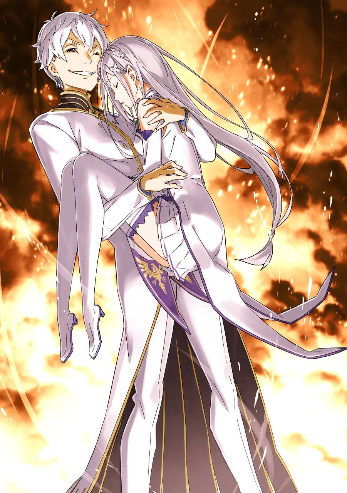

※ ※ ※ ※ ※ ※ ※ ※ ※ ※ ※ ※ ※

Сириус, с багровым пламенем, окутавшим обе руки, издавала яростный рёв, а её лицо исказилось, словно у злого демона.

Даже сквозь бинты было видно, что причина этому — её глаза, охваченные безумной страстью, вышедшей за рамки обычного.

Её обычно ясные, светло-розовые глаза, в которые можно было бы утонуть, теперь пылали жаром, подобным огню, сжигающему её руки, и с чистой ненавистью взирали на Субару и остальных.

Нет, это неверное, ошибочное описание. Ведь…

— «Воняет. Воняет, воняет, воняет, воняет, воняет, воняет, воняет, воняет, шлюхааааа!..»

В поле зрения Сириус, изрыгающей проклятия, Субару не существовало вовсе.

Взглядом, полным убийственной ярости, Сириус целилась лишь в тех двоих, что стояли перед Субару — Эмилию и Беатрис.

— «Что с ней такое? Она совсем не такая, как раньше…»

Субару не мог скрыть своего потрясения от вида разъярённой Сириус.

За короткое время Субару сталкивался с Сириус трижды — если её вообще можно назвать нормальной, — и хотя она никогда не походила на здравомыслящего человека, она не была существом, полностью потерявшим рассудок и отданным во власть страсти.

Она всегда была сумасшедшей, навязывающей свои безумные теории вполне рационально.

Но что же сейчас? Эта Сириус перед ним, очевидно потерявшая самообладание, охваченная яростью… Разве это не идеальное воплощение её роли как «Гнева»?

— «Как трупные мухи, сколько ни жги, вы всё лезете и лезёте… Какая у вас ко мне злоба, а?! Что, у меня даже нет свободы погрузиться в печаль и носить траур?!»

— «…Я не понимаю, о чём ты говоришь.»

— «А?!»

Эмилия без страха ответила Сириус, которая брызгала слюной и выдвигала обвинения, похожие на пустые придирки. Ответ Сириус был столь же резким, но Эмилия не дрогнула.

Она направила кончик ледяного меча в своей руке на толпу, стоящую за спиной Сириус, и сказала:

— «Если ты злишься на меня, я готова выслушать. Мы напали первыми, так что твоя злость естественна. Но эти люди ни при чём. Отпусти их.»

— «Не смей говорить со мной свысока! Хочешь уступок — покажи это делом! Естественно злиться? Тогда извиняйся! Извиняйся, проси прощения, ползай на коленях, реви и умоляй о пощаде! А потом я засуну тебе огонь в задницу и сожгу твои внутренности!»

— «Сжигать мой живот — это проблема. — Поэтому я сделаю так, чтобы нам было легче разговаривать.»

Разъярённая Сириус склонила голову набок, услышав, как голос Эмилии понизился.

Сразу после этого Эмилия слегка наклонилась вперёд и рванулась вперёд своим стройным телом. Её белая рука взмахнула длинным ледяным мечом так легко, словно он ничего не весил.

Острый кончик, сверкнув на свету, нацелился на плечо Сириус.

— «Эмилия-тан?!»

— «…Тц!»

Крик ужаса Субару и цоканье языком Сириус слились воедино.

Перед взметнувшимся мечом Сириус инстинктивно вскинула левую руку, пытаясь отразить ледяной клинок Эмилии бушующим пламенем. Однако…

— «Чёртова полукровка!»

— «Не говори так постоянно. Это заставляет думать о грязи.»

Брызги слюны испарялись от жара пламени, но ледяной меч Эмилии не таял.

Бледно-голубое острие не поддалось огню и ударило прямо в левую руку Сириус, окутанную пламенем — однако там была цепь, которой Сириус накрепко обмоталась.

Раздался пронзительный скрежет, ледяной меч и огненная рука столкнулись, разбрасывая искры маны. После короткого мгновения противостояния ледяной меч Эмилии с треском разлетелся на куски.

— «Так тебе!..»

Увидев лишь рукоять ледяного меча, Сириус с торжествующим лицом обрушила руку на Эмилию. Цепь на её руке, раскалённая пламенем, была ужасным оружием, которое при ударе обжигало рану противника и разрывало её в клочья.

Прекрасное лицо Эмилии вот-вот могло быть изуродовано — но в последний момент…

— «Хоп!»

Раздался неуместный для битвы выкрик, и рука Сириус была отброшена снизу вверх.

Сделал это ледяной меч Эмилии… вернее, то, что им было.

— «Ах, ааа! Ааааааа! Раздражает!»

Сириус взвыла и скрестила пылающие руки над головой.

В центр скрещённых рук обрушился удар Эмилии.

На месте лезвия ледяного меча теперь был ледяной молот, изменивший форму. Сириус заскрежетала зубами от тяжести удара, нанесённого двумя руками, и попятилась, а Эмилия преследовала её.

— «Эй! Тей! Ять! Вот! Уря! Уря-уря!»

— «Дерьмо! Полукровка! Трупная муха! Насекомое! Раздражает, бесит!»

Эмилия демонстрировала неожиданную для неё силу в ближнем бою, используя центробежную силу и изящные движения тела.

Под ударами ледяного молота Сириус, разбрасывая пламя, только защищалась. Видя, что Эмилия полностью доминирует, Субару со стороны решил, что если так пойдёт и дальше, она победит. Решил, но…

— «…Не время стоять столбом! Эмилия, нельзя!»

— «Субару, сейчас нельзя её отвлекать!»

Если Эмилия победит Сириус, «Смерть» тут же разделится со всеми вокруг.

Осознав эту опасность, Субару закричал, но Беатрис осудила его поспешное решение. «Что такое?» — подумал Субару, посмотрев на Беатрис, и заметил опасный взгляд, устремлённый в их сторону.

— «…Мелкие твари.»

— «Плохо дело.»

Там стояла толпа с багровыми лицами, сверлящая Субару безумными глазами.

Глядя на Субару и Беатрис, они грязно ругались, точь-в-точь как Сириус. Можно было считать, что толпа полностью разделила «Гнев» Сириус.

И их гнев вот-вот должен был обрушиться на Субару и остальных.

— «Она может не только делить эмоции, но и промывать мозги, делая их своими марионетками?»

— «Не время для этого, я полагаю! Раз нет способа переломить ситуацию, остаётся только бежать!»

Как только Субару простонал от осознания сложности ситуации, Беатрис запрыгнула ему на спину. Толпа ринулась на Субару, который поддержал её лёгкое тело руками.

— «Эмилия! Потяни время!»

— «Я не могу слишком рисковать!»

Получив решительный ответ Эмилии, Субару ускорился назад, чтобы удрать от толпы. К счастью, шаги потерявших рассудок людей были далеки от нормальных.

Протягивая руки к Субару и бессвязно бормоча гневные слова, они чем-то напоминали зомби. Разница была лишь в том, что у них было сознание, и целью было не съесть Субару, а разорвать его на куски.

— «Если потянуть время, кто-нибудь заметит неладное и…»

— «Даже если они доберутся сюда, нет смысла, пока неясно, как исправить ситуацию, я полагаю. Если сюда доберётся Райнхард, всё может только усложниться.»

— «Ну, пока что можно не беспокоиться, что его вызовут.»

Ведь Рачинс, который должен был вызвать Райнхарда, сейчас с красным лицом гнался за Субару. Он расталкивал окружающих, демонстрируя едва ли не наибольшее рвение.

Возможно, на это влияло его отношение к Субару до того, как он попал под влияние Сириус.

— «Пока я тут размышляю!..»

— «Мелкая тварь!»

Рука протянулась сбоку, едва не схватив Субару, но он резко пригнулся. Проскользнув под рукой противника, он подсёк его и, пнув тело вперёд, опрокинул на землю.

Бездумно несущаяся толпа врезалась в упавшего мужчину и покатилась кубарем. Видя их пустоголовость, словно кегли в боулинге, Субару нахмурился:

— «От ярости у них совсем мозги не работают?»

— «Но этот способ тоже не очень рекомендуется, я полагаю. Судя по атмосфере, они не постесняются случайно затоптать своих же.»

— «Это плохо!»

Жертв быть не должно.

Субару сражался снова и снова именно ради этой главной цели.

Конечно, Субару понимал, что его возможности не безграничны.

Он хотел защитить многое. Но защитить мог лишь ограниченное количество.

Для Нацуки Субару, не являющегося всезнающим и всемогущим, это было естественно.

— «Но я не собираюсь сам устанавливать эти „границы“!»

— «Вот это и есть Субару Бетти!»

Получив мощнейшую поддержку со спины, Субару выхватил свой любимый кнут из-за пояса.

Жизни нужно спасать по мере возможности. Поэтому небольшой урон придётся потерпеть — таково было настроение Субару. Целясь под ноги несущейся толпе, кнут Субару рассёк воздух со свистом.

Звук, похожий на слабый удар грома, раздался, и по каменной плитке под ногами толпы пошли трещины.

Пусть кнут и был не смертельным оружием и не обладал большой силой, но если взмахнуть им изо всех сил без пощады, он мог лишить противника способности сопротивляться.

Было бы идеально, если бы толпа, увидев эту мощь, испугалась, но…

— «Так просто не получится, да!»

Ну что ж, тогда придётся.

Мгновенно отдёрнув кнут, ударивший по ногам толпы, Субару нацелился на человека во главе. Среднего роста, с бледными голубоватыми волосами и острым взглядом. То есть, Рачинс.

Знакомый. Даже Субару стало больно на душе.

— «Больно, но лучше так, чем с незнакомцем! Прости, Тин!»

— «Я не Тин, гха?!»

Кнут обвился вокруг ног Рачинса, машинально закричавшего, и резко дёрнул вверх. Тело Рачинса легко перевернулось в воздухе, сбив с ног окружающих людей, словно костяшки домино.

Делая это, Субару резко сместился влево от направления движения толпы. Он направил следующих за ними так, чтобы они не затоптали упавших.

— «Раз они лишены рассудка, то даже я смогу потянуть…»

…хотел он сказать «время», но в этот момент по затылку Субару пробежал холодок.

Это чувство было похоже на назойливого соседа, с которым Субару был знаком лишь в одностороннем порядке. Того, с кем не хотелось бы встречаться, но каждая встреча приносила Субару что-то полезное — сложные отношения.

— Иными словами, это называется предчувствием «Смерти».

— «Опасно!»

— «Мелкая тварь!»

С ужасающим свистом над головой Субару пронёсся огромный меч.

Это был зверочеловек, одним прыжком вырвавшийся из толпы и нацелившийся на шею Субару. У него были острые уши псовых, вытянутая морда и нос, но присмотревшись, Субару заметил, что его хитрые, но обаятельные черты лица напоминали лисьи.

Лисочеловек с напряжённым белым пушистым хвостом, растущим от поясницы, не смутившись промахом, продолжал наносить удары один за другим, пытаясь отрубить Субару голову.

— «Беако!»

— «Шамак!»

— «?!»

Столкновение лоб в лоб означало бы потерю конечностей за пять секунд.

Мгновенно оценив разницу в силе, Субару выкрикнул имя Беатрис. Та сразу поняла намерение Субару и применила Шамак, сосредоточив его на лице лисочеловека.

Стройное высокое тело и огромный меч утонули в чёрной дымке, мгновенно лишившись боеспособности.

— «Может, это разорвало связь с остальными?!»

— «Не чувствую отдачи, я полагаю! Боеспособность мы отняли, но сама связь не разорвана! Вероятно, даже если этот извращенец умрёт, проклятие, забирающее всех с собой, не исчезнет!»

— «Что делать?!»

— «Я изо всех сил думаю!»

Разгадку тайны можно было доверить только Беатрис.

Всё, что мог сделать Субару — это дать Беатрис время на размышления, при этом не отвлекая её и продолжая уворачиваться от разъярённой толпы.

— «А как там Эмилия-тан?..»

Субару забеспокоился об Эмилии, сражающейся с Сириус лицом к лицу, и посмотрел в её сторону.

Он знал, что за последний год Эмилия, помимо государственных дел, продолжала усердно тренироваться. Он знал, что её боевая сила явно выше, чем у него, и что у неё сильная воля.

И всё же Субару беспокоился за Эмилию. Дело было не в том, кто сильнее. Всё дело было в том, что Субару — мужчина, а Эмилия — женщина.

Беспокойство, которое некоторые назвали бы банальным. Но оно…

— «Терья! Соя! Сой!»

…казалось, ничуть не волновало Эмилию, которая всё так же издавала немного легкомысленные боевые кличи, тесня Сириус яростными атаками.

Вращаясь, Эмилия обрушила на Сириус два ледяных меча в своих руках. Сириус, вращая раскалёнными цепями, сбила их, грязно выругавшись.

С громким звоном и брызгами льда мечи разлетелись, но когда присевшая Эмилия выставила руки снизу вверх, в них уже было ледяное копьё, кончик которого с силой отбросил защищавшуюся Сириус.

Создание ледяного оружия, рассчитанного на разрушение, с использованием её огромного запаса маны.

Этот боевой стиль, названный Субару «Искусство Ледяных Клинков» (Ice Brand Arts), благодаря мимолётной красоте разлетающегося льда, нёс в себе фантастическую атмосферу, словно танец феи.

Множество ледяных осколков, оставшихся после битвы, свидетельствовали о ярости столкновения Эмилии и Сириус. На этом импровизированном бальном зале, усыпанном льдом, два воина с противоположным оружием — пламенем и льдом — продолжали смертельную схватку.

— «Эй, ять!»

Преследуя отлетевшую Сириус, Эмилия развернула ледяное копьё и нанесла удар древком снизу вверх. Сириус, получив удар в воздухе, ловко переставила ноги, отклонила острие и схватила древко.

— «Кипящий жар! Дрожь сердца! Ааа, ааа! Ааааа! Гнев!»

В ответ на крик Сириус полярность тепловой энергии обратилась вспять.

Ледяное копьё Эмилии мгновенно превратилось в огненное, и Эмилия от неожиданности отдёрнула руки от жара. В тот же миг Сириус, держа огненное копьё, приземлилась и ринулась в контратаку.

— «Фиолетовые глаза, соблазняющие мужчин! Голос, как колокольчик, соблазняющий мужчин! Мягкие серебряные волосы, соблазняющие мужчин! Бледная кожа, соблазняющая мужчин! Милое личико, притворяющееся невинным, соблазняющее мужчин! Ах, развратница! Шлюха! Мерзкая! Похотливая! Неужели ты так хочешь обессилить мужчин?! Неужели ты так хочешь отнять у меня того человека?! Воровка! Полукровка-воровка!»

— «Ять! Эй, не говори странных вещей!»

Прищурившись от жара, пронёсшегося рядом с лицом, Эмилия снова создала ледяной меч в руке.

Трёхзубое огненное копьё столкнулось с ледяным мечом и остановилось.

Раздался яростный скрежет, и чудовище со звериным оскалом и Эмилия с сильным взглядом уставились друг на друга.

— «Эти глаза, этот голос, эти серебряные волосы! Всё это — как у человека, которого я очень люблю! Как у самой крутой женщины в мире! Говорить об этом так странно — я разозлилась!»

— «Злишься?! Злишься, говоришь?! Не смешно! Это моё! Это драгоценность, которую я получила от того человека! Эта роль, это имя — всё это подарки от него! А ты пытаешься самовольно, эгоистично отнять это у меня… Прекрати! Прекрати, прекрати, прекрати, прекрати, прекрати, прекрати, прекрати, прекрати, прекрати!!!»

К концу крик Сириус перешёл в отчаянный вопль.

Чудовище сломало огненное копьё в руках и стало атаковать короткими обломками поочерёдно. Эмилия отражала удары огненных клинков, создав два ледяных меча.

Но, возможно, Эмилия что-то почувствовала в крике Сириус — на её лице прежняя суровая решимость, казалось, угасала.

— «…Плохо.»

Увидев лицо Эмилии, Субару интуитивно почувствовал ухудшение ситуации.

Оснований не было. Но была уверенность.

Изменение выражения лица Эмилии означало изменение её отношения к Сириус.

Какой бы доброй она ни была, не могла же она так легко поддаться сочувствию посреди боя. Да и разговора, располагающего к сочувствию, не было. Тем не менее, такая реакция означала…

— «Эмилия начинает поддаваться чарам Сириус.»

Но она не попалась сразу.

Эмилия продолжала отбиваться от атак Сириус, хоть и перешла в оборону. Она не потеряла рассудок, как толпа, и осталась такой же милой.

К тому же, хоть и с опозданием, возникла мысль…

— «Почему вообще с самого начала ни я, ни Эмилия, ни Беатрис не попали под влияние связи эмоций Сириус?»

Была ли у Эмилии и Беатрис сопротивляемость, как у Райнхарда? Вопрос о том, есть ли индивидуальные различия в этой связи чувств, оставался открытым. То, что Райнхард был в порядке, списывалось на то, что он — Райнхард, и это было фактом.

Но если была другая причина, то это и есть условие.

То, что Субару, трижды ставший жертвой Власти Сириус, сейчас мог сопротивляться, тоже должно быть частью условия.

Если это ключ к разгадке…

— «Беа…»

— «Субару!»

В момент, когда он хотел поделиться пришедшей в голову мыслью, тревожный голос ударил по ушам.

Он резко обернулся, и в ту же секунду удар пронзил правый бок Субару.

— «Гхоэ!..»

От силы удара тело Субару едва не согнулось пополам, но он инстинктивно отпрыгнул влево, чтобы избежать худшего. Слегка смягчив удар и сплюнув желудочный сок, он посмотрел на источник атаки.

К нему скользнула женщина с повязкой на глазу, двигавшаяся подобно тени. Ладонь безоружной женщины ударила в корпус Субару, когда он отвлёкся.

— «Субару! Не смей умирать, я полагаю!»

— «Даже я от одного такого удара не помру… Ааа, чёрт. Но больно…!»

Рёбра заныли, но Субару решил, что кости и внутренности не повреждены. Хотелось так думать. Наверное, всё в порядке. Если крови нет — значит, не ранен. Он убеждал себя в этом.

— «Почему все становятся такими занозами, только когда переходят на сторону врага?..»

— «Не враги кажутся сильными, потому что ты на них не полагаешься, а ты кажешься слабым, поэтому враги кажутся сильными, я полагаю.»

— «Истина!..»

Ударив кнутом по ногам женщины с повязкой, пытавшейся догнать его, он заставил её посмотреть вниз и бросил ей песок в лицо. Женщина, и так плохо видевшая одним глазом, взвыла от песка, и Субару сбил её с ног ударом плеча.

— «Спасает то, что их боевая сила в среднем упала. Если бы они были в своём уме, меня бы уже полуживого оставили.»

— «…Похоже, причин не радоваться этому прибавилось, я полагаю.»

Снова неприятные слова Беатрис донеслись до Субару, который только что разобрался с женщиной с повязкой и переводил дух. Не желая слушать, он повернул голову, и Беатрис, нахмурившись, кивнула подбородком.

В указанном ею направлении, к выходу с площади к большому водному каналу…

— «Не может быть…»

Перед глазами простонавшего Субару со стороны большого водного канала один за другим приближались люди с красными лицами, шатаясь и неуверенно ступая.

— «Думаю, это зеваки, пришедшие на шум, я полагаю.»

— «И они попали в зону действия и подхватили связь… Да вы издеваетесь! Её Власть действует по площади, да ещё и заразна?!»

— Паника, безумие передаются от человека к человеку.

Связь эмоций и чувств Сириус наглядно отражала этот результат.

Ах, вот оно что. По масштабу и злокачественности ущерба она превосходит даже Петельгейзе.

— «Чем больше убегаешь, тем больше жертв… Что же делать?!»

— «Но есть и странности, я полагаю. Урон, нанесённый женщине, которую ты опрокинул, лисочеловеку, получившему Шамак, и Тинкарахою, не передался окружающим.»

В такой серьёзный момент Субару не стал указывать Беатрис на путаницу между Тонтинканом и Тинкарахоем. К тому же, её замечание действительно могло стать основанием для предположения об условиях связи чувств Сириус.

— «…Может, вырубить их всех разом?»

— «Если бы у Субару хватило на это боевой силы, это был бы один из вариантов, я полагаю. — Можно попробовать лишить всех сознания моим Шамаком.»

Это был грубый метод, но он рассматривался с самого начала.

Времени на раздумья не было. Нужно было избежать увеличения числа жертв из-за того, что Субару продолжает убегать. Сейчас стоило последовать плану Беатрис…

— «…У, а?!»

— «Эмилия?!»

За миг до того, как они начали действовать, раздался крик, и Субару отвлёкся.

Он увидел Эмилию, лежащую на боку на каменной плитке площади, а над ней — Сириус с пылающими руками, прогнувшуюся назад и смотрящую на неё сверху вниз.

— «Растёт! Растёт! Поток „Любви“! Число — это сила! Сила единения! Один за всех! Все за одного! Люди должны любить друг друга, становиться единым целым! Делить чувства, разделять желания, умножать и делить радости и печали, жить вместе! Тогда этот исход неизбежен! Полукровке, не способной войти в круг „Любви“, суждено быть раздавленной здесь, как насекомому, и исчезнуть!»

Эмилия, сначала доминировавшая, постепенно сравнялась по силе, а затем оказалась в невыгодном положении.

Возможно, со временем Сириус набрала силу, или же сила Эмилии иссякла. Перед лицом вероятного исхода Эмилия, глядя на Сириус снизу вверх, тяжело дышала с выражением досады на лице:

— «Что-то, что-то не так. То, что ты говоришь, звучит правильно, но кажется неправильным… Почему?»

— «Потому что ты не достигла истины! Потому что ты грязная развратная полукровка, живущая и умирающая, не зная, что такое „Любовь“! Полукровки — само их существование греховно! То, что ты родилась, то, что твои отец и мать встретились — всё это ошибка! Дерьмо скрестилось с насекомым, и получилось дерьмовое насекомое — вот и конец этой грязной истории!»

— «!..»

От этих невыносимых ругательств цвет глаз Эмилии изменился.

Даже для доброй Эмилии это были слова, которые нельзя было пропустить мимо ушей. Грязнейшие оскорбления, унижающие не только её существование, но и встречу её родителей и её рождение.

Закусив губу, Эмилия ударила по камням и вскочила на ноги. И на Сириус, выпучившую глаза, снизу вверх взметнулось бледно-голубое сияние.

— «…»

Синий блеск меча пронёсся, и лезвие слегка разрезало закрытое пальто Сириус, отшатнувшейся назад.

Эмилия, горя гневом, собиралась атаковать отступающее тело. Её поднятые руки с ледяным мечом уже готовы были разрубить тощую фигуру перед ней…

— «…Э?»

— «Нннн~~!»

…но её движение замерло, когда она увидела девочку, накрепко привязанную цепями под пальто Сириус.

Золотоволосая девочка с кудряшками, связанная так же, как когда-то виденный им Лусбел, рыдала навзрыд, с кровью у уголка рта. Её тело было плотно привязано к худой фигуре Сириус.

Имя Тина, которое он помнил, промелькнуло в голове Субару.

— «Этот „Гнев“… тебе не идёт.»

Гнев одновременно охватил Субару, узнавшего девочку, и Эмилию, увидевшую её слёзы. В этот момент Сириус злобно рассмеялась, и волна пламени, набравшая ещё большую силу, с ужасающей скоростью отбросила тело Эмилии.

Раздался взрыв, налетел порыв ветра, и тело Эмилии легко отлетело назад, оставляя за собой шлейф дыма.

Не сумев сгруппироваться, она отскочила от каменной плитки и раскинулась на спине посреди площади.

— «А, фф…»

Корчась, Эмилия издала слабый стон боли.

Глядя на неё, Сириус, чьё пламя, ранее горевшее лишь на руках, теперь вздымалось так высоко, что было видно издалека, хлопнула в ладоши.

— «Сладкую страсть насекомому не вынести. Тошнит.»

— «!..»

— «Ну что ж, спасибо. И прости.»

Сложив руки над головой, вихрь пламени Сириус стал ещё более зловещим.

Адский огонь, способный испепелить железо одним касанием, обрушившись вниз, сотрёт существование Эмилии с лица земли, не оставив и тени.

Нужно было немедленно остановить её. Спасти Эмилию и попытаться уйти отсюда. Он понимал это, но…

— «Двигайтесь, ноги!..»

— «Нннн~~!»

Ноги Субару дрожали и не слушались, словно он оцепенел от ужаса.

Это странное состояние началось с того момента, как он увидел глаза девочки, привязанной к телу Сириус. Беатрис на его спине тоже не могла стиснуть зубы.

Связь чувств действовала и на духов. Бред какой-то. Сейчас не время думать об этом…

— «Э, милия…»

Пересохшее горло дрожало, не в силах вымолвить имя любимой девушки.

Да и голос его, вероятно, не достиг бы Эмилии.

Что думала Эмилия, бессильно лежавшая на камнях перед надвигающимся на неё адским огнём?

— Но всё это потонуло в рёве испепеляющего пламени, и теперь этого никто не узнает.

Чудовищная жара опалила камни площади, тепловая волна ударила по миру, окрасив всё в золотой цвет.

Перед этим почти мистическим зрелищем Субару упал на колени и задрожал.

— «Суба… ру…»

Беатрис на его спине запинаясь позвала Субару.

Он не мог отреагировать. Опустив взгляд, Субару, охваченный всепоглощающим ужасом, продолжал отказываться смотреть в лицо реальности.

Если он сейчас поднимет голову, если увидит место, куда упало пламя, он проиграет ужасу.

Нет, его уже сломленное сердце окончательно разобьётся.

Если он увидит следы того, как Эмилия сгорела и исчезла с лица земли…

— «Суба, Субару! Субару!»

Но Беатрис всё равно отчаянно продолжала звать Субару по имени.

Его несколько раз ударили по голове, но Субару, с испуганным сердцем, боявшимся даже этого, продолжал медленно качать головой из стороны в сторону.

Невозможно. Даже если бы перед ним стояло чудовище, Субару…

— «…Успел.»

Но в тот момент, когда раздался этот голос, сердце Субару проиграло не страху от увиденного, а страху неизвестности.

Он поднял голову и посмотрел в направлении голоса — туда, где должна была сгореть Эмилия.

Там стоял мужчина.

На месте катастрофы, где всё было обожжено, до сих пор вился чёрный дым, а камни трещали от жара.

Там невозмутимо стоял мужчина.

А на руках у этого мужчины…

— «Эми… лия…»

…была девушка, которую он уже оплакал, решив, что она исчезла в пламени.

Она была без сознания, глаза закрыты, но тело не имело никаких повреждений.

Сознание покинуло её от накопленного урона и символа ужаса, нависшего над ней, но Эмилия была невредима. Она была цела.

— «Ты…»

Внезапно появившийся и спасший Эмилию человек.

Пока его испуганное сердце отказывалось искренне радоваться спасению Эмилии, Субару дрожащим голосом обратился к спине этого человека.

Услышав его, мужчина отреагировал и обернулся к нему.

И он сказал:

— «Я пришёл за ней. Очень рад, что успел.»

— «За… ней?.. Кто ты вообще…»

— «Разве не естественно взять за руку женщину, которая станет твоей женой?»

От неожиданных слов Субару потерял дар речи.

Мужчина — беловолосый юноша — слегка улыбнулся застывшему Субару, перехватившему дыхание, и сказал:

— «Я Архиепископ Греха Культа Ведьмы, представляющий „Жадность“. — Регулус Корниас.»

Сказал он это без тени сомнения, с лицом человека, сообщающего очевидный факт.

— «Как и обещал — она станет моей семьдесят девятой женой.»

※ ※ ※ ※ ※ ※ ※ ※ ※ ※ ※ ※ ※
