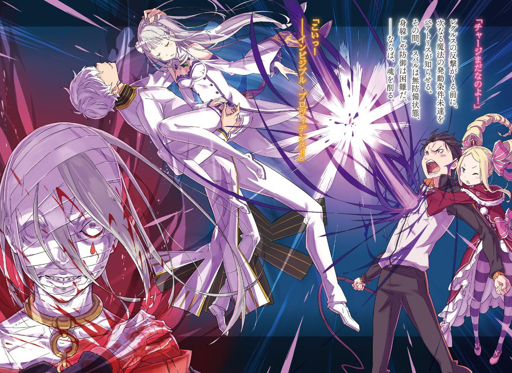

※ ※ ※ ※ ※ ※ ※ ※ ※ ※ ※ ※ ※

Внезапно на поле боя, где бушевали лёд и пламя, ворвался загадочный беловолосый юноша.

Белые волосы не длинные и не короткие, черты лица правильные, но ничем не примечательные. Телосложение нельзя было назвать ни мускулистым, ни хрупким — среднее. От него исходила настолько слабая аура, что казалось, будто он мгновенно растворится в толпе из-за своей невзрачности.

Но,

— «Архиепископ Греха… „Жадность“?!»

Имя, названное этим юношей с заурядной внешностью, потрясло Субару. Если только слух его фатально не обманул, юноша действительно представился Архиепископом Греха Культа Ведьмы.

И, скорее всего, это заявление было чистой правдой.

Иначе как объяснить такую аномалию, что он, попав под прямой удар адского пламени Сириус, остался совершенно невредим?

— «Тем не менее, я рад, что успел. Моя невеста чуть не обратилась в пепел. Хоть я и горжусь тем, что не требую многого от других, но всё же у меня есть скромное желание, чтобы моя невеста сохранила человеческий облик. Хотя, это скорее не желание, а нечто само собой разумеющееся. У меня нет настолько извращённых наклонностей, чтобы шептать слова любви груде пепла.»

Пока Субару дрожал от неутихающего ужаса, юноша — Архиепископ Греха, назвавшийся Регулусом, — смотрел на Эмилию в своих руках и продолжал говорить.

Он болтал без умолку, но слова его были пустой болтовней.

Эмилия, на которую обрушился этот поток слов, не шевелилась в руках Регулуса. Похоже, она полностью потеряла сознание, её хрупкое тело безвольно покоилось в его объятиях.

Регулус пальцем поправил прядь своих белых волос, спадающую на брови.

— «Хорошо, что она цела, но, к сожалению, моя невеста, похоже, не видела моего триумфа. Спасение из смертельной опасности — это такой героический поступок, очень важный момент для сближения наших сердец, я думаю. Ну да ладно, в конечном итоге нам суждено быть вместе, так что это лишь вопрос времени — раньше или позже. Ничего страшного.»

— «О чём ты… всё это время толкуешь?..»

— «Хм?»

Регулус, излагавший свои эгоистичные доводы, заметил Субару и нахмурился. Затем он устало вздохнул.

— «Парень, ты что, совсем не знаешь правил приличия? Видишь ли, я, кажется, представился первым. А почему я представился? Потому что это самое важное для начала любых человеческих отношений. Ведь любые отношения, какими бы они ни были, нужно начинать со знакомства друг с другом, верно? И вот, я, надо сказать, довольно внимателен к другим, поэтому всегда стараюсь общаться со всеми как можно дружелюбнее. К тому же, собеседник может оказаться застенчивым, верно? Даже если он хочет подружиться, ему может быть трудно назвать своё имя первым. Из этих соображений я стараюсь представляться первым, чтобы создать для собеседника комфортную обстановку и успокоить его. Конечно, я не трублю об этом на каждом углу, будто делаю великое одолжение. Но хотелось бы, чтобы ты, дожив до определённого возраста, понимал смысл, стоящий за тем, что я представился первым. То есть, ты же можешь это понять, да? Или ты привык общаться с незнакомцами, не представляясь? Если так, то это несколько расходится с моими представлениями и культурой. В таком случае, думаю, нам нужно согласовать наши точки зрения, но тогда тебе следовало бы заранее предупредить, чтобы избежать недоразумений, разве нет? Не проявляя ни капли такой заботы, просто пользоваться добротой другого, как само собой разумеющимся — это как-то неправильно, тебе не кажется? Более того, это уже равносильно оскорблению. Да, это самое настоящее оскорбление. Не проявлять уважения — значит, не видеть в собеседнике никакой ценности. А недооценивать ценность другого — это уже посягательство на его жизнь, на его образ жизни. Нарушение прав другого. Нарушение моих прав — прав меня, нежадного и рационального.»

— «Э-э-э… А?.. П-прости. …Меня зовут Нацуки Субару.»

Видя, как глаза тараторившего Регулуса постепенно загорались безумием, сердце Субару отчаянно забило тревогу. Поддавшись этому страху, Субару, хоть и дрожа, всё же сумел представиться.

Услышав имя Субару, Регулус прищурил свои широко раскрытые глаза.

— «…Вот так, так и нужно. Уважая другого, ты сам будешь уважаем. Обычная вежливость создаёт мир, в котором всем удобно жить. Не требуя многого, получая счастье по мере своих возможностей, каждый может прожить свою жизнь в подобающем благополучии. Не погрязайте в алчности, просто принимайте всё как есть и довольствуйтесь хлебом насущным. Это и есть мирный образ жизни.»

Регулус изрекал прописные истины мира и покоя с такой серьёзностью, что это могло бы показаться шуткой. Но то, что это были его искренние убеждения, а не шутка, доказывали его глаза, говорящие об идеалах.

Впрочем, если вырвать из контекста одни лишь слова, то и высказывания Сириус могли бы показаться разумными.

И от поведения и речей Регулуса явно веяло той же поверхностностью и искажённостью, что и от Сириус.

— «Когда с тобой разговаривают, проявить хоть каплю внимания, хотя бы кивнув — это же элементарный признак того, что ты слушаешь, разве нет? Почему ты не можешь делать элементарных вещей, принятых среди людей? Почему ты не осознаёшь, что вот так, изо дня в день, неосознанно, бессознательно, безрассудно, продолжаешь ранить чувства других мелкими поступками? Даже маленькая рана — это всё равно рана, верно? Через неё может проникнуть что-то плохое, и ты можешь заболеть смертельной болезнью. И с телом, и с душой — всё одинаково. Я терпеть не могу тех, кто не понимает, что они неосознанно угрожают жизням других. У них что, с головой не в порядке?»

— «…………»

— «Имея человеческие изъяны, не осознавать их — это плохо, верно? И неправильно, когда из-за этого страдают люди со здравым смыслом, верно? Почему ты не понимаешь, что мир плавно и гладко вращается лишь потому, что большинство людей соблюдают здравый смысл, даже не задумываясь? Прежде чем топтать доброту людей, которые делают это неосознанно, тебе нужно осознать и изменить свою собственную искажённую, ущербную, неправильную сущность, иначе ты просто продолжаешь топтать чужие сердца грязными сапогами, тебе не кажется?»

Возможно, молчание Субару не понравилось Регулусу, и он продолжал напирать.

Постепенно его речь ускорялась, и становилось ясно, что он заводится всё больше. Но Субару всё равно не мог ответить.

Для этого его сердце слишком сковал страх.

— «Даже после всего сказанного ты продолжаешь игнорировать…»

— «Спасибо за лекцию. — А теперь сгори дотла и исчезни!!»

Сзади на неподвижно стоявшего Регулуса обрушилось пламя, хлынувшее водопадом.

Сириус безжалостно обрушила огонь, исходивший от её поднятых рук, на того, кто, пусть и назвался таким же Архиепископом Греха. Субару видел это яростное нападение, потому и не смог вовремя крикнуть.

— «Субару…»

— «П-понимаю. Но всё в порядке.»

Сзади голос Беатрис, схватившей Субару за плечо так сильно, что стало больно, тоже дрожал. Было понятно, что её голос беспокоился о Регулусе, исчезнувшем в огненном водопаде — вернее, об Эмилии, находившейся в его руках.

Субару тоже не был лишён страха, что Эмилия пострадает в этой атаке. Но всё же у него была уверенность. А именно…

— «— Послушай, вот так вмешиваться посреди разговора… ты совсем не умеешь читать атмосферу? Если хочешь что-то сказать, сначала обратись ко мне, а если хочешь высказаться — подними руку. Неужели ты думаешь, что я не способен на такую малость, как подождать, пока собеседник закончит говорить?»

Раздражённо взмахнув рукой, Регулус развеял бушующее адское пламя.

Жаркая волна исчезла, словно по волшебству, а стоявший в её эпицентре Регулус остался невредим. Естественно, это касалось и Эмилии в его руках.

Несмотря на то, что их поглотило такое сильное пламя, на них не было ни ожогов, ни даже капли пота.

— «К тому же, я такой же Архиепископ Греха, как и ты, понятно? Я знаю, что у тебя не все дома, и я достаточно добр, чтобы простить небольшую оплошность. К счастью, ущерба тоже нет. Однако…»

Обернувшись, Регулус понизил голос и свирепо посмотрел на Сириус. Сириус, встретив его взгляд, запахнула плащ, снова скрывая девочку от окружающих, опустила руки и продолжала скрежетать зубами.

— «Сейчас ты ведь собиралась сжечь и эту девочку, верно? Простить такое — это уже, как ни крути, немного перебор, тебе не кажется? То есть, это невозможно. С древних времен во всех историях герои неизбежно пылали гневом, когда причиняли вред их возлюбленным, верно? Это естественное право каждого, а значит, это и моё естественное право на месть.»

— «Гнев! Ха, гнев, значит! Смешно! Ты, такой поверхностный и мелкий человечишка, не смей так легкомысленно говорить о гневе и прочем! Он принадлежит мне! Это самое дорогое, что я получила от него . А ты смеешь…»

— «Хм, так значит. Ты всё ещё держишься за того дурака, что поспешил умереть? Фу, фу, как мерзко. В этом нет ни продуктивности, ни рациональности. Смерть — это конец. Разве это не само собой разумеется? Неспособность принять даже это и цепляться за воспоминания… всё-таки ты дефектный человек. Если любимый человек умер, нужно искать следующего. Ты так шумишь про любовь-любовь, но не пользуешься даже своими естественными правами. Нарушать мировой цикл — какая же ты дрянь, однако.»

— «Ты, посмевший смеяться над его смертью, ещё смеешь говорить мне нравоучения?!»

Осыпаемая безэмоциональными оскорблениями, Сириус пришла в ярость и брызнула слюной.

Чудовище в гневе раскололо каменную брусчатку под ногами и с ужасающей скоростью метнуло в Регулуса цепи, окутанные пламенем. Раскалённое железо рассекло воздух со свистом, превратившись в худшее из орудий, которое при прямом попадании обожгло бы и разорвало плоть противника, убивая Регулуса насмерть.

Раздался глухой звук удара цепи о плоть, и лицо неподвижного Регулуса дёрнулось в сторону. Однако гнев Сириус и удары цепей не ограничились одним разом.

Справа и слева, сверху и снизу, спереди, сзади и по диагонали — бронзовые цепи Сириус осыпали градом ударов всё тело Регулуса. Летящие с огромной скоростью цепи оставляли за собой огненные следы, и в тот момент, когда стало понятно, что образовалась огненная клетка…

— «Сгинь, сгинь, сгинь, сгинь, сгинь! Вместе с этой проклятой полуэльфийкой! Превратитесь в уголь!!»

Огненная клетка схлопнулась к центру, окутав Регулуса, и взметнулся яростный столб пламени.

От жара, способного расплавить брусчатку, место, где стоял Регулус, вместе с камнями и землёй под ними испарилось, образовав провал.

Глядя на результат этого испепеления, Сириус тяжело дышала.

Вокруг чудовища собралась толпа обезумевших людей, разделявших её гневные эмоции, с кровью, текущей из глаз и носа, издавая дикие крики. Но…

— «Слушай, сколько раз мне нужно повторить одно и то же, чтобы ты поняла?»

Ступая по раскалённой и расплавленной брусчатке, Регулус появился, как ни в чём не бывало.

Ни единой царапины на его белых волосах, одежде или на Эмилии в его руках.

Лишь на его лице застыло ребяческое недовольство.

— «Я считаю, что люди, которые не понимают, сколько бы им ни повторяли одно и то же, просто не прилагают достаточно усилий, чтобы понять сказанное. А недостаток усилий означает недостаток внимания к тому, кто им это говорит. Они его презирают. Поэтому они не запоминают сказанное, не принимают его к сведению, не раскаиваются, не извлекают уроков на будущее, а просто забывают и заставляют повторять то же самое. Это не только презрение к собеседнику, но и пренебрежение к тому дурному влиянию, которое они сами на него оказывают. Они обесценивают и свою собственную ценность, и ценность собеседника — всё вместе, под корень. Это ведь… уже насилие, пусть и без слов и действий. И я считаю так.»

— «Червь!..»

— «В ранних догматах Культа Ведьмы было сказано: „Если тебя ударили по щеке, подставь другую и спроси о причине“ — учение, показывающее ценность взаимопонимания. Но я думаю иначе. Бывают моменты, когда ударившего по щеке нужно ударить в ответ. Особенно — тех, кто не желает познать боль.»

Если слушать одни лишь слова, они кажутся разумными.

Но сама суть Регулуса была искажена.

— «—!»

Выйдя из провала, Регулус оскалился в зловещей ухмылке, глядя на Сириус.

Эта ухмылка не была дружелюбной, она скорее походила на облизывание хищника, увидевшего добычу.

Как именно Регулус защищался от пламени и цепей Сириус, было неизвестно. Возможно, он был специалистом исключительно по защите, и 권능 (квонын — власть, авторитет) «Жадности» не давала ему атакующих способностей.

Поэтому нельзя было с уверенностью утверждать, что действия Регулуса приведут к фатальным последствиям.

— Но можно было с уверенностью сказать. Если так пойдет и дальше, Сириус умрет.

Вероятность того, что Регулус обладал силой только для защиты, была практически нулевой.

Если этот юноша предпримет какие-либо действия, Сириус несомненно умрёт. Само по себе это не было проблемой. Наоборот, если Архиепископы Греха перебьют друг друга, это было бы только на руку.

Только на руку, но — в смерти Сириус пострадает и подавляющее большинство окружающих. Среди них, конечно же, был Субару, толпа, охваченная безумием Сириус, и, вероятно, Лусбел и Тина, которые пожертвовали собой, молясь о благополучии друг друга.

— «————»

По всему телу Субару до сих пор пробегал неослабевающий ужас.

Подкосившиеся колени продолжали дрожать, даже дышать было трудно.

Но даже в такой ситуации.

— «Субару.»

У самого уха раздался неуверенный голос, зовущий Субару.

Голос, который сам не мог скрыть дрожь от страха, но отчаянно пытался передать, что на него можно положиться, тепло отозвался в спине.

Подавив дрожь страха, Субару, пошатываясь, поднялся на ноги.

Он не мог полностью положиться на эту лёгкую ношу за спиной. Но и сил справиться в одиночку у него не было.

Поэтому Субару отказался бросать вызов в одиночку и отказался перекладывать всё на другого.

Один Субару, вероятно, не смог бы встать от ужаса.

Сейчас Субару стоял, потому что был не один. В отличие от других людей, поглощённых безумием, только Субару был в тесном контакте с кем-то, не был одинок.

Ощущение связи позволило Нацуки Субару противостоять страху.

— «Беатрис.»

— «Я всё понимаю, я полагаю.»

На один лишь зов Беатрис кивнула, словно поняла всё.

Не было нужды проверять, действительно ли они понимают друг друга. Просто отдать все силы своей роли — это должно было привести к результату.

И Сириус, и Регулус, оба Архиепископа Греха, похоже, совершенно забыли о существовании Субару.

Они видели только друг друга. Пусть грызутся. Если бы Сириус сожгла только Регулуса, это был бы наилучший исход, но такая вероятность, скорее всего, исключена.

Поэтому цель Субару — остановить бесчинство Регулуса.

Привлечь его внимание к себе, предотвратить огромный ущерб.

И самое главное…

— «Не смей больше так запросто трогать Эмилию!..»

Неугасающая любовь к ней подавила страх и разожгла огонь в Субару. Разожгла, или он так себе внушил. Ему приходилось начинать с обмана собственного сердца, иначе он просто не смог бы бросить вызов.

Перед ним Регулус стоял спиной, его движения были медлительны. Действия Сириус, стоявшей напротив, также были лишены прежней чёткости. Для Субару это было как нельзя кстати.

— «— Шамак!»

В тот момент, когда Субару, подстегнув дрожащие ноги, бросился вперёд, Беатрис за его спиной произнесла заклинание.

Чёрная мгла сильнейшей магии Шамак скрыла тело Регулуса от мира, успешно помешав его движению. Туда, в точку, где он точно был мгновение назад, Субару со всей силы хлестнул хлыстом, который держал в руке.

Цель — шея.

Зацепить хлыстом тонкую шею и резко дёрнуть вниз. Даже разгневанный Регулус, если с ним так грубо обойтись, будет вынужден обратить внимание на Субару. Или, возможно, Шамак Беатрис уже полностью лишил его ориентации —

— «Нет отдачи!»

— «Приближается, я полагаю!!»

От хлыста, который должен был точно попасть, не последовало реакции, и Субару в отчаянии вскрикнул, а затем раздалось предупреждение Беатрис.

В следующее мгновение беловолосый юноша прорвался сквозь чёрную мглу и ринулся к Субару.

— «То вперёд, то назад, какой ты неугомонный. Насильник моих скромных прав на покой. Может, ты просто разлетишься на куски и исчезнешь?»

— «Ми… нет, Мурак!»

Держа Эмилию правой рукой, Регулус небрежно протянул свободную левую руку к Субару. Беатрис мгновенно приняла решение отказаться от атаки и наложила на тело Субару магию управления гравитацией.

Субару тут же согласился с решением Беатрис и уклонился от приближающихся пальцев Регулуса прыжком.

Мурак — это разновидность магии Инь, которая ослабляет силу притяжения, действующую на тело цели.

Тело Субару, ставшее лёгким, словно пёрышко, взмыло высоко в воздух, оставив позади Регулуса, пытавшегося его догнать.

— «Зачем уворачиваться?»

— «Естественно, уворачиваться, страшно же!»

Регулусу, смотревшему вверх на уклонившегося Субару, тот нанёс удар хлыстом прямо сверху. На этот раз удар пришёлся точно в макушку. Белые волосы взметнулись от удара, и на голове должна была появиться болезненная рваная рана от хлыста — но её не было. Ни царапины. Словно волосы просто колыхнул лёгкий ветерок.

— «А если бы невеста пострадала? Быть добрым к девушкам — это же само собой разумеется, этому не нужно учиться, тебе не кажется? Ты даже на это не способен?»

— «Не говори глупостей! Именно к ней я и хочу быть добрее всех на свете! Вообще, что ты имеешь в виду, называя её невестой?..»

— «Ясно же. Судьба. — Ведь мы обещали друг другу во сне.»

Услышав улыбающийся ответ Регулуса, Субару, прижавшийся к стене и державшийся одной рукой, опешил. Ситуация выглядела несколько нелепо, но участники событий не обращали на это внимания.

— «Мы с ней будем вместе. Это судьба. Я, в принципе, доволен собой и ничего особо не желаю. Но я не настолько ограничен, чтобы не принимать дарованное. Особенно если это дарует мне судьба. Я не прошу многого, но я буду защищать свой мир в пределах моей досягаемости во что бы то ни стало. Себя и своих близких. Поэтому.»

— «————»

— «Я защищу её. Я возьму её в жёны, мы будем любить друг друга и наслаждаться заслуженным миром. Ради этого я без колебаний применю данную мне силу.»

— «А где… где в этом её воля? Вы даже не обменялись согласием, насколько же ты забегаешь вперёд?»

Уверенное заявление Регулуса и его вид сильного человека, способного подкрепить свои слова делом.

Прямолинейное, правильное, скромное и лишённое амбиций мышление, но при этом фатально неверное.

Невозможно было объяснить, что именно фатально неверно. Разве что, что-то пошло не так с самого начала. С самого начала что-то было искажено, поэтому всё вывернулось наизнанку.

Голос Субару дрожал не только от страха.

На его вопрос Регулус рассмеялся, словно услышал нечто совершенно обыденное.

— «Ты беспокоишься? Если так, то спасибо. Но не волнуйся. Судьба неизбежна… и особенно любовь и дружба не могут существовать в одиночку. Если мне была явлена невеста судьбы, то и ей, несомненно, было сообщено, что я — её суженый.»

— «…Совершенно безумен, я полагаю.» — пробормотала Беатрис с полным отвращением, слушая несостоятельную теорию Регулуса.

Субару был того же мнения. Эта идея Регулуса была близка к логике сталкера, приукрашенной правильными словами и красивыми фразами. И, как это часто бывает со сталкерами, он ни на йоту не сомневался в своей правоте.

— «Достаточно. С соперником в любви всё равно не договориться. Хотя мне и противно признавать его своим соперником, настолько он отвратителен.»

Отпустив стену, Субару снова приземлился на площадь.

Увидев бесшумно приземлившегося Субару, Регулус понимающе кивнул.

— «Понятно, вот оно что. Слушай, мне неловко это говорить, но… в любовь, предначертанную судьбой, нельзя вмешиваться. Знаешь, вмешиваться в чужую любовь — это неприглядно.»

— «Заткнись! Эмилия — моя! Я её тебе не отдам!»

— «Хм, так её зовут Эмилия. Хорошее имя. Оно идеально подходит этой прелестной девочке, его так и хочется шептать, словно любуясь маленькой птичкой.»

— «Ты даже имени её не знал… Что ты в ней увидел, чтобы нести этот бред про невесту?!»

— «Лицо.»

Субару потерял дар речи. Гнев перехватил ему горло.

Неясно, как Регулус истолковал его молчание, но он склонил голову набок.

— «У неё милое личико. А любовь — разве это не всё?»

— «Умри.»

— «Тебе лучше умереть, я полагаю.»

К гневу Субару присоединилась и Беатрис, отвергая слишком легковесное понимание любви Регулусом.

Сделав шаг, тело Субару устремилось вперёд — эффект Мурака всё ещё действовал. Летя по ветру, Субару стремительно сократил дистанцию, и Регулус удивлённо расширил глаза.

Он, вероятно, не мог понять, зачем Субару снова бросается на него в ближний бой.

Субару тоже понимал. Понимал глупость сближения с Регулусом. У Регулуса не было такого очевидного оружия, как у Сириус. Это означало не недостаток подготовки с его стороны, а скорее то, что ему это было не нужно.

Поэтому сближаться с Регулусом было смертельно опасно. И всё же причина, по которой Субару шёл на ближний бой с Регулусом, была одна.

— Потому что козырь Субару можно было использовать только в ближнем бою.

— «Зачем ты лезешь на рожон, не понимаю. Да и не нужно мне это понимать, но если в этом есть какой-то смысл, кроме отчаяния, то скажи. Видишь ли, таков уж я — даже с противником, который вот-вот погибнет, я до конца стремлюсь к взаимопониманию.»

— «Спасибо за лекцию — Беако!»

— «Готова, я полагаю!»

К приближающемуся Субару Регулус небрежно протянул левую руку.

Растопыренные пять пальцев — вероятно, каждый из них был смертоносным оружием, способным отнять жизнь. Перед ними Субару глубоко вдохнул и закричал.

Одно из достижений, накопленных Субару и Беатрис за последний год.

— «— Э・М・М!!»

— «…Что?»

Громкий, почти рёвкий возглас Субару через его сломанные Врата передал ману Беатрис, и та активировала не имеющую аналогов в этом мире магию нового типа.

Это было одно из трёх оригинальных заклинаний, созданных дуэтом Нацуки Субару и Беатрис — абсолютная защитная магия «Э・М・М».

Невидимое магическое поле окутало тело Субару, немного «сдвинув» его существование из этого мира, тем самым полностью аннулируя любые атаки, будь то физические или магические.

Пальцы Регулуса, хоть и достигли Субару, не причинили ему никакого вреда. Увидев это, лицо Регулуса впервые застыло от удивления.

В эту застывшую физиономию Субару со всей силы врезал левым кулаком.

— «Драаа!»

— «—!»

Щека Регулуса дёрнулась от удара.

Субару скривился от ощущения полновесного удара, но на лице Регулуса, вернувшемся в прежнее положение, не осталось даже покраснения. Полностью аннулированный урон. Казалось, нечто подобное тому, что сделал Субару, постоянно защищало тело Регулуса.

— «Зарядка ещё не готова, я полагаю!» — крикнула Беатрис, предупреждая о невозможности следующего действия до контратаки Регулуса.

Находясь вблизи, Субару нужно было уклониться от атаки Регулуса. Увернуться, защититься — оба варианта были сложны. Значит, оставалось лишь истощить душу…

— «Не воображай себе…»

— «Невидимое Провидение!!»

Лицо Регулуса, повернувшееся к Субару с раздражением, было подброшено снизу вверх невидимым кулаком.

Глядя на отлетевшего Регулуса, прервавшегося на полуслове от удивления, Субару выплюнул подступивший кровавый сгусток и грубо вытер рот рукавом.

Никто, кроме Субару, не должен был видеть эту невидимую божественную волю.

Но Субару отчётливо видел чёрную руку, вырывающуюся из его груди — поток отвратительной силы, который можно было назвать третьей рукой.

Всё тело скрипело, душа истощалась, и он сплёвывал кровь, почерневшую, словно от яда.

Лишь заплатив такую цену, он мог нанести один полновесный удар. Но даже этот полновесный удар для Субару был лишь каплей в море — он и в подмётки не годился ударам Гарфиэля, способным дробить камни.

Тем не менее, невидимый удар должен был иметь свой эффект.

— «Субару, ты в порядке, я полагаю?»

— «Кхе… Вроде да. К тому же, у него, похоже, сила удара огромная, но сами атаки слабые. Из тех, с кем я дрался, он примерно на уровне Рачинса.»

Сплюнув кровь, застрявшую в горле, Субару указал на низкий уровень бойцовских навыков Регулуса.

Боевая техника Регулуса была настолько неуклюжей и дилетантской, что даже Субару мог ему противостоять. Возможно, от его смертоносных пальцев можно было бы уворачиваться, если бы хватило концентрации.

— «————»

Его похлопали по плечу.

Беатрис молча сообщила, что зарядка завершена.

Оригинальные заклинания из-за своей мощи и эффекта нельзя было использовать подряд. К тому же, три вида магии по своей природе можно было использовать только раз в день — больше тело не выдержит.

— «Э・М・М уже использовано, но так я смогу подобраться к нему и без магии. И если получится вмазать этим …»

— «Есть шанс на победу, я полагаю. Появился свет надежды.»

— «Никакой надежды нет. Если я ввёл вас в заблуждение, то прошу прощения. Мне тоже не очень нравится, когда меня постоянно выставляют дураком. Хотя дело не в том, нравится или нет. То, что моя воля не исполняется — это нехорошо. Это нарушение прав. Я уже дважды позволил вам попасть по мне, так что будет несправедливо, если моя атака теперь не достигнет цели, верно?»

Приземлившись, Регулус свирепо посмотрел на Субару и Беатрис, которые вновь обрели решимость.

На его лице не осталось и следа прежнего самообладания, оно выражало не просто недовольство, а настоящее негодование.

Похоже, он наконец-то признал в Субару врага. Этим первоначальная цель была достигнута — подумал Субару, но в этот момент.

— «Ува?!»

— «…Что ты задумала?»

Земля между Субару и Регулусом, сверлившими друг друга взглядами, внезапно вспыхнула.

Субару отшатнулся от жара, опалившего лицо, а Регулус нахмурился от горячего ветра.

Взгляды обоих, естественно, обратились к виновнице — Сириус.

До сих пор чудовище по какой-то причине совершенно безучастно наблюдало за схваткой Субару и Регулуса. Непонятно было, с какой целью она молчала, но лучше бы она и дальше молчала, однако она внезапно вмешалась.

У Субару не было средств защиты от пламени Сириус, что делало её, по сути, более опасным противником, чем Регулуса с его ближним боем. К тому же, условия для её победы всё ещё не были разгаданы.

Субару затаил дыхание, предчувствуя ухудшение ситуации.

Однако ситуация ухудшилась гораздо сильнее, чем мог представить Субару.

— «—шла.»

— «—?»

Застывшая Сириус смотрела не на обоих — нет, она пристально смотрела на Субару.

Чудовище полностью игнорировало Регулуса, на которого направляла свою убийственную ауру, и всецело сосредоточила свой взгляд на Субару. Этот взгляд светился безумием, и у Субару резко пересохло в горле.

Затем чудовище подняло безвольно опущенные руки и обхватило ими свои щёки.

— «Нашла. Нашла. Нашла. Нашла. Ааа, аааа! Аааааа! Да, точно, так и есть! Прости, прости, что не заметила? Прости? Ааа, как хорошо. Ну конечно. Вы ведь всё-таки вернулись, да?!»

— «О чём ты?..»

— «Так вот где ты был, да?! Я искала повсюду, но не могла найти, я разорвала все твои копии, но тебя нигде не было, я искала, искала, искала, искала, искала, искала, искала, искала, искала, искала, искала, искала, искала, искала, искала, искала… нет, это ты заметил, что я ищу тебя, и поэтому вернулся!»

Высокий, срывающийся голос был явно наполнен жаром.

Голос Сириус, которая прижимала руки к щекам, извивалась и качалась из стороны в сторону, был взволнованным. Трудно было описать словами, в каком состоянии находилось это чудовище, судя по её странному поведению.

Но если всё же попытаться найти что-то похожее, то это было — поведение женщины, ослеплённой любовью, нашедшей образ своего потерянного возлюбленного.

— «Потому что мои чувства достигли тебя! Потому что ты наконец заметил, как я всё время хотела стать с тобой единым целым! Потому что моя «Любовь» достигла тебя!»

— «————»

— «Я ждала только тебя… мой любимый, любимый Петельгейзе!»

С этими словами, безумно улыбаясь, Сириус Романе-Конти назвала имя своего покойного мужа, обратив на Субару взгляд, полный страсти.

※ ※ ※ ※ ※ ※ ※ ※ ※ ※ ※ ※ ※
