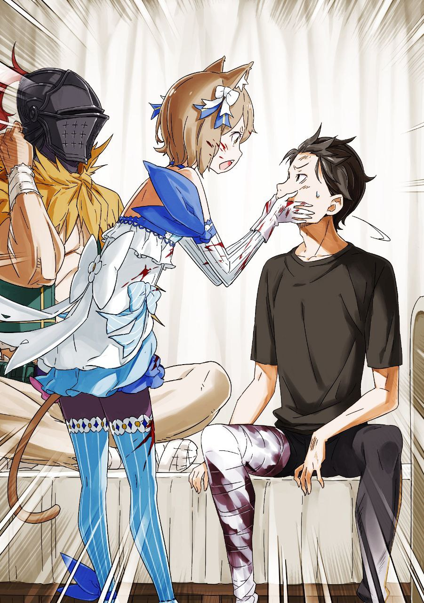

※ ※ ※ ※ ※ ※ ※ ※ ※ ※ ※ ※ ※

Гууух, гууух.

Откуда-то издалека, но одновременно и близко, доносился низкий гул, словно что-то огромное и пустое гудело внутри.

Ощущение, будто вибрация звука совсем рядом. Звук, проникнув через барабанные перепонки, сотрясал череп, а оттуда вибрация по костям расходилась до самых кончиков пальцев рук и ног.

Кровоток замедлился, вызывая неприятное ощущение, будто в сосуды залили грязную жижу.

Работа внутренних органов предельно ослабла, и казалось, будто живот набили глиной.

Мозг не получал достаточно кислорода, мысли путались и были обрывочными, ненадежными.

Тяжелый гул не собирался утихать, и казалось, будто глазные яблоки катаются под веками.

— «…»

Ощущая ужасную вялость во всем теле и сковывающую апатию, борясь с подступающей тошнотой и туманом в голове, Субару медленно открыл глаза.

Зрение, привыкшее к темноте под веками, с трудом принимало врывающийся белый свет.

Расплывчатый мир качался из стороны в сторону, в белом мареве мельтешили разные цвета. Словно ребенок выплеснул краски на белый холст.

Но это впечатление постепенно угасало по мере того, как видимый мир начинал обретать четкость.

Спустя десяток секунд, когда глаза наконец пришли в норму, перед взором Субару предстала тускло освещенная комната с грязным потолком. А еще — суетливые силуэты множества людей вокруг и их мелькающие фигуры.

— «Эй, парень-то очнулся!»

Субару, у которого все еще звенело в ушах, внезапно оглушил громкий голос.

В ненужной громкости была такая сила, что все до этого суетившиеся люди замерли, и их взгляды устремились на говорившего.

— «Эй, девчонка с кошачьими ушками, иди сюда! Остальные продолжайте работать, как работали! Моя вина, работайте! Ну же, время дорого!»

— «Ох, ну какой же шумный! Сколько раз уже говорил, а ты всё никак не исправишься. Здесь полно людей, которым нужен покой, так что живо возвращайся к своей работе, да!»

Великан хлопнул в ладоши, извиняясь за то, что привлек внимание своей громкостью. К зверочеловеку с собачьей головой и характерным говором сердито подошел юноша с кошачьими ушками.

Одетый в откровенную женскую одежду, с пятнами крови на теле, Феликс посмотрел на Субару сверху вниз и вздохнул с облегчением.

— «Похоже, ты очнулся, да? Ситуацию понимаешь… точнее, говорить можешь?»

— «…А-а. Фели… кс?»

— «Ага-ага, это всеми любимый Феликс собственной персоной! А ты — Нацуки Субару. Сейчас здесь что-то вроде полевого госпиталя, а тебя принесли сюда с тяжелым ранением. Понимаешь?»

Феликс быстро выпалил информацию Субару, ответившему хриплым голосом.

Субару с трудом заставил свой вялый мозг работать, переваривая и усваивая каждое его слово.

Повернув голову, Субару осмотрелся. Только тогда он понял, что лежит на импровизированной постели из сложенной одежды и ткани.

И действительно, как и сказал Феликс, вокруг все напоминало полевой госпиталь.

Вокруг было полно людей, лежащих на таких же импровизированных койках, как у Субару, стонущих от боли и страданий во время лечения.

Отовсюду несло кровью, раздавались всхлипы — ужасающее зрелище. Магического лечения не хватало, и краем глаза Субару видел, как раны зашивали иглой и ниткой.

— «Э-это… Что вообще…»

— «Похоже, ты всё ещё не в себе, да? Попробуй медленно вспомнить, что случилось до того, как ты отключился. Вспомнишь — и сам всё поймешь.»

Не то чтобы это звучало резко.

Слова Феликса не были добрыми, но дело было не в его настроении. Просто даже у него не осталось сил. Закатанные рукава, многочисленные пятна крови на белой коже и щеках.

Нетрудно представить, насколько востребован был Феликс, первоклассный целитель, посреди этого хаоса. А причиной этой катастрофы был…

— «Культ Ведьмы… кх.»

— «И правда, они просто отвратительны. Я это знал, но… похоже, всё ещё недооценивал их. Не мог и вообразить, что они зайдут так далеко. А ведь должен был.»

С досадой прикусив губу, Феликс опустил подбородок в ответ на бормотание Субару.

Субару до боли понимал чувства Феликса, дрожащего от раскаяния. Понимал, но сейчас было не до этого. Нужно было кое-что выяснить.

— «Э-Эмилия?! Что с Эмилией? Ее здесь нет?!»

— «…»

— «Жа-Жадность… Архиепископ Греха похитил Эмилию, и тогда я…»

Голос задрожал на последнем слове, потому что он понял — его худшие опасения оправдались.

В опущенном взгляде и молчании Феликса Субару прочел ясный ответ.

По крайней мере, Эмилии здесь не было.

И если все было так, как он помнил перед потерей сознания, она попала в руки Регулуса…

— «А Беатрис?»

— «…Беатрис.»

— «Да. Беатрис, девочка, что была со мной, что с ней? В платье, с локонами-спиральками, дерзкая, но милая… Б-Беатрис где?»

То, что Эмилию унес Регулус, было почти несомненно.

Судя по поведению Регулуса, вероятность того, что он причинит Эмилии вред… нельзя сказать наверняка, но, вероятно, была низкой. Непростительно, но пока что…

Но что насчет Беатрис? Там был не только Регулус, но и Сириус. И Сириус испытывала к Беатрис сильную враждебность.

Раз Субару благополучно доставили в полевой госпиталь, значит, ему удалось спастись от Сириус.

Кто и как защитил Субару?

— «Эй, прошу тебя. Скажи. Беатрис…»

— «…»

Отсутствие ответа усиливало тревогу, и Субару отчаянно умолял Феликса. Феликс на мгновение закрыл глаза, переглянулся с огромным зверочеловеком, стоящим рядом — Рикардо, капитаном «Железного Клыка», — а затем они оба посмотрели в одну сторону.

Проследив за их взглядами, Субару широко раскрыл глаза.

— «Беатрис…!»

Поодаль от остальных раненых одиноко лежала девочка в платье.

Увидев Беатрис, неподвижно лежащую на импровизированной койке, Субару отбросил одеяло, которым был укрыт, и попытался подбежать к ней.

Но стоило ему попытаться сесть, как на голову резко навалилась тяжесть, а правая нога свелась от боли, из-за чего он потерял равновесие.

Тяжесть в голове была из-за слабости, но он не понимал, почему не слушается правая нога.

Поспешно опустив взгляд, Субару увидел состояние своей ноги и задохнулся.

— «Ох…»

— «Если бы Беатрис не применила на тебе исцеляющую магию, ты бы сейчас был без ноги. Ты должен быть благодарен ей, да.»

На правом бедре Субару не хватало почти половины плоти. Заметно более тощую по сравнению с левой правую ногу туго, слой за слоем, обматывали бинты, словно запечатывая что-то дурное. К тому же, для фиксации к ноге была приложена шина — вероятно, поэтому она и не двигалась.

Пальцы невольно потянулись к ране, но в момент прикосновения Субару отшатнулся, словно пораженный молнией.

— «Вспом… нил…!»

Это был последний удар Регулуса перед уходом.

Прежде чем уйти, забрав Эмилию и наговорив вздора, Регулус с легкостью, будто отбрасывая задней лапой песок, взрыл землю и обрушил комья на ногу Субару.

В тот миг правая нога Субару получила рану, словно ее распороли когти зверя. Результат был сейчас перед ним.

— «Когда я подоспел, нога парня держалась буквально на клочке кожи да мяса. Думал, точно не прирастёт. А эта девчонка, плача, колдовала исцеление изо всех сил и кое-как успела вовремя.»

— «А потом принесённого сюда Субару долечивал уже Феликс. Раз лечил я, то гарантирую — всё будет как прежде, но сейчас кости и нервы только срастаются, и нужно лежать спокойно, пока плоть не восстановится. Никаких нагрузок, бу-бу!»

Феликс скрестил руки перед грудью, показывая Субару знак “Х”, запрещая напрягаться. Но Субару не мог молча смириться с тем, что находится вдали от Беатрис.

Феликс тяжело вздохнул, глядя, как Субару пытается извиваться и ползти. Затем огромная ладонь схватила ползущего, словно гусеница, Субару…

— «Ладно, отнесу тебя к той девчонке разок. Думаю, вы, ребята, заслужили хотя бы это.»

— «Прости. Спасибо.»

— «Да пустяки, пустяки.»

Рикардо перенес Субару вместе с постелью к импровизированной койке Беатрис. Перегнувшись, Субару всмотрелся в нее — неподвижная Беатрис спала так тихо, что не было слышно даже дыхания.

Беатрис, будучи духом, спала подобно человеку не только для того, чтобы не тратить ману понапрасну во время активности, но и для снижения нагрузки, так как, в отличие от Пака, она не могла исчезнуть в носителе или чем-то подобном.

Поэтому Субару не раз видел спящее лицо Беатрис.

Но он впервые видел ее спящей так тихо, словно мертвой.

— «Она просто… спит? Что-то мне не по себе.»

— «Спит — это, возможно, не совсем то слово. Сейчас она полностью отключила свои функции духа и находится в спячке… хм-м, скорее, в состоянии, близком к анабиозу.»

— «Анабиоз?! Почему?!»

Субару коснулся лба Беатрис и поразился исходящему оттуда холоду. Он провел пальцем по ее ресницам, коснулся щеки — никакой милой реакции. И после этого — слова Феликса. Побледневшему Субару ответил присевший на корточки Рикардо.

— «Девчонка с кошачьими ушками говорит, это потому что она использовала ману до предела. И правда, так оно и должно было быть. На площади, где я вас случайно нашел, валялась куча народу с точно такими же ранами, как у тебя. И эта девчонка в одиночку не дала им всем умереть.»

— «…»

Услышав слова вздохнувшего Рикардо, Субару невольно затаил дыхание.

Раненые с такими же травмами, как у Субару… Это означало, что урон увеличился из-за того, что Субару, которому Регулус изувечил ногу, разделил свои ощущения с другими людьми. Без сомнения, это была пакость Сириус. Похоже, та после этого отступила, но для оставшейся Беатрис битва только началась.

Исцелить и Субару, и людей с такими же ранами, всех одинаково.

Конечно. Ведь Субару — жадный мужчина, который всегда хочет слишком многого. И эта девочка, проведшая с ним время, не могла кого-то бросить.

Поэтому Беатрис исчерпала всю свою ману до предела, спасая жизни людей, и в итоге сама пала без сил.

— «С Беатрис все будет в порядке?.. Даже если я думаю, что ей просто нужно отдохнуть…»

— «…Честно говоря, не очень хорошо. Нет, скажу прямо — плохо. Хоть Феликс и первоклассный целитель, в духах я не разбираюсь. К тому же, эта девочка ведь отличается от обычных духов, верно? Сделать почти ничего нельзя.»

— «Ч-что же делать?! Нужно спасти Беатрис… Я…»

Прошел всего лишь год.

Всего год прошел с тех пор, как он пообещал забрать ее и сделать счастливой. Жизнь Беатрис не может оборваться здесь.

Она должна быть счастливой, счастливой, счастливой, счастливее всех на свете.

— «Проблема ведь в том, что она может исчезнуть из-за нехватки маны, так? А если взять её со стороны? Раз ты её контрактор, парень, так может от тебя…»

— «…Этот дурак Субару! Его Врата разрушены, так что он не может передавать ману извне. А ведь через Субару передать ей ману было бы проще всего.»

— «Да, точно! Плод Бокко! А что, если использовать плод Бокко? Усилить себя изнутри, выжать ману и передать её Беатрис…!»

— «Дурак!»

Феликс гневно уставился на Субару, поднявшего голову с проблеском надежды.

Субару удивился неожиданной резкости его взгляда, а Феликс, тут же смутившись своего гнева, начал теребить челку и сказал:

— «Не заставляй меня повторять. Это… очень, очень опасно. Особенно для твоего тела, Субару, это теперь просто яд. Если ты это сделаешь, просто станет двое мертвых… Абсолютно точно не делай этого.»

— «…»

В строгих словах Феликса слышалась почти умоляющая нотка.

Перед лицом этой искренности Субару замолчал, отказавшись от своего опрометчивого решения.

Феликс — эксперт в исцеляющей магии. Естественно, он уже перебрал тысячи и десятки тысяч способов вылечить упавшего без сил.

Такую поверхностную идею, что пришла в голову Субару, он наверняка давно рассмотрел.

— «Я понимаю чувства Субару, беспокоящегося о Беатрис. Понимаю, но с Беатрис не случится ничего прямо сейчас. Сейчас нужно думать не только об этой девочке, есть куча других вещей, о которых нужно позаботиться…»

— «Кроме Беатрис… Да, точно. Еще ведь Эмилия! И к тому же…»

Слова Феликса вернули Субару к реальности, и он снова огляделся вокруг.

В пространстве, превратившемся в полевой госпиталь, все еще лежало множество фигур… но что-то было не так. Среди них были не только люди с ранениями правой ноги, как у Субару. Было видно еще очень, очень много людей, доставленных сюда по другим причинам.

— «Где мы вообще находимся, и что это за ситуация… Нет, что сейчас вообще происходит? Почему здесь столько раненых?»

— «Архиепископы Греха, Культ Ведьмы, ты же сам говорил, парень?»

— «Дело ведь не только в этом? Не так. Я видел только двух Архиепископов Греха. Но этот ущерб, как ни посмотри, не мог быть нанесен только ими двумя. Скорее, сама мысль, что Архиепископы пришли без культистов Ведьмы, была изначально странной.»

Сначала в глаза бросились двое, представлявшие собой слишком уж огромную угрозу.

Поэтому Субару сосредоточился лишь на двух Архиепископах Греха, как на самых опасных существах… Но, как и в случае с Петельгейзе, гораздо естественнее было бы предположить, что они пришли в город со своими подчиненными, культистами Ведьмы.

Тогда и масштабы этого ущерба становятся понятны.

— «Два Архиепископа Греха и их подчинённые культисты. Вот та угроза, что сейчас напала на город, так ведь?»

— «На этот счет тоже есть много чего, о чем нужно поговорить…»

Феликс с горьким выражением лица собрался ответить на вывод Субару.

Но его слова были прерваны. Прежде чем он успел дополнить вывод Субару, вмешались с совершенно неожиданной стороны.

Это был…

— 『Йа-ху! Йа-ху-у! Йа-ху-ху-ху!』

В пространстве разнесся пронзительный, фальшивый голос.

Беззаботный тон голоса совершенно не вязался с царившей здесь гнетущей атмосферой. Словно во время серьезного разговора случайно переключил на развлекательное шоу — если проводить аналогию, ближе всего была именно такая неуместная неучтивость.

— «Что… это?»

Услышав голос, Субару поднял голову и поспешно огляделся. Но говорящего нигде не было видно. Субару тут же понял причину.

Голос звучал так, будто шел из громкоговорителя или динамика… Точно такое же впечатление возникло у Субару этим утром.

— «Магическое устройство для трансляции… чтобы голос был слышен по всему городу?»

— 『Ну что, мясные отбросы, как поживаете-с? Небось в полном восторге от моего прекрасного голоска, сколько ни слушай — всё равно прекрасен, не так ли? Кья-ха-ха-ха-ха!』

Словно в подтверждение мыслей Субару, трансляция через магическое устройство продолжилась.

Тут же раздался женский голос — манера речи была какой-то по-детски жестокой, словно она плевала на всякие приличия и топтала их ногами.

Наглый громкий смех впивался в барабанные перепонки, вызывая физическое отвращение.

— «Что за идиотский голос? Эй, это…»

— «Тш-ш, Субару, молчи.»

Феликс приложил палец к губам и навострил уши, заставив Субару замолчать.

Лицо Феликса было серьезным — он почувствовал неладное. Субару заметил, что Рикардо тоже насторожился, а лежащие раненые затыкали уши и всхлипывали.

Похоже, они слышали этот голос не впервые.

— 『Ну-с, ну-с, для всех вас, мясных отбросов, что никак не уймутся от возбуждения при звуках голоса красотки, у меня есть важное объявление-с! Мы тут подумали, может, нам уже надоело и пора сваливать? — А вот и неправда! Шучу я, шучу! И день, и ночь ещё только начинаются, не так ли-с? Кья-ха-ха-ха-ха!』

Скрежет, скрежет, скрежещущий звук.

Голос был переполнен злобной радостью — такой, словно она наслаждалась, поднеся зеркало к чужому уху и царапая его острым когтем.

Что это? Кто это? Что это за голос, кто эта женщина?

На лбу выступил холодный пот, и Субару затаил дыхание, ощутив перемену в своем состоянии.

Прежде чем разум Субару успел осознать происходящее, его тело уже уловило что-то неладное.

— 『Ладно, оставим мои уморительные шутки и продолжим объявление-с. Как я уже говорила, мы захватили этот город. Вы все — птички в клетке… Не-ет! Вы — букашки в садке для насекомых, не так ли-с?!』

— «?!»

— 『Букашкам самое место зависеть от настроения хозяина садка, чья жизнь решается по его прихоти. Когда вам отрывают крылышки, лапки или головы, как вздумается… Кья-ха-ха-ха, жалкое, жалкое зрелище! Жалкие вы твари. Благодарите нас за нашу доброту, что мы вас прореживаем, ясно вам-с? Кья-ха-ха-ха-ха!』

Снова и снова раздавался громкий смех, пропитанный чистой злобой.

Злоба того, кто получает высшее наслаждение, глядя на других свысока, попирая их и унижая само их существование.

У Субару были очень веские подозрения насчет того, кто способен на такое.

— 『И, и, и! Вы, тупоголовые, наверняка не поняли истинного смысла моих драгоценных слов-с. Вы ж бездарные тупицы, комки дряблого мяса, что только и думают, как бы совокупиться в свободное время! Так что добрая я разжую вам всё ещё понятнее, плюну вам в харю — прямо как обожают извращенцы-мазохисты — и научу вас уму-разуму, не так ли-с?』

— «…»

— 『Раз букашками в садке играют по настроению хозяина, то всё, что вы, букашки, можете делать, — это ублажать нас, хозяев садка, что держат вас в руках. Когда у нас плохое настроение, вы, беспомощные твари, дрожите от страха, что вам могут оторвать крылышки или лапки, да? Но пока вы приносите мёд, во мне просыпается материнская доброта, и я не стану отрывать вам головы-с. Та-а-ак что-о-о… Кья-ха-ха-ха-ха!』

Субару, подобно Феликсу и остальным, молча слушал повторяющуюся злобу.

С каждым вздохом, с каждым словом, с каждой фразой он чувствовал, как в груди накапливается что-то мутное и вязкое, но железной волей сдерживал это.

И тут он заметил. Кое-что заметил.

Что это такое?

— 『Позже мы предъявим вам, мясным отбросам, свои требования-с. А вы будете отчаянно корчить жалкие рожи, вопить «не хочу умирать, не хочу умирать», и как-нибудь выродите требуемое и доставите нам. И тогда я, о чьей доброте, по слухам, рыдал весь континент, может, и подумаю о том, чтобы выпустить вас из садка, не так ли-с? Кья-а, как поня-ятно! Кья-ха-ха, кья-ха!』

Голос принадлежал кому-то, кто сам себя развеселил, хлопал в ладоши и топал ногами, будто сидя на стуле.

Содержание речи, глупая манера говорить и режущий слух голос — все это раздражало Субару, но проблема была не только в этом.

С некоторого времени он слышал звук.

Вероятно, источник звука находился в той же комнате, что и транслирующее магическое устройство. Звук проскальзывал сквозь женский голос, вмешивался в трансляцию и слабо доносился до Субару.

Но он не мог понять, что это за звук.

Казалось, еще шаг, еще немного — и он догадается, но ответ не приходил.

Дело было не в том, что он не мог понять, — инстинкт отказывался принимать это.

Не замечай. Не замечай. Тебе не нужно знать.

Сердце колотилось так сильно, что он слышал ток крови — такова была его концентрация. Отторжение, понимание, отторжение, понимание.

…Слабо доносящийся звук показался Субару жужжанием бесчисленных насекомых.

Близко. Бесконечно близко к правде. Близко, но возможно ли такое?

Может ли жужжание крыльев мошкары вот так попасть в транслирующее устройство? Субару не знал возможностей магических устройств этого мира. Поэтому это были лишь догадки. Он просто чувствовал диссонанс, исходя из своего здравого смысла.

Это чувство диссонанса и жужжание прилипли к его барабанным перепонкам и не отпускали.

— 『Ну, на этом моя драгоценная речь окончена-с. Соболезную вам, извращенные мясные отбросы. Вам, букашкам, остается только постараться изо всех сил. Как я уже говорила… Четыре контрольные башни, управляющие водными каналами этого города, заняты нами. Советую не замышлять ничего странного, ясно вам-с? Лица утопленников так уродливы, что на них невозможно смотреть! Кья-ха-ха-ха-ха…』

Угрожающий пронзительный смех постепенно затих, и звук оборвался.

Жужжание, терзавшее Субару тревогой, тоже исчезло, и тело невольно обмякло. Сразу после этого Субару посмотрел на Феликса и Рикардо.

— «Как понимать эту трансляцию?»

— «Как понимать… да так и понимать, как сказано. …Жалко признавать, но нас опередили по всем фронтам, и сейчас мы полностью в обороне. Таково наше положение.»

Субару нахмурился, услышав ответ Феликса, который с мрачным видом грыз ноготь.

Хотя в трансляции было много настораживающих деталей, цель и принадлежность говорившей были ясны.

— «То есть, это тоже был Культ Ведьмы…»

— «Первая трансляция была, пока ты спал, Субару, а это уже вторая. В первой она назвала себя. Архиепископ Греха Культа Ведьмы, олицетворяющая Похоть. Но…»

Тут он оборвал фразу и сделал лицо, будто сомневался, стоит ли продолжать.

Субару недоуменно наклонил голову, не понимая причины его колебаний.

Эти типы из Культа Ведьмы, как ни противно, представлялись по одному шаблону.

По логике вещей, дальше должно было идти имя.

Архиепископ Греха Культа Ведьмы, Похоть… Не может быть, третий Архиепископ Греха.

Ее имя…

— «Это звучит слишком неправдоподобно, так что Феликс не верит. Но она действительно назвалась так.»

Сделав такое предисловие и предупредив Субару, что доверия это не вызывает, Феликс сказал:

— «Капелла Эмерада Лугуника. — Имя члена королевской семьи, которого не должно существовать.»

※ ※ ※ ※ ※ ※ ※ ※ ※ ※ ※ ※ ※
