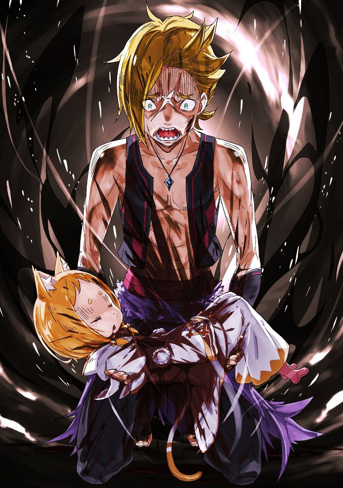

※ ※ ※ ※ ※ ※ ※ ※ ※ ※ ※ ※ ※

— «Погоди, давай успокоимся. Для начала разберёмся с имеющейся информацией. Хорошо?»

Услышав долгожданные новости от Фериса, Субару почувствовал, что его способность воспринимать новую информацию вот-вот достигнет предела.

Он поднял руку, предлагая сделать паузу. Ферис и Рикардо кивнули, соглашаясь с необходимостью упорядочить и обменяться всеми данными, включая недавнюю трансляцию.

— «Сменить бы место… но здесь столько раненых, что это будет сложно».

— «Ага. Большинству уже оказали первую помощь, так что внезапных ухудшений быть не должно, но всё же, знаешь ли…»

Приоритет отдали профессиональному мнению Фериса, и обсуждение началось там же, где они и были. Первое, на что обратил внимание Субару, — это сам полевой госпиталь.

Тусклое освещение, холодный каменный пол. По специфическому ощущению воздуха Субару понял, что они находятся под землёй — в месте, похожем на парковку универмага или что-то в этом роде.

— «Что это за место, типа убежища? Мы ведь всё ещё в Пристелле, да?»

— «Убежище, всё верно. Помнишь утреннюю трансляцию через магическое устройство? В Пристелле из-за её структуры всегда опасались наводнений при проблемах с водными каналами, поэтому по всему городу оборудованы убежища. Это одно из них, в Первом районе».

— «Оно как раз рядом с площадью, где вы, братаны, попадали. После той первой паршивой трансляции я нашёл вас с остальными уцелевшими беженцами и притащил сюда!» — подхватил слова Фериса Рикардо, громко ударяя себя в широкую грудь.

Ферис покосился на него — сколько ни проси, Рикардо никак не мог говорить тише.

— «Было полно раненых, но нам повезло, что Фери тут оказался. Этот пёсий дядька хоть и может таскать раненых, лечить-то он не умеет».

— «Ага! И мне не пришлось мучиться угрызениями совести! Га-ха-ха!» — Рикардо раскатисто рассмеялся, широко открыв пасть. Даже в такой ситуации он не изменял своим привычкам. Хотя находиться в месте, полном раненых, и вести себя так было сомнительно, вид одного человека, не погружённого в уныние, всё же приносил некоторое облегчение.

— «Так, а теперь о причине, по которой вы с Субару-кюном отключились…»

— «Ах, да. На площади появился Архиепископ Греха. Даже двое — Жадность и Гнев. Ногу мне распорол Жадность, он же и утащил Эмилию… Но вот раны на ногах у окружающих — это не его рук дело. Это сила Гнева».

— «Что ты имеешь в виду?»

— «Архиепископ Греха Гнева… Сложно объяснить, но у неё была сила заставлять других людей чувствовать ту же боль и те же ощущения, что испытал кто-то другой».

Субару тщательно подбирал слова, пытаясь как можно понятнее объяснить Полновласть Сириус. Рикардо склонил голову набок, не совсем понимая, но Ферис тут же осознал опасность и побледнел.

Он посмотрел на раненых, затем на перевязанную правую ногу Субару.

— «Понятно… Вот почему раны Субару-кюна и остальных так похожи. Я думал, это просто дурной вкус — наносить всем одинаковые раны… но, возможно, так было бы даже лучше».

— «…Ага».

Если бы дело было только в извращённом характере, можно было бы обойтись одним лишь физиологическим отвращением. Но в случае Сириус её Полновласть была столь же мерзкой, сколь и её характер.

Субару уже тошнило от необходимости сообщать ещё более неприятные новости.

— «И с Жадностью тоже не всё просто».

— «У-у-у, если честно, Фери уже не хочется слышать плохих новостей…»

— «Прости, но придётся. Этот ублюдок Жадность… не знаю, как это работает, но он обладает силой, которая сводит на нет любые атаки. Огонь, удары кнутом, кулаки — ноль урона. И, похоже, он может применять это не только к себе, но и к тем, к кому прикасается».

В объятиях Регулуса Эмилия была без сознания и беззащитна. Она наверняка попала под огненные атаки Сириус, но Регулус умудрился защитить не только себя, но и её. Это больше походило не на отчаянную защиту, а на то, что он просто сделал Эмилию неуязвимой с помощью своей непонятной способности.

Но если это так, то всё становится совсем плохо.

— «Одна передаёт раны другим, другой неуязвим… Ха-ха, руки опускаются».

— «Предыдущий Архиепископ Греха… Петельгейзе, мог использовать множество невидимых рук. Я думал, это уже предел, но по части гнусности нынешние явно превосходят его».

К тому же, Полновласть Петельгейзе, рассчитанная на внезапную атаку, на Субару не действовала.

Поскольку способности Петельгейзе как Архиепископа Греха на него не работали, Субару больше запомнил его не как Архиепископа, а просто как безумца.

Можно сказать, что по-настоящему он сражался с Архиепископом Греха впервые.

— «Раз уж они называют себя Архиепископами Греха… можно предположить, что Похоть из той трансляции не менее опасна».

— «Хуже некуда… Мало того, что есть вероятность наличия пятерых Архиепископов Греха…»

— «…Пятерых?» — переспросил Субару, кусая губы. Ферис озвучил предчувствие хуже, чем он мог себе представить.

Как он вообще пришёл к такому выводу?

Удивлённому Субару Ферис вздохнул и поднял палец.

— «Слушай внимательно. Вспомни ту трансляцию. В конце Похоть сказала это, верно? Что они захватили четыре контрольные башни водных каналов этого города».

— «А, да, говорила. Кажется, если они получат контроль над каналами, город уйдёт под воду… Поэтому это так опасно, верно?»

— «Конечно, есть вероятность, что их захватили обычные культисты Ведьмы… но в городе уже подтверждено присутствие троих Архиепископов Греха. Такого ещё никогда не было. Это лишь предположение, основанное на худшем из худших сценариев, но… контрольных башен четыре».

— «Четыре… значит…» — повторив число, Субару наконец понял, к чему клонит Ферис.

Башен, контролирующих шлюзы Пристеллы, было четыре — по одной на севере, юге, востоке и западе. И если они заявили, что захватили их…

— «Не может быть! Ты хочешь сказать, что в каждой башне по одному Архиепископу Греха… Четыре башни — четыре Архиепископа?! Н-но даже если так, всего получается четверо…»

— «Субару-кюн. Та трансляция. Магическое устройство для таких трансляций есть только в городской ратуше, в центре города. Враг захватил пять ключевых точек, контролирующих основные функции города».

— «…!» — от этой ещё более мрачной перспективы у Субару перехватило дыхание.

Ферис был прав. Трансляцию можно было провести, только захватив ратушу. И помимо Похоти, которая, вероятно, там и засела, подтверждено присутствие ещё двух Архиепископов.

Не было никаких оснований полагать, что это не полномасштабная атака всего Культа Ведьмы.

— «Кроме нас на площади… были ли ещё где-то беспорядки? Где-нибудь ещё есть пострадавшие?»

— «…»

Если предположить, что это массированная атака Культа Ведьмы, трудно поверить, что беспорядки произошли только на той площади. Молясь, чтобы его худшие опасения не оправдались, Субару намеренно избежал слова «жертвы». Ферис промолчал.

Он опустил голову, и сердце Субару заколотилось от нетерпения, но вместо него откашлялся Рикардо.

Зверочеловек с собачьей мордой оскалил клыкастую пасть, глядя на округлившего глаза Субару.

— «По правде говоря, мы и сами не знаем, какова наша ситуация. Что творится в других убежищах — для нас загадка. Но шастать снаружи — не лучшая идея».

— «Почему? Разве не стоит как-то связаться с другими? Ты ведь наверняка беспокоишься о своих товарищах… Точно!» — говоря это Рикардо, который скрестил руки на груди, Субару поспешно перевёл взгляд на Фериса.

Было странно, что в этом убежище, полном раненых, не видно других знакомых лиц, кроме Фериса и Рикардо. Особенно если здесь Ферис…

— «Где Круш и Вильгельм? Слишком уж необычно, что вас нет вместе. Они не в этом убежище?»

— «…Какие же неприятные вопросы ты задаёшь. Как видишь, из знакомых здесь только Фери и этот дядька, Субару-кюн. Что до остальных…»

— «…Не стоит так сильно расстраивать господина Субару, Ферис».

Тревожный ответ Фериса заставил внутренности Субару сжаться от напряжения. Но эту гнетущую тишину прервал мягкий, но исполненный внутренней силы голос.

Услышав внезапный голос, Субару вскинул голову и завертел ею, оглядываясь по сторонам. Но нигде не мог найти говорящего. И тут…

— «Прошу прощения. Кажется, я вас только напугала. Ферис, пожалуйста, сделайте так, чтобы господин Субару мог меня видеть».

— «Хорошо-хорошо. Ах, госпожа Круш, какая же вы вредная…»

— «А? Что?»

Перед изумлённым Субару Ферис разговаривал с невидимым собеседником. Затем он порылся за пазухой, и когда Субару увидел, что он достал, его глаза округлились ещё больше.

Тут до него дошла суть этого фокуса.

— «Эй, это же…»

— «Ага. Один из трофеев годичной давности. Хорошо, что я взял его с собой в этот раз, правда?» — сказал Ферис, держа в руке небольшое, помещающееся на ладони, зеркальце.

На первый взгляд оно казалось обычным, но в нём отражалась красавица с длинными зелёными волосами и добрым лицом — несомненно, Круш.

Этот магический артефакт, называемый Говорящим зеркалом, был чем-то вроде мобильного телефона из другого мира, позволявшим общаться с владельцем парного зеркала. Год назад оно сослужило добрую службу в противостоянии с Культом Ведьмы, и, похоже, его привезли и в этот город.

Перед потерявшим дар речи Субару Круш в зеркале слегка нахмурилась.

— «Ферис. Господин Субару ведь в замешательстве».

— «Простите-простите! Но я не думал, что следующий сеанс связи будет так скоро, поэтому объяснение отложил на потом. Говорящие зеркала ведь тоже не всемогущи».

— «П-погоди. Смысл я понял. Понял, что это благодаря Говорящему зеркалу. Эм, значит, вы с Круш связываетесь из другого убежища, я правильно понимаю?»

— «Верно».

Слушая разговор госпожи и слуги, Субару привёл в порядок свои мысли.

Он удивлялся, почему Ферис, для которого Круш была превыше всего, так спокоен. Оказалось, он уже убедился в её безопасности с помощью Говорящего зеркала.

То, что Круш в порядке, было уже хорошо. Субару встретился взглядом с Круш через зеркало, которое всё ещё держал Ферис.

— «Хорошо… хоть ситуацию и не назовёшь хорошей, возможность связаться в таких условиях — большая удача. Госпожа Круш, вы не ранены?»

— «Нет, спасибо за беспокойство. К счастью, мне удалось добраться до убежища без происшествий. А вот вы, господин Субару, как я слышала, были доставлены с тяжёлыми ранениями. Как ваше самочувствие?»

— «Не могу сказать, что всё в полном порядке. Но я что-нибудь придумаю. Не могу же я просто лежать, как только рана затянется, я начну действовать… Ферис, не смотри на меня так».

Суровый взгляд Фериса впился в Субару, который только что проигнорировал его предписание о строгом постельном режиме. Но, как бы ни было жаль Фериса, Субару говорил это не бездумно. Ситуация была настолько критической, что с кем угодно и когда угодно могло случиться что угодно.

Нельзя было допустить, чтобы он спокойно отлёживался, пока не произойдёт худшее.

— «Об этом мы поговорим позже… Госпожа Круш, как обстановка в вашем убежище? Кто там ещё, кроме вас?»

— «Да. Здесь находятся…»

— «Я здесь, Субару. К счастью, мне удалось вывести тех, кто оставался в гостинице», — вмешался из-за спины Круш голос, настолько изящный, что его можно было узнать даже через зеркало.

На мгновение Субару замер, услышав этот голос, но тут же помотал головой. Не хотелось быть настолько глупым, чтобы не понимать, какой поддержкой является его присутствие в данной ситуации.

— «Раз ты там, мне немного спокойнее, Юлиус».

— «Мы тоже волновались, услышав, что тебя принесли без сознания. Рад видеть, что ты достаточно оправился, чтобы я мог подумать, стоит ли с тобой препираться… Правда ли, что госпожу Эмилию похитили?»

— «…Правда. Прости. Это моя вина».

— «Их было двое Архиепископов Греха. Я не настолько неразумен, чтобы винить тебя в нехватке сил. Здесь, помимо меня и госпожи Круш, находятся госпожа Анастасия и несколько членов «Железного Клыка». Ах да, к нам присоединились двое вассалов госпожи Фельт».

Он коротко уточнил судьбу Эмилии и не стал развивать эту тему.

Забота Юлиуса по ту сторону зеркала была приятна, но в то же время она бередила чувство вины Субару.

Прислушиваясь к его дальнейшим словам, Субару мельком оглядел раненых в убежище. Заметив среди них знакомое лицо, он сказал:

— «Передай тем двоим спутникам Фельт, что у вас. Их третий товарищ укрыт здесь. Он ранен, но его жизни ничего не угрожает».

— «Понятно, это удача. Они хоть и храбрятся, но было видно, что беспокоятся. Я передам им. Итак, Субару…» — после того как Субару передал весточку о Рачинсе для Тона и Кана, Юлиус понизил голос. Атмосфера разговора изменилась. Субару замер в ожидании, и Юлиус тихо спросил:

— «Что будем делать?»

— «…Ну и ну, какой же расплывчатый вопрос».

— «Вспомни случай с Ленью. Когда дело касается Культа Ведьмы, я надеюсь, что ты можешь быть специалистом. Возможно, ты сможешь переломить ситуацию каким-то неожиданным для меня способом».

— «Что за нелепые ожидания. Извини, что разочаровываю, но я не специализируюсь на Культе Ведьмы».

— «Жаль, но дело касается и госпожи Эмилии. Несомненно, именно ты сейчас находишься в самом тяжёлом положении. Я хочу прямо спросить, что ты намерен делать».

Хотя ответ был не тот, на который он рассчитывал, Юлиус не выглядел расстроенным. Вероятно, он и сам понимал, что надежда на то, что Субару — убийца Культа Ведьмы, была сродни мечте.

Было очевидно, что настоящая тема разговора — та, что он приберёг напоследок.

— «…Эмилию унёс Жадность. У меня до сих пор мурашки по коже от его эгоистичных рассуждений. Я не могу оставить Эмилию с таким ублюдком ни на секунду дольше».

— «Значит, ты берёшь на себя задачу отбить госпожу Эмилию у Жадности?»

— «Естественно… Погоди, ты сказал «задачу»?»

Кивнувшему на эмоциях Субару Юлиус по ту сторону зеркала поправил чёлку. Затем рыцарь развернул ладонь так, чтобы Субару было видно, и показал пять пальцев.

— «Слушай внимательно, Субару. Если ты говорил с Ферисом, то должен понимать, что Культ Ведьмы захватил пять ключевых точек в Пристелле. Если предположить, что в каждой из них находится враг уровня Архиепископа Греха, распределение сил становится чрезвычайно важной проблемой».

— «…Потому что если они смогут управлять шлюзами хотя бы в одном месте, город утонет?»

— «Именно так. Чтобы мы смогли отбить атаку Культа Ведьмы, нам необходимо одновременно захватить все пять этих ключевых точек. Это вывод, сделанный после оценки всех сил, которые можно собрать из числа городских служащих, но… ты ведь понимаешь, что сейчас это сложно?»

Пока нет связи между разными убежищами, собрать все силы города для тотального штурма, о котором говорил Юлиус, было трудно. Обычно связь со всеми районами поддерживалась через магическое устройство в ратуше.

Но на этот раз и ратуша оказалась в руках врага, так что убежища были практически изолированы друг от друга. Каждому убежищу придётся оценивать ситуацию и действовать самостоятельно.

— «Кстати, по словам дядьки, город кишит культистами Ведьмы. И ещё, похоже, есть обезумевшие люди, превратившиеся в буйную толпу», — добавил Ферис неприятную деталь.

— «…Культисты Ведьмы и эта идиотка Сириус. Чёрт, всё становится только хуже!» — Субару взъерошил волосы, стискивая зубы от ухудшающейся ситуации. Если бы только был способ связаться со всеми имеющимися силами…

— «Из наших пропали Гарфиэль и Отто. Эмилию тоже можно считать пропавшей, раз её утащил Жадность. Полный разгром…»

— «С моей стороны пропали Джошуа, трое вице-капитанов «Железного Клыка». Господин Вильгельм, госпожа Фельт и Райнхард тоже неизвестно где. Госпожа Присцилла и её люди…»

— «Насчёт её спутника Ала и этого грёбаного старика не знаю, но сама Присцилла сразу после начала беспорядков должна была быть в городском парке Первого района. Куда она эвакуировалась оттуда… Ах, чёрт. Лилиана тоже должна была быть с ней. Надеюсь, с ними всё в порядке».

Хоть Присцилла и была неприятной особой, а Лилиана — той ещё девчонкой, Субару всё же надеялся, что они не пострадали.

Учитывая, что одна называет себя воплощением удачи, а другая — певица с таким характером, он полагал, что они в безопасности.

Патраш тоже должна была остаться привязанной у гостиницы «Водное Перо». Она умная девочка, так что, скорее всего, не стала буйствовать и привлекать лишнее внимание, но поводов для беспокойства хватало.

Собрав воедино все эти тревожные факторы, одновременная атака на пять точек казалась всё более нереальной.

Слишком уж безрассудно. С имеющимися силами было бы трудно отправить даже по одному сильному бойцу в каждую точку. Тем более что противниками были Архиепископы Греха — надеяться справиться с ними один на один было не более чем принятием желаемого за действительное.

— «…Погоди. А почему вообще нужно атаковать все пять точек одновременно?»

— «О чём ты говоришь? Я же сказал. Контрольные башни… достаточно захватить одну, чтобы нанести городу колоссальный ущерб. Если мы упустим хотя бы одну из четырёх…»

— «Не то. То есть, ты прав, но не совсем. Я понимаю, что нужно вернуть все четыре. Но почему одновременно? В чём необходимость?»

— «Если они заметят неладное в одном месте, то естественно, что три остальных начнут действовать. Именно поэтому они и предприняли такую масштабную атаку на город».

Юлиус методично опровергал сомнения Субару.

Слушая его, Субару сомневался, действительно ли это так. Разумеется, логика Юлиуса была безупречна, он это прекрасно понимал. Но противники были не из тех, с кем работает логика.

Ведь Сириус и Регулус на той площади всерьёз пытались убить друг друга.

Ущерб не был большим лишь потому, что Регулус не сражался в полную силу, но Сириус определённо намеревалась сжечь его заживо. Да и Регулус, если бы Субару не вмешался, скорее всего, разорвал бы Сириус на куски.

Неужели такие люди действительно координируют свои действия, чтобы захватить город?

— «…Может, они на самом деле не координируют свои действия? Конечно, они угрожают использовать контрольные башни для управления шлюзами, но я сомневаюсь, что они постоянно связываются друг с другом. Я так думаю».

— «У тебя есть основания так полагать?»

— «На площади двое Архиепископов Греха пытались убить друг друга. Они прервались, потому что, похоже, получили новые указания из Евангелия, но если бы не это, одним из них стало бы меньше».

— «Трудно представить, что такие люди координируют свои действия… хм».

Ответ Юлиуса на слова Субару был несколько уклончивым. Вероятно, он не мог полностью отбросить мысль, что это лишь принятие желаемого за действительное. Субару это понимал. Но…

— «Вы вели какое-то наблюдение снаружи?»

— «Мы выставили наблюдателей из «Железного Клыка», чтобы следить за контрольными башнями с видимых позиций… У тебя есть какая-то идея?»

— «Это лишь предположение, но если бы они пытались регулярно связываться, самый простой способ — это запустить магию в небо, верно? Башни далеко друг от друга, а город запутанный, перемещаться по нему — та ещё морока. Если бы они пытались общаться устно, то без Говорящих зеркал это заняло бы уйму времени».

— «Вероятность того, что у Культа Ведьмы есть Говорящие зеркала, крайне мала. Если бы их было много, духи отреагировали бы на помехи от зеркал. Ни один из моих квази-духов не уловил таких признаков. Понятно, так вот в чём дело».

Отвечая, Юлиус, похоже, пришёл к тому же выводу, что и Субару.

Субару, предварив свои слова кивком, сказал:

— «Если они не поддерживают регулярную и очевидную связь, то высока вероятность, что даже если одну из точек атакуют, остальные не предпримут действий, пока не произойдёт что-то явно заметное. Они просто не смогут узнать об этом. В таком случае необходимость разделять силы уменьшается».

— «…Однако у этого плана есть одна проблема. Есть одно место, которое, в отличие от остальных, имеет способ сообщить об атаке».

— «Городская ратуша. Только из этого здания с магическим устройством для трансляций можно голосом оповестить другие контрольные башни об атаке. Поэтому её нужно захватить первой и как можно быстрее».

Первой целью, на которую нужно было сосредоточить силы, была центральная ратуша. Если удастся выбить оттуда Культ Ведьмы имеющимися силами, то потом можно будет разбираться с контрольными башнями по одной.

Это всё равно будет гонка на время, но риск должен быть меньше, чем при одновременной атаке на пять точек. Хотелось в это верить.

— «…»

Было слышно, как Юлиус по ту сторону магического артефакта погрузился в молчаливые раздумья.

Предложение Субару также основывалось на принятии желаемого за действительное — на том, что «координация Культа Ведьмы никуда не годится», судя по ссоре Регулуса и Сириус.

Если бы в Евангелии было написано что-то вроде «дружно устроить всем резню», и они бы подчинились, то вся эта идея рухнула бы.

Эх, если бы он тогда смог выведать хотя бы содержание Евангелия…

— «Прошу прощения за задержку. Теперь меня слышно?»

В самый разгар тяжёлого молчания в разговор вмешался ещё один голос.

Этот низкий, обветренный временем голос показался Субару надёжнее всего на свете в данной ситуации, и он вскинул голову.

В Говорящем зеркале отчётливо отражалось лицо седовласого старого мечника.

— «Господин Вильгельм! Вы целы!»

— «Дед Вилли! Слава богу! Мы так волновались, что не могли с вами связаться!»

Не только Субару, но и Ферис оживился при виде этого человека. Удивлённый таким приёмом, джентльмен в зеркале, Вильгельм, широко раскрыл глаза, а затем слегка поклонился.

— «Прошу прощения. У нас тоже было много дел, никак не могли успокоиться. Только что вместе с горожанами укрылись в ближайшем убежище. Господин Субару, Ферис, я рад, что вы в безопасности. Госпожа Круш?»

— «Я тоже в порядке. Вильгельм, я рада, что вы целы».

— «Не заслуживаю таких слов… Нет, я глубоко сожалею, что не смог быть рядом с вами в такой ситуации. Прошу вас, подождите там ещё немного в безопасности. Я обязательно приду за вами».

— «Ого, какое чувство уверенности…» — вздохнул Субару, поражённый тем, какое всепоглощающее спокойствие исходило от разговора Круш и Вильгельма через зеркало.

Он радовался тому, что Вильгельм жив, и уже собирался ввести его в курс дела, повторив предыдущий разговор.

Но…

— «Есть много о чём поговорить, но начнём с самого срочного».

Едва обменявшись приветствиями, Вильгельм тут же исчез из зеркала. Вместо старого мечника там появился зверочеловек-котик с моноклем.

Это был Тиви, вице-капитан «Железного Клыка». Похоже, он тоже встретился с Вильгельмом. Однако выражение его лица было необычайно суровым.

— «О, Тиви! Рад, что ты цел!»

— «Капитан, я тоже рад, что вы в порядке… Но и мы не совсем в порядке. Сестрёнки с вами нет?»

— «Мими? Не видел. Что-то случилось?» — голос Тиви был лишён обычной бодрости, и Рикардо, почувствовав неладное, сузил глаза. Из-за спины Тиви в зеркало вклинился кто-то ещё.

— «К-капитан! Сестрёнка! Сестрёнка…!»

— «Х-Хетаро? Что случилось, почему ты так расстроен?!»

Со слезами на глазах в кадр влетел Хетаро, брат-близнец Тиви. У мальчика и так было обычно робкое выражение лица, но сейчас оно было искажено особенной мукой.

С круглыми глазами, полными слёз, дрожащим голосом мальчик вцепился в Говорящее зеркало.

— «Эффект от «Тройного Благословения»… он идёт от сестрёнки! И-и это ужасные раны… Если передавшиеся раны такие, то сестрёнка…»

— «Братик, успокойся… Капитан, вы всё слышали. Сестрёнка где-то ранена, и эффект передаётся мне и братику. Поэтому…»

— «Хорошо, я понял. Понял, вы оба. Ждите. Я сейчас же найду Мими. Не плачьте, просто ждите».

Невероятно тихим голосом Рикардо обратился к братьям по ту сторону зеркала.

От этого спокойного тона Субару ощутил невиданное доселе давление со стороны Рикардо, и его спина покрылась мурашками.

В глазах зверочеловека с собачьей мордой горел гнев, а из-под приоткрытых губ виднелись острые клыки. Его огромное тело напряглось, мышцы вздулись, и он сжал в руке гигантский тесак.

Казалось, он вот-вот бросится в город на поиски пропавшей девочки.

— «Постой-ка, Рикардо. Таких своевольных поступков я не позволю».

Однако бегущего Рикардо остановил голос, также донёсшийся из зеркала.

Рикардо обернулся. В зеркале, получив приоритет, чётко отражалась Анастасия.

Рикардо сморщил нос и ткнул тесаком в сторону своей нанимательницы.

— «Не останавливай меня, госпожа. Бывают моменты, когда мне не до шуток».

— «Если это звучит для тебя как шутка, значит, наша долгая дружба не создала таких уж крепких уз, Рикардо. Не заставляй меня повторять. Сейчас своевольничать нельзя. Даже ради Мими».

— «Ты говоришь мне бросить Мими, соплячка?!»

Воздух в убежище задрожал от яростного рёва Рикардо, широко разинувшего пасть.

Субару, ощутив настоящую ударную волну, невольно отшатнулся. Рикардо, источая всем телом свирепую ауру разъярённого хищника, впился взглядом в Анастасию.

Но Анастасия, даже через зеркало, выдержала этот взгляд в упор.

— «Ты должен понимать, Рикардо. Ситуация непредсказуема. А ты — мой верный клинок и одна из ключевых боевых единиц. Я не могу позволить тебе бродить где вздумается».

— «Легко тебе говорить. Кому ты дерзишь, Ана-девчонка…!»

— «Естественно. Забыл, собачий монстр?»

Перебрасываясь прозвищами, понятными только давним знакомым, они нагнетали атмосферу до предела. Чувствуя кожей это напряжение, Субару всерьёз задумался, чью сторону принять. Хотя, тут и думать нечего.

Сердцем он был на стороне Рикардо, но правота Анастасии была очевидна как день.

И самое главное — не кто-то посторонний, а сама Анастасия, будучи непосредственно заинтересованным лицом, ставила возвращение города выше спасения Мими.

Субару тут нечего было добавить. Даже Рикардо должен был это понимать.

— «…»

Противостояние взглядов продолжалось.

Если бы Рикардо решил рвануть прочь, раненый Субару и небоевой Ферис не смогли бы его остановить. Его удерживал лишь взгляд Анастасии, пересекающийся с его собственным через магический артефакт.

Но внезапно Рикардо отвёл взгляд от зеркала и обернулся.

— «Стой, Рикардо!»

— «Нет. Не горячись».

Анастасия вскрикнула, заметив движение Рикардо, но его ответ на её отчаянный голос был спокоен.

Он обернулся и, принюхиваясь, посмотрел в сторону входа в убежище.

— «Кто-то приближается. Что это… Запах крови?»

— «Запах крови?..»

Даже среди такого количества раненых он, похоже, учуял свежий запах крови.

С явной настороженностью Рикардо вскинул тесак и уставился на вход. Субару и Ферис, затаив дыхание, следили за его реакцией.

— «…!»

С гулким стуком шагов в подземное убежище вбежала тень.

На мгновение все раненые в убежище замерли при виде незваного гостя, но первым тишину нарушил не кто иной, как Субару.

Потому что там стоял знакомый невысокий блондин.

— «Гарфиэль?!»

Гарфиэль, весь в поту и тяжело дыша, услышал крик Субару и заметил его. Он нетвёрдой походкой подбежал к нему. И тут Субару запоздало понял…

Причину, по которой Гарфиэль шатался. То, что было у него на руках.

— «…»

Все потеряли дар речи. Гарфиэль добрался до Субару и рухнул на колени, умоляюще склонив голову.

— «Прости, босс…! Я… бесполезный! Никчёмный…!» — прокричал он в отчаянии.

В его окровавленных руках безжизненно лежала Мими, находящаяся при смерти.

※ ※ ※ ※ ※ ※ ※ ※ ※ ※ ※ ※ ※
