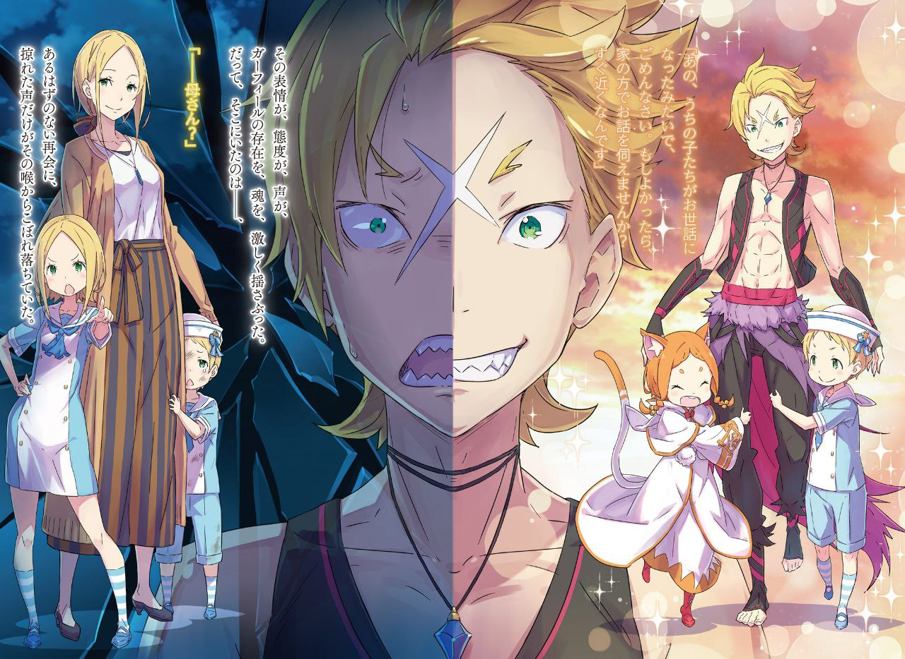

※ ※ ※ ※ ※ ※ ※ ※ ※ ※ ※ ※ ※

— События происходят более чем за полдня до того, как Гарфиэль ворвался в убежище.

— «И вот? Хетаро там упал и чуть не заплакал, понимаешь? Ну, Мими ничего не оставалось, как взять его за руку. А потом и Тиви сделал такое грустное лицо, так что пришлось, ну знаешь, взять их обоих за руки!»

— «…А-а, вот как.»

— «Ага, вот так. И потом, потом! Когда мы так вернулись, госпожа выглядела та-а-ак счастливой!»

Не обращая внимания на его равнодушные ответы, невысокая девушка, идущая рядом, весело смеялась.

Оранжевый мех, круглые глаза. Девушка, ведущая себя как само воплощение невинности и наивности, по какой-то причине привязалась к нему, члену вражеского лагеря — зверолюдке по имени Мими.

С самого прибытия в город Пристеллу. Нет, если подумать, ему казалось, что она странно привязалась к нему с тех пор, как Мими посетила особняк Розвааля в качестве посланницы по этому делу.

Сначала он подозревал, что это из-за осторожности по отношению к нему, главной боевой силе лагеря Эмилии, но поведение и слова девушки до сих пор почти развеяли это подозрение. Теперь он просто думал, что по какой-то причине он ей понравился.

Не имея ни малейшего понятия об этой «какой-то причине», Гарфиэль мог лишь недоуменно склонить голову.

— В настоящее время Гарфиэль и Мими вдвоем прогуливались бок о бок по Пристелле перед наступлением вечера.

Впрочем, никто из них не приглашал другого пойти вместе; Мими просто сама увязалась за Гарфиэлем, когда тот бесцельно вышел из гостиницы.

Гарфиэль предпочел бы побыть один, но не решался озвучить причину, и, поддавшись напору Мими, которая, казалось, была поразительно неспособна улавливать подобные тонкости, он был вынужден бродить по городу, ведя вот такой бессодержательный разговор.

— «Гарф, у тебя лицо странное. Что-то случилось? Что-то смешное?»

— «Было б смешно, у меня б рожа повеселее была, а? Говорить не хочу. Да и с какой стати я должен тебе рассказывать, а?»

— «Если будешь говорить такие сложные штуки, как „долг“ и „обязанности“, станешь как Джошуа, знаешь? Мими думает, лучше просто веселиться попроще! Гарф, ты круче выглядишь, когда смеешься как дурак!»

— «Чего ты сказала, „как дурак“?! Эй!»

На слишком уж резкие слова Мими Гарфиэль рыкнул, оскалив клыки, и девушка с визгом «Кья-а!» бросилась бежать. Отбежав немного вперед, она остановилась и стала ждать с улыбкой, словно забыв о только что произошедшем. Глядя на нее, Гарфиэль странным образом почувствовал, что его собственная мелочность сейчас кажется глупой.

Всего лишь около часа назад Гарфиэль, назвав это разминкой перед ужином, вызвал Святого Меча Райнхарда на спарринг.

Сильнейший в королевстве — или, возможно, даже провозглашенный сильнейшим из ныне живущих в мире, нынешний Святой Меча.

Еще до личной встречи Гарфиэль слышал о его способностях от Субару.

Райнхард, которого Субару называл другом, благодетелем, а также тем, с кем он расстался при несколько сложных обстоятельствах. Неожиданно встретить его здесь было удачей.

Похоже, Субару тоже сумел избавиться от неловкости, которую он чувствовал, благодаря их долгожданному разговору. А раз это беспокойство исчезло, Гарфиэлю тоже не было нужды сдерживаться.

Для Гарфиэля слово «сильнейший» имело особое, чистое значение.

Быть сильнейшим. Стремиться быть сильнейшим. Стать сильнейшим.

Гарфиэль твердо верил, что раз уж он родился мужчиной, это — высочайшая цель с самого момента его первого крика.

Стремление и мечта стать «сильнейшим», которую каждый хотя бы раз лелеет на долгом жизненном пути, но в конце концов забывает. Однако Гарфиэль никогда не забывал об этом.

Он постоянно представлял это и продолжал к этому стремиться. Для Гарфиэля титул «сильнейшего» был вершиной, к которой естественно стремиться, родившись мужчиной, а также необходимым условием для защиты всего, что он хотел защитить.

Поэтому, столкнувшись с человеком, прославленным как эта вершина, Гарфиэль не мог сдержать зудящие клыки и когти.

Субару замолвил за него словечко, и он получил согласие Райнхарда на спарринг.

Святой Меча был мужчиной с мягкими чертами, производившим настолько кроткое впечатление, что трудно было поверить, будто он стоит на вершине боевых искусств. Он казался настолько далеким от слова «сильнейший», что можно было подумать, будто его можно сломать пополам одной рукой.

Однако Гарфиэль знал: чем сильнее кто-то, тем лучше он умеет скрывать свою силу. Оставив в стороне себя, постоянно излучавшего напряженную ауру, сильные люди, которых знал Гарфиэль, обычно такими не казались. Розвааль, к примеру, да и Субару тоже.

И он решил, что Райнхард относится к той же категории.

— Решено было провести спарринг во внутреннем дворе гостиницы, усыпанном гравием.

Обеспокоенный возможным ущербом для окружающих, Гарфиэль предложил выйти за пределы города, но Райнхард отверг это предложение и настоял на поединке внутри гостиницы. Более того, он добавил условие: «Не портить сад».

Это было не что иное, как унижение. Пусть этот человек и был на вершине боевых искусств, но это было слишком уж явным пренебрежением. Он немедленно заставит его пожалеть о том, что недооценил его, и вытащит наружу.

Стоя друг против друга во дворе, до сигнала Субару к началу спарринга, Гарфиэль скалил клыки, сосредоточившись лишь на том, чтобы своими мощными руками врезать рыжему герою по лицу.

— — — —

Эти мысли исчезли в тот же миг, как прозвучал сигнал.

Фигура мужчины перед ним изменилась за мгновение, короче взмаха ресниц.

Мягкая аура человека, который должен был стоять там, исчезла без следа, а на его месте было пламя или, возможно, одинокий, отточенный клинок.

Настолько естественно, что обычный человек даже не заметил бы присутствия этого клинка.

Ошеломляющее давление, достаточно сильное, чтобы тот, кто хоть немного знаком с боевыми искусствами, рухнул бы в отчаянии от безнадежной разницы в силе.

Однако Гарфиэль не был ни тем, ни другим.

Гарфиэль, по крайней мере, обладал достаточным мастерством, чтобы быть достойным спарринга со Святым Меча.

Заметив эту естественность и содрогнувшись, чувствуя, как мужество покидает его перед этим давлением, Гарфиэль ревом подавил свое колебание и прыгнул на Райнхарда.

Спарринг с условием не наносить друг другу серьезных травм — забыв об этом уговоре, он нанес упреждающий удар, пытаясь вонзить острые когти в горло противника.

В тот момент, когда удар с треском прошел мимо цели и его тело потеряло равновесие, Гарфиэль осознал разницу в силе.

— «Я проиграл.»

После этого он атаковал под самыми разными углами, но Райнхард мягко уклонялся от каждой атаки, парируя и отражая их.

Более того, Райнхард сделал все это, не сдвинувшись ни на шаг с того места, где начался спарринг.

Другими словами, Гарфиэль вложил всю свою силу в бой против верхней части тела Райнхарда и проиграл.

Потеряв равновесие после широкого замаха, в тот момент, когда кулак оказался прямо перед его лицом, Гарфиэль объявил о своем поражении.

Он потерпел полное поражение от Святого Меча в поединке только на кулаках, его сильной стороне, даже не заставив того обнажить меч.

Он почти не помнил, что сказал потом Райнхард или что сказал ему Субару.

Ему лишь удалось избежать позора в виде оправданий проигравшего или прощальных колкостей, как-то сумев покинуть гостиницу, бросив лишь слово.

Он не мог ясно определить эмоции, бурлящие внутри него.

Подавленный чувствами, на которые он не мог найти ответа, Гарфиэль должен был в одиночку искать ответы в городе водных врат с приближающимися сумерками — но…

— «Гарф! Гарф! Смотри! Смотри! Видишь, закат безумно отражается в воде, она супер-красная! Это потрясно! Потрясно! Красиво!»

Восторженно бегая вокруг Гарфиэля, дергая его за рукав, за волосы, наваливаясь на плечо, догнавшая его Мими не знала ни стеснения, ни пощады.

Благодаря ей, хотя он специально вышел из гостиницы, у него даже не было времени погрустить в одиночестве.

— «Ты чертовски достала уже, эй. Не можешь помолчать немного?»

— «М-м, не-а!»

— «Мгновенный ответ?!»

Мими схватила Гарфиэля за руку и попыталась закружить его, бегая вокруг. Увлеченный ее неожиданно сильной хваткой, Гарфиэль закружился на месте.

Мысль о том, чтобы серьезно отряхнуться от нее и убежать так быстро, чтобы Мими не догнала, промелькнула у него в голове, но поскольку Мими была зверолюдом, пределы ее физических способностей были неизвестны. Она вполне могла легко догнать убегающего Гарфиэля.

Слишком выделяться в городе тоже было проблемой.

Перед отъездом в Пристеллу и Фредерика, и Рам довольно строго его предупредили. Он не мог доставить неприятности Эмилии или Субару из-за своего эксцентричного поведения. Единственный, кому он мог доставить неприятности, был Отто. Потому что этот старший братец хорошо умел разгребать беспорядки.

— «…Ха-а.»

— «Ой-ой-ой. Хм? Что такое, Гарф? Беспоко… Мяу-покой… Бе-бе-спокойства?»

— «Ты пытаешься сказать „беспокойства“?»

— «Ага, Бебоспокойства! Что-то есть? Скажи, скажи!»

В конце концов, так и не сумев выговорить слово, Мими призвала его признаться, выбрасывая кулачки вперед со звуком «Шух-шух». Глядя на ее маленькое, но надежное тело, Гарфиэль почувствовал, как яд уходит из него, и слегка клацнул клыками.

Он перевел взгляд на водный канал и прищурился.

— «А-а… И правда… Офигенный вид, а?»

— «Правда, правда? Это потрясно! Потрясно!»

Он слушал слова Мими вполуха, но теперь, взглянув, увидел, что вид заката, отражающегося в канале, был поразительно красив. Красный свет от поверхности воды, несущий желтые и белые отблески, в сочетании с закатом сверху, окрашивающим мир в оранжевый цвет, неотразимо тронул его сердце.

Не успел он опомниться, как уже сидел на краю канала, праздно проводя время, наблюдая за прохожими и лодочками на воде.

— «Хм-хм-хм-м», — Мими, усевшись рядом с Гарфиэлем и болтая ногами, довольно напевала себе под нос. Похоже, полная тишина была не в ее характере, но все же, ограничиваясь лишь мурлыканьем, она вела себя тихо. Она схватилась за плечо Гарфиэля в рубашке с коротким рукавом и покачивала головой из стороны в сторону.

Взглянув украдкой на ее веселый профиль, он с опозданием заметил, что мех Мими был оранжевым, точь-в-точь как закат. Он невольно протянул руку и погладил ее по голове, и Мими радостно прижалась к нему.

— «Пушистая? Пушистая? Знаешь, госпожа тоже часто приходит потрогать Мими. Говорила, что пушистая и типа „исцеляющая“».

— «А-а, да, на ощупь и правда приятно. Эта „исцеляющая“ штука, босс тоже иногда так говорит, наверно, вот что он имеет в виду. Вроде понимаю».

— «Гарф, тебя лапают?»

— «Это уже совсем другой смысл получается, а!»

— «А?»

Мими невинно склонила голову набок, и Гарфиэль невольно рассмеялся.

От этого тяжесть на душе словно спала, и он подумал, какой же он простой парень. Чувства поражения и унижения, казалось, преобразились в чистый дух бунтарства.

— «…Нельзя стать сильнейшим в одночасье. Моя офигенная персона все еще карабкается наверх».

— «О-о, по этому длинному-длинному склону к тому, чтобы стать сильнейшим!»

— «Хех, а ты соображаешь, да? Точно, это и есть путь сильнейшего».

В ответ Мими, вскинувшей кулак, Гарфиэль провел пальцем по белому шраму на лбу.

Досадно признавать, но его подбодрили. Если бы он был один, то, возможно, так и продолжал бы бесконечно терзаться. Наверное, стоило сказать, что хорошо, что Мими увязалась за ним.

— «Надо б тебя отблагодарить. Эй, мелочь. Заглянем к ларькам? Я угощаю…»

— «Гарф, смотри!»

— «А?»

Он как раз хлопнул себя по заду, встал и собрался позвать Мими перекусить уличной еды.

Мими, все еще сидевшая, указала на другой берег канала, и Гарфиэль, привлеченный ее голосом, тоже посмотрел туда. И его глаза сузились.

На противоположном берегу канала у одной из пришвартованных лодок развязалась веревка, и пустая лодка начала двигаться по течению. Однако проблема была не в этом.

— «Детвора!»

Мими громко кричала туда, куда неслась лодка — там около пятерых детей играли в одной из пришвартованных лодок.

Дети не заметили приближающуюся лодку. Если бы лодка, несомая течением, столкнулась с ними, была вероятность, что они перевернутся и упадут в воду.

Услышав голос Мими, другие люди вокруг канала тоже заметили происходящее. Один из лодочников у причала в панике бросился бежать, но заметил слишком поздно и не успевал.

Услышав голоса окружающих, дети наконец заметили опасность, их лица побледнели, и они начали паниковать, увидев несущуюся на них лодку.

И тут —

— «Эй, мелюзга! Скажите спасибо той мелкой кошачьей сестренке, что первой заметила.»

— «Гарф!»

С поразительным чувством равновесия он одним прыжком перелетел на лодку на противоположном берегу, приземлившись на нее почти не качнув. Детям, должно быть, показалось, что Гарфиэль, приземлившийся почти бесшумно, появился из ниоткуда.

Блондин с хищным взглядом, злобно ухмыляющийся, обнажив клыки. При его появлении дети безмолвно застыли, и, воспользовавшись тем, что никто не сопротивлялся, Гарфиэль схватил всех пятерых детей разом и снова прыгнул.

Спрыгнув с лодки, он приземлился на пешеходную дорожку вдоль канала. Сразу после того, как он отпустил детей, лодки позади него столкнулись, и та, в которой были дети, перевернулась.

Как раз когда несколько других лодок чуть не оказались втянуты в цепную реакцию столкновений, Гарфиэль умело манипулировал веревкой, связывающей лодку, которую он схватил вместе с детьми, остановив их.

Используя движение перевернувшейся лодки, чтобы затормозить остальные, он также остановил первую лодку, которая оторвалась, не дав ей уплыть вниз по течению, и таким образом свел весь инцидент к минимальному ущербу.

— «Ну вот, как-то так!»

Снова крепко привязав веревку, Гарфиэль этими словами завершил суматоху, и люди, ставшие свидетелями этой сцены, разразились приветственными криками и аплодисментами.

Лодочник, который должен был следить за лодками, низко кланялся в знак благодарности, а Гарфиэль помахал ему рукой, смущенно почесывая голову.

И тут…

— «Д-Дяденька. Спасибо вам большое.»

— «А?»

Спасенные дети хором поблагодарили Гарфиэля.

Обернувшись, Гарфиэль увидел, что дети смотрели на него не с испуганными лицами, как в лодке, а просто сияющими глазами.

При виде Гарфиэля и детей аплодисменты стали громче.

Чувствуя какое-то удовлетворение от этих звуков, Гарфиэль слегка потер нос пальцем.

— «Да ладно, не парьтесь. Просто совпадение… ага, совпадение. Совпадение, закат и влажный ветер подсказали моей офигенной персоне. В этом городе водных врат, вечно окруженном водой… если чьи-то слезы потекут, каналы наконец выйдут из берегов, понимаете?»

— — — —

Когда Гарфиэль гордо ответил, аплодисменты внезапно стали редкими.

Приветственные крики тоже стали прерывистыми, и послышались какие-то сдавленные голоса. Однако, в отличие от окружающих, реакция детей перед ним была бурной.

— «К-круто!» «Офигенно!» «Ради слез он пренебрегает опасностью!» «Не отступает! Не заискивает! Пренебрегает!»

Гарфиэль удовлетворенно кивнул возбужденным детям.

Затем, когда Гарфиэль рассмеялся, щелкая клыками, один из детей спросил:

— «Дяденька, а как вас зовут?»

— «Не стоит и называть. Но если уж на то пошло… Моя офигенная персона — тигр. Ага, золотой тигр. Люди зовут меня Великолепный Тигр!!»

— «Великолепный!» «Тигр!!»

Гарфиэль принял позу, вытянув обе руки по диагонали к небу и наклонив тело.

При виде его у детей заблестели глаза, голоса сорвались от волнения, и они приняли ту же позу.

И тут к Гарфиэлю, нашедшему общий язык с детьми, подбежала Мими, обежавшая вокруг по каналу, ее глаза тоже сияли.

— «— Гарф, ты такой крутой!!» — крикнула она, подбегая, присоединилась к ним и тоже приняла позу.

Громкий смех Гарфиэля, Мими и детей эхом разнесся над водным каналом в сумерках.

— Аплодисменты и приветственные крики уже стихли, и только лодочник с вымученной улыбкой одиноко наблюдал за ними, выглядя несколько потерянно.

※ ※ ※ ※ ※ ※ ※ ※ ※ ※ ※

Найдя общий язык с детьми и угостив их уличной едой, Гарфиэль гордо шел, рассекая воздух плечами.

— «И тогда моя офигенная персона сказала: „Дальше отсюда вы и шагу не сделаете, сопляки. Это брюхо босса. Вы давно уже угодили в ловушку!“»

— «Круто! Офигенно!»

— «Ух ты! Захватывает!»

В Пристелле, полностью окрашенной в цвета заката, Мими и светловолосый мальчик подбадривали Гарфиэля, рассказывающего о своих подвигах.

Кстати, только что он рассказывал об одном из самых запоминающихся событий прошедшего года, эпизоде из «Охоты на Земляных Пауков».

Инцидент, когда троица мужчин — Субару, Гарфиэль и Отто — почему-то была вынуждена истреблять массовое нашествие магических зверей под названием «Земляные Пауки» в одной деревне; это был также удачный случай, когда коварные планы Субару и Отто и боевая мощь Гарфиэля проявились в полной мере.

С восторгом слушали эти воспоминания Мими и один из спасенных ранее детей. Мальчик с золотистыми волосами, лет шести или семи на вид.

С обаятельными чертами лица и располагающей улыбкой. Казалось, у него были задатки стать в будущем настоящим сердцеедом. Но пока что он был просто мальчиком, чьи глаза сияли от рассказов Гарфиэля о подвигах и его образе жизни, и который, казалось, вот-вот свернет на неверный жизненный путь.

Закончив угощать детей, Гарфиэль, чувствуя ответственность за их безопасность, провожал каждого ребенка домой. Четверо из пяти уже благополучно вернулись, так что этот мальчик был последним.

— «И все же, для одних детей, вы забрели чертовски далеко поиграть, а? Разве это не опасно?»

Гарфиэль нахмурился, заметив, что они прошли немалое расстояние по пути к дому мальчика.

Дети играли почти на границе между первым районом, где находилась гостиница, и вторым районом, где располагалась Торговая Компания Мьюз. Он и сам, задумавшись, бесцельно дошел дотуда, но не мог не подумать, что для маленьких детей это слишком далеко.

Ведь их дома, как говорили, находились еще дальше, в третьем районе города.

Детскими ногами, чтобы добраться прямо до места назначения, потребовался бы, вероятно, почти час.

На слова Гарфиэля мальчик улыбнулся, показав зубы.

— «Иногда в тот парк в первом районе приходит Певица. Мы ходили посмотреть на нее».

— «Певица… ты про ту, что ли? Босс и правда говорил, что голос у нее потрясный, но моя офигенная персона все еще немного сомневается».

На невинный ответ ребенка Гарфиэль потер нос, не в силах вполне согласиться.

Гарфиэль видел Певицу Лилиану лишь очень короткое время в Торговой Компании Мьюз. Тем не менее, не было сомнений, что она была девушкой с сильной, своеобразной личностью, достаточной, чтобы произвести значительное впечатление даже за это короткое время. Однако эта своеобразность казалась совершенно несовместимой с чистым образом Певицы.

— «Гарф, ты не слышал песню Певицы? Она была, ну, типа, потрясная!»

— «А ты что, правда слушала внимательно, мелочь?»

— «М-м! Не уснула до самого конца! Мими — молодец! Похвали!»

Гарфиэль небрежно погладил Мими по голове, которую она подставила. Когда Мими воскликнула «Ура!» и радостно убежала, он снова перевел взгляд на мальчика.

— «Так что, удалось встретить ту Певицу?»

— «Не-а, не вышло. Мы немного опоздали. Но раз уж мы пришли так далеко, в первый район…»

— «То вы решили поиграть у реки, и вот что случилось. Ну, хорошо, что моя офигенная персона вовремя подоспела.»

— «Великолепный Тигр!»

— «Ага!»

Когда мальчик протянул руку к небу, Гарфиэль протянул свою руку так же.

Великолепный Тигр здесь.

Однако сразу после того, как они энергично приняли позы, мальчик опустил руку и меланхолично вздохнул. Гарфиэль склонил голову, глядя на его профиль.

— «Чего это ты вдруг? Перестань вздыхать. Счастье улетучится.»

— «Ну, это… Когда я вернусь домой, старшая сестра на меня рассердится.»

— «А?»

Гарфиэль слишком бурно отреагировал на робкую позу мальчика, показывающую страх перед сестрой. Увидев, что мальчик дрожит, он поспешно успокоил его: «Виноват, виноват».

— «Но эй, почему вдруг речь зашла о том, что тебя будут ругать?»

— «…Потому что я ушел тайком.»

— «А-а.»

Похоже, мальчик отправился на сегодняшнюю прогулку с друзьями, не сказав сестре. В результате он, видимо, до смерти боялся грозы, которая обрушится на него от семьи, наверняка уже беспокоящейся.

Гарфиэль мог понять это чувство. Старшая сестра для младшего брата навсегда остается непреодолимой стеной, сколько бы времени ни прошло.

Это было правдой даже после воссоединения через десять лет, когда он стал больше. Для мальчика, который видел сестру каждый день и теперь уступал ей в росте, страх, должно быть, был еще сильнее.

— «Понял. Положись на мою офигенную персону.»

— «Э…?»

Мальчик удивленно посмотрел на Гарфиэля, который ударил себя в грудь.

Словно чтобы успокоить его, Гарфиэль улыбнулся, показав острые клыки.

— «Моя офигенная персона знает, какими страшными бывают старшие сестры. Я тебе помогу. Когда твоя сестра выйдет, моя офигенная персона тебя как следует прикроет.»

— «Дяденька!»

Переполненный чувствами, мальчик крепко обнял Гарфиэля. Когда Гарфиэль обнял мальчика в ответ, Мими тоже крепко прижалась к его спине.

С детьми, повисшими на нем спереди и сзади, Гарфиэль с новой решимостью поплелся к дому мальчика.

Закат серьезно приближался, и казалось маловероятным, что он успеет вернуться к ужину в гостиницу. Но только сегодня это, возможно, было и к лучшему.

Он еще не настолько оправился, чтобы спокойно ужинать лицом к лицу с Райнхардом в обеденном зале. Но он пришел в себя достаточно, чтобы одной ночи хватило.

Все благодаря детям, которые восхищались им как Великолепным Тигром, и Мими, которая давала ему какую-то необъяснимую энергию.

— «Фред!»

Как раз когда Гарфиэль предавался этим размышлениям, высокий голос пронзил его слух.

Почувствовав внезапное присутствие, Гарфиэль поднял голову и увидел фигуру девочки, яростно бегущей к ним издалека. Девочка с длинными развевающимися светлыми волосами пристально смотрела на мальчика, прижавшегося к Гарфиэлю.

Услышав голос, мальчик поднял голову и открыл рот, глядя на девочку.

И…

— «Сестрен…»

— «Сколько можно заставлять людей волноваться, пока ты не успокоишься?!»

Динамичный удар ногой в прыжке с двух ног от девочки попал прямо в мальчика, который собирался прыгнуть к ней, и его маленькое тело легко отлетело назад.

Идеальный удар ногой в прыжке с добавлением вращения, выполненный без потери импульса — Гарфиэль, невольно досмотревший его до конца, запоздало отреагировал на красиво приземлившуюся девочку.

Тем временем девочка, симпатичная, но с острым взглядом, свирепо посмотрела на Гарфиэля и топнула каблуком по его ступне.

— «Ты, подозрительный тип! Что ты собирался сделать с нашим Фредом?!»

— «Не бол… ьно, но убери ногу, мелочь.»

Гарфиэль спокойно возразил девочке, бросившей ему бойкий вызов. Поняв, что ее упреждающий удар не причинил вреда, девочка дрогнула и отступила.

Возможно, она подумала, что Гарфиэль рассердился, но он еще не дошел до этого. Скорее, его удивление все еще продолжалось.

Он не ожидал появления сестры, которая без разговоров влепит брату удар ногой в прыжке.

Кстати, отброшенного мальчика, прежде чем он врезался в землю, не сумев сгруппироваться, подхватила Мими, прыгнувшая с криком «Пья-а!», и они чисто прокатились по земле.

Теперь они оба стояли, отряхиваясь от грязи.

Заметив это краем глаза, Гарфиэль вздохнул. На его реакцию девочка ответила:

— «Что это за отношение! Я-я говорю тебе, я не позволю тебе сделать ничего странного ни с Фредом, ни со мной… Я-я страшна в гневе!»

— «Во-первых, скажу сразу, это недоразумение. А во-вторых, не применяй такие крутые приемы на брате, который даже сгруппироваться не может. Он мог серьезно пораниться от этого, понимаешь?»

— «Угх…»

Присев на корточки, Гарфиэль тем же тихим голосом запинаясь заговорил с девочкой.

Сестра мальчика, эта девочка, тоже была еще юна. Лет десяти — возможно, в том раннем возрасте, когда хочется казаться немного взрослее. Ее первоначальная бравада несколько угасла, и она была на грани слез от спокойного ответа Гарфиэля.

Учитывая внешность Гарфиэля, которая кричала «хулиган», девочка, должно быть, собрала все свое мужество. В каком-то смысле, ей не повезло, что его реакция оказалась страшнее, чем если бы на нее накричали в ответ.

— «В-Великолепный Тигр… Пожалуйста, не сердись слишком сильно на мою сестренку.»

Возможно, не в силах видеть дрожащую сестру? Младший брат, полностью отряхнувшись от пыли и оправившись от удара, выглянул из-за спины сестры и умоляюще посмотрел на Гарфиэля. Сестра выглядела так, словно ее гордость была задета поступком брата, но все же сохраняла достаточно достоинства, чтобы заслонить брата от взгляда Гарфиэля. Он сомневался вначале, но подумал, что их отношения не так уж плохи.

— «То, что моя офигенная персона выглядит злодеем, меня как-то не устраивает.»

— «Злодей! Злодеи — это плохо, Гарф! Великолепный! Тигр!»

Мими, приковылявшая обратно, подпрыгнула и легонько стукнула Гарфиэля по голове. Больно не было, но удар был, несомненно, обескураживающим.

И так, бесплодное переглядывание между братом и сестрой и группой Гарфиэля продолжалось.

Казалось бы, но…

— «Сестренка. Фред. Куда вы оба делись?»

Снова голос со стороны нарушил это патовое состояние.

Услышав мягкий женский голос, брат и сестра переглянулись, словно пораженные. Затем Гарфиэль с удивлением смотрел, как они побежали в направлении голоса.

Брат и сестра направились к повороту дороги. Голос донесся оттуда, и когда из-за угла показалась женщина, брат и сестра без колебаний бросились к ней.

Их поймала светловолосая женщина, вероятно, их мать.

— «Мама!»

— «Мама, подозрительный тип! Великолепный-кто-то-там пытался что-то сделать с Фредом!»

Младший брат со слезами прижимался к матери, а старшая сестра пыталась укрепить ложное обвинение.

Услышав слова своих двоих детей, фигура, поймавшая их, обеспокоенно улыбнулась.

Наблюдая за этой семейной сценой, Гарфиэль вздохнул и покачал головой.

Было бы неудобно, если бы сейчас вызвали городскую стражу. Пока что он с облегчением вздохнул, что появился взрослый, с которым, казалось, можно спокойно поговорить, и шагнул вперед, чтобы объясниться —

— — — —

Увидев человека, который повернул к нему улыбающееся лицо, все еще обнимая брата и сестру, он замер.

— «Гарф?» — Мими вопросительно посмотрела на Гарфиэля, который подозрительно замер.

Однако Гарфиэль не мог ответить на слова Мими. У него не было на это сил. Его сердце сейчас было переполнено смятением и растерянностью, полным хаосом.

Потому что там стояла…

— «Эм, похоже, мои дети были под вашей опекой, простите. Если вы не против, не могли бы вы рассказать, что случилось?» — Мягко предложила женщина тоном, лишенным всякой злобы или подозрения.

Женщина шагнула вперед и встала прямо перед ним. При ее появлении губы Гарфиэля задрожали, а женщина с любопытством склонила голову, глядя на него.

Ее выражение лица, ее манера держаться, ее голос — все это потрясло Гарфиэля до глубины души.

— «— Мам?» — Единственное, хриплое слово сорвалось с его губ.

※ ※ ※ ※ ※ ※ ※ ※ ※ ※ ※ ※ ※
