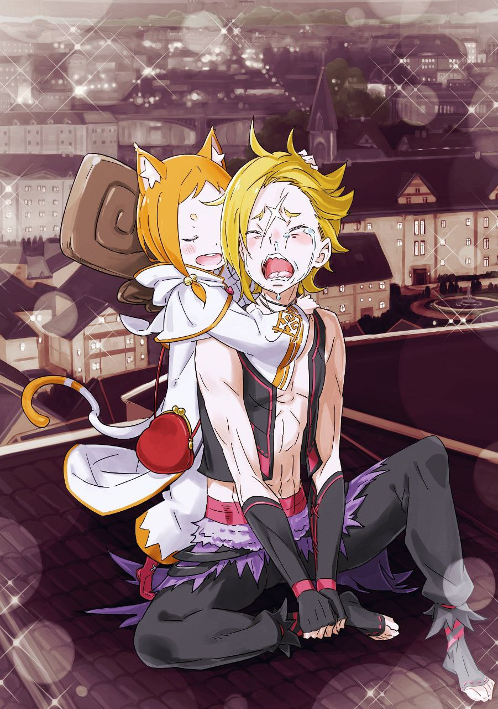

※ ※ ※ ※ ※ ※ ※ ※ ※ ※ ※ ※ ※

— «Простите, пожалуйста. Я совсем не думала, что придётся принимать гостей, поэтому дома не очень прибрано.»

— «Н-не, не парься! Всё нормуль! Чисто! Чисто! У Мими в комнате во-от так, гораздо хуже-е!»

— «Ох-ох, ну что ты. Так нельзя. Нужно обязательно убираться.»

Женщина запросто погладила Мими по голове, пока та болтала ногами, сидя на диване. Мими довольно замурчала, похоже, совершенно доверившись женщине.

Гарфиэль, искоса наблюдая за этим, молча смотрел на женщину.

Длинные, густые золотые волосы, доходившие до поясницы. Белоснежная кожа, хрупкое, но сохранившее женственную округлость телосложение. Мягкие черты лица и спокойные, ясные изумрудные глаза.

Выглядела она молодо, лет на двадцать пять, но Гарфиэль знал, что ей должно быть около тридцати пяти.

То, что она совсем не выглядела на свой возраст, тоже сбивало Гарфиэля с толку.

— «А вам, господин Великолепный Тигр, чай не по вкусу? Простите. Я такая невнимательная, даже не спросила о ваших предпочтениях и просто подала…»

Женщина, назвавшаяся Риалой Томпсон, обеспокоенно нахмурилась, обращаясь к молчавшему Гарфиэлю.

При этих словах Гарфиэль вспомнил, что даже не притронулся к чашке чая, стоявшей перед ним, и поспешно взял её в руки.

— «Не, всё норм. Просто немного… эт самое, размер дома меня поразил.»

— «Ах, вот оно что. Да, он и правда очень большой… Из-за этого ежедневная уборка — целая проблема. А я такая неуклюжая.»

Риала без тени сомнения приняла на веру первое, что пришло в голову Гарфиэлю.

Прикрыв рот рукой, она изящно рассмеялась. На ней было хорошо сшитое женское платье, вполне подобающее жительнице такого большого, как она выразилась, особняка.

Её улыбка, ласковый голос, жесты — всё вызывало в Гарфиэле ностальгию.

И всё же Риала никак не комментировала его пристальный взгляд. Это ранило сердце Гарфиэля до неестественности больно.

Гарфиэль считал, что женщина, назвавшаяся Риалой Томпсон, была как две капли воды похожа на его родную мать — Лисию Тинзель, чей образ навсегда отпечатался в его памяти.

Конечно, Гарфиэль расстался с матерью сразу после рождения. Он был совсем младенцем, и воспоминаний о ней у него почти не было.

Тем не менее, Гарфиэль так ясно помнил её облик потому, что в ненавистном ему «Испытании» гробницы, оставшейся в «Святилище», он видел прошлое — момент расставания с матерью.

Лицо матери, её голос, её любовь — Гарфиэль вспомнил всё это в том «Испытании».

И одновременно «Испытание» показало ему, что сразу после расставания мать постигла трагическая смерть.

Поэтому для Гарфиэля встреча с матерью была несбыточной мечтой.

Так кто же тогда эта женщина, стоящая перед ним сейчас?

— «Мими. У тебя такие пушистые ушки. Можно потрогать?»

— «Кане-ешно!»

Мими подставила голову, и Риала с радостью протянула руку, наслаждаясь ощущением.

Её улыбка была почти детской, а поведение — лишённым всякой настороженности к посторонним. Это было очевидно уже потому, что она так легко пригласила в дом подозрительного вида парня-головореза и девочку-полузверя.

Именно это поведение во всём напоминало Гарфиэлю мать.

Его мать, Лисия, была несчастной женщиной. Её семью разорили долги, и в детстве её продали работорговцу. По пути обратно на работорговца напала банда полулюдей-разбойников, и Лисия стала игрушкой для мужчин-полузверей.

Его сестра, Фредерика, была зачата там, а когда живот матери начал расти, разбойники просто вышвырнули её. После этого мать попала в руки другой банды разбойников, где провела долгое время.

Сестра Фредерика, должно быть, тоже была в банде разбойников, когда начала себя осознавать. Сестра не любит говорить о том времени, но, учитывая, что Лисия покинула банду, как только забеременела Гарфиэлем, условия там, вероятно, были не из лучших.

Пройдя через череду несчастий, Лисия, беременная, с дочерью на руках, отправилась скитаться. Удачей было то, что её вскоре спас эксцентричный аристократ Розвааль.

Розвааль гарантировал матери безопасность, обеспечил жильём и едой при условии, что дети будут воспитываться в «Святилище». В результате Гарфиэль родился в «Святилище», принятый Рюдзу.

Если рассказывать в двух словах, жизнь матери казалась ужасно тяжёлой.

Однако характер матери — то, каким её знали люди, знавшие её по-настоящему, а не по сухим фактам биографии — совершенно не соответствовал этому несчастному образу.

— «Лисия, значит… Ну, она была странным образом невероятно позитивной девушкой. Должно быть, её дни были полны страданий, от которых можно было умереть. Но она всегда говорила, что завтра, возможно, случится что-то хорошее. Даже если сегодня тяжело, завтра может быть что-то хорошее. Что, как и рождение двоих детей, может случиться счастье.»

— «Мама… Возможно, со стороны её можно было бы счесть глупой женщиной. Честно говоря, я и сама иногда думаю, неужели нельзя было жить порасторопнее… Но… мама была замечательным человеком. Это абсолютно точно, в этом нет никаких сомнений. Я очень любила маму и искренне рада, что я её дочь.»

— «Твоя мать… Лисия? Хм-м, да. Я и сам не так уж много с ней разговаривал, но… она была странной. Даже, пожалуй, непостижимой. Она чувствовала счастье острее других. Могла радоваться самым кро-о-ошечным вещам. Находила счастье даже в плохом. Да-а-а. Пожалуй, она мне не не нравилась.»

Ни Рюдзу, ни Фредерика, ни даже Розвааль не говорили о матери плохо.

И так же говорили все в «Святилище», кто знал её.

Думаю, она была беззаботной и счастливой натурой.

Иначе с чего бы ей бросать детей, чтобы отправиться на поиски отца Гарфиэля — того, кто причинил ей столько страданий? Что за глупый поступок.

К тому же, умереть почти сразу после этого… где же тут было счастье?

— До сих пор я не нашёл ответа на вопрос, в чём было счастье матери.

— «Я уж было совсем отчаялся, думал, не найду…»

Ногти впились в ладонь так сильно, что едва не пошла кровь. Он сжал кулаки.

Он думал, что смирился. Что это то, чего ему не понять. Что это проблема, которую ему придётся переваривать внутри себя долгие годы.

Так почему же, почему сейчас, так не вовремя, она появилась перед ним?

Да ещё и с таким видом и выражением лица, будто совершенно его не знает.

«――――»

Незаметно он украдкой наблюдал за её выражением лица и жестами.

Ничего неестественного. Абсолютно естественно, даже завораживающе ярко Риала обращалась с Гарфиэлем как с незнакомцем.

Может, это и есть её ответ?

Что у неё новая жизнь. Что она не знает никакого Гарфиэля. Что она отбросила все былые обещания и живёт счастливо.

Что она знать его не знает — это и есть ответ матери?..

— «Мама.»

— «Мама, я проголодалась.»

В гостиную, где сидел погружённый в молчание Гарфиэль и играли Риала с Мими, спустились переодевшиеся брат и сестра.

Сестра сурово взглянула на Гарфиэля, а затем быстро прижалась к матери.

— «Мам, ну давай уже попросим гостей уйти и поедим.»

— «Сестрёнка, ну что ты такое говоришь! Великолепный и Мими ведь помогли Фреду, помнишь? Он же чуть не утонул, когда играл на лодке.»

— «Хмф, как знать. Может, это тот самый Великолепный и раскачал лодку? Чтобы втереться к нам в доверие и выманить кучу денег.»

— «Ну, сестрёнка! Это ужасно. Но ты права. Раз они спасли Фреда, надо их отблагодарить… Может, лучше деньгами?»

— «Мама!»

Сестра запаниковала при мысли, что её слова могут нанести серьёзный удар по семейному бюджету. Риала же выглядела растерянной, не понимая, из-за чего шумит дочь.

Эта милая семейная сцена сейчас казалась Гарфиэлю пыткой — словно идти босиком по терновнику. Он залпом допил чай, со стуком поставил чашку.

— «Похоже, мне тут не особо рады. Так что я, пожалуй, откланяюсь.»

— «Э-э, почему-у?»

— «Какая к чёрту разница.»

Мими запротестовала, когда Гарфиэль собрался уходить, но он, не слушая её, потянул девочку за собой к выходу. Риала с грустью смотрела на уходящего Гарфиэля, а дочь проводила его, показав язык.

Нужно уважать их чувства… — подумал он в тот момент.

— «Не уходи, Великолепный Тигр.»

Младший брат схватил Гарфиэля за край одежды, преграждая ему путь.

На мгновение Гарфиэль засомневался, стоит ли отталкивать эти маленькие пальчики. Он сам не понимал, почему замялся. Однако…

— «Ну, Фред, что ты творишь!»

Сестра, сердито уперев руки в бока, смотрела на брата, остановившего подозрительного типа. Но прежде чем сестра успела наброситься на брата, Риала хлопнула в ладоши, привлекая всеобщее внимание.

— «Так-так, все должны дружить. Верно. Нельзя же просто так отпускать гостей. Раз Фред этого хочет, сестрёнка, не упрямься.»

— «Мама, но…»

— «Никаких „но“. Великолепный, Мими, пожалуйста, останьтесь ещё ненадолго, хорошо? Было бы здорово, если бы вы поужинали с нами. Сегодня у меня коронное блюдо.»

— «Мам, ты всегда говоришь, что у тебя коронное блюдо…»

— «Ну конечно. Мама ведь всегда старается изо всех сил ради вас.»

Риала слабо согнула руку, показывая бицепс, и все присутствующие, кроме мрачного Гарфиэля, растеряли весь свой запал.

Но именно эта смягчившаяся атмосфера ранила Гарфиэля сейчас больше всего.

На слова Риалы дети отреагировали по-разному: один с радостью, другая — с видом «ну ладно».

Гарфиэля охватил страх, что его вот-вот примут.

— «Извиняюсь за отказ, хоть вы и пригласили, но меня ждут несколько человек. Если сильно задержусь, они начнут волноваться. Так что я пойду.»

«――――»

Сдерживая боль в груди, Гарфиэль молился, чтобы голос не дрогнул.

От его ответа брат и сестра напряглись, а Риала опустила брови и глаза. Однако…

— «Понятно. Если мы будем насильно удерживать вас и доставлять неудобства, в этом не будет никакого смысла. Как говорится, „гостям — радушие и суарье“, верно?»

— «…!»

Возможно, именно этот обмен фразами больнее всего ударил по сердцу Гарфиэля в тот день.

Чувство поражения от Райнхарда, шок от первой встречи с Риалой — всё это было ничто по сравнению с потрясением этого момента.

Он невольно прижал руку к груди, чтобы убедиться, что его тело не разорвало на части. Заметив его состояние…

— «Гарф, пошли.»

Мими, которая только что была против отказа от приглашения, потянула Гарфиэля за руку. Гарфиэль молча подчинился заботе девочки, пытавшейся вывести его наружу.

Он взялся за ручку двери гостиной, собираясь выйти. И тут…

— «Я дома. О, гости?»

Дверь открылась с той стороны, и на пороге появился мужчина с внушительными усами, похожий на джентльмена.

Хорошо сшитая одежда, энергичный вид. По тону голоса и чертам лица было видно, что мужчина не промах.

При появлении мужчины дети позади радостно зашумели.

Вероятно, этот мужчина…

— «Эм, не припомню вашего лица. Вы кто?»

— «Папа, это Великолепный Тигр!»

— «Подозрительный тип!»

— «А?»

Отец растерянно склонил голову набок от таких противоречивых ответов сына и дочери. Затем его взгляд обратился к Риале, тихо стоявшей в гостиной.

На полный нежности взгляд мужчины Риала мягко улыбнулась.

Это был предел.

— «Ничего особенного. Не обращай внимания. Мы уже уходим.»

Бросив эти слова, Гарфиэль потащил за собой Мими, всё ещё державшую его за руку, и вышел из комнаты. Оттолкнув поспешно уступившего дорогу мужчину, Гарфиэль почти бегом направился к выходу.

— «Великолепный Тигр!»

За спиной раздался печальный голос мальчика, зовущий Гарфиэля.

Но у Гарфиэля больше не было сил отвечать на этот голос.

Какой к чёрту Великолепный. Какой Тигр. Где сейчас в нём хоть что-то от золотого тигра?

Тигр сильный, могучий, несокрушимый.

Где сейчас в нём тигр?

Разве настоящий тигр стал бы так печалиться из-за подобного?..

— «Гарф! Руке больно же-е!»

— «…!»

Погружённый в свои мысли, Гарфиэль не замечал жалобного голоса.

Только когда его резко дёрнули за руку и впились в неё ногтями, он осознал, что делает. Маленькая ручка Мими, стиснутая его тисками, сильно посинела.

— «П-прости… Я…»

— «Гарф, ты в доме был странный. И рука, очень больно.» — тихо пробормотала Мими ослабевшим голосом, и Гарфиэль прижал руку ко лбу.

Влажный ветер водного города Пристеллы овевал их, нарушая неловкое молчание. Вокруг уже совсем стемнело, и город окутывал свет расставленных тут и там магических фонарей.

Поверхность каналов теперь отражала не солнечные лучи, а свет магических фонарей. В этом была тихая, потусторонняя красота, но сейчас было не до неё.

— «Постойте, вы двое!»

До стоявших в оцепенении Гарфиэля и Мими донёсся слегка запыхавшийся голос.

Подняв голову, они увидели мужчину, выбежавшего из света магического фонаря. Это был тот самый мужчина, только без пиджака. Добравшись до них, он упёрся руками в колени и тяжело задышал.

— «Ха… ха… догнал. Ох, никуда не годится… Раньше у меня было больше сил, но с тех пор, как я засел за бумажную работу, совсем потерял форму…»

— «…Вам что-то нужно от нас?»

Гарфиэлю было неинтересно самокопание мужчины.

Хотя и не так сильно, как Риала или дети, но и этот мужчина сейчас был для Гарфиэля ядом. Мужчина, должно быть, заметил лёгкую враждебность в голосе Гарфиэля. Он смущённо почесал голову.

— «Да нет, я услышал от жены. Вы ведь спасители моего сына, так? Отпустить вас без всякой благодарности было бы просто возмутительно.»

— «…Да ничего особенного мы правда не сделали. Даже неловко от такой шумихи.»

— «Всё, что касается наших детей, для нас важно. Тем более, если вы спасли его от опасности. Правда, хотелось бы как-то вас отблагодарить… Ох, простите. Я Гарек. Гарек Томпсон. Как бы это ни выглядело, я служу в городской ратуше Пристеллы, так что если что…»

— «Правда, ничего…»

Гарфиэль хотел было отойти от учтивого мужчины — Гарека, но слова застряли у него в горле. Если он муж Риалы и знает её по-настоящему, то…

— «Можно… спросить кое-что?»

— «Да, конечно. Всё, что угодно. Если я смогу ответить.»

Гарек добродушно улыбнулся Гарфиэлю.

И Риала, и её сын Фред, и сам Гарек — вся эта семья была слишком доброй. Только дочь обладала нормальной долей настороженности.

Подумав об этом, Гарфиэль осторожно подобрал слова.

— «Насчёт твоей жены… Риала — это её настоящее имя?»

«――――»

Воздух изменился.

От вопроса Гарфиэля улыбка исчезла с лица Гарека.

Он словно попробовал вопрос на язык, а затем тихим голосом спросил:

— «Что вы имеете в виду?»

— «То и имею. „Рейд всегда идёт напролом“. Ходить вокруг да около не в моём стиле. Скажи мне. Твою жену на самом деле зовут не Риала, а Лисия?»

— «…!»

Когда Гарфиэль ударил в самую суть, на лице Гарека явно отразилось смятение.

Гарек несколько раз открыл и закрыл рот, затем сглотнул слюну со звуком.

— «Вы… вы… что вы знаете… о моей жене?»

— «Это я и сам хотел бы знать.»

«――――»

На дрожащий голос Гарека Гарфиэль ответил так же искренне.

Услышав его слова, Гарек на мгновение задумался. Гарфиэль ждал его ответа. Мими взяла его за другую руку — не ту, что болела.

Он перевёл на неё взгляд. Она беззаботно улыбалась, как всегда.

— «…Похоже, вам лучше рассказать правду.» — сказал Гарек со вздохом, когда Гарфиэль смотрел на улыбку Мими.

В его голосе слышались усталость и лёгкая опустошённость. Гарфиэль недоверчиво нахмурился, ожидая следующих слов.

И тогда…

— «Моя жена, Риала… с тех пор, как мы встретились пятнадцать лет назад, не помнит ничего, что было до этого.»

※※ ※ ※ ※ ※ ※ ※ ※ ※ ※ ※

Гарек встретил Риалу ещё до того, как стал влиятельной фигурой в Пристелле, когда был всего лишь одним из торговцев, обосновавшихся в городе.

В тот день, возвращаясь издалека после неудачных переговоров, Гарек, ехавший на драконьей повозке, наткнулся на дорогу, заваленную оползнем.

Переговоры сорвались, долги давили, и эта новая неудача в пути вывела Гарека из себя.

— И посреди этого хаоса от оползня он обнаружил заживо погребённую женщину.

Чудо — иначе это не назовёшь, говорил он.

То, что Гарек отказался ехать в обход и упрямо искал хоть какой-то проход.

То, что непрекращавшийся дождь именно в тот момент перестал, и видимость улучшилась.

То, что Гарек прибыл сразу после оползня, и время, проведённое под завалом, было недолгим.

Все эти чудеса случайно совпали, и Гарек спас женщину, которая ещё дышала.

Женщина была вся в грязи, без вещей. Гарек погрузил её, без сознания, в повозку и немедленно помчался в ближайший город, где поместил её в лечебницу и стал ждать выздоровления.

— «Она была в очень тяжёлом состоянии. У неё была высокая температура, тело было покрыто ранами от оползня, несколько переломов. Во время лечения у неё даже один раз останавливалось сердце.»

Пока состояние оставалось критическим, и персонал лечебницы, и Гарек отчаянно молились о её выздоровлении. Сейчас Гарек сам не понимает, почему все так старались её спасти. Вернее, у Гарека-то причина была, но он не понимает, почему другие люди так искренне боролись за её жизнь.

Однако сейчас он был всем сердцем благодарен этим людям за их усилия.

— «Старания не прошли даром, и она выжила. Хотя раны всё ещё были серьёзными, я помню, как вздохнул с облегчением, когда кризис миновал. Она очнулась через неделю… я всё это время оставался в городе и ждал её пробуждения.»

Переговоры сорвались, будущее торговой компании Гарека было мрачным.

Почему в такой ситуации он тратил время, равносильное деньгам? Точного ответа он не знал. Просто что-то необъяснимое удерживало Гарека там.

И вот, спустя неделю, женщина очнулась.

Пока все радовались её пробуждению, женщина дрожащими губами слабым голосом спросила:

— «Кто я? Я помню, как она это сказала.»

Женщина не помнила своего имени. Нет, не только имени. Вообще ничего.

Кто она, откуда, куда направлялась и что собиралась делать. Что привело её к месту оползня — она ничего не помнила.

Она не могла вспомнить даже свою семью, и все были в растерянности, не зная, что с ней делать.

Единственной зацепкой была одежда, в которую она была одета во время происшествия. Вышитые на ней буквы указывали, что её инициалы или фамилия, вероятно, начинаются на «Ри».

— «Её назвали Риалой в честь цветущих повсюду цветов. А после того, как её раны зажили, я взял её на своё попечение.»

Когда раны понемногу заживали, и день выписки из лечебницы был уже не за горами…

Хотя Риале некуда было идти, она оставалась светлой женщиной. Она была жизнерадостной, словно и не было никакой трагедии, и обладала силой заставлять улыбаться всех вокруг.

Не могло не быть тревоги.

Потерять память — всё равно что потерять само своё существование.

Причина, по которой она продолжала улыбаться в таком состоянии, заключалась в том, что ей это было необходимо.

Возможно, из сочувствия к окружающим.

Но главная причина была в том, чтобы не смотреть в лицо собственному несчастью.

— «Я до сих пор помню, как нервничал, когда просил её поехать со мной. Время ожидания её ответа было, наверное, самым удушливым в моей жизни. Даже когда я потом делал ей предложение, я не нервничал так сильно, как в тот момент.»

Итак, приняв предложение Гарека, Риала отправилась с ним в Пристеллу.

Причина, по которой он не смог её бросить, причина, по которой он ждал её пробуждения — всё было просто.

Гарек просто влюбился в неё с первого взгляда, как только вытащил из-под завала, погрузил в повозку и оттёр грязь с её лица.

— «С тех пор, как я принял Риалу, дела моей торговой компании, переживавшей череду неудач, стремительно пошли в гору. Окружающие говорят, что это благодаря моему таланту, но это чушь. Всё благодаря Риале. Это она принесла мне удачу. Поэтому сейчас я могу быть и успешным торговцем, и участвовать в управлении городом, и быть отцом.»

«――――»

— «Я люблю свою жену. И обожаю наших детей. Раньше меня беспокоило её прошлое. Но сейчас я так не думаю. Что бы ни случилось в её прошлом, она моя жена и дорогая мне женщина.»

Закончив рассказ об их встрече и жизни до настоящего момента, Гарек смущённо подвёл итог.

Гарфиэль, молча выслушавший всё до конца, смотрел в небо.

Тьма, усеянная звёздами.

Круглая луна и мерцание звёзд — что они думают, глядя на него сейчас сверху вниз?

— «Мне неловко спрашивать об этом. Но я хотел бы узнать.»

«…………»

— «Вы… какое отношение имеете к моей жене, Риале?»

Какой же… какой же жестокий вопрос.

Он опустил взгляд с неба на стоящего перед ним Гарека.

Гарек смотрел на Гарфиэля спокойными глазами, но с твёрдой решимостью. Гарфиэль не был настолько туп, чтобы не понять скрытых в его взгляде чувств и смысла слов.

И он знал, какой ответ будет правильным.

«――――»

Он открыл рот и закрыл.

Вдохнул, выдохнул, вдохнул, выдохнул.

Сердце колотилось. В глазах темнело. Голова раскалывалась от боли, к горлу подкатывала тошнота.

Вихрь смешанных чувств сдавливал грудь, грозя раздавить её.

— В этот момент рука Мими нежно сжала руку Гарфиэля.

— «Я…»

«――――»

— «…не имею… никакого отношения… к твоей жене.»

Он сказал это.

Сказал.

От этих слов вихрь эмоций в груди Гарфиэля мгновенно утих.

Остались лишь чувство потери и удушающая пустота. Гарек перед ним опустил глаза, его губы дрожали.

— «Простите…» — сказал он и с мучительным выражением лица склонил голову.

Но сейчас Гарфиэль не хотел видеть такой реакции Гарека.

Хватит. Прекрати. Не рань меня больше.

Что не так? Кто виноват? Я виноват? Гарек виноват? Кого винить? Кого раздавить, разорвать, размазать?

Как избавиться от этой душевной боли, как заставить её исчезнуть?

— «Дорогой!.. А, хорошо. И Великолепный с Мими тоже здесь.»

— «!?»

Он чуть не закричал.

Чуть не издал отчаянный, надрывный вопль.

Настолько её появление сейчас было для Гарфиэля страшнее любого клинка.

— «Риала, почему…»

— «Ты так торопливо побежал за ними, я подумала, ты их точно удержишь. Да и я сама считала, что нельзя отпускать их с пустыми руками.»

Риала подмигнула удивлённому её появлением Гареку и прошла мимо него.

Затем она протянула руку к застывшему в оцепенении Гарфиэлю.

— «Вот, это суарье — сладости, которые я испекла. Это не бог весть какая благодарность, но я уверена во вкусе, так что возьмите. Пожалуйста.»

— «…а.»

Невинная улыбка.

Гарфиэль застыл, не в силах вымолвить ни слова, затаив дыхание.

Гарек с болью смотрел на эту сцену.

Никто не мог остановить этот обмен между Гарфиэлем и Риалой. Если понимать смысл происходящего, то это естественно.

Поэтому…

— «О-о! Сладости, ура-а! Здорово, похвастаюсь госпоже!»

Фигура Мими, выхватившей пакет со сладостями из рук Риалы и беззаботно рассмеявшейся, была верхом неумения читать атмосферу.

Гарек застыл в изумлении, Гарфиэль так и не нашёл слов. Только Риала радостно улыбнулась реакции Мими.

— «Я рада, что тебе понравилось. Передай привет этой… госпоже, хорошо?»

— «Ага-ага, есть, мэм! Есть, есть, мэм!»

Отдав честь той рукой, что не держала Гарфиэля (то есть посиневшей), Мими сунула пакет со сладостями за пазуху и с силой хлопнула Гарфиэля по спине.

Гарфиэль отшатнулся от неожиданного удара, едва не закашлявшись, а Мими рассмеялась.

— «Ну, теперь мы точно уходим! Великолепный Тигр и Великолепная Мими откланиваются!»

— «Да, будьте осторожны. Великолепный, смотрите не упадите в канал.»

Мими потянула Гарфиэля за руку, а Риала помахала им вслед.

Улыбающаяся Мими энергично помахала Риале в ответ, и та замахала рукой ещё сильнее. За этой милой сценой с болезненным выражением на лицах наблюдали лишь двое мужчин.

«――――»

Так Гарфиэль и шёл вдоль канала, ведомый Мими.

Мими ничего не говорила Гарфиэлю, и они шли и шли, пока Риала и Гарек не скрылись из виду. А потом…

— «Эй, мелюзга…»

— «— Хоп!»

— «!?»

Гарфиэль хотел было окликнуть Мими, но его прервало её внезапное действие.

Мими, не отпуская руки Гарфиэля, легко подпрыгнула и запрыгнула на стену ближайшего здания. Зацепившись ногами за карниз трёхэтажного каменного здания, Мими полезла вверх.

Гарфиэлю, которого тянули за собой, ничего не оставалось, как оттолкнуться от тех же выступов и последовать за ней. Так, всего за три прыжка, они оказались на крыше здания.

— «У-ух! Ка-айф!»

— «Ни фига не кайф. Что это сейчас было…»

Гарфиэль обошёл Мими, которая с наслаждением подставляла лицо ветру, чтобы спросить о смысле её поступка. Но Мими посмотрела на него без улыбки.

Её круглые глаза отражали его самого, и Гарфиэлю почему-то стало не по себе.

Когда он замолчал, Мими вдруг расплылась в улыбке.

— «Гарф, плакать хочешь?»

— «Ч-чего? Что ты несёшь? С чего бы это?»

— «Я знаю, что Гарф сильный, но можешь не притворяться, ладно? Риала ведь мама Гарфиэля, да?»

— «…!»

От неожиданных слов Мими у Гарфиэля перехватило дыхание.

Если точно уловить ход событий и знать семейные обстоятельства Гарфиэля, то прийти к такому выводу было бы логично. Но Мими не знала семейных тайн Гарфиэля, да и вообще не производила впечатления сообразительной девочки.

То, что она так пугающе точно угадала правду, потрясло Гарфиэля.

— «П-почему… ты так думаешь…»

— «Потому что запах Гарфа и Риалы о-очень похож. И двое детей Риалы тоже немного пахли как Гарфиэль. Вот я и подумала, что так.»

Мими угадала правду не логикой, а чутьём дикарки.

Словами можно было бы обмануть, но против указания на то, что изменить нельзя, у Гарфиэля не нашлось возражений.

Он бессильно опустился на крышу и тупо уставился в небо.

Звёзды и луна всё так же смотрели на него сверху вниз.

— «Ну так что, я права? Риала — мама Гарфа?»

— «…Не знаю. Она ли моя мать…»

На слова Мими Гарфиэль закрыл лицо руками.

Не знаю. Это была чистая правда, то, что сейчас было у Гарфиэля на душе.

Он был уверен, что Риала — это Лисия.

Но, как сказал Гарек и как показывало всё поведение Риалы, она полностью забыла, что была Лисией.

Забыв всё, Лисия прожила жизнь как Риала, родила детей и выглядела счастливой.

— «Ха, если так подумать, то эти двое — мои младшие брат и сестра, что ли?»

До этого он об этом не задумывался, но сводные брат и сестра по отцу — это точно как у него с Фредерикой. Значит, те брат и сестра — его милые младшие братишка и сестрёнка. Для Гарфиэля, который был младшим, это были долгожданные брат и сестра.

— Если не считать того, что никто не желал таких отношений.

— «Даже если я назовусь, ничего не изменится…»

Риала забыла время, когда была Лисией.

Даже если Гарфиэль расскажет всё, что знает, пятнадцать лет, прожитых как Риала, не исчезнут, а пятнадцать лет, которые должны были быть прожиты как Лисия, так и останутся потерянными.

Риала испытает ненужное пятнадцатилетнее чувство вины и горечь утраты жизни Лисии. Гарек увидит подавленную жену, а ничего не знающие дети не смогут понять страдания матери.

Всё это будет лишь самолюбованием Гарфиэля.

Если он заставит Риалу признать, что она Лисия, то только Гарфиэль почувствует, будто что-то приобрёл.

Ни Фредерика, ни Рюдзу не знают, что Лисия жива в таком виде. Если Гарфиэль не расскажет, они, скорее всего, так и не узнают.

Семья Риалы тоже не узнает о прошлом, если Гарфиэль промолчит. Их счастливое время не будет разрушено и сохранится.

Если Гарфиэль сможет всё удержать в себе, по-настоящему отказаться от того, от чего уже почти отказался, то всё само собой разрешится.

И всё же…

— «Почему же я…»

Почему не хватает решимости отбросить, забыть, спрятать всё это?

Куда делся тигр? Укажи мне правильный путь.

Дай мне силу всё взвалить на себя, всё удержать и всё равно подняться.

Научи меня, тигр, тигр. Настоящий тигр — сильнейший, он никому не проиграет.

«――――»

Он схватился за голову, сдерживая подступающие рыдания, позволяя скорби терзать его разум, пытаясь отбросить всё разом, и тут Гарфиэль заметил…

— «Хороший, хороший.»

…что его голову прижали к маленькой груди и гладят.

«――――»

Мими обнимала сидевшего Гарфиэля сзади.

Она положила подбородок ему на макушку и маленькими ладошками нежно гладила его по голове. От этого мягкого прикосновения боль, разрывавшая череп, начала утихать.

— «Что… ты задумала…»

— «М-м, я подумала, что Гарф хочет поплакать. Но ведь мужчины, они же не могут плакать где попало, только в специальном месте, да? Зану-уды! Не помню где, но госпожа говорила!»

Ответ вроде бы был, а вроде и нет.

Гарфиэль осторожно подбирал слова, стараясь, чтобы голос не дрожал и сердце не выдало его.

Мими, обнимая его, глупо улыбалась.

— «И вот, не помню точно где, но кажется, это была женская грудь? Вроде бы? Точно! Мужчина может плакать на груди у любимой женщины!»

— «…Кто сказал, что я влюблён в такую пигалицу, как ты?»

Возлюбленная Гарфиэля ни капельки не обращала на него внимания, никогда не была ласковой, когда ему это было нужно, зато внезапно проявляла нежность, когда он этого совсем не ожидал, а потом вдвойне отыгрывалась кулаками — та ещё заноза.

Совсем не похожа на эту девочку перед ним.

Но на ответ Гарфиэля Мими улыбнулась ещё шире.

— «М-м, но всё нормуль! Даже если Гарф не влюблён, Мими влюблена! Вот! Женщина, влюблённая в Гарфа! Мими! Её грудь! Так что плакать нормуль!»

— «…а.»

Это была слишком глупая идея.

Что это такое? Игра слов? Детская отговорка? Нелепица, и ничего больше.

Ничего особенного, но… какого чёрта.

Тигр, тигр, куда ты делся?

Вернись сейчас же в эту грудь. Издай свирепый рык, встряхни эту съёжившуюся спину, выпрями её, сделай что-нибудь с этими чувствами.

Иначе, иначе, иначе будет слишком поздно.

— «Мама…»

Прекрати, прекрати, прекрати.

Никаких жалоб, никакой слабости, я не хочу издавать таких звуков.

Я тигр, тигр. Самый сильный, самый лучший, самый твёрдый и крепкий щит.

И вот…

— «Мама!.. Мама!.. Мааам!..»

— «Хороший, хороший.»

— «Почему?! Почему ты меня забыла?! Мы же… мы же наконец встретились! Даже позвать тебя… не п-позволишь?!..»

— «Нормуль. Гарф, хороший мальчик, хороший!»

— «Мааам… ма… ма… мама…»

Тигр, тигр, куда ты делся?

Кем я сейчас выгляжу? Звёзды, луна, небо, скажите мне.

Кем я сейчас выгляжу?

Если не рычащим тигром, то кем я сейчас выгляжу?..

※ ※ ※ ※ ※ ※ ※ ※ ※ ※ ※ ※ ※
