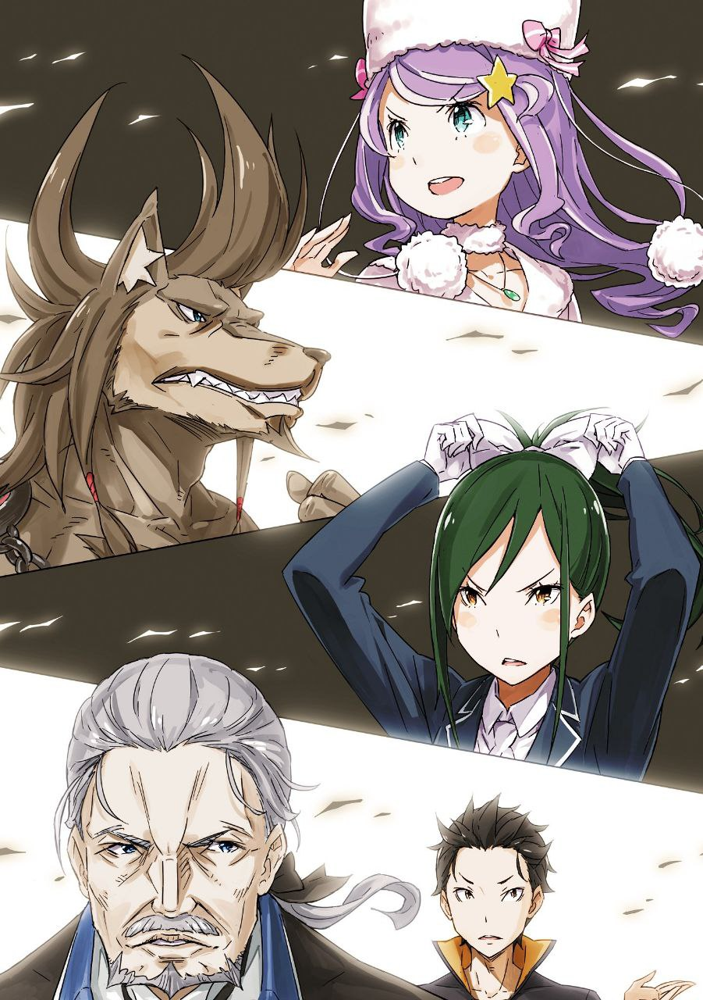
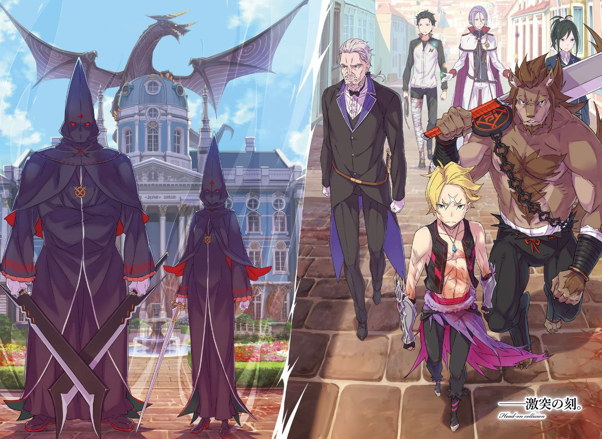

※ ※ ※ ※ ※ ※ ※ ※ ※ ※ ※ ※ ※

— Город Пристелла затих, словно и не было той суматохи, что царила в нём до самого утра.

Субару шёл по каменной брусчатке, мельком взглянув на протекающий рядом канал.

Вода была чистой и прозрачной, всё так же струилась по заданному руслу. Удивительный механизм, заставляющий потоки в одном канале течь в противоположных направлениях, тоже работал исправно. Казалось, стоило лишь вернуться людской толпе, и можно было бы поверить, что нынешнее бедственное положение города — всего лишь дурной сон.

— «Босс, не время рассиживаться.»

— «Ага, знаю. Каждая секунда промедления со штурмом ратуши увеличивает опасность процентов на десять, так ведь надо считать.»

— «Это что ж получается, через одиннадцать секунд предел будет пробит? Ну да ладно, не мне об этом говорить!»

Идущий впереди Гарфиэль прищурился, недовольно посмотрев на Рикардо, который слишком громко высказался. Но зверочеловеку было плевать на привычные предостережения.

Рикардо, закинув на плечо тесак, уверенно шагал по земле, совершенно не обращая внимания на напряжение и чувство вины, терзавшие Гарфиэля.

Рикардо выглядел как обычно, а вот Гарфиэль явно был не в своей тарелке.

Впрочем, и Рикардо было неспокойно — трое его подчинённых, которых он считал семьёй, были ранены. Субару прекрасно видел это по их разговору в убежище.

Гарфиэль же, напротив, утратил свою обычную необоснованную уверенность и безрассудство. Сейчас он был не столько осторожен, сколько труслив, настороженно озираясь по сторонам.

— «…Хотя, наверное, и я не могу сказать, что спокоен.»

Не только эти двое не могли сохранить обычное самообладание.

Субару тоже не мог скрыть тревоги: правая нога ранена, Беатрис нет рядом. А главное — неизвестность о судьбе Эмилии сводила его с ума.

Он стремился как можно быстрее изменить ситуацию, потому что по опыту знал: когда инициатива у врага, это неизбежно приводит к худшему.

Так, каждый со своими проблемами, группа штурма ратуши продвигалась вперёд.

Не встретив ни культистов Ведьмы, ни бунтовщиков, они добрались до места, где договорились встретиться с людьми из другого убежища. Там их уже ждали.

— «Господин Субару.»

— «Слава богу. Вы целы.»

Вильгельм и Круш просветлели лицами при виде Субару и его спутников. Разумеется, там же был и Юлиус. Он легко провёл рукой по волосам и спросил:

— «Я понимаю, ты беспокоишься о госпоже Эмилии, но уверен, что можешь присоединиться к нам?»

— «Я уже не такой дурак, чтобы терять из виду, что важнее для общего дела. К тому же, хоть это и бесит, учитывая цель того ублюдка, что её похитил… есть чувство, что пока ей не причинят вреда.»

— «Я могу представить твои чувства. Если бы госпожа Анастасия оказалась в подобной ситуации, не думаю, что смог бы сохранять спокойствие.»

Кивнув в ответ на слова сочувствия, Субару повернулся к Вильгельму.

Старый мечник стоял со скрещёнными на груди руками и закрытыми глазами, источая всем телом спокойную ауру воина.

Субару не мог угадать, что творилось у него в голове, какие мысли вихрились за сомкнутыми веками.

Заметив взгляд Субару, Вильгельм открыл глаза, затем полез в карман и протянул ему коммуникационное зеркало.

— «Господин Субару, как и договаривались, вот зеркало. Во время боя может не быть возможности уделять внимание связи, так что прошу вас позаботиться об этом.»

— «Понял. Значит, пока всё по плану, зеркала распределены.»

Субару убрал полученное зеркало в карман и кивнул Вильгельму.

Они договорились, что зеркала будут у ответственных за связь в каждой из трёх групп убежищ.

Одно было у Субару, самого бесполезного в боевом плане члена штурмовой группы. Второе носил с собой Феликс, который перемещался между убежищами. Третье находилось у Анастасии, собиравшей информацию.

В идеале, эти три точки должны были поддерживать тесную координацию.

— «Итак, давайте ещё раз уточним. По данным господина Гарфиэля, городскую ратушу охраняли двое культистов Ведьмы. Мужчина с большим мечом и женщина с длинным мечом. Это верно?» — взяла на себя роль координатора Круш, подводя итоги для обмена информацией между всеми собравшимися.

— «Ага, верно. Оба чертовски сильны. Если ты не так крут, как я, то тебя просто разрубят пополам, и всё.»

Выслушав ответ Гарфиэля, Круш кивнула и поочерёдно посмотрела на Вильгельма и Юлиуса.

— «Помимо этих двоих, ожидается присутствие Архиепископа Греха „Похоти“, который, предположительно, захватил ратушу, а также других культистов Ведьмы. Вам что-нибудь известно об Архиепископе Греха „Похоти“?»

— «Прошу прощения. По крайней мере, ни в Королевской Гвардии, ни из других известных мне источников я ни разу не слышал о „Похоти“. Известными были „Лень“ и „Жадность“, но о „Жадности“ в этот раз больше знает Субару…»

Юлиус прервал свою речь, переводя разговор на Субару. Тот кивнул.

— «„Жадность“ тоже здесь, и то, что я слышал раньше, похоже, правда. Но… вроде бы он из Империи? Сомневаюсь, что он настолько силён, чтобы одолеть сильнейшего рыцаря оттуда. Честно говоря, его движения были настолько дилетантскими, что даже я мог бы с ним справиться. Но… атаки на него не действовали.»

— «Может, это не потому, что ты слаб, братец?» — вставил Рикардо.

— «Дело не в этом. Архиепископы Греха передрались между собой, и „Гнев“ атаковала „Жадность“ огнём, но тот даже не увернулся, и не то что ожогов — даже следа копоти на одежде не осталось. Я не понимаю, в чём тут фокус.»

Условно назовём силу Регулуса «неуязвимостью».

Но если это не просто условность, то это худшая из возможных способностей, против которой нет никаких зацепок. Хотелось бы верить, что это не настолько нелогичная и непробиваемая сила.

— «Был бы здесь наш „Сильнейший“, не пришлось бы так ломать голову…»

— «Немыслимо, чтобы Райнхард не появился в ситуации, когда могут пострадать невинные люди. Следует предположить, что и у него возникли проблемы, мешающие действовать. Возможно, он столкнулся с другими культистами Ведьмы,» — сказал Юлиус, незаметно для остальных подмигнув Субару.

Перед началом инцидента Фельт и Райнхард контактировали с Хейнкелем. Хотелось бы верить, что неприятные догадки о причине их бездействия не оправдаются.

— «Есть ещё кое-что, что я хочу проверить. Имя, которым назвалась эта „Похоть“ — Капелла Эмерада Лугуника. Как думаете, какой смысл называть себя членом королевской семьи Лугуники?»

— «Может, просто издевается? Все знают, что королевская семья погибла,» — предположил Рикардо.

— «Или же это какое-то послание? Мне кажется, слишком рано отмахиваться от этого как от простой злой шутки,» — высказала иное мнение Круш.

Оба мнения заслуживали рассмотрения, ведь речь шла о Культе Ведьмы. Учитывая зловредный характер «Похоти», который был понятен даже по голосу, версия Рикардо о злой шутке была вполне вероятна, как и возможность того, что это какая-то злонамеренная загадка.

Однако Вильгельм, подняв руку, предложил совершенно иную точку зрения.

— «У меня есть одно предположение.»

— «Предположение?»

— «Насчёт Капеллы я ничего сказать не могу, но имя Эмерада Лугуника мне немного знакомо. Хотя я не был знаком с ней лично… Человек по имени Эмерада действительно был в королевской семье Лугуники в прошлом.»

— «—!»

Все удивлённо округлили глаза от неожиданной информации. Вильгельм коснулся подбородка.

— «Это было давно, ещё до Войны полулюдей. То есть, более пятидесяти лет назад, ещё до того, как я поступил на службу. В то время в королевской семье Лугуники была особа по имени Эмерада, о которой говорили как об очень красивой и умной.»

— «И эта „Похоть“ назвалась её именем? Зачем?»

— «Этого я не знаю. Однако, насколько мне известно, госпожа Эмерада в юности заболела и скончалась. Но… государственных похорон не проводилось.»

Отсутствие похорон для члена королевской семьи казалось странным.

Пока Субару недоуменно склонил голову, Вильгельм, нахмурившись, подбирал слова.

— «Официальной причиной была сложная политическая обстановка того времени. Но на самом деле, как говорят, этого не желал народ.»

— «Народ не желал?»

— «Госпожа Эмерада была красива и очень умна… но её характер был чрезвычайно жесток, и она таила в себе тьму, непостижимую для других. Поэтому в королевской семье Лугуники её считали чудачкой, и даже сам факт её смерти некоторое время скрывали.»

Вильгельму, очевидно, было неловко говорить о вещах, порочащих честь королевства, которому он когда-то поклялся служить мечом, тем более что это были неподтверждённые слухи. Поэтому вторая часть его рассказа была сбивчивой.

Зато это пролило свет на зловредную натуру «Похоти», назвавшейся Эмерадой.

— «Вряд ли это она сама… значит, „Похоть“ назвалась Эмерадой, чтобы…»

— «Чтобы унизить королевскую семью Лугуники и устроить злую шутку для тех, кто помнит имя госпожи Эмерады. Это окольный путь, чтобы посеять подозрения и недоверие.»

Вывод Вильгельма заставил всех присутствующих тяжело вздохнуть.

Особенно тяжело это было для Круш, Вильгельма и Юлиуса, чья преданность королевству была несравненно выше, чем у Субару, Гарфиэля и Рикардо.

Это было злобное издевательство, плевок в спину королевской семье.

— «И всё же… Капелла, Капелла…»

— «Тебя что-то беспокоит в этом имени?» — проницательно заметил Юлиус, увидев, как Субару приложил руку ко лбу и повторяет имя «Похоти». Субару скривился и, помедлив, ответил: «Нет…»

— «Не только Капелла. Регулус и Сириус тоже. И Петельгейсе, если подумать сейчас… Вряд ли это что-то значит, но…»

— «Чего, босс? Хочешь сказать, в их именах есть какой-то смысл?»

— «Ничего особенного. Просто… мне кажется, что их имена совпадают с названиями звёзд из моего родного мира, вот и всё.»

— «Названия звёзд?» — с интересом моргнула Круш.

Увидев, что и остальные заинтересовались, Субару почесал голову.

— «Только не ждите ничего особенного, ладно? Просто, там, откуда я родом, звёздам дают имена, и так уж вышло, что многие из них совпадают с именами Архиепископов Греха. А мне… мне просто нравились названия звёзд и связанные с ними истории. Вот я и знаю немного больше.»

— «Довольно необычное для тебя увлечение. Звёзды, значит,» — заметил Юлиус.

— «Кстати, моё имя, Субару, тоже от звезды. Ладно, сейчас это неважно. Вот и всё, что я хотел сказать. Извините за пустой разговор.»

Субару стало неловко под вопросительными взглядами остальных, и он попытался сменить тему.

Однако Круш остановила его.

— «Подождите, господин Субару. Названия звёзд… Вы уверены, что на этом всё? Просто совпадение имён? Только и всего?»

— «А что ещё может быть, если не просто совпадение?»

— «Например, возможно ли, что названия звёзд из вашего родного мира являются источником их имён? Культ Ведьмы — это организация, окутанная тайной с самого момента своего возникновения и на протяжении всей своей деятельности. Нельзя отбрасывать возможность связи, какой бы маловероятной она ни казалась.»

— «—»

Субару опешил от неожиданного напора Круш, но задумался.

Честно говоря, он считал совпадение имён звёзд простой случайностью. Ведь это другой мир, и не было никаких причин, чтобы названия звёзд, известные Субару, были известны здесь.

Но можно ли быть в этом абсолютно уверенным?

Здесь, в Пристелле, Субару своими глазами видел архитектурный стиль «вафу», напоминающий японские дома. В Карараги, благодаря Хосину, укоренились окономияки и, возможно, даже кансайский диалект.

Возможно, в основании Культа Ведьмы тоже замешаны знания из современного мира, знакомого Субару. Возможно, кто-то действительно додумался до такой безвкусной идеи — называть Архиепископов Греха именами звёзд.

— «Петельгейсе. Регулус. Сириус. Капелла…»

— «Именно. Вы сказали, господин Субару, что с этими звёздами связаны истории. Что это за истории? Возможно, в них есть подсказка.»

— «Истории, истории…»

Субару напряг память, пытаясь выудить воспоминания о звёздах, которые тускнели по мере того, как связь с его родным миром ослабевала.

Он любил, обожал атлас звёздного неба. Узнав, что его собственное имя связано со звездой, Субару жадно погрузился в изучение атласа, запечатлев в памяти множество звёзд.

Среди них были и те, что носили имена ненавистных Архиепископов Греха…

— «Подмышка гиганта и Рука Джаузы.»

— «А?»

Услышав неожиданное слово «подмышка», Круш непонимающе наклонила голову.

Но Субару, не обращая внимания на её реакцию, схватил её за хрупкие плечи, потряс и, приблизившись, выпалил:

— «Рука Джаузы! Точно! Это была Рука Джаузы!»

— «Гос… Господин Субару? Что вы… Какая Рука Джаузы?»

— «Это происхождение имени Бетельгейзе… а не Петельгейсе! Его сила — „Невидимая Длань“, а имя Бетельгейзе происходит от Руки Джаузы!»

Смейтесь, если хотите, называйте это притянутым за уши.

Но действительно ли это случайное совпадение? Можно ли просто отмахнуться от такой связи?

Субару, знающий толк в звёздах, мог бы точно указать, что правильно говорить Бетельгейзе, а не Петельгейсе. Возможно, именно поэтому он так поздно это заметил.

— «Сириус означает „палящий“, „сияющий“… это немного натянуто? Она извергала огонь, но не так уж и совпадает… Регулус — это „маленький король“. Идеально подходит для этого эгоцентрика! А Капелла…!»

— «Капелла?»

— «Коза! Это была коза! Капелла — это коза!»

Память заработала на полную мощность, и связь между историями звёзд и Архиепископами Греха обрела для Субару смысл.

Он расплылся в довольной улыбке и гордо выпрямился, словно говоря: «Ну как?»

Круш, всё ещё удерживаемая им за плечи, опустила брови. Затем она перевела взгляд на остальных четверых. Они тоже выглядели озадаченными.

— «Подмышка, значит?» — пробормотал Вильгельм.

— «А потом сияющий,» — добавил Юлиус.

— «Маленький король, говоришь?» — протянул Рикардо.

— «И коза, да?» — закончил Гарфиэль.

— «…А?»

Глядя на недоуменные лица товарищей, Субару наконец понял, что его открытие произвело гораздо меньший эффект, чем он ожидал.

— «Господин Субару, простите. Это я виновата, не подумала,» — сказала Круш таким тоном, что даже ей стало неловко.

※ ※ ※ ※ ※ ※ ※ ※ ※ ※ ※ ※ ※

Попытка раскрыть происхождение Архиепископов Греха через связь с именами звёзд с треском провалилась.

Но нельзя было зацикливаться на этой неудаче. Предстояла молниеносная операция, где важна была скорость, и дальнейшее промедление было недопустимо.

Поэтому, обменявшись информацией о способностях и стилях боя каждого, группа Субару приготовилась к атаке.

По пути вперёд члены отряда «Железный Клык», пришедшие с Юлиусом и Круш, обеспечивали прикрытие, мелкими перебежками проверяя дорогу. Шестеро основных бойцов благополучно достигли прямой улицы, ведущей к ратуше.

— «Ничего не изменилось с прошлого раза.»

Гарфиэль принюхался и, не обнаружив врагов, цокнул языком.

По его словам, именно здесь, когда они пытались прорваться по прямой к ратуше, их атаковали из засады. Ни нос Гарфиэля, ни глаза Субару сейчас не замечали тех фигур.

Если их нет, то остаётся просто захватить ратушу. С точки зрения боевой мощи, меньшее количество врагов было бы на руку, но…

— «—»

Гарфиэль с щитами на обеих руках, Рикардо, поправивший тесак на плече, и Вильгельм, чей взгляд, подобный спокойному морю, был устремлён на площадь.

Как они относились к отсутствию врагов?

Особенно Вильгельм — у него должно было быть слишком много вопросов, на которые он хотел получить ответы.

— «Открытое место. Я послал квази-духов осмотреться, но не нашёл никаких путей, чтобы незаметно пробраться внутрь. Похоже, придётся идти в лоб,» — доложил Юлиус, отправив нескольких из шести подчинённых ему квази-духов на разведку. Неудобное местоположение — трудно атаковать, легко обороняться.

— «А нельзя заставить духов разведать обстановку внутри? Узнать, сколько там врагов и как они расположены, было бы большим подспорьем.»

— «К сожалению, мои „бутоны“ не способны выполнить и доложить о таком сложном приказе. К тому же, нельзя исключать, что у врага есть средства противодействия духам, так что это рискованно.»

— «Ну, да, требовать невозможного нельзя. Чёрт, неужели только лобовая атака?»

Если поднимется шум, неизвестно, какую показательную казнь могут устроить в ратуше.

Но и промедление лишь усугубит ситуацию. Культ Ведьмы заявил, что выдвинет требования в следующей трансляции, но вести с ними переговоры было невозможно.

— «Действуем по плану. В зависимости от боевой мощи противника, но в основном нападаем на одного вдвоём или втроём. Быстро разбираемся с ними и захватываем тех, кто внутри.»

— «Оптимистично, но будем надеяться, что всё пройдёт гладко.»

Юлиус ответил на слова Субару с долей иронии, и все одновременно поднялись.

Без команды они рванулись вперёд по прямой и ворвались на площадь перед ратушей.

Врагов нигде не было видно.

Впереди бежал Гарфиэль, за ним — Вильгельм и Юлиус. Рикардо следовал за ними, а Круш и Субару замыкали группу.

Субару не чувствовал никакого дискомфорта в правой ноге. Ни боли, ни ощущений — странное состояние, но бежать оно не мешало. И тут…

— «— Идут!»

Две фигуры спикировали сверху прямо на бегущего впереди Гарфиэля.

Увидев мелькнувшие в воздухе широкое лезвие и тонкий длинный меч, Круш, бежавшая в арьергарде и заметившая засаду, храбро крикнула и обнажила меч.

— Был нанесён «Удар Сотни».

Диагональный разрез рассёк воздух — это была коронная атака Круш, усовершенствованная версия её Божественной Защиты Указания Ветра.

Сверхдальний удар воздушным лезвием, способный поразить цель в пределах видимости на расстоянии десятков метров.

Удар, нанёсший тяжёлые раны даже Белому Киту, устремился к двум фигурам в воздухе и достиг цели.

Раздался звон сталкивающейся стали, и массивный силуэт вместе с изящной тенью отлетели в стороны, вращаясь.

— «Получилось?!»

— «Нет, они защитились! Не попала!»

Засада и контрзасада закончились ничьей.

Двое в чёрных одеждах, вращаясь, приземлились на брусчатку. Оба полностью блокировали воздушное лезвие своим оружием.

Два больших меча и однолезвийный длинный меч. Их фигуры, с головы до ног закутанные в чёрное, были воплощением худшего вкуса, порождённого фанатизмом Культа Ведьмы.

Две тени, не выказывая никаких признаков полученного урона, слегка наклонились вперёд и рванулись в контратаку.

Однако, прямо перед этим…

— «Удар госпожи Круш они отразили, но как насчёт этого?»

Три разноцветных сияния закружились над головами теней, и испускаемый ими свет обрушился на культистов.

Шесть квази-духов Юлиуса, разделившись на две группы по трое, атаковали великана и женщину магией. Невиданный ранее магический свет обрушился на врагов с чудовищным давлением, заставив их обоих преклонить колени.

Воспользовавшись тем, что враги были скованы давлением, Гарфиэль и Вильгельм бросились на женщину, а Рикардо, замахнувшись тесаком, атаковал великана.

— «Вот так!»

— «— Хья!»

— «Конец тебе!»

Удар, способный смять плоть, и серебряная вспышка от меча Демона Клинка.

Удар тесака, порождённый нечеловеческой силой зверочеловека, устремился прямо к беззащитной голове великана.

Идеальный момент и дистанция для смертельного удара…

— «—»

Стоящая на коленях женщина провернула длинный меч в руке и рубанула по ногам Гарфиэля и Вильгельма. Те инстинктивно подпрыгнули, уклоняясь от удара. Женщина, развернувшись вслед за мечом, обвила длинной ногой шею Гарфиэля и втащила его в зону действия магии.

— «Что?!»

Оказавшись вплотную к Гарфиэлю, женщина вывела себя из зоны действия магии. Её колено врезалось в лицо Гарфиэля, скованного давлением, а рука, противоположная той, что держала меч, схватила левую руку Гарфиэля и щитом на ней легко отбила удар Вильгельма.

От этого невероятного приёма Гарфиэль вскрикнул от боли, а Вильгельм застонал.

В ответ на заминку старый мечник получил удар ногой с разворота в корпус.

Удар женщины пробил его натренированные мышцы живота, согнув тело Вильгельма пополам. Он с трудом устоял на ногах, но следующий удар другой ногой с разворота впечатал его в землю.

— «—»

Тем временем удар Рикардо также не смог раздробить голову великана — он был остановлен.

В ответ на удар тесаком, нацеленный на его пригнувшуюся голову, великан просто отбросил оба своих больших меча. Затем он вскинул безоружные руки и подставил их под удар, между тесаком и черепом.

— «Идиот, что ли?!»

Результат этой ошибки был предсказуем — обе руки были отрублены.

Несмотря на тупое лезвие тесака, вложенная в удар сила и скорость были огромны. Толстые руки великана были отсечены по локоть, и две конечности отлетели в стороны, разбрызгивая тёмную кровь.

— «—»

Не останавливаясь, Рикардо шагнул вперёд и горизонтально взмахнул тесаком в сторону лишившегося обеих рук великана. Удар, способный срубить большое дерево, был нацелен на то, чтобы снести голову гиганта.

Однако великан другой своей рукой подобрал брошенный на брусчатку большой меч и отбил удар одним из поднятых клинков.

— «Что такое?!»

Не обращая внимания на действие магии Юлиуса, великан, проявив не соответствующую его габаритам ловкость, обрушил на Рикардо шквал ударов. Эффект магии Юлиуса был нейтрализован завесой крови, хлынувшей из ран на отрубленных руках великана.

Мгновенное решение пожертвовать руками, разгадать эффект и слабость магии и действовать — поразительная решимость.

Под натиском мастерства великана, отточенного в боях, Рикардо начал сдавать. Ему с трудом удалось отбить два больших меча, и в его отшатнувшийся корпус врезалась другая рука гиганта.

Рикардо застонал от силы удара, а затем ещё один кулак врезался ему в лицо, отбросив массивное тело зверочеловека далеко назад.

— «—»

— «—»

Женщина и великан замахнулись оружием, чтобы добить беззащитных противников.

В этот момент к ним подскочили оставшиеся трое, которым едва удалось догнать их.

— «Комбинированная магия, Фейл Гоа!»

— «Попади!»

— «Пожалуйста!»

От заклинания Юлиуса поднялся ветер, и в закручивающийся вихрь воздуха вплелось алое пламя.

Возникший огненный смерч устремился прямо к тени женщины. Та, собиравшаяся добить Гарфиэля и остальных, резко отпрыгнула назад.

А затем, сопровождаемые словно бы молитвой голосами, были нанесены рубящий удар и удар хлыстом.

Воздушное лезвие Круш и, с небольшим опозданием, хлыст Субару ударили по корпусу великана. От диагонального удара гигант пошатнулся, и на его груди появилась болезненная рана со звуком рвущегося шёлка.

Однако ни тот, ни другой удар не нанесли великану значительного урона. Тем не менее, его атака прекратилась, потому что удар ноги упавшего Рикардо пришёлся гиганту в подбородок.

— «Получи, ублюдок!»

— «Не время язвить, быстро отходи, Рикардо!»

Оттолкнувшись ногой для удара, Рикардо сделал сальто назад, подобрал тесак и, вытирая кровь из носа, отступил. Субару и Круш присоединились к нему, встав лицом к лицу с великаном.

Краем глаза Субару увидел, как огненный смерч поглотил женщину, и невольно вытаращил глаза.

— «Что это такое?! Ты можешь использовать такую крутую магию?!»

— «Это всего лишь показуха. Как добивающее заклинание, оно недостаточно отработано. Вот, смотри…» — с горечью ответил Юлиус на похвалу Субару, и его слова подтвердились на его глазах.

Женщина, охваченная огненным смерчем, взмахнула длинным мечом — и одним этим движением рассекла ядро вихря. Потерявший равновесие смерч распался и исчез.

Поразительное мастерство владения мечом женщины. А великан тем временем тоже демонстрировал нечто невероятное.

— «Да ладно, не может быть…»

Распахнув чёрную одежду, великан, помимо отрубленных рук, показал ещё несколько конечностей. Он подобрал свои отсечённые руки, прижал их к ранам, и раздался влажный звук срастающейся плоти и крови.

В следующее мгновение отрубленные руки великана, хоть и со шрамами, приросли на место. Словно проверяя их подвижность, он сжал большим мечом присоединённую руку и демонстративно взмахнул им.

Оба противника были целы и невредимы.

— «А вот мы, наоборот, провалили первую атаку.»

Субару мельком взглянул в сторону: Гарфиэль и Вильгельм, спасённые благодаря помощи Юлиуса, накладывали себе первую помощь с помощью исцеляющей магии Гарфиэля.

Но факт оставался фактом: они вдвоём не смогли справиться с одним противником. Отчаяние от этого было трудно преодолеть.

Однако говорить, что они совершенно бессильны, было бы неверно.

— «Понятно, что в ближнем бою они чертовски сильны… но дальнобойные атаки проходят.»

Магия Юлиуса, воздушное лезвие Круш и даже хлыст Субару — всё это достигало цели.

Последнее, возможно, игнорировалось как не представляющее серьёзной угрозы, но первые два определённо были атаками, способными переломить ход боя.

— «—»

Субару посмотрел на Юлиуса и Круш, вкладывая в свой взгляд этот смысл, и те кивнули.

Гарфиэль и Вильгельм, вероятно, тоже осознали силу противников в ближнем бою. Рикардо же изначально не придерживался принципа сражаться один на один.

План был таков: бойцы ближнего боя сковывают движения врагов, а в это время наносится удар мощной магией.

Вероятно, это был лучший способ победить с минимальными потерями.

Все пришли к единому мнению и синхронизировали дыхание для новой атаки.

И в тот момент, когда они собирались ринуться вперёд…

— «Бесполезно, безнадёжно, безрассудно! Ну почемуууу такие отбросы, как вы, настолько тупые, уродливые, недалёкие, что вообще могут жить? Я бы точно не вынесла! Кья-ха-ха-ха-ха!»

Внезапно в битву вмешался пронзительный, неуместный на поле боя смех.

Однако все понимали, что появление обладателя этого голоса лишь усугубит ситуацию. Поэтому Субару и остальные застыли в ужасе, лихорадочно оглядываясь в поисках источника голоса.

Где, где он? Словно издеваясь над ними…

— «Куда вы смотрите, тупицы безмозглые? Вот поэтому вас и не спасти! Раскройте свои крошечные глазки-бусинки, напрягите свои пустые черепушки и хорошенько подумайте, кто я такая! Зарубите себе на своих грязных душонках!»

— «— Не может быть.»

Пока Субару озирался по сторонам, Круш рядом с ним выдохнула со свистом.

Её янтарные глаза расширились, она подняла голову и уставилась вверх. Интуитивно поняв, что «Похоть» находится там, Субару тоже посмотрел в том же направлении.

Их взгляды были устремлены на крышу ратуши — такую близкую и одновременно далёкую.

Оттуда на них обрушивался издевательский смех, обладатель голоса смотрел на них сверху вниз, как на муравьёв.

И приходилось признать, что это было так. Потому что…

— «Кья-ха-ха-ха-ха! Что это за рожи?! Эти идиотские рожи! Вы их для меня приготовили? Если так, то это настолько великолепное обезьянничанье, что я просто обязана вас наградить! Моей слюны хватит? Вы же будете в восторге от слюны, да? Для вас, мясных отбросов, это же просто сокровище, от которого слюнки текут, так ведь?!»

Раскатистый смех и Субару с остальными, в ужасе смотрящие вверх.

Двое мечников, великан и женщина, никак не реагировали на своего союзника (?) наверху.

Глядя на эту картину поля боя, «Похоть»…

— «Итак, позвольте представиться ещё раз! Я — Архиепископ Греха Культа Ведьмы, отвечающая за „Похоть“,»

— Свысока усмехался чёрный дракон, назвавшийся «Похотью».

— «Капелла Эмерада Лугуника! Сдохните! Гнилые мясные отбросы!»

※ ※ ※ ※ ※ ※ ※ ※ ※ ※ ※ ※ ※
