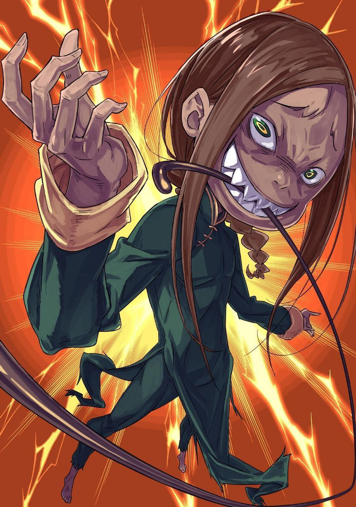

※ ※ ※ ※ ※ ※ ※ ※ ※ ※ ※ ※ ※

--- На крыше ратуши расправил крылья чёрный дракон, насмехаясь над Субару и остальными внизу.

Раскрыв пасть с острыми клыками и шевеля длинным красным языком, он прищурил золотые глаза, не переставая издавать режущий слух пронзительный смех.

Внешность чёрного дракона во многом совпадала с представлениями Субару о драконах.

Он напоминал земных драконов вроде Патраш, с их острыми и благородными чертами, но отличался огромной гривой и, самое главное, размерами. Если средний земной дракон сопоставим с лошадью, то крылатый дракон над головой был размером со слона.

Он тащил за собой такую тушу. Хотелось верить, что летать он не может, но тогда пришлось бы признать, что его великолепные раскинутые крылья — всего лишь бутафория.

Такого быть не могло.

— «Чего пялитесь, возбудились что ли, ублюдки?! Течка у вас, что ли?! А-а, бесит, бесит, когда на меня пялятся такие, кто только и думает, как бы кончить! Вот поэтому я и не хотела вылезать!»

Он взмахнул крыльями в сторону земли, и поднятый чёрным драконом ураганный ветер ударил по телам.

Чёрный дракон — Капелла — обводила их взглядом, словно облизывая длинным языком, её рептильное лицо исказилось в явной усмешке.

До дрожи выразительный крылатый дракон.

Есть вещи, которые прекрасны именно потому, что непонятны, потому что оставляют простор для воображения. Хороший пример тому — невозможность разговаривать с Патраш.

Именно её сдержанные манеры, не выдающие эмоций даже выражением морды, позволяли любить её без оглядки.

Напротив, крылатый дракон перед глазами вызывал лишь отвращение своей, в плохом смысле, человеческой сущностью.

— «…Хоть и поздно спрашивать, но драконы разве умеют говорить?»

— «Драконы, прожившие долгую жизнь и развившие интеллект, понимают человеческую речь. Божественный Дракон Волканика, заключивший союз с королевством, естественно, общается с нами словами, как говорят. …Однако я не слышал, чтобы они так открыто проявляли эмоции», — ответил Юлиус с некоторого расстояния на сдавленный голос Субару.

Лучший из рыцарей пожал плечами, ни на секунду не отводя взгляда от крылатого дракона. То же самое делали и остальные четверо, и, конечно, Субару.

Внизу — два мечника сверхвысокого уровня, а над головой — чёрный дракон, называющий себя «Похотью».

Ситуация, и без того полная тревожных факторов, разом превратилась в стену из них.

— «Если бы только эти два мечника…»

Женщина с настороженно поднятым длинным мечом и гигант, проверяющий на ощупь свой огромный меч лёгкими взмахами.

Женщина была неизвестной величиной, но гигант принял удар Рикардо своим телом. Конечно, это было безрассудство, основанное на знании о последующей регенерации, но это не значило, что атаки его не достигали. Вывод о том, что дальние атаки могут сработать, оставался прежним.

Однако это было верно лишь в том случае, если бы все шестеро смогли сосредоточить все свои силы и загнать его в угол.

— «У кого-нибудь есть опыт сражения с драконами?..»

— «…Есть».

— «Вильгельм, серьёзно?»

Субару почти не надеялся, но на его вопрос Вильгельм тихо ответил.

Старый мечник кивнул удивлённому Субару.

— «Почти сорок лет назад я участвовал в уничтожении дракона, прозванного Злым Драконом Балгреном, на юге Лугуники. Помню, возникла значительная дипломатическая напряжённость из-за необходимости сконцентрировать силы у границы с Волакией».

— «Оставим дипломатические проблемы, можете дать совет по бою с драконом?..»

— «В битве с Балгреном погиб каждый десятый из пятисот рыцарей, участвовавших в походе, а четыре десятых были разгромлены. Мы добились успеха в уничтожении, но в итоге это была катастрофа. Следует опасаться его дыхания, неисчерпаемой выносливости и беспомощности мечников, если он взлетит».

— «В условиях, когда мы не можем использовать численное превосходство, безнадёжных факторов стало ещё больше!..»

Вильгельм, однако, продолжил, обращаясь к побледневшему Субару:

— «Тем не менее, Балгрен был грозным противником, достойным называться драконом среди крылатых ящеров. Этот же слишком мал, чтобы зваться драконом. Если отрубить ему шею, он умрёт с одного раза».

— «А Балгрен не умер с одного раза?»

— «У него было три шеи, которые нужно было рубить».

Вспоминая события прошлого, которые, должно быть, были смертельной битвой, Вильгельм снова сжал меч.

То, что нужно отрубить всего одну голову, обнадёживало.

Видя боевую готовность Вильгельма, Субару тоже поправил хлыст, и остальные приготовились.

Заметив, что дух группы Субару не сломлен, чёрный дракон Капелла произнесла удивлённым тоном:

— «А-а, ну и ну, какие вы упёртые твари. Обычно, после того как вас так хорошенько поимели, да ещё и подкрепление прибыло, да к тому же Архиепископ Греха! — разве не свойственно таким ничтожествам, как вы, удирать? Я что, спутала вас с какими-то другими насекомыми? Кья-ха-ха-ха-ха!»

— «Хватит уже тявкать, задрала! Какая разница, кто противник?! Какая разница, сколько их там стоит?! Я смету всех этих уродов и растопчу их!»

— «Кья-ха-ха-ха! Что-то тут воет проигравшая шавка, у меня со слухом что-то не так? Ой-ой, ошиблась. Ты же, как ни посмотри, не проигравшая шавка, а проигравший кот! Мяу-мяу-мяу-мяу, твоя кошечка сдохла, а ты тут морду красную наливаешь, да?!»

— «Ч-что?!» — Гарфиэль, рявкнувший в ответ на оскорбления Капеллы, задохнулся от её контрудара.

То, что сказала чёрная драконица, несомненно, касалось поражения Гарфиэля. То, что она так подробно описала, как Мими была повержена, означало, что Капелла это видела.

Более того, Гарфиэля поразило другое:

— «Ты… откуда ты узнала, что я Вертигр?..»

— «Ха, откуда узнала? Да у тебя мания величия, дорогуша! Мне на тебя абсолютно, совершенно, ни капельки не интересно! То, что ты грязный полузверь, видно с первого взгляда, идиот! Ты меня за дуру держишь? Если сказал это не издеваясь, значит, ты сам дурак! Сдохни от своей тупости!»

Грязно выругавшись, Капелла фыркнула и окинула взглядом Субару и остальных по очереди:

— «Фу, вонь! Все эти куски гнилого мяса воняют как дерьмо. Морщинистый кусок дерьма! Кусок дерьма, притворяющийся умным! Мохнатый звериный кусок дерьма! Какой-то непонятный, но раздражающий кусок дерьма! Ой, н-о-о…»

После такой уничижительной оценки взгляд Капеллы остановился на одной точке — на Круш.

Её острые глаза сузились, и под этим липким взглядом Круш невольно обняла себя. Увидев это, Капелла ещё более радостно заурчала в горле:

— «А тут и неплохое мясцо затесалось, а? Чистенькое, миленькое, первосортное мясо по моему вкусу! И пахнет хорошо! Ощущение порочности просто восхитительно! Это лицо, это тело, эта красота… мне не терпится растерзать их своими руками-и-и…»

— «…Хватит уже».

— «А?»

Она была в экстазе?

С лицом, которое можно было описать только как восторженное, чёрный дракон облизывала взглядом тело Круш сверху донизу.

В этот момент вмешался тихий, сдавленный от гнева голос.

— «…»

Чёрный дракон, чьё внимание было обращено на Круш, раздражённо подняла голову.

И увидела перед собой Юлиуса, покачивающего кончиком меча, словно дирижёр.

— «Сгори в шестицветном пламени, Эль Прайриум!»

Над головой Юлиуса шесть квази-духов описали круг, и сияющий шестицветный свет, смешиваясь, ударил прямым лучом.

Радужное сияние в точке попадания стало белым, и Капелла, получив прямой удар, взвыла.

— «…Кья-а-а-а-а!!»

— «Это плата за твою болтовню. Хотя, если честно, даже этого мало за такую чушь», — под командованием Юлиуса разрушительный свет квази-духов продолжал беспощадно изливаться.

Под аккомпанемент раздирающего душу вопля Капеллы два мечника, до этого молчавшие, снова оттолкнулись от брусчатки и ринулись вперёд.

— «Не позволю!»

— «Не пройдёте!»

Тут же с криками вмешались Гарфиэль и Вильгельм.

Вильгельм скрестил меч с женщиной-мечницей, а Гарфиэль крепко принял два огромных меча на два своих щита.

— «…»

— «Не отступлю, позвольте проверить вас!»

На женщину, пытавшуюся отступить после отражения первого удара, обрушился сверкающий клинок Вильгельма.

Мощный выпад старого мечника и яростная буря ударов, наносимых сверху и снизу. Длинный меч женщины оказался в невыгодном положении, и она запаздывала с защитой от Вильгельма, чьи атаки развивали невероятную скорость.

Но ужасающим было то, что женщина умудрялась уклоняться от тех ударов, от которых не успевала защититься. У неё была отточенная работа ног и баланс тела, словно она могла двигаться в реке, не нарушая течения воды.

Её тело, казалось, было создано для владения мечом, отточено для фехтования.

Против Вильгельма, демонстрировавшего мощь клинка, не уступавшую той, что он показывал в битве с Белым Китом, женщина держалась лишь благодаря своему выдающемуся мастерству и таланту.

— «Ну, оооо!»

— «…»

С боевым кличем, испуская пронзительный боевой дух, Вильгельм ускорил вращение своих ударов.

Кто посмеётся над его преклонным возрастом? Серия ударов клинка старого мечника завораживала взгляды многих молодых воинов с мечами, являя собой одну из вершин мастерства, к которой стоило стремиться.

Сверкающий клинок рассекал ветер, мчался по воздуху, царапал землю, стремясь достичь плоти женщины.

Отвечая ему, женщина молча принимала, отводила и парировала удары старика, отточенные годами.

Без крика, без великой цели, женщина была словно кукла для битвы. Кукла, слепо следующая врождённым генам воина, заложенным в её плоть, вращающая клинком, как шестерёнка.

Она рассекала ветер, мчалась по воздуху, царапала землю, безжалостно отбивая клинки, летящие в неё.

Звуки их поединка были тихими, не похожими на лязг стали о сталь.

Не потому, что меч женщины был лёгким. И меч старика лёгким быть не мог.

Просто их отточенные клинки несли лишь необходимое разрушение для поражения цели, без лишнего шума.

Это была прекрасная область «Клинка», достижение которой считалось честью для тех, кто жил путём «Мечника» и использовал оружие под названием «Меч».

— «Ооооооо!..»

— «…»

Сверкали удары мечей, два воина сталкивали свою тихую боевую волю.

--- Это была священная территория меча, куда посторонним вход был воспрещён.

Тем временем, совсем рядом разворачивалось другое сражение.

— «Ора-а-а-а!..»

— «…»

Боевой клич, напряжённые мышцы, земля трескается под ногами от выпада, удар вырывает плоть противника.

Голова кружится от пропущенного удара, рёв вырывается от ощущения ответного удара, кровь брызжет изо рта от чувства раздавленных внутренностей, противник отшатывается от силы, ломающей кости.

Битва Гарфиэля и гиганта была грубой и яростной, в отличие от изящного поединка мечников.

В широком смысле, гигант тоже был мечником, владеющим двумя огромными мечами. Несомненно. Но его стиль боя был далёк от изящества, скорее напоминая безумные действия варвара или зверя.

— «Ха, ра-а-а-а!!»

Противостоящий ему Гарфиэль тоже не знал утончённых стилей боя.

Бой Гарфиэля — это драка насмерть, плод его собственного стиля. После наставлений Субару он называл себя «Гарфиэль-рю: Боевая Форма Щита», но по сути это было хаотичное насилие, инстинктивно понятное только Гарфиэлю и неповторимое никем другим.

Насилие Гарфиэля и варварский стиль гиганта отлично сочетались.

Это была понятная, дикая дуэль, где они просто дубасили друг друга до тех пор, пока один из них не достигнет предела и не упадёт, поэтому исход был ясен любому наблюдателю.

— «…»

Удар падающего сверху огромного меча был тяжёл, приняв его одной рукой, можно было вывихнуть локоть. Но если принять обеими руками, ослабнет внимание ко второму мечу, и можно было беззащитно получить удар.

Поэтому Гарфиэль пытался парировать удар одного меча щитом на одной руке. Принимая клинок под углом, он поддерживал щит силой руки и скользил по лезвию, отводя его инерцию.

Страшно то, что этот гигант не просто махал мечами наугад. Хоть его стиль боя и был крайне варварским, его удары были на удивление чистыми и, прямо скажем, прямыми.

Один лишь талант такого не даст. Это мастерство, приобретаемое после десятков тысяч, сотен миллионов взмахов мечом.

Против прямого удара нельзя было допускать небрежного парирования.

Если расслабиться в момент приёма, серебряный щит будет разрублен огромным мечом, который казался тупым, и Гарфиэль в полной мере ощутит удар.

— «Чёрта с два!..»

Поэтому против ярости огромных мечей Гарфиэлю приходилось всегда выкладываться на полную.

Опускающийся меч — парировать. Приближающийся сбоку рубящий удар — парировать. Тут же взмывающий снизу меч — парировать. Удар другой руки, воспользовавшейся брешью, — получить удар. Ударить в ответ.

Проблема была в том, что у гиганта, помимо рук с мечами, было ещё шесть рук.

Они в нужный момент пробивали защиту Гарфиэля и наносили удары, а иногда он даже держал меч не двумя, а тремя руками — крайне неприятные приёмы.

В скорости Гарфиэль превосходил, но в силе ударов и разнообразии атак выигрывал гигант.

Удар в челюсть, парирование меча, удар ногой в колено, апперкот в нагнувшееся лицо, серия из четырёх ударов тыльной стороной кулака отбросила его назад, и он принял удар сверху, впечатавшись в землю.

Кровь летела брызгами, кости трещали, дикое поле боя наполняли стоны боли и рёв толпы.

Сражение героев, от которого у зрителей закипала кровь и они не могли перестать кричать.

Звук столкновения щитов и огромных мечей напоминал бой барабанов, а разлетающиеся искры создавали впечатление театральной постановки.

— «…»

Тихое поле боя Вильгельма и грохочущее поле боя Гарфиэля.

Субару и Круш затаили дыхание, не в силах вмешаться ни в одну из битв. Не только потому, что им не хватало мастерства. Они были заворожены, ноги отказывались двигаться.

Но, в отличие от Субару, охваченного такими чувствами…

— «Плохо дело, скоро он шевелиться начнёт», — Рикардо, внимательно следивший за магией Юлиуса наверху, качнул своим массивным телом и шагнул вперёд. Субару дёрнулся от этого движения со словом «Э?», и тут же…

— «Субару!»

— «Отойди!»

Субару схватили за шиворот и повалили на землю — это сделала Круш, стоявшая рядом. Перед ними, прикрывая их, встал Рикардо, поднял голову и открыл пасть:

— «Ва, ха-а-а!..»

Рёв породил звуковую волну, вибрирующий воздух задрожал, и голос обрёл невидимую разрушительную силу.

Выпущенная волна рёва была сродни той атаке, что Мими демонстрировала вместе с братьями в битве с Белым Китом. Удар, обладающий достаточной мощью, чтобы нанести урон гигантскому телу Белого Кита и прервать его атаку, Рикардо, к ужасу, мог испускать в одиночку.

С этой волной рёва лоб в лоб столкнулось чёрное пламя, пробившееся сквозь белый свет и хлынувшее на землю.

Угольно-чёрное адское пламя зловеще колыхалось, вызывая дрожь в душах скорее своей омерзительной природой, нежели жаром. Чёрное пламя, встреченное волной рёва, рассыпалось на удивление легко, и его остатки разлетелись по площади.

Но истинная его мерзость проявилась после падения на землю.

— «Что это за огонь… он не гаснет?»

На брусчатке не было ничего, что могло бы поддерживать горение чёрного пламени. Тем не менее, огонь оставался на месте, шевелился и тянул свои огненные языки к окружающему.

Ужасало то, что этот огонь, даже упав в водный канал, продолжал гореть на поверхности воды.

Словно масло, подожжённое на воде, пламя продолжало утверждать своё существование на этом месте.

— «Эй, братец, ты долго так собираешься? Обычно всё наоборот, знаешь ли».

— «Субару. Не слишком ли это, когда тебя защищает женщина?» — обратились к Субару Рикардо и Юлиус, ощущавшему необъяснимый страх от остатков чёрного пламени. Проследив за их взглядами, Субару понял, что лежит на земле на боку, а над ним нависает Круш, прикрывая его.

— «Я так жалко выгляжу!»

— «Хорошо, что вы целы. Не волнуйтесь. Я не скажу ни Феликсу, ни госпоже Эмилии».

— «А то, что я от этого успокаиваюсь, делает меня ещё более жалким!»

Вдобавок ко всему, Круш помогла ему встать, что увеличило его жалкость ещё на десять процентов.

Отряхнув штаны, Субару посмотрел вверх, на источник чёрного пламени — конечно же, на чёрного дракона, который его изрыгнул, — и поморщился от вида восседавшего там существа.

Не что иное, как отвращение.

— «Бесит, бесит, хватит пялиться на меня и дрожать от сексуального возбуждения! Прекратите, не смотрите, не насилуйте меня глазами! Кья-ха-ха-ха! Если танцовщице сказать, что трогать нельзя, вы скажете, что магия — это не касание? Кья-ха-ха-ха!»

— «Что это…»

Приняв прямой удар магии Юлиуса, Капелла, похоже, всё ещё была в порядке.

Однако это вовсе не означало, что она была невредима. Напротив, облик Капеллы понёс огромный урон от магии Юлиуса, применённой без всякой пощады.

Правое крыло гордости крылатого дракона было ужасно обожжено, с него капала кровь и плоть. Вероятно, она пыталась защитить тело крылом, но при таком повреждении крыла оно не могло полностью защитить туловище.

Сила магии пробила крыло и нанесла урон и телу чёрного дракона. Живот был прожжён жаром, а внутри кипели и превращались в месиво внутренности. Правая сторона головы дракона была снесена, язык, которым она изрыгала хохот, был оторван, а глазное яблоко свисало вниз.

Это было хуже, чем полуживое состояние. Это был самый настоящий труп.

Однако то, что заставило Субару затаить дыхание, Юлиуса и Рикардо нахмуриться, а Круш невольно издать женский вскрик, было не это ужасное повреждение.

--- А регенерация плоти после этого ужасного повреждения.

Запульсировали кровеносные сосуды, стала нарастать плоть, затрещали кости, разорванные волокна сшивались воедино — разрушенное тело Капеллы восстанавливалось с невероятной скоростью.

От этого ненормального зрелища выделяемое тепло сжигало кровь, поднимая красный пар.

— «Ну что, насмотрелись на мои прекрасные внутренности и удовлетворились? Вы же все извращенцы, из-за своей плотской похоти готовые заглянуть даже в задницу любимому куску дерьма, так ведь? Кья-ха-ха-ха! Удовлетворены? Ну что, удовлетворились и кончили-и-и?»

— «Что это… с тобой?»

— «Спрашивать то, что и так видно, — это верх тупости, не находите? Но я такая милосердная, что отвечу. Как видите, я бессмертна, разве не ясно?»

Бессмертна — лаконичное слово, выражающее абсолютность как нельзя лучше.

Услышав, как Капелла назвала себя так, Субару невольно затаил дыхание. Хотелось рассмеяться и отмахнуться, назвав это чушью, но было ли это искренним мнением? Или он просто хотел отмахнуться, потому что не хотел в это верить?

— «Просто… сверхрегенерация, которую ты сама назвала…»

— «Можете воображать себе что угодно, не так ли? Есть идиоты, которые считают себя непобедимыми, а я не считаю себя такой уж невероятной!»

— «…»

— «Ой-ой, замолчал, какой ми-и-илый! Шутка, идиот! Сдохни! Сдохните все вы, куски дерьма! Кроме меня, все сдохните! Тот-тот-тот!»

С ненавистью выпалив это, Капелла резко оборвала фразу на полуслове. Затем чёрный дракон грубо ударила свежеисцелённым крылом по крыше ратуши и тяжело поднялась.

Неужели она наконец собирается атаковать Субару и остальных на земле? Они приготовились, но…

— «Время вышло. Мне нужно вести трансляцию, так что я возвращаюсь внутрь. Разговор с вами — пустая трата времени! Раздражающая пустая трата времени! Так что пусть вас там порежут эти мясные куски получше, и сгниете заживо».

— «Ч-что?»

Внезапно сбавив тон, Капелла широко зевнула, не скрывая этого. Затем она — или оно, сложно сказать наверняка — действительно развернулась и, тяжело ступая, скрылась в глубине ратуши, невидимой для Субару и остальных.

Можно было бы подумать, что это тактика, чтобы усыпить их бдительность, но…

— «Следует считать, что нас заманивают… но трансляция начнётся», — пробормотал Юлиус.

— «Если требования действительно передадут, город, находящийся в шатком равновесии, охватит паника. Чёрт, значит, придётся войти внутрь? В такой ситуации! Преследовать её!» — у Субару были только плохие предчувствия.

Во-первых, как Капелла с такими габаритами помещается внутри ратуши? О размерах вещательной комнаты можно было только догадываться, но казалось, что одно её неловкое движение — и всё разлетится вдребезги. Возможно, она заставила культистов всё настроить, а сама лишь передаёт голос издалека, но на раздумья времени не было.

— «Тогда решено. Тех, кто снаружи, оставьте на меня и тех двоих. Юлиус, братец и госпожа Круш — штурмовая группа», — сказал Рикардо, указав направление действий размышляющим Субару и остальным. Субару надеялся, что у этого решительного суждения есть какое-то основание, но…

— «Оснований нет. Просто против этих кукол госпоже Круш и братцу Субару будет тяжко. А мне внутри здания неудобно двигаться. Юлиус лучше справится и там, и там. Вот и всё».

— «Разумно. Я бы принял то же решение. Честно говоря, оставлять господина Вильгельма и Гарфиэля тревожно, но здесь, Рикардо, я полагаюсь на тебя».

— «Положись на меня. Я всё устрою».

Юлиус и Рикардо кивнули друг другу, не дав Субару и Круш вставить и слова.

Вероятно, между ними, как членами одного лагеря, возникло взаимопонимание. У Субару не возникло возражений против этого плана, и он яростно взъерошил волосы.

— «Гарфиэль! Ты, блин, не проигрывай! Когда разнесёшь его и «Похоть», нам надо будет идти спасать Эмилию!»

— «Сейчас некогда отвечать, Босс!»

Крикнув Гарфиэлю, участвовавшему в яростной схватке, Субару кивнул Юлиусу. Рядом Круш прикрыла рот рукой и обратилась к Вильгельму:

— «Вильгельм, я рассчитываю на вас!»

— «Слушаюсь!»

На короткий приказ госпожи Вильгельм ответил так же коротко.

Для истинных госпожи и вассала такого обмена было достаточно. Круш тоже выразила своё согласие, и во главе с Юлиусом они бросились к ратуше.

Трое человек пересекли центр площади, направляясь к ратуше. Две тени, заметившие их движение, попытались преградить им путь, забыв о своих противниках, но…

— «Встали на одну линию — это просто идиотское решение, а ну-ка, ха!..»

Волна рёва вздыбила брусчатку, и распространяющееся звуковое разрушение ударило сзади по женщине и гиганту. Рассеянная волна рёва потеряла в силе, но этого было достаточно, чтобы остановить их, и тут же их настигли пренебрежённые ими партнёры по танцу.

— «Не будьте такими холодными! Я ведь вижу только вас!»

— «Не поворачивайся задницей во время драки! Я тебе все волосы на заднице выдеру и раздавлю, ора!»

— «…»

Удары мечей и кулаков яростно столкнулись, и поле боя на площади не позволяло втянуть посторонних.

Слыша за спиной грохот битвы, Субару и остальные, не сбавляя шага, выбили ногой парадную дверь ратуши и ворвались внутрь.

— «Вещательная комната?!»

— «Не знаю, но, вероятно, наверху. Так удобнее передавать голос».

— «Может быть засада. Будьте осторожны!»

Место, куда они ворвались через вход, было приёмной ратуши.

Место, обычно наполненное людьми и, возможно, милыми девушками на ресепшене, было разгромлено, освещение выключено, и царила полутёмная атмосфера.

Похоже, им удалось избежать вида разбросанных трупов или множества ожидающих культистов, но…

— «В любом случае, наверх, наверх. Наверняка есть указатель или что-то, показывающее расположение вещательной комнаты!»

— «Хотелось бы также проверить безопасность людей, которые были в ратуше… но, похоже, это будет уже слишком».

— «Что?..»

Субару заглянул за стойку регистрации, убедился, что там никого нет, и указал на лестницу. Юлиус тихо ответил, но покачал головой, глядя вглубь вестибюля.

Круш нахмурилась, увидев это, но её выражение лица тут же сменилось ужасом.

Увидев реакцию Круш, Субару тоже обогнул стойку и подошёл к ним — и, заметив то же, что и они, затаил дыхание.

Тихо-тихо, шлёпая ногами, появилась фигура.

Человек высунул голову из-за угла лестницы и улыбнулся, как озорной мальчишка.

На первый взгляд он показался маленьким ребёнком.

Не только из-за небольшого роста, но и потому, что черты его лица казались не просто молодыми, а детскими.

Однако это впечатление было лишь мимолётным заблуждением, длившимся до того момента, как он посмотрел ему в глаза.

Растрёпанные длинные тёмно-каштановые волосы, небрежная одежда, похожая на просто обмотанную вокруг тела ткань.

Детские черты лица и озорная улыбка сочетались с гнилым блеском глаз, в котором, казалось, сконцентрировались все яды мира — это были глаза ненормального человека.

И если в этой ситуации здесь находился ненормальный человек, то было ясно, кто это.

Это был…

— «Рады, рады мы, рады же, рады так, слишком рады, потому что можем радоваться, потому что чувствуем радость, поэтому! Обжорство! Ненасытность! Чем дольше ждёшь, чем сильнее голод! Тем восхитительнее первый кусочек!»

Искренне веселясь, искренне радуясь, босоногий мальчик подпрыгивал на месте.

Из его бойко говорящего рта виднелись слишком длинные клыки. От его манер, поведения и этой слишком уж самоуверенной речи мозг Субару закипел.

Если его догадка, это кипящее чувство, верны, то этот парень…

— «Эй, пацан. Если ты просто ребёнок, который случайно заигрался в прятки и остался здесь, немного страдающий синдромом восьмиклассника, то признавайся сразу. В таком случае, как бы это ни было глупо, я тебя прощу. Но если нет, назовись».

— «А-ха-ха, братец, что это? У тебя такое раздражённое лицо. Может, ты из тех, кто затаил на нас обиду? Хотелось бы вспомнить, если получится, но мы такие глупые, и память у нас плохая…»

Субару сдержал желание закричать и попытался сохранить спокойствие.

Мальчик, словно нарочно дразня его, скривил губы в зловещей усмешке:

— «Проверь-ка, действительно ли твоё раздражение направлено на нас, или на самом деле на кого-то другого».

— «Хватит, я понял. Ты — мой враг».

— «Мы — Архиепископ Греха Культа Ведьмы, ответственный за Чревоугодие, Лой Альфард».

— «Чревоугодие-э-э!..»

В тот момент, когда мальчик назвал себя «Чревоугодием», Субару, словно пружина, взмахнул хлыстом.

Рассекая воздух, он безжалостно ударил врага по лицу. На что тот…

— «Ну, то, что на нас обижаются, бывает часто, но…» — нагло ответил «Чревоугодие», остановив кончик хлыста зубами.

※ ※ ※ ※ ※ ※ ※ ※ ※ ※ ※ ※ ※
