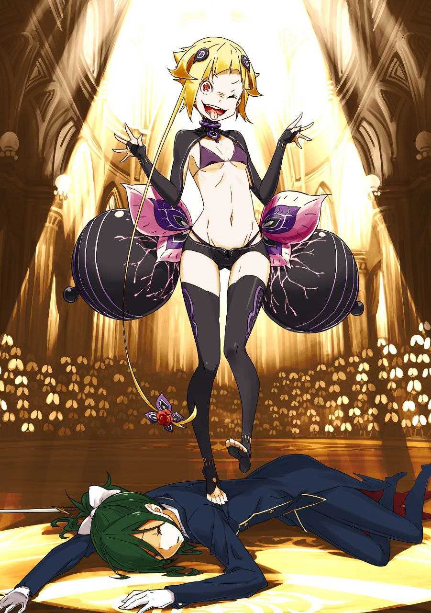

※ ※ ※ ※ ※ ※ ※ ※ ※ ※ ※ ※ ※

Первый удар был нанесен без всякой пощады, но его остановили зубами.

— «…»

Вцепившись зубами в кончик кнута, Рой Альфард, «Чревоугодие», потряс пустыми руками, словно хвастаясь. Альфард… это имя тоже показалось Субару знакомым.

— «У него тоже имя звезды!..»

— «Субару, этот разговор окончен! Вперед!»

Когда Субару грубо дернул кнут, Альфард без особого сожаления отпустил его. В ту же секунду, целясь в Альфарда, Круш сбоку обрушила на него свой невидимый клинок.

Неистовый клинок ветра пронесся по вестибюлю первого этажа городской ратуши, сметая все на своем пути. Расставленные стулья и все, что было на стойке регистрации, были разрублены и разлетелись во все стороны.

Разумеется, удар безжалостно устремился и к Альфарду, оказавшемуся на линии атаки, но…

— «Ух ты! Потрясающе! Занятный трюк, конечно, но…»

— «!..»

Мальчишка уклонился от невидимого клинка ветра, резко откинувшись назад. Словно делая мостик, он коснулся головой пола и тут же сделал сальто назад.

Из присевшего положения он принял позу для низкого старта, поднял голову и усмехнулся.

— «Как способ атаки — так себе. Можешь и союзников задеть, да и слишком уж очевидно. Третий сорт. Для нас это выглядит не слишком аппетитно!»

Сразу после этих слов Альфард оттолкнулся от пола и пулей устремился вперед.

Его невысокая фигура взмыла в воздух. Приближаясь с широко раскрытым ртом, обнажающим острые клыки, он походил на свирепого дикого пса. Однако он был несравненно опаснее любого дикого пса.

Круш выставила меч вертикально и обрушила удар прямо ему в лицо. Однако…

— «Задатки неплохие, но не отточено! Для нас это даже на закуску не тянет!»

— «Агх!..»

Правая рука метнулась навстречу удару, и с резким звоном меч Круш был отбит. Приглядевшись, можно было заметить, что руки Альфарда обмотаны тканью, а из-под нее, в районе запястий, торчат лезвия кинжалов.

Его стиль боя заключался в использовании парных кинжалов и преимуществах, которые давали скорость и ловкость его невысокого тела.

Левый кинжал, противоположный тому, что отбил меч, нацелился в горло Круш. Она тут же извернулась, уклоняясь, но Альфард, развернувшись в воздухе, ударил ее ногой в плечо, и хрупкое тело девушки отлетело в сторону.

— «Ах!..»

— «Круш!»

— «Эй, ты там! Не время по сторонам глазеть! Ты же самая легкая мишень!»

Отвлекшись на скользящую по полу Круш, Субару потерял Альфарда из виду, и тот снова оттолкнулся от земли, нацелившись на него. В полумраке фигура «Чревоугодия», одетая в лохмотья, растворилась во тьме, и Субару на мгновение потерял ее из виду, но…

— «Прости, но…»

— «То, что он идеальная приманка, доказал еще инцидент с „Ленью“».

— «Чего?!»

Нацелившись на беззащитного Субару, Альфард сам подставился под удар.

Субару, остро ощущавший собственное бессилие, поклялся себе не лезть на рожон, даже если кровь ударит в голову. Он прикусил губу, сдерживая себя болью, чтобы дать возможность нанести удар самому сильному из присутствующих.

Бесшумно приблизившись, Юлиус нанес выпад, пронзая маленькое тело, зависшее в воздухе.

Альфард попытался извернуться в воздухе, но клинок «Наизящнейшего Рыцаря» точно рассек его торс. Брызнула кровь, и тело «Чревоугодия» покатилось по полу.

— «Ух ты! Вот это сюрприз!..»

— «Тогда позволь удивить тебя еще больше! Расцветайте, мои бутоны!»

Не дав Альфарду, вскочившему на ноги, договорить, Юлиус ринулся вперед, а за ним последовали младшие духи.

Тускло освещенный вестибюль озарился радужным светом. Из-за спины наступающего Юлиуса потоки света, подобные северному сиянию, устремились к «Чревоугодию».

— «Повелитель духов!»

— «Надеюсь, тебе, гурману, они придутся по вкусу. Каждый из этих бутонов — дитя, которым я горжусь и которое расцветет великолепным цветком».

— «Пафос нам не по душе! Никому из нас!»

Видя, как радужный свет опаляет все вокруг, Альфард с криком отпрыгнул назад. Тонкий клинок Юлиуса последовал за ним. Беспорядочные удары, наносимые во всех направлениях, постепенно теснили Альфарда, пытавшегося боковыми прыжками уйти с линии атаки.

— «Лолимансер!»

— «Не называй меня так, „Юри“!»

— «Веди „Военную Принцессу“ наверх! Остановите вещание!»

Обменявшись прозвищами, Юлиус дал понять, что берет Альфарда на себя.

Помогая подняться кашляющей Круш, Субару понимал, что это самое разумное решение, но не мог заставить себя тут же кивнуть.

Этот скачущий и ругающийся мальчишка — «Чревоугодие».

Заклятый враг, за которым он охотился больше года.

Победа над ним, без сомнения, была для Субару главной и первоочередной целью.

И вот так просто упустить его…

— «П-поняла. Юри, удачи в бою».

— «!..»

Однако, опережая внутреннюю борьбу Субару, поднимающаяся на ноги Круш ответила Юлиусу. Субару резко поднял голову и увидел тень сожаления на лице Круш.

Круш ведь тоже была жертвой «Чревоугодия», лишившего ее воспоминаний.

Естественно, она наверняка постоянно думала о том, как отомстить за обиду, которую даже не помнила. И все же она поставила долг превыше всего и доверила битву с «Чревоугодием» другому.

Если отбросить эмоции, было очевидно, что ей не хватает сил. В этот момент положение и мысли Субару и Круш требовали от них одного и того же выбора.

— «Ну-ну-ну, и что же вы решите? Мы не против разобраться с вами обоими сразу! Пустая женщина и никчемный мужичонка — вместе вы вполне сойдете за разминку перед основным блюдом. А вот того „Юри“, кажется, можно будет съесть, обглодать, пережевать, облизать, вылизать, пожрать, укусить, откусить, разгрызть, объесться! Обжорство! Да, пожалуй, так и сделаем!»

— «Не болтай попусту. Этот Юри не собирается так просто становиться твоей добычей!»

Несмотря на то, что радужный свет теснил его на ограниченном пространстве, Альфард лишь отшучивался с невозмутимым видом. Юлиус преследовал его, и их клинки закружились в танце под звон стали.

В этот момент взгляды Юлиуса и Субару на мгновение встретились.

Взгляд Юлиуса ничего не говорил Субару, но…

— «А-а, черт! Понял я! Ты, ублюдок, только попробуй проиграть!»

— «Это мои слова. Можешь не побеждать, но не смей умирать. Вернее, не дай себя убить».

— «Идемте, „Лолимансер“!»

Субару взъерошил волосы и побежал, оставив позади лишь горькое чувство досады.

Хотелось бы бежать впереди Круш, но, к его стыду, именно она была способна среагировать на внезапное нападение.

Следуя за спиной Круш, которая, несмотря на ранение, шла вперед, Субару устремился к лестнице. Прежде чем взбежать наверх, он бросил последний взгляд на сражающихся в вестибюле Юлиуса и Альфарда.

Казалось, Юлиус одерживал верх. Но расслабляться было нельзя.

— «Идите!»

— «Черт!»

Юлиус заметил взгляд Субару, но даже виду не подал, не позволяя беспокоиться о себе.

Мысленно сплюнув и назвав его неприятным типом, Субару нашел себе оправдание: Юлиусу нельзя погибать, пока он не выскажет ему все претензии лично. После этого Субару последовал за Круш, и они быстро поднялись по лестнице на верхние этажи.

Опасаясь засады, они миновали лестничную площадку и продолжили путь к самому верхнему этажу.

По пути…

— «Субару, простите меня. На самом деле, вы больше всех хотели сразиться с „Чревоугодием“…»

— «Прекратите, Круш. Никто не винит вас».

Осматривая верхний этаж, Круш тихо произнесла эти извинения. Но ведь Круш тоже было досадно. Извинения не могли залечить их общие раны.

К тому же ему было противно от той части себя, которой хотелось обвинить ее после извинений.

— «…Прости, Рем. Подожди еще немного».

Назвав имя девушки, что все еще спала в особняке, Субару мысленно послал ей свои искренние извинения.

На самом деле, ему хотелось немедленно вернуться и разорвать этого мерзко ухмыляющегося Архиепископа Греха на куски. Если бы это могло вернуть ее, что было бы в этом плохого?

Хаос, который возник бы в результате такого поступка и который, вероятно, поставил бы под угрозу жизни многих людей.

Наверное, было бы гораздо проще быть одноклеточным созданием, не способным думать о последствиях.

Даже зная, что если он так поступит, она наверняка рассердится, когда очнется.

— «…»

Круш ничего не сказала Субару, который затаил дыхание, подавляя нахлынувшие эмоции. Она лишь закрыла глаза, словно сожалея о своих извинениях, и возобновила движение, идя впереди.

Городская ратуша была пятиэтажным зданием, и Субару с Круш уже находились на четвертом этаже. На промежуточных этажах располагались конференц-залы и кабинеты для бумажной работы, и, судя по указателю на лестничной площадке, можно было предположить, что комната вещания находится на самом верхнем этаже.

То есть…

— «Значит, и „Похоть“ тоже там…»

— «Да, верно. Но неужели при такой ширине коридора?..»

Заглянув в коридор четвертого этажа, Круш с сомнением нахмурилась.

Ее сомнения были естественны — Субару задавался тем же вопросом.

Ширина коридора на четвертом этаже позволяла идти рядом максимум четверым.

Черный дракон, которого они видели с площади, хоть и издалека, казался размером со слона. Казалось совершенно невозможным, чтобы он поместился в коридорах этого здания.

Конечно, была вероятность, что дракон не пользовался коридорами, а просто проломил стену и втиснулся в комнату, но…

— «Что вы думаете?»

— «Думаю, можно считать, что в коридоре засады нет. Вы ведь тоже так думаете, Круш? Проблема — засада в самой комнате вещания… Они там уже довольно давно. Наверняка что-то подготовили».

— «…Да, я тоже так думаю. Комната вещания… Думаете, они устроили ловушку там?»

— «Учитывая, что мы обязательно туда придем, — несомненно. Однако людей, которые должны были быть в ратуше, так и не нашли. В худшем случае, возможен и план с заложниками…»

Чем больше он думал, тем более мрачные картины рисовались в его воображении.

Это была не та проблема, которую можно решить одной лишь силой. Боевые способности Круш были средними, а на магию, по ее собственному признанию, рассчитывать не приходилось. Для Субару болезненным было отсутствие Беатрис. К тому же его правая нога, если приглядеться, довольно сильно кровоточила.

— «„Не войдя в логово тигра, тигренка не добудешь“… но просто так бросаться туда нельзя. Если бы бой снаружи завершился, подмога внизу могла бы резко изменить ситуацию, но…»

— «В таком случае у „Похоти“ не будет причин откладывать вещание. Похоже, нам с вами, Субару, придется справляться самим».

— «Оптимальный способ против засады…»

Круш решительно произнесла это, пристально глядя на Субару.

Чувствуя давление ее пылкого взгляда, Субару сглотнул.

— «Эм, Круш?»

— «Я слышала от Вильгельма. Он говорил, что именно в таких ситуациях вы, Субару, находите наилучшее решение. Я тоже в это верю».

— «Какое тяжелое доверие!»

К завышенной оценке Вильгельма добавились еще и ожидания Круш, забывшей о том Субару, чья репутация была невысока.

Чувствуя, как его давит груз возложенных ожиданий, Субару изо всех сил думал, используя то немногое время, что у них, вероятно, оставалось, хоть оно и не было четко очерчено.

И он принял решение.

— «Что можно сделать против засады…»

— «Да».

— «Если враг ждет нас там, где мы должны появиться… тогда мы разрушим эту закономерность».

*

—— У засады есть несколько ключевых элементов.

Во-первых, место засады. Это важнейший элемент, поскольку тактика основана на ожидании и атаке противника с выгодной позиции.

Во-вторых, уверенность в том, что противник появится в месте засады. Бессмысленно устраивать засаду, если цель там так и не появится.

И в-третьих, предположение о времени прибытия противника. Если ждать слишком долго и потерять концентрацию, максимального эффекта не достичь.

Следовательно, если предположить, что «Похоть» устроила засаду, то в данном случае все три условия соблюдены.

Субару и Круш во что бы то ни стало должны были ворваться в комнату вещания за ограниченное время. Для того, кто устраивает засаду, нет более удобной ситуации для охоты на добычу.

— «Поэтому нам нужно разрушить эту ситуацию».

— «Это я понимаю… Нет, я тоже аристократка. Раз я решила довериться вам, Субару, то больше не буду возражать. Полагаюсь на вас».

Самый верхний этаж, где находилась комната вещания… вернее, этаж еще выше.

То есть они вышли на крышу, расположенную над верхним этажом, и там Субару и Круш готовились привести в исполнение план, который должен был сорвать замысел врага.

Круш, поначалу сбитая с толку предложением Субару, похоже, наконец решилась. Эта решительность была ее достоинством, не изменившимся даже после потери памяти.

— «По правде говоря, хотелось бы взглянуть, как там битва на площади, но…»

— «Если те, кто внизу, нас заметят, наши действия потеряют смысл».

Со стороны площади даже на эту высоту доносились слабые звуки ударов стали и ругань Гарфиэля. Значит, битва все еще продолжалась. На их помощь рассчитывать не приходилось.

— «И все же…»

Оглядев крышу, Субару понимающе кивнул.

Следы когтей, оставленные тут и там на поверхности, вероятно, были следами бесцеремонно разгуливавшего здесь черного дракона. Ограждение и железная решетка со стороны площади были снесены — это ущерб от магии, примененной Юлиусом.

Подумав о чудовищной мощи этой магии, Субару обошел крышу по широкой дуге и направился к стороне, противоположной площади. Именно там, насколько он помнил по плану здания, находилась комната вещания.

Естественно, Капелла должна была ждать их именно там, ожидая, что они поднимутся по лестнице, и…

— «Субару».

— «Что такое? Если насчет подготовки, то еще немного, и…»

— «Уже поздно, наверное, но я кое-что поняла».

— «?..»

Позади Субару, возившегося с железной решеткой, Круш слегка понизила голос. Когда Субару с подозрением взглянул на нее, она посмотрела на него со странно напряженным лицом и сказала:

— «Кажется, я боюсь высоты. Давайте поскорее с этим закончим».

— «Неожиданная слабость… Понял. Подготовка завершена».

Убедившись, что все надежно закреплено, Субару кивнул Круш. Она кивнула с очень напряженным лицом и осторожно шагнула в объятия Субару, который раскинул руки.

— «Не отпускайте меня, пожалуйста».

— «Круш, вам лучше не говорить таких вещей. Мужчины могут неправильно понять».

— «?»

Криво усмехнувшись недоумевающей Круш, Субару выдохнул. Затем он подхватил прижавшуюся к его груди Круш и решительно перемахнул через ограждение.

Естественно, их тела под действием гравитации устремились вниз вдоль стены здания — и в середине падения длина кнута, закрепленного на руке Субару, иссякла.

— «!..»

Удерживая вес двоих, Субару силой воли превозмогал боль в плече, которое, казалось, вот-вот вывихнется. Инерция падения потянула их по диагонали, и тела описали широкую дугу к стене ратуши. Прямо к окну комнаты, которую он счел комнатой вещания. Субару вытянул обе ноги и пробил его…

— «Р-р-ра-ах!..»

— «Чего?!»

Разбрасывая осколки стекла, Субару и Круш вкатились в комнату вещания. На мгновение ему показалось, что Круш тихо вскрикнула, но Субару сделал вид, что не расслышал, и выпустил ее из объятий.

Оба оперлись руками о пол и тут же осмотрелись, обнаружив…

— «…»

…фигуру черного дракона, застывшего на месте с широко раскрытыми глазами и пристально смотрящего на ворвавшуюся пару.

Черный дракон, втиснувший свое нелепо огромное тело, виденное ими на крыше, в комнату, сложив крылья и подняв шею, похоже, нацелил свою атаку на дверь, ведущую из коридора.

Вероятно, план состоял в том, чтобы сжечь Субару и Круш заживо, когда они войдут через дверь, но эта цель была полностью провалена.

Более того, его гигантское тело стало помехой, поставив его в невыгодное положение в тесной комнате, где трудно маневрировать.

Черный дракон попытался расправить крылья, чтобы дать отпор приготовившимся Субару и Круш, но…

— «Круш!»

— «Да!»

Освободившись от страха высоты, Круш громко ответила и нанесла удар.

Клинок ветра сверкнул, отсекая расправленное крыло черного дракона у основания. Затем подпрыгнувшая Круш прямым ударом отрубила дракону переднюю лапу. «Похоть» взвыла, и хлынула темная кровь.

— «А-а-а-а-а-а-ах!!!»

— «Опасно! Ложись!.. А?!»

Крича от боли, Капелла металась, размахивая крыльями и шеей, разрушая комнату.

Хотя комната и была несколько больше обычной, она не могла выдержать буйства существа размером со слона. Пытаясь не попасть под обломки, Субару закрыл голову руками и попытался укрыться, но тут кое-что заметил.

—— У ног черного дракона отчаянно извивалась связанная девушка.

— «!..»

Его взгляд встретился с заплаканными глазами девушки.

В тот же миг он понял, что после провала первой засады «Похоть» приготовила против них эффективного заложника. Гнев вспыхнул в его груди.

Его концентрация обострилась, и тело Субару выбрало движение вперед, а не бегство.

Кое-как увернувшись от хвоста, пронесшегося над головой, он скользнул к девушке под ногами черного дракона. Он подхватил маленькое дрожащее тельце и заодно со всей силы хлестнул вернувшимся в руку кнутом по спине черного дракона. Видимого урона это не нанесло. Просто немного выпустил пар.

Однако удар Круш был совсем другим.

— «Стой! Подожди! Это не то…!»

— «Никаких разговоров! Получай возмездие за хаос и бедствия, что ты принесла городу!»

Клинок Круш не щадил черного дракона, который закрывал голову руками в странно человеческой манере.

Капелла оказалась настолько беззащитной и уязвимой перед стальным клинком, что было даже как-то неловко от того, насколько хрупкой она стала в обороне.

Другое крыло, которым дракон прикрывал голову, было наполовину разорвано. Длинная стройная нога Круш ударила по вопящему телу. Насколько же ее сила ног отличалась от силы Субару! Огромное тело пошатнулось от удара и отступило к окну, противоположному тому, которое они разбили.

Крылья черного дракона все еще не начали регенерировать.

Несмотря на хваленую неуязвимость, скорость регенерации не была угрожающе быстрой.

— «На этом все кончено!..»

— «Подож…»

Не слушая, Круш нанесла серию ударов на бегу, которые прошлись по туловищу, шее и крыльям черного дракона. Его огромное тело ударилось о стену, выбив оконную раму, и вылетело наружу.

Вылетев сквозь проломленную стену, черный дракон инстинктивно расправил крылья, но одно было отсечено у основания, а другое разорвано вдоль, так что лететь он не мог.

— «…»

Регенерация не успела сработать, и черный дракон стремительно падал вниз, не издав ни звука.

Всего через несколько секунд донесся звук удара «Похоти» о землю. Звук, похожий на шлепок мяса о стену или на падение мокрой тряпки на пол.

— «Я проверю и буду начеку. Субару, позаботьтесь о девочке».

— «А, да, понял».

Круш подошла к оконному проему, откуда выпал черный дракон, не теряя бдительности. Чувствуя исходящую от ее спины надежность, Субару осторожно освободил девочку, спасенную во время суматохи.

Девочка захлопала глазами и посмотрела на Субару испуганным, растерянным взглядом, словно не понимая, что происходит.

Неудивительно. Любой испугался бы, окажись под взглядом дракона.

— «Все в порядке. Злого дракона только что победила та сильная тетя. Мы не можем долго расслабляться… Где остальные?»

— «А, э-э…»

— «Может, трудно поверить, но я союзник. Я пришел спасти вас. Нам нужно со многим разобраться, пока не вернулись страшные типы. Поможешь мне?»

Он опустился на одно колено, чтобы его глаза были на одном уровне с глазами девочки, и заговорил спокойным тоном.

Это был неосознанный жест Субару, который странным образом располагал к нему детей. Возможно, поведение Субару немного успокоило девочку. Она несколько раз судорожно вздохнула, а затем…

— «А, вон там комната… Все там».

— «Их заперли? Они…»

Комната, на которую указывала девочка, была небольшой комнатой дальше, в глубине комнаты вещания.

Вернее, возможно, эта комната и не была комнатой вещания. Это была большая комната, но в ней не было ничего похожего на оборудование для вещания. Даже если предположить, что это было магическое устройство, ничего подобного нигде не было видно. Вероятно, это была подготовительная комната, а настоящая комната вещания — та, на которую указывала девочка.

Глядя в ту сторону, Субару колебался, стоит ли задавать девочке следующий вопрос. Он хотел спросить о том, живы ли запертые там люди.

Но спрашивать об этом девочку было бы слишком жестоко и необдуманно.

Субару погладил все еще дрожащую девочку по голове, а затем медленно направился к комнате.

— «…»

Сердце громко и быстро заколотилось, и Субару почувствовал, как спина покрылась липким потом.

Странно, он не так нервничал во время своего добровольного «прыжка Тарзана», но теперь внезапно ощутил сильную жажду. Дурное предчувствие, ужасное предчувствие не исчезало.

— «Субару?»

— «Все в порядке. Сейчас проверю. Как там „Похоть“?»

— «…Здесь тоже все в порядке. Почему-то она не двигается, так и лежит в той позе, в которой упала».

Круш ответила, продолжая следить за «Похотью» внизу. Услышав ее ответ, Субару глубоко вздохнул, подошел к двери комнаты и потянулся к ручке.

Была вероятность, что в комнате вещания все еще прячутся культисты Ведьмы. Учитывая это, решение Субару проверить комнату в одиночку было не лучшим.

Однако почему-то в глубине души он был уверен, что беспокоиться не о чем. И действительно, его предчувствие не обмануло.

Потому что на самом деле внутри не было культистов Ведьмы. Там было…

— «…»

На онемевшего Субару уставилось множество безмолвных глаз. Нет, ему лишь показалось, что они смотрят. Как они воспринимали мир, Субару не знал. Да и не хотел знать.

Он просто онемел. Голос пропал. Вот что значит потерять дар речи. Мысли замерли, он не мог ни о чем думать. Но кое-что он все же понял.

—— Он понял, что за звук слышался за неприятным голосом во время трансляции, которую они слушали в убежище.

— «Что… это…»

Словно в ответ на хриплый голос Субару, по комнате разнесся тот самый звук.

Казалось, он приветствовал Субару, или боялся его, или отвергал, или радовался ему, или же не выражал ровным счетом ничего…

Бесчисленное жужжание крыльев наполнило комнату вещания.

В тусклой комнате копошилось множество фасеточных глаз, светящихся красным. Ему казалось, что они пристально разглядывают его.

Комнату вещания до отказа заполняло огромное количество мух.

И это были мухи размером с человека. Множество, множество, множество…

— «А-а-а-а-ах!!!»

— «!..»

За спиной Субару, чей разум опустел, внезапно раздался крик.

Субару вздрогнул. Не выпуская из комнаты мух, которые замахали своими огромными крыльями в ответ на крик, он обернулся и увидел…

— «Кья-ха-ха-ха! Идиот, идиот! Даже если вы, куски мяса, напряжете свои куриные мозги, неужели думали перехитрить меня? У вас там что, сахар вместо мозгов?! Кья-ха-ха-ха-ха!»

Девушка, которая громко смеялась режущим слух смехом, прижав ногой к полу корчащуюся Круш.

Знакомый злобный голос, без сомнения, принадлежал…

— «Это Капелла! Кья-ха-ха-ха-ха!»

У ног Капеллы, которая высунула язык, подмигнула и приняла позу, Круш закашлялась, выплевывая огромное количество алой крови, и ее глаза закатились.

※ ※ ※ ※ ※ ※ ※ ※ ※ ※ ※ ※ ※
