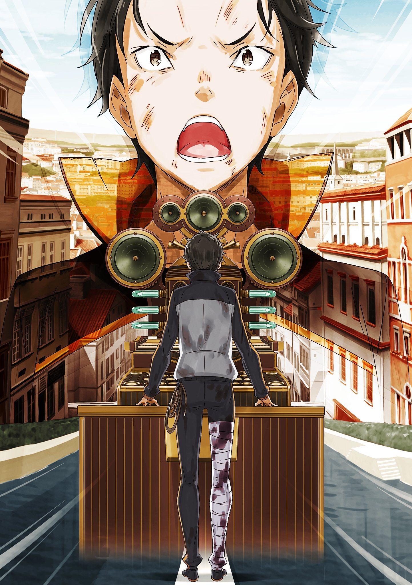

※ ※ ※ ※ ※ ※ ※ ※ ※ ※ ※ ※ ※

В убежище царила угрюмая тишина.

Слышались лишь слабые всхлипы, похожие на сдерживаемый плач, да нервный стук пальцев по полу — кто-то не мог успокоиться. Слушая эти звуки, неприятно резавшие слух в тихом пространстве, девочка сжимала колени и ощущала спиной холод стены.

Это была миниатюрная девочка с золотистыми волосами.

Опершись подбородком на маленькие белые колени, она сидела, скорчившись, и осторожно притянула к себе тяжесть, лежавшую рядом. На её левое плечо опирался совсем ещё маленький мальчик — её младший брат. Он прислонился к ней, засунув голову между её коленями и грудью. Мальчик долго кричал и плакал, но теперь, выбившись из сил, уснул. На его щеках остались следы слёз, а распухшие от плача глаза покраснели. Девочке хотелось хотя бы погладить его по голове, но она боялась, что это разбудит брата, и потому сдерживалась.

Наверняка, если он может спать, то лучше оставить его спящим. Пока он спит, всё будет хорошо.

Слушая спокойное дыхание брата, она желала, чтобы хотя бы во сне он обрёл покой. Реальность за пределами снов была слишком сурова для такого маленького мальчика. И, как думала девочка, для неё самой — старшей сестры, переживающей за брата, — тоже.

Прошло несколько часов с того момента, как было объявлено, что контрольная башня великих водных ворот города Пристелла захвачена.

Той утром, когда прозвучало это сообщение, девочка вместе с братом была на городской площади. Они вышли прогуляться, но услышанное заставило её усомниться в собственных ушах: злобные ругательства, скользившие мимо слуха, и содержание, которое невозможно было принять. Беспокоясь за родителей, она взяла за руку встревоженного брата и вместе с окружающими взрослыми поспешила укрыться в убежище.

«Если случится что-то неожиданное, бегите в убежище».

Это наставление повторялось каждое утро в регулярных объявлениях из городской ратуши — мера предосторожности на случай опасности. Честно говоря, девочка никогда особо не прислушивалась к утренним трансляциям, кроме песен певицы, но даже так эти слова отложились у неё в памяти настолько, что в нужный момент она вспомнила их без труда. Однако что делать после того, как они доберутся до убежища, — этого не знала ни она сама, ни, похоже, взрослые вокруг.

Культ Ведьмы. Контрольная башня. Великие водные ворота. Требования.

Пронзительный женский голос, полный злобы, словно когтями раздирал сердца людей, охваченных страхом и тревогой. Среди потока невыносимой брани мелькали зловещие слова, каждое из которых обладало достаточной силой, чтобы сковать страхом сердца как девочки, так и взрослых.

Запертые в тёмном убежище, они не знали, что происходит снаружи, и не видели никаких признаков улучшения. Чем дольше они проводили здесь время, тем сильнее росла тревога — это было естественно. Сначала люди подбадривали друг друга, но постепенно их голоса слабели, уступая место молчанию, в котором начали проступать беспокойство и раздражение. Вскоре некоторые начали открыто выказывать недовольство, и эта атмосфера распространялась, превращая невысказанные жалобы и обиды в колючие взгляды и резкие движения.

А дальше всё пошло само собой.

Один взгляд сменялся другим, начинались перебранки. В худшем случае дело доходило до драк. В этом убежище напряжение достигло точки, когда ситуация стала взрывоопасной.

— «А-а-а-а-а!»

Опасную атмосферу, готовую вот-вот пролиться кровью, разорвал крик младшего брата девочки. Мальчик с растрёпанными золотыми волосами плакал и цеплялся за сестру, и даже кипящие от гнева взрослые, к счастью, сохранили достаточно здравомыслия и гордости, чтобы не оттолкнуть его грубо.

Вот уж действительно, в детском плаче есть сила.

Обычно девочка считала крики брата лишь шумом, но теперь она поняла, что даже они могут приносить пользу. Обняв остановившего ссору брата сзади, она сама тихонько заплакала.

С тех пор в убежище больше не было споров.

Но все понимали, что это лишь хрупкое равновесие, временный мир на тонкой грани. В следующий раз детский плач уже не остановит бурю.

Именно поэтому люди, которые должны были быть товарищами по несчастью, держались друг от друга на расстоянии. Они избегали не только слов, но даже взглядов и звуков дыхания, упорно сохраняя отчуждённость. Никто не хотел вторгаться в чужое сознание, привлекать внимание или вызывать гнев — никто не знал, что может стать спусковым крючком.

Ради себя и ради других они старались стать меньше, затаить дыхание и ждать, серьёзно глядя в пустоту, пока время не пройдёт. Они цеплялись за слабую надежду, что ожидание что-то изменит.

— «…А?»

Вдруг девочка подняла голову, издав хриплый звук.

Её чувства, тихо ожидавшие перемен, уловили лёгкое изменение в воздухе. То же самое заметили и окружающие — их головы, неподвижные уже несколько часов, слегка шевельнулись. Это было едва ощутимое колебание воздуха, знакомое каждому жителю города, — предвестник трансляции.

В тишине мира звук словно дыхание коснулся уха. Сейчас это ощущение было скорее раздражающим, чем желанным.

Она ждала перемен к лучшему, но трансляции до сих пор приносили лишь злобу Культа Ведьмы.

Что на этот раз потребует этот высокий голос?

Однако её пессимистичные ожидания не оправдались.

— «Э-э, так, это… все меня слышат нормально? Тест микрофона, тест микрофона, раз-два, раз-два.»

Голос, который раздался, принадлежал мальчику и звучал как-то неуверенно.

В отличие от всех предыдущих трансляций, этот голос был лишён уверенности. Это не был привычный утренний голос важного мужчины из ратуши. Это был молодой, незнакомый голос.

Девочка округлила глаза. Взрослые вокруг тоже переглядывались, не понимая, что происходит.

Эти эмоции, конечно, не могли дойти до того, кто находился по ту сторону магического устройства. Мальчик ещё несколько раз повторил проверочные фразы, убедился, что трансляция идёт, кашлянул и продолжил:

— «Рад, что меня слышно. Для начала извините, что вот так внезапно начал трансляцию. Наверное, напугал вас. Многие, скорее всего, подумали: “Что ещё нам сейчас скажут?” и забеспокоились. Но прошу, успокойтесь. Я, тот, кто сейчас говорит, не из Культа Ведьмы. Пожалуйста, поймите это с самого начала.»

— «…Не из Культа Ведьмы?» — пробормотала девочка.

Голос мальчика слегка колебался — он явно не привык пользоваться магическим устройством. Но удивление от содержания его слов перекрыло всё остальное, и никто не обратил внимания на такие мелочи. Люди подняли головы к потолку, откуда лился голос, и их мрачные лица начали меняться. Это была искра надежды, ожидание перемен.

Кто-то тихо пробормотал:

— «То есть… мы спасены?»

Эти слова выразили ожидания, к которым пришёл каждый в убежище.

Да, именно так. Если кто-то помимо Культа Ведьмы использует магическое устройство, значит, ратушу кто-то отвоевал. Если кто-то прогнал культистов из ратуши, то, возможно, они смогут изгнать их и из контрольной башни, и из всего города…

— «Прогнать этих гадов из Культа Ведьмы отсюда…!»

— «Простите, что даю вам надежду, а потом её рушу, но угроза от Культа Ведьмы ещё не исчезла. Ратушу мы вернули, но они всё ещё засели в контрольной башне. Опасность затопления города и их требования никуда не делись. Прошу, поймите и это.»

— «…»

Но эта слабая надежда тут же разбилась о слова самого мальчика из трансляции.

Он говорил так, будто читал мысли людей в убежище. Разве не жестоко так быстро гасить только что зародившуюся надежду?

Кто-то, уже начавший вставать с горящими от ожидания глазами, рухнул обратно. Никто не мог осудить тех, кто ослаб от разочарования, узнав, что признаки избавления от страха оказались ложными. Напротив, гнев обратился к мальчику из трансляции.

— «Простите.»

Но он словно предвидел даже эту обиду толпы.

— «Где вы сейчас слушаете эту трансляцию? В убежищах, наверное? Или, может, есть те, кто не смог туда добраться? Вы все наверняка полны тревоги. Я понимаю, как хочется обнять колени и бояться. Но я специально поднял ваши ожидания, и вы, наверное, думаете: “Кто я такой, чтобы так с вами поступать?”»

— «…»

— «Я никто. Обычный парень, такой же, как вы. Меня тоже мотает эта ситуация, давит несправедливость, я дрожу от страха и трясусь. Говорить с вами через трансляцию — это роль, которую я взял на себя после целой кучи споров. И до сих пор думаю, что она мне не по плечу. Честно говоря, есть люди куда более подходящие, чтобы обращаться к вам. Это точно так.»

Голос мальчика дрожал, словно он говорил от имени всех жителей, погружённых в страх и отчаяние. А затем он продолжил, выплёскивая свои слабости и сомнения в себе.

Девочка и остальные слушатели уже не просто недоумевали или разочаровывались — теперь их переполняли сомнения.

Все сейчас жаждали надежды. Так почему же перед магическим устройством стоит этот мальчик? Он сам сказал, что есть более достойные люди. Тогда почему он?

— «Но сейчас говорю я. Люди, куда круче и важнее меня, сказали, что это должен сделать я. Что в этом есть смысл. Слышите, как дрожит мой голос? Стоять перед толпой — это совсем не моё. Я не умею говорить красиво, у меня нет харизмы, чтобы вести за собой. Я слабый, беспомощный, и в такой важный момент мне до чёртиков хочется сбежать…»

Его голос постепенно затихал, утягивая сердца слушателей в бездну. Слабый, хриплый звук заставлял сжиматься грудь от тревоги, а желудок словно стягивало узлом. Если бы этот мальчик был рядом, в пределах досягаемости, кто-нибудь наверняка заткнул бы ему рот.

— «Сестрёнка…»

Мальчик, спавший у неё на коленях, проснулся и позвал её. Девочка крепко обняла брата, закрывая ему уши, чтобы он не слышал этого слабого голоса, чтобы его не поглотила эта подавляющая слабость. Защищая брата, она сама подставилась под удары этого голоса, который проникал в её уши и тянул за собой в пропасть слабости.

А голос мальчика всё продолжался.

— «Я не знаю, что могу сделать. Хочется закрыть уши, обнять голову и молиться, чтобы всё решилось само собой, пока я сижу в углу…»

— «Нет!»

Девочка зажмурилась и замотала головой, словно отгоняя разочарование и печаль.

Она понимала. Даже без слов она всё понимала.

Слова мальчика отражали мысли всех в убежище, всех жителей города, дрожащих от угрозы Культа Ведьмы. Это была их общая слабость.

Слабость, жившая в самой девочке.

Слабость, укоренившаяся в глубине сердец взрослых.

Ужас, терзающий душу её маленького брата.

Это было то, с чем никто не мог справиться.

Но даже так, смотреть прямо в лицо этой непреодолимой реальности…

— «Но я не могу сбежать, поэтому буду сражаться. Вот и всё, что я могу.»

Когда он это сказал, его голос всё ещё дрожал.

— «…Что?»

Девочка открыла глаза, думая, что ослышалась, и посмотрела вверх. Там, конечно, никого не было. Но вокруг неё лица людей тоже выражали удивление.

После паузы, будто подбирая слова и собираясь с духом, он продолжил:

— «Слушайте ещё раз. Где вы сейчас, те, кто слышит мой голос? В убежище? Прячетесь дома? Не дрожите ли вы в одиночестве? Есть ли рядом кто-то? Это важный для вас человек? Или, может, незнакомец, лицо которого вы узнали за эти часы?»

— «…»

— «Это эгоистично и, может, сложно, но, пожалуйста, не оставайтесь одни. Когда ты один, в голове крутятся только дурацкие мысли. Я знаю это по опыту. Поэтому не будьте одни. Будьте с кем-то. И…»

Он вдохнул, и его голос слегка дрогнул от колебаний.

— «И если можете, посмотрите в лицо тому, кто рядом с вами.»

— «…»

Словно поддавшись его словам, девочка медленно опустила взгляд в свои объятия. Её брат смотрел на неё снизу вверх. Их глаза встретились — её и его, дрожащие зелёные глаза.

— «Чьё лицо вы сейчас увидели? Близкого человека? Или незнакомца, с которым провели эти часы? Может, друга? …Наверное, лицо не из лучших. Слёзы, страдание — вряд ли кто-то сейчас смеётся. Хотя, может, кто-то делает вид, что улыбается, чтобы не тревожить других. Если так, это удивительный человек. Если важный для вас человек пытается улыбаться, гордитесь им. А потом сравните эту улыбку с той, что вы знаете.»

Лицо брата было заплаканным.

Смятым, будто он вот-вот снова разревётся.

А в его глазах отражалось её собственное лицо — пустое, лишённое выражения.

— «Разве это можно простить?»

— «…Нет,» — тихо вырвалось у девочки.

Её слабый голос был едва слышен даже ей самой.

Но вдруг…

— «Я не могу простить. И не хочу прощать.»

Голос мальчика зазвучал громче, будто услышав её шепот.

— «У меня тоже есть дорогие мне люди. Важные товарищи. Я не могу простить тех, кто заставляет их страдать, грустить или выдавливать фальшивые улыбки. Да пошли они! Не смейте издеваться! Я хочу кричать на весь мир, что настоящая улыбка этого ребёнка куда милее!»

— «Сестрёнка…»

— «Я не могу просто сдаться. Не могу бросить всё и остаться в стороне. Нет никакого оправдания тому, чтобы просто терпеть. Они не правы. И если я знаю, что правда на моей стороне, то не могу позволить себе проиграть тем, кто не прав. Признать поражение перед такими подонками — это не про меня.»

— «Фред…» — девочка тихо позвала брата и притянула его к себе, коснувшись лбом его лба.

Она почувствовала тепло. Горячее, живое тепло.

Её это или брата — не важно. Оно было здесь.

— «Хочу сбежать, но не могу. Хочу плакать, но не могу себе этого позволить. Враг силён, но я не хочу проигрывать. Поэтому я буду сражаться. Я слаб, не слишком умён, всё это я знаю, но я всё равно буду драться. Они не правы. Они заставляют моих любимых людей грустить, и они не правы. Поэтому я сражаюсь. Я буду сражаться. И я хочу, чтобы вы тоже сражались.»

— «…!»

Дыхание перехватило. Слабость сдавила горло, и девочка злилась на себя за это.

Но голос мальчика, который до этого дрожал, теперь звучал твёрдо, указывая путь.

Она понимала его чувства. Его слова доходили до неё, причиняя почти физическую боль. Её сердце разделяло его стремления. Она тоже хотела сражаться. Хотела прогнать злодеев, напавших на город. Но она и её брат были слишком малы, слишком слабы, и их руки не могли дотянуться до врага.

Беспомощные, невежественные, трусливые — вот почему…

— «Не поймите меня неправильно. Когда я говорю “сражайтесь”, я не имею в виду, чтобы вы брали палки и бросались в бой. Напротив, избегайте такого безрассудства. Я не прошу вас собираться в группы и яростно сражаться с Культом Ведьмы. Я хочу, чтобы вы сражались иначе — не опускали головы.»

— «Не опускать… головы?»

— «Смотреть в пол и сверлить его взглядом ничего не изменит. Дырку взглядом не пробьёшь, а даже если и пробьёшь, это не решит проблему. Так что поднимите лица и смотрите вперёд.»

Девочка подняла взгляд. Она больше не смотрела на свои колени или золотые волосы брата — перед ней открылось убежище. И она заметила, что окружающие тоже подняли головы, как и она.

Их глаза встретились, и люди удивлённо распахнули их ещё шире.

Все невольно последовали голосу мальчика и подняли лица, как и она.

— «Оглянитесь вокруг — наверняка встретите чей-то взгляд. Это будет кто-то, кто разделяет вашу тревогу, ваше желание сбежать… но и ваше желание не проиграть. Рядом с вами может быть важный человек или тот, с кем вы только что встретили взгляд. Добавьте себя — и вот уже трое. А в некоторых местах, наверное, и больше.»

Как он и сказал, её взгляд пересёкся с глазами многих людей.

В их глазах было что-то сложное, и, наверное, её взгляд был таким же. Но теперь он казался не просто дрожащим от страха — в нём появилось что-то ещё.

— «Я буду рад, если вы почувствуете, что вы не одни. Это само по себе даёт силы, правда? Никто не хочет видеть грустные лица дорогих людей. Никто не хочет показаться слабаком перед тем, с кем только что встретился взглядом. Неужели такое слабое и упрямое чувство есть только у меня?»

— «…»

Его голос призывал, побуждал людей собраться с духом.

Но девочке казалось, что сам мальчик ищет помощи, цепляется за что-то.

И тут она поняла.

С первой секунды этой трансляции его сердце ни разу не изменилось.

Он сожалел о своей слабости, злился на свою недостаточность, но не сдавался.

Он говорил, что это его единственное оружие, и обращался ко всем, уверяя, что они такие же.

— «Докажите мне. Я слаб и беспомощен, но всё ещё не могу сдаться. Докажите, что я не единственный упрямый слабак, который не сдаётся… Докажите мне это.»

Это был подлый голос. Низкий призыв.

В ситуации, когда все искали спасения, он первым бесстыдно кричал: «Поддержите меня!»

— «Или это только я?»

Его голос дрогнул от неуверенности. Нет, он и с самого начала не был уверен.

Девочка почувствовала тревогу. Нужно остановить его. Даже если она не знала, что кричать.

— «…Не так,» — слабый, едва слышный голос вырвался из её горла.

Такой голос не дойдёт. Нужно громче, нужно ответить.

Этому трусливому голосу, боящемуся одиночества…

— «Я один думаю, что ещё могу… что ещё могу сражаться?»

— «Нет!»

Девочка закричала, раскрыв рот, словно зверь.

Её голос разнёсся по убежищу. И не только её — другие, поднявшие головы, тоже кричали.

Это был голос сопротивления — печали, слабости, страху.

Если это было частью плана мальчика, то она попалась на его уловку.

Пусть так, даже если это было рассчитано — какая разница? Если дрожь этого слабого голоса, его неуверенные упрёки, жалкие подбадривания и цепляющееся доверие — всё это притворство, то пусть.

Если это была такая искусная провокация, то ничего не поделаешь, если она поддалась.

Но если это искренние слова неуклюжего слабака, то как можно оставить его одного?

— «Не так, верно?»

— «Нет!»

— «Вы ведь тоже ещё сражаетесь, да? Не даёте слабости поглотить себя?»

— «Не проиграем… Я не хочу проигрывать!»

Грудь горела. Зубы дрожали, но не от гнева — от какого-то иного, мощного чувства.

И это чувство было не только её. Оно охватило всех вокруг, слилось в единое пламя, разгоревшееся страстью.

Ещё недавно все сердца здесь были связаны общей тревогой, но теперь их объединяло нечто более горячее.

— «Если рядом дорогой человек, сожмите его руку и верьте. Если это незнакомец, кивните ему, мол, давай держаться вместе. Поверьте, что ни вы, ни он не сломитесь и будете сражаться. Если вы не сдадитесь, я тоже не сдамся. Я буду сражаться — сражаться и победить.»

— «…»

Это всего лишь одно убежище, далеко от ратуши.

Как бы громко они ни кричали, как бы ни утверждали, что их чувства одинаковы, до мальчика это не дойдёт.

Но его голос звучал так, будто он услышал их, принял их крики, вложив в свои слова облегчение и дрожь эмоций.

— «Сражаться и победить.»

Можно ли это сделать? Девочка не сомневалась.

Это точно возможно — она верила в это.

Как этот мальчик верил, что она и жители города не поддадутся отчаянию.

Так и они верили, что этот голос победит в самой опасной битве.

Почему она могла в это верить? Потому что этот голос, наверняка…

— «Меня зовут Нацуки Субару. Я — заклинатель духов, победивший архиепископа греха Культа Ведьмы, “Леность”.»

— «…!»

Раскрытие личности мальчика, до сих пор скрытой, и его имени вызвало волнение.

Девочка не поняла смысла этих слов, но для окружающих это было не так. Удар был сильным, но не негативным.

Сначала удивление, затем осознание — и вот надежда и доверие взрывно распространились, захватив даже сердце девочки.

— «Мы с товарищами разберёмся с Культом Ведьмы в городе! Так что верьте и сражайтесь. Держите за руку дорогих людей, гоните прочь слабость, что хочет вас сломить. А потом…»

— «…»

— «…остальное оставьте мне!»

Толпа вскрикнула, и убежище заполнила горячая волна.

Ожидания превратились в надежду, одна надежда породила тысячи, и они разом разрослись.

Девочка посмотрела на брата в своих объятиях и увидела в его зелёных глазах ясный свет.

Убедившись в этом, она крепче обняла его. Брат нерешительно обнял её в ответ, и, ощущая тепло объятий, девочка подняла взгляд к потолку.

Этот мальчик, не скрывавший своего страха и тревоги, взвалил на себя ожидания и надежды множества людей в городе и заявил, что будет сражаться.

Она закрыла глаза, молясь, чтобы герою, чьё лицо она могла лишь вообразить, сопутствовала вся возможная удача.

Потому что этот мальчик наверняка был обычным парнем, который просто сопротивлялся несправедливости ради кого-то дорогого.

※※ ※ ※ ※ ※ ※ ※ ※ ※ ※ ※ ※

Отойдя от магического устройства, похожего на граммофон, Субару медленно отступил назад.

Пот, стекающий по лбу, был вызван тревогой и напряжением. Он опёрся о ближайший стол и грубо вытер лицо.

Глубоко дыша, он беспокоился, не уловит ли устройство эти звуки.

Но, увидев, как Анастасия управляет устройством, он понял, что она, похоже, уже выключила его. Субару облегчённо вздохнул.

— «…Уф, вымотался,» — пробормотал он, чувствуя усталость сильнее, чем ожидал, и размял шею.

Честно говоря, пока он говорил, он был в каком-то трансе и не мог точно вспомнить, что именно сказал. Не то чтобы всё вылетело из головы, но некоторые моменты были размыты.

Хотя у него был черновик речи, который ему дала Анастасия.

— «…»

Вытерев пот с подбородка рукавом, Субару заметил, что в комнате слишком тихо.

Все, кто следил за трансляцией, молчали. Здесь были Анастасия, Гарфиэль и Ал, а также Юлиус и Рикардо, присоединившиеся позже и стоявшие в углу. Тишина от обычно шумной компании вызывала лишь неловкость.

Неужели он так плохо и бессвязно выступил?

— «Нацуки-кун.»

— «Уааа! Простите! В следующий раз сделаю лучше!»

— «За что извиняешься? Странный ты парень.»

Субару, чьё сердце сжалось от тревоги, невольно извинился на оклик. Анастасия рассмеялась и, не убирая улыбку, склонила голову набок.

— «Кстати, раз уж ты такой странный, может, скажешь… Нацуки-кун, ты раньше не был мошенником или кем-то вроде того?»

— «Что ты такое говоришь!? Я же, как видишь, самый обычный… студент! Ну, точнее, даже меньше, чем студент!»

— «Нет-нет, это не в обиду. Просто твоя манера говорить… она слишком уж отточена. Сначала принижаешь, потом поднимаешь — это было идеально.»

Анастасия махнула рукой и слабо рассмеялась: «Ха-ха». Теперь Субару склонил голову.

— «Какая там манера? У меня в голове была пустота, я тараторил, даже не понимая, что говорю. Буквы в твоих записях расплывались, и я бросил их читать — вот что я помню.»

— «То есть ты полностью проигнорировал мой черновик? Я чуть не поседела, когда ты начал говорить совсем не то, что мы обсуждали… Хотя, похоже, зря волновалась.»

— «За это прости! Но в целом я же следовал твоим заметкам, разве нет? Если бы всё было совсем плохо, ты бы меня остановила, верно?»

В заметках, которые стали бесполезной шпаргалкой в решающий момент, были записаны красивые слова, чтобы развеять тревогу жителей города.

Это был шедевр, сочетающий переговорные навыки Анастасии, знание поговорок Гарфиэля и остроумные современные идеи Субару.

Он не смог зачитать их в нужный момент, но если хоть что-то осталось в голове, речь должна была идти в рамках задуманного.

— «Сказать такое неловко, но твоя речь вообще не касалась того, что было в заметках. Даже близко не подошла.»

— «…Что?»

Слова Анастасии легко опровергли предположения Субару.

Он замер и взглядом попросил подтверждения у остальных. Но все четверо смотрели серьёзно, реагируя на его взгляд по-разному.

Юлиус шагнул вперёд, теребя чёлку пальцами.

— «Анастасия-сама права, Субару. Ты говорил не то, что мы обсуждали. Особенно меня удивило, что ты отложил на конец упоминание о победе над архиепископом “Лености”. Что ты хотел этим сказать?»

— «Серьёзно? Если я это не сказал, то вообще непонятно, кто я такой! Почему вы меня не остановили? Если всё пошло не так, лучше было переделать!»

— «Переделать? Это было бы совсем уж невероятно.»

Субару решил, что его действия поставили под сомнение цель обращения, но Юлиус покачал головой с серьёзным лицом.

В его взгляде читалось нечто вроде уважения.

— «Это была потрясающая речь.»

— «…А?»

— «То, что ты забыл заметки, не проблема. Ты превзошёл ожидания своими силами. За это я могу только похвалить тебя. Белый Кит и “Леность” — то же чувство, что тогда, я вижу в тебе сейчас.»

Субару нахмурился, а Юлиус продолжал громоздить похвалу.

Его необычное поведение заставило Субару почувствовать возбуждение “лучшего рыцаря”. Но тут же он подумал, что это нелепо.

Что такого в нём могло так повлиять на этого рыцаря?

— «Не шути так. Я давно заметил, что твои шутки не смешные.»

— «Если ты думаешь, что это шутка, то слишком низко себя ценишь. Но именно поэтому твоя речь получилась такой. Это могла сказать только ты.»

— «Ты точно надо мной издеваешься?»

Напряжённая ситуация делала похвалу Юлиуса раздражающей.

Субару привык к его сарказму, но сейчас не время для пустых разговоров. Если речь не сработала, нужно срочно искать другой план.

— «Я хотел помочь всем, а не посеять недоверие. Может, в следующий раз пусть кто-то другой…»

— «Нацуки-кун, хватит себя принижать. Слушать это неприятно.»

Анастасия перебила его, глядя с недовольством на миловидном лице.

— «Если ты не понял, как прошёл твой спич, скажу прямо: твоя речь была идеальнее, чем мы могли представить. У тебя талант оратора, парень.»

— «Я с хозяйкой согласен! Честно, я в шоке! Что за манера говорить! Ты, братишка, хитёр — не зря же Эмилию, Круш и малышку с драконом охмурил!»

— «Оба слова мимо ушей не пропущу! Никого я не охмурял, и оратор из меня никакой!»

Субару повысил голос от таких нелестных оценок.

Анастасия и Рикардо переглянулись и пожали плечами беззлобно. Их слаженность не казалась просто шуткой.

Это подтверждал и Гарфиэль, который присел и посмотрел на Субару.

— «Босс…»

— «Гарфиэль, что ты думаешь?»

— «Босс есть босс. Я не зря покинул “Святилище” и пошёл за тобой… Так я почувствовал.»

— «Твои ожидания всегда для меня тяжеловаты.»

— «Но это всё из-за твоих действий, босс.»

Гарфиэль встал, подошёл и оскалился в улыбке. Субару выдохнул через нос.

— «Тогда от ответственности не отверчусь. Кажется, я говорил в трансляции что-то про то, чтобы не сдаваться.»

— «Говорил, да.»

Анастасия рассмеялась, глядя на Субару, который почесал голову и смирился. Она гордо выпрямилась, поправляя воротник.

— «Скорее уж я волнуюсь, не переборщили ли мы с поднятием духа, чтобы другие не натворили глупостей. Даже нас тут так зажгло, что влияние “Гнева” кажется мелочью.»

— «Если так расхваливать, начинает казаться, что вы врёте… Если правда, то каков мой потенциал как продюсера или адмирала?»

Субару трудно было принять похвалу без ощущения результата.

Он отмахнулся от тёплых взглядов и отошёл от устройства.

— «В любом случае, если речь сработала, это главное. Если это предотвратит беспорядки в убежищах — отлично. Есть ещё идеи, что можно сделать?»

— «Для жителей города больше ничего, кроме устранения самой угрозы. Твоя речь выдала наши намерения культистам, но…»

— «Как они поступят дальше, зависит от их нелогичности, как мы обсуждали. Но нам нужно торопиться с развязкой.»

Какой бы ни была речь Субару, ситуация не менялась: безумцы всё ещё могли уничтожить город. Даже в лучшем случае, к полуночи водные ворота откроются, и Пристелла уйдёт под воду.

Нужно закончить до этого.

— «Значит, одновременный штурм четырёх точек…»

— «Четыре архиепископа и двое непонятных мастеров. Нужно обсудить, как распределить наши силы.»

Одновременный захват четырёх контрольных башен — условие спасения города.

Как с ратушей, сосредоточить все силы в одном месте не выйдет. Если захватить одну башню так, другие три могут открыть ворота.

Четыре раза подряд ставить на удачу никто не готов.

У врага шесть ключевых фигур, а у них…

— «Карты слабые. Можем повторить провал с ратушей. Хоть бы ещё одна карта…»

— «А как насчёт козырного туза?»

Голос внезапно прервал Субару, считавшего силы.

Он обернулся и увидел фигуру у входа.

— «За то время, что мы не виделись, ты стал высоко себя оценивать, да?»

— «Не так высоко, как ты, Нацуки-сан, которому доверили речь для толпы… Среди моих друзей героев не было, или я ошибался?»

— «Я сам думаю, что это не моё.»

Субару пожал плечами и улыбнулся в ответ на ехидную ухмылку. Затем подошёл к входу и хлопнул по ладони пришедшего.

Гарфиэль, увидев это, просиял.

— «Брат Отто! Ты цел!»

На радостный возглас Гарфиэля кивнул Отто — тот, чьё местоположение было неизвестно.

Грязный, но без ран, он присоединился к группе. Хлопнув по ладони подбежавшего Гарфиэля, он сказал:

— «Еле выбрался. Было непросто, но я выжил. Рад, что вы оба целы. Хотя, честно говоря, за вас я не особо переживал — вы живучие.»

— «Да? Я, кстати, тоже за тебя не сильно беспокоился. Интересно, почему?»

— «Не пойму. Может, это из-за добродетели брата Отто?»

— «Не могли бы вы хоть немного за меня поволноваться!? В такой ситуации одиночная вылазка — это прямой путь к опасности!»

Но раз он здесь, его слова звучали неубедительно.

Пока Субару и остальные радовались встрече, Анастасия хлопнула в ладоши и вмешалась.

— «Так, так, успокоились. Хорошо, что Отто-кун жив. Хочется расспросить, что ты делал всё это время, но…»

Она прервалась и посмотрела на Отто своими голубыми глазами.

— «Твоя загадочная фраза… Что она значит, можно спросить?»

— «Козырной туз? Всё просто. Я задержал это, чтобы моё возвращение не затмили, но я привёл кое-кого.»

Отто отошёл от двери с жалким лицом, давая сигнал кому-то за ней.

Раздались шаги, и в комнату вошёл новый человек.

— «Простите за опоздание.»

Одна фраза — и будто тысячи подкреплений прибыли.

Ощущение ветра смешалось с видением пламени, потрясая сердце.

Но это была реальная сила, пришедшая с этой встречей.

Та самая желанная поддержка.

— «Райнхард ван Астрея. С опозданием, но я здесь.»

Сказав это, красное пламя — “Святой Меч” — объявил о своём участии.

※ ※ ※ ※ ※ ※ ※ ※ ※ ※ ※ ※ ※
