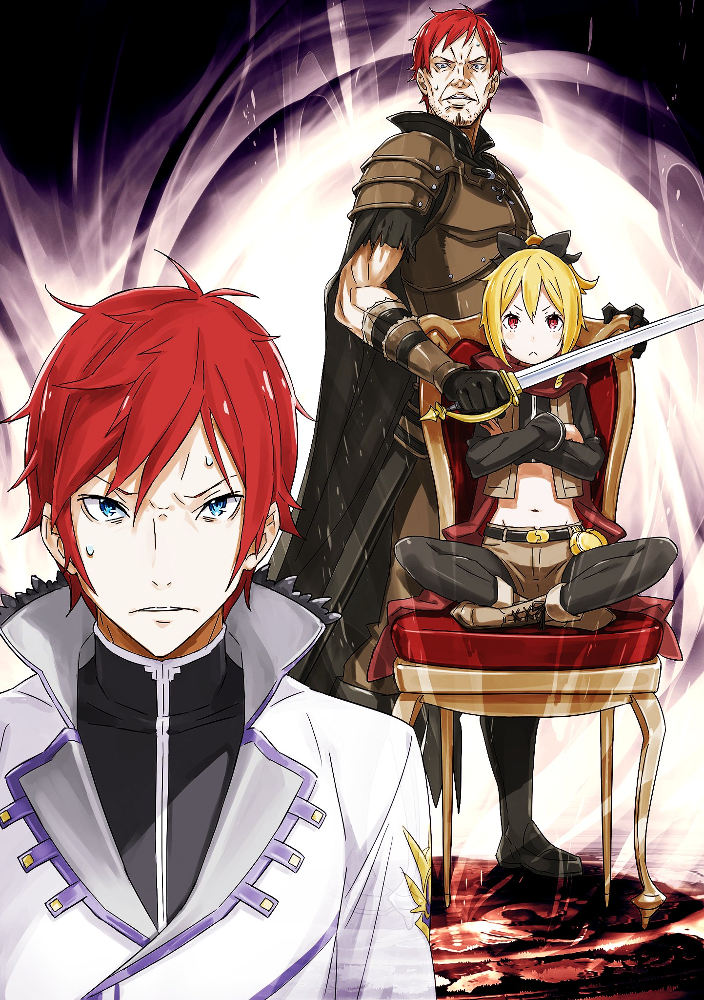

※ ※ ※ ※ ※ ※ ※ ※ ※ ※ ※ ※ ※

— «Прости, что не смог помочь в самый ответственный момент. Мне остаётся лишь сожалеть о своей неверности».

Под пристальными взглядами всех присутствующих в комнате Райнхард извинился.

При виде склонившего голову Святого Меча все растеряли слова. Легко было бы отвергнуть его извинения, но даже формальное утешение давалось с трудом.

Ведь факт оставался фактом: в те несколько часов, когда его сила была нужна до зарезу, Райнхард отсутствовал, и никто не знал, где он.

Невозможно было не думать о том, что если бы он был с ними во время штурма ратуши…

Поэтому ни у кого не хватило духу даже на формальное отрицание.

Однако…

— «И не говори, идиот. Ты хоть представляешь, в какой мы были заднице без тебя?»

…это не относилось к Субару, который подошёл к рыжеволосому герою и ткнул его кулаком в грудь.

Получив удар в грудь, Райнхард виновато посмотрел на Субару. Увидев его нехарактерно пристыженный вид, словно его отчитали, Субару фыркнул.

— «И вообще, раз уж пришёл, мог бы и на пятнадцать минут раньше. Из-за тебя мне пришлось толкать речь, которая мне совершенно не подходит. Вообще-то, это тоже твоя работа».

— «Прости… Но это была хорошая речь, в твоём духе. Даже если бы меня попросили о том же, я бы не смог выступить с такой же воодушевляющей речью. Ты был правильным выбором».

— «По-моему, от нас с тобой требовались совершенно разные речи».

Субару ещё раз ткнул кулаком в грудь Райнхарда, который горько улыбался. Затем он указал пальцем прямо в лицо опустившему глаза герою.

— «Райнхард».

— «…Что такое?»

— «Твоё появление — это не сто, а тысяча воинов в подмогу. Я ведь могу на тебя рассчитывать, верно? Я на тебя полагаюсь!»

— «————»

Его сила стоила десяти тысяч воинов. Оценки Субару в сто или тысячу были даже скромными.

На этот исполненный ожиданий вопрос Субару Райнхард моргнул голубыми глазами. Но замешательство быстро исчезло, и губы Райнхарда тронула улыбка.

— «Да, можешь положиться на меня. Если ты этого желаешь, я отвечу на твои ожидания».

— «Может, перестанешь говорить так, будто пытаешься порадовать любительниц слеша? Ну да ладно… В общем, раз так, давайте, ребята, выскажите ему всё, что хотели, пока есть возможность».

Увидев, что с лица Райнхарда исчезло первоначальное напряжение, Субару улыбнулся и обернулся. Он обвёл взглядом остальных, до сих пор молчавших, и указал на Райнхарда.

— «В такие моменты хуже всего, когда с тобой излишне церемонятся. К тому же, когда ещё выпадет шанс отчитать Святого Меча, который сам этого жаждет? Давайте, давайте».

— «————»

— «А когда вдоволь его отчитаете, поговорим. Поговорим о том, как спасти всех».

Выпятив грудь, заявил Субару.

Кто-то при этих словах затаил дыхание. Только Гарфиэль и Отто, как понял Субару, усмехнулись, узнав привычное позёрство Субару.

Ну, достаточно и того, что пара человек видит его насквозь.

Ведь он только что произнёс речь о том, что не нужно всё взваливать на себя.

※ ※ ※ ※ ※ ※ ※ ※ ※ ※ ※ ※ ※

После того, как каждый высказал Райнхарду своё мнение (подробности опустим), обсуждение плана по возвращению города возобновилось.

Правда, кроме присоединения Райнхарда и Отто, заметных улучшений в ситуации не было. Количество врагов, которых нужно было одолеть, и план одновременной атаки на башни управления остались прежними.

— «Кстати, Райнхард, где ты был и что делал всё это время?» — внезапно спросил Субару, когда они сели в круг для обсуждения.

При этом вопросе лицо Райнхарда омрачилось. Сегодня он только и делал, что хмурился.

— «И Фельт с тобой нет, так что вопросов накопилось много. А, я не обвиняю, ясно? Этот момент мы вроде как закрыли во время предыдущих высказываний».

— «Оставим в стороне формулировки Нацуки, но меня это тоже интересует. Не думаю, что Святой Меч прятался от страха, но хотелось бы услышать убедительную причину», — поддержала Субару Анастасия.

Судя по тому, как она покосилась на Субару, ей Юлиус тоже доложил.

О том, что прямо перед началом беспорядков Райнхард и Фельт встречались с Хейнкелем.

Омрачившееся лицо Райнхарда в ответ на вопрос было тому подтверждением.

Как и в случае с Вильгельмом, отношение семьи Астрея к Хейнкелю было крайне неловким. Грубо говоря, их отношение напоминало…

— «…постаревших родителей, которые не знают, как обращаться с сыном-профессиональным хикикомори, просидевшим дома десять с лишним лет, и боятся лишний раз его тронуть…»

— «Прошу прощения, что прерываю странные фантазии господина Нацуки, но как поступим? Если господину Райнхарду трудно говорить, я могу рассказать», — прервал Субару, вспоминавшего сюжет вечерних новостей о затворниках, Отто, подняв руку. Его обеспокоенный взгляд был направлен на Райнхарда, а говорил он так, будто знал все детали.

— «Кстати, вы с Райнхардом пришли вместе. Неужели вы всё это время были вместе?»

— «Нет, не совсем так. Я присоединился к господину Райнхарду в самый последний момент… но обстоятельства мне почти полностью известны».

— «Спасибо, Отто. Но это проблема моей семьи. Хотя говорить об этом нелегко, будет правильнее, если расскажу я».

Райнхард покачал головой, отвергая предложение Отто.

Затем он закрыл глаза, и через мгновение выпрямился.

— «Во-первых, как я уже неоднократно говорил, позвольте мне ещё раз извиниться. Я, кто должен был первым прийти на помощь, не мог присоединиться несколько часов, и я глубоко сожалею об этом».

— «…Наше мнение по этому поводу мы уже высказали. Мы не можем простить всё и сказать, что проблемы нет. Но ты нужен нам в предстоящей битве. Если ты раскаиваешься, докажи это своими ратными подвигами».

— «Так и поступлю, Юлиус… Когда прозвучало первое сообщение Культа Ведьмы, мы с госпожой Фельт были вызваны в один из уголков Второго района. Нас вызвал вице-капитан Хейнкель».

Начав рассказ, Райнхард назвал Хейнкеля вице-капитаном строгим голосом.

То, что они отец и сын, было общеизвестно. Но то, что он назвал отца по должности, ясно давало понять — их отношения выходят за рамки простых родственных уз.

— «Удивительно, что Фельт согласилась на встречу после той ссоры».

— «Госпожа Фельт и сама наверняка хотела отказаться. Но когда речь зашла о правах лорда на земли Астрея, у неё не осталось выбора. Мы не знали, чего он потребует… но госпожа Фельт взяла меня с собой и отправилась на место встречи».

— «И чем закончились переговоры?..»

— «Прости, но это слишком сильно затрагивает внутренние дела королевских выборов. Был бы признателен, если бы мы могли избежать упоминания этого. Скажу лишь, что переговоры шли не гладко».

Голос Райнхарда понизился, намекая на трудности переговоров.

Да и Фельт была прямолинейной и не скрывала своей враждебности. Учитывая подлую натуру Хейнкеля, нетрудно представить, как накалились страсти во время разговора.

И в разгар этих переговоров…

— «…прозвучало первое сообщение от Культа Ведьмы. Я не поверил своим ушам, но тут же понял, что нужно действовать. На самом деле, я был готов немедленно вмешаться в случае любой чрезвычайной ситуации. Я даже сообщил другим слугам, как связаться со мной при необходимости».

Этим способом связи и был тот самый сигнал — магия, запущенная в небо.

Когда появилась Сириус, если бы Рачинс подал сигнал, Райнхард прибыл бы на место примерно через тридцать секунд. В его словах не было лжи.

И всё же, услышав явную угрозу в сообщении Культа Ведьмы, Райнхард не сдвинулся с места. Он не бросился туда, где был нужен, а вместо этого молчал несколько часов.

Почему?

— «Ты ведь наверняка понял, что сообщение шло из ратуши. У тебя был вариант броситься туда… Почему ты не пришёл?»

— «————»

Он не обвинял. По крайней мере, не собирался, но голос звучал жёстко.

Некоторые мысли всё же не давали покоя. Если бы Райнхард был с ними во время ожесточённой битвы за ратушу — возможно, Круш не пришлось бы страдать и бороться до сих пор. И правая нога Субару, возможно, избежала бы этой непонятной трансформации.

Не только Субару смотрел на Райнхарда всё строже.

Под взглядами всех присутствующих в комнате Райнхард, до этого говоривший довольно гладко, замолчал и снова опустил глаза.

Длинные ресницы обрамляли глаза, которые, казалось, колебались произнести следующие слова.

Но герой справился с внутренним конфликтом всего за несколько секунд и продолжил прерванный рассказ.

— «Вице-капитан Хейнкель… взял госпожу Фельт в заложники».

— «…………»

— «Это моя… непростительная ошибка. Он схватил госпожу Фельт, приставил меч к её горлу и лишил меня возможности действовать. Поэтому я не мог пошевелиться».

Теперь стало ясно, почему Райнхарду было так трудно произнести эти слова.

Его госпожу, которой он должен был служить верой и правдой, взял в заложники не кто иной, как его собственный отец.

Какое унижение и стыд, должно быть, терзали сердце Райнхарда.

— «…То есть, что? Этот… вице-капитан… был пособником Культа Ведьмы?» — пробормотал Субару, пытаясь осознать шокирующее признание и сочувствуя Райнхарду.

Какой жестокой была бы эта правда. Он слышал, что Культ Ведьмы скрывается среди обычных людей, и неизвестно, кто из них культист. Но мысль о том, что предатель может оказаться среди своих, была невыносима.

Особенно сейчас, узнав сущность других Архиепископов Греха, помимо Петельгейзе.

Культ Ведьмы — это сборище полных отбросов общества, до мозга костей.

— «Если бы это было так… Как бы я себя чувствовал тогда?»

— «Что?»

Однако на вывод Субару — вывод, с которым согласилась примерно половина присутствующих, — Райнхард ответил как-то уклончиво.

Субару удивился его реакции. Но другая половина — Анастасия, Юлиус и Отто — выглядели так, будто пришли к иному заключению.

— «Вице-капитан не связан с Культом Ведьмы… По крайней мере, в его словах после захвата госпожи Фельт не было ничего, что указывало бы на это».

— «Не… Не может быть. То есть, может, конечно… но тогда почему? Зачем брать Фельт в заложники? Какой в этом смысл?..»

Собираясь закончить фразу, Субару вдруг понял.

Угрюмое выражение лица Райнхарда и подавленные лица Отто и остальных. Увидев их, ему захотелось рассмеяться над собственным выводом.

Но смеяться было нельзя. Ситуация была безнадёжной. Значит, поступок Хейнкеля…

— «Неужели… он хотел просто удержать тебя на месте?»

— «————»

— «Он понял из сообщения Культа Ведьмы, что город в опасности… и поэтому, чтобы по-быстрому защитить себя, решил удержать рядом самую сильную боевую единицу?»

— «…Вице-капитан сказал так: „Твоя драгоценная госпожа и твой отец здесь. Неужели ты бросишь нас и побежишь к каким-то незнакомцам?“»

— «И это говорит отец?!»

Вскипев, Субару ударил кулаком по полу.

Весь этот день, с самого утра, его постоянно охватывала эта ярость. Но он и подумать не мог, что испытает такой гнев по отношению к кому-то, не связанному с Культом Ведьмы.

— «Мне нечего было возразить. Разумеется, госпожа Фельт сказала, что это блеф. Просила не обращать на неё внимания и идти помогать другим. Но остаться там было моим решением. Винить нужно только меня».

— «Да как так-то?! Кто здесь не прав, ясно же всем присутствующим!»

— «И тем не менее, выбор сделал я».

Несмотря на крики Субару, Райнхард не уступал, принимая вину на себя.

Упрямый Райнхард, похоже, не собирался менять свою позицию, что бы ему ни говорили. Субару раздражённо цыкнул языком и попытался грубо успокоиться.

— «В общем, так мы и застряли в патовой ситуации. После этого ничего особенного не произошло. Я не мог никак отреагировать на последующие сообщения… и госпожа Фельт меня сильно отругала».

— «А что стало с Фельт? Почему её нет с вами?» — спросила Анастасия у горько усмехнувшегося Райнхарда.

Она теребила свой шарф с непроницаемым выражением лица, беспокоясь о местонахождении отсутствующей Фельт.

— «Пробыть столько часов заложницей… это, должно быть, сильно измотало её морально. Раз ты сейчас здесь, Райнхард, значит, проблема решена, я думаю?»

— «Да, вы правы. Госпожа Фельт сейчас в убежище, она воссоединилась со своими слугами. Вице-капитана мы тоже задержали, он под их присмотром».

— «Задержали… поймали его?»

— «Этого он заслужил. Хотя без помощи Отто добиться этого было бы непросто».

— «И тут всплывает имя Отто?»

Субару нахмурился, услышав имя Отто, который до этого момента никак не фигурировал. Отто же, дождавшись своего выхода, слегка кашлянул, привлекая внимание.

— «Именно так. Хотя то, что я оказался на месте происшествия, было результатом целой череды случайностей. Но поскольку я знал об отношениях между вами тремя, то, увидев ситуацию, сразу понял, что к чему».

Проблемы дома Астрея и земельные дела Фельт.

Плюс к этому он стал свидетелем сцены, где Хейнкель держит Фельт в заложниках, удерживая Райнхарда. Даже самому несообразительному стало бы ясно, что происходит.

— «Я тоже понимал, что остаться без помощи господина Райнхарда в борьбе с Культом Ведьмы — это худший из возможных сценариев. У меня кровь застыла в жилах, но я понял, что нужно что-то делать».

— «И тогда Отто отвлёк внимание, как-то освободил Фельт. Райнхард смог действовать, и вот вы здесь… так?»

— «К счастью, благодаря вашей великой речи, господин Нацуки, нам не пришлось долго думать, где встретиться. Хотелось бы действовать быстрее, но у меня тоже были свои трудности».

Хотя и кратко, но Райнхард кивком подтвердил вклад Отто.

Опять Отто незаметно отличился там, где никто не видел — надёжный парень.

— «Но, братец Отто, где ты сам-то был до этого? Честно говоря, с твоей-то силой шататься по городу — это чистое самоубийство, не иначе», — спросил Гарфиэль.

— «На этот счёт были свои перипетии… Ладно, расскажу».

Кашлянув, Отто указал на выход из ратуши.

— «Как и планировалось утром, я в одиночку отправился в Торговую Компанию Мьюз. Чтобы попросить господина Киритаку возобновить переговоры. Он за ночь остыл, так что проблем с возобновлением переговоров возникнуть не должно было, но…»

— «Но?»

Судя по тому, как он оборвал фразу, Субару предположил, что именно тогда прозвучало сообщение.

Однако Отто покачал головой и сказал:

— «На Большой площади Третьего района, включая Торговую Компанию Мьюз, появился Культ Ведьмы… Архиепископ Греха. Он устроил переполох, и так стало известно о нападении Культа Ведьмы».

— «Архиепископ Греха?.. То есть до сообщения?»

— «Да. Верно, до сообщения».

Отто кивнул удивлённому Субару, который подался вперёд.

Впрочем, если подумать, в этом не было ничего невозможного. Сириус и Регулус тоже начали действовать до сообщения.

Кроме Капеллы, которая, вероятно, атаковала ратушу, другие свободные Архиепископы Греха вполне могли действовать в Пристелле, и…

— «Подожди, Отто».

— «————»

Голос Субару понизился, и во взгляде Отто появилась боль.

Его сочувствующий вид подтвердил догадку, возникшую в голове Субару.

Сириус и Регулус столкнулись с Субару и остальными, так что это были не они. Капелла тоже должна была участвовать в штурме ратуши.

Значит, оставался только один кандидат на роль Архиепископа Греха, появившегося перед Отто.

— «Ты столкнулся с Архиепископом Греха „Чревоугодия“?»

— «…Да. Он сам так представился. Причин лгать у него не было, так что, думаю, это правда. Архиепископ Греха, назвавшийся на Большой площади, показался мне ещё ребёнком».

Показания Отто совпадали с тем, что видел Субару — с Роем Альфардом.

Критерии отбора Архиепископов Греха знать не хотелось, но «Чревоугодие», по крайней мере внешне, был ребёнком. Ребёнком в лохмотьях, грязным. Ребёнком с неприятной усмешкой.

— «Сначала люди подумали, что это просто невоспитанный ребёнок, и кто-то сделал ему замечание. Это был охранник из Торговой Компании Мьюз, думаю, один из „Чешуи Белого Дракона“. Он первым был повержен „Чревоугодием“. Буквально раздавлен в лепёшку».

— «…………»

— «Когда одного человека расплющило, хочешь не хочешь, пришлось поверить. „Чешуя Белого Дракона“ тут же мобилизовалась и окружила его, но это было бесполезно».

С побледневшим лицом Отто скупо описал произошедшее.

«Чревоугодие», словно танцуя, небрежно раскидал нападавших наёмников. Ещё страшнее было обоняние «Чревоугодия» — чутьё, не позволявшее добыче уйти.

— «В такой ситуации люди на улице, конечно, бросились бежать кто куда. Но он этого не позволил. Что он сделал, я, честно говоря, так и не понял. Но атаки „Чревоугодия“ настигали даже тех, кто был далеко. Даже тех, кто был в зданиях».

— «Какова… была его цель?»

Спросив это, Субару понял, что вопрос бессмысленный.

В действиях Культа Ведьмы, в их целях не было никакой логики. И действительно, у Отто не нашлось ответа на вопрос Субару, он лишь покачал головой.

— «Кто знает. В любом случае, это была катастрофа. Попытаешься сбежать — и получишь удар в спину. Практически безвыходное положение… Если бы не господин Киритака, меня бы здесь не было, я думаю».

— «Киритака что-то сделал?»

— «Он, видимо, был человеком предусмотрительным. В кабинете главы Торговой Компании Мьюз был потайной ход, ведущий из здания в подземный водный канал. Я выбрался оттуда на небольшой лодке. Когда я убегал, я видел, как господину Киритаке ранили спину».

— «————»

— «Из Третьего района я еле унёс ноги. Потом прозвучало сообщение Культа Ведьмы, и я не мог неосторожно передвигаться по городу, поэтому бродил очень осторожно. И вот так я наконец наткнулся на ту сцену, о которой говорил».

То есть на сцену, где Райнхард был обездвижен.

Теперь всё стало на свои места, и Субару понял, что Отто тоже с трудом пережил эти испытания.

Однако в его рассказе беспокоило вот что:

— «Почему Киритака так поступил? Судя по твоему рассказу, он пожертвовал собой, чтобы спасти тебя. Мне так послышалось».

— «…Да, так и есть. Господин Киритака пожертвовал собой, чтобы я смог сбежать. Последний удар он получил, когда заталкивал меня под пол, прикрывая собой».

— «Зачем ему это…»

У Субару почти не было представления о Киритаке. То немногое, что было, сводилось к образу побледневшего, срывающимся голосом человека, в панике швырявшего магические камни. Конечно, он понимал, что это не вся суть человека.

Но он никак не выглядел настолько сильным мужчиной, способным рискнуть жизнью ради другого.

— «Возможно, сыграла роль гордость торговца — ведь я был гостем, которого он пригласил в свою компанию, — но, я уверен, в глубине души была другая причина. Более… понятная».

— «Понятная причина?»

— «Неужели не понимаете? Это вы, господин Нацуки».

Отто твёрдо заявил это сбитому с толку Субару.

Субару растерялся от внезапного упоминания своего имени.

Увидев его реакцию, Отто с некоторой досадой опустил глаза и сказал:

— «Трудно представить, что творилось в душе господина Киритаки, когда он видел, как гибнут его подчинённые от рук Архиепископа Греха. Но, я уверен, у него одновременно было и чувство долга, желание что-то предпринять. И его надеждой стали вы, господин Нацуки».

— «…………»

— «После вашей встречи накануне господин Киритака знал, что вы в городе. Как и о ваших заслугах в победе над „Ленью“. Поэтому вполне естественно, что он связал с вами свои надежды. И то, что он в первую очередь отправил меня, было сделано в расчёте на то, что я смогу связаться с вами».

Объяснение Отто было логичным и легко укладывалось в голове Субару.

Но это была лишь теория.

Головой он всё понимал. И решение взять на себя ответственность было верным.

Но неужели опять? Неужели все ждут этого от Субару?

Неужели на никчёмного, беспомощного неудачника возлагают надежды на спасение целого города?

— «Господин Нацуки, не поймите меня неправильно».

Эти слова остановили Субару, на лице которого уже готова была появиться циничная усмешка.

Отто смотрел прямо на него, словно заглядывая в душу. Увидев напряжённое лицо Субару, он пожал плечами и сказал:

— «Господин Киритака — один из руководителей города, и, думаю, он много о чём размышлял. Понимаю, что вы тоже колеблетесь, думая о том, как взвалить на себя судьбу города. Но я уверен, что ожидания господина Киритаки от вас были куда проще».

— «…То есть?»

— «Это же очевидно. Для господина Киритаки это город, где живёт любимая им женщина. Прежде чем думать о спасении города как такового, он надеялся, что вы спасёте любимую им женщину».

— «————»

— «Он так и сказал, когда толкал меня под пол».

В общем, Отто хотел сказать, чтобы Субару не брал на себя слишком много.

Он видел, как Субару шатается под тяжестью самовольно взваленной на себя судьбы города, и эти слова были сказаны из сочувствия. И они неожиданно сильно задели тщеславное сердце Субару.

Лицо Субару вспыхнуло, ему стало стыдно за себя.

Какая ещё судьба города, какие ещё надежды и ожидания толпы, какой абсурд.

Как глупо смотреть на то, что нужно защищать, через призму бездушного понятия «город».

Субару должен защищать не эти формальные, жёсткие слова, а каждого отдельного человека, из которых этот город состоит. Каждую жизнь.

И у каждой этой жизни есть свои дорогие люди, и именно эти связи он должен спасти.

— «Стало легче от мысли, что нужно нести не одну огромную ношу, а бесчисленное множество маленьких?»

— «Потрясающе. Вроде бы просто другой взгляд на вещи, а как-то сразу стало реальнее».

Поддерживающие способности Отто были настолько высоки, что Субару действительно был ему крайне признателен.

Лицо Субару, до этого опущенное, поднялось, и Отто выглядел довольным этим результатом.

— «Кажется, у вас хорошие отношения. Даже немного завидно смотреть», — пошутила Анастасия, увидев, что разговор подошёл к концу. Субару и Отто, сидевшие в кругу, но говорившие почти лицом к лицу, смутились.

Затем, когда все снова посмотрели друг на друга, Анастасия склонила голову.

— «Кстати, судя по вашему рассказу… с Торговой Компанией Мьюз всё плохо?»

— «По правде говоря, неизвестно. Я видел, как ранили господина Киритаку, но было ли это ранение смертельным, я не знаю».

— «Неужели цель „Чревоугодия“ — бессмысленная жестокость? Мне всё же не верится, что он устроил это бесчинство без всякой причины», — вмешался Юлиус с суровым лицом.

Его слова прозвучали на удивление утвердительно.

— «Что-то ты так уверенно говоришь. Есть какие-то основания?»

— «…Нет, чёткой причины я назвать не могу. Скажем так, это впечатление от нашей схватки в ратуше. Я считаю, что его не следует считать простым хулиганом, действующим ради забавы».

С этим Субару был согласен. Он был не просто хулиганом, а злостным хулиганом.

Правда, это впечатление, похоже, отличалось от того, что имел в виду Юлиус.

— «Согласно сообщению, требование „Чревоугодия“ — это искусственный дух, верно? Неужели он искал его?»

— «Как вариант. Но более серьёзная проблема в том, что само существование этого „искусственного духа“ под вопросом. Действительно ли такое существо существует?» — возразил Райнхард на предположение Субару.

Его сомнение, вероятно, разделяли многие, кто слышал требование из сообщения.

Ответ на этот вопрос был только у Субару и Анастасии. Субару невольно посмотрел на Анастасию, но та, как и ожидалось, сохраняла невозмутимое выражение лица. Видимо, раскрывать карты она не собиралась.

— «Прошу прощения, один момент», — сказал Отто, подняв руку и привлекая внимание, пока Субару колебался.

На его лице промелькнула тень беспокойства, и он вздохнул с оттенком обречённости.

А затем сказал:

— «Насчёт этого искусственного духа я ничего не знаю. Но что касается другого требования, требования „Гнева“, — „Книги Мудрости“…»

Он сделал паузу, немного поколебался и произнёс:

— «Простите… Её в этот город привёз я».

※ ※ ※ ※ ※ ※ ※ ※ ※ ※ ※ ※ ※
