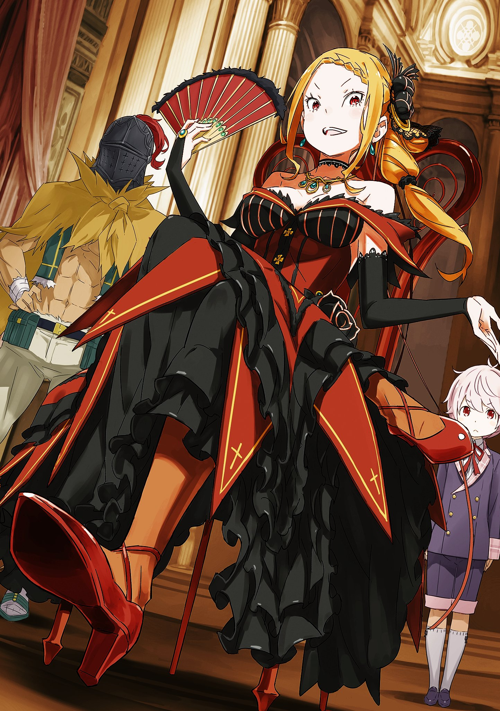

※ ※ ※ ※ ※ ※ ※ ※ ※ ※ ※ ※ ※

Отто поднял руку, и его слова прозвучали как гром среди ясного неба, повергнув всех в комнате в шок.

Существование «Книги Мудрости», в котором сомневались, только что подтвердил не кто иной, как свой человек. Удивление было естественным, но больше всех изумился Субару.

— «К-как у тебя оказалась «Книга Мудрости»?»

— «Во-первых, позвольте внести ясность, чтобы не было недопонимания. Я действительно привёз в город нечто, что следует назвать «Книгой Мудрости»… в этом нет ошибки. Однако это не значит, что я её владелец. Требования Культа Ведьмы для меня самого стали полной неожиданностью.»

— ««Нечто, что следует назвать»… какая-то уклончивая формулировка. Что ты имеешь в виду?»

Отто ответил потрясённому Субару, но Анастасия тут же ухватилась за его слова. В ответ Отто обвёл всех взглядом и сказал:

— «Вам известно о «Книге Мудрости»? Проще говоря, это Евангелие, которым владеют культисты Ведьмы… сомнительная книга пророчеств, которая якобы описывает будущее своего владельца. Говорят, это её первоисточник, оригинал. И точность у неё якобы на порядок выше.»

— «Оригинал Евангелия, значит… Возможно, так говорить неуместно, но я чувствую нечто схожее с пророчествами Камня Драконьей Летописи. Хотя достоверность и положение тех, кто ими пользуется, сильно различаются.»

— «Я не видел своими глазами, как Камень Драконьей Летописи или Евангелие записывают будущее, так что мне сложно судить… Эффект «Книги Мудрости» тоже не подтверждён. Когда я её заполучил, большая часть книги уже сгорела, она была похожа на обломки.»

— «Сгорела… обломки…»

Слова Отто заставили Субару вспомнить судьбу двух «Книг Мудрости». Одна принадлежала Беатрис и сгорела вместе с обрушившейся Запретной Библиотекой. Другая принадлежала Розваалю, была сожжена Рам и утеряна в «Святилище».

Сложно сказать, насколько можно верить словам создательницы, Ехидны, но если верить ей, то «Книг Мудрости» было две — и обе должны были сгореть.

Значит, то, что нашёл Отто, было их остатками, обгоревшими страницами.

— «Понятно. Теперь и мне ясно, почему ты, Отто, принёс её в Пристеллу. Ты обратился к Мастеру Реставрации Дартсу, верно?»

— «…Именно так.»

Анастасия, похоже, первой пришла к выводу, и Отто немногословно кивнул. Увидев этот обмен репликами, Юлиус и Райнхард тоже приняли понимающий вид, но Субару услышал незнакомое слово и не понял подробностей.

— «Эй, не понимайте друг друга без меня! Что это за Мастер Реставрации?»

— «Как и звучит — маг, специализирующийся на Магии Ян для восстановления предметов. Дартс, который живёт в этом городе, особенно известен в этой области. Даже если книга сгорела больше чем наполовину, он, вероятно, сможет восстановить её с высокой точностью, если дать ему время.»

— «Я связался с господином Дартсом и передал ему остатки «Книги Мудрости». Так что сейчас книга должна храниться в его мастерской.»

Благодаря свидетельству Отто местонахождение «Книги Мудрости» наконец стало известно.

— «И всё-таки, братец Отто, когда ты успел встретиться с этим типом?» — поинтересовался Гарфиэль.

— «Вчера, после того как переговоры в Торговой Компании Мьюз провалились. Я отделился от вас и действовал в одиночку, тогда и посетил господина Дартса. Мы заранее всё обсудили конфиденциально, так что он с большим энтузиазмом взялся за дело, но…»

В результате сегодняшних беспорядков всплыло название «Книги Мудрости», и Отто, должно быть, забеспокоился.

Эти объяснения прояснили, почему предположительно сгоревшая «Книга Мудрости» существует и как она попала в город. Субару это понял. Но чего он не мог понять, так это истинных мотивов Отто. Зачем ему понадобилось восстанавливать «Книгу Мудрости»?

Честно говоря, у Субару не было хороших впечатлений от «Книги Мудрости».

Её создательницей была Ехидна, и эта чёрная книга была связана с Евангелиями Культа Ведьмы. Она была причиной, по которой Беатрис сотни лет была привязана к Запретной Библиотеке, а также толчком, побудившим Розвааля спланировать свои бесчинства, включая события в «Святилище».

Услышав, что она сгорела, Субару, по правде говоря, почувствовал облегчение.

— «Подробности того, как я её получил и зачем хочу восстановить, я опущу. Я лишь хотел прояснить, что «Книга Мудрости» существует и где она сейчас находится. Всё остальное — это уже проблемы нашего лагеря.»

— «Группа из Культа Ведьмы назвала «Книгу Мудрости» по крайней мере одной из своих целей. Как ты думаешь, кто несёт ответственность в этом вопросе?» — спросил Юлиус.

— «Я считаю, что ответственность за действия Культа Ведьмы следует возлагать только на сам Культ Ведьмы. Если вы начнёте говорить иначе, мне придётся ответить вам довольно неприятно.»

Отто не дрогнул перед настойчивостью Юлиуса. Увидев, что взгляд Отто обратился к Анастасии, Юлиус покачал головой.

— «Прости, я сказал лишнее. Разумеется, я не собираюсь возлагать вину на вас. Преступления, совершённые ими, должны быть искуплены наказанием для них самих.»

— «Согласен.»

Отто кивнул на твёрдые слова Юлиуса и мельком взглянул на Субару. Уловив этот вопросительный взгляд, Субару не смог сразу ничего сказать.

Истинные намерения Отто были неясны. Субару и в мыслях не мог его заподозрить, но цель оставалась загадкой. И тут Отто одними губами прошептал Субару:

«Поговорим позже»

Вот что он передал. Вероятно, он собирался объяснить свои истинные намерения. Что ж, тогда этот вопрос можно отложить.

— «Существование «Книги Мудрости» теперь ясно. В таком случае, не стоит отмахиваться и от оставшейся темы — искусственных духов — как от пустых слухов.» — сказал Райнхард.

Когда один вопрос был решён, Райнхард вскрыл новую тему. Это был естественный ход событий, но раз уж Отто раскрыл правду, которая могла поставить его в невыгодное положение, Субару тоже не видел смысла скрывать дальше.

— «Анастасия.»

— «Понимаю. Действительно, непростая история.»

В ответ на ищущий согласия взгляд Субару, Анастасия сняла с шеи шарф. Она разложила его на столе. Все склонили головы, глядя на смирившийся вид Анастасии.

Но следующее её действие заставило всех выпрямиться.

— «Хватит прикидываться спящей, Ехидна. Можешь говорить.»

— «В моём случае, разве не правильнее было бы сказать «прикидываться лисой», Ана?»

— «!..»

Повинуясь зову Анастасии, белый лисий шарф обрёл волю и расправил конечности. Удивление охватило всех, даже Юлиуса и Рикардо.

Похоже, существование искусственного духа Ехидны скрывали даже от членов их собственного лагеря.

— «Хозяйка, я тоже про него не знал. Что это такое?»

— «Прости, что скрывала, Рикардо. И ты прости, Юлиус. Это и есть тот самый искусственный дух, о котором шла речь. Её зовут Ехидна. Мы с ней давно знакомы, она моя… сообщница.»

— «Привет, Рикардо. Забавно приветствовать тебя так, будто мы впервые встретились, хотя я-то тебя знаю. Можешь вести себя так же бесцеремонно, как обычно, я не против.»

Рикардо смотрел на неё как на нечто жуткое, но Ехидна была настроена на удивление дружелюбно. Её манера речи, похоже, смутила Рикардо, но ещё более потрясённое лицо было у Юлиуса.

Узнав о таинственном существе, которое скрывала его госпожа, он, что было редкостью, не смог скрыть волнения в глазах.

— «…Значит ли это, что госпожа Анастасия тоже была заклинателем духов?»

— «Н-нет, не так. Между мной и Ехидной нет контракта заклинателя духов. У меня, похоже, совсем нет таланта к этому. Да и Ехидна, в отличие от обычных духов, не обладает боевой силой.»

— «Верно, я слаба. Наверное, самая слабая среди духов. Настолько бессильна, что даже ты, Рыцарь Духов, не мог меня воспринять.»

— «Вот как… Нет, но в таком случае…»

Анастасия и Ехидна развеяли сомнения Юлиуса. Однако он не мог на этом остановиться и перевёл взгляд на Субару, который до этого был в стороне.

Его жёлтые глаза, в которых читалось напряжение, уставились на Субару.

— «Почему тогда Субару, похоже, знал об этом? Почему он знает то, чего не знаю даже я, её Первый Рыцарь?»

— «Нет, дело не в этом. Это…»

— «Это потому, что моя напарница, Беатрис, тоже искусственный дух. Анастасия рассказала мне, когда Культ Ведьмы выдвинул свои требования… Я и сам узнал совсем недавно, не намного раньше тебя.»

— «Она — искусственный дух?.. Госпожа Анастасия, это правда?»

Юлиус с сомнением посмотрел на Субару, который перебил Анастасию и быстро всё объяснил. Когда Анастасия кивком подтвердила его слова, Юлиус произнёс: «Понимаю», — принял это, на мгновение закрыл глаза, словно обдумывая, а затем глубоко вздохнул.

— «Прошу прощения за свои подозрения. Госпожа Анастасия, мне также жаль, если я доставил вам неприятные чувства. Мне глубоко стыдно за себя.»

— «Не стоит винить себя за то, что я молчала. Это мне скорее следует просить прощения, хорошо?»

Юлиус кивнул Субару и извинился перед Анастасией. Пока Анастасия отвечала на извинения Юлиуса, Рикардо схватил Ехидну со стола.

— «Но ты тоже хороша, хозяйка! Скрывать такое от меня, с кем ты так давно знакома… Я немного расстроен! Неужели наши отношения были такими?»

— «Буду признательна, если ты не будешь обращаться со мной так грубо. Я всё-таки забочусь о своей шёрстке. Было бы жаль испортить очарование Аны.»

— «А ты болтливая. Ну да ладно. Пока что забудем об этом.»

Удовлетворившись тем, что подёргал и помял её, Рикардо отпустил белую лисицу. Приземлившись на стол, она быстро вернулась к Анастасии, обвилась вокруг её шеи и снова приняла вид шарфа.

Столько лет она была там, что неудивительно, как мгновенно исчезала всякая живность в её облике.

— «Вот так вот, искусственные духи тоже существуют… Однако, как и в случае с рассказом Отто, как и «Книгу Мудрости», я не собираюсь её отдавать.»

— «Прости, что молчал. Но я того же мнения. Беако — мой драгоценный партнёр. Я не позволю этим сумасшедшим даже прикоснуться к ней.»

Позиция Анастасии и Субару относительно отказа от требований была абсолютной.

Услышав это, Райнхард кивнул.

— «Я понимаю. Это естественно. Мы не можем принять ни одного их требования. Хотя, возможно, свадьбу с невестой можно было бы проигнорировать…»

— «Нет, это тоже абсолютно НЕЛЬЗЯ! А знаешь почему? Потому что та, на ком этот грёбаный ублюдок собирается жениться, — это Эмилия!»

— «Что?! Госпожу Эмилию похитили?! Я думал, её не видно, потому что она эвакуировалась! Почему вы не сказали раньше?!» — в панике воскликнул Отто.

Райнхард широко раскрыл глаза, а Отто чуть не потерял сознание от шокирующей новости. Видя их реакцию, Субару стиснул зубы, сказал: «Простите», — и продолжил:

— «Это моя вина, её утащили прямо у меня на глазах. Но пока он говорит о свадьбе, Эмилии-тан ничего не угрожает. Поэтому я изобью его, убью его, размажу его и верну её. Абсолютно, абсолютно точно.»

— «Да, так и сделаем. Раз так, это абсолютно непростительно.» — согласился Райнхард.

Когда Субару вскипел от ярости при мысли об образе Регулуса, боевой дух Райнхарда обострился, словно разделяя эту ярость.

Пугающе надёжная аура. Всё-таки его присутствие обнадёживало.

Додумав до этого момента, Субару посмотрел в угол комнаты — на человека, который всё это время присутствовал, но не участвовал в разговоре.

Человек, сидевший на корточках, прислонившись спиной к стене, его лицо было скрыто под шлемом.

— «Эй, Ал. Ты тоже присоединяйся к разговору. С момента окончания речи ты ни слова не сказал. Из-за того типа, которого вы привели, наше главное оружие было обезврежено. Если ты это как-то не компенсируешь, это будет считаться серьёзным промахом.»

Субару подошёл и обратился к Алу, который так и сидел, опустив голову.

Видя вялую реакцию Ала, Субару вздохнул и подумал об отце Райнхарда — Хейнкеле.

Хейнкель, который взял Фельт в заложники и сковал движения Райнхарда.

Это было явное пособничество врагу, а направление меча на кандидата на престол выходило за рамки оскорбления величества и могло расцениваться как государственная измена. По здравому размышлению, за такое полагалась смертная казнь, но каким будет решение?

По крайней мере, по лицу Райнхарда этого понять было нельзя.

— «Прости, братец, но я, пожалуй, пойду.»

— «А?»

Возможно, потому что Субару отвлёкся на Райнхарда, он не сразу среагировал на вставшего Ала. Ал выпрямился и попытался пройти мимо сбитого с толку Субару. Субару поспешно схватил его за плечо и развернул.

— «П-подожди! Что значит «пойду»? Сейчас нам нужен каждый боец, мы не можем тебя отпустить, дурак!»

— «Можешь звать меня дураком, мне всё равно, но рассчитывать на меня как на бойца — вот это настоящая глупость. Пойди в какой-нибудь эвакуационный центр и приведи оттуда кого-нибудь, кто привык сражаться, — пользы будет больше, чем от меня или любой другой помощи. Так что от меня толку не будет.»

— «Будет! Не говори ерунды, не дуйся. Что с тобой вдруг случилось? Ты же не ребёнок, если хочешь что-то сказать — говори!»

— «Только не от тебя, братец, я хотел бы это услышать.»

Он стряхнул руку Субару, пытавшегося его удержать, и из-под шлема на Субару впились глаза.

Невидимый взгляд и необычный тон голоса сковали Субару, по его спине пробежал неприятный холодок.

Это не было ни враждебностью, ни жаждой убийства, но какое-то грубое, необузданное чувство.

Субару где-то уже ощущал это непонятное чувство. Но он не мог понять, что это, не мог придать ему конкретную форму.

Непонимание висело в воздухе, они продолжали сверлить друг друга взглядами, и затем…

— «Меня осенило! Послушайте! — Твой взгляд волнует моё сердце!»

— «Заткнись!»

— «Пи-и?!»

На внезапно вторгшийся беззаботный голос Субару рефлекторно рявкнул. Услышав это, говорившая отпрыгнула и с грохотом упала, опрокинув запасной стол.

С шумом и криками по полу каталась смуглая девушка…

— «Ты… Лилиана?!»

— «Угья-а-а! Локоть! Колено! Боль такая, будто все кости в теле раздробились! Все шесть рёбер сломаны! Точно говорю!»

Прямо перед Субару по полу энергично каталась «Дива» Лилиана.

Видя её неизменное поведение, Субару даже забыл сказать ей, что рёбер у неё не шесть, а гораздо больше, и с облегчением вздохнул.

— «Я волновался, не зная, что с тобой случилось после того, как мы расстались. Рад, что ты в порядке. Я спокоен.»

— «В порядке?! Как вы можете говорить такое, глядя на меня, находящуюся на пороге смерти! Вы что, дырку от бублика вместо глаз имеете?! Вздыхать с облегчением, глядя на корчащуюся в муках красавицу, — это что, садистское хобби?! Меня осенило! Послушайте! — Палец! Ухо! Следующий — глаз!»

— «Да ты в полном порядке.»

Сидя на полу, скрестив ноги, и бренча на льюрире, Лилиана выглядела совершенно здоровой. Её поведение было настолько обычным, что это даже немного настораживало, но воссоединение с ней было радостным событием.

— «Но как ты добралась до городской ратуши? Сейчас же так опасно бродить снаружи…»

— «Разумеется, это потому, что я была с ней, бездарь.»

— «Кх.»

Прежде чем Субару успел спросить о причине благополучия Лилианы, ответ явился сам, высокомерный и надменный.

Стуча высокими каблуками, в конференц-зал вошла ослепительно сияющая женщина в красном. Вся в красном с головы до пят, она обвела комнату взглядом своих глаз цвета крови и…

— «Похоже, все актёры в сборе. Похвально, что вы, чернь, сидели и ждали меня, главную героиню. Запомните это на будущее.»

Женщина прикрыла рот раскрытым веером и самодовольно улыбнулась — это была Присцилла.

Её внезапное появление лишило дара речи всех, включая Субару. Однако первым пришёл в себя не кто иной, как её слуга, Ал.

— «П-принцесса! Вы целы? Я волновался, нигде не мог вас найти.»

— «М-м, Ал? Что значит, ты якшаешься с чернью, вместо того чтобы служить мне? Твой долг и долг Шульта — видеть мой облик, слышать мой голос, вдыхать мой аромат и повиноваться моим приказам. Шульт, заставлять меня искать тебя — это верх непочтительности.»

— «П-прошу прощения, госпожа Присцилла…»

Присцилла холодно ответила обеспокоенному слуге. Из-за её спины, держась за её платье, робко выглянул юный дворецкий. Похоже, Присцилла не только нашла Лилиану, но и спасла своего слугу, после чего гордо прошла через город, кишащий Культом Ведьмы.

— «Какая же чертовская смелость…»

Субару вздохнул, поражённый её действиями, граничащими с безрассудством. Услышав это, Присцилла взглянула на Субару. Со стуком сложив веер, она решительно подошла к нему.

— «Ты там, не двигайся.»

— «!..»

Свистнув в воздухе, кончик веера упёрся Субару в горло.

Как всегда, невероятная скорость. Субару не мог уследить за движением. Но раз Райнхард не шелохнулся, он решил, что враждебных намерений у неё нет.

— «Что тебе нужно? Сейчас идёт важное обсуждение, у меня нет времени на тебя…»

— «Довольно. Та уродливая трансляция… это всё-таки был твой голос.»

— «…И что с того?»

Полагаться на бездействие Райнхарда было довольно жалко, но Субару решил ответить напористой Присцилле дерзко. На его ответ она прищурилась.

— «Очевидно. Я никому не позволю привлекать больше внимания, чем я. Посему я докажу очевидную истину: я стою выше деяний такой бездарности, как ты.»

— «А? Ай?!»

Она резко подняла веер, которым тыкала ему в горло, и ударила его по подбородку, отчего у Субару на глазах выступили слёзы. Сделав это, Присцилла отошла от Субару и величественно села на одно из мест за круглым столом.

— «Дешёвый стул. Сразу видно уровень тех, кто им пользовался.»

Злобно оценив удобство сидения, Присцилла обвела взглядом лица за круглым столом. Затем её накрашенные красные губы растянулись в красивой, но зловещей улыбке.

— «Итак, я позволяю вам рассказать мне о текущей ситуации. Станьте моими руками и ногами, исполните свой долг в полной мере. В награду я одолжу вам свою руку помощи. Будьте благодарны.»

— «Погодите, принцесса! Раз мы нашлись, зачем здесь оставаться? Лучше поскорее убраться из этого опасного места…»

Ал попытался отговорить Присциллу, которая уселась и явно намеревалась участвовать в совещании. Но Присцилла, наоборот, свирепо взглянула на Ала, заставив его съёжиться под железным шлемом.

— «Слушай сюда. Решение остаться в этом городе приняла я. И решение покинуть его тоже приму я. Я определённо не потерплю указаний от других. Тем более, повернуться спиной к этим безумным идиотам и трусливо сбежать? Ты кем меня считаешь?»

— «………»

— «Этот мир устроен так, как удобно мне. А раз так, могу ли я уйти, оставив после себя неприятный осадок? Если называешь себя моим слугой, пойми это, Ал. Если моя сущность — воля небес, то и мои поступки — сама воля небес.»

Воля Присциллы была непоколебима.

Это поняли все присутствующие, и прежде всего сам Ал. Он бессильно опустил плечо своей единственной руки, и юный дворецкий — Шульт — тихо подошёл к нему. Утешающий жест мальчика вызвал у Ала горькую усмешку. Похоже, он тоже принял решение.

— «Отто, можно тебя на пару слов?»

— «Да, конечно.»

За круглым столом начали объяснять ситуацию Присцилле.

Воспользовавшись этой паузой, Субару обратился к Отто. Отто, словно ожидая этого, без малейшего удивления согласился.

— «Гарфиэль, позови, когда здесь продвинутся.» — сказал Субару Гарфиэлю.

Сказав это, Субару вместе с Отто вышел из конференц-зала.

Решив, что нет нужды уходить далеко, он повернулся к нему прямо в коридоре. В глазах Отто, смотревшего прямо на него, не было сомнений. Тема разговора была очевидна.

— «Почему ты вообще решил восстанавливать «Книгу Мудрости»? И когда ты подобрал эти остатки?»

— «Год назад, после того как проблемы в «Святилище» были решены. Когда сильный снегопад, вызванный госпожой Эмилией, растаял в лесу, я осматривал поселение и случайно… нет, не случайно. Я услышал от Рам и целенаправленно искал, не осталось ли обгоревших страниц.»

— «Раз ты нашёл, значит, это была «Книга Мудрости» Розвааля?»

— «Да. Я хотел проверить именно её, так что мне редкостно повезло.»

«Редкостно повезло» — вероятно, это была самоуничижительная отсылка к его обычному невезению. Отто горько усмехнулся, но Субару было не до смеха.

На душе оставался осадок — почему он это сделал?

— «Нацуки, что вы на самом деле думаете о маркграфе Мейзерсе?»

— «О Розваале?»

Вопрос, который Отто задал Субару, когда тот собирался замолчать. Его содержание, казалось, было связано с текущей темой, но в то же время и нет. Субару немного задумался.

— «Ну… Я считаю, что ему нельзя доверять. Учитывая то, что было год назад. Но его цель теперь ясна, и пока он от неё не отступит, я не думаю, что он представляет угрозу. Сейчас мы скорее как сообщники, чётко понимающие намерения друг друга.»

— «Я совершенно не доверяю маркграфу Мейзерсу.»

Отто отрезал решительно, словно говоря, что мысли Субару наивны.

Субару округлил глаза от резкости его слов.

— «Вы упомянули события годичной давности. Да, именно так. События в «Святилище» год назад. Похоже, и до этого он замышлял разное. Вы, Нацуки, и госпожа Эмилия, кажется, слишком легко простили это.»

— «…Не то чтобы простили. То, что он делал, — это полнейшее безобразие, и меня до сих пор это бесит. Но факт в том, что нам нужна его сила. Поэтому нет смысла враждовать, и Эмилия думает так же.»

— «Вот это я и называю наивностью… Хотя я не говорю, что это плохо.»

Отто смотрел на Субару взглядом, полным досады. Субару кое-как смог понять это чувство раздражения.

То есть Отто говорил, что они недостаточно бдительны по отношению к тому, что им сделали. Конечно, Субару понимал, что такая бдительность необходима. Понимал, но…

— «Всё в порядке. Я думаю, вам с госпожой Эмилией так и нужно поступать. Вам двоим сейчас не нужно меняться. Необходимую бдительность, я полагаю, проявляю я.»

— «Необходимую бдительность…»

— «Поскольку я занимаю должность по внутренним делам, мне часто приходится общаться с графом Мейзерсом. За последний год я наблюдал за ним, и, похоже, нет никаких признаков злых умыслов или чувства вины. Но я не знаю, что было до этого года. Возможно, он что-то подстроил с отсрочкой.»

— «———»

Субару замолчал. Бдительность Отто, его опасения — всё это передавалось ему.

Недоверие, которое он питал к Розваалю, было оправданным. То, что поступки возвращаются к совершившему их, — естественный итог. Будь то хорошие или плохие. Нет, особенно плохие.

— «Если он следовал записям «Книги Мудрости», записям о будущем, то, взглянув в книгу, мы наверняка поймём, что он замышлял. Возможно, мы сможем подготовиться к будущим важным событиям, когда придётся делать какой-то выбор.»

— «Значит, ты хотел восстановить книгу… потому что не доверяешь Розваалю?»

— «…Наоборот. Я тоже не хочу подозревать своих. Поэтому я хотел обрести спокойствие. Убедиться, что вам, Нацуки, и госпоже Эмилии не причинят вреда. По крайней мере, удостовериться, что нет никакого неминуемого несчастья. Поэтому я забрал «Книгу Мудрости» и попытался её восстановить… Простите, что действовал самовольно.»

Произнеся извинения, Отто склонил голову.

Но Субару ничего не мог ему сказать. Ему казалось, что у него нет на это права.

Тревоги Отто и способ их развеять.

И то, и другое было тем, о чём должны были бы позаботиться Субару и Эмилия. Более того, все эти хлопоты были ради Субару и Эмилии.

Он осознал, что Отто помогает ему гораздо больше, чем кажется на первый взгляд. Было стыдно, совестно и странно, что он этого не замечал.

Почему Отто так много для него делает? Потому что они друзья?

— «Эту причину я вам не скажу. Это неинтересно.»

Ответ, похоже, был дан после того, как Отто прочитал мысли Субару по его лицу.

Опережённый Отто, который слегка улыбнулся уголками губ, Субару глубоко вздохнул.

— «Да уж, похоже, все вокруг, включая тебя, только и делают, что помогают мне.»

— «Возможно. Я думаю, ваша недавняя трансляция как раз и говорила о том, что это нормально. И я тоже так считаю.»

Отто непринуждённо обратился к Субару, который теребил свои волосы. В ответ на его заботливый тон Субару раздражённо цыкнул языком и понуро опустил плечи.

— «Я всё понял. С «Книгой Мудрости» разобрались. Но проблема в том, что она нужна этим типам. Что будем делать с оригиналом?»

— «Независимо от успеха реставрации, я думаю, её лучше забрать. Высока вероятность, что господин Дартс может пострадать, а я этого не хочу.»

— «План состоит в одновременной атаке на четыре контрольные башни. Мы не можем выделить силы на это.»

— «Хоть я и не боец, но если выбрать водные пути, этого будет достаточно. Как бы я ни выглядел, я мастерски умею обманывать животных, включая водных драконов.»

Жест, которым он прикрыл рот рукой, вероятно, был намёком на его «Благословение Души Слова».

Действительно, если сосредоточиться на бегстве, благословение Отто было весьма значительным. К тому же основные силы врага сосредоточены у контрольных башен. Поскольку у Архиепископов нет подчинённых культистов в качестве рук и ног, шансы Отто были неплохими.

— «Важнее беспокоиться не обо мне, а об атакующей группе. Вам, Нацуки, нужно вернуть госпожу Эмилию. Ответственность велика.»

— «Знаю. Голову этого ублюдка «Жадности» я никому не уступлю.»

В памяти всплыл образ беловолосого злодея. Отвратительный демон, похитивший Эмилию.

Включая то, что он Архиепископ Греха Культа Ведьмы, он был врагом, которого нужно победить во что бы то ни стало.

— «Вернёмся? Скоро объяснения должны подойти к концу.»

Увидев, что Субару собрался с духом, Отто повернул голову к конференц-залу. Субару кивнул ему и собрался вернуться в комнату вместе с ним, но…

— «Господин Субару.»

Низкий голос со стороны лестницы заставил его остановиться.

Он не мог ошибиться, чей это голос. Сверху на него смотрели прищуренные голубые глаза — это был Вильгельм.

— «Отто, возвращайся пока один.»

— «Понял. Я прослежу, чтобы обсуждение шло дальше.»

Увидев Вильгельма, Отто первым вернулся в конференц-зал. Субару ступил на лестницу и направился к Вильгельму, ожидавшему на верхнем этаже.

Поднявшись на один уровень с ним, Вильгельм кивнул.

— «Прошу прощения, что не могу присоединиться к обсуждению. Я лишь доставляю вам неудобства.»

— «Обстоятельства такие. Никто не винит вас, господин Вильгельм. А… госпожа Круш?»

Он слышал, что ситуация плохая. Нет, не просто плохая. Ужасная. И что из-за этого её, как женщину, не хотели показывать людям.

Он вспомнил ужасное состояние своей правой ноги и представил, какие повреждения могла получить Круш в тех же условиях. Одна эта мысль вызывала такое отторжение, что ему хотелось пожалеть о своей способности воображать.

На вопрос Субару Вильгельм тихо опустил глаза.

— «Госпожа Круш просит вас прийти к ней. Могу ли я попросить вас пройти со мной?»

— «Госпожа Круш меня? Н-нет, конечно, я пойду… но вы уверены?»

— «Это её настоятельная просьба. Феликс этому не рад.»

— «…Полагаю, что так.»

Именно Феликс больше всех должен был желать высказать Субару свои обиды.

На верхнем этаже ратуши с Капеллой столкнулись только Субару и Круш. И только Субару мог её защитить.

— «Феликс может сказать что-то невежливое, но прошу вас, не обращайте внимания. И, если возможно, простите его. В глубине души он всё понимает. Просто не может справиться с переполняющими его чувствами.»

— «Я понимаю желание проклинать всё вокруг, когда дорогой тебе человек страдает. Не хотелось бы думать, что тот, кто сожалеет об этом, виноват во всём.»

Если вымещение злобы хоть немного облегчит душу, кто сможет его осудить?

Субару был готов смиренно выслушать ругань.

— «Сюда, пожалуйста.»

Ничего не ответив на слова Субару, Вильгельм повёл его к Круш. По коридору разносился размеренный стук каблуков.

И по пути…

— «Господин Субару, у меня к вам тоже есть одно сообщение.»

— «Что такое? Если это не о госпоже Круш, то…»

— «О двух мечниках, сопровождавших Архиепископа Греха.»

У Субару перехватило дыхание.

Ему стало стыдно за себя, что он совершенно забыл об этом, хотя это и предполагалось. Незаживающая рана Мими от «Благословения Шинигами».

Мечники высочайшего класса… Личности этих искусных воинов, о которых они догадывались.

— «Один из них — Курган «Восьмирукий». Он долгое время был генералом в Империи Воллакия, мастер невероятно мощного меча. Человек, который должен был умереть более десяти лет назад.»

— «Человек, который должен был умереть… Эм, господин Вильгельм?»

— «И второй…»

Вильгельм перебил Субару, который хотел задать вопрос, и закончил фразу.

Его шаги замерли. Субару тоже инстинктивно остановился. Вильгельм замолчал на мгновение, стоя спиной к нему. Субару шагнул вперёд, чтобы заглянуть ему в лицо сбоку… и пожалел об этом.

Не стоило ему смотреть.

— «Второй — «Предыдущая Святая Меча» Терезия ван Астрея. Моя жена, которая должна была погибнуть пятнадцать лет назад во время Великого Похода, проиграв Белому Киту.»

— «———»

Голос, казалось, сохранял спокойствие. Можно было бы сказать, что это признак огромной силы духа.

Но всё это меркло при виде его искажённого мукой профиля.

Сжатые губы, плотно зажмуренные глаза, в которых смешались гнев и печаль, морщинистое лицо, ставшее ещё более смятым, выражение, терзаемое безумной страстью, — его чувства были очевидны.

— «Ваша жена и генерал Империи… Значит, они оба были живы?..»

— «Если бы это было так… нет, это невозможно. И моя жена, и Курган должны быть мертвы. Это неоспоримо. Кто-то оскверняет мёртвых, оставляя их мёртвыми.»

— «Оставляя мёртвых мёртвыми… Что-то вроде некромантии?»

Некромантия и другая магия мёртвых, так называемая магия управления трупами, — знакомое явление в мире вымысла. Конечно, в вымысле и магия воскрешения мёртвых не редкость. Но такой удобной магии не существует.

Это Субару болезненно усвоил за последний год с лишним.

Значит, вероятен не второй вариант, а первый.

— «Запретное проклятие управления трупами. В прошлом существовал тот, кто действительно им владел. Во время Войны Полулюдей — гражданской войны между людьми и полулюдьми, которая была в Лугунике несколько десятилетий назад, — он примкнул к стороне полулюдей и был одним из троих, названных врагами Королевства.»

— «Враги Королевства?..»

— «Герой полулюдей Либре Ферми. Великий стратег Бальга Кромвель. И…»

Вильгельм прервался на мгновение и сказал:

— «Ведьма Сфинкс. Худшее существо, безжалостно пролившее реки крови как людей, так и полулюдей, не изменившись в лице. Единственная ведьма, кроме Сателлы, чьё имя осталось в истории Королевства.»

※ ※ ※ ※ ※ ※ ※ ※ ※ ※ ※ ※ ※
