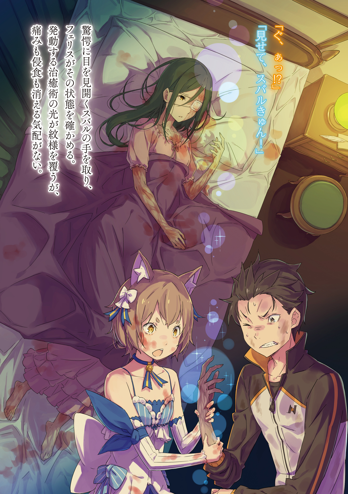

※ ※ ※ ※ ※ ※ ※ ※ ※ ※ ※ ※ ※

Субару охватил ужас, когда Вильгельм произнёс имя ведьмы, о которой он никогда раньше не слышал.

Известные Субару «Ведьмы», кроме Сателлы, были лишь шестью Ведьмами Великих Грехов, которых он встретил в гробнице Ехидны.

Он и подумать не мог, что существуют и другие «Ведьмы». Это было как гром среди ясного неба.

— «Значит, Вильгельм-сан, вы считаете, что эта ведьма Сфинкс как-то связана с нападением Культа Ведьмы?.. То есть, помимо Архиепископов Греха, есть ещё и ведьмы?»

Если так, то основными силами врага были четыре Архиепископа Греха и двое мертвецов. Если к ним добавить ещё и ведьму, то и без того невыгодное соотношение сил становилось бы совершенно безнадёжным.

Но на опасения Субару Вильгельм поднял руку.

— «Прошу прощения. Я выразился неполно. Ведьма Сфинкс была уничтожена ещё во время Войны полулюдей. Она никак не может быть причастна к нынешнему нападению.»

— «Ведьма мертва? Вы в этом уверены? У меня сложилось впечатление, что ведьмы как раз из тех, кто притворяется мёртвым или делает что хочет даже после смерти.»

Так было и с Сателлой, которая появлялась, когда Субару касался табу, и с Ехидной, наслаждавшейся загробной жизнью в замке снов.

Услышав, что ведьма мертва, он не мог быть уверенным, что это правда. Таковы были ведьмы.

— «Не знаю, какое у вас сложилось впечатление о ведьмах, Субару-доно, но Сфинкс лишь условно называли ведьмой. Так её прозвали в королевской армии, сама она никогда себя так не называла.»

— «Сама она?.. Вильгельм-сан, вы были знакомы с ней лично?»

— «Несколько раз во время гражданской войны. Можно сказать, что окончание Войны полулюдей было напрямую связано с тем, что мы заполучили голову Сфинкс. Розвааль, Бордо и моя жена сыграли в этом ключевую роль.»

— «Розвааль?!»

Субару вытаращил глаза от неожиданно всплывшего имени.

В ответ на его реакцию Вильгельм опустил подбородок и посмотрел вдаль с задумчивым видом.

— «Я был знаком с лордом Розваалем позапрошлого поколения. В то время я не был с ним особенно близок… но он мне помог.»

— «Позапрошлого поколения… Ах, да. Имя Розвааль передаётся по наследству, верно?»

— «К сожалению, позапрошлый лорд скончался довольно рано. После этого наши пути разошлись, а нынешнего лорда Мейзерса я знаю лишь в лицо. Впрочем, это уже лишние разговоры.»

Слишком уж неожиданные связи привлекли внимание Субару, но он понимал, что это не главное.

Он кивнул, и Вильгельм продолжил:

— «Итак… Это не Сфинкс, но, вероятно, используется та же система проклятий. Техника управления трупами, в то время их называли солдатами-мертвецами.»

— «Солдаты-мертвецы… У них есть какие-нибудь слабости?»

— «Насколько мне известно, эта техника лишь заставляет трупы двигаться. Она не способна полностью воспроизвести навыки при жизни, это просто осквернение мёртвых, отражающее злую натуру заклинателя.»

— «Но «Восьмирукий» и… она.»

Он запнулся.

Жена Вильгельма стала солдатом-мертвецом, её смерть была осквернена. Хоть Вильгельм и принял это разумом, Субару всё равно колебался говорить об этом вслух.

Вильгельм криво усмехнулся, заметив его колебания.

— «Благодарю за вашу заботу. Но это необходимо. — Да, навыки моей жены и Кургана почти не уступают тем, что были у них при жизни. Это превосходит силы обычного солдата-мертвеца.»

— «Тогда, может, это что-то иное, а не солдаты-мертвецы? В таком случае, ваша жена могла бы быть и не мертва…»

— «Моя жена умерла. Из-за того, что мне не хватило сил.»

Это Субару пытался малодушно цепляться за надежду.

Тихий голос Вильгельма одним ударом разрубил его чувства.

И Субару не нашлось слов, чтобы сказать старому мечнику в ответ.

— «В то время тоже изредка встречались те, кого нельзя было однозначно назвать обычными солдатами-мертвецами. Возможно, у них была предрасположенность к этой технике, или же были другие причины… Вероятно, сила этих двоих объясняется именно этим.»

— «Есть ли способ их победить?»

— «Полностью уничтожить тело. Или же найти проклятую метку где-то на теле и вырезать её. Тогда солдат-мертвец снова станет просто трупом. Так и должно быть сделано.»

Голос Вильгельма, полный решимости, было тяжело слушать.

Он пытался сохранять спокойствие, сосредоточиться на том, что должен сделать. Но дрожь в голосе, сжатые кулаки, широко раскрытые глаза — он не мог скрыть ничего.

— «Простите, что так долго вас задержал. Нельзя заставлять госпожу Круш ждать дольше. Прошу, проходите.»

Вильгельм поклонился и указал на дверь комнаты прямо перед ними. Это была комната в самом конце четвёртого этажа, судя по разбитой табличке — комната отдыха.

Внутри ждала Круш, которая, по его словам, позвала Субару.

Пройдя мимо Вильгельма, Субару направился к двери, стуча ботинками.

Расстояние до двери казалось ему невыносимо большим. Словно подошвы прилипали к полу, мешая ему идти вперёд.

Субару ясно осознавал, что это его собственная слабость, его робость.

— «…Это я. Нацуки Субару. Эм, госпожа Круш?»

Он постучал в дверь и позвал голосом, который, как ему показалось, едва ли был слышен с той стороны. Последовала короткая тишина, а затем дверь медленно отворилась.

На пороге показался Фелис. Но он сильно изменился.

— «Субару-кюн…»

Красные, опухшие от слёз глаза, растрёпанные каштановые волосы. Всё его тело было покрыто чужой, запёкшейся кровью, и у него, видимо, не было сил даже стереть брызги с бледной кожи. Кровь пятнами застыла на щеках и шее.

От этого ужасающего вида у Субару перехватило дыхание.

— «Мне сказали, что госпожа Круш меня звала. Поэтому…»

— «Мм. Она внутри, на кровати… Только… не делай ничего лишнего.»

Голос был твёрдым, а в конце прозвучала даже ненависть.

Но эта ненависть была направлена не на Субару. Скорее, на всё вокруг. Бессильная ярость, ненависть ко всему миру — вот что сейчас владело Фелисом.

Глубоко вздохнув, Субару последовал за Фелисом, который вернулся в комнату.

Комната отдыха была не очень большой. Два ряда длинных столов и стульев, а в глубине — небольшое помещение, отделённое перегородкой. Кровать находилась там.

И на этой скромной кровати лежала она.

— «Господин Нацуки?»

Круш была в сознании и, заметив вошедшего Субару, назвала его по имени.

Субару хотел ответить на её голос, но горло перехватило. Собраться с духом, притвориться спокойным, сказать что-то ободряющее — даже такие простые вещи оказались ему не по силам.

— «Простите… за мой неприглядный вид…»

— «…Нет. Нет, что вы… Нет. Вовсе нет.»

Увидев напряжённого Субару, Круш слабым голосом извинилась. Её страдальческий вид заставил Субару поспешно попытаться её успокоить.

— Круш, облитая кровью Капеллы и поражённая проклятием, была в ужасном состоянии.

На видимых участках кожи — шее, руках, ногах — проступали чёрные сосуды. Несложно было представить, что под одеялом и одеждой кожа поражена так же. Чёрные сосуды, по которым явно не текла кровь, время от времени пульсировали, и было видно, как они сдавливают хрупкое тело Круш, словно извивающиеся змеи.

Её некогда безупречная белая кожа была обезображена.

Разумеется, поражение не ограничивалось шеей и конечностями.

Строгое, утончённое лицо Круш, напоминавшее изящный клинок, её холодная красота — левая половина лица была искажена чёрными пятнами. По какой-то злой иронии правая сторона лица осталась нетронутой, сохранив её красоту. Это лишь подчёркивало контраст между левой и правой сторонами, вопиющую несправедливость осквернения чего-то благородного.

Левый глаз был закрыт повязкой, но Субару боялся даже представить, что под ней.

— «И это… то же проклятие драконьей крови, что и у меня?»

Если так, то не было ничего более жестокого.

Именно потому, что Субару знал Круш Карстен, его душевная боль была безграничной.

Он посмотрел на свою правую ногу. Как и у Круш, кожа была покрыта чёрными сосудами. Но, за исключением ужасающего вида, нога Субару не пострадала. Ни боли, ни пульсации — проклятие никак не проявляло себя.

Но с Круш всё было иначе. Она тяжело дышала, и каждый раз, когда пятна пульсировали, в её вздохах слышалась боль.

— «Фелис…»

«Разве нельзя ничего сделать?» — хотел спросить он, обернувшись к лучшему целителю королевства. Но этот необдуманный вопрос лишь ранил Фелиса, который и так стискивал зубы от собственного бессилия.

Фелис прикусил губу и, опустив голову, впился ногтями в собственную руку. Он лучше всех здесь понимал недостаточность своих сил и сожалел об этом.

Зная их отношения, не было никаких сомнений, что Фелис уже перепробовал всё, что только мог придумать Субару, и даже больше.

— «Госпожа Круш… Что вы хотели… от меня?»

В таком тяжёлом состоянии, зачем она позвала его?

Он не думал, что сможет что-то сделать. Может, она хотела что-то сказать? Попросить отомстить «Похоти», которая сделала с ней такое? Или высказать Субару хоть слово упрёка?

Он был готов принять и упрёки, и проклятия.

На вопрос Субару Круш с трудом открыла рот.

Он наклонился к её губам, прислушиваясь, чтобы не пропустить ни единого слабого выдоха.

И тогда…

— «…Хорошо… что вы… в порядке.»

— «————»

— «Я слышала… что вы получили… то же проклятие… что и я…»

Субару почувствовал, как в её выдохе появилось облегчение, мягкость.

Одновременно он понял, что на самом деле творилось у него в душе, и чуть не умер от стыда за собственное малодушие.

Ему было бы гораздо легче, если бы его обвинили.

Поэтому он усомнился в благородстве Круш, принизил высоту её души. А она всего лишь искренне беспокоилась о Субару, боялась, что он страдает от той же боли.

— «Прости… Прости, госпожа Круш…!»

Чувства смешались — стыд за то, что усомнился в ней, сожаление о том, что она так страдает, боль от того, что не может взять её страдания на себя, — и он сдавленно выговорил слова извинения.

Рука сама собой потянулась и взяла её ладонь, бессильно лежавшую на животе. Чёрные сосуды не ощущались на ощупь. То, что при таком уродливом виде кожа на ощупь не изменилась, делало её страдания ещё более жалкими. Но…

— «Фу… у?..»

— «Кх?!»

Лёгкий выдох Круш — и одновременно боль пронзила горло Субару.

Словно он схватился за раскалённое железо, боль от ладони ударила по всему телу. Субару резко отдёрнул руку от Круш и посмотрел на свою ладонь, откуда пришла боль.

На ней появились чёрные пятна.

— «Что… это?!»

— «Покажи, Субару-кюн!»

Фелис схватил руку стонущего от боли Субару и осмотрел пятна. Свет исцеляющей магии окутал их, но ни боль, ни пятна не исчезали. Однако взамен…

— «Фелис… рука госпожи Круш!»

— «Э?..»

Вслед за Субару, который широко раскрыл глаза, Фелис посмотрел на Круш. И его жёлтые глаза расширились так же, как у Субару.

Левая рука Круш, которую держал Субару, — на тыльной стороне её ладони чернота пятен немного побледнела, хоть и незначительно.

Увидев это изменение и посмотрев на свою правую руку, Субару осенила мысль.

— «Неужели… оно перешло из тела госпожи Круш в моё?..»

Иначе и быть не могло. Изменения на их соприкасавшихся руках были как плюс и минус. Не оставалось сомнений, что проклятие из тела Круш перешло к Субару.

— «Н-но со мной ничего не происходит! Я же столько раз прикасался к телу госпожи Круш, осматривая её… со м-мной…»

Фелис покачал головой в ответ на гипотезу Субару.

Он не радовался появившейся возможности исцеления, а скорее сомневался в правильности гипотезы. Нет, его чувства были иными.

— «Я не могу… облегчить страдания госпожи Круш…»

— «Тогда проверим ещё раз.»

Отстранив растерянного Фелиса, Субару снова встал перед Круш. Она, похоже, ещё не поняла, что происходит, и смотрела на подошедшего Субару влажными глазами. Собравшись с духом, чтобы она не видела его напряжённого лица за повязкой на глазу, он снова, словно проверяя, осторожно коснулся её щеки.

— «…Кх, уу!»

Тут же в мозг Субару вонзилась обжигающая боль, словно по сосудам пустили магму. Через кончики пальцев проклятие, терзавшее Круш, влилось в него, сжигая его нервы.

— «Га-а-а-а-а?!»

Невыносимая боль заставила Субару закричать, горло его дрожало, он отшатнулся. По инерции он упал назад, и его рука оторвалась от Круш.

— «Ах, хах, хаа…»

Лёгкие свело судорогой, глазные яблоки дёргались.

Открывая и закрывая рот, как выброшенная на берег рыба, Субару отчаянно пытался вдохнуть.

— «С-Субару-кюн… ты в порядке?»

Увидев, что его дыхание начало выравниваться, Фелис обратился к Субару. Сознание немного прояснилось, он ощутил твёрдый пол под собой и кое-как сел.

Затем он посмотрел на лицо Круш на кровати и спросил:

— «Ну как, Фелис? Хоть немного… помогло?»

— «А…»

Фелис, проверявший состояние Круш, опустился на пол.

Он тоже должен был увидеть. Щека Круш, поражённая проклятием, слегка очистилась от черноты. Если это лечение возможно, то Круш можно спасти…

— «Нельзя, господин Нацуки…»

Субару поднялся на ноги, собираясь попробовать ещё раз. Но его остановила сама Круш.

Не понимая смысла её слов, Субару хотел спросить, в чём дело.

— «Разве вы не заметили? Ваша… рука…»

— «…Рука?»

Услышав это, он посмотрел на свою правую руку. И наконец понял, что изменилось.

Как и на правой ноге, кожа была покрыта чёрными сосудами. Это было не страшно. Само по себе это не могло поколебать его решимость забрать проклятие Круш.

Но было кое-что явно странное.

По сравнению с пятнами, которые он забрал у Круш, площадь поражения на его руке была слишком большой.

Забранное у неё проклятие покрывало лишь тыльную сторону левой ладони и левую щеку. Проявилось это лишь лёгким осветлением чёрных сосудов после прикосновения Субару.

Но при этом правая рука Субару, которая должна была принять это проклятие, от локтя до кисти с тыльной стороны была сплошь покрыта пятнами. Концентрация была несравнимо выше.

Курс обмена проклятия был далеко не один к одному. Даже десять к одному было бы слишком мягко сказано.

— «Нет, но…»

Станет ли это причиной для колебаний — другой вопрос.

В момент принятия проклятия была боль. Но сейчас, когда оно уже в его теле, не было никаких признаков того, что оно мучает Субару.

По сравнению с Круш, которая страдала постоянно, боль Субару была мимолётной. К тому же, мужчина и женщина — не нужно было и думать, для кого из них уродство от этого проклятия было бы мучительнее.

Что значит почерневшая правая нога или рука, если это ради спасения Круш?

— «Господин Нацуки, нет. …Я не могу принять ваши чувства.»

— «Не говори глупостей. Я выдержу небольшую боль. Думаю, это куда лучший способ испортить тело, чем набить татуху по молодости, а потом жалеть всю жизнь. И боль я тоже могу выдержать. Как ни странно, мне не так уж и тяжело. Поэтому…»

— «Можете ли вы быть уверены, что так будет и дальше? …Мы оба, и я, и господин Нацуки, можем оказаться неспособны сражаться. В нынешней ситуации это… фатально…»

Суждение Круш, которая больше беспокоилась о городе и других, чем о себе. Логически это было правильно, но не всё в жизни можно решить одной лишь логикой.

— «Фелис, остановите господина Нацуки…»

— «Я… я…»

— «Прошу. Господин Нацуки сейчас нужен другим людям, не мне…»

— «Если Субару-кюн постарается… страдания г-госпожи Круш…»

Колебания Фелиса были вызваны тем, что Круш для него была превыше всего. Никто не мог его винить. Никто из присутствующих здесь не был неправ.

То, что никто не был неправ, но это не было правильным, — вот что было неправильно.

— «Нельзя поддаваться минутным эмоциям. Господин Нацуки, прошу вас…»

— «Госпожа Круш, даже так я…»

— «Вы же сами говорили. — «Остальное предоставь мне».»

— «…!»

Умоляющий взгляд Круш не отпускал Субару.

Неужели он действительно произнёс такие сильные слова? И Круш, услышав их, теперь просила его исполнить обещанное?

— «Скажите это… и мне…»

— «————»

— ««Остальное предоставь мне».»

Страдальческая улыбка ждала слов Субару.

Затаив дыхание, Субару провёл языком по пересохшим губам и тихо закрыл глаза.

Его упрекнули за то, что он бросился спасать её, не думая о последствиях, заставили сказать то, чего не следовало бы говорить, так что хотя бы…

— «Госпожа Круш, отдыхайте спокойно.»

— «…Господин Нацуки.»

— «Можете положиться на меня во всём остальном.»

— «…Да.»

Он должен был сыграть требуемую роль и сказать желанные слова.

Услышав ответ Субару, Круш с облегчением выдохнула.

Её веки бессильно опустились — свидетельство того, что до сих пор она держалась лишь на силе воли. Вскоре её дыхание стало тише, и для Круш снова началось время борьбы с проклятием.

— «Прости, Фелис. Мне тоже нужно идти.»

— «Что… мне делать?» — раздался тихий голос, когда Субару, поправив одеяло на Круш, встал. Субару впервые видел Фелиса таким сломленным.

По правде говоря, он хотел бы оставить его рядом с Круш.

Но ситуация и способности Фелиса не позволяли этого.

— «Твоя сила нужна. Я не прошу покидать мэрию. Но я договорюсь, чтобы раненых приносили сюда, если что. Так что, прошу, займись этим.»

— «…Хотя я не могу помочь тому, кому больше всего хочу помочь.»

— «Фелис…»

— «Прости. Сказал глупость. …Оставь нас ненадолго вдвоём.»

Фелис отвернулся и сел на стул у кровати. Субару напоследок легонько похлопал его по плечу и вышел из комнаты отдыха.

В коридоре, как и прежде, неподвижно стоял Вильгельм.

— «Благодарю вас за то, что вняли чувствам госпожи Круш.»

— сказал Вильгельм вернувшемуся Субару. То ли ему было слышно всё, что происходило внутри, то ли лицо Субару было слишком красноречивым.

— «Не такое уж это и благородное дело — внять чувствам. Это меня скорее подбодрили. …Что вообще с моим телом?»

То он принимает проклятие Круш, то само проклятие ослабевает. А если вспомнить ещё раньше — ведьминские гены, «Посмертное возвращение» — всё это было туманно.

Сможет ли он когда-нибудь найти причины и ответы на всё это?

— «Оставим госпожу Круш на Фелиса. Когда всё закончится, хотелось бы ещё раз попробовать то, что мы делали.»

— «С вашей правой рукой всё в порядке?»

— «Выглядит не очень круто, да. Может, если носить длинные рукава и перчатки, будет смотреться нормально?.. Ради спасения одной прекрасной девушки не так уж и страшно получить незаживающий шрам.»

Хоть и с некоторым сопротивлением, но это была и искренняя мысль Субару.

Если другого решения нет, он готов забрать всё проклятие Круш. Пусть его тело почернеет, Эмилия, Рем и Беатрис, надеюсь, простят его.

— «Но всё это — после того, как мы преодолеем эти трудности. Вильгельм-сан, пойдёмте вниз. Наверное, там уже обсуждают захват контрольных башен.»

Боевые силы, вероятно, собрались лучшие из тех, что были в их распоряжении.

Оставалось разобраться со способностями каждого Архиепископа Греха, их совместимостью, распределением задач для захвата и выбором момента для атаки. До срока, назначенного Культом Ведьмы, оставалось всего около шести часов.

— «Субару-доно, по этому поводу у меня есть к вам просьба.»

— «Просьба?»

Вильгельм остановил Субару, который собирался идти к лестнице. Старый мечник кивнул и взглядом указал на дверь позади — туда, где находилась его госпожа, — его глаза выражали беспокойство.

— «Если возможно, я бы хотел, чтобы вы порекомендовали меня на роль уничтожителя «Похоти». Я знаю о её сверхрегенерации и трансформациях, о мощи её Полномочия, и всё же прошу об этом.»

— «Месть за госпожу Круш, вы об этом?»

— «И об этом тоже. Но важнее то, что мне нужно заставить «Похоть» рассказать, что она сделала с госпожой Круш, пока она ещё жива. Ради этого я готов стать даже демоном. Я сражу её мечом и, прежде чем отрубить голову, непременно всё выпытаю.»

Демоническая аура, исходящая от Меча-Демона, ощущалась Субару как волна жара.

Гнев, жажда битвы — непревзойдённая аура Вильгельма пылала жаждой мести за свою госпожу.

— «Ваш настрой похвален, но… как насчёт солдата-мертвеца?»

— «————»

— «Это ваша жена и ваш знакомый, верно? Как бы то ни было, именно вам, Вильгельм-сан, нужно поставить точку.»

— «Субару-доно, внизу ведь Райнхард?»

Вильгельм внезапно прервал Субару, который озвучивал свои опасения.

Субару растерялся, но кивнул. Боевая мощь Райнхарда была незаменима для захвата. Но дело с предыдущим Святым Меча, несомненно, было для него тяжёлым.

— «Не могли бы вы не рассказывать Райнхарду о происхождении солдата-мертвеца?»

— «…А?»

Субару растерялся, не сразу поняв смысл его просьбы.

— «То есть… вы просите не говорить ему о вашей жене? Об этом?»

— «Да, именно так. Я не хочу, чтобы Райнхард… мой внук… встретился с моей женой, ставшей мертвецом. Он наверняка будет винить себя. Из-за меня, не иначе.»

— «Винить из-за вас? Но как такое…»

Он хотел сказать «не может быть», но не смог так легкомысленно бросить эти слова.

Вспомнилось утреннее происшествие, слова Хейнкеля, разрушившие семейную идиллию.

Доказательств не было. Но и опровержения тоже.

Вильгельм обвинил Райнхарда в смерти своей жены. Такое невероятное прошлое не было опровергнуто.

— «Субару-доно, вы знаете, что «Благословение Святого Меча» — особенное?»

— «…Честно говоря, я больше не знаю, чем знаю. Наверное, это благословение, которое было у всех, кого называли «Святым Меча», и оно делало их очень сильными, вот и всё, что я знаю.»

— «В целом, ваше понимание верно. Но единственное отличие «Благословения Святого Меча» от других благословений… в том, что оно передаётся по наследству.»

— «Передаётся по наследству… благословение…»

На выдох Субару Вильгельм кивнул.

Старый мечник закрыл глаза, словно вспоминая какое-то болезненное прошлое.

— «Это благословение передавалось из поколения в поколение со времён первого Святого Меча, Рейда Астреи. Благословение пребывает в крови рода Астрея и всегда выбирает следующего Святого Меча из семьи. Благословение моей жены также перешло к Райнхарду.»

— «Так вот как… благословение передаётся в семье… Понятно, вот оно что. Поэтому ваша жена умерла, и благословение перешло к Райнхарду.»

Осознание пришло, и Субару почти смирился с этим, но что-то зацепило его в голове.

Предыдущая Святая Меча потерпела поражение от Белого Кита и умерла, в результате чего благословение перешло к Райнхарду. Трагическое прошлое, но в каком-то смысле это был закономерный переход.

Но этот ход событий не совпадал с утренней ссорой в семье Астрея.

Горе Вильгельма, насмешки Хейнкеля, молчание Райнхарда — всё это почему-то противоречило этому закономерному наследованию.

И ответ был…

— «Это случилось во время битвы с Белым Китом.»

— «Вильгельм-сан…»

— «…Райнхард унаследовал благословение во время Великой Экспедиции, в которую отправилась моя жена. Во время битвы Богиня Меча отвернулась от неё, и ей пришлось прикрывать отход, будучи просто женщиной.»

— Вот она, правда о расколе семьи Астрея.

Великая Экспедиция по уничтожению Белого Кита — прямо во время битвы благословение перешло к следующему поколению. И на поле боя осталась бывшая Святая Меча, лишённая благословения.

И предыдущая Святая Меча стала арьергардом, сражалась с демоническим зверем, чтобы защитить множество солдат, и… пропала без вести.

— «Это я отнял у неё меч. Я заставил жену, любимицу Богини Меча, бросить меч и стать просто женщиной. Это и привело к её гибели.»

— «————»

— «Богиня Меча не простила жену, предавшую её. Каково было моей жене, лишённой благословения на поле боя, полагаться лишь на меч, который она должна была бросить… Я не мог этого принять. Это правда, я обвинил Райнхарда, унаследовавшего благословение. Я не мог простить своего внука, оплакивавшего смерть бабушки и только что взвалившего на себя непосильную ношу судьбы. Я был глупцом. Я сожалею.»

Сожаление, о котором Вильгельм рассказал Субару прошлой ночью, — вот в чём была его ошибка.

Хотя он и понимал, что Райнхард не виноват, Вильгельм, убитый горем из-за смерти жены, не мог этого признать. В результате семья Астрея раскололась.

— «Я не хочу повторять это снова. Райнхард ни в чём не виноват в смерти моей жены. Моему внуку не за что себя винить.»

Значит, он хотел скрыть это от Райнхарда и разобраться со всем сам?

После его рассказа Субару прекрасно понял его чувства. Он и сам хотел бы, чтобы так и случилось, если бы это было возможно. Но Вильгельм взваливал на себя слишком много.

— «Дело госпожи Круш, дело вашей жены… Вы сломаетесь, Вильгельм-сан. К тому же, даже если вы скроете правду о солдате-мертвеце, неизвестно, где они появятся.»

— «Это пустое беспокойство, Субару-доно.»

— «А?..»

Вильгельм покачал головой в ответ на слова Субару о недостаточной определённости.

И тогда Меч-Демон исказил своё лицо в зловещей гримасе и сказал:

— «…Потому что не может быть, чтобы моя жена не пришла встретиться со мной.»

※ ※ ※ ※ ※ ※ ※ ※ ※ ※ ※ ※ ※
