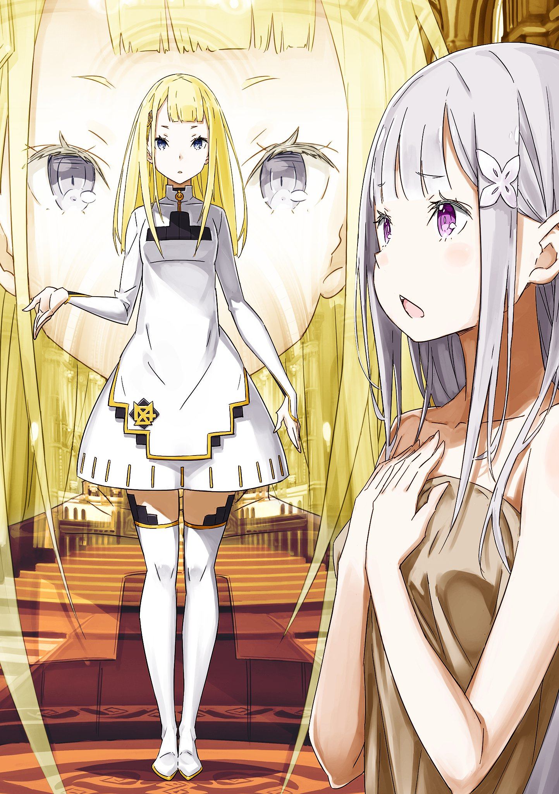

※ ※ ※ ※ ※ ※ ※ ※ ※ ※ ※ ※ ※

— «Пока что давайте поручим дело „Гнева“ Присцилле и остальным. Лилиана получила одобрение от Райнхарда насчёт её Божественной Защиты.»

— «Возможно, это звучит не слишком убедительно, учитывая, что она не привыкла пользоваться своей Защитой. Но я действительно думаю, что песня госпожи Лилианы может стать средством противодействия „Гневу“.»

После слов Субару и Райнхарда взгляды всех участников круглого стола обратились к Лилиане. Она схватила прядь своих собранных волос, приложила её под нос, изображая «усы», и со смешком произнесла:

— «Да-а-а, положитесь на меня! Раз уж эта Лилиана взялась за дело, я выполню свою работу как следует. Не беспокойтесь. Я всего лишь буду петь. Там, где это нужно! Петь там, где меня просят! Какая же это радость! А если ещё и монет подкинут, то вообще шикарно!»

— «Никто тебе ничего не подкинет, так что прекрати мыслить как капиталистическая свинья.»

— «Хрю!»

Лилиана, вошедшая в раж, стушевалась, а вместо неё фыркнула Присцилла. Она обвела алыми глазами Субару и Райнхарда.

— «Вот значит чем вы двое занимались, шушукаясь в углу. Бесполезные обсуждения, да ещё и с таким трудом. Я уже сама убедилась в истинной ценности этой певички. Мы раздавим этих глупых фанатиков в порошок.»

— «Как бы то ни было, подтвердить всё для надёжности необходимо, верно?..»

— «Глупости. Я ставлю свою жизнь на песню этой певички. С чего бы мне, инициатору этой затеи, доверять свою жизнь чему-то неопределённому? На такую безрассудность я не способна.»

— «…»

Услышав такое, Субару не нашёлся, что возразить. Действительно, именно Присцилла указала на потенциал Лилианы и именно она, веря в этот потенциал, собиралась противостоять «Гневу».

Было известно, что, несмотря на её слова и поведение, она была выдающейся женщиной, превосходной в хитрости и осторожности.

— «Принцесса, не издевайся так над братцем. Давай помолчим, а?»

— «Что такое, Ал? Ты всё ещё дуешься из-за того, что я отвергла твоё предложение? Какой же ты неженка для мужчины в твоём возрасте. Не смей унижать себя передо мной по пустякам.»

— «…Да не поэтому.»

Ал отвёл взгляд и, подперев щеку правой рукой, перешёл в режим наблюдателя. Присцилла фыркнула на отношение своего слуги, откинулась на спинку стула и перестала вмешиваться.

Похоже, теперь можно было переходить к следующему вопросу.

— «Итак, с „Гневом“ разберётся команда Присциллы. Что касается распределения остальных… Речь о „Похоти“. Я бы хотел выдвинуть на это дело господина Вильгельма.»

— «Господина Вильгельма? Могу я узнать причину такого выбора?» — спросил Юлиус.

— «Это я попросил господина Субару об этом, господин Юлиус,» — подняв руку, ответил Вильгельм.

Старый мечник, привлёкший к себе всеобщее внимание, слегка поднял взгляд — на верхний этаж.

— «Как вы все знаете, моя госпожа Круш в настоящее время страдает от подлого воздействия силы „Похоти“ Культа Ведьмы. Как её вассал, я обязан сражаться за свою госпожу. И это не просто чувство долга, это моё сокровенное желание.»

— «Если возможно, хотелось бы захватить Архиепископа Греха и выяснить причину этих симптомов. Господин Вильгельм, вы ведь этого добиваетесь?» — спросила Анастасия.

— «Именно так. Поэтому я прошу доверить мне уничтожение „Похоти“.»

Голубые глаза, полные твёрдой воли, вместе с исходящей аурой меча создавали гнетущую атмосферу.

Решимость Вильгельма, его преданность госпоже — сила его взгляда была такова, что никто не смел возразить против его намерения.

Никто, кроме одного человека — его кровного родственника.

— «Честно говоря, я против,» — сказал Райнхард.

— «…Райнхард.»

Пока все остальные ощущали давление ауры меча, лишь Райнхард сохранял невозмутимость. Он посмотрел на Вильгельма своим обычным серьёзным взглядом.

— «Дедушка, вы сейчас потеряли самообладание. Конечно, я понимаю вашу враждебность к Архиепископу Греха, оскорбившему госпожу Круш. Но я не думаю, что в таком состоянии вы сможете достичь цели.»

— «Ты хочешь сказать, что отсутствие хладнокровия помешает мне достичь цели? Ты говоришь это мне?»

— «Ради госпожи Круш нельзя допустить провала в захвате „Похоти“. Поэтому эту задачу возьму на себя я. По крайней мере, в психологическом плане у меня будет преимущество.»

Слова Райнхарда были логичны и направлены на максимально надёжное разрешение ситуации. Несомненно, Вильгельм был слишком взвинчен и потерял спокойствие.

Однако на это замечание Райнхарда Вильгельм растянул губы в улыбке.

Это была отнюдь не добрая улыбка, а свирепый оскал дикого зверя.

— «…Потерять самообладание — это естественно, Райнхард.»

— «Дедушка, но…»

— «За кого ты принимаешь меня, своего деда? Я — Демон Меча Вильгельм. Тот, кто стремился быть лишь мечом, но не смог и полюбил женщину, слабак. Но именно потому, что я такой слабак, я никогда не был слабаком в том, что должен был сделать.»

Свирепая улыбка стёрла мягкое и чистое впечатление от Вильгельма. Из-под неё проступил образ демона, чья жизнь горела в крови и стали, чьё сердце было пленено блеском клинка.

И всё же, даже будучи демоном, в его глазах оставалась толика тепла.

— «Когда я решаю обнажить меч, моё сердце трепещет. Отсутствие самообладания для меня на поле боя — обычное дело. И несмотря на это, я дожил до этих лет. И в этот раз я не собираюсь сгинуть, не отплатив свой долг госпоже. Излишние беспокойства ни к чему.»

— «Эта логика — не более чем теория силы духа…»

— «Сила духа, доведённая до предела, становится убеждением. За четырнадцать лет даже тупой меч можно наточить настолько, чтобы отомстить за жену.»

Услышав, что это убеждение Вильгельма, который отомстил за свою бабушку в битве с Белым Китом, Райнхард не смог продолжить спор.

Тем не менее, он всё ещё выглядел неубеждённым и опустил глаза. Видя упрямство внука, Вильгельм добавил: «К тому же…»

— «Поле боя, где нужен ты, — не здесь. Ты понадобишься в другом месте.»

— «Битва, где нужен я…»

— «…Господин Субару. Прошу вас, возьмите моего внука на своё поле боя. Чтобы вернуть госпожу Эмилию, вам придётся сразиться с „Жадностью“. Пусть этот Райнхард станет вашим мечом.»

Субару округлил глаза, когда внезапно назвали его имя. Под влиянием кивка Вильгельма, взгляд Райнхарда тоже обратился к нему.

Видя это, Субару со вздохом почесал голову.

— «Вообще-то я хотел сначала разобраться с „Похотью“… Да. Честно говоря, твою силу я хотел бы позаимствовать для битвы с „Жадностью“, за которую отвечаю я. Думаю, именно против этого мерзкого ублюдка твоя сила и нужна.»

В памяти всплыл Регулус, „Жадность“.

Способности других Архиепископов Греха были известны лишь фрагментарно, но даже среди этих отвратительных обладателей сверхъестественных сил полномочие Регулуса выделялось как особо опасное.

Нельзя было утверждать наверняка, но на данный момент способность Регулуса можно было представить лишь как нечто вроде абсурдной „неуязвимости“. Конечно, не хотелось верить в существование просто „неуязвимого“ существа. Хотелось верить, что есть какая-то слабость или ограничение.

— «Чтобы пробить „неуязвимую“ защиту Регулуса, нужна боевая мощь, способная с ним справиться. Думаю, по простому сравнению силы атаки и защиты он — номер один среди Архиепископов Греха. Поэтому я хочу позаимствовать силу Райнхарда для его устранения.»

— «Противник, на которого не действуют атаки… Действительно, для такого монстра я подхожу лучше всего. Но…»

Даже услышав о нечестном полномочии Регулуса, сомнения Райнхарда не рассеялись. Однако на его беспокойство ответил другой голос.

Голос раздался совсем рядом с Субару.

— «…Тогда я пойду со стариком Вильгельмом!»

Гарфиэль, заявивший о себе, оскалил острые клыки и посмотрел на Райнхарда. Райнхард удивлённо взглянул на него: «Ты?»

— «Босс рекомендует тебя. Твою силу я тоже знаю. Для спасения госпожи Эмилии я не нужен. Верно ведь, босс?»

— «Нет, Гарфиэль. Я вовсе не это хотел сказать…»

— «Утешения мне не нужны. И я не из вредности это говорю. Даже наоборот. У меня самого на этот раз есть дела к кое-кому.»

Субару нахмурился, видя возбуждённое состояние Гарфиэля, и запоздало понял.

Точно. Среди людей из мэрии, чей облик изменила «Похоть», был и знакомый Гарфиэля — тот, кого превратили в Чёрного Дракона.

Для Гарфиэля «Похоть» вовсе не была противником без личных счётов.

К тому же…

— «То, что эта грёбаная баба непростительна — факт, но дело не только в этом. Та парочка, что наехала на меня в самом начале, тоже ведь у „Похоти“, да?»

— «…»

— «Из-за моей неудачи один дурак получил ненужную рану. Я должен отомстить за него. Поэтому я тоже пойду со стариком.»

Вильгельм молча кивнул, встретив острый взгляд Гарфиэля.

Здесь воля старого мечника и молодого воина объединилась в желании сражаться ради мести. Их объединяло и то, что в основе этого лежала сильная привязанность к женщинам.

Против такого решения Гарфиэля у Субару возражений не было.

— «Думаю, это уже поздно говорить, но полномочие „Похоти“ — это трансформация и метаморфоза. Она может превращаться сама и превращать других. А ещё кровь. Ни в коем случае не попадайте под её кровь. Госпожа Круш страдает именно из-за этого. Характер… у них у всех отвратительный, но у неё особенно.»

— «Нам известно,» — ответил Вильгельм.

— «Раздавлю её,» — добавил Гарфиэль.

На последнюю проверку Субару ни Вильгельм, ни Гарфиэль не выказали ни малейшего желания отступать.

Наконец, Субару вопросительно посмотрел на Райнхарда. Похоже, даже Святой Меча не собирался вмешиваться, когда решение было принято столь твёрдо.

— «Я не возражаю. Сила Гарфиэля несомненна. Если дедушка будет рядом, я верю, что они смогут одолеть любого врага.»

— «Слышать это от тебя как-то… странно. Словно говорят: „Торктои скромный, но вкус отменный“».

— «Это искренне. Я верю в вашу с дедушкой победу. Я стану мечом Субару.»

Гарфиэль с довольным видом почесал щеку, а Райнхард кивнул Субару. Надёжные слова Святого Меча придали Субару уверенности, словно он получил поддержку целой армии.

— «Прости за эгоистичную просьбу, Райнхард.»

— «Всё в порядке. В любой ситуации я сделаю всё, что в моих силах. Если это поможет тебе, я только рад.»

— «Извини, что я всё время на тебя полагаюсь. Я слишком рассчитываю на твою силу в этой ситуации… но я постараюсь как-то компенсировать твои недостатки, так что можешь рассчитывать на меня.»

— «…»

При этих словах Райнхард вдруг округлил глаза и замолчал. Увидев его редкую реакцию, Субару склонил голову, но Райнхард тут же тихо рассмеялся: «Нет…»

— «Для тебя это, наверное, ничего не значит, да? …Ах, я буду рассчитывать. На то, что ты постараешься восполнить то, чего не хватает мне.»

— «…А? О, да, можешь смело рассчитывать. Я тоже на тебя рассчитываю. Итак, как вы, наверное, поняли из всего этого, последний — „Чревоугодие“ — неизбежно достаётся…»

— «…Мне и Рикардо,» — низким голосом подхватил слова Субару Юлиус. Анастасия обеспокоенно посмотрела на рыцаря, заметив непривычную резкость в его голосе.

— «Юлиус, ты в порядке? У тебя с самого начала цвет лица неважный.»

— «Прошу прощения за беспокойство. Но я в порядке. Если говорить о самочувствии, то перед Субару я не могу показывать слабость.»

— «Это ты в каком смысле?»

— «Разумеется, имея в виду твои ноги и тяжесть твоего положения. Не набрасывайся на меня. Я не собираюсь спорить с тобой даже в такой ситуации.»

— «Хм…»

Неожиданное поведение застало Субару врасплох. Одновременно возникло странное чувство дискомфорта.

Субару разделял подозрения Анастасии по поводу состояния Юлиуса. Что именно было не так, он по-прежнему не понимал, но тем не менее.

— «Мы с Рикардо берём на себя оставшееся „Чревоугодие“. Изначально эту роль наверняка хотели бы взять на себя Субару или господин Вильгельм, у которых с ним личные счёты. Я обязательно выполню задачу, доверенную мне даже ценой их чувств.»

— «…Да, верно.»

Как и ожидал Юлиус, уничтожение «Чревоугодия» было задачей, которую хотел выполнить сам Субару. То же самое, вероятно, относилось и к Вильгельму, и к Круш, страдающей наверху.

Полномочие «Чревоугодия» — пожирание памяти и имён… Думая о Рем, которая стала его жертвой и продолжает спать, Субару хотел сам раздавить «Чревоугодие».

Избить, запинать, растоптать, заставить пожалеть обо всём содеянном, заставить плакать и ползать на коленях — вот что он хотел сделать.

И эту роль он уступал другому…

— «Я никому не хотел бы это поручать. Рем… я хочу вернуть её сам. Хотел вернуть. Я верил, что это моя задача.»

— «…»

— «Но если нужно кому-то это доверить, то здесь и сейчас я доверяю это тебе. Не пойми неправильно. Это метод исключения… Да, метод исключения, но я доверяю это тебе. Для меня ты один из тех, кому я могу, хоть и неохотно, уступить эту роль и стерпеть.»

Рем, чьи память и существование были взяты в заложники.

Эмилия, которую похитили и которая ждёт спасения.

Обе были дороги Субару, обеих он должен был вернуть, обеим хотел показать себя с лучшей стороны.

Но Субару был рыцарем Эмилии и героем Рем.

— «Я одолею „Жадность“ и верну Эмилию. На этот раз я уступаю тебе право набить морду „Чревоугодию“. …Не подведи.»

— «…Я оправдаю твои ожидания. На этот раз, на этот раз точно.»

Глубоко кивнув, Юлиус принял доверие Субару.

«Лучший» из рыцарей затем посмотрел на Вильгельма и слегка кивнул.

— «Господин Вильгельм.»

— «Почти всё, что я хотел сказать, уже сказал господин Субару. Это правда, что мои чувства к „Чревоугодию“ далеки от спокойных… Поэтому я тоже доверяю это дело господину Юлиусу. В этом городе слишком много наглых негодяев распустилось.»

Отточенная аура меча, казалось, молчаливо придала Юлиусу храбрости. Рикардо, до этого молча наблюдавший за обменом репликами, сказал:

— «Ну вот, дела решаются без моего мнения. Не то чтобы я против! Я тоже согласен, что такое распределение — самое лучшее.»

— «Рикардо вечно требует внимания. С такой-то тушей дуться — милым не покажешься… Позаботься о Юлиусе, хорошо?» — обратилась к нему Анастасия.

— «Будь спокойна. Разве я когда-нибудь врал тебе? Ана-боу.»

— «Прекрати уже так меня называть. Я ведь твоя госпожа.»

Рикардо расхохотался, глядя на надувшую щёки Анастасию. Он смотрел на неё сверху вниз своими тёмными глазами с поразительной нежностью.

— «Значит, с расстановкой сил покончено,» — подытожил Субару.

Все за круглым столом кивнули в ответ на его слова.

— «Сириус, „Гнев“: Присцилла, Ал и Лилиана.»

— «Пытаться управлять сердцами людей, пренебрегая мной, — смехотворно. Я покажу этой пустоголовой дуре, что она выбрала не то место, не то время и не того противника, чтобы зазнаваться,» — заявила Присцилла, обмахиваясь веером.

— «Только петь, только петь… Я просто кусок мяса, который поёт. Не жалей жизни, жалей сцену. Есть! Кажется, я смогу! Прямо сейчас кажется, что смогу!» — бормотала Лилиана, вводя себя в какой-то транс.

— «…» — Ал оставался непроницаемым, но вся его фигура излучала несогласие.

Несмотря на некоторую тревогу, которую внушала эта троица, уверенности в себе им было не занимать.

— «Далее, „Похоть“: Гарфиэль и господин Вильгельм.»

— «Ага. Схвачу эту шумную бабу за шкирку и заставлю плакать и извиняться,» — рыкнул Гарфиэль.

— «Положитесь на меня. …И с той парочкой я тоже непременно разберусь,» — добавил Вильгельм.

Пожалуй, эти двое были настроены наиболее воинственно.

Демон Меча Вильгельм — ради долга перед госпожой и ради жены, которую он никогда не забывал.

Гарфиэль — ради разрешения неопределённых чувств, будоражащих его сердце.

Возможно, эти два воина искали в битве ответы каждый на свои вопросы.

— «И „Чревоугодие“: Юлиус и Рикардо, вы двое.»

— «Это роль, доверенная нам именно вами. Я обязательно её выполню. Только так я смогу отвергнуть его,» — сказал Юлиус.

— «Моя семья тоже пострадала от этих ублюдков. Можешь не говорить. Я их уделаю и заставлю реветь,» — добавил Рикардо.

У этих двоих было меньше всего личных счётов с Культом Ведьмы. Тем не менее, на них возлагались не меньшие надежды, потому что оба заслуживали доверия.

Они уже однажды вместе преодолели трудности. Сомневаться в боевых товарищах не было причин.

Именно поэтому Субару смог принять решение уступить им ненавистное «Чревоугодие».

— «Последний, „Жадность“ — это я и Райнхард. Я на тебя рассчитываю, ясно?»

— «…Да, можешь положиться на меня. Я тоже рассчитываю на тебя, Субару.»

На просьбу Субару Райнхард ответил с прежней непоколебимой решимостью, кивнув. И всё же что-то в его ауре казалось смягчившимся; возможно, это было неуместно перед битвой, но он выглядел более человечным.

Почему он выглядел таким облегчённым, Субару понять не мог.

— «Ну что ж, теперь распределение ролей в битве решено. У нас есть три зеркала для связи. Одно будет у меня в мэрии… как распределим остальные?» — спросила Анастасия.

— «Лично я считаю, что одно обязательно нужно отдать группе „Гнева“. Ещё одно… думаю, либо „Похоти“, либо „Чревоугодию“.»

— «Почему так?»

— «„Гнев“ влияет на весь город. От того, одолеем ли мы её, зависит вся ситуация в городе. Поэтому этой информацией нужно поделиться как можно скорее.»

Все кивнули, соглашаясь с предложением Субару по поводу зеркал. А причина, по которой второе зеркало не следовало отдавать группе «Жадности», была следующей:

— «Не хочу хвастаться, но с „Жадностью“ будет Райнхард. Хотя способности „Жадности“ неизвестны и это оптимистично, нельзя исключать возможность, что всё закончится мгновенно. В таком случае, я хочу иметь возможность отправить Райнхарда на подмогу.»

— «Но если у группы „Жадности“ не будет зеркала, то этой информацией нельзя будет поделиться, верно? Ваше мнение, Нацуки, безусловно, разумно, но…» — заметил Феликс.

— «С этим всё просто. Используем магический прибор для вещания. Трансляция на весь город, чтобы сообщить, где нужна помощь. Анастасия будет собирать информацию через зеркала и передавать её всем. Как вам?»

— «Думаю, это разумно. А ты соображаешь, Нацуки,» — Анастасия улыбнулась с восхищением и бросила одно из зеркал Присцилле. Та поймала его веером и перекатила к Лилиане.

— «Ай, ай, ай?!»

— «Певичка, ты будешь его носить. Я не могу носить ничего тяжелее посуды.»

— «Этот веер весит примерно как посуда. Не ленись.»

— «Не говори глупостей, посмотри на этот узор. На него ушло много золота, поэтому он и весит немало. Не сравнивай его с посудой.»

— «Так он тяжелее посуды…» — пробормотал Ал.

В любом случае, решили, что зеркало будет носить Лилиана. Не обращая внимания на то, как она тут же принялась поправлять чёлку, глядя в зеркало, последнее зеркало передали Вильгельму.

— «Учитывая количество врагов, зеркало следует отдать скорее „Похоти“, чем „Чревоугодию“. Хотя я верю в вас двоих, если почувствуете опасность, немедленно свяжитесь с Анастасией,» — сказал Юлиус.

— «Скажем так, принято,» — ответил Вильгельм, убирая зеркало в карман.

Однако в этом решении была толика беспокойства. Если Вильгельм разгорячится, он мог и не последовать этой инструкции. А Гарфиэль, само собой, мог вспылить из-за любой мелочи.

— …Но так или иначе, подготовка к битве была завершена.

— «Сделаем небольшой перерыв. После этого — выдвигаемся. Начинаем операцию по отвоеванию контрольных башен.»

На слова Субару все ответили кивками.

Но их тихое напряжение показалось Субару каким-то унылым.

— «Вам не кажется, что если ходить с кислыми минами, то всякая нечисть притянется?»

— «Чувствую, Нацуки опять собирается сказать что-то странное,» — заметил Феликс.

— «Это не странное. Это важное. Даже с самой большой армией, если боевой дух низок, она превратится в неуправляемую толпу. Не думаю, что у нас низкий боевой дух, но я не считаю показуху чем-то плохим. Поэтому, давайте покричим.»

Субару хлопнул в ладоши и встал.

Затем, подняв кулак так, чтобы все видели, сказал:

— «Сделаем это, ребята! В этой битве мы очистим город от всех этих ублюдков! Замочим Культ Ведьмы и заберём наш хэппи-энд!»

— «…»

Услышав боевой клич Субару, все переглянулись. Затем кивнули и…

— «Оооооо!!» — раздался бодрый ответ.

Раз они способны на такие сильные слова, значит, всё будет в порядке.

Такой состав, такой боевой дух — такое нечасто соберёшь.

— Битва за отвоевание города начинается по-настоящему.

— «…Эта битва — наша победа!!»

Этими пафосными словами Субару завершил совещание за круглым столом.

※ ※ ※ ※ ※ ※ ※ ※ ※ ※ ※ ※ ※

Чувствуя лёгкое удушье, сознание медленно возвращалось к реальности.

По мере того как реальность просачивалась сквозь дремоту, постепенно возвращались ощущения в руках и ногах. Чувство контроля над телом распространялось, и первым ощущением стала мягкость, окутывающая тело.

Тепло, уютное чувство, словно укутана в шкуру большого зверя.

Похожее ощущение она испытывала раньше. Давным-давно, в детстве, когда тело ещё не поспевало за разумом, когда было страшно спать одной.

С тех пор как она рассталась с этим ощущением шкуры, прошло много времени.

— «…Ах.»

Слёзы навернулись на глаза от этого ностальгического чувства.

Оторвавшись от желания подольше понежиться в тепле, веки медленно приподнялись. Длинные ресницы дрогнули, и тёмно-фиолетовые глаза увидели размытый мир.

Высокий потолок, незнакомое убранство комнаты. Она поняла, что лежит на кровати, укрытая одеялом из качественного меха.

И что рядом с ней сидел кто-то, протиравший ей лицо влажной тканью.

— «Вы…?»

— «…»

На неё сверху вниз смотрела красивая женщина с бледным лицом.

Её лицо, бледное до болезненности, застыло в кукольно-красивой неподвижности. Красота, которая, улыбнись она, озарила бы всё вокруг, оставалась застывшей, как маска Но.

Женщина в чёрном платье встала и, качнув длинными светлыми волосами, быстро вышла из комнаты.

Она попыталась окликнуть её, но замешкалась, не зная имени, и дверь закрылась. Она осталась одна.

— «Где… я?»

Она неуклюже села в кровати.

Чувствовалась лёгкая слабость, но боли или недомогания не было. Слабость — это симптом, возникающий, когда тело не справляется с нагрузкой от чрезмерного использования непривычной магии.

Подумав об этом, она тут же вспомнила, что с ней произошло.

— «Точно. Я сражалась на площади со странным человеком…»

Одно за другим в памяти всплывали события перед потерей сознания.

Человек с забинтованным лицом — тот, кого Субару называл «Гневом» — обладал ужасающей боевой мощью и источал леденящую душу ярость. Какое-то время она вела бой с преимуществом, но затем её отбросило силой его пылающего пламени…

— «И я потеряла сознание. Но я жива.»

Она была в невыгодном положении, ситуация была критической, в этом не было сомнений.

Вероятно, её кто-то спас. Там были Субару и Беатрис, так что, возможно, спасли они. Как бы то ни было, от жалости к себе хотелось плакать.

Так хвасталась перед Субару, а в итоге проиграла, да ещё и спасать пришлось.

— «Нет, нельзя раскисать. У меня, и так отставшей, нет времени стоять на месте и рефлексировать. Рефлексировать буду на ходу.»

Приложив ладони к бледным щекам, она быстро взяла себя в руки. Терять время на уныние было непозволительной роскошью.

Эта кровать, это одеяло. Раз за ней даже ухаживали, значит, это дом кого-то дружелюбного. Тот факт, что её принесли не в гостиницу, а куда-то ещё, мог означать, что она была в довольно плохом состоянии.

— «Но тело не болит, значит, кто-то умелый… А?»

Собираясь встать, Эмилия вдруг заметила кое-что касательно своего тела.

— «Я… голая.»

Когда босые ноги коснулись пола, она поняла, что на ней нет ни клочка ткани. Эмилия склонила голову и, обернувшись одеялом, сошла с кровати.

Она оглядела комнату в поисках чего-нибудь, что можно было бы накинуть, но, к сожалению, ничего не нашла.

— «Эм, что же делать? Выходить из комнаты в таком виде, думаю, неприлично…»

До выхода из леса Пак, после — во время учёбы, а позже и Аннерозе подробно объясняли ей вопросы стыда.

Не стоит слишком оголяться перед людьми. Исходя из этого, её нынешний вид был совершенно недопустим, но…

— «Но я беспокоюсь за всех, и это чрезвычайная ситуация, так что, наверное, придётся.»

Нужно было как можно скорее узнать, чем закончилась битва с Архиепископом Греха. Прикрываясь этим как уважительной причиной, Эмилия вышла из комнаты, закутавшись в одно одеяло.

Выйдя в коридор, она снова оказалась в незнакомом здании. Однако, в отличие от её ожиданий, за дверью комнаты был на удивление грубый и холодный коридор.

— «Я думала, это что-то вроде особняка, но совсем не похоже. Хм, может, только эта комната странная?»

Она обернулась и посмотрела на комнату, где спала.

Большая кровать, небольшой шкаф для одежды. Но при ближайшем рассмотрении всё это выглядело как-то неуместно. Словно в пустую комнату просто принесли кровать и другую мебель и небрежно поставили.

И, возможно, это было правдой.

Судя по атмосфере коридора, это место явно не предназначалось для жилья. Это было рабочее место. Прислушавшись, она различила тихий шум воды и какие-то рабочие звуки.

Эмилия склонила голову в недоумении, и тут…

— «Ах, ты, кажется, проснулась. Хорошо, хорошо. Рад, что ты в порядке.»

Услышав голос, Эмилия обернулась.

Из конца коридора показался молодой человек. На неё с улыбкой смотрел беловолосый юноша.

Он с приветливой улыбкой и непринуждённым видом подошёл к ней.

— «Но не стоит разгуливать сразу после пробуждения. После всего, что случилось, было бы плохо, если бы с твоим телом что-то случилось. В этом плане, я хочу, чтобы ты берегла себя. Ты ведь уже не одна.»

— «Эм, вы…?»

Эмилия моргнула, глядя на подошедшего юношу.

Его манера стремительно сокращать дистанцию напоминала Субару. Но было и кардинальное отличие от Субару — в его поведении не было ни капли той заботливой сдержанности.

Это была робкая добродетель Субару, но у юноши перед ней её не было вовсе. Словно он считал, что в его действиях нет ничего, за что стоило бы чувствовать вину перед другими.

— В то же время Эмилия испытывала к юноше перед ней какое-то необъяснимое чувство.

— «Ах да, прости-прости. Я-то любовался твоим спящим личиком, но ты видишь меня впервые. Мы ведь даже не представились друг другу. Даже для таких близких людей, как мы, невежливость недопустима. В этом моя вина, я поторопился. Искренне прошу прощения. Я способен на это.»

— «Э… да…»

Слова Эмилии в ответ на беглую речь юноши звучали тяжело.

Отчасти потому, что его манера поведения подавляла, но была и более серьёзная причина. Её сознание подсказывало ей.

— Что она где-то видела этого юношу.

— «Жаль, что такой момент происходит в таком бездушном месте. Но и это со временем станет особенным воспоминанием. С этой точки зрения, это не так уж и плохо. Маленьких повседневных радостей вполне достаточно, чтобы осветить жизненный путь. Уверен, рядом с тобой это будет ощущаться особенно сильно. Хочется смотреть на хорошие стороны жизни и определять свой путь, а не только на плохие. Ты так не думаешь, Эмилия?»

— «Я не помню, чтобы называла вам своё имя… Так кто вы?»

— «Ой, прости. Когда эмоции захлёстывают, я, бывает, перестаю замечать окружающее — это моя плохая привычка. Иногда я даже ненавижу свою любвеобильную натуру за это. Возможно, это потому, что ты слишком сильно сводишь меня с ума. Ах да, имя.»

После долгих и витиеватых обходов юноша наконец подошёл к сути.

Чувствуя, как необъяснимое ощущение от него обжигает кожу, Эмилия не сводила глаз с его движений. Интуиция подсказывала, что она не в безопасности.

И что причиной этой интуиции был юноша перед ней.

— «Меня зовут Регулус Корниас. Я занимаю что-то вроде руководящей должности в одной группе, но для тебя это не важно. Для тебя важно лишь одно. Я — твой муж, а ты — моя семьдесят девятая жена.»

— «…А?»

Эмилия не поняла смысла слов, торжественно произнесённых представившимся юношей — Регулусом.

Она растерянно нахмурила изящные брови. Однако Регулус, не обращая внимания на её отнюдь не одобрительную реакцию, оглядел её, прикрытую лишь тонкой тканью.

— «Этот наряд слишком соблазнителен. Я сейчас же велю принести тебе сменную одежду. Можешь не беспокоиться. Это мои жёны, такие же, как ты. Они привыкли надевать свадебные платья.»

— «Свадебное платье? О чём вы? Да и не только это. Что значит, я ваша жена?..»

— «Точно. Я забыл о важном! Чуть не упустил!»

Эмилия попыталась вмешаться в стремительное развитие событий, но Регулус её не слушал. Он хлопнул в ладоши и мягко схватил за плечи пытавшуюся приблизиться Эмилию.

Она поморщилась от ненормальной силы его пальцев. Регулус приблизился к ней так близко, что их лбы почти соприкоснулись, и заглянул ей в глаза.

— «Я забыл задать важный, очень важный вопрос. Церемония бракосочетания будет после этого. Эмилия, это очень важно, так что отвечай серьёзно. Это важно для нашего будущего.»

— «…»

Под невероятным давлением Эмилия затаила дыхание и промолчала.

Приняв её молчание за согласие, Регулус улыбнулся.

Улыбнулся и сказал:

— «Эмилия, ты девственница? Это действительно очень важно.»

Улыбнулся и сказал это.

Отвратительность Регулуса — пусть она достигнет каждого!

※ ※ ※ ※ ※ ※ ※ ※ ※ ※ ※ ※ ※
