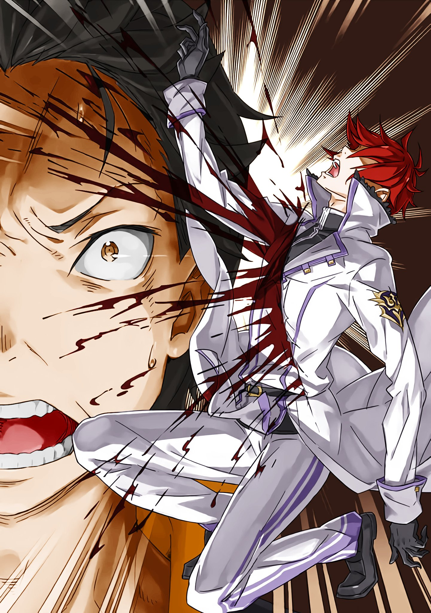

※ ※ ※ ※ ※ ※ ※ ※ ※ ※ ※ ※ ※

— «Субару!»

Дверь собора выбили, и из проёма раздался голос, зовущий Субару.

Это была Эмилия, стоявшая перед алтарём, облачённая в белое свадебное платье.

Её фигура, с длинными серебряными волосами, собранными наверх, и в белоснежном платье, была прекрасна. Настолько, что глаза слепило. Будь на то моя воля, я бы хотел увидеть её в свадебном наряде первым, но…

— «Впечатления в стиле “Э.М.Т.” придётся отложить. Похоже, мы ворвались прямо посреди свадьбы?»

— «К тому же, судя по виду, церемония шла не слишком гладко. Видимо, нам удастся избежать статуса помехи», — согласился Райнхард с бормотанием Субару, глядя на Эмилию и Регулуса, что стояли поодаль, сверля друг друга взглядами. Церемония, похоже, была на грани срыва — идеальный момент для вмешательства.

Услышав их слова, Регулус, и без того выглядевший недовольным, побагровел от ярости. Он распахнул полы белого смокинга и скривил губы с досадой.

— «Прошу прощения у вас, незваные гости, но празднество сейчас сменится скорбью. Готовы ли вы мысленно превратиться из приглашённых в скорбящих?.. Ах да, это не нужно. Ведь вы скоро сами из провожающих станете провожаемыми».

— «Ого-го, какой смелый. Тебе невеста отказала прямо на свадьбе у алтаря. Мог бы и покраснеть от стыда. К тому же, ты что, не слышал, кто стоит рядом со мной?»

Провоцируя Регулуса, чей тихий голос сочился жаждой крови, Субару переглянулся с Райнхардом. Регулус удивлённо посмотрел на него и выдохнул: — «Ах.»

— «Как там его, Святой Меча? Слышал такое. Разве не так зовут того, кто только и умеет, что махать мечом? И зачем ты его притащил? Ох-ох, как же смехотворно думать, будто победил благодаря авторитету. Мол, накопленная история сильна, или гордость родословной — всё это дурные пережитки старомодного традиционализма. Такие вещи обычно сносятся свежим ветром, и они терпят жалкое поражение. Хочешь это продемонстрировать?»

— «“Только и умеет, что махать мечом” — это меткое замечание», — ответил Райнхард Регулусу, чьё вызывающее поведение его ничуть не задело. — «По правде говоря, большинство ожиданий, возлагаемых на меня, связаны именно с этим. Однако есть одна проблема».

С этими словами он осторожно потянулся рукой к поясу.

Там висел святой меч с выгравированным на нём следом когтя дракона, который Райнхард всегда носил с собой. И Райнхард, взявшись за рукоять, покачал головой.

— «В чём дело, Райнхард?»

— «Этот “Драконий Меч Рейд” передаётся в семье Астрея с первого поколения, но у него есть один недостаток. Его нельзя обнажить, если противник недостоин».

— «То есть?»

— «Похоже, меч решил, что тот господин не стоит того, чтобы его обнажали».

— «!..»

Независимо от того, вкладывал ли Райнхард такой смысл в свои слова, для Регулуса это было крайне резким и унизительным замечанием. Субару знал, что слова Райнхарда — не ложь, по опыту с Эльзой, против которой меч тоже не обнажился.

Но даже если и так, это не уменьшало унижения Регулуса.

— «Что Святой Меча может сделать против меня, даже не обнажив клинок? Не зазнавайся, сошка. Мы с тобой на разных уровнях. Вы, жалкие создания, продолжающие барахтаться, оправдываясь своей незавершённостью, и я, завершённая личность, — нам не о чем говорить. Глупцы, способные оценить себя лишь в сравнении с другими. Не смейте судить меня свысока».

— «Как бы сказать… ты это самое», — сказал Субару Регулусу, чьи глаза горели ненавистью, почти ошарашенно.

Если на миг забыть о всей исходящей от него угрозе и вслушаться только в его слова…

— «Это какой-то лютый бумеранг. Ты тут распинаешься о своей завершённости, а сам не можешь успокоиться, пока не сравнишь себя с другими и не докажешь своё превосходство.»

— «!.. Неполноценный ущербный, не читай нотаций мне, наполненному!»

Взбешённый словами Субару, Регулус наконец перешёл от угроз к действиям.

В тот миг, как безумец топнул ногой по полу перед алтарём, доски с ужасающей силой вздыбились. Поток разрушения устремился прямо к Субару и остальным; было видно, как взлетающие щепки и каменная крошка перемалываются в пыль всепоглощающей мощью.

— «Уоа?!»

— «Субару, сюда.»

За миг до того, как разрушение достигло его, Субару схватили за шкирку и резко дёрнули в сторону.

Лёгкий прыжок рассёк воздух, и Субару быстро покинул траекторию разрушения. Это сделал Райнхард, который подхватил Субару одной рукой и одним прыжком уклонился от атаки.

Осторожно опустив Субару, у которого закружилась голова, на пол, Райнхард тут же согнул колени, готовясь атаковать Регулуса. Но тут…

— «Не двигаться! Одно неверное движение — и этим женщинам конец.»

— «…»

Сверля взглядом присевшего Райнхарда, Регулус направил обе руки к стенам собора.

Там, в качестве гостей на свадьбе, в ряд стояли нарядно одетые женщины. Все они, с мёртвыми выражениями на лицах, никак не реагировали на действия Регулуса. Словно зная, что так и будет, они просто стояли и безучастно наблюдали за разворачивающейся перед ними схваткой.

— «Поздновато спрашиваю, но кто эти женщины? Хотя лучше бы не знать.»

— «Все они — мои драгоценные жёны. Прекрасные принцессы, которые любят меня и отвечают на мою любовь. Вы что же, собираетесь убить этих невинных женщин? Как вы можете быть такими жестокими! Вы с ума сошли!»

— «Хреново. Я смутно догадывался, но с ним невозможно разговаривать.»

Насколько серьёзны его слова? Логика Регулуса была совершенно бессвязной.

Брать в заложники собственных любимых жён — это просто не укладывалось в голове. Хуже всего было то, что почти не приходилось сомневаться как в их “невинности”, так и в том, что Регулус действительно их убьёт.

Эта безумная тактика с заложниками вполне работала против Субару и остальных.

— «Я совсем не хочу их убивать. Но если вы продолжите сопротивляться, мне придётся это сделать. Одну за другой, по порядку. Как вы можете заставлять меня совершать такую жестокость? Это ужасно!»

— «Не думаю, что это имеет смысл, но я не помню, чтобы хоть раз тебе угрожал.»

— «Не оправдывайся! Да, убью их я. Но курок нажмёте вы. Ваша жажда крови убьёт их. Это будет ваше убийство, совершённое с помощью меня, как инструмента. Это вы убьёте их. Не пытайтесь уйти от ответственности. Вы… женоубийцы!..»

Регулус заскрежетал зубами, сверля Субару и Райнхарда взглядом, полным ненависти. Безумец, излагавший эту чудовищную логику, ни на йоту не сомневался в своей правоте.

Пытаясь выиграть время разговором, Субару бросил взгляд на Райнхарда. Однако, безумец, чьи атаки взрывались без видимой причины, и около пятидесяти заложниц… Даже Райнхард не смог бы спасти всех, если бы Регулус атаковал обе стены одновременно.

— «…»

Ситуация зашла в тупик… нет, она развивалась так, как хотел Регулус.

Именно в этот момент.

— «А про меня не забыли?»

— «Что?»

Рядом с Регулусом, сдерживавшим их, вспыхнуло бледно-голубое сияние.

Свет мгновенно заполнил собор, и в следующее мгновение пронзительный звук возвестил о вмешательстве в мир. Лёгкие звуки слились в цепь, резонируя друг с другом, и собор наполнила музыка природы.

И сразу после этого, в мгновение ока, внутри собора возник великий ледяной барьер.

Сверкающий голубой ледяной барьер, исходящий от Эмилии перед алтарём, раскинулся по собору, создав толстую стену, защищающую женщин-заложниц.

Мало того, лёд сковал нижнюю часть тела Регулуса, приморозив его к полу, а к его беззащитной шее был приставлен ледяной меч — меч в руке Эмилии.

— «Попался. Потерял бдительность. Я ведь тоже не собиралась драться с тобой без подготовки. Я готовилась тебя заморозить. Ты проиграл».

— «…Слушай, ты совсем не умеешь читать атмосферу, да? Я же как раз загонял их в угол. Это был важный момент, когда я должен был решительно расправиться с этими подлецами и доказать свою правоту. Все мои жёны верили в мою победу и молились за неё… И что ты творишь?»

— «Немедленно освободи меня и остальных. Не говорю за всех, но наверняка есть те, кто подчиняется тебе из страха. Цени тех, кто действительно хочет быть с тобой, а потом…»

— «Право слово, кому ты это говоришь? Правильно я сделал, что не взял тебя в жёны.»

— «А?»

— «Эмилия! Нет! Так его не остановить!»

По здравому размышлению, это был момент полной победы, и неудивительно, что Эмилия так решила.

Единственным отличием от обычных условий было то, что противник был «необычным».

— «!..»

Со вздохом Регулус легко пошевелил ногами. Одного этого движения хватило, чтобы лёд, намертво сковавший его ниже пояса, легко откололся.

Ледяные оковы разлетелись на куски так же легко, как счищают подтаявший лёд.

Как только Эмилия ахнула от изумления, ладонь Регулуса схватила её тонкую шею. Регулус поднял тело Эмилии одной рукой.

— «Грубая, да к тому же не умеющая уважать мужчину. Если ты неверна душой, то неважно, девственна ли ты телом и сердцем. Шлюха. Потенциальная шлюха. Не могу поверить, что ты играла с моим чистым сердцем, а потом ещё и пыталась угрожать. Такой злодейки я ещё не видел».

— «Кх… фф…»

— «Интересно, скольких мужчин ты соблазнила этим милым личиком? Стоило улыбнуться — и все становились добрыми? Стоило заговорить — и мужчины были на седьмом небе от счастья? Стоило прикоснуться рукой — и они наверняка осыпали тебя подарками. Ах, ах, какая грязная женщина».

— «Прекрати! Убери руки от неё, ублюдок!»

Регулус равнодушно поносил Эмилию, которую держал на весу, вкладывая в слова всю свою ненависть. Когда Субару выкрикнул, не в силах слушать эти оскорбления, безжизненные глаза Регулуса впились в него.

— «Дурак — это ты. Не видишь ситуацию? Или это отказ от попыток понять? Тебе обязательно нужно, чтобы я всё разжевал? Это ведь своего рода отказ от мышления — игнорировать собственную неспособность оценить ситуацию и цепляться за снисхождение оппонента, да? Почему бы тебе не подумать изо всех сил, не поставить себя на место другого? Полагаться на чужую доброту — это как-то не по-человечески, тебе не кажется?»

— «Убери руки от госпожи Эмилии. Мы выслушаем твои требования.»

Пока Субару задерживал дыхание, Райнхард обратился к Регулусу.

Безумец поднял бровь на его слова и скривил губы, видимо, решив, что с Райнхардом, в отличие от Субару, у которого кровь прилила к голове, можно разговаривать.

— «Вот-вот, такое смиренное отношение. Чтобы направить разговор в желаемое для обеих сторон русло, у людей есть такой инструмент, как слова, и хотелось бы эффективно им пользоваться. Но многие заблуждаются на этот счёт и пытаются продавить всё силой, это так раздражает. Хотя можно просто сказать словами, но нет, им обязательно нужно выпендриваться своей силой. Ну, обычно такие типы на самом деле ничего из себя не представляют и в итоге проигрывают мне, пацифисту, что довольно жалко».

— «Длинные тирады ни к чему. Лучше озвучь свои требования. Дальнейшие страдания госпожи Эмилии мучительны и для меня, и для моего друга».

— «Вот как. Тогда скажу быстро. — Сними меч с пояса и подойди чуть ближе к алтарю».

Лицо Эмилии побледнело. Регулус, словно хвастаясь, поднял её ещё выше. Её ноги задёргались, ледяной меч выпал из руки и воткнулся в пол.

Увидев это, Райнхард без колебаний снял Драконий Меч с пояса и передал его Субару.

— «…Если что, я сам его вытащу и зарублю гада».

— «Это один из вариантов, но, боюсь, даже ты не сможешь его обнажить. Не волнуйся, я обязательно верну госпожу Эмилию».

Обменявшись парой слов шёпотом, Райнхард подчинился приказу Регулуса.

Когда безоружный Святой Меча дошёл до центра собора, Регулус остановил его: — «Стой там». Расстояние было около пяти метров, но Райнхард мог преодолеть его в мгновение ока.

Проблема была в том, что Эмилия в руках Регулуса, скорее всего, погибла бы с переломанной шеей в тот же миг, как он рванулся бы вперёд. К тому же, природа непобедимой власти Регулуса оставалась совершенно непонятной.

Освобождение от ледяных оков Эмилии, те повторяющиеся разрушения без видимой причины… Я думаю, где-то здесь кроется ключ к разгадке его так называемой «непобедимости».

— «…»

Затаив дыхание, Субару пристально следил за действиями Райнхарда.

Сейчас, когда выхода из ситуации не видно, оставалось полагаться только на замысел Райнхарда. Конечно, Субару и сам пытался что-то предпринять, но на данном этапе это было малоэффективно.

— «Как ты и хотел. Здесь? Что дальше?»

— «Сказать “умри здесь от моей руки” было бы просто. Но даже я понимаю, что это было бы слишком. В этом не было бы уважения к твоим мотивам — желанию защитить заложниц и ту шлюху. Я не хочу навязывать неразумные требования. Не хочу, чтобы меня считали эгоистом. Я хочу, чтобы вы поняли: я простой обыватель, которому для счастья достаточно малого в повседневной жизни».

— «…»

— «Поэтому условие для освобождения заложниц только одно. Ты примешь один мой удар. Прямо здесь. Без защиты и без уклонения. Только это — и я отпущу заложниц. Так я прощу вашу подлость — попытку напасть на меня вдвоём против одного».

— «Один удар, значит».

На предложение Регулуса Райнхард задумчиво коснулся подбородка.

Глядя на его задумавшуюся спину, Субару мысленно покачал головой — предложение было чудовищным. Регулус пытался приукрасить свои слова, но сила его атаки была очевидна.

Вряд ли даже Райнхард смог бы выдержать такой непостижимый удар, превращающий стройматериалы в пыль. Даже если бы он выжил, окажись он не в состоянии сражаться, о продолжении боя не могло быть и речи.

— «Хорошо. Я принимаю».

Однако, вопреки тревоге Субару, Райнхард легко согласился. Субару широко раскрыл глаза от такого ответа, а Регулус глубоко кивнул.

— «Хорошая решимость. Я уважаю тебя за это. Хоть ты и собирался убить моих жён, у тебя всё же есть минимальная человеческая гордость».

— «Непобедимый, да ещё и с заложниками, и никаких сомнений в себе, да?..» — пробормотал Субару.

От слов Регулуса, которые на первый взгляд звучали благородно, Субару передёрнуло от отвращения. Бормотание Субару, похоже, не достигло Регулуса; он, продолжая держать Эмилию левой рукой, направил кончик правой руки на Райнхарда.

— «Р-Райнхард… У тебя ведь есть какой-то план, да?»

— «Субару, помнишь обещание? Ты ведь восполнишь то, чего не хватает мне?»

— «Не говори таких зловещих слов…»

Субару надеялся, что раз Райнхард согласился, у него есть шансы на победу, но ответ был уклончивым. Прежде чем Субару успел договорить, Регулус взмахнул рукой в сторону Райнхарда.

Невидимый удар. Кончики пальцев рассекли воздух, и, вероятно, что-то было выпущено в Райнхарда. Но само разрушение невидимо. Возможно, это была атака вроде «Невидимой Длани» — нечто столь же непостижимое?

Времени проверить это предположение не было.

— «…»

Тело Райнхарда, стоявшего перед Субару, разлетелось кровавыми брызгами и рухнуло.

Оно было разрублено по диагонали, словно от удара мечом, и отлетело от удара, кувыркаясь. В этом искалеченном теле не осталось и следа от его обычной подтянутой фигуры.

— «А?..»

Из упавшего тела Райнхарда хлынула кровь, окрашивая разорванный красный ковёр в ещё более тёмный, багровый цвет. Тело подпрыгивало и дрожало — это были предсмертные конвульсии, шоковая реакция умирающей плоти.

Вскоре и это прекратилось. Тело, лежавшее там, было совершенно мертвым.

Это была несомненная смерть Райнхарда ван Астрея.

— «Какой бы человек ни был, смерть всегда приходит так просто, не правда ли? Сколько бы великих дел человек ни совершил, какой бы отвратительный грешник и злодей он ни был, смерть приходит ко всем одинаково и забирает жизнь. В мире, где правит неравенство, это единственное равное для всех событие».

Регулус, убивший Райнхарда одним взмахом и наблюдавший его смерть, покачал головой.

Безумец с серьёзным видом комментировал последствия своих действий, словно это его не касалось.

— «Именно потому, что мы знаем — конец неизбежно придёт, живые должны стремиться к счастью при жизни. Поэтому я так доволен тем, что моя планка счастья невысока. Если бы я был “Жадностью”, если бы желал всего на свете и был ненасытным стяжателем, который не может успокоиться, пока не получит всё, я, возможно, никогда не смог бы стать счастливым при жизни. Но, к счастью, я родился с чувствительностью, позволяющей мне довольствоваться малым».

Регулус прижал к груди руку, которой убил Райнхарда, и рассмеялся.

А затем: — «Я, наполненный, хочу спросить. Ты, мёртвый, умер ли ты удовлетворённым? Если да, поздравляю. Если нет — мои соболезнования».

— «У-оооооо!..»

Сразу после того, как Регулус закончил свою чушь, Субару с боевым кличем ринулся вперёд.

Он поднял стул и швырнул его в Регулуса. Регулус небрежно отмахнулся от летящего стула-снаряда одной рукой, словно отгоняя надоедливое насекомое. Стул разлетелся на куски от этого лёгкого удара, и Регулус скривился от досады.

— «По сравнению с тем, кто принял смерть достойно, ты такой шумный и жалкий».

— «А я как раз горжусь своей репутацией неподобающего рыцаря!»

Пробежав по ковру, пропитанному кровью Райнхарда, Субару потянулся рукой за спину к поясу. Он выхватил оттуда хлыст и с силой метнул его кончик вперёд.

На это движение Субару Регулус выставил вперёд схваченную Эмилию, словно щит.

— «Глаза для украшения? Не видишь заложницу?»

— «Странно. По твоим словам, ты должен был освободить заложницу».

— «!..?»

В тот миг, как раздался этот голос, лицо Регулуса исказилось от изумления.

Его взгляд, следивший за бегущим Субару, метнулся назад, и при виде высокой фигуры, стоящей посреди лужи крови, у него перехватило дыхание от шока.

— «Чт—..»

— «“Благословение Феникса”».

Короткий ответ прозвучал на изумлённый возглас Регулуса, и в это мгновение три тени пришли в стремительное движение.

Хлыст Субару обвился вокруг прятавшейся за алтарём женщины с золотыми волосами и притянул её к себе.

Эмилия, всё ещё схваченная, вытянутой ногой пнула ледяной меч в сторону Райнхарда.

Выскочивший вперёд Райнхард поймал ледяной меч и занёс его над Регулусом.

Женщина была убрана с линии огня, и Святой Меча с ледяным клинком в руке не колебался.

— «…»

На мгновение мир лишился звука — а затем голубая вспышка света разнесла собор ударной волной.

※ ※ ※ ※ ※ ※ ※ ※ ※ ※ ※ ※ ※
