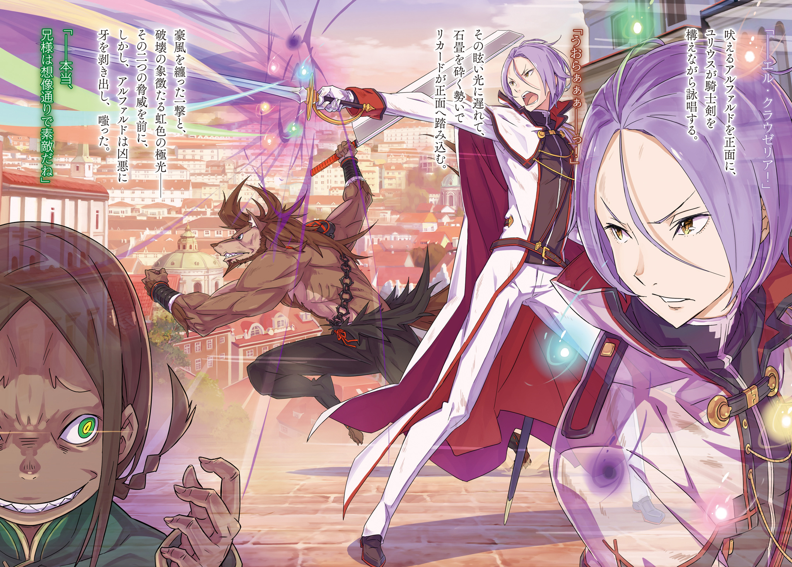
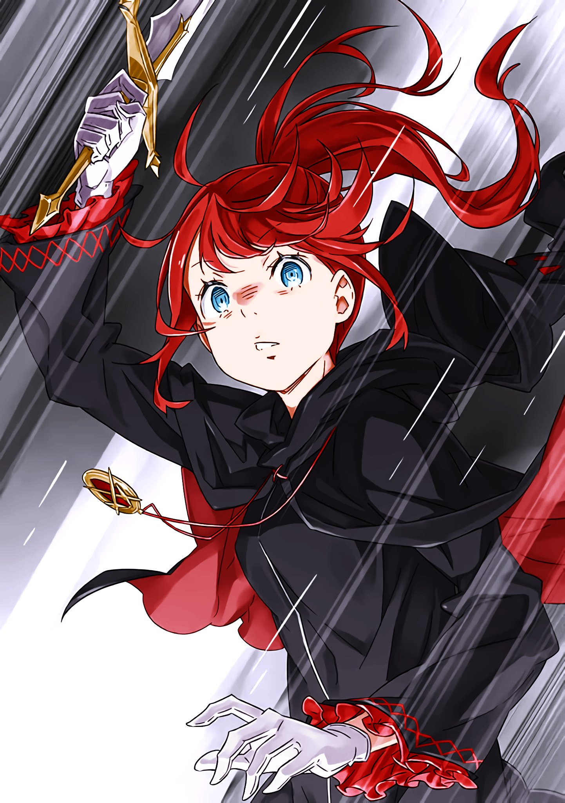

※ ※ ※ ※ ※ ※ ※ ※ ※ ※ ※ ※ ※

— «Что это у тебя за кислое лицо? Волнуешься о чём-то?»

Прямо перед тем, как они добрались до контрольной башни, Рикардо обратился к рыцарю с суровым выражением лица.

Юлиус остановился и удивлённо приподнял бровь.

— «Я поражён, Рикардо. Не думал, что ты способен на такую тонкую заботу о чужих чувствах».

— «Можешь не пытаться отмахнуться дурацкими фразочками. Тут только я с тобой. Госпожи нет, так что, если разок пожалуешься, я никому не скажу».

— «…С тобой не поспоришь».

Хоть такая возможность выпадала нечасто, Рикардо, несмотря на свою грубоватость, был очень наблюдателен.

Иначе он не смог бы возглавлять такую группу, как «Железный Клык», да и обрывки его суровой биографии, которые Юлиус слышал, подтверждали это. Если не смотреть по сторонам, если думать только о себе — не выжить. Это было справедливо как для раба, так и для наёмника.

— «Ну, это, как его, мудрость лет! Я всё-таки стараюсь быть надёжным папашей в нашем лагере. Всегда готов выслушать зятя».

— «Зять — это слишком смело. Я не питаю таких неподобающих чувств к Анастасии».

— «Чего? А я и не говорил про госпожу. Может, про Мими? У меня дочек полно, так что то, что ты сразу подумал про госпожу, уже неубедительно».

— «…»

Юлиус горько усмехнулся. Он молча покачал головой с присущей ему элегантностью, но в его словах и манере речи всё равно не хватало блеска.

И этот признак…

— «С тех пор, как мы отбили городскую ратушу, ты какой-то странный. Госпожа того же мнения. Она, вроде, не стала лезть с расспросами, а вот я полезу».

— «Не проявишь снисхождения?»

— «Конечно, нет, мы же жизнью рискуем. Прикрывать спину тому, кто сомневается, — увольте. Ну что, сможешь возразить, приведя какой-нибудь веский довод?»

— «…Нет, ты прав. Ошибаюсь я. Меня действительно терзают сомнения, о которых я не решаюсь говорить».

Юлиус честно кивнул в ответ на допрос Рикардо и свёл свои красивые брови.

Однако больше слов с его страдальческого лица не слетело. Это вывело Рикардо из терпения, и он раздражённо фыркнул.

— «Чего молчишь-то? Что за сомнения? Скажи прямо, как есть. Из-за чего, о чём ты сомневаешься?»

— «…»

— «Юлиус».

— «Прости. Не знаю, как сказать… не могу подобрать нужных слов. Причина моих сомнений, как ты и догадался, — это Архиепископ Греха, с которым мы столкнулись в ратуше. Тот, что олицетворяет „Чревоугодие“ и назвался Роем Альфардом. Несомненно, это он. Несомненно, но…»

Юлиус оборвал фразу на полуслове, в его жёлтых глазах мелькнуло замешательство.

— «Как и другие Архиепископы Греха, „Чревоугодие“, вероятно, тоже обладает какой-то непостижимой Властью. Его ужасающая способность пожирать память и имена отчасти известна по ущербу от Белого Кита. Но…»

— «Юлиус!..»

Как только он коснулся сути, раздался слегка встревоженный оклик Рикардо. Юлиус тут же понял, что он означает.

Земля под ногами задрожала, воздух завибрировал, мир лишился звуков, и в небо взметнулся свет.

Голубое сияние, пронзающее ночное небо, — это не что иное, как…

Остаточное явление от удара сильнейшего в этом мире мечника.

— «Ну и шуму он наделал. Это же удар Святого Меча, верно?»

— «Да, это Райнхард. Похоже, Субару и остальные столкнулись с „Жадностью“. Нельзя отставать. Нам тоже нужно спешить».

Не факт, что после начала атаки на одного Архиепископа Греха остальные тут же начнут ответные действия, но и исключать какую-либо реакцию нельзя.

Юлиус и Рикардо ускорили шаг, направляясь к виднеющейся впереди контрольной башне.

— «Так что не так с „Чревоугодием“? Он что, настолько чудовищен?!» — крикнул Рикардо, закинув большой топор на плечо и требуя продолжения прерванного разговора от идущего впереди Юлиуса.

Юлиус, повернув лишь голову, взглядом опроверг его слова.

— «Нет. Хотя он, похоже, и не сражался всерьёз, его мастерство, по крайней мере, не выходило за пределы человеческого понимания. Вдвоём мы вполне могли бы с ним справиться. Но… зловещая сущность врага кроется в другом».

— «…»

Ответ был туманным, потому что сам Юлиус не до конца понимал истинную природу этой жути. А то, что он не упомянул об этом во время обсуждения состава штурмовых групп, было проявлением редкого для Юлиуса эгоизма.

Юлиус считал «Чревоугодие» зловещим и непонятным врагом, но всё же чувствовал, что должен снова скрестить с ним меч.

Почему — Рикардо не знал.

Сам Юлиус не мог ясно выразить это словами.

— «…»

Оттолкнувшись от каменной брусчатки, они свернули за угол, огибая улицу. И когда перед ними предстала одна из четырёх контрольных башен, выделяющаяся на фоне других зданий…

— «Ах, я так и знал, что вы придёте. Так и знал. Да, да, это так, верно, верно же, точно, не так ли, конечно же так, именно поэтому! Ожидание того стоило!»

…Перед входом в контрольную башню, на вымощенной камнем площади, стоял мальчик.

Он был одет в грязные лохмотья, его спутанные тёмно-каштановые волосы отросли как попало. Безумно блестящие глаза сияли весельем, изо рта виднелись острые клыки и капающая слюной язык.

Маленькое тельце, безвольно опущенные руки. С виду — обычный беспризорник, не обладающий особой силой… если бы не жуткая, демоническая аура, исходящая от всего его тела.

— «На всякий случай уточню… это точно он?» — Рикардо не спросил «это тот ли?». То, что это он, было несомненно.

На его вопрос Юлиус ответил лишь тихим кивком.

Без сомнения, вне всяких сомнений, там стоял Архиепископ Греха «Чревоугодие».

Мерзкий осквернитель, пожирающий чужие воспоминания и имена.

— «Рой Альфард…»

— «Да, совершенно верно! Это наши имена. Мы рады, что ты помнишь. Рады. Очень рады. Безумно рады. Поэтому. Именно поэтому — обжорство! Чревоугодие! Есть ради чего вгрызаться, есть ради чего выпивать до дна! К тому же…»

Услышав своё имя, Альфард жестоко улыбнулся. Его взгляд переместился на Рикардо, стоящего рядом с Юлиусом.

Он открыл клыкастую пасть и с восторженным видом фыркнул.

— «На этот раз ты привёл с собой ещё и сытного пёсика. Эта забота невероятно радует нас. Ведь один Юлиус Юклиус слишком уж несытный. Как бы сказать… пресноватый, что ли».

— «Твои оскорбления мне уже порядком надоели. Чтобы покончить с этим побыстрее, я попросил друга сопровождать меня. Нападать вдвоём на одного — не слишком изящно, но…»

— «Ах, хватит этих предисловий. Так настраивать себя на бой — это в духе Юлиуса, но, знаешь, это тоже кажется пресным. Мы гурманы, поэтому очень придирчивы ко вкусу, а Юлиус — один из самых неаппетитных людей, которых мы видели! Слишком уж он аккуратный и собранный».

— «Что ж… после такого радушного приёма ты говоришь довольно неприятные вещи».

— «Тут уж ничего не поделаешь! Это не совсем то, чего мы хотим, так сказать, нас немного заносит. Надеемся, ты простишь нам некоторые несоответствия в словах и поступках, такая уж у нас натура!»

Альфард легкомысленно махал руками, не прекращая издеваться. Юлиус сохранял спокойствие перед лицом провокаций, но Рикардо не мог скрыть своего раздражения. Он цыкнул языком и хрустнул шеей.

— «Охо-хо, ну ты и болтун, пацан. Если думаешь, что тебе всё сойдёт с рук, потому что ты ребёнок, то сильно ошибаешься. То, что вы творите, совсем не мило. Вы перешли ту черту, когда можно отделаться шлепком по заднице. Я тебе башку расколю».

— «Ой, страшно, страшно. Не смотри так грозно. Если тебе не понравилось, что мы назвали тебя пёсиком, то извиняемся, Рикардо Велкин. Мы ведь, знаешь ли, немного восхищались тобой? Твоей бесцеремонной манерой громко говорить!»

— «?»

Услышав своё имя, Рикардо нахмурился и искоса посмотрел на Юлиуса. Тот покачал головой.

Странно. Слова Альфарда было трудно отбросить как бред сумасшедшего, от них веяло чем-то неуловимо неправильным. Например… откуда он узнал имя Рикардо?

— «Жуткий пацан… Откуда ты узнал наши имена?»

— «Узнал? Мы не занимаемся такими мелкими делишками. Мы просто говорим то, что и так должны знать. Верно, Юлиус?»

— «Даже если ты просишь согласия, я не могу ответить. Я не знаю тебя так же хорошо, как ты меня. Поэтому я просто приму это как твой способ действовать».

— «Вот, опять эти скучные выводы. Хотя тебя многое беспокоит, и тревога, и недовольство, и раздражение! Ты всё держишь в себе, отодвигая свои чувства на второй план! Это рыцарская добродетель, конечно, но как человек ты скучен».

Юлиус вытащил свой рыцарский меч и что-то тихо прошептал.

Тут же вокруг него вспыхнули огни, и его высокую фигуру окружило шестицветное сияние.

Шесть квази-духов, сопровождающих Юлиуса.

Слияние фехтования и духовной магии, делающее рыцаря-духовидца Юлиуса «Величайшим из Рыцарей».

— «Ни пикантного аромата комплекса неполноценности, ни богатого вкуса пережитых неудач, ни сладкого привкуса страстного желания, ни сытного ощущения бережно хранимой тайны — в тебе нет ничего!»

— «Рикардо. Я выложусь с самого начала. Поддержи меня».

— «О, положись на меня».

Альфард взмахнул руками, и из рукавов показались кинжалы, привязанные к запястьям. Два кинжала — вот стиль боя «Чревоугодия», но это оружие казалось ненадёжным как для защиты от магии Юлиуса, так и от удара Рикардо.

В этой битве, если не появится засада, исход уже предрешён.

Несмотря на это, Рикардо не видел в глазах Альфарда и тени обречённости, свойственной тому, кто вступает в заведомо проигрышный бой.

— «Рыцарь-духовидец Юлиус Юклиус», — вежливо представился Юлиус перед боем.

Рикардо, стоящий рядом с топором наготове, не отличался такой же учтивостью, чтобы представиться в ответ. Он лишь напряжённо всматривался, пытаясь разгадать причину уверенности «Чревоугодия».

Альфард усмехнулся, не обращая внимания на пристальный взгляд Рикардо.

— «Хорошо, хорошо, отлично, может быть, неплохо, так ведь, наверное, конечно же, именно поэтому! Обжорство! Чревоугодие! Гурманство, всеядность, пресыщение, переедание! Грубый вкус, пресный вкус, деликатес, экзотика! Мы сожрём всё подчистую! Скучная жизнь — это тоже вкус, которого мы не знаем!»

— «Эль Клаузель».

Шестицветное сияние описало круг перед Юлиусом, и из кончика меча, направленного в центр, вырвался луч света, устремившийся к Альфарду.

Смесь множества стихий, радужная сила разрушения — удар, способный поглотить всё.

Следом за ослепительным светом, с силой, способной расколоть брусчатку, рванулся вперёд Рикардо. Он замахнулся топором, готовый сокрушить Альфарда, как бы тот ни попытался увернуться от луча.

Удар, несущий ураганный ветер, и радужный луч разрушения — перед лицом этой угрозы Альфард злобно оскалил клыки.

— «…Поистине, братик так предсказуемо прекрасен. Мы просто в восторге, честно!»

※※ ※ ※ ※ ※ ※ ※ ※ ※ ※ ※ ※

Под луной серебряные вспышки рассекали ветер, высекая искры в яростном танце мечей.

Один из клинков — отточенное лезвие демона меча, владеющего парными мечами.

Ему противостояла мечница, встречающая демона меча мягкой, текучей, словно вода, аурой меча.

Блеск клинков плясал в воздухе, и яростный звон стали звучал на удивление хрупко и печально. Резкие столкновения ударов напоминали ласки влюблённых, ищущих друг друга.

Причина этого обманчивого впечатления, вероятно, крылась в том, что поединок этих двух мечников был как никогда гармоничен.

— «Хиииии!»

Затаив дыхание, демон меча обрушивал удары парными клинками со всех сторон, по непредсказуемым траекториям.

Траектории изогнутых ударов были почти произведением искусства, а отточенность атак — одной из вершин мастерства для любого мечника.

Обычный фехтовальщик мог бы потерпеть поражение, просто заглядевшись на лезвия, — настолько безупречными были эти удары, щедро раздаваемые во все стороны.

— «…»

Бесчисленные удары, каждый из которых мог стать смертельным.

Однако длинный меч, принимающий эту бурю атак, и мастерство его владелицы также превосходили человеческие возможности.

Само существование этого длинного меча было необычным.

Длина клинка, казалось бы, делала его непригодным для боя, ведь она была сравнима с ростом самой мечницы. Но хрупкая на вид воительница взмахивала этим огромным мечом так легко, словно он ничего не весил.

Капюшон полностью скрывал её лицо, ограничивая обзор, но мечница плавными, словно рассекающими воду, движениями заставляла кончик меча дрожать.

Скорость, острота — ни в чём её длинный клинок не уступал неустанным атакам парных мечей. И тем не менее, удары демона меча, словно притягиваемые, встречали преграду в виде её меча.

Резкий звон и искры сыпались градом, и демон меча досадливо цокнул языком, когда мечница отпрыгнула далеко назад. Демон меча среагировал с опозданием на это движение без подготовки и шагнул вперёд, чтобы догнать её, но в этот момент… свет ударил ему прямо между бровей.

— «Нгх!»

В одно мгновение сверкнул выпад длинного меча, нацеленный пронзить череп.

Изысканная стойка, не выдающая отвода клинка, и молниеносный, смертоносный выпад, нацеленный точно в цель, — если бы многолетний опыт не предупредил о приближении смерти, мозг, несомненно, был бы пронзён светом, увиденным мгновение назад.

Лёгкое жжение между бровями напоминало о призрачном образе собственной смерти. Демон меча одним морганием отбросил эти мысли и приготовился атаковать застывшую в выпаде мечницу…

— «Гх, бх…»

— «…»

За мгновение до атаки носок мечницы врезался ему в живот.

Удар пришёлся точно между напряжёнными мышцами пресса, и тонкая длинная нога прошлась по внутренностям. От силы удара тело согнулось пополам, и серебряная вспышка полукругом взметнулась над головой.

Свет обрушился вниз, словно рассекая луну.

В отличие от прежних тихих, текучих ударов, этот рубящий удар сверху вниз был настолько стремителен, что воздух даже не успел осознать, что его рассекли. Он нёсся вниз, чтобы разрубить демона меча надвое.

Сила этого удара была несравнима с предыдущими. Мастерство владелицы и качество клинка — оба были достаточны, чтобы рассечь человеческое тело.

Поистине, смерть приближалась в мгновение ока…

— «Не смей меня недооценивать!»

Согнувшись, демон меча вскинул руки и скрестил парные клинки над головой.

Длинный меч ударил в центр скрещённых лезвий с такой силой, что стиснутые зубы демона меча треснули. Руки не выдержали и опустились, и лезвие длинного меча слегка рассекло ему лоб.

Хлынула кровь, окрасив зрение красными пятнами. Но он не упал на колени. Парные мечи не сломались.

— «Нгууууу!»

Мышцы на предплечьях, сжимавших мечи, вздулись, и опустившиеся руки снова оттолкнули клинок.

Отбрасывающим движением он отбил длинный меч, и от удара тело мечницы перед ним неосторожно раскрылось. В ответ он нанёс ей удар ногой вперёд.

Сила удара, способного пробить каменную брусчатку, была поглощена подошвой поднятой туфли мечницы. Используя отдачу от своего меча и от полученного удара, мечница сделала сальто назад, взмыв в воздух, где не было пути к отступлению. Старое тело демона меча ринулось за ней.

— Момент!

Демон меча обрушил удар на мечницу, парящую в воздухе, откуда не было спасения.

Он бросился за отступающим телом и нанёс удары сверху и снизу. Два клинка одновременно описали дугу, словно челюсти зверя, готовые вцепиться в тонкое тело.

В воздухе, да ещё и спиной к нему, мечница не могла защититься.

Но безупречный блеск его мечей дрогнул.

— «!..»

Мечница развернулась в воздухе, и капюшон, скрывавший её голову, соскользнул назад. Не выдержав силы тяжести перевёрнутого тела, он упал, обнажив то, что скрывал.

Водопадом хлынули длинные, прекрасные, огненно-рыжие волосы.

— «…»

В тот момент, когда они мелькнули в поле зрения, в ударе демона меча произошёл сбой, длившийся меньше мгновения.

Всего лишь крошечное отклонение от совершенства. Даже с этим изъяном отразить его удар было бы невозможно для обычного человека.

Но для той, с кем сражался демон меча, это отклонение было фатальным.

Потускневшее лезвие не могло достичь дитя меча, некогда любимицы Бога Мечей.

— «…»

При виде развернувшейся картины горло демона меча перехватило от ужаса.

Удар, в котором он был уверен, был остановлен на полпути, не долетев до мечницы.

Ничего особенного. Женщина просто подтянула свой длинный меч в воздухе и вставила его между приближающимися сверху и снизу парными клинками. С такой же лёгкостью, с какой вставляют распорку в пасть зверя.

Остриё и навершие длинного меча идеально совпали с лезвиями парных клинков. Демона меча ужаснуло не только это, но и то, что лязг стали прозвучал лишь один раз.

Чтобы принять два клинка и при этом издать лишь один чистый звук, нужно было рассчитать момент так, чтобы оба лезвия, приближающиеся сверху и снизу, коснулись её меча одновременно, точно в определённых точках его длины.

Поражала её способность видеть это, мастерство, позволившее это сделать, и сила духа, не дрогнувшая ни на йоту после такого подвига.

— «…хм».

От столь запредельного мастерства из горла демона меча вырвалось нечто, похожее на восхищение.

В тот же миг ноги женщины, отразившей удар, широко раздвинулись вверх и вниз, и она с силой ударила по обеим рукам демона меча, всё ещё находившимся на полпути траектории удара.

От удара мечи вылетели из его рук, и на мгновение он оказался совершенно беззащитен.

Тут же длинный меч со свистом, заставившим воздух издать предсмертный хрип, был пущен в горизонтальный удар.

Скорость приближающегося лезвия, и, прежде всего, его досягаемость.

У безоружного демона меча не было ни способа защититься, ни времени или расстояния, чтобы увернуться.

Длинный меч прорвал тонкую кожу на правом боку, рассекая внутренности и позвоночник, и вышел с левого бока, разрубая тело надвое… Старое тело должно было быть разрублено пополам, заливая всё кровью и внутренностями, не издав даже стона. Таков был неизбежный финал предначертанной судьбы.

Неизбежный конец. Закономерный финал.

Конец пути меча, которому была посвящена вся жизнь, всё упущено, даже искупление невозможно.

— Такой конец он не мог принять.

— «Ооооооооооооо!»

Он взбунтовался против кровавого финала, промелькнувшего в сознании.

Крик демона меча сжёг огнём призрачное завершение, и алая жизненная сила вспыхнула пламенем. Концентрация на пределе размыла течение времени, из мира исчезли звук, цвет, всё, кроме него самого и противницы.

Приближающийся клинок двигался по предсказанной траектории, вонзаясь в его торс.

Медленно, ощущая жар крови и боль от лезвия, разрывающего тонкую кожу, он вложил всю силу духа в ноги, чувствуя, как гравитация в этом мире возросла в десятки раз.

Пятки впились в брусчатку, отталкиваясь, и он получил импульс от движения рук, опущенных вправо.

Он развернул тело по кратчайшей траектории и под оптимальным углом, перекатившись боком через лезвие, коснувшееся торса. Он увернулся, прокатившись по скользящему горизонтально клинку.

— «…»

Увидев, что её сокрушительный удар был парирован, даже мечница замешкалась с ответной атакой.

За это время демон меча отпрыгнул назад и подобрал отброшенные парные клинки в воздухе. Он глубоко вздохнул, прижал ладонь к раненому боку и проверил глубину раны.

Рана была далеко не поверхностной.

Лезвие вошло в правый бок, и он провернулся, уворачиваясь. Естественно, вращение с вонзённым клинком оставило на теле круговой порез.

К счастью, ему удалось увернуться в последний момент, прежде чем остриё достигло внутренних органов, но рана, задевшая их поверхность, кровоточила обильно.

Для обычного человека это была бы серьёзная травма, требующая покоя, но…

— «…Я и не рассчитывал на долгий бой».

Ограниченное время, отведённое на бой, просто стало ещё короче.

Демон меча — Вильгельм — сорвал верхнюю одежду, обмотал её вокруг пояса, грубо перевязывая рану. Пока Вильгельм, обнажив мускулистое тело, оказывал себе первую помощь, противница не атаковала.

Женщина напротив молча смотрела на Вильгельма своими лишёнными эмоций глазами.

Вильгельм горько усмехнулся самому себе, ожидающему увидеть в её взгляде хоть какое-то колебание, малейшее изменение. Он сам растеребил рану, чтобы боль вернула его к реальности.

— «Слабость ни к чему. Не мечтай. Встретиться можно будет и на небесах, сколько угодно».

— «…»

— «Не думаю, что ты пришла сюда по своей воле. Не надеюсь и на волю небес. Моя жена не любила махать мечом, но никогда не перекладывала ответственность за взятый в руки клинок на других».

Бездушный мертвец, владеющий техникой прижизненного мастерства.

Длинные блестящие рыжие волосы, белая полупрозрачная гладкая кожа. Прекрасные глаза, словно инкрустированные драгоценными камнями, любимое лицо, которое он мог вспоминать бесконечно, стоило лишь закрыть глаза.

Всё это было перед ним, и всего этого перед ним быть не могло.

— «Терезия, ты прекрасна. Поэтому… ты не должна быть здесь».

Вильгельм провернул парные мечи в руках и снова принял боевую стойку.

Здесь был не муж Терезии ван Астрея. Здесь требовался не Вильгельм ван Астрея.

Здесь должен был быть демон меча Вильгельм.

Перед ожившим образом покойной жены разум Вильгельма обострился до предела.

Кровь кипела, гнев на злодеев, сотворивших это, был нескончаем.

Но в этот миг, в этот момент, в этом столкновении — всё лишнее было ни к чему.

Когда-то друг, боевой товарищ, жена говорили Вильгельму:

Не позволяй жару затуманить меч, не давай крови вскипать, люби холод стали.

А сейчас? Горяч ли он?

— «Нет, я холоден. Как лезвие».

Под луной демон меча пронзил врага стальным взглядом.

Противостоящая ему мечница высшего класса без колебаний заставила кончик своего длинного меча дрожать.

В следующее мгновение клинки снова устремились друг к другу.

Звон сталкивающейся стали напоминал то ли крик, то ли мольбу, то ли признание в любви.

Словно желая конца и одновременно надеясь, что он не наступит.

Словно обмениваясь бесконечными словами, мечи продолжали звенеть.

※※ ※ ※ ※ ※ ※ ※ ※ ※ ※ ※ ※

— «Ах, чёрт! Не отвечает, какого хрена?!»

Он отталкивался от земли, от стен, от крыш, прыгая.

Летя по диагонали сквозь воздух, его короткие светлые волосы развевались на ветру, а оскаленное лицо выражало отчаяние.

Он снова и снова цыкал языком, сжигающая изнутри тревога лишала его самообладания.

— «Дерьмо! Какого чёрта происходит, эй?!»

Одежда развевалась, и, приземлившись, он тут же снова побежал без остановки.

Сверхчеловеческая сила и ловкость — только благодаря им были возможны такие трюки. Но на лице человека, в одиночку перепрыгивающего через город, не было и тени гордости.

Он лишь отчаянно продолжал кричать в неотвечающее зеркало в руке.

Бежал Гарфиэль, а обращался он к магическому устройству в руке — диалоговому зеркалу.

Диалоговое зеркало, которое должно было позволять общаться с другим таким же устройством, молчало. Никто не отвечал на зов Гарфиэля. Хотя было две группы, которые могли бы ответить.

— «И в ратуше, и те, кто с „Гневом“ бьётся! Почему не отвечаете?!»

Они разделили диалоговые зеркала для связи и отправились на штурм.

Сразу после выхода из ратуши связь работала. Но теперь, когда она была действительно нужна, зеркало хранило молчание.

Нужно передать. Прямо сейчас.

— «Надо сказать им, чтобы бежали из ратуши!..»

Выкрикнув это, он прыгнул, одним махом перелетая через улицу перед ним, срезая путь.

Крыша под его ногами треснула от грубого приземления, но Гарфиэль не обратил на это внимания. Сейчас нужно было спасать штурмовой отряд, а не беспокоиться об ущербе городу.

Гарфиэль спешил к городской ратуше.

Он возвращался один в то место, которое покинул всего несколько десятков минут назад. Оставив сопровождавшего его Вильгельма, он отчаянно взывал к диалоговому зеркалу.

Причина была одна.

Их штабу, городской ратуше, угрожала опасность.

Вильгельм и Гарфиэль добрались до контрольной башни, захваченной «Похотью», почти одновременно с тем, как удар Райнхарда обрушился на «Жадность».

Наблюдая за восходящим вдалеке сиянием, два воина ворвались в контрольную башню.

Ни встречающих культистов Ведьмы, ни преграждающих путь врагов не было. Как и ожидалось, в нападении на город участвовали в основном только высокопоставленные члены Культа Ведьмы.

До этого момента всё шло гладко. В контрольной башне, предназначенной лишь для управления городскими шлюзами, было мало комнат и мест, заслуживающих внимания.

Они направились на верхние этажи, готовясь к решающей битве с «Похотью». Именно силы «Похоти» считались наиболее опасными по соотношению сил. Им двоим предстояло сразиться с тремя врагами: самой «Похотью» и двумя воинами высшего класса. Естественно, всё тело охватило напряжение.

— «Если возможно, я хотел бы сразиться с мечницей».

— «Я слышал от Босса, что у тебя к ней свои счёты. Но, знаешь, у меня к этой бабе тоже есть дело. Так что просто так уступить её не могу».

— «Это… моя жена. Эти твари осквернили её останки, растоптали душу и заставили направить меч на тех, кого она когда-то пыталась защитить».

— «…»

— «Я ни за что не смогу этого простить».

Слова Вильгельма, объяснившего по пути причину своего сражения.

В них была такая сила, что Гарфиэль, у которого тоже были свои причины не уступать, невольно замолчал. То, что он не смог тут же возразить, возможно, уже решило, кто из них двоих больше подходит для боя с той мечницей.

— «…»

Хоть и не сказав ни слова, Гарфиэль уступил врага Вильгельму. Вильгельм понял это и, хоть и не поблагодарил вслух, кивнул.

Поэтому, войдя в контрольную башню, Гарфиэль почувствовал, как все волосы на его теле встали дыбом.

Если Вильгельм будет сражаться с той мечницей, то ему придётся взять на себя двух оставшихся противников. Мечница была сильна, но и стоявший рядом с ней гигант был не менее грозным воином.

С точки зрения боевой мощи, «Похоть» казалась слабее, но Субару неоднократно предупреждал, что Архиепископы Греха страшны не своей силой, а своей сутью.

Тихое напряжение и бурлящая жажда битвы.

Когда его обоняние уловило усиливающийся запах крови, Гарфиэль надел серебряные щиты, закреплённые на ногах, и с силой вышиб дверь в нужную комнату.

И там, внутри, он увидел это.

«Думали, мы будем смирно ждать? Идиоты».

Эта надпись была сделана огромным количеством свежей крови на всю стену.

В тот момент, когда он понял смысл, мозг Гарфиэля вскипел.

Они просто сбежали перед лицом атаки. У них не было никакой обязанности ждать. Сама эта ментальность, эта наглая демонстрация…

— «Я упустил из виду. Что они именно такие…»

Сдерживая голос, Вильгельм достал из-за пазухи диалоговое зеркало. Он тут же попытался связаться с ратушей, потому что первым осознал возможную опасность.

— «Если направить силы на атаку, то штаб, естественно, ослабнет. Подобные типы без колебаний пользуются такими брешами».

Вильгельм цыкнул языком на молчащее зеркало, стоя перед побледневшим Гарфиэлем.

Одновременно с этим с крыши контрольной башни хлынула густая враждебность.

Ощущение, словно лезвие провели по спине, дало Гарфиэлю понять присутствие врага.

Вильгельм тоже осознал природу этой враждебности.

— «Гарфиэль, прошу, позаботьтесь о ратуше».

— «Я доберусь быстрее».

Они поняли друг друга мгновенно.

Враг, оставшийся задержать их, источал несомненно острую ауру меча. Если бы они повернулись спиной и попытались бежать, его клинок тут же сразил бы их обоих.

Кто-то должен был остаться.

И кто-то должен был вернуться в ратушу.

— «Продолжайте вызывать. Пожалуйста… позаботьтесь о моей госпоже».

— «И без твоих слов. „Голос Либре воодушевляет солдат“!»

Поймав брошенное ему диалоговое зеркало, Гарфиэль выпрыгнул из контрольной башни.

Он помчался через город, перепрыгивая через каналы, и всё это время продолжал взывать к молчащему зеркалу. Вероятно, бой Вильгельма уже начался.

— «Чёрт! Как же глупо… попались на их уловку!..»

Если «Похоть» совершила внезапное нападение на ратушу, то сил для отпора там было мало.

Анастасия и Феликс не были бойцами, а Круш была ранена и лежала без сознания. Несколько членов «Железного Клыка» были в охране, но их силы не шли ни в какое сравнение даже с Мими.

При мысли о Мими грудь Гарфиэля мучительно сжалась.

Девушка, которая всё ещё была на грани смерти, которая вытащила его, защитила, спасла.

Его задачей было спасти её жизнь, вытащить её.

А он из-за своих эмоций уступил эту задачу другому, и возможность отомстить ускользнула. И теперь он даже не мог толком выполнить работу, которую взял на себя взамен.

Что он делает? Что он творит в таком состоянии?

Ему стыдно смотреть в глаза Мими, Боссу, сестре, Рам — кому бы то ни было.

— «Я опять!..»

Так и останусь ни на что не способным?

В этот момент он проклинал своё жалкое отражение в молчащем зеркале…

— «?!»

Он оттолкнулся от крыши, разбив её, и в следующий миг не успел среагировать на тень, метнувшуюся сбоку.

Его тело, повисшее в воздухе, получило удар от массы, намного превосходящей его собственную, и отлетело в сторону.

Он не мог даже вскрикнуть, потому что ему локтем перехватили горло и сдавили. Кровь и кислород перестали поступать в мозг, и сознание начало стремительно угасать.

Удержать ускользающее сознание помог удар, обрушившийся на всё тело.

Перехваченное в воздухе тело полетело по диагонали и врезалось в стену ближайшего здания. Проламывая стену всем телом, Гарфиэль завертелся в облаке пыли.

Он застонал от тупой боли и мучительного ощущения ломающихся костей, одновременно поняв, что захват ослаб. Используя пружинистость всего тела, Гарфиэль ударил по всему, до чего мог дотянуться, и поднялся на ноги.

Он находился внутри тёмного здания. Густая пыль клубилась, освещённая лунным светом, становясь белой, и прямо перед ним, сплёвывающим кровавую мокроту, ощущалось чьё-то присутствие.

Это был тот, кто сбил его и швырнул сюда.

— «Ты, ублюдок, что ты себе позволя…»

Он сжал кулаки и приготовился броситься вперёд, но в тот же миг кулак врезался ему под дых.

Удар огромного кулака противника пришёлся по всему прессу, и тело Гарфиэля подбросило вверх. Сразу же сверху обрушился другой кулак, ударив его и проломив полуразрушенный пол, сбросив на этаж ниже.

— «Гхоэ! Что… гха?!»

На его упавшее ничком тело обрушился удар подошвой ботинка в спину.

От силы и массы удара он закашлялся кровью, и его откинувшееся тело снова пнули, заставив яростно катиться. Пробив входную дверь здания, тело Гарфиэля выбросило на улицу.

Задыхаясь от чудовищной силы ударов, Гарфиэль поднялся. Одновременно он применил к себе простейшую исцеляющую магию, срастив сломанные кости, и поднял голову.

Из здания вслед за Гарфиэлем появилась огромная тень, возвышающаяся над ним.

Всё тело было скрыто под чёрным плащом, но даже он не мог скрыть толстые руки и ноги. Это было телосложение, которое можно было назвать не просто мускулистым, а скорее состоящим из мышечной брони.

Это был враг, с которым Гарфиэль сталкивался уже в третий раз.

Его имя он уже знал.

— «„Восьмирукий“ Курган!..»

Один из героев, некогда сражавшихся мечом в империи Волакия.

Говорили, что он погиб более десяти лет назад во время обороны одного из имперских городов, но его нынешнее состояние, как и у жены Вильгельма, было результатом посмертного осквернения?

— «…»

Как только Гарфиэль произнёс имя, гигант — Курган — вытянул руки.

Одновременно застёжки плаща, скрывавшего его тело, расстегнулись, обнажив его фигуру. Это означало увидеть величие героя Кургана вблизи.

Как и ожидалось, его крепкое тело было облачено в толстую мышечную броню.

Могучее телосложение, сравнимое с гигантами, а на шее — лицо бога войны, исполненное такой воинственности и боевого духа, что позавидовал бы и демон.

А то, что делало бога войны богом войны, — это восемь рук, поддерживающих его нечеловеческую боевую мощь.

Помимо двух обычных рук, растущих из плеч, из того же места росли ещё две руки. Ниже, в районе подмышек, росли ещё две руки, а последняя пара росла со спины, широко развернув ладони вперёд.

Достойное имени «Восьмирукий» Курган, одно лишь его присутствие могло сломить боевой дух врага — тело, созданное исключительно для битвы.

— «…»

Гарфиэль затаил дыхание, а Курган молча взял в руки оружие.

С внешней стороны его толстых ног, по странному совпадению, так же, как щиты Гарфиэля, были закреплены толстые, длинные и изогнутые клинки — «Демонические Тесаки», которыми владел бог войны.

Бог войны достал ещё два тесака со спины. Итого — четыре тесака. Оставшиеся четыре руки были пусты, но даже так Гарфиэль был подавлен его видом.

О том, чтобы огрызнуться, мол, его недооценивают, не могло быть и речи.

— «…»

Его пробила дрожь.

Перед настоящим героем тело Гарфиэля тихо задрожало изнутри.

Гарфиэль восхищался героями легенд, персонажами преданий, великими людьми, оставившими след в истории.

Он не мог не знать имени «Восьмирукого» Кургана.

Многочисленные легенды, оставленные этим богом войны, были частью его искреннего восхищения.

И теперь он стоял перед ним как марионетка врага.

Это был дурной сон. Кошмар, должно быть, продолжался со вчерашнего дня.

Иначе почему на него обрушивалось столько злобы?

— «…хаа, хаа».

Тяжело дыша, Гарфиэль потянулся к своим ногам.

Там, так же, как тесаки Кургана, были закреплены серебряные щиты. Он коснулся их края пальцами, снова и снова проводя ногтями по поверхности, и наконец расстегнул крепления.

Он надел щиты на обе руки, прикрывая кулаки. Чтобы проверить посадку, он стукнул кулаками друг о друга, и резкий звук разнёсся в ночном небе.

Снаряжение было готово. Раны зажили настолько, что не мешали сражаться.

Только сердце всё ещё терзали сомнения.

— «Дурак, не время для этого!..»

Стиснув зубы, Гарфиэль ударил себя кулаком по щеке.

Он помотал головой от боли и вспышки в глазах, и снова посмотрел вперёд. Сжав кулаки, он оскалил клыки на стоящего перед ним бога войны.

— «Если я здесь остановлюсь, то какой от меня толк?! Босс! И остальные тоже сражаются! Я же только и умею, что драться, так какого хрена я тут мнусь?!»

— «…»

На яростный рёв Гарфиэля Курган по-прежнему отвечал молчанием.

Гарфиэль, намереваясь стереть ухмылку с лица молчаливого бога войны, стоявшего перед ним, рванулся вперёд, раскалывая брусчатку под ногами.

Он впитал силу земли, идущую от подошв благодаря «Благословению Духа Земли», направил её по всему телу и преобразовал в удар.

Удар кулака, способный одним махом обрушить каменное здание.

Усиленный серебряными щитами удар кулака должен был сокрушить своей твёрдостью даже героя.

Две руки, пущенные от пояса, устремились прямо в грудную кость Кургана…

— «…верно».

— «…»

Сокрушительный удар Гарфиэля был остановлен выставленным вперёд тесаком Кургана.

Удар пришёлся прямо в плоскость одного-единственного тесака, и вся сила удара была полностью поглощена.

Он не парировал и не отбил удар.

Просто в лобовом столкновении сил его мощнейший удар был остановлен.

Одной-единственной рукой героя «Восьмирукого».

— «…бха!»

Кулак, вылетевший от плеча, ударил Гарфиэля в лицо, пока тот застыл в шоке. Его откинувшееся тело было схвачено одной из рук, растущих из бока, и он, не имея возможности смягчить удары, получил серию атак.

В одно мгновение скула была раздроблена, глазница раздавлена. Правый глаз залило кровью, острые клыки обломились наполовину и вылетели. Схваченный за туловище, он был брошен на землю, получил удар толстой ногой, покатился по улице, катился, катился, подпрыгнул и упал в канал.

— «…а».

На мгновение всё отдалилось, и он уставился на луну, плывущую в небе.

В тот момент, когда ему показалось, что даже луна насмехается над ним, тело Гарфиэля погрузилось в воду канала.

…Поверхность воды медленно окрасилась в красный цвет.

※ ※ ※ ※ ※ ※ ※ ※ ※ ※ ※ ※ ※
