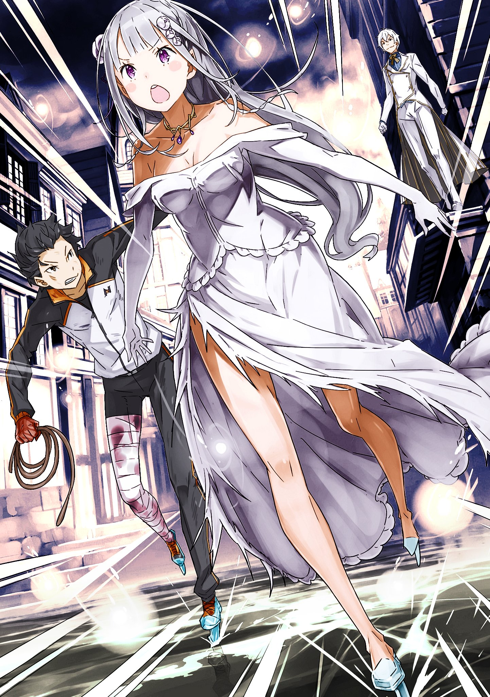

※ ※ ※ ※ ※ ※ ※ ※ ※ ※ ※ ※ ※

Разрушение неумолимо приближалось.

Льющиеся с неба капли свежей крови, каждая из которых несла чудовищную разрушительную силу, терзали город.

Там, где касалась капля крови, всё теряло свою целостность легче, чем бумага под лезвием. Волна разрушения обрушивала здания, и отголоски обвалов распространялись, уничтожая городские улицы.

— «Оооооооо――х!!»

— «――х!»

Понимая тщетность, но всё же выжимая воздух из лёгких, Субару продолжал бежать изо всех сил. Рядом с ним, с развевающимися серебряными волосами и плотно сжатыми губами, неслась Эмилия.

Однако живописный водный город славился своими водными путями, раскинувшимися во всех направлениях.

Проще говоря, даже найти кратчайший прямой путь для побега было на удивление сложно.

Прямо перед бегущей парой раскинулся широкий канал, а разрушение сзади грозило поглотить их.

— «Плохо дело!»

— «Рискованно, но… Субару, держись!» — вскрикнул Субару, когда путь был отрезан, но Эмилия тут же приняла другое решение. В тот момент, когда Субару без колебаний схватил протянутую руку, окружающий воздух сковал холод.

Короткое заклинание Эмилии, и одновременно появилось множество крошечных точек света.

Это было одновременное использование магии, питаемой собственной маной Эмилии, и духовных искусств с помощью малых духов.

— «――Пожалуйста, все!»

Когда Эмилия отдала приказ малым духам, синий свет хлынул из точек света и побежал по земле.

В следующее мгновение земля под ногами мгновенно побелела, а после моргания перед глазами раскинулся серебряный мир. Улица заледенела, подошвы ботинок страшно заскользили, и Субару чуть не вскрикнул.

В том же положении, почти упав, его тело резко потянуло вперёд.

— «Уо?! Эмилия-тан, круто! Умно!»

— «Контролировать сложно, не отпускай руку!»

Подняв голову, Субару увидел, что его левая рука сжата правой рукой Эмилии. А Эмилия поднятой левой рукой держалась за ледяную сосульку, выпущенную вперёд.

Она заморозила землю и использовала движущую силу магии, создавшей сосульку, чтобы увеличить скорость побега. Ещё более удивительным было то, как малые духи проложили ледяную трассу.

На краю большого канала перед ними образовался изгиб, похожий на лыжный трамплин, и Субару с Эмилией, набрав скорость, проскользили по воздуху, перелетая через канал.

— «И-и-иха-а-а!»

На другой стороне канала также была создана ледяная трасса, и они приземлились на неё, продолжая скользить — Субару искренне восхитился мастерством Эмилии.

— «Отлично, Эмилия-тан! Так круто, что я снова влюбился!»

— «Но я не знаю, как остановиться! Что делать?»

— «Э?»

Эмилия уже отпустила сосульку, но даже оставшейся инерции было достаточно, чтобы получить серьёзные повреждения при столкновении со стеной. Ледяная магия Эмилии не могла создать удобную подушку, способную смягчить удар для двоих.

Пока они говорили, стена перед ними стремительно приближалась. Столкновение казалось неизбежным. Почувствовав, как рука Эмилии крепче сжала его, Субару мгновенно принял решение.

— «Эмилия-тан! Сделай поворот!»

— «П-поворот?»

— «Стену, которая плавно изгибается! По кругу!»

В ответ на отчаянный голос Субару, магия Эмилии послушно сработала.

Перед скользящей парой возник плавный изгиб, и, следуя ему, их тела избежали столкновения, сделав большой круг.

— «Не прерывай поворот, так и продолжай по кругу! По кругу!»

— «П-по кругу!»

Продолжая описывать большой круг, ледяной изгиб создавался непрерывно.

Если посмотреть сверху, ледяная стена образовывала форму, похожую на спираль от комаров, и к тому времени, как их тела достигли центра, инерция, к счастью, иссякла, и они остановились сами собой.

— «Фух, пришлось растратить кучу маны Эмилии-тан, но мы справились…»

— «Важнее то, что была за атака!»

Когда остановившийся Субару перевёл дух, Эмилия хлопнула рукой, разбивая ледяную стену. Увидев, как осколки льда превращаются в частицы маны, Субару посмотрел на следы надвигавшегося разрушения, и его пробрал озноб.

Городской пейзаж вокруг башни, откуда началась атака Регулуса, полностью изменился.

Особенно ужасными были разрушения в центре, который сильно пострадал от кровавого дождя. По мере расширения круга разрушений следы становились более разрозненными, но зданий, сохранивших хоть какую-то форму, было очень мало. Это была поистине невообразимая атака.

Атака в направлении Субару и Эмилии также пересекла большой канал и достигла этой стороны. То, что она не достала их, было результатом случайности и отчаянного бегства — нет.

— «Райнхард!»

На здании, где только что стоял Регулус, никого не было.

Вместо этого неподалёку поднимался густой дым и раздавался ужасающий грохот разрушения.

※ ※ ※ ※ ※ ※ ※ ※ ※ ※ ※ ※ ※

Разорвав труп водяного дракона и разбрызгивая его кровь, Регулус усмехался.

Внизу, на улице, виднелись две маленькие фигурки, отчаянно убегающие.

Поистине ничтожные, поистине жалкие, совершенно незначительные.

Хихикая, он ждал момента, когда разбрызгиваемая кровь, терзающая город, настигнет убегающих.

Кровавый дождь — достойный конец для шлюхи и насильника.

— «Разлетайтесь! Разбрызгивайтесь! Мерзкие злодеи, посмевшие играть с моим сердцем!»

— «――Прости, но так не пойдёт.»

Сразу после того, как он облёк свою победу и гнев в слова, у самого уха раздался голос, заставивший его вздрогнуть.

Обернувшись, краем глаза он увидел красные волосы, словно пламя, раздуваемое ветром.

— «Ты просто смешон! С каким упорством ты пытаешься помешать чужой любви!»

— «Если бы твои методы были честными, ты уважал волю партнёра и мог обещать достойно отступить в случае отказа, я бы не прочь был тебя поддержать.»

На гневный крик Регулуса Райнхард ответил смехом, продолжая издеваться.

Его неизменное спокойствие раздражало, но в этот момент разум Регулуса охватило непонятное подозрение — а именно, ноги Райнхарда, позволившие ему одним прыжком оказаться здесь.

Ведь его правая нога точно была повреждена в районе голени.

Хоть она и не была оторвана, не будет преувеличением сказать, что ступня держалась лишь на лоскуте кожи. В таком состоянии он не то что сражаться, но и ходить не мог.

Раз он смог преодолеть это состояние, значит…

— «Как же ты раздражаешь. Мало того, что мечник отменный, так ещё и в исцеляющей магии мастер? Сколько чужих сердец ты растоптал своими бесчисленными талантами, которыми тебя одарили сверх меры? Наверное, приятно разбивать чужие сердца, не прилагая никаких усилий!»

— «Позволь мне чётко опровергнуть одно твоё заблуждение,» — сказал Райнхард, разворачиваясь в воздухе. Его тело закружилось, подняв ветер.

Удар ногой с разворота рассёк воздух и обрушился на труп водяного дракона, который размахивал Регулус. Труп, уже превратившийся в простой кусок мяса, разлетелся на мелкие кусочки…

— «Что?!»

— «Я не владею ни исцеляющей магией, ни какой-либо другой магией вообще. Рану на ноге просто залечили малые духи воздуха, позаботившись обо мне в спешке.»

Нога, которая, казалось, должна была уничтожить труп, вместо этого, используя разворот лодыжки, подхватила его из ладони Регулуса. Умелым движением ноги останки водяного дракона были аккуратно, без грубости, переброшены на крышу полуразрушенного здания.

А затем…

— «Как раз вовремя. ――Следующая проверка, выполняю операцию J.»

— «Куах?!»

В тот момент, когда Регулус заскрежетал зубами от лицемерного поступка Райнхарда, рукоять Драконьего Меча снова врезалась ему в висок. От удара тело Регулуса сбросило с башни.

Он полетел по диагонали к земле, и снова у его уха раздался голос:

— «Позволь мне испытать.»

— «――?!»

Прыгнув подобно пуле под тем же углом, Райнхард догнал его. Он схватил перевёрнутого Регулуса за ногу в середине падения и увлёк за собой.

Затем Райнхард, унося Регулуса, прыгнул в том же направлении, куда убегали Субару и Эмилия. Ужасающий порыв ветра и ускорение, от которого у обычного человека оторвалась бы схваченная нога.

— «Что ты вообще――!»

— «Ничего особенного,» — сказал Райнхард, останавливаясь и поднимая тело Регулуса. Он обращался с ним, как ребёнок, грубо играющий с куклой, схватив её за ногу. Когда гнев Регулуса от такого обращения готов был взорваться, он понял, что именно делает Райнхард.

Размахивая телом Регулуса, Райнхард ударил им по падающим каплям крови.

Это был тот самый кровавый дождь под влиянием Регулуса, который разрушал даже каменные здания.

Возможно, Райнхард предположил, что если атака Регулуса дарует неуязвимость тому, чего коснётся, то она сможет пробить даже неуязвимость, защищающую тело самого Регулуса.

Если так, то эта мысль была поверхностной.

— «Думаешь, я пострадаю от собственной атаки? Я не знаю, какими талантами ты одарён, но прекрати эту дурную привычку недооценивать других. Неужели ты думаешь, что я, Регулус, могу быть побеждён таким глупым способом?!»

— «Это тоже не сработало――х!»

Капли крови, коснувшиеся тела Регулуса, просто отскочили от него, став обычными каплями.

Естественно. Приоритет был другим.

Одновременно Райнхард рефлекторно отпустил ногу Регулуса.

Проницательный человек. Если бы он продолжал беззащитно касаться его, он бы размозжил ему ладонь так, что тот больше не смог бы держать меч.

Эффект от раскручивания исчез. Тело приземлилось на улицу, и Регулус снова оказался лицом к лицу с Райнхардом. Райнхард настороженно прищурился.

— «Похоже, к тебе снова нельзя прикоснуться.»

— «У тебя хороший нюх, но неужели ты хочешь снова испытать боль?»

— «В следующий раз я буду следить за дыханием и взглядом. Если есть другие меры предосторожности, дай мне знать.»

— «А ну исчезни с глаз моих, немедленно!!»

Регулус шагнул вперёд и, вытянув обе руки, бросился на Райнхарда.

Райнхард уклонился с невероятной скоростью, сделав большой круг. Сохраняя значительную дистанцию, он, тем не менее, начал наносить удары Драконьим Мечом в стиле “ударь и отступи”.

— «Вечно ты мечешься туда-сюда…!»

— «Я совершенно беспомощен против проблем, которые нельзя решить мечом. Мне стыдно за себя.»

— «Хотя ты ни разу даже не обнажил свой меч!»

Регулус беспорядочно махал руками в сторону летающего Райнхарда.

Однако такая небрежная атака не могла достичь героя Райнхарда. Более того, голубые глаза Райнхарда следили даже за хитрой уловкой Регулуса, пытавшегося выдохнуть на него. Ситуация зашла в тупик, где ни одна из сторон не могла нанести решающий удар.

— «А?»

Но тут внезапно вмешалась третья сторона.

Ледяная сосулька выстрелила из-под ног Регулуса, стоявшего напротив Райнхарда, пытаясь пронзить его тело.

Однако ледяной шип, возникший под подошвой, был раздавлен прежде, чем успел пробить землю, и разлетелся на куски, не успев толком материализоваться.

Регулус мельком взглянул и увидел за водным каналом сереброволосую девушку, протянувшую к нему руку. Ледяная магия, несомненно, была её проделкой.

Чувство, будто внутренности кипят от злости.

— «Да поймите же вы все наконец! Мы разные! Все рождаются разными! Вам никогда не сравниться и не достать меня, цельную личность! Смиритесь со своей неполноценностью, будьте довольны и умрите!»

Он устал иметь дело с этими упрямцами, которые никак не хотели сдаваться.

Абсолютная разница непреодолима. Почему они этого не понимают?

— «――Операция А тоже провалилась. Что дальше?»

До ушей Регулуса, топчущего ногами и раскалывающего брусчатку, не донёсся шёпот Райнхарда.

※ ※ ※ ※ ※ ※ ※ ※ ※ ※ ※ ※ ※

— «Бесполезно! Похоже, эта атака тоже не сработала!»

— «Не сработала! Значит, версия о том, что подошвы — его слабое место, отпадает…»

По указанию Субару, Эмилия атаковала подошвы Регулуса — однако ледяная сосулька была раздавлена его ботинком, и не было никаких признаков того, что урон прошёл.

«Операция J тоже не сработала. Прости, мне не хватает сил.»

На мгновение от Райнхарда пришло телепатическое сообщение через «Благословение Телепатии», но Субару уже перестал удивляться его сверхчеловеческим способностям. Если присмотреться, рана на его правой ноге уже зажила, но Субару не удивился бы, даже если бы она была оторвана и приросла обратно.

В конце концов, он сам испытал, каково это, когда нога отрывается и прирастает.

— «Если он неуязвим и никакая атака не проходит, я подумал, что барьер может не действовать на части, касающиеся земли. Это была операция А (Аши-но-ура — подошвы ног), но…»

Если бы неуязвимость в точке контакта с землёй отключалась, он мог бы просто провалиться под землю. Поэтому Субару предположил такой вариант, но он тоже оказался неверным.

Судя по сообщению Райнхарда, предположение операции J (Джибаку — самоподрыв), что собственная атака Регулуса сможет пробить его неуязвимость, также не подтвердилось.

Учитывая, что операция П (Падение в воду — попытка столкнуть его в канал) тоже провалилась, большинство первоначальных предположений о слабых местах его неуязвимости оказались неверными.

— «Что ещё, что ещё может быть? Слабое место врага, который кажется неуязвимым, слабое место…!»

Приложив руку ко рту, Субару отчаянно пытался думать.

Он ломал голову над этим с момента первой встречи с Регулусом и до сих пор, но какие ещё способы можно придумать, чтобы победить обладателя так называемого “абсолютного щита”?

В его мозгу проносились знания из различных произведений субкультуры, пытаясь найти ответ, но безуспешно.

— «Может, я мыслю неправильно? Другой подход?»

Возможно, дело не в том, как пробить неуязвимость.

А в чём-то более фундаментальном — в чём на самом деле заключается Полномочие Регулуса?

— «Субару, что ещё я могу сделать? Что мне делать?» — спросила Эмилия, видя его задумчивость.

Перед ними, за широким каналом, продолжалась ожесточённая битва Райнхарда и Регулуса, и она чувствовала досаду от невозможности помочь им.

И Эмилия, и Райнхард доверяли Субару и возлагали на него надежды.

И не только они двое. Его товарищи, сражающиеся у других контрольных башен, и жители города, к которым он обратился по громкой связи, — все они чувствовали то же самое.

«――――»

Думать, думать, думать, думать, думать, думать, думать.

Неприятное воспоминание, но он перебирал в памяти всё: от первой встречи с Регулусом до этого момента, его действия и слова, предпринятые ими атаки и его ответные удары.

Что-то должно быть. Должна быть какая-то причина. Не обязательно связанная только с Регулусом. Может быть, что-то общее с другими Архиепископами Греха. Все они отморозки. Это он знал. Но не только это…

— «Имена… звёзд.»

— «Субару?»

Внезапно Субару осенило.

Он уже приходил к этой мысли, но отбросил её как вздор.

Но теперь он задумался, действительно ли эта идея была достойна того, чтобы её отбросить.

Регулус, Капелла, Альфард, Сириус, Петельгейзе.

Столько имён, связанных со звёздами, собрались вместе — можно ли действительно считать это совпадением?

Вспомни гостиницу «Водная Завеса», обычаи Карараги, пустоши Хосин.

В этом мире повсюду присутствуют следы влияния мира, в котором жил Субару, настолько, что их нельзя просто отмахнуться. Как можно теперь думать, что между Культом Ведьмы и этим нет связи?

Петельгейзе — это Бетельгейзе. «Длань Гейзе», «Незримая Рука».

Регулус — это звезда в созвездии Льва, «Маленький Король». И у неё есть ещё одно название.

«Маленький Король» — это имя, которое идеально ему подходит, но…

— «Эмилия, я хочу кое-что спросить.»

Глаза Эмилии расширились от тихого голоса Субару, затем она кивнула.

Чувствуя, как её бледное лицо серьёзно смотрит на него, Субару прикрыл один глаз.

— «Он ведь хватал тебя за шею, верно? В тот момент…»

— «Да.»

— «Рука Регулуса была горячей? Или холодной?»

«――――»

Эмилия округлила глаза от вопроса Субару.

Затем она коснулась своей тонкой шеи, мгновение подумала и ответила:

— «Нет. Сейчас, когда я думаю об этом… я ничего не почувствовала. Ни тепла, ни холода, вообще никакого тепла.»

Услышав ответ Эмилии, Субару затаил дыхание.

Его сбросили в канал, но дыхание не сбилось, тело не намокло. Атаки по подошвам и по нему самому не прошли. Способность, которая не оставляла лазеек ни в атаке, ни в защите.

Если это не простая «неуязвимость»…

— «Райнхард!» — позвал он героя, сражавшегося с безумцем по ту сторону широкого канала.

В пылу непрерывной битвы, не дававшей передышки, Райнхард, тем не менее, посмотрел в сторону Субару.

Так, чтобы тот услышал, Субару крикнул:

— «――Проверь, бьётся ли у него сердце!»

От громкого крика Субару Эмилия и Райнхард расширили глаза.

А Регулус…

Регулус…

※ ※ ※ ※ ※ ※ ※ ※ ※ ※ ※ ※ ※

Убедившись, что группы захвата из каждого лагеря отправились на одновременный штурм четырёх контрольных башен, Отто также покинул городскую ратушу, чтобы выполнить возложенную на него задачу.

— «Вообще-то, следовало бы тебя остановить… но нам действительно нужно выяснить местонахождение «Книги Мудрости», которую требует Культ Ведьмы. Не повезло тебе, Отто,» — сказала Анастасия, провожая Отто.

В глубине души Анастасия, вероятно, хотела бы, чтобы Отто остался в ратуше. Это была настоящая мясорубка, где каждый лагерь, включая Субару, столкнулся с Архиепископами Греха.

Поскольку ратуша должна была выполнять роль командного центра, мозги для обработки информации, поступающей со всех концов города, никогда не бывают лишними.

Однако доверить сбор «Книги Мудрости» кому-то другому было тоже сложно.

Хотя они и сотрудничали для борьбы с Архиепископами Греха, как только ситуация разрешится, они снова станут врагами. В таком случае следовало избегать ситуации, когда другие лагеря узнают о силе «Книги Мудрости».

По правде говоря, он бы предпочёл вообще не упоминать о силе «Книги Мудрости» на переговорах, но Субару и Гарфиэль вряд ли оценили бы такие интриги.

Чувствуя себя негодяем, Отто захотелось вздохнуть.

— «И когда это я стал так бегать ради других…»

Положив руку на седую голову, Отто снова задумался над вопросом, который мучил его много раз за последний год.

Неожиданное положение, неожиданные отношения с людьми, неожиданные собственные чувства.

Что бы подумала его семья, если бы узнала, чем он занимается?

— «Когда всё благополучно закончится, может, напишу им письмо…» — пробормотал Отто слова, которые Субару, будь он здесь, непременно назвал бы «флагом смерти», и направился к Третьему району города.

Архиепископы Греха должны были сосредоточиться у контрольных башен, и, по их расчётам, культистов в городе быть не должно. Не должно, не должно.

— «Ха… хах.»

Крепко сжав грудь, Отто почувствовал, как учащается его сердцебиение.

Культ Ведьмы, Архиепископы Греха, культисты — всё это было связано для Отто с воспоминаниями о страхе.

Воспоминания о встрече с Субару и остальными год назад были неразрывно связаны для Отто с воспоминаниями о том, как он чуть не лишился жизни. Ужас Архиепископа Греха, с которым он столкнулся тогда, он не мог забыть до сих пор.

Глаза безумца, которому было совершенно наплевать на лишение человеческой жизни.

Вид фанатиков, следовавших за этим безумцем и безвольно жертвовавших своей кровью и плотью.

Безмолвное одиночество, царившее вокруг, когда он всем сердцем молил о помощи.

Он никогда не испытывал такого страха. Никогда не чувствовал себя таким опустошённым.

По сравнению с тем ужасом, ни битва с Гарфиэлем, ни встреча с Охотницей за Кишками, ни столкновение со стаей демонических зверей — ничто не шло в сравнение.

Встреча с Культом Ведьмы оставила такой глубокий тёмный след в душе Отто.

И хотя он испытывал такой страх, их зловещая хватка никак не ослабевала.

Эмилия, которую из-за сходства с «Ведьмой Зависти» не могли не поносить как ведьму.

Субару, ставший её рыцарем и обречённый на постоянную борьбу с Культом Ведьмы, преследующим полуэльфов.

Беатрис, решившая разделить судьбу с Субару и отдать всю себя, несмотря на своё маленькое тело.

Гарфиэль, вкладывающий всего себя в кулаки, чтобы защитить свою семью.

Рам, чья язвительность скрывает мягкость, не позволяющую ей бросить кого-либо.

Фредерика, живущая с чувством вины перед младшим братом и ответственностью своего положения.

Петра, которую считают ребёнком, но которая лучезарно ведёт себя ради улыбок всех остальных.

Он любил их всех.

Хотя он и не собирался оставаться на одном месте, ему стало так уютно, что он и не заметил.

И хотя он знал, что придётся столкнуться с ужасным, ему было трудно покинуть их.

Если это необходимо для защиты этого места, для того, чтобы стоять рядом с ними, он хотел бы одолеть даже символ страха и восполнить всё то, до чего не дотянутся их руки.

Поэтому…

— «Я должен как-то выполнить свою роль,» — сказал Отто, войдя в Третий район и остановившись на улице.

Прямо перед ним стояла маленькая фигурка.

За каменным мостом через водный канал была площадь, и маленькая фигурка стояла там.

Кроме этой фигурки, вокруг виднелось ещё несколько теней.

Но в этот момент взгляд Отто был прикован только к этой маленькой тени.

Звуки исчезли. Было ужасно тихо, ничего не слышно.

Ситуация, когда все живые существа затаили дыхание, отчаянно пытаясь скрыть своё присутствие.

Отто Сувен знал эту ситуацию.

Поэтому, когда фигурка перед ним опустила руки и, встряхнув длинными тёмно-каштановыми волосами, подняла голову, его сердцебиение было на удивление спокойным.

— «Добро пожаловать, братик.»

«――――»

— «Добро пожаловать на пиршество Архиепископа Греха Культа Ведьмы, отвечающего за «Чревоугодие»… Лая Батенкайтоса!»

Открыв пасть, полную клыков, Архиепископ Греха, которого здесь быть не должно, зловеще усмехнулся.

※ ※ ※ ※ ※ ※ ※ ※ ※ ※ ※ ※ ※
