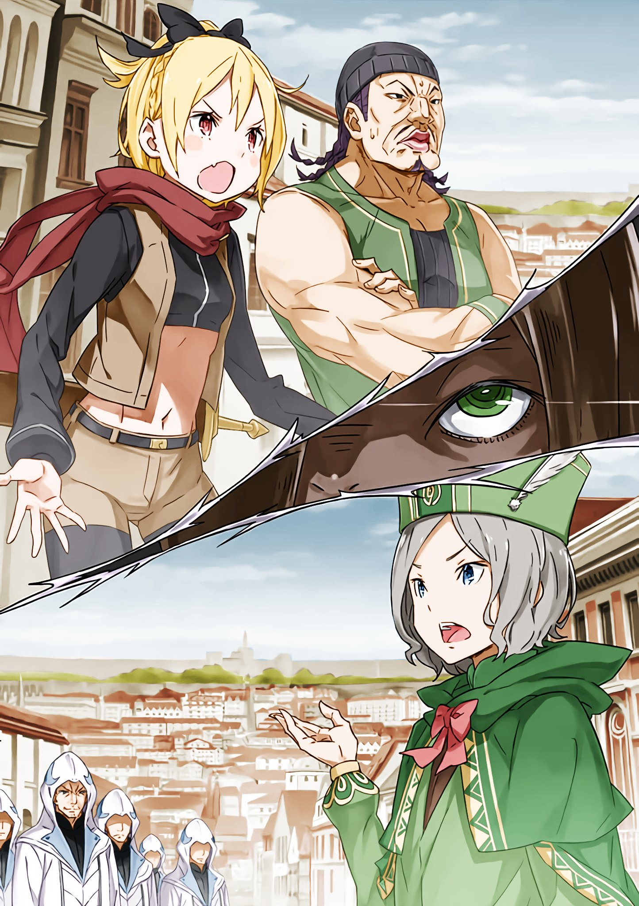

※ ※ ※ ※ ※ ※ ※ ※ ※ ※ ※ ※ ※

— «Чревоугодие…!»

Кошмар стоял прямо перед ним, и Отто не мог сдержать холодный пот, стекавший по спине.

Враг, назвавшийся Архиепископом Греха — имя «Чревоугодие» Отто тоже слышал. Однако это имя…

— «Насколько я слышал, Архиепископа Греха «Чревоугодие» должны были звать Лой Альфард.»

— «Ого-го, неужто вы встретили нас раньше, чем встретили нас? Если так, братец, то ты крут, что тебя не доели, хоть и выглядишь обычным. Лой — обжора, для него всё пиршество!»

Мальчишка, назвавшийся Лай Батенкайтосом, звонко рассмеялся в ответ на вопрос Отто. Слушая его смех, Отто понял, что его страшное предположение подтвердилось.

— Архиепископов Греха «Чревоугодие» двое.

— «Нет, вернее, как минимум двое…»

Лай и Лой, а точнее, Батенкайтос и Альфард. В худшем случае, возможно, придётся готовиться к кошмару вроде бесчисленного множества Великих Кроликов.

Юлиус и Рикардо должны были отправиться штурмовать контрольную башню «Чревоугодия», но если их там ждёт не один враг, то они не просто столкнутся с трудностями — поражение будет неизбежно.

— «Эй! Время, что ли, нашлось любезничать с этим типом?! Сейчас не до того же!!»

Отто обострял чувства, ощущая жжение во лбу. В его размышления вмешался резкий девичий голос.

Конечно, Отто заметил обладательницу голоса. Заметил, и потому был сбит с толку.

— «Фельт, почему ты здесь? Райнхард же велел тебе сидеть тихо в убежище!»

— «Когда в городе такое творится, буду я, что ли, сидеть в убежище, свернувшись калачиком?!»

Храбро заявила златовласая красноглазая девушка. Теперь, встретившись лицом к лицу, её ни с кем не спутаешь — это была Фельт.

— «Так значит, не усидела на месте, выскочила и наткнулась на Архиепископа Греха? В таком случае, тебе не везёт не меньше, чем мне…»

— «Не надо так уж пессимистично, братец. Для нас любая встреча — лишь специя к деликатесу. Нас хоть и зовут «Чревоугодием», но мы прекрасно понимаем важность подготовки!»

Батенкайтос был в центре, Отто и Фельт образовывали с ним треугольник. В оставшейся вершине тоже виднелся силуэт, и этот человек был Отто знаком.

— «Рад снова вас видеть, Киритака…»

— «Трудно принять это всерьёз, когда ты говоришь таким подавленным голосом и с мёртвым взглядом, парень! Хотя твои чувства мне понятны!»

Отто не мог искренне радоваться встрече, видя перед собой болезненно выглядящего Киритаку — худого, в бинтах.

Это он столкнулся с «Чревоугодием», когда Отто бежал из штаб-квартиры компании Мьюз и направлялся к мэрии, после чего его судьба была неизвестна. То, что он выжил, радовало, но как участник событий в текущей ситуации он вызывал серьёзные опасения.

— …

Вероятно, то же самое Фельт и Киритака думали и об Отто.

— Хотелось бы кого-то, кто умеет сражаться получше.

— «Три группы некомбатантов столкнулись вплотную с основной силой противника. Что за злая шутка? Прекратите.»

— «У меня и у этого фаната певички хотя бы есть спутники, так что ещё не так плохо. А вот ты, братец, совсем один — слишком ненадёжно.»

Фельт цокнула языком на ворчание Отто.

В этом отношении Отто не мог возразить. С Фельт был крупный слуга в грубой одежде. Киритака тоже привёл нескольких членов «Чешуи Белого Дракона».

Только Отто был один и налегке.

— «Сколько бы вас ни собралось, всё едино. Вам не утолить нашу жажду! Ааа, где же ты, мы ищем тебя, хотим встретить, встретить, дай же нам встретиться!»

Несмотря на то, что его окружали Отто и остальные, пессимистично оценивающие свои силы, Батенкайтос сохранял полное самообладание.

Мальчишка болтал руками и с экстатическим выражением лица бормотал что-то непонятное.

— «Хотите встретить? О чём вы вообще говорите?»

Ухватившись за эти слова, Отто попытался продолжить разговор. Уверенность Батенкайтоса была обоснованной.

Стоит ему захотеть, и он вмиг расправится с Отто и остальными. Нужно было хоть немного потянуть время — и, если повезёт, создать лазейку.

— «Нам уже надоело объяснять одно и то же. Другие почему-то не хотят раскалываться! Неприятно, неприятно же, неприятно, ну разве не неприятно?»

— …

Фельт и Киритака с суровыми лицами покачали головами в ответ на слова Батенкайтоса.

Похоже, это их он спрашивал, и они не ответили.

И судя по тому, что разговор неожиданно завязался, Отто решил, что с «Чревоугодием» всё же можно договориться.

Благодаря «Божественной Защите Языков Души» ему доводилось общаться даже с теми, с кем люди обычно не могут обменяться и мыслью.

Я проведу переговоры. Любая трудность — это пустяк по сравнению с проблемами, окружающими Субару.

— Одолжите мне сил, Нацуки!

— «Не говорите так, возможно, я смогу помочь. Пожалуйста, расскажите. Может, это связано с вашим требованием об искусственном духе?»

Весьма рискованный шаг. Выпалив это без запинки, Отто выбрал слова, которые могли поджечь фитиль Батенкайтоса. Но тот покачал головой.

Поняв, что Отто готов к разговору, мальчишка радостно улыбнулся и сказал:

— «Мы хотим знать только одно… про ту трансляцию, что была слышна по всему городу. Мы ищем героя, который это сделал.»

— …

Беру свои слова обратно.

Всё-таки не стоило Субару одалживать мне сил, и лучше бы он и имени своего не одалживал.

— «Этот милый-милый герой, похоже, придёт судить нас. Наша юная грудь вот-вот разорвётся в ожидании этого!»

— «…Нельзя ли что-нибудь сделать с его способностью притягивать исключительно проблемных типов?»

Будь он здесь, наверняка бы возразил: «Я этого не хотел!», но жаловаться на отсутствующего человека было бессмысленно.

Фельт нахмурилась, увидев реакцию Отто.

— «Потому и говорила, что пытаться разговаривать — бесполезно! Кто ж своих сдаёт? На такое безжалостное дело только Райнхард и способен!»

— «С такой оценкой я бы поспорил, но я видел, как вас, Фельт, держали взаперти, так что промолчу!»

Фельт, тяжело дыша носом, очевидно, не раскололась на тот же вопрос Батенкайтоса. Киритака, похоже, тоже.

Оба, должно быть, понимали, что Батенкайтос требует выдать Субару, но тут же отвергли это.

— …

Как человеческий поступок — это благородно, но в данной ситуации нельзя не признать это слишком поспешным.

Проще говоря, Субару не подумал бы, что его предали.

— «Вы не у тех спросили. У них мало связи с тем героем, которого вы ищете. Они просто нетерпеливые особы, которые вдохновились речью и выскочили из убежища.»

— «Чего?!»

— «Тс-с…»

У Фельт вздулась вена на лбу от слов Отто. Но её заставил замолчать Киритака.

Глава компании Мьюз, как и ожидалось, мгновенно понял решение Отто. В то же время он бросил взгляд в его сторону.

В ответ на этот вопросительный взгляд Отто кивнул.

— «Раз вы не собираетесь действовать без разбора, я провожу вас к герою. Мне тоже дорога моя жизнь. Но вы должны гарантировать её сохранность.»

— «Ого! Знаешь? Ты знаешь? Где наш герой! Как выглядит наш любимый герой! Тот самый, слабый, хрупкий, тот, о ком мы так беспокоимся, что его нужно поддерживать!»

— «А?.. Да, знаю.»

Отто с чувством неловкости кивнул на пылкие слова Батенкайтоса.

Он говорил так, словно не понаслышке знал Субару. Для описания собственного образа героя это звучало слишком уж так, будто он был знаком с человеком по имени Нацуки Субару.

— «Нет, я проведу вас.»

Но Отто подавил это чувство неловкости.

Это же Субару. Неудивительно, если он знаком ещё с двумя-тремя Архиепископами Греха. Хотя Отто и не думал, что у Субару есть связи со всеми, но «Жадность», «Чревоугодие», «Похоть», «Гнев» — оказалось, что со всеми. Изначально со всеми.

— «Что-то у тебя совсем унылый вид, братец.»

— «Не ваше дело. Так что вы решите? Перебить нас всех здесь и остаться без зацепок или гарантировать нам всем жизнь в обмен на встречу с героем? Выбирайте.»

— «Какой неприятный тон. Это называется сделка, да? Мы не сильны в таких вещах, где надо думать головой.»

— «В таком случае, почему бы просто не выбрать рекомендуемый вариант? Это совет с точки зрения торговца.»

— «…Хм-м.»

Инициатива в разговоре была у Отто. Для Архиепископа Греха Батенкайтос был на удивление податлив. Только в этом он казался по-детски наивным, как и выглядел, и этот искажённый дисбаланс делал его чудовищем.

Может быть, он тоже несчастный мальчик?..

— «Ты ведь сейчас пожалел нас, да?»

В тот момент, когда эта сентиментальная мысль промелькнула в голове Отто, Батенкайтос вдруг сказал низким голосом.

— «А?»

— «Я помню этот взгляд. Взгляд свысока. Насмешливый взгляд. Взгляд, которым смотрят на товар… А-а, вот оно что. Я с самого начала чувствовал что-то неприятное.»

Во взгляде Батенкайтоса, устремлённом на Отто, появились откровенные отвращение и враждебность.

— «Ты ведь торговец? Из тех, кто назначает цену вещам, продаёт их другим и набивает карманы. Из тех упырей, кто взвешивает на весах ценность людей, их замыслы, всё-всё!»

— «В этом… я думаю, у нас есть некоторые расхождения во взглядах.»

Ситуация резко накалилась, и Отто, и без того чувствовавший себя канатоходцем, словно получил ещё и повязку на глаза.

Сможет ли он пройти до конца? Ответ читался на лицах Фельт и Киритаки, наблюдавших за переговорами.

— «Кто станет слушать таких, как вы?! В конце концов, этот мир — это пьянство! Обжорство! Нельзя доверять, пока не съешь, не поглотишь, не оближешь, не отхлебнёшь, не проглотишь!»

Батенкайтос топнул ногой и оскалил клыки.

Исходящую от него демоническую ауру было не сдержать. Ни уловки, ни слова уже не могли достичь разрывного снаряда, готового взорваться.

— «В итоге всё к этому и пришло.»

Недовольно сказала Фельт, вращая нож в руке. По иронии судьбы, её оружие было таким же, как кинжалы, привязанные к рукам Батенкайтоса. Хотя в мастерстве, вероятно, была огромная разница.

— «В таком случае, остаётся надеяться на людей из «Чешуи Белого Дракона»…»

— «Эй, эй! Мы вообще-то тоже здесь!»

Подал голос слуга рядом с Фельт, но она покачала головой. Видимо, он был здесь для массовки.

Прямо как Субару, бесполезный в критической ситуации.

— «От одной этой мысли его ценность сильно падает…»

— «Разговоры закончены?»

Батенкайтос медленно оглядел лица Отто и остальных. На всех лицах читалась готовность к бою.

Заметив это, Батенкайтос удовлетворённо кивнул.

— «В гастрономии важны подготовка и ингредиенты. Только когда собраны качественные продукты, добродетель еды оживает!»

— «Вроде понятно, а вроде и нет…»

— «И прекрасно, что непонятно! Наша эстетика не для того, чтобы её понимал кто-то, кроме нас! Ну что ж, тогда скоро… Приятного аппетита!»

Должно быть, он выбрал цель ещё во время разговора. Батенкайтос широко раскрыл рот и с невероятной прыгучестью устремился к Отто.

Отто, стоявший у самой воды, указал пальцем на летящего к нему богохульника.

— «Было бы хорошо, если бы страховка осталась просто страховкой!»

— «А?»

— «Вот так!»

Перед Батенкайтосом, недоверчиво нахмурившимся, Отто дважды громко топнул ногой.

Услышав этот звук, словно притянутые им…

— !!!

Из водного канала за спиной Отто вырвалась стая водных драконов и разом хлынула на Батенкайтоса.

— То, что Отто удалось обмануть стаю водных драконов, во многом было заслугой эффекта Полномочия «Гнева».

Распространившееся если не по всему городу, то по очень широкой области, Полномочие «Гнева» сильно всколыхнуло эмоции горожан, заставило мгновенно расцвести едва проклюнувшиеся семена тревоги и привело к огромной неразберихе и взаимному недоверию.

Однако именно это использовал Нацуки Субару для поднятия боевого духа в своей недавней речи, и это же послужило основой для тайных махинаций Отто, позволивших заручиться силой водных драконов.

— «У-оооооо?!»

Находясь в воздухе, Батенкайтос не мог выдержать натиск хлынувшей на него массы водных драконов.

Извивая змееподобные туловища без конечностей, несколько водных драконов, каждый весом не меньше сотни килограммов, придавили Батенкайтоса.

Сверкая влажной, отливающей синевой чешуёй, они один за другим вонзали клыки в придавленного Батенкайтоса.

— «Охота водных драконов жестока.»

Они вонзают клыки в добычу, вращаются и вырывают плоть. Столько водных драконов набросилось на это маленькое тело — не останется даже кусочка мяса.

— …

Остался неприятный осадок.

Он использовал «Божественную Защиту Языков Души», чтобы умело обмануть водных драконов, находившихся в сильном возбуждении под влиянием Полномочия «Гнева».

Он заманил их сладким предлогом — убить виновника хаоса в городе — и заручился их поддержкой. Если бы не столкновение с Архиепископом Греха, ему пришлось бы нарушить это обещание, но… результат был налицо.

— «Круто! Это ты, братец, их натравил?!»

Воскликнув от восторга, Фельт подбежала к нему.

Судя по тому, что она и бровью не повела перед этим довольно жестоким зрелищем, нервы у неё были крепкие.

— «Я просто указал разъярённым водным драконам цель. Будь то Архиепископ Греха или кто угодно, против законов природы не попрёшь.»

— «Может, и так… но вы совершаете более страшные вещи, чем я думал.»

Подошедший Киритака тоже высказал мнение, более свойственное обычному человеку.

— «В любом случае, я рад, что вы целы. Киритака, не ожидал, что вы живы…»

— «Меня сильно рубанули по спине, но, к счастью, «Чешуя Белого Дракона» — известные наёмники. У них есть и целители.»

Тем не менее, он всё равно выглядел болезненно.

Но какова была причина, по которой Киритака передвигался, несмотря на такую рану?

Словно уловив смысл взгляда Отто, Киритака с серьёзным выражением лица приложил руку к груди.

— «Разве не ясно? Упрямство. У меня есть положение как у одного из управляющих Пристеллы. Я слышал трансляцию, но не могу просто спрятаться и сказать: «Полагаюсь на вас во всём».»

— «Ваш настрой вызывает уважение, но…»

— «Конечно, я понимаю, что вряд ли смогу принести много пользы в бою. Но даже я могу проявить упрямство.»

Пылкие слова Киритаки были следствием синергетического эффекта Полномочия «Гнева» и речи Субару, из-за чего он был сильно воодушевлён.

Понятно, та речь Субару, ставшая опорой для горожан, слишком сильно действовала на людей с сильным чувством долга.

Настолько, что позволяла совершать безрассудные поступки, которые обычно остановили бы страх и разум.

— «Не думай, что это простое безрассудство.»

Словно прочитав мысли Отто, сказала Фельт, надув губы.

— «Право сражаться за то, что дорого, есть у каждого. Даже без громких причин, без веских оснований, желание что-то сделать никто не остановит, верно?»

— «Это… мнение отдельного человека, но для человека на ответственном посту такое решение недопустимо.»

— «Это образно говоря! К тому же, я не говорю, что сейчас именно тот случай. И я, и эти ребята выскочили, потому что у нас есть шансы на победу.»

— «Шансы на победу?»

Поддержав Киритаку и не отступая, Фельт потёрла пальцем под носом и сказала:

— «Я тоже слышала трансляцию того братца. И Райнхард-дурак должен был присоединиться к тебе в мэрии. Все связанные с этим люди, кроме меня, собрались там, верно?»

Если Фельт чувствовала себя бесполезной, то это было ошибкой. В мире существует принцип «каждому своё место», и есть вещи, которые могут сделать только определённые люди.

Следуя этой логике, Отто мог потерять понимание, зачем он сам здесь находится, поэтому он решил не развивать эту тему.

— «Хейнкеля вы надёжно схватили?»

— «Кан за ним в убежище присматривает. А я с Гастоном возвращаюсь, мы ходили забрать кое-что.»

Сказав «кое-что», Фельт кивнула подбородком в сторону Гастона. В руках здоровяка был белый свёрток, похожий на длинное копьё.

— «Это?»

— «Старик Ром… наш стратег и мозговой центр, дал нам. Секретное оружие, говорит. Магический артефакт.»

— «Магический артефакт?! В такой момент, как удачно!»

Поразительная сила магических артефактов позволяла достигать результатов, которые иначе были бы невозможны.

Услышав про секретное оружие, нельзя было не возлагать надежды.

— «Условия для его использования немного муторные, но если их выполнить, мощность гарантирована. Хотя того типа только что прикончил братец, так что придётся использовать на другом…»

— !

Вряд ли слова Фельт стали причиной, но именно в этот момент до ушей Отто донёсся крик.

Отто резко обернулся, и от его реакции Фельт и Киритака округлили глаза. Они не слышали этого крика. Естественно.

Ведь это был не тот крик, что могли различить люди.

— «Вы оказались занимательнее, чем мы думали… но обычные водяные ящерицы — совсем несытная еда. Для нас, гурманов, даже в качестве закуски они никуда не годятся!»

Раздался голос, словно насмехающийся над всем сущим.

В тот же миг стая водных драконов, только что жадно пожиравшая добычу, начала метаться. Они мотали хвостами, туловищами, головами — это напоминало их возбуждённое состояние во время атаки, но судорожные стоны и хлещущая кровь ясно говорили остальным об очевидной аномалии.

— «Фельт, этот магический артефакт… он ведь мощный?»

— «Старик Ром говорил, что даже Райнхард не сможет его заблокировать.»

— «Понятно. Это обнадёживает… Киритака!»

— «Ч-что такое?»

Фельт отвечала уверенно, а Киритака выглядел несколько испуганным состоянием водных драконов.

Его телохранители из «Чешуи Белого Дракона» — это одно, но оставаться здесь некомбатанту Киритаке было просто опасно.

— «Мы с Фельт и людьми из «Чешуи Белого Дракона» выиграем здесь время. А вы тем временем, Киритака, направляйтесь к мэрии… нет, в восьмое убежище на Первой улице!»

— «И что там будет, если я туда пойду?!»

— «Пойдёте — и всё поймёте. Шансы на победу, которые вы принесли, Киритака, пригодятся именно там.»

Словно обрётший силы от заявления Отто, Киритака изменился в лице и решительно кивнул.

Он обернулся к телохранителям за спиной и сказал:

— «Вы всё слышали. Я сейчас направлюсь в убежище согласно указаниям господина Отто. А вы должны сражаться здесь вместе с ними. Ради защиты города.»

— «Нашей работой должна была быть охрана молодого господина… но когда мы успели оказаться в таком затруднительном положении?»

— «Не так. Работа — не моя охрана. Помочь мне достичь моей цели — вот первоначальный контракт.»

Киритака с предельно серьёзным лицом ответил усмехающимся наёмникам из «Чешуи Белого Дракона». То, что он использовал «боку» [я], говорило о том, что личные чувства Киритаки перевесили его положение ответственного лица города.

— «Помогите мне достичь моей цели, «Чешуя Белого Дракона». Сразимся, чтобы защитить город Пристеллу, наше важное место работы, и спасти нашу любимую певицу, Лилиану.»

— «Хоть она на вас и не смотрит.»

— «То, что она мне не улыбается, никак не связано с моими чувствами к ней. Я люблю Лилиану. Лучшей причины рисковать жизнью и быть не может.»

Заявив это, Киритака посмотрел на Отто и Фельт.

Затем он поднял сумку, которую держал в руке.

— «Я обязательно доберусь. Карту этого города и всё о Лилиане я знаю лучше кого бы то ни было.»

— «На миг показалось, что это круто, но всё-таки противно.»

Отто был согласен с мнением Фельт, но промолчал, лишь молча кивнул в ответ на решимость Киритаки.

— «Ну что, вы готовы?»

Движения корчившихся водных драконов прекратились, они закатили глаза и были при смерти.

Пройдя сквозь их стаю, медленно приблизился Батенкайтос. Богохульник в обличье мальчика посмотрел на врагов, сверлящих его взглядом, и радостно обнял себя за плечи.

— «Хорошо, вот так и надо. Безрассудство и отвага — разные вещи, как и отчаяние и несгибаемость! По вашим лицам видно, что вы это понимаете. Я рад. Наконец-то вы тоже заслужили право оказаться на нашем столе.»

— «Значит, до сих пор мы годились только для мусорки? Вечно он бесит, зараза.»

— «Хорошо это или плохо, что нас признали врагами, — это другой вопрос. Лично я думаю, что было бы гораздо больше ходов, если бы нас продолжали недооценивать.»

Понял бы такие мысли Субару? Или его собственные нынешние мысли тоже были явным следствием влияния Субару? Неприятное предположение.

Как бы то ни было,

— «Киритака!»

— «Да пребудет с вами удача в бою!»

Повинуясь зову Отто, Киритака побежал, чтобы покинуть это место. Увидев фигуру Киритаки, единственного, кто пытался сбежать с поля боя, Батенкайтос склонил голову набок.

— «Прекрати! Мы только-только вошли в раж, и наше чувство голода так приятно обострилось!»

Преследуя убегающего Киритаку, тело Батенкайтоса резко прыгнуло вперёд. Используя всё своё маленькое тело, он летел по диагонали по воздуху с невероятной скоростью.

Казалось, клыки Батенкайтоса вот-вот достигнут Киритаки. В последний момент…

— «Гастон!»

— «Если я из-за этого умру, то буду плакать и являться тебе призраком!»

Голос Фельт рассёк воздух, и почти одновременно выскочивший здоровяк преградил путь Батенкайтосу.

Скрестив руки перед лицом и присев, в стойку встал слуга Фельт, Гастон.

— «Не мешай!..»

Батенкайтос взмахнул кинжалом на руке, пытаясь сразить помеху. Стальное лезвие тускло сверкнуло, и удар пришёлся по голой руке Гастона.

Раздался звонкий звук, и кинжал Батенкайтоса сломался.

— «А?»

— …

Вопросительный возглас Батенкайтоса отражал недоумение Отто и остальных, наблюдавших за этим.

Поза Гастона не изменилась. Он сломал кинжал Батенкайтоса своей рукой.

— «Мой здоровяк крепкий, да? Он ведь моя броня.»

Довольная тем, что напугала его, Фельт метнула нож из своей руки в Батенкайтоса. Тот уклонился, одновременно оттолкнувшись ногой от Гастона.

Сделав сальто назад и увеличив дистанцию, он увидел, что наёмники из «Чешуи Белого Дракона» переместились, преграждая путь.

Киритаке удалось сбежать.

— «Хм-м, ого. Понятно.»

Хотя Батенкайтоса и провели, приклеенная к его лицу гедонистическая улыбка не исчезла.

Батенкайтос поочерёдно оглядел стоящих перед ним Отто и остальных.

— «Луис обрадуется, пожалуй, троим.»

Прошептав это дрожащим вздохом, он снял с руки сломанный кинжал. Теперь его левая рука была пуста, вооружена была только правая, но…

— «Почему-то совсем не кажется, что разрыв сократился.»

Тревожный колокол в голове Отто по-прежнему бил набат, предупреждая о величайшей опасности.

Выбросив из головы этот оглушительный звук, Отто посмотрел на профиль Фельт. Увидев, что на её юном лице по-прежнему горит задорный боевой дух, он принял решение.

Пути к отступлению нет, будем сражаться.

— «То, что за последний год мне приходилось сражаться чаще, чем иным воякам, — как это расценивать для торговца?»

Эти слова, пробормотанные себе под нос, никто не услышал.

Поэтому никто и не заметил, что, несмотря на содержание слов, тон голоса не был пессимистичным.

※ ※ ※ ※ ※ ※ ※ ※ ※ ※ ※ ※ ※
