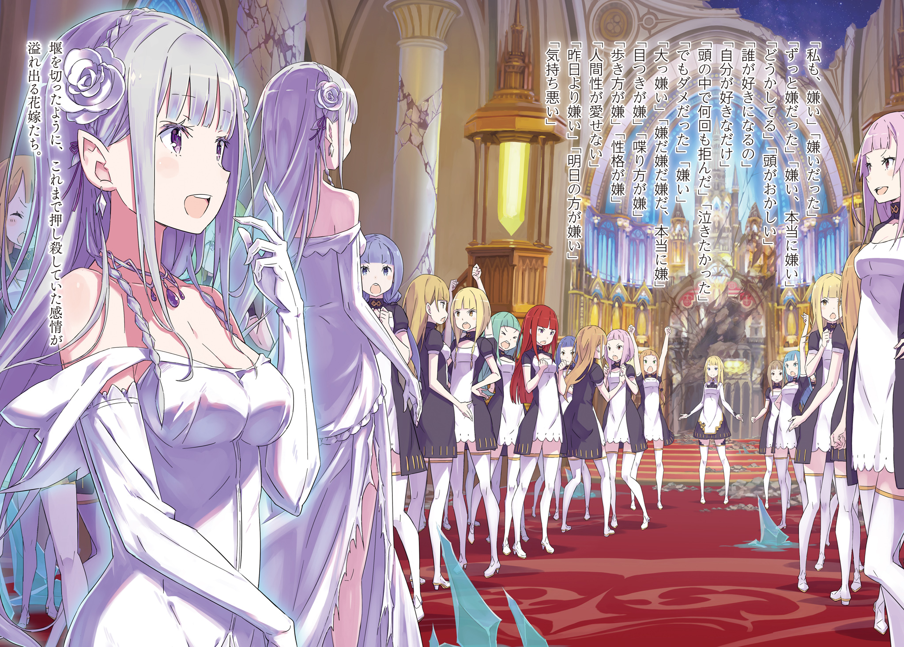

※ ※ ※ ※ ※ ※ ※ ※ ※ ※ ※ ※ ※

— Источник Власти «Жадности», связанный с именем звезды, — истинная природа «Непобедимости».

Связь между названиями звезд из знаний Субару и именами Архиепископов Греха.

«Рука Джаузы», этимология прозвища Бетельгейзе, во многом совпадает с «Незримой Рукой» безумца Петельгейзе Романеконти.

Поэтому Субару предположил, что между прозвищами звезд и Властями Архиепископов Греха существует тесная связь.

И Регулус Корниас, Архиепископ Греха «Жадности». Его имя, Регулус, означает созвездие Льва, а этимология происходит от латинского «Маленький Король» и… «Сердце Льва».

Хотя Субару сначала отмахнулся от этой мысли, он переосмыслил ее, поняв, что это не бессмысленные рассуждения, и пришел к одной гипотезе.

Прежде всего, что такое «Король»?

В настоящее время в Королевстве Лугуника в самом разгаре Королевский Отбор, и кандидаты изо всех сил стараются показать свой собственный «Королевский Путь». То, как каждый понимает свой «Королевский Путь», вероятно, прояснится в будущем, но Субару хотел поднять вопрос о «Короле» в более универсальном смысле.

А именно, «Король» — это представитель страны, тот, кто стоит на ее вершине.

Можно сказать, что это сама страна, если не подбирать слова, но может ли страна существовать только благодаря одному этому существу? Нет.

Государство может быть государством только при наличии «Короля» и «Народа», который ему подчиняется.

Исходя из этого понимания, Регулус Корниас, носящий имя «Маленького Короля», также должен быть сосудом, который может называть себя «Королем» только при наличии «Народа».

— «Тогда кто же эти „граждане“ „Маленького Королевства“, где Регулус — король?»

Об этом не нужно было даже думать.

Архиепископы Греха напали на город Пристеллу, не взяв с собой последователей Культа Ведьмы.

Каждый из них сам по себе был демоническим существом, несущим искаженную злобу, от которой хотелось отвернуться, но Регулус был единственным, кто намеренно привел с собой ненужный персонал.

Зачем ему это было нужно?

Учитывая характер Регулуса, нельзя было исключать простое желание самовыражения, но если это было не так, а ему пришлось это сделать?

— «Чтобы Регулус стал „Маленьким Королем“, ему нужны были его жены как „граждане“. Не знаю, имеет ли значение расстояние, но из-за этого ограничения Регулусу пришлось привести с собой пятьдесят невест».

Зависит ли условие «Непобедимости» от количества невест или от расстояния до них?

Если условием является то, что Регулус — «Маленький Король», то, возможно, это ограничивается зоной действия его «Власти» или чего-то подобного.

В любом случае, невесты не были непричастны к тому, что делало Регулуса «Непобедимым».

— «Но этого все еще немного не хватает для полного раскрытия секрета».

Текущее предположение Субару объясняло только часть, связанную с «Маленьким Королем».

Другое прозвище, «Сердце Льва», оставалось нераскрытым, и оно не объясняло эффекта неуязвимости к внешним воздействиям, помимо подавляющей атакующей и защитной силы, сопровождающей «Непобедимость».

Если бы это было простое усиление тела, Райнхард непременно смог бы его пробить. «Непобедимость» Регулуса явно превосходила такой уровень усиления.

— «Это не похоже и на сверхмощный барьер. Я перепробовал все возможные способы пробить „непобедимого“ врага. Кроме того, я убедился, что его сердце не бьется, а температуры тела нет. Тогда…»

Последняя деталь, связанная с прозвищем «Сердце Льва», была только одна.

Власть «Жадности» Регулуса — это не «Непобедимость».

Истинная природа подавляющей Власти безумца — это «Остановка времени объекта».

Удовлетворен, доволен, не испытывает недостатка.

Искаженная самооценка Регулуса, которую он постоянно изрекал, была самой его сущностью, но в то же время и разоблачением его способностей, которые не было нужды скрывать.

— «Поскольку время его тела остановлено, он не может получить урон от атаки и даже не намокает в воде. Поскольку время брошенного им песка остановлено, он проходит сквозь стены, не отскакивая от них».

В манге есть знакомая сверхспособность, похожая на «Разрыв пространства».

Это сила, которая буквально создает трещину в самом пространстве и разрезает все, что через нее проходит, независимо от прочности, но само существование Регулуса было чем-то подобным.

Регулус Корниас с остановленным временем был, можно сказать, самим искажением пространства.

То, что он находился в другом измерении, было именно тем, о чем он говорил — «Непобедимость» была лишь побочным продуктом Власти под названием «Остановка времени объекта».

То есть…

— «…Сокровище Застывшего Времени — вот истинная природа твоей Власти!»

— «Даже если ты говоришь это с таким энтузиазмом, я понятия не имею, о чем ты! Ты что, из тех, кто думает, будто все вокруг должны знать то же, что и ты? Осознай, насколько ты высокомерен, эгоистичный ублюдок!» — взревел Регулус на Субару, который прятался за каменной стеной и повысил голос.

Пробив стену, пересекая водный канал и буквально проходя сквозь городской пейзаж без малейших колебаний — таким разрушительным маршем Регулус догнал Субару.

Субару сейчас встречал его в одиночку. Хотя, по правде говоря, это была не такая уж и эффектная схватка, как можно было бы представить, услышав слово «встречал».

— «Ты такой надоедливый, мечешься туда-сюда. Думал, я скажу, что у тебя хватило смелости перестать убегать? Нам с тобой не о чем говорить. Ты же видел, как отлетел Святой Меча, неужели ты этого не понимаешь? Как ни посмотри! Это значит, что ты меня недооцениваешь, да?!»

— «Что бы ни делал тот, кто тебе не нравится, хорошее или плохое, это все равно бесит, верно? Даже если бы я убегал, я вижу только будущее, где ты найдешь к чему придраться. К тому же… этот выбор должен быть правильным».

— «Что значит „правильным“? И выбор человека, и стратегия — все! Результат можно назвать только искаженным. Та распутная девка, которая еще может сражаться, осталась бы — было бы лучше, верно? Неужели у тебя, любовника, есть какие-то таланты, кроме как уводить чужих невест?»

— «Жестокие слова».

Под градом липких речей Регулуса Субару, однако, не спешил.

Не спеша, не торопясь, выплескивая отвращение, он контролировал ситуацию одними лишь словами.

В настоящее время Субару заманил Регулуса в район немного поодаль от церкви, расстался с Эмилией и в одиночку столкнулся с безумцем.

Столкнулся — это, пожалуй, преувеличение. Ведь Субару просто прятался, непрерывно провоцируя и выигрывая время.

Если бы Регулус всерьез взялся за дело и начал бы разрушительные действия, охватывающие весь этот район, замысел Субару рухнул бы в одно мгновение. Но была уверенность, что он этого не сделает.

За короткое время и отнюдь не дружеское общение Субару довольно точно разглядел натуру Регулуса.

Проще говоря, Регулус — мразь.

Слишком просто сказано, это ничего не объясняет.

Подбирая слова более конкретно, Регулус — это тот тип человека, который ставит свои ценности превыше всего, но при этом совершенно не может игнорировать существование других.

По сути, он — воплощение жажды признания и самовыражения.

Называя себя бескорыстным и хвастаясь, что его существование самодостаточно, Регулус не может жить, не демонстрируя свою ценность другим.

Навязывая свои чувства, переписывая чужие ценности, принуждая страхом и насилием признать его превосходство.

Таков его подход не только к невестам, но и ко всему сущему.

Поэтому Регулус, в некотором роде, встречает все прямо и честно.

Схватка с Райнхардом — тому хорошее доказательство.

Если бы Регулус захотел, он мог бы силой своей Власти «Непобедимости» проигнорировать все атаки Райнхарда и убить надоедливых Субару и Эмилию.

Но Регулус не пошел на такой необдуманный шаг лишь потому, что честно и прямо принимал атаки Райнхарда.

Это не означало, что в его душе таилось неожиданное благородство.

Напротив, это доказывало еще более отвратительную черту его характера.

— Регулус — человек, который не может успокоиться, пока не сокрушит все своей Властью.

Поэтому он сокрушает Райнхарда, который его задирает, и не принимает тактического решения уничтожить провоцирующего Субару, не видя его.

Исходя из предпосылки, что он не будет ранен и не проиграет, он стремится сокрушить противника полностью и сломить его дух — это единственный способ сражения, на который он способен.

Его уродливая натура была настолько отвратительна, что на нее было тяжело смотреть.

Возможно, это чувство возникало потому, что в той или иной степени каждый носит в себе подобные злые эмоции. Даже Субару осознавал эту уродливую часть себя.

Именно потому, что Регулус заставлял смотреть на это в упор, его существование было таким отвратительным.

Однако именно поэтому забрезжил слабый шанс на победу.

— «Даже если „Сокровище Застывшего Времени“ тебе незнакомо, неужели мои предположения совсем неверны? Хотелось бы получить ответ хотя бы на этот счет».

— «Почему я должен на это отвечать? У меня нет ни долга, ни обязательств, и не раскрывать свои секреты — это даже не вопрос прав. До какой степени ты собираешься меня дурачить? Ты что, не поймешь, пока не разлетишься на куски?!»

Поддавшись на провокацию Субару, Регулус ударил ногой по земле.

Носок вонзился в каменную брусчатку, и земля легко поддалась, словно он зачерпнул пудинг. Летящие осколки, ориентируясь только на направление голоса, беспорядочно обрушились на укрытие Субару.

Еще до того, как они достигли цели, Субару, предугадавший действия Регулуса, отскочил от стены. Во время бегства он толкнул каменную колонну на краю улицы.

Тут же веревка, привязанная к колонне, развязалась, и раздалась цепь легких звуков.

Над головой Регулуса, поднявшего взгляд, чтобы понять, что происходит, обрушилось бесчисленное множество ледяных глыб. С помощью Эмилии эта улица превратилась в импровизированную зону ловушек, созданную Субару.

Разумеется, даже прямое попадание не нанесло бы Регулусу никакого урона…

— «Вот это вот! Называется „повторение одного и того же“!»

Не уклоняясь от падающих ледяных глыб, Регулус поднял руки и принял их всем телом.

Естественно, ледяные глыбы, неспособные пробить «Непобедимость», разбивались вдребезги и, рассыпаясь, возвращались в ману. Регулус демонстративно растаптывал и уничтожал разбросанные вокруг ледяные глыбы, включая те, что не попали в него.

— «Что это такое? Если твои длинные и нудные рассуждения верны, разве ты сам не считаешь эту атаку бессмысленной? Та девчонка могла бы атаковать гораздо эффективнее. Зачем ты идешь окольным путем, чего ты хочешь добиться?!»

— «Насчет окольного пути и чего я хочу — я могу ответить, если ты ответишь на мой вопрос. Это будет равноценный обмен, верно?»

— «Не воображай, будто мы с тобой на равных!»

Резко отпрыгнув назад, Субару увеличил дистанцию от Регулуса.

Чтобы догнать Субару, Регулус слегка согнул колени и одним прыжком рванулся вперед. Получив взрывное ускорение, он стремительно сократил расстояние между ними.

И вот, смертоносные пальцы почти коснулись Субару… прямо перед этим опора под ногами Регулуса исчезла.

— «Что?!»

— «Удивительно, но ты, привыкший только к лобовым атакам, совершенно слаб против уловок».

Классическая яма-ловушка — всего лишь простая конструкция: Эмилия вырыла землю с помощью магии, прикрыла ее льдом и засыпала землей.

Однако Регулус раз за разом попадался на эту простую ловушку, на которую опытный боец никогда бы не клюнул. По иронии судьбы, это было доказательством того, что Регулус никогда не сражался иначе, как в лоб.

Честно, прямо в лоб, сокрушая читерской способностью.

Доказательство того, что он никогда не делал ничего другого и не способен на иные методы боя.

— «Помимо способа нейтрализовать твою Власть, я могу придумать сколько угодно способов одолеть тебя самого. Хотя, если так продолжать, станет непонятно, кто из нас злодей».

Срезав путь к церкви, он выиграл время и создал зону ловушек.

Эмилия до последнего не хотела оставлять Субару, но такой подлый стиль боя был не для прямолинейной Эмилии. Правильное распределение ролей, каждый на своем месте.

— «…»

Пока Регулус выбирался из ямы, Субару мельком взглянул на свою правую ногу. Как и во время паркура, когда он только что убегал, правая нога была в отличном состоянии. Он почти забыл, что она была почти оторвана и покрыта непонятными черными узорами.

Если это действительно влияние «Крови Дракона», то кровь говорила Субару.

Показать величие Королевства Дракона самозванцу, выдающему себя за «Короля».

— «Тогда не лезь не в свое дело. Но за благословение спасибо».

— «Мелко, надоедливо!»

Земля взорвалась изнутри, разбрасывая вокруг осколки брусчатки и комья земли.

Все это находилось под влиянием Власти Регулуса, и ужасающее разрушение прокатилось по улице. Прокатилось, но Субару уже не было в зоне досягаемости.

Выбравшийся из-под земли Регулус увидел Субару, который отошел на значительное расстояние, и его глаза гневно расширились. Субару показал ему средний палец.

— «Вы изволили сказать „повторение одного и того же“, но о ком это было? Говорят, посмотри на других и исправь себя, но не стоит ли вам сначала внимательно посмотреться в зеркало?»

— «Д-до такой степени… унизить меня… никто еще…!»

Когда Субару вежливо указал на его недостатки, выражение лица Регулуса исказилось от ярости.

Жажда убийства Субару легко перевалила за точку кипения и, должно быть, заполнила неизменную внутренность безумца пылающим пламенем.

Регулус ни на йоту не осознавал, что это все больше соответствовало замыслам Субару.

Потому что у него никогда не было возможности понять, что пока его жажда убийства не отточена, а лишь раздражена, она никогда не достигнет цели.

— «Впрочем, это совсем не значит, что я могу расслабиться».

Вытерев пот со своей шеи, Субару также скрыл свою смертельную решимость за легкомысленной улыбкой.

Нельзя допустить, чтобы Регулус разгадал его намерение выиграть время. Даже если намерение будет разгадано, нельзя допустить, чтобы он понял истинную цель.

Это была обязанность Субару, который взял на себя условие победы в этом месте и отправил Эмилию.

Это была решимость Субару, который поклялся Эмилии, что каждый из них выполнит свою роль.

Поэтому…

— «Полагаюсь на тебя, Эмилия. — Вытащи из невест их истинные чувства».

※ ※ ※ ※ ※ ※ ※ ※ ※ ※ ※ ※ ※

Когда Эмилия добралась до церкви, невесты по-прежнему находились там.

— «Хорошо. Все здесь…» — вырвалось у Эмилии, когда она оглядела лица собравшихся невест.

Однако она тут же осеклась, потому что вид собравшихся невест был неизменным в прямом смысле этого слова.

Насколько помнила Эмилия — они не сдвинулись ни на дюйм с того момента, как она в последний раз покинула церковь, даже их позы остались прежними.

— «Потому что Регулус приказал им не двигаться…?»

Эмилия знала от Субару, рассказавшего ей о Власти «Жадности», что это не было каким-то физическим ограничением.

Субару много раз добавлял: «Это всего лишь предположение», но Эмилия верила его ответу без сомнений.

Как и тому, что Субару и Эмилия должны были сделать каждый со своей стороны, чтобы победить безумца.

— «Раз все остались… первый этап пройден».

Самым страшным вариантом было бы, если бы невесты покинули церковь и спрятались, или разбежались в разные стороны.

Прежде чем ситуация стала бы безнадежной, пришлось бы прибегнуть к последнему средству. Эмилия не хотела исполнять то, что с горечью предложил Субару, если это возможно.

Поэтому,

— «Давайте все поговорим».

Времени не было.

Нужно было прямо сейчас провести разговор, который могли и не выслушать.

— «…Что случилось с господином мужем?»

Первой откликнулась на слова Эмилии, вышедшей в центр полуразрушенной церкви, светловолосая женщина — Номер Сто Восемьдесят Четыре.

В отличие от других невест, которые сидели ровными рядами и хранили молчание, она одна сидела перед разрушенным алтарем.

Тем же холодным взглядом, каким она смотрела, когда переодевала Эмилию, делала предупреждения и одновременно говорила о безнадежности будущего, Номер Сто Восемьдесят Четыре бесстрастно спросила вернувшуюся Эмилию.

— «Регулус снаружи… Прости. Мы все еще сражаемся, не смогли его победить».

— «Понятно… Так я и думала».

Губы Номер Сто Восемьдесят Четыре едва заметно дрогнули.

Едва уловимая улыбка. И Эмилия поняла, что это не радость и не печаль, а нечто сродни насмешке.

Подобные улыбки и слова, направленные на то, чтобы ранить других, Эмилии доводилось встречать много раз в прошлом.

Поэтому,

— «Ты улыбаешься с таким печальным лицом. Думаю, тебе это не идет. Такое лицо».

— «…Прошу прощения. Господин муж запретил мне улыбаться, поэтому я показала вам свое неприглядное выражение лица».

— «Не извиняйся. Я не об этом хотела сказать».

Эмилия покачала головой в ответ на слова смирившейся Номер Сто Восемьдесят Четыре.

Внутри груди, где-то помимо сердца, собиралось тепло. Субару был прав. Она действительно так думала.

Невыносимо сильное, бурное чувство по отношению к чему-то мучительному.

Закрыв глаза и проглотив бурлящий жар, Эмилия оглядела церковь и сказала:

— «Я одолею Регулуса. Для этого мне нужна ваша помощь».

— «…»

— «Я не знаю, что вам пришлось пережить от Регулуса до сих пор. Но даже я, общавшаяся с ним совсем недолго, понимаю, что он неправ».

Ее похитили без сознания, а очнувшись, тут же сделали предложение. Затем без передышки устроили свадьбу, и она увидела и услышала взгляды Регулуса на брак и его отношение к невестам.

Это было так далеко от того счастливого брака, который представляла себе Эмилия.

— «Я не хочу проигрывать Регулусу. Я знаю, что победа или поражение в битве не определяют, кто прав. Но сегодня, сейчас, я не хочу проигрывать Регулусу. Если я проиграю… что-то важное будет растоптано».

— «Что-то важное… да?»

— «…»

— «Если бы вы не хотели расставаться с жизнью, у вас было бы гораздо больше шансов, если бы вы с самого начала подчинились господину мужу или отчаянно бежали. Вам следовало так поступить».

Номер Сто Восемьдесят Четыре ответила Эмилии темными глазами.

— «Что стало со Святым Меча и вашим рыцарем, которые были с вами? Они, должно быть, навлекли на себя гнев господина мужа и проиграли. Поэтому вы одна сбежали сюда».

— «Неправда. Субару и Райнхард все еще сражаются с Регулусом. Они верят в меня и ждут моего возвращения».

— «И что изменится от вашего возвращения? К тому же, просить нас о помощи… я не понимаю смысла».

— «Ты действительно не понимаешь смысла?»

— «?..»

На вопрос Эмилии Номер Сто Восемьдесят Четыре молча нахмурилась.

Естественная реакция, не похоже, что она что-то замышляет. Хотя она и достигла некоего смирения через отчаяние, не похоже, чтобы Номер Сто Восемьдесят Четыре до сих пор говорила с Эмилией с целью обмануть ее.

То есть, по крайней мере, она не знала.

— Что «Сердце» Регулуса доверено кому-то из невест, включая ее саму.

— «А остальные? Неужели вы все действительно думаете, что так и должно быть? Неужели нет никого, кто хотел бы что-то изменить, кто продолжал бы надеяться, что кто-нибудь что-нибудь сделает?»

— «Прекратите. Если хотите поговорить, я выслушаю. Говорите со мной. Мой ответ — это ответ всех».

Номер Сто Восемьдесят Четыре прервала Эмилию, пытавшуюся узнать мнение остальных, каким-то напряженным голосом.

Упрямая или самоотверженная — вспомнились ее действия, когда она вступилась за Эмилию перед Регулусом, едва не рискуя жизнью.

Это был, безусловно, самоотверженный поступок, но…

— «Такое отношение кажется безразличным к собственной жизни, которая должна быть важна».

— «…»

— «Может, ты сама больше всех не согласна?»

Если подумать, Номер Сто Восемьдесят Четыре с самого начала постоянно обращалась к Эмилии.

Не только потому, что Регулус приказал ей присматривать за Эмилией. Она высказывала мнение Регулусу вместо Эмилии, выступала вперед от имени других невест и сейчас пыталась принять на себя их слова.

Ее поведение могло бы даже вызвать подозрение, что она — доверенное лицо Регулуса и… пытается манипулировать Эмилией и невестами в своих интересах.

— «Но я так не думаю. Я хочу верить, что ты — не „Сердце“ Регулуса».

Эмилия много раз была спасена Номер Сто Восемьдесят Четыре.

Не в том смысле, что та ее прикрывала или вела за руку.

Просто она шла впереди, чтобы Эмилия могла избежать скрытой враждебности.

Человек, способный так заботиться о ком-то…

— «Я не хочу думать, что ты настоящая невеста такого человека».

— «…Может быть, я общалась с вами именно для того, чтобы вы так подумали?»

— «Возможно. Я не очень умная, так что если ты пытаешься меня обмануть, я, наверное, легко попадусь. Но».

Она не знала, умеет ли разбираться в людях.

Люди, которые сейчас были на стороне Эмилии, были рядом не потому, что Эмилия сама их выбрала и пожелала их присутствия.

Все, кто был на ее стороне, выбрали Эмилию.

Она не могла считать себя кем-то особенным только потому, что ее выбрали.

Ей всегда было страшно, и она чувствовала, что вот-вот сломается под грузом ожиданий.

Но она хотела оправдать возложенные на нее надежды, хотела быть той, кто сможет их оправдать, поэтому.

— «Я хочу верить тебе. Потому что это мой выбор».

— «…»

— «Почему ты выходишь вперед вместо всех, кто молчит? Почему ты помогла мне, хотя в твоих глазах было отчаяние? Почему ты…»

— «Одни вопросы, да?»

Прервав вопросы Эмилии, Номер Сто Восемьдесят Четыре покачала головой.

Затем она впервые за все время медленно подняла голову и посмотрела на Эмилию.

Застывшее, твердое выражение лица.

Ужасно сухие глаза и плотно сжатые губы.

Трагичность еще больше подчеркивала напряженную красоту этой женщины. Но, подумала Эмилия.

— «Уходите скорее. Если господин муж увидит, нам всем не жить».

— «Расскажи мне».

— «У меня нет никаких обязательств отвечать на ваши вопросы. Вы больше даже не невеста господина мужа. Вы отличаетесь от нас».

— «…Знаешь, я полуэльф».

— «А?»

От признания Эмилии женщина опешила.

Эмилии показалось, что ей впервые удалось застать ее врасплох, и она слегка улыбнулась. Тем временем женщина тоже поняла смысл признания Эмилии.

Поняла, что перед ней стоит среброволосая полудемоница.

— «Серебряная… полуэльфийка…»

— «Конечно, я думаю, что мы с вами разные. У нас разные обстоятельства, разное происхождение, и мы отличаемся на гораздо более фундаментальном уровне. Но я не думаю, что из-за того, что мы во всем разные, мы совсем не можем понять друг друга».

— «…»

— «То, что видим мы с тобой, наверняка одно и то же. Мы плачем, когда грустно, злимся на то, с чем ничего не можем поделать, и смеемся, когда рады и счастливы. В этом мы одинаковы, верно?»

— «Что вы хотите сказать?» — выдохнула Номер Сто Восемьдесят Четыре в ответ на настойчивость Эмилии.

Услышав вопрос, Эмилия и сама растерялась. Она запуталась в том, что хотела сказать.

Это доказывало, что она говорила под влиянием эмоций. Если из-за этого она потеряет основную нить, все будет зря. Нужно, как Субару, уметь прямо передавать свои чувства…

— «Эм, поэтому я…»

Есть то, что она хочет знать. То, что она хочет спросить.

О «Сердце» Регулуса. О том, почему она пытается возглавить невест. О том, почему она защитила Эмилию, которая вот-вот могла все упустить, с таким видом, будто готова все бросить.

Она хотела бы услышать обо всем этом сразу.

Но сначала нужно было узнать кое-что.

Это было…

— «Скажи мне свое имя?»

— «…»

— «Я Эмилия, просто Эмилия. Полуэльф, которая во многом отличается от тебя, но в чем-то, наверняка, такая же».

— «Фу…»

— «Если мы видим одно и то же, чувствуем одно и то же и желаем одного и того же… тогда разговор точно не будет бесполезным».

Когда-то ее так же спросили имя.

В тот момент, когда ей было одиноко, когда она думала, что никому не может доверять, когда ее вот-вот могло унести потоком событий.

В такой момент ее сердце было захвачено теми же словами.

— Только сейчас она поняла.

Тогда она была счастлива.

Ей показалось, что незнакомый юноша перед ней просто признал ее существование, и она была счастлива.

Когда тебя постоянно отвергали, а потом бросили такие слова, уже ничего не поделаешь.

— «…»

Она снова воспользовалась силой Субару.

Она вся состояла из заимствований, из лоскутков.

Но так было хорошо.

— «Не, не смей… зачем, сейчас…»

Перед Эмилией Номер Сто Восемьдесят Четыре — женщина — схватилась за голову и с отвращением тяжело задышала.

Ее лицо было горьким, голос — раздраженным, а глаза пылали ненавистью к чему-то отвратительному.

Это были первые живые эмоции, которые Эмилия вытянула из нее…

— «Зачем вы сейчас пытаетесь вернуть нас к человеческой жизни?!» — закричала она, отдавшись потоку эмоций, которые до сих пор сдерживала.

— «Не нужно быть людьми, можно быть куклами. Тот мужчина удовлетворяется тем, что мы послушные куклы. Если позволить ему играть в куклы, можно сохранить жизнь. Мы верили в это, поэтому до сих пор мы… но!»

Она набросилась на Эмилию, обвиняя ее в том, что та разрушила все их усилия.

Что может понять посторонний, который ничего не знает, о днях тех, кто отчаянно боролся за жизнь?

— «Что ты можешь знать о нас?!»

— «Я знаю, что ты добрая».

— «Что ты можешь знать о нас?!»

— «Я знаю, что вы изо всех сил старались».

— «Что ты, о нас, можешь, знать…!»

— «Я знаю, что вы кричите о помощи».

От слов Эмилии женщина резко подняла голову.

Широко раскрытые застывшие глаза и дрожащие, словно от астмы, губы.

Она не произнесла ни одного такого слова.

Потому что, если бы за все эти дни она произнесла такие слова, их сердца бы сломались.

Отчаяние от желания получить помощь неотделимо от сердца, ищущего надежду на спасение.

Питать такую надежду до сих пор было для них недопустимо. Чтобы не сломать свои сердца, им приходилось подавлять их.

Так они и запечатали слова, ясно просящие о помощи, но.

— «Все твое существо говорило: „Помогите“. Поэтому я спасу вас. Я освобожу вас от Регулуса. И для этого…»

— «…»

— «Одолжите мне свою силу. Позвольте мне помочь вам… и тому, кто сейчас сражается за вас».

Она склонила голову.

Эмилия искренне, с мольбой в сердце, склонила голову.

Она пристально смотрела в пол.

Ее сердце колотилось так сильно, что казалось, оно болит, а едва слышное дыхание окружающих ощущалось как штормовой ветер.

Казалось, ее вот-вот опрокинут, и она стиснула зубы, чтобы собраться с духом.

Страшно было не только ей.

Наверняка, гораздо дольше, они жили бок о бок с непроходящим кошмаром.

И…

— «…Подождите немного».

Так сказала женщина, кусавшая губы, Эмилии, продолжавшей стоять с опущенной головой.

Затем она глубоко вздохнула и перевела взгляд с Эмилии в сторону. Там молча стояли ряды невест, наблюдая за разговором.

— «Я хочу кое-что спросить. То, что я до сих пор не могла спросить у всех».

Женщина начала говорить, но невесты с застывшими лицами ничего не ответили.

Эмилия тоже молча ждала их решения.

В море затаивших дыхание взглядов женщина, которая всегда шла впереди невест, сказала:

— «Есть ли кто-нибудь, кто любит того мужчину?»

Наклонив голову, женщина задала вопрос, который разнесся по церкви.

Эмилия была удивлена содержанием вопроса, а невесты, продолжавшие хранить молчание, лишь переглядывались. Возникло замешательство и слабые эмоции.

Это распространилось, как круги по воде, и…

— «…Ненавижу».

Одно слово, выдавленное сдавленным голосом, вырвалось наружу.

Сказала это не Эмилия и не представительница невест. Это была одна из невест в ряду, женщина с короткими волосами.

Это выдавленное слово потрясло не только Эмилию.

— «Я тоже ненавижу». «Ненавидела». «Всегда ненавидела». «Ненавижу, правда ненавижу». «Он сумасшедший». «Чокнутый». «Кто его полюбит?». «Он любит только себя». «Я много раз отвергала его в мыслях». «Хотелось плакать». «Но было нельзя». «Ненавижу». «Чтоб он сдох». «Очень ненавижу». «Ненавижу, ненавижу, ненавижу, правда ненавижу». «Взгляд противный». «Манера говорить противная». «Походка противная». «Характер противный». «Его человечность невозможно полюбить». «Сегодня ненавижу больше, чем вчера». «Завтра буду ненавидеть еще больше». «Отвратительно». «Извращенец». «Умом как ребенок». «Хуже ребенка». «Земляной дракон лучше». «Не с чем сравнивать». «Физически не переношу». «Ненавижу, ненавижу, ненавижу». «Меня всегда тошнило». «Я много раз думала ударить его и умереть». «Ужасный». «Самый худший». «От одного присутствия тошнит». «От прикосновений кажется, что сгнию». «Сердце умирает». «Враг моей семьи». «Как можно полюбить того, кто насильно тебя забрал?». «Не могу поверить в его неосознанную злобу». «Хочу, чтобы он умер в мучениях». «Разговоры длинные и запутанные. Хочу, чтобы он умирал за каждое лишнее слово». «Чтоб у него кишки сгнили». «Верни моего возлюбленного». «Хочу домой, хочу домой…». «Помощь не нужна, просто убейте его». «Мерзавец». «Надоело, навсегда надоело!». «Ни одна женщина его не полюбит, верно?». «И мужчина тоже». «Ни один человек не сможет его полюбить».

Словно прорвало плотину, невесты выплескивали слова, которые до сих пор подавляли.

Хлынувшие слова были полны искренней ненависти и проклятий, обид на долгие годы страданий и лишений, и это были отнюдь не приятные для слуха речи.

— Но при этом лица говоривших это женщин были на удивление ясными и светлыми.

— «Все были единодушны, но никто не мог сказать».

— «Тебе тоже есть что сказать?»

— «Да, есть».

Выслушав признания невест, женщина повернулась к Эмилии.

Она быстро провела рукой по своим длинным светлым волосам и улыбнулась во весь рот — нарушив приказ не улыбаться, она впервые показала свою прекрасную улыбку.

— «Я ненавидела такого мужчину. — Пожалуйста, спаси нас».

Так, с улыбкой, она подписала заявление о разводе.

※ ※ ※ ※ ※ ※ ※ ※ ※ ※ ※ ※ ※
