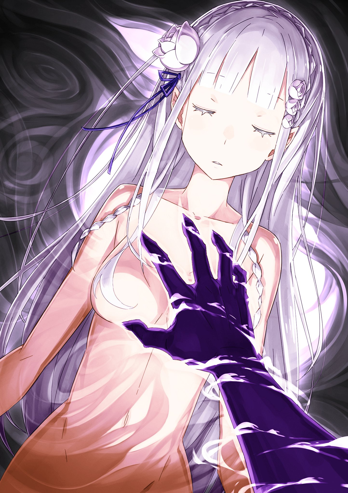

※ ※ ※ ※ ※ ※ ※ ※ ※ ※ ※ ※ ※

— «Фу-ку-ку…»

Это произошло сразу после того, как Эмилия, прижав руку к груди, сделала своё заявление.

Раздался смех, который невозможно было сдержать. Сначала он был едва слышным, похожим на выдох, но постепенно, не в силах больше сдерживаться, становился всё громче и громче, пока наконец не перерос в раскатистый хохот.

— «Ха-ха-ха! Ах-ха-ха! Фу-ку… Ах-ха-ха-ха-ха!»

Откинувшись назад, Регулус разразился смехом, словно услышал невероятно смешную шутку. Запустив руку в свои белые волосы и взъерошив их, безумец корчился от приступа смеха, который никто не мог разделить с ним.

Эта демонстративная реакция убедила Субару в правоте догадки Эмилии.

— «Ты, ублюдок, что смешного?!»

— «Конечно, смешно! Разве не вы сами должны бы смеяться, смирившись с тем, что оказались в абсолютно безвыходной ситуации? Эй, вы хоть понимаете, что несёте? Что вы собственноручно затягиваете петли на всех своих шеях!»

— «Гх…»

У Субару перехватило дыхание.

В этот момент возражения Регулуса были настолько безупречно логичны, что на них нечего было ответить.

Субару обернулся к Эмилии, ища подтверждения или опровержения её догадки.

Однако в ответ на его умоляющий взгляд Эмилия лишь покачала головой.

— «Ошибки нет. Я попросила микродухов проверить, да и сама чувствую. Внутри меня есть что-то чужое, лишнее. Это очень… неприятно».

Слова Эмилии были утверждением, но в то же время и констатацией отчаянного факта.

Эффект «Львиного Сердца» перешёл на Эмилию. Это означало, что единственный способ избавиться от него — остановить биение её сердца.

— «С чего вдруг сердце Эмилии… Я что, неправильно понял эффект «Маленького Короля»? Его сердце может перейти к кому угодно?..»

Если бы способность была такой, то в полномочии Регулуса не было бы слабых мест. Если он мог доверить своё сердце любому незнакомцу, то пока существуют люди, убить Регулуса было бы невозможно.

Нет, или, возможно, любое существо с сердцем могло бы стать заменой…

— «Бесстыдник».

— «Как приятно слышать вой проигравшего. Ха-ха-ха, говорите что хотите. Ваше право, право проигравших — сколько угодно изливать свою досаду. А моё право, право победителя — слушать это, наслаждаясь своим превосходством… Ах, неплохо! Совсем неплохо!»

— «Но ведь ты сам сказал, что я недостойна быть твоей женой».

— «Заткнись уже. Вечно твердишь о своих правах с таким важным видом. Лучше скажи, как ты собираешься ответить за убийство моих жён? Моих идеальных невест… Ты хоть представляешь, сколько лет я потратил, чтобы собрать их всех? Хочешь сделать меня грёбаным вдовцом в моём-то возрасте, без единой жены или любовницы? Ты обязана стать заменой, пока я не найду новых жён!» — выкрикнул Регулус, обрушивая на Эмилию, которая смотрела на него с явным презрением, свою отвратительную логику.

Похоже, безумец оправдывал своё присутствие в сердце Эмилии этой бредовой теорией. В таком случае, вероятность того, что он перейдёт в другое сердце, кроме Эмилииного…

— «Хочешь попробовать? Узнать, есть ли другое место, куда может переместиться сердце?»

— «…»

— «Способ очень простой. Просто убей ту девчонку, что стоит перед тобой. Как только её дыхание остановится, сразу станет ясно, зашло ли моё полномочие в тупик или нет. Очень, очень просто и весьма рационально… Ахаха! Но ты ведь не сможешь, да? Если ты это сделаешь, то весь смысл и значение твоего вызова мне, все твои самооправдания потеряют силу, верно?!»

Как ни прискорбно, Регулус был прав.

У Субару не хватило бы духу пожертвовать Эмилией. Пусть это назовут эгоизмом, пусть проклянут за своеволие, но он не мог этого сделать.

Чтобы победить Регулуса, его невесты отдали свои жизни.

Субару мог смириться с их жертвой как с неизбежностью, но не мог поставить на кон жизнь Эмилии или других своих товарищей.

Выбор Нацуки Субару всегда был до отвращения эгоистичен.

— «Ну, смотри. Он явно на это не способен. Тогда почему бы тебе самой не сделать это? Это просто. Сделай то же самое, что сделала с другими невестами. Или что? Не можешь? Чужие жизни ты отнимаешь без зазрения совести, а свою собственную, любимую, принести в жертву не можешь? Поразительно, просто тошнит, правда?»

— «— Субару».

— «Стой, нельзя. Правда, только не это».

В ответ на провокацию Регулуса Эмилия позвала Субару голосом, в котором слышалась какая-то решимость. Его пронзила такая беспощадность в её тоне, что Субару испуганно остановил её.

Вряд ли она поддалась на провокацию или впала в отчаяние.

Но Эмилия была готова пойти на крайний шаг, если другого способа победить не останется.

А у Субару была лишь воля не позволить ей это сделать. Так они проиграют.

Он позвал Эмилию по имени, заставил её опустить руку, но не мог ничего сказать.

— «Эй, может, нам уже пора заканчивать? Таскать за собой такую мерзкую женщину, как ты, мне не по вкусу, но пока что я пойду на компромисс. В качестве временной замены, пока не найдутся новые невесты. А вот его я убью. Он так сильно попрал мои права… Ах, да. Кстати говоря, это ведь смешно, правда?»

Перед стиснувшим зубы Субару Регулус злорадно скривил губы.

Мана вокруг Эмилии завихрилась, её решение вот-вот должно было быть приведено в исполнение. Но Регулус, казалось, не обращал на это внимания и усмехнулся.

— «Ты ведь тот парень, да? Тот, что перед свадьбой орал на весь город всякое? Что убил одного Архиепископа Греха… Смехота, да и только! Если ты возомнил, что сможешь победить меня, всего лишь убив такого неудачника, то прими мои соболезнования. Он был ничтожеством, которое ничего не могло довести до конца ни до того, как стал Архиепископом Греха, ни после».

Регулус издевательски хохотал. Его слова, несомненно, относились к Петельгейсу Романе-Конти — безумцу, ненавистному и для Субару.

Петельгейс был отвратительным фанатиком, не заслуживающим оправдания. К этому безумцу невозможно было испытывать симпатию, он вызывал лишь лютую ненависть и заслуживал смерти.

Но всё же то, что Архиепископ Греха, который должен был быть ему соратником, насмехался над Петельгейсом, вызывало в душе Субару крайне примитивное отвращение.

Особенно сейчас, в критической ситуации, когда на кону стояла возможность победить Регулуса и жизнь Эмилии.

Да и вообще, Петельгейс был…

— «— А…»

Когда образ ненавистного безумца, его окровавленная безумная ухмылка, всплыл в памяти и эхом отозвался в голове, Субару поднял лицо. Схватив себя за грудь, словно пытаясь её разодрать, он затаил дыхание.

Неужели такое… возможно?

— «Смогу… ли я?..»

Неизвестно.

Строго говоря, возможность, промелькнувшая в голове Субару, не была никем гарантирована, это была чистая теория — нет, скорее, плод воображения Субару. Его личное озарение.

Но именно поэтому. Именно поэтому только Субару мог предположить такую возможность.

Идея пришла только что, основание — интуиция, успех — не знает даже бог, но…

— «Эмилия».

— «…»

Чувствуя кожей влияние маны, достигшей своего предела, Субару позвал её.

Эмилия молчала, в её глазах застыла решимость, которая казалась почти трагической. Но в глубине её взгляда промелькнуло внезапное чувство. Ожидание и доверие к Субару, смотрящему на неё.

Подталкиваемый этим чувством, Субару спросил:

— «Эмилия».

— «Да».

— «— Поверишь мне и доверишь всё?»

— «Да».

На вырвавшийся вопрос ответ был кратким и без колебаний.

Эмилия прижала руку к груди, и впервые после возвращения её щёки дрогнули в улыбке.

— «Я тоже верю, что Субару справится».

Ах, чёрт, какая же это подлость.

Как можно потерпеть неудачу, когда любимая девушка оказывает тебе такое полное доверие?

Нужно добиться успеха, даже если придётся цепляться за него зубами.

Субару глубоко вдохнул и выдохнул.

Затем он искоса взглянул на молча наблюдавшего Регулуса. Тот стоял, скрестив руки на груди, и спокойно ждал, не вмешиваясь в их разговор.

— «Уверен в себе, да?»

— «А то?»

Ни малейшего намёка на возможность поражения.

Регулус раскрыл все свои карты и полностью загнал их в угол. Действительно, его полномочие «Львиного Сердца» было совершенным. Субару не ожидал, что даже после раскрытия секрета победа окажется так недосягаема.

Но именно потому, что Регулус был уверен в своей неминуемой победе, он мог позволить себе свысока наблюдать за тем, какие жалкие попытки предпримут Субару и Эмилия.

Не зная, что произойдёт. Впрочем, того же не знал и Субару.

— «…»

Будь здесь Беатрис, возможно, нашёлся бы другой способ. Если бы эта умная девочка была рядом, может быть, она предложила бы план с большими шансами на успех.

Глубоко в груди Субару чувствовал связь со своей спутницей. Наверняка, когда всё закончится, она его хорошенько отчитает, да и ему придётся её отчитать.

Поэтому сейчас, в одиночестве, он должен был вспомнить времена, когда был один, и пробудить в своей груди воспоминания — отнюдь не радостные, а первозданный пейзаж ужаса и боли.

— «Субару».

— «…»

— «Давай».

Зов Эмилии подтолкнул его к решению.

Субару грубо схватил себя за грудь, сосредоточился на тёмной, клубящейся силе внутри себя, которая казалась ему чужой, и высвободил её…

В этот момент стоит уточнить её название.

Чтобы и безумец, оскорбивший другого безумца, понял, что происходит, хотя бы сейчас.

Эта сила — наследие ненавистного безумца.

— «Явись же… Незримая Длань!..»

※ ※ ※ ※ ※ ※ ※ ※ ※ ※ ※ ※ ※

— Инвизибл Провиденс. Или «Незримая Длань».

Субару определял эту силу, бурлящую внутри него, как силу ведьмы, происходящую от Фактора Ведьмы. Он узнал об этом от Ехидны в мире снов: убив Петельгейса, он унаследовал от безумца Фактор Ведьмы. Какие у этого были недостатки — неизвестно. Но сила, давшая Субару невидимую демоническую руку, несомненно, исходила оттуда.

Поэтому Субару никогда не искал иного источника своей силы, кроме Фактора Ведьмы.

Способность была похожа на силу того безумца, потому что унаследованный Фактор Ведьмы «Лени» имел такую природу. Так и должно было быть.

Мысль о том, что Петельгейс мог жить внутри него, была невыносима.

— Но тогда, что это за чувство?

Вихрь, возбуждение, беззвучные аплодисменты внутри Субару.

Аплодисменты пробуждению. Аплодисменты вновь обретённой силе. Аплодисменты тому, что его позвали и он может исполнить. И необъяснимая радость, которую нельзя выразить только этим.

Чувство эйфории, восторга и благодарности, сопровождающее высвобождение силы.

Эта необъяснимая буря эмоций — проблема не только Субару…

— «А?!»

На громкий крик Субару Регулус отреагировал искажённым от изумления голосом.

Он не должен был её видеть. Это была невидимая демоническая рука.

Невидимая, смертоносная ядовитая длань — не что иное, как ослабленная версия силы того ничтожества, которого Регулус презирал и высмеивал как бесполезного.

Количество — одна, дальность — крайне мала, возможности — неизвестны.

Как ключ к выходу из этой ситуации, она была явно недостаточна.

— «…»

Первый этап — активация демонической руки — пройден. Теперь предстояло перейти к неизвестному второму этапу и финальному третьему.

Субару пошевелил пальцами в соответствии со своим намерением, вкладывая желание в демоническую руку, сотканную из тени.

— «Эмилия!»

Он ещё раз спросил её о решимости. Ища её поддержки, её одобрения.

В ответ на его голос Эмилия закрыла веки, а затем понимающе кивнула.

— «Вот как. — Так ты был там, Джус».

Понимание и привязанность — с этими чувствами в глазах Эмилия раскинула руки.

Поняв намерение Субару, словно предвидя, что произойдёт, она открыла кратчайший путь к своему сердцу. Субару без колебаний направил туда демоническую руку.

— «…»

Незримая демоническая рука скользнула в центр груди Эмилии. Когда кончики пальцев прошли сквозь белую кожу, Эмилия едва заметно вздрогнула, словно что-то почувствовав.

Но рука не остановилась. Прошла сквозь грудину, между лёгкими и достигла источника сердцебиения.

— Демоническая рука достигла сердца Эмилии.

Второй этап завершён.

Прикосновение к запретному — демоническая рука ведьмы проникала сквозь тело Субару и ранила его сердце. Это было применением того же принципа. Было рискованно полагать, что Незримая Длань и демоническая рука ведьмы — одно и то же.

Но пока что риск оправдывался. Проблема была в последнем этапе — силе без всяких оснований.

Просто раздавить сердце Эмилии можно было бы и в этот момент. Но в этом не было никакого смысла. Сила предназначалась не для этого.

Тогда для чего? — Чтобы спасти, прямо сейчас.

— «…»

Возможно ли это? В долю секунды Субару затаил дыхание.

Способна ли Незримая Длань спасать людей? Сколько жизней было отнято этой силой под властью безумца Петельгейса Романе-Конти?

Хотя говорят, что сила зависит от того, как её использовать, часто существуют силы с ограниченным применением. Не была ли Незримая Длань силой исключительно для разрушения?

Трудно было поверить, что эта сила была создана, чтобы давать кому-то жизнь…

— «Субару».

Мгновение колебания и сомнения — и он услышал голос Эмилии, который не должен был слышать.

— «Всё в порядке. — Я верю вам обоим».

Кому и кому?

Доверие Эмилии было обращено к Субару и ещё кому-то, кого Субару не знал.

Но он так легко поверил.

— Эта рука точно не причинит вреда Эмилии.

— «Ооооо! Реви, моя третья рукаааа!!»

Сомнения в силе внутри него, в которую он не мог до конца поверить, рассеялись.

Уже неважно, где истоки этой силы. Важно, что сейчас она в руках Субару, что у Субару нет намерения причинить вред Эмилии, и что, возможно, в самой силе есть что-то ещё.

В груди Эмилии демоническая рука, сотканная из тени, сжала пальцы.

Кончики пальцев коснулись бьющегося сердца Эмилии, и она тихонько ахнула от ощущения, словно её слегка царапнули по поверхности. Прикосновение было скорее щекочущим, чем болезненным.

В груди покрасневшей Эмилии сжавшаяся демоническая рука крепко ухватила нечто.

Слишком уж «маленькое львиное сердце», пульсировавшее отдельно от биения, дарующего Эмилии жизнь…

— «Поймал!..»

Вытащить — на это не было времени.

Демоническая рука Субару раздавила сердце, нагло пульсировавшее внутри Эмилии.

Не причинив ни царапины сердцу Эмилии, она уничтожила вредоносный орган, паразитировавший под предлогом любви.

Субару ощутил отчётливое касание несуществующей третьей руки. И затем…

— «Кхаа!»

Беспрецедентная концентрация и плата за использование силы, которая не была его собственной.

Боль, словно внутренности выкручивают, и чувство утраты, будто его осквернили, пронзили Субару, и он упал на колени. Сильно закашлявшись, он сплюнул кровь.

— «Субару!»

Эмилия протянула руку к Субару, стоявшему на коленях в воде и с кровью, стекающей из уголка рта. Схватив протянутую руку, Субару прижал её к своей щеке.

— «А…»

— «Ты жива, да?»

— «…Да, всё в порядке. Моё сердцеちゃんと бьётся внутри меня».

Пока Субару проверял ощущение живой руки, Эмилия свободной рукой тоже проверила своё сердцебиение. Оно действительно билось, благословляя её присутствие здесь и сейчас.

И только Регулус смотрел на них с лицом, выражающим полное непонимание.

— «А? Что, что такое? Вы тут понимаете друг друга, а остальные в пролёте? Что это за дешёвая драма? Что вообще произошло, вы…»

— «…Ты что, не заметил?»

— «А? О чём ты говоришь? Не заметил чего, ничего же не изменилось…»

— «У тебя ноги промокли».

— «— ?»

Субару указал пальцем на Регулуса, который уже готов был впасть в истерику. Регулус недоумённо посмотрел себе под ноги, на мгновение замолчал, а затем его глаза расширились.

Он заметил, что его белый смокинг — белые туфли и брюки — насквозь промокли от воды под ногами.

— «Вы, ублюдки!.. Кха?!»

Осознав слишком поздно произошедшую перемену, Регулус оскалился и замахнулся рукой. Но тут же длинная белая нога взметнулась вверх и с силой ударила его по лицу.

Регулус, совершенно беззащитный, принял удар на себя и с глухим стоном рухнул в воду. Половина его тела ещё больше промокла, а на лице, куда пришёлся удар, остался след от ботинка.

— «Гах, бве… Как, как такое… кх!»

Словно не веря своим глазам, Регулус ошеломлённо поднял голову. Эмилия, нанёсшая этот красивый удар, посмотрела на него сверху вниз и слегка наклонила голову.

— «Получилось. Наконец-то попадаю».

— «Ты, ты!..»

Услышав короткий возглас удовлетворения Эмилии, Регулус побагровел от ярости. Поднимаясь, он зачерпнул рукой воду и швырнул водяную дробь в Эмилию.

Но боль от удара, видимо, пересилила, его поза была неустойчивой, водяные пули полетели мимо цели, а вместо этого его незащищённый торс оказался открыт, и…

— «Искусство Ледяного Клинка!»

— «Гхоб!»

Ледяной молот, сформированный в руке Эмилии, ударил Регулуса точно в центр туловища.

Получив удар такой силы, что, казалось, затрещали кости, тело безумца покатилось по воде. Кашляя и колотя кулаками по воде, Регулус уставился на Субару и Эмилию налитыми кровью глазами.

— «Почему?! Почему, почему, почему, почему?! Как вы, как такие, как вы, смогли что-то сделать с полномочием «Жадности»?! С моими правами?!»

— «Если ты столько видел и до сих пор не понял ответа, то объяснять тебе бесполезно. Ну, это… Проще говоря».

Глядя с жалостью на вопящего Регулуса, Субару, превозмогая крик своих внутренностей, усмехнулся.

Улыбкой, не менее зловещей, чем у Петельгейса.

— «Пока ты тут выпендривался, враг успел контратаковать».

— «— !»

Хотя смысл слов он мог и не понять, издевательский тон был совершенно ясен.

Регулус издал нечленораздельный вопль и, игнорируя Эмилию, приготовился атаковать Субару. Но Эмилия опередила его.

— «Первая атака невест, похоже, не сработала — так прими её как следует».

— «Не издевайся!..»

Над головой Регулуса появилось неисчислимое множество ледяных сосулек.

Хотя размеры их были разными, если бы все они вонзились в него, он бы точно погиб. Отвращение Эмилии к Регулусу достигло такого уровня, что даже её обычно мягкая натура не могла простить его.

Вскочив на ноги, Регулус ударил водяными брызгами по падающим сосулькам. Сосульки разбивались, но их мелкие осколки не прекращали выполнять свою роль.

Ледяные пули сыпались одна за другой, словно шторм, и Регулус, принимая их всем телом, бежал по воде, изрыгая невыносимые ругательства.

Белые ледяные кристаллы создавали туман, и затопленные улицы города замерзали. Даже вокруг Субару, стоявшего на коленях в луже, образовалась ледяная корка, так что ему пришлось поспешно вытащить руки из воды.

Даже с учётом заботы о Субару, вокруг него были такие разрушения. Естественно, урон, нанесённый цели, Регулусу, был несравнимо больше.

Но…

— «…Цел?»

Когда ледяная завеса рассеялась, на застывшем пейзаже Регулус всё ещё стоял.

Уперев руки в колени, тяжело дыша, весь промокший, он избежал конца, который должен был настигнуть его в виде пронзённого тела.

— «Ххх… хх… ах, хаа…»

Задыхаясь, Регулус скреб себе грудь.

Увидев это, Субару понял. Эффект неуязвимости от «Львиного Сердца» можно было использовать, даже когда сердце находилось внутри него самого. Однако…

— «Чтобы стать неуязвимым, тебе нужно остановить своё собственное время, а значит, и своё сердце внутри себя. — Полностью ограниченная по времени неуязвимость, да?»

— «Гх!..»

Попал в точку? Регулус скривился от боли в груди и гнева. Если есть ограничение по времени, то Эмилия сможет пробить его защиту, обрушив на него шквал атак.

Тогда Регулус станет всего лишь рядовым солдатом, способным лишь вкладывать всю силу в атаку.

— «Э, эй…! Вам не кажется, что это подло?!»

Пока Субару анализировал соотношение сил, Регулус ткнул в него пальцем. Затем он указал на Эмилию, переводя взгляд с одного на другую.

— «Нападать вдвоём на одного, издеваться — у вас совесть не болит? Разве это не значит, что с вами как с людьми что-то не так? Разве у вас самих не возникает вопросов? Должно же возникать, правда?!»

— «…Ты действительно поразителен».

Когда он имел преимущество благодаря «Львиному Сердцу», он говорил всё, что вздумается, а как только эффект пропал, тут же стал взывать к справедливости противника, ссылаясь на своё невыгодное положение.

Субару перестал изумляться и почти проникся уважением. Такое существо, лишённое всякого человеческого обаяния, вряд ли когда-либо ещё появится.

— «Значит, ты хочешь сказать, что два на одного — это подло, и нужно сражаться один на один, честно и благородно? Что именно так и должны проходить сражения, так?»

— «Именно! Это же очевидно, делать то, что правильно! За кого… за кого вы меня принимаете?! Я — Архиепископ Греха Культа Ведьмы, Регулус Корниас, ответственный за «Жадность»! Самое удовлетворённое, самое непоколебимое существо в этом мире…» — дрожащим голосом проговорил Регулус, глядя на свои руки.

У Субару больше не было слов. Поэтому вместо него сказала Эмилия:

— «Ты постоянно меняешь свои слова, а то, что говоришь — пустота. Я думаю, ты самый жалкий человек в мире».

— «—! Не смей! Я заставлю тебя пожалеть о том, что ты унизила меня… «Жадность»!»

Даже гнев от унижения был поверхностным, Регулус снова и снова изрыгал проклятия.

Наблюдая за этим жалким зрелищем, Субару почувствовал облегчение. Регулус действительно не знал иного способа победить, кроме как находясь в максимально выгодном положении.

Даже если он всё ещё мог ненадолго использовать «Львиное Сердце», путей к победе было множество.

Но стоило ему столкнуться с трудностями, как он тут же сдавался, даже не пытаясь рассмотреть все варианты на доске.

— «Когда всю жизнь проходишь играючи, можно неожиданно споткнуться».

— «Хаа…?»

— «Ничего, просто мысли вслух. Кстати, я могу принять твой вызов на поединок один на один».

— «—! Вот! Так-то лучше. Конечно, рыцарь ведь не станет выставлять вперёд свою госпожу, верно?»

Ухватившись за удобное предложение, Регулус попытался выторговать ещё более выгодные условия.

Между Субару и Эмилией боевая мощь была несравнима. Убив сначала Субару и вызвав смятение Эмилии, он мог бы получить шанс на победу. Поразмыслив своим скудным умом, он проявил ненужную хитрость, но результат был рациональным.

Однако, если он собирался победить Субару с помощью своей мелочной натуры, ему было ещё рано тягаться.

Находить путь к победе на проигранной доске — вот стиль боя Субару.

В самом подходе к битве Регулус и Субару были противоположностями.

— «Верно. По логике вещей, сражаться должен рыцарь».

— «Тогда…»

— «Поэтому… хоть это и снова повторится, но финал я доверю тебе».

Стоя по щиколотку в воде, Субару произнёс это словно на выдохе.

Услышав его слова, Регулус удивлённо наклонил голову. Но слова Субару были обращены не к нему. Они были адресованы ему.

— «Аа, понял. — Как рыцарь, я принимаю брошенный вызов на поединок».

Ответом было пламя.

По затопленной улице, не создавая ряби на воде, шёл юноша. Не поддельная тайна Регулуса, а сила божественной защиты, дарованной любимцу небес.

— «Райнхард ван Астрея из рода «Святого Меча», рыцарь Королевской Гвардии Королевства Лугуника».

Выйдя вперёд Субару и Эмилии, рыцарь направил на Регулуса меч, всё ещё находящийся в ножнах. Представившись друг другу, он демонстрировал готовность к честному поединку один на один.

Справедливость дуэли, признанная даже такой, как Эльза «Охотница за Кишками».

В ответ на это Регулус поднялся, вытянул обе руки вперёд и…

— «По, подождите! Это… это неправильно!»

Тем, кто осквернил священную дуэль и отверг воина, «Святой Меча» не проявит милосердия.

Удар меча снизу вверх прошёл между ног Регулуса, рассекая его тело по вертикали — Регулус, не успев даже вскрикнуть, был подброшен высоко в небо.

— «—!!!»

На такую высоту, что можно было увидеть всю панораму водного города, который он сам и разрушил.

Крик, похожий не то на вопль ужаса, не то на ругательство, эхом разнёсся вокруг.

※ ※ ※ ※ ※ ※ ※ ※ ※ ※ ※ ※ ※
