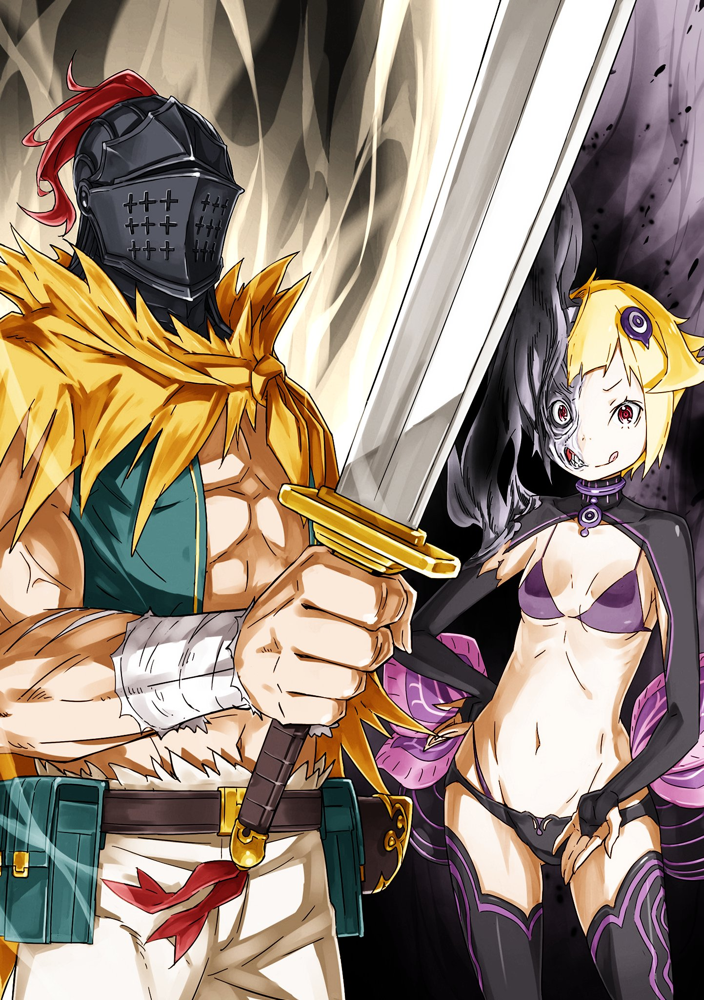

※ ※ ※ ※ ※ ※ ※ ※ ※ ※ ※ ※ ※

Я увидел белый свет.

Тёплый, мягкий, невероятно успокаивающий свет.

Сколько же времени прошло с тех пор, как я в последний раз встречал утро с таким умиротворением?

Пробуждение всегда было тоскливым, а в те дни, когда я был заточён в нескончаемом кошмаре, покоя не было нигде.

Я был уверен, что эта тьма никогда, никогда не рассеется.

Может быть, именно поэтому этот свет так глубоко проникает в самое сердце?

— «…Эй, проснись».

Чей-то голос.

Из-за белого света кто-то звал меня. Ведомая этим голосом, ведомая рукой, что тянула меня, я вырвалась из тьмы.

Белый свет, казавшийся далёким, постепенно заполнил всё поле зрения…

— «Доброе утро. Время просыпаться, соня».

Когда я открыла веки, передо мной стояла сереброволосая девушка и смущённо улыбалась.

…От этих слов по щекам Сильфи потекли слёзы.

※※ ※ ※ ※ ※ ※ ※ ※ ※ ※ ※ ※

Бледно-голубой свет поднялся к небесам, и ледяной барьер растаял.

Лёд, окутывавший полуразрушенную церковь, превратился в свет, а рассеивающаяся мана исчезла, окутанная танцующими мизерными духами.

Зрелище того, как невидимая иллюзия поглощается невидимой иллюзией, вызывало в сердцах наблюдателей глубокую печаль и меланхолию.

Неудивительно, что от такой картины защипало в глазах, но причина слёз рыдающих девушек была не только в этом.

Это было освобождение от кошмара, сковывавшего их жизни, самое яркое время их существования.

— «Как бы то ни было, Эмилия-тан великолепна», — рассеянно пробормотал Субару, невольно улыбнувшись.

Перед ним стояла Эмилия, а за неё цеплялись плачущие невесты — бывшие невесты, — все целы и невредимы.

Женщин в свадебных платьях было ровно пятьдесят три, ни одна не пропала.

— «…Когда я услышал, что сердца невест слились с его сердцем, я был уверен, что нет способа спасти их, не убив…»

Лишить невест жизни, чтобы уничтожить вместилище «Львиного Сердца». Субару почти всерьёз смирился с тем, что другого способа остановить этого безумца нет. Он был готов к жертвам.

Но Эмилия, в отличие от Субару, не сдалась.

Хотя он и был посреди отчаянной схватки с Регулусом не на жизнь, а на смерть, факт остаётся фактом — он перестал думать, решив, что других вариантов нет. Но Эмилия не прекращала размышлять.

Она обдумала, что может сделать с имеющимися у неё средствами, и выполнила задуманное.

Поэтому…

— «В этот раз Эмилия-тан полностью затмила меня».

— «Это не так».

Обессиленный Субару прислонился к стене. Услышав его вздох облегчения, Эмилия вернулась. Её белое платье было порвано, серебристые волосы, пережившие смертельную битву, растрепались. И всё же, завершив бой, Эмилия была прекрасна.

Внутренне вздохнув от этого чувства, Субару кивнул подбородком.

— «Похоже, эти люди всё ещё не выразили тебе всю свою благодарность».

— «Хватит уже подшучивать. К тому же, я не могу читать им нотации. Это было спонтанное решение… но я заставила всех пойти на выбор, который мог стоить им жизни».

— «Но никто не умер. Все живы. — Это самое главное».

Этот результат — самый лучший из возможных.

Получив желаемый ответ, Субару испытал облегчение. Эмилия упёрла руки в бока и, как всегда отложив в сторону свою низкую самооценку, надула губы на Субару.

— «Ты весь в ранах, ты так старался… Если бы Субару не выложился на полную, мы бы все уже погибли. И про «Львиное Сердце»… это ты заметил».

— «То, что решающего удара не хватает — это как всегда… но оправдываться этим тоже нехорошо. Но как ты догадалась? Заморозить невест, ввести их в состояние анабиоза…»

— «Я ведь тоже долгое время была заморожена».

Эмилия игриво высунула язык. Мило.

Хотя, на самом деле, в этой истории мало смешного.

Тем не менее, действия Эмилии и её находчивость принесли максимальную пользу в победе над Регулусом, предотвратив ненужные жертвы.

Пятьдесят три драгоценные жизни невест были спасены.

— «Я не была уверена, что всё получится хорошо».

— «Но ты справилась. Эмилия-тан, ты ведь так старалась научиться владеть своей силой».

— «Но ведь был шанс, что они так и останутся замороженными. Я сейчас немного выдохнула, что смогла их благополучно освободить».

Скрыв смущённую улыбку, она коснулась своей груди.

Словно проверяя под ладонью биение своего собственного сердца.

— «К тому же, если бы Субару не вытащил сердце Регулуса из моей груди, мне бы пришлось применить ту же магию на себе. В таком случае, растопить и Сильфи, и меня было бы намно-о-ого сложнее. Может, на это ушло бы ещё сто лет».

— «Да ладно, ты преувеличиваешь».

— «…………»

— «Не преувеличиваешь?! Чёрт, это был отличный ход на грани фола!»

Субару изумился, увидев молчаливую горькую улыбку Эмилии.

Эмилия, поддавшись на провокацию Регулуса, собиралась остановить «Львиное Сердце» вместе с собой. Если бы он это проглядел, то в худшем случае это была бы их последняя встреча. Разумеется, он бы бродил по свету в поисках способа растопить лёд, чтобы этого не случилось, но всё же.

— «Две спящие красавицы — это перебор даже для моего невезения, так что пощади меня».

Проворчав, Субару всё же выдохнул с облегчением.

В любом случае, Эмилия была благополучно спасена, и невесты тоже остались невредимы. Битва с Регулусом привела к разрушениям немыслимого масштаба для сражения с одним человеком, но — в конечном итоге, наша сторона почти не понесла потерь.

Разве что Субару получил немало физических травм и ненужную связь с Культом Ведьмы.

И ещё…

— «Райнхард ушёл, даже не залечив раны. С ним всё будет в порядке?» — внезапно спросила Эмилия, заметив задумавшегося Субару.

Субару поднял голову и махнул рукой.

— «Без проблем. Похоже, его раны сами заживают благодаря мизерным духам. Он сам так сказал».

— «А, точно. Мизерные духи, которых здесь было так много, все последовали за Райнхардом, когда он ушёл… Может, у Райнхарда есть талант заклинателя духов?»

— «Не лишай меня моей уникальности!»

К тому же, Райнхард и без этого достаточно силён. Хотя Субару сам натравил Райнхарда на Регулуса, то, как Райнхард сражался в последней дуэли, вызывало только шок.

Неужели человек может так легко прыгать до самых облаков? Не верится, что он такой же человек, но он рыцарь такого же кандидата на престол.

— «Эмилия-тан, хоть я и слаб, не бросай меня, ладно?»

— «—? Я о-о-очень на тебя полагаюсь, Субару».

— «Правда! Ведь правда! Я и дальше буду тебе служить!»

— «Прости, я немного не понимаю, почему ты так настойчив…»

В любом случае, не стоит сравнивать себя с другими. Иначе станешь как Регулус, который не мог действовать, не полагаясь на оценку окружающих.

Я думал, что в этом человеке нет ничего примечательного, но, оказывается, как отрицательный пример он весьма неплох.

— «…Интересно, как там остальные?»

— «Для этого и есть Райнхард. К тому же, честно говоря, все они сильнее меня».

Сказать «положимся на них» звучит так, будто перекладываешь ответственность, но тёплое чувство «я верю в них» подходит больше всего.

Лагеря разные, и когда-нибудь придётся столкнуться лицом к лицу в борьбе за престол, но Субару верил в них. В их личности, способности, убеждения — во всё это.

По крайней мере, настолько, чтобы желать, чтобы они не проиграли таким подлым и безнадёжным людям, как Культ Ведьмы.

— «————»

К тому же, если кто-то проиграет и его жизнь окажется в опасности — возможно, Субару придётся подумать о «Возвращении через смерть». Даже если не считать договора с Розваалем, если есть шанс спасти, он наверняка попытается это сделать.

Больно и мучительно — это неприятно.

Но грусть, наверное, ещё хуже.

— «Субару».

— «————»

Что она увидела в Субару, размышлявшем о смерти? Эмилия села рядом с ним.

Прислонившись к его левому плечу, она нежно погладила его по поникшей голове. Щекотно. Но не хочется отстраняться.

— «Эмилия-тан?»

— «Я сейчас чувствую то же самое, что и Субару. Я беспокоюсь за всех, но у меня совсем не осталось сил, я не могу пойти на помощь. Поэтому позволь мне помолиться вместе с Субару? За то, чтобы все были целы».

— «————»

— «Уверена, всё будет хорошо. Ведь все они намно-о-ого сильнее, намно-о-ого умнее и намно-о-ого упорнее нас».

Подбирая слова, чтобы успокоить Субару, Эмилия говорила так, как свойственно только ей, и Субару почувствовал, как его сердце немного успокоилось.

Поверим. Во всех. В Райнхарда, которого мы отправили.

Сразу после победы над Регулусом, Райнхард помчался на помощь остальным товарищам. Там, где появится он, не о чем беспокоиться.

Хочется встретить утро так, чтобы никто не пропал. Тогда у Субару останется лишь одна забота…

— «————»

Пока Субару смотрел на небо, словно молясь, Эмилия тоже подняла взгляд на ночное небо сквозь разрушенный потолок церкви. Чтобы Эмилия не заметила, Субару крепко сжал рукой свою грудь.

— Вместе с осознанием смерти Регулуса что-то непонятное, чёрное снова скользнуло в его грудь и запульсировало там.

Это наверняка то же самое, что было с Петельгейзе.

Поэтому, чтобы Эмилия не догадалась, он просто молча молился небу и готовился духом. Просто молча.

※※ ※ ※ ※ ※ ※ ※ ※ ※ ※ ※ ※

— Время немного отматывается назад, до победы над Регулусом.

Это произошло примерно через час после того, как группа Субару отправилась штурмовать контрольную башню, и после того, как Отто, проводивший их, покинул ратушу, чтобы забрать «Книгу Мудрости».

Это было примерно в то время, когда Отто столкнулся с «Чревоугодием», сражавшимся с Фельт и остальными; когда Гарфиэль и Курган упали в водный канал; когда Вильгельм сорвал капюшон с Терезии; когда Юлиус нахмурился, услышав незаслуженные упрёки в свой адрес; когда церковь была наполовину разрушена во время свадьбы, проведённой без согласия невесты; когда водные каналы в северной части города внезапно вспыхнули пламенем; — и в тот самый момент, когда здание городской ратуши, где остались только некомбатанты, сотряслось от удара.

— «Та-да-ам! Мой выход~!»

Огромная масса безжалостно проломила стену верхнего этажа пятиэтажной городской ратуши.

От сильной вибрации окна здания потрескались, а фундамент, повреждённый ещё днём, получил критические повреждения. Здание, некогда бывшее центром управления Пристеллы, всего за один день было доведено до грани разрушения и представляло собой жалкое зрелище.

Однако, останется ли оно на грани разрушения или же рухнет окончательно — это решится в зависимости от того, что произойдёт здесь дальше.

— «Четыре башни, четыре шлюза. Стоит открыть хотя бы один — и весь город гарантированно уйдёт под воду… Естественно, нужно устранить возможность открытия всех башен, так что вам, кускам мяса, придётся хочешь не хочешь рассредоточить силы и вступить в тотальную войну».

Назойливый голос болтал без умолку, описывая положение города.

В ответ на это раздались другие голоса.

— «Все! Мы обязательно вернёмся живыми и защитим этот город!»

— «Мы вернём эти прекрасные улицы своими силами!»

— «Мы сражаемся за справедливость, мы не можем проиграть!»

— «За добро воздастся добром, за зло — злом. В этой битве победа будет за нами—!»

Звонкий голос юноши.

Отважный клич юной девушки.

Воинственный клич закалённого в боях сурового мужчины.

Ободряющий призыв, выкрикнутый рассудительной женщиной средних лет.

Каждое слово было подкреплено непоколебимой волей и решимостью — вот только произнесли их одни и те же уста.

— «Небось, так и думали, да?»

И те же губы, что произносили сильные слова, теперь изрекли голосом, полным презрения, насмешки и неистребимой злобы, предавая всё сказанное ранее.

Затем обладательница голоса обняла своё маленькое тельце и, качая плечами, словно от отвращения, сказала:

— «Кья-ха-ха-ха! Нет-нет-не-е-ет, прекратите, говорю вам! С какой стати я должна якшаться с такой грязной и наверняка потной справедливостью? Вы что, куски мяса, все до единого с ума посходили?»

Раздался пронзительный, оглушительный смех.

Нескрываемая, да и не пытающаяся скрыться злобная радость исходила от девочки с ещё незрелым, детским телом.

Круглые глаза, тонкие губы, золотистые волосы до шеи, румяные щёки — внешность, казалось бы, воплощающая очарование, но на её лице застыло свирепое выражение, не свойственное ребёнку, с даже каким-то намёком на порочность. На ней была лишь одежда, похожая на нижнее бельё, и чрезмерная нагота девочки, чьё тело ещё не сформировалось не то что как женское, но даже как человеческое, вызывала у любого нормального человека одинаково извращённое отвращение.

Вероятно, именно в этом и заключалась цель девочки — нет, этого монстра.

Цель Капеллы Эмерады Лугуники, Архиепископа Греха «Похоти», монстра, который попирает человеческую этику и достоинство всеми возможными способами.

— «Поверить в такую удобную фантазию, что я буду послушно ждать в башне — это уже за гранью понимания! Насколько же ласковыми были ваши деньки, ублюдки? Это что, приём гостей?! Война — это когда не даёшь врагу делать то, что он хочет, и делаешь то, чего он не хочет, ясно? Жители цветочных полян, знайте меру, говорю вам! Куски, куски, куски, куски, куски мяса!»

Не переставая извергать невыносимую брань, Капелла, монстр с обманчиво милыми повадками, кривлялась.

Приложив палец к щеке и извиваясь телом, монстр, проникнув в ратушу, немедленно направился в ближайшую комнату, ориентируясь на присутствие людей. Там Капелла и столкнулась с рыцарем с кошачьими ушами, который и выслушивал всю эту тираду до сих пор. За его спиной на кровати лежала длинноволосая женщина.

Это был верхний этаж ратуши, комната, отведённая Фелису и Круш.

— «Ты… Архиепископ Греха «Похоть»…!»

Голосом, дрожащим от гнева, Фелис свирепо посмотрел на Капеллу, заслоняя собой кровать. Капелла склонила голову, посмотрела на кровать за его спиной и понимающе кивнула.

— «А-а, понятно-понятно, теперь ясно, за что меня ненавидят. Значит, всё-таки поддалась крови. Я так и думала, что добром это не кончится. Думала, но видеть, как это происходит на самом деле, — разочаровывает. А я ведь надеялась, раз уж это благородная кровь Лугуники».

— «Что ты сделала с госпожой Круш?! Какова твоя цель?! Как спасти госпожу Круш?! Отвечай!» — прорычал Фелис, его милое лицо покраснело от гнева, на скучное бормотание Капеллы. В обеих его руках были зажаты короткие кинжалы, которые он носил с собой.

Украшенные красивым орнаментом и гербом льва, они больше походили на декоративное оружие, чем на боевое. Учитывая неопытность самого Фелиса, казалось маловероятным, что он сможет эффективно ими воспользоваться.

— «Это что, игрушка? Дорогой подарок? В любом случае, размахивать такой штукой тонкими ручонками опасно, милочка. …Хотя, погоди-ка?»

Капелла, смеясь и высунув язык, вдруг прервалась и нахмурилась.

— «Фу-у, какая мерзость. А? А у тебя, однако, весьма неестественное тело. Мужик, а такое тело… Как вообще можно стать таким, не удалив то, что нужно? Это в корне отличается от простого извращенца, который напяливает женскую одежду, меня аж передёргивает».

— «—!»

Раскусив пол Фелиса, Капелла выразила отвращение к его неестественности. Монстр оглядел Фелиса с ног до головы и картинно сделал вид, что его тошнит.

— «Этот наряд — чтобы мужики бдительность теряли? Если так, то ты понимаешь всю никчёмность человеческой натуры. Мужики — идиоты, бабы — шваль, а люди все поголовно — мрази… Мне такой вывод по душе».

— «Заткнись! Не говори лишнего… Отвечай на вопрос! Что ты сделала с госпожой Круш!!»

— «А-а, ну хватит уже, как шумно».

Видя, что диалог с Капеллой никак не складывается, Фелис, сглотнув унижение, снова закричал. Услышав это, Капелла пожала плечами, и в мгновение ока лицо девочки растаяло.

— «—!?»

На глазах у замершего Фелиса тело девочки растаяло и начало менять форму.

Маленький рост кошмарным образом вытянулся, яркие золотистые волосы изменили цвет. Милое личико, вызывавшее у всех желание защитить, стало строгим, а одежда, похожая на бельё, превратилась в тёмно-синее платье.

Хотя Фелис и слышал об этом, он впервые видел эту трансформацию воочию. Кошмарный творец, способный по своему усмотрению изменять тела — как своё, так и чужое — прикосновением.

И от этого проявления кошмара Фелис застыл в оцепенении.

— «А, у…»

— «— Чему вы удивляетесь?»

Сказала она, приглаживая длинные зелёные волосы, — лицо, которое Фелис любил больше всего на свете.

Фигура Капеллы, стоявшей перед ним, полностью преобразилась в его любимую госпожу. От этого лицо Фелиса побледнело, а кинжал в его руке мелко задрожал.

— «Ну вот, вся твоя прежняя храбрость испарилась. Стоило мне предстать перед тобой в этом лице, этом теле, с этим голосом — и всё».

Улыбаясь невиданной улыбкой Круш, Капелла медленно шагнула вперёд.

Она подошла совсем близко к Фелису, на расстояние вытянутой руки, и, подумав о чём-то, приставила острие дрожащего кинжала к центру своей груди.

Кончик клинка мягко упёрся прямо в середину большой груди Круш.

В такое положение, что стоит толкнуть — и он вонзится.

— «Ненавистный враг перед вами. Отомстите за меня. Больно, больно. Дышать больно. Глаза открыть не могу. Словно сердце гонит по венам не кровь, а яд. Так что скорее, отомстите. — Так она говорит».

— «Ф-фх… фхуух…!»

— «Просто вдавите меч поглубже, проверните его в ране, чтобы разорвать всё как следует, и вытащите. Сердце будет уничтожено, артерия перерезана, кровь не остановить. Вы сможете убить».

Дыхание Фелиса участилось, взгляд забегал.

Бесценная возможность — жизнь врага его госпожи была предложена ему на блюдечке. Как и было сказано, сейчас атака точно пройдёт. Можно раздавить сердце. Можно убить.

Вот только она выглядит точь-в-точь как та, кого он боготворит.

— «Коли, коли, коли, коли, коли, коли».

— «————»

— «Коли—!»

— «У-аааа!!»

Поддавшись приказам, звучавшим как проклятие, кинжал Фелиса вонзился ей в грудь.

Лезвие легко пронзило плоть, прошло между рёбер и разрушило сердце. С жестоким звуком рвущихся мышц острое лезвие провернули, а затем выдернули вместе с фонтаном крови.

— «Ха, ха-ах!»

Отскочив, чтобы не забрызгаться хлынувшей кровью, Фелис тяжело дышал. Кинжал со стуком выпал из его руки и погрузился в лужу крови на полу.

— «Кх, гхох!»

Капелла, раненная в грудь, упала на колени, изо рта хлынула кровь.

Всё ещё в облике Круш, с лицом, искажённым болью и залитым кровью, она подняла на Фелиса полные слёз янтарные глаза, выражавшие недоверие.

— «Больно, больно… Почему, почему ты так поступил…»

— «Ты сама сказала мне ударить…! Сказала мне ударить госпожу Круш!»

— «Больно, больно. …Жестоко, непростительно. Ты ведь говорил, что так любишь меня, что обожаешь… Мы ведь любили друг друга… кх!»

— «—! Не говори глупостей! У нас с госпожой Круш не такие отношения!»

— «А, вот как? Ну что ж, похоже, у нас возникли расхождения в интерпретации постановки».

С невозмутимым видом Капелла вытерла кровь рукавом и поднялась.

Затем она провела рукой по ране на груди, и та мгновенно исчезла. Выражение муки на её лице тоже пропало без следа, и она вздохнула.

— «Всё-таки, если уж делать такое, то надо с самого начала, иначе смысла нет. Заставить любящих друг друга госпожу и слугу убивать друг друга, пусть даже один из них — лишь имитация вроде меня. В этом есть катарсис любви… Провал, провал».

— «Что это за фарс… Чего ты хочешь? Чего добиваешься!»

— «Да ничего? Смысла в этом нет, и добиваться я ничего не хочу. Заставить мужа убить жену в её же обличье — это так, развлечение от скуки. А то, что рыцарь держит при себе переодетую девку — ну, я просто подумала, может, у них такие вкусы и такие отношения».

— «Обещание, данное мной госпоже Круш, — это не что-то поверхностное!»

— «Считать сексуальные наклонности и любовь чем-то поверхностным — вот это, я думаю, и есть легкомысленное мнение», — сказала Капелла, склонив голову набок в ответ на крик Фелиса. Затем Капелла подняла правую руку, и её форма снова кардинально изменилась.

Ладонь превратилась в подобие гигантского цветочного лепестка, а выросшие щупальца хлестнули Фелиса по телу, отбросили его, опутали и, сжимая, ударили о стену.

— «Ка, фх…!»

— «Как и ожидалось, судя по внешности и ощущениям, у тебя слабенькое и хрупкое тельце. Раз уж ты так хочешь стать женщиной, может, мне сделать тебя ею? В моих руках это раз плюнуть, мигом всё отрежу и дырку сделаю».

— «Моё тело не имеет значения… Важнее госпожа Круш…!»

— «Как глупо. Не надо мне тут этих красивых сказочек, что другие важнее себя. И как вернуть тело, поражённое кровью? Ха! Если бы такой способ существовал, я бы сама хотела его знать».

Щупальца извивались, тонкие конечности Фелиса наливались кровью. Он мучительно выпучил глаза, и в комнате раздался треск его костей.

Вместо правой руки, превратившейся в цветок-людоед, поднятая левая рука приняла форму клешни богомола. Оставаясь в облике Круш, с правой рукой-цветком и левой рукой-насекомым, она представляла собой отвратительное зрелище.

И всё же черты её лица оставались неизменными, прекрасными, что делало её ещё более жуткой.

— «Превратить тебя в бесформенную груду мяса было бы забавно, но у меня тоже нет времени. Прежде чем сюда поднимется кто-нибудь ещё, я лучше разберусь и с тобой, и с твоей госпожой, а?»

— «—У, кх».

— «И всё-таки, какие же вы непроходимые идиоты. Мало того, что моего прихода совершенно не ожидали, так ещё и на атаку реагируете медленно-медленно. Сколько же можно ждать?..»

Договорив до этого момента, Капелла, чьё лицо расплывалось в злорадной улыбке, вдруг нахмурилась. Словно усомнившись в собственных словах, она приблизила лицо к задыхающемуся Фелису.

— «Не слишком ли они медлят? Даже если я вошла сверху, они слишком долго поднимаются».

— «…Ах».

— «Что вы там задумали? Лучше выкладывай по-хорошему. Иначе твоя драгоценная госпожа превратится в нечто ещё более уродливое…»

Клешня левой руки Капеллы нацелилась на лежащую в кровати Круш, ставя Фелиса перед жестоким выбором. В ответ на этот вопрос Фелис выдавил слова дрожащими губами:

— «—з…»

— «А-ан? Какую же мольбу о пощаде ты мне тут устроишь?..»

— «Ты… бесполезная».

— «А?»

Жёлтые глаза с ненавистью впились в Капеллу, и он выплюнул эти слова.

В тот же миг щупальца, сковывавшие тело Фелиса, задымились, лепесток цветка потерял цвет и сгнил. Увидев гниение собственной правой руки, Капелла тоже сделала испуганное лицо.

— «Ой-ой? Это что такое с моей рукой?..»

— «Ну, скажем так, злобный характер — это не только твоя прерогатива, верно?»

Щупальца сгнили и отпали, освободив тело Фелиса.

Капелла, недоумённо склонившая голову, была прервана другим голосом. Милый тембр с характерным акцентом. Капелла посмотрела в сторону кровати, откуда донёсся голос, — и в следующий миг вспыхнул свет.

Белый луч жара, от которого на мгновение показалось, что температура в комнате подскочила. Этот высокотемпературный свет обжёг лицо Капеллы, стерев его левую половину.

С запахом горелой плоти и обугленным срезом раны Капелла резко отшатнулась назад. Змееподобный язык облизал поверхность раны, и она рассмеялась.

— «Никакого сочувствия к лицу товарища. …Ну, то, что кто-то почти невосприимчив к атакам, случается, но чтобы вот так — это удивляет, не так ли?»

— «Товарищи? Какое заблуждение. Мы конкуренты по бизнесу… то есть, соперники. У меня не настолько беззаботная жизнь, чтобы рука дрогнула при виде лица такого соперника».

— «Союзник с условиями, который в будущем станет врагом. Значит, целиться в лицо — это было для снятия стресса? Если так, то ты слишком извращённая, я считаю».

— «Я же сказала, я не смешиваю личное с работой. Я целилась в голову просто потому, что надеялась — если размозжить её, ты умрёшь».

Сказав это, фигура, спустившаяся с кровати, разочарованно вздохнула.

Это была Анастасия, лежавшая в кровати вместо Круш.

Она пригладила волнистые волосы, окрашенные в зелёный цвет, и любезно улыбнулась Капелле, которая осталась невредимой даже после ожога лица.

— «Я так надеялась, а ты не умерла».

— «Какая страшная женщина с улыбкой на лице. Без колебаний обжечь лицо другой женщине — это уже не рациональность, а эгоизм, поистине отвратительная гнилая самка по моему вкусу!»

— «Мне тоже не хотелось бы нравиться кому-то вроде тебя. Видишь ли, мой вкус определён — мне нравятся пушистые, приятные на ощупь и всеми любимые».

Анастасия смело вступила в разговор с монстром Капеллой. Она подошла к кашляющему Фелису у кровати и помогла ему подняться, потянув за руку.

Всё ещё со слезами на глазах Фелису Анастасия сказала, предварительно уточнив: «Этого ведь достаточно?»

— «Выяснить ничего не удалось. По крайней мере, сейчас дело госпожи Круш придётся отложить».

— «…Понимаю. Спасибо, что пошла на такой рискованный шаг».

— «В этом деле и моя ответственность велика, так что мы квиты».

Даже силы Фелиса, лучшего целителя королевства, не могли исцелить нынешнюю Круш.

Чтобы спасти её, не было другого выбора, кроме как выяснить у виновника, что стало причиной и что нужно делать. Анастасия не отказала Фелису в его просьбе.

Именно Анастасия пригласила кандидатов в Пристеллу. И вот к чему это привело. Чувство ответственности не позволило Анастасии отказать Фелису.

— «Столько усилий, и никакого результата — это действительно разочаровывает».

— «Ну что ж, мне очень жаль, что я не оправдала ваших ожиданий, но ведь не было никакой гарантии, что я вообще приду?»

— «Было же объявление Нацуки, верно? Услышав его, я подумала, что ты начнёшь действовать».

Когда основная боевая сила — штурмовая группа — ушла, а штаб остался пустым, враг обязательно начнёт действовать. У Культа Ведьмы не было причин встречать их честно. Именно так, как и сказала Капелла.

— «Нацуки в этом плане немного неосмотрителен».

Возможно, она намеренно не указала на это, но можно было предположить, что атаку совершит либо «Гнев», либо «Похоть», судя по характеру Архиепископов Греха.

Поэтому Анастасия расставила ловушку и позволила атаковать ратушу. Настоящую Круш, разумеется, как и других раненых, давно перевели в убежище.

Неудивительно, что никто не поднимался на этот этаж. Люди в этом здании были только на этом, верхнем этаже и…

— «…Хм-м, хе-е. Значит, и среди вас есть те, у кого голова на плечах. Но не слишком ли вы меня недооцениваете? Ни этот кошачий парень, ни эта девчонка не выглядят способными сражаться всерьёз».

— «Девчонка? Как мило. Я, между прочим, из старшей группы».

Анастасия подмигнула в ответ на слова Капеллы.

Её уверенное поведение вызвало в глазах Капеллы одновременно отвращение и интерес. Лицо Круш, наполовину растаявшее, исказилось, и Капелла снова приняла облик девочки в нижнем белье.

Маловероятно, что это истинный облик Капеллы, но, приняв его во второй раз, она сделала жестокое лицо и указала на Анастасию.

— «Решено. Оставлю только это милое личико, а всё, что ниже шеи, превращу в гусеницу. Посмотрим, сможешь ли ты и тогда дерзить мне».

— «Как страшно… Поэтому, пока прощай».

— «————»

Капелла, принявшая грозный вид, удивлённо посмотрела на отказ Анастасии.

Анастасия потянула себя за всё ещё зелёные волосы и оглядела комнату.

— «Я же сказала, что ждала твоего прихода, верно? — Значит, неужели ты думаешь, что я стала бы ждать без всякой подготовки?»

Сказав это, Анастасия легонько стукнула носком туфли по полу комнаты.

Два резких стука, словно какой-то сигнал — и тут же пол под ногами Капеллы треснул, и потерявшее равновесие тело девочки рухнуло вниз.

— «Ой, надо же».

Пол комнаты провалился, а в полу этажа ниже зияла такая же дыра.

Капелла пролетела вниз ещё дальше, упав разом на четыре этажа, и приземлилась в подвальном помещении, расположенном ещё глубже первого этажа.

Блямс! — со звуком лопнувшего пузыря тело Капеллы разлетелось.

Упав беззащитно на пол, тело девочки расплющилось на холодной земле.

Из всего лица хлестала кровь, руки и ноги были переломаны — жалкое зрелище. Но ставшая куском мяса плоть тут же зашевелила конечностями, тело девочки изменило форму, словно бесформенная вода, и поднялось.

На её месте появилась женщина с чарующей внешностью.

Пышное тело было едва прикрыто откровенным нарядом, редкие чёрные волосы заплетены в длинную косу. От неё исходила какая-то опасная аура, а её красота вызывала беспокойство.

Ни Фелис, ни Анастасия не знали, чьё обличье она приняла. Да и они, оставшись на четвёртом этаже, не видели её трансформации.

Поэтому никто не удивился принятому ею облику.

— «Ах, ах, ну надо же… Как же вы меня развлекаете. Кья-ха-ха-ха!»

Не выказывая ни малейших признаков предсмертного состояния или боли, Капелла разразилась смехом. Легкомысленный хохот, совершенно не вязавшийся с её преобразившейся внешностью, эхом разнёсся по подвальному помещению ратуши.

Это было тусклое, холодное и сырое пространство. Не просто подвал, а, скорее, часть системы управления водными каналами, пронизывающими весь город.

Откуда-то доносился шум текущей воды, а ветер дул не только из дыры в потолке, но и из другого места.

— «Получить такой горячий приём — у меня аж грудь, способная свободно менять размер, подпрыгивает от радости. Скорее бы вернуться, обнять их и перевоспитать в своих объятиях так, чтобы они не могли любить никого, кроме меня…»

— «Не вернёшься».

— «————»

Кто-то остановил Капеллу, которая раскраснелась и дрожала от возбуждения.

Низкий, глухой, усталый мужской голос.

Услышав его, Капелла подняла голову и увидела, как из темноты подвала выходит человеческая фигура.

При виде неё выражение лица Капеллы изменилось. Прежнее восторженное выражение исказилось злобой, и она свирепо посмотрела на появившегося.

— «Моё чувство прекрасного не терпит тех, кто пытается скрыть своё уродство».

— «Вот как? Не волнуйся. Моё чувство прекрасного тоже не собирается тебя щадить».

Усталый голос ответил Капелле и тяжело вздохнул.

А затем:

— «Тебе же наверху сказали? Твои передвижения были разгаданы нашими злобными личностями. И… разве может кто-то превзойти нашу принцессу в злобности?»

Одновременно с этими словами послышался тяжёлый звук извлекаемого из ножен клинка.

Меч с широким лезвием был вынут из ножен, и его тусклый блеск отразил свет, падающий из дыры в потолке.

Перед ней стоял однорукий мужчина. Тень в чёрном шлеме. Странно одетый чудак.

Чудак направил на Капеллу вынутую одной рукой гуань дао.

— «Хоть ты и только что прибыла, но у меня сегодня плохое настроение. — Убирайся отсюда поскорее, пока я не сдох. Мягкотелое».

※ ※ ※ ※ ※ ※ ※ ※ ※ ※ ※ ※ ※
