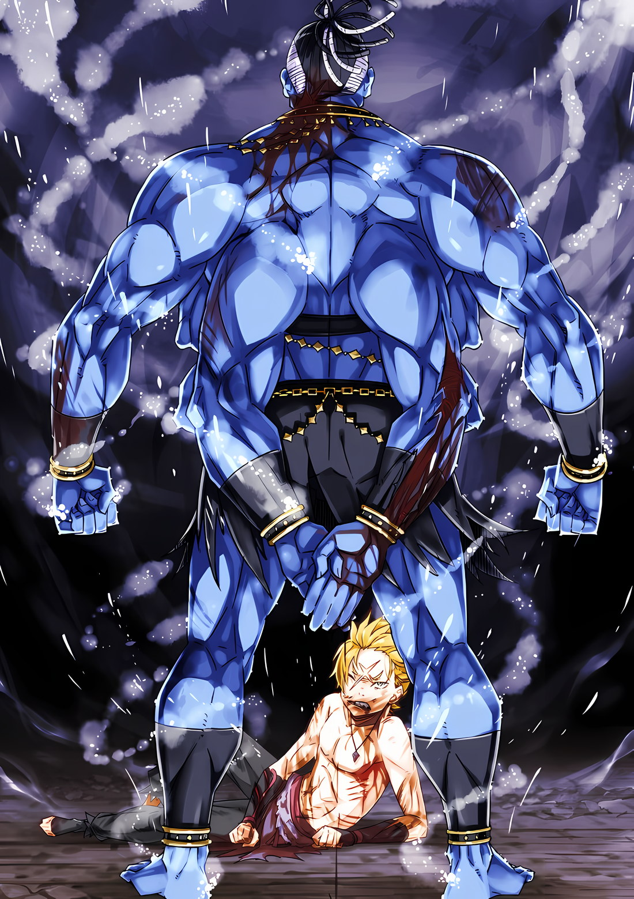

※ ※ ※ ※ ※ ※ ※ ※ ※ ※ ※ ※ ※

— «Великолепный Тигр?»

В тот миг, как этот голос достиг его ушей, сознание Гарфиэля сильно пошатнулось.

Он закашлялся, извергая из себя воду, которую успел наглотаться в огромном количестве. Встряхнув всем телом, чтобы сбросить воду, Гарфиэль заставил свой затуманенный от нехватки кислорода мозг обработать визуальную информацию.

Тусклое, холодное подземное пространство.

Твёрдый каменный пол сейчас был залит большим количеством прибывающей воды. Он понял, что мутный поток низвергался в помещение из дыры в стене позади него, его шум эхом отдавался в чистом воздухе.

На него смотрели. Тревога, настороженность, страх, непокорность — множество смешанных взглядов.

По числу людей и выражению их глаз Гарфиэль краем сознания заключил, что это одно из городских убежищ.

Водный канал, в который он упал, примыкал к этому убежищу, и обрушившаяся стена соединила их. В результате он попал сюда вместе с потоком воды.

— «…х!»

Осознав это, Гарфиэль словно ударил по своему затуманенному сознанию.

Резко подняв голову, он почувствовал, как волоски на всём теле встали дыбом при мысли о том, как он сюда попал. В панике он завертел головой, немедленно ища взглядом гиганта, вместе с которым он, сцепившись, упал в канал…

— «…ах.»

Его взгляд встретился с маленьким мальчиком со светлыми волосами, чьи зелёные глаза были полны слёз.

Знакомое лицо. Лицо, соседствующее с воспоминаниями, от которых сжималась грудь и скрипело сердце.

Мальчик, связанный с матерью Гарфиэля, с которой тот пережил одностороннее воссоединение.

Младший брат, занявший место, которое должно было принадлежать ему, получавший любовь матери…

— «!?»

Сознание, которое он только что привёл в порядок, снова запуталось в ненужных сантиментах.

Тут же рядом с ним раздался сильный всплеск, и из неглубокой воды, словно взрыв, поднялся чудовищный гигант. Великан замахнулся рукой и безжалостно обрушил её на застывшего Гарфиэля.

Гарфиэль среагировал на опускающийся удар с опозданием на долю секунды.

Слишком поздно, фатально.

Мгновение неосторожности даёт противнику шанс на один выпад.

И на этот раз выпад бога войны, с которым столкнулся Гарфиэль, был далеко не шуточным натиском.

В общей сложности восемь ударов обрушились на Гарфиэля.

Один, два он смог отбить. Но оставшиеся шесть пришлись точно в цель.

Удар сбоку отбросил голову, два удара в корпус подняли его в воздух. Парящее тело было сбито вниз соединёнными кулаками, а по упавшей в воду голове сверху ударил кулак.

Погрузившееся под воду лицо впечаталось в твёрдый пол, нос и клыки получили серьёзные повреждения. Хлынувшая кровь окрасила поверхность воды в красный, и в тот момент, когда он вскочил на ноги, из носа и рта потянулись кровавые нити.

— «Бугх, кхох… ррррааааааа!!»

Издав рёв сквозь прорехи от выбитых зубов, он отогнал эхо, сотрясавшее голову после удара. Яростный боевой клич взорвал воздух подземного пространства, и стоящий перед ним бог войны приветствовал это, шагнув вперёд.

Их кулаки столкнулись. Наклонив голову, Гарфиэль пропустил кулак мимо лица, но успел скользнуть по нему клыками, распоров руку от запястья до локтя. Одновременно его правая рука вытянулась к шее гиганта, и когти вспороли её до самого живота.

Из глубокого пореза брызнула свежая кровь, тело бога войны получило нелёгкие раны.

Но атака бога войны продолжалась ещё семью ударами. И Гарфиэлю приходилось использовать всё своё тело, чтобы уклониться от каждого из них.

В одном столкновении — один ход против восьми.

Подавляющее невыгодное положение, подавляющее численное превосходство, подавляющая разница в силе — это разжигало его.

— «Ооооооооо!!»

Ближе, ближе, ближе, ближе, ближе, ближе, ближе…

Принять, парировать, уклониться, отвести, пригнуться, отбить, обменяться ударами…!

Кулаки столкнулись с силой, и возникшая ударная волна опалила волоски на их телах боевым духом.

Лобовое столкновение могучих рук породило грохот, не похожий на звук ударов плоти о плоть, и их тела не выдержали, отлетев назад.

Разбрызгивая воду, тигр и гигант кубарем покатились.

Курган врезался в стену позади, а Гарфиэль снова оказался лицом к лицу с водой. Он тут же вскинул голову и встретился взглядом с Курганом, который смотрел на него.

Слов не было, но взаимопонимание было мгновенным.

Гарфиэль поднялся и топнул ногой по каменному полу в воде, доходившей ему до лодыжек.

Сила «Защиты Духов Земли», ощущаемая подошвами, активировалась, и пол под ногами Гарфиэля вырезался квадратом и поднялся. Пнув всплывший кусок пола, чтобы убрать его, он создал большую дыру, в которую немедленно хлынула вода, стремившаяся затопить подземелье. Уровень воды быстро падал.

Параллельно с действиями Гарфиэля по осушению, Курган направился к дыре, из которой текла вода.

Дыра, через которую они попали в подземелье, была большой, и поток воды был сильным. Если бы её оставили, через несколько минут подземное пространство было бы полностью затоплено.

В такой ситуации Курган вытащил один из своих демонических тесаков. Тех, что Гарфиэль не раскрошил своими клыками, оставалось всего три. Подняв один из них над головой, Курган прицелился чуть выше дыры в стене — грубый кусок железа вонзился в потолок и раздробил его.

Глаз воина оценил степень обрушения, и упавшие обломки грубо завалили дыру в стене. Конечно, вода всё ещё просачивалась, но уже не в таком количестве, чтобы мгновенно затопить подземелье.

Дыра была заделана, осушение завершено, и вода, доходившая до лодыжек, исчезла.

Молча обеспечив себе опору под ногами, два воина вернулись на свои исходные позиции и снова повернулись друг к другу. Кулаки со щитами были готовы, три демонических тесака извлечены.

Герой «Восьмирукий» Курган и претендент «Великолепный Тигр» Гарфиэль.

Сокрушить противника в полную силу. Это уже было неписаным правилом воинов.

— «…»

Он осознавал, что сейчас не время для этого.

Роль, которую требовали от Гарфиэля, — вернуться в городскую ратушу, которая, вероятно, подверглась нападению, и спасти некомбатантов.

Но с проблемой, стоило ли поворачиваться спиной к врагу или нет, он разобрался уже давно.

— Гарфиэль, как ни странно это прозвучит, был рад.

Он потерпел сокрушительное поражение от Райнхарда, доверие к вновь обретённой матери было запечатано вместе с воспоминаниями, он не смог отомстить за добрую девушку, которая защитила его, и по вине врага подверг своих союзников опасности.

Он чувствовал, как беспомощность и чувство утраты отнимают у него многое.

Покинув «Святилище» и познав мир, Гарфиэль осознал свою слабость.

В «Святилище» он наверняка был куда сильнее. Естественно. Тогда у него не было объектов для сравнения, и он не сомневался в отточенном боевом искусстве.

Покинув «Святилище» и познав мир, Гарфиэль узнал о силе многих других.

Он не думал, что его собственная сила ослабла по сравнению с тем, что было в «Святилище». Однако из-за того, что объектом сравнения перестал быть он сам в зеркале, он стал слабее в сравнении с ними.

Эти два дня наглядно показали ему изменение в сознании и его результат.

Беспомощность и чувство утраты обнажили душу Гарфиэля, напоминая, что он всего лишь дерзкий мальчишка. Растерянность, сожаление и сомнения терзали грудь, сердце колебалось, изнашивалось, слабело.

— Именно Курган вдохнул жар в его истерзанную, съежившуюся душу.

Герой «Восьмирукий» Курган. Герой империи Воллакия. Сильнейший из многоруких.

Этот человек поднял свои демонические тесаки и признал Гарфиэля воином, встав против него. Насколько же это было важно для Гарфиэля, потерявшего веру в собственную ценность.

Сцепившись, они упали в канал, и в непривычном подводном бою сознание Гарфиэля помутилось. Кургану, вернувшемуся из мёртвых с помощью тайного искусства, не нужно было дышать, и если бы он хотел только победы, ему достаточно было дождаться, пока Гарфиэль утонет.

Но бог войны проломил стену канала, открыв путь в убежище, и спас Гарфиэлю жизнь.

Зачем?

— «Сначала… я подумал, что мне опять… оказали милость.»

— «…»

Поначалу Курган не признавал Гарфиэля, чья решимость колебалась, воином.

Отшвыривать нападающего ребёнка и пинать рыдающую фигуру — не поступок воина. Поэтому Курган просто отталкивал Гарфиэля, отдавшегося на волю вспыльчивости.

Но он ошибался.

Потому что Гарфиэль поднялся, выставил щиты и посмотрел на него — и тогда Курган признал его воином.

Он увидел, как были подняты легендарные демонические тесаки, как бог войны приготовился встретить воина.

После увиденного не могло быть и речи о том, что действия по отношению к Гарфиэлю были жалостью или милосердием.

Курган искал. Искал достойного завершения битвы с Гарфиэлем.

— Битва воинов может закончиться только взаимным ударом, и никак иначе.

— «Эй, вы все… долго ещё тут торчать собираетесь?»

Проверяя ощущения от щитов на обеих руках, Гарфиэль обратился не к Кургану перед собой, а к обладателям разрозненных взглядов вокруг.

Люди — беженцы, — которые молча наблюдали издалека за битвой двух воинов с тех пор, как те прибыли сюда с мутным потоком.

Сборище людей разного вида, возраста и даже расы. Их объединяло отсутствие боевой силы — группа беспомощных некомбатантов, которых сдует ветром.

Если бы Гарфиэль пал, здесь не нашлось бы никого, кто мог бы противостоять Кургану. Трудно было представить, что Курган пойдёт на такую жестокость, как истребление некомбатантов, но это мог знать только Гарфиэль, стоявший перед ним.

Поэтому,

— «Посмотрите и поймёте. Как бы вы ни стояли в стороне и ни смотрели, ничего вы сделать не сможете. Лучше валите отсюда, пока есть время, и эвакуируйтесь наружу…»

— «Великолепный Тигр!»

— «А?..»

Высокий голос прервал слова Гарфиэля, призывавшего покинуть это место.

Удивлённо нахмурившемуся Гарфиэлю крикнул тот, кто единственный здесь звал его так.

Мальчик стоял со слезами на глазах, покрасневшим лицом и крепко сжимал подол своей одежды.

И он смело посмотрел в ответ на удивлённого Гарфиэля своими влажными глазами. Взгляд был настолько сильным, что Гарфиэль невольно затаил дыхание.

— «Эй, мелюзга… ты чего…»

— «Великолепный Тигр!»

— «…»

— «В-великолепный Тигр!»

Мальчик дрожащим голосом продолжал звать замолчавшего Гарфиэля.

Словно не зная другого способа выразить свои эмоции, он выкрикивал это имя.

Имя Золотого Тигра. Имя сильнейшего тигра, которым восхищался Гарфиэль Тинзель.

Почему он кричит это имя сейчас? Что он хочет сказать?

Слёзы покатились по покрасневшему лицу мальчика.

Крик мальчика слышали все в подземелье. Поэтому все разделяли невыразимый словами пыл, вложенный в этот голос.

— «Я же сказал, валите отсюда.»

— «Великолепный Тигр!»

Вздох Гарфиэля потонул в голосе, зовущем Золотого Тигра.

Кричащего мальчика сзади обняла девочка с такими же светлыми волосами. Его сестра. Обнимая брата, словно защищая его, она посмотрела на Гарфиэля дрожащим взглядом.

Губы дрожали. Беззвучный голос звал Золотого Тигра.

— «Победи!»

Это был не мальчик, не девочка и, конечно, не Гарфиэль.

Один из мужчин в подземелье, сжав кулаки, крикнул.

— «Да нет же, валите…»

— «Сражайся и победи!»

— «Не проигрывай!»

— «М-мы можем только смотреть… но!»

Он был ошеломлён.

Голос Гарфиэля, призывавший к отступлению, каждый раз заглушался другими голосами.

Он заметил, что пыл, начавшийся с голоса мальчика, передался всем людям в подземелье, и никто из наблюдающих за поединком Гарфиэля и Кургана не двигался с места.

Если подумать здраво, рассудить хладнокровно, кто мог бы счесть правильным оставаться здесь? Все были охвачены жаром. Они доверились выводу, который мог стоить им жизни, ради бессмысленного упрямства или веры.

— «…»

«Что за чёрт?» — подумал Гарфиэль.

Какой смысл оставаться здесь? Чего можно добиться, крича и подбадривая?

Было бы гораздо лучше, если бы они убежали. Не нужно было бы беспокоиться о том, что они попадут под раздачу, и вероятность жертв после его падения уменьшилась бы — это было бы гораздо разумнее.

Но почему никто не убегает?

— «Босс… похоже, твоя речь слишком сильно подействовала…»

Вспомнились слова Нацуки Субару, его обращение, разнёсшееся по всему городу.

Захватив сердца всех жителей города, сила слабости Субару мощно подняла дух людей, дрожавших от страха и ужаса, и зажгла слабый огонёк последней надежды.

Этот тлеющий уголёк остался теплом в их груди и был готов разгореться при первой же возможности.

Словно для них этим местом стал этот самый миг.

Словно для Гарфиэля этим мгновением стало это самое время.

— «Великолепный Тигр!»

Поддержка не прекращалась.

Первым Золотого Тигра звал младший брат Гарфиэля, появившийся невесть откуда. Обнимала его, защищая, так же невесть откуда взявшаяся младшая сестра Гарфиэля.

Брат и сестра смотрели на Гарфиэля.

Жители города, принявшие его потерявшую память мать, смотрели на Гарфиэля.

— «Поединок воинов… для обычной дуэли слишком шумно, чёрт возьми.»

— «…»

— «Правда, прости. Я тебе одни неприятности доставляю. Особенно самые шумные — вон те, мои младшие брат и сестра. Я им потом всё объясню.»

— «…»

— «Поэтому.»

Стойка молчаливого бога войны наполнилась боевым духом.

Слов не было, но сама поза была красноречивее любых слов.

Он подтянул сжатые кулаки и ударил щитами друг о друга.

От удара стали посыпались искры, Гарфиэль оскалил клыки и вдохнул.

— ««Щит Святилища»… нет.»

— «…»

— ««Великолепный Тигр», Гарфиэль Тинзель.»

Представление перед началом поединка воинов.

На представление Гарфиэля Курган не ответил голосом. Молчаливый бог войны лишь потёр демонические тесаки друг о друга, выражая максимальную боевую готовность к противнику.

Этого было достаточно.

— «Гаааааааа!!»

Каменный пол взорвался под его толчком, и тело Гарфиэля рванулось вперёд.

Расстояние между ним и Курганом, шагнувшим навстречу для перехвата, исчезло в мгновение ока.

Удары были резкими, рубящие атаки — тупыми, и между ними проносились сокрушительные атаки.

Воздух, рассекаемый демоническим тесаком, не сжимался и не разрезался, а убивался, и чутьё воина уловило в приближающемся лезвии ощущение неминуемой гибели.

Один ход против восьми, восемь ходов против одного.

Разница в количестве атак между Гарфиэлем и Курганом была сравнима с восхождением на далёкую вершину.

Но если не протянуть руку, то не дотянуться. Поэтому он бросает вызов, рискуя всем.

— «…»

Сокрушительный удар, нацеленный в туловище — прямой удар разрубил бы его пополам, несмотря на отсутствие остроты. Гарфиэль без колебаний поднял ногу и сверху раздавил демонический тесак.

Пятка впилась в плоскость тесака, толстое лезвие вонзилось в каменный пол, и от грохота дробящегося камня показалось, что задрожал весь город.

Первый ход, но времени на облегчение нет.

Одновременно с тем, как раздавленный тесак вонзился в пол, второй, описывая дугу, атаковал с левого плеча. Сразу после того, как правое ухо уловило звук рассекающего воздух тесака, Гарфиэль защитил голову щитами на обеих руках. Без малейшего отклонения, в тот же миг, как он поднял руки, сокрушительный удар попал в цель, и сознание помутилось.

От полученного удара правая рука сломалась от локтя, предплечье и запястье были раздроблены. Он стиснул зубы так сильно, что они треснули, и выдержал. Это второй ход.

Третий и четвёртый ходы — удары без оружия, нанесённые одновременно.

Когда гигантский Курган сжимал кулаки, они становились размером с голову младенца. Если сила пушечного ядра высвобождается снарядом такого же размера, результат будет одним словом — колоссальным.

Кулаки, способные пробить каменную стену или даже железную плиту, атаковали Гарфиэля, чьё сознание помутилось от удара по голове. Целились в туловище и голову, любой прямой удар — и он разлетится на куски.

Кулак, вонзающийся в туловище, обжёг поверхность пресса Гарфиэля.

Мозг ошибочно принял это за ожог пламенем — настолько горячим был кулак, настолько пронзительной была его сила.

Он извернулся, и кулак лишь содрал кожу с пресса. Третий ход.

Чувствуя, как половина тела онемела от боли, он подставил правую руку под четвёртый удар, нацеленный в лицо. Сломанная, раздробленная правая рука полностью взорвалась от сверхмощного удара.

Пальцы, кисть, локоть были раздавлены, рука деформировалась до неузнаваемости. Щит, закреплённый на запястье, отлетел, но потерявший силу кулак был далёк от смертельного удара. Отклонившись назад, он встретил кулак лбом. Удар головой сокрушил кулак Кургана, четвёртый ход отражён.

Осталось пять, шесть, семь, восемь. Далеко. Слишком далеко. Улыбка появилась на его лице. Клыки задрожали.

— «…ооо, Ооооон!!»

Пятый и шестой ходы — тоже без оружия. Остался один демонический тесак, решающий удар приберегался.

Две левые руки, одна под плечом, другая из-под мышки, ударили одновременно. Правая рука, которую можно было использовать для защиты, была мертва. Левая рука не успевала. Без колебаний он шагнул вперёд правой ногой.

Подошва ботинка подняла едва заметные брызги, и одновременно воля передалась земле.

Иногда черпая силу, иногда двигая по своему усмотрению, и сейчас снова заимствуя силу…

Опора под ногами исказилась, пятка Кургана оторвалась от земли.

Однако бог войны раздавил это искажение без малейшей задержки. Никаких колебаний в его движениях. Ни тени сомнения. Но полная концентрация нервов дала трещину.

В то мгновение, когда нервы Кургана отвлеклись на опору, Гарфиэль рванулся в этот промежуток.

Подняв ногу, извернувшись, он просунул голову в крошечный зазор между двумя боковыми ударами. Словно пронзая затишье в буре, он проскользнул мимо двух ударов, задевших его туловище и спину.

Коснувшись ногами земли, Гарфиэль ужаснулся своему решению.

Решение, принятое менее чем за долю секунды, без промежутка между мыслью и решением, он даже не понимал, на основании чего решил, что сможет. Мозг горел. Сердце пылало. Сама жизнь взрывалась внутри.

Пятый и шестой ходы заблокированы. И затем седьмой и восьмой…

— «…»

Мурашки пробежали по всему телу Гарфиэля.

Курган, чьи шесть атак были отражены, намеревался прикончить Гарфиэля оставшимися двумя. — Грядёт смертельный удар.

— Седьмой ход пропущен, грядёт последний, восьмой ход.

Отказавшись от одного хода, он занёс демонический тесак.

Правая рука сжала рукоять, рука на правом плече тисками схватила лезвие тесака. Сверхмощный рубящий удар, который он использовал для отражения атаки Гарфиэля на земле, был готов.

Аура, от которой он был уверен, что будет убит, где бы ни находился.

Все шесть ходов, отбитых с риском для жизни, казались ничтожными по сравнению с этой финальной стадией.

Он не видел способа уклониться.

Отступить назад, прыгнуть вбок, рвануться вперёд — всё равно его настигнет сокрушительный удар.

Он мог устрашающе ясно представить себя, разлетающегося на куски от одного удара.

Уклонение невозможно. Отражение также безрассудно. — Оставался лишь один выбор — принять удар.

Подняв несломанную левую руку над головой, Гарфиэль присел.

В этот момент в мире всё ещё были слышны голоса. Голоса брата, сестры и множества других людей.

Решение — мгновенно, действие — в одно мгновение, результат — сразу же.

— «…»

В тот момент, когда демонический тесак был выпущен, Гарфиэль полностью отрезался от мира.

Звуки исчезли, цвета пропали, все лишние образы испарились. В предельной концентрации в сознании Гарфиэля осталось только присутствие Кургана.

С неестественной медлительностью острие демонического тесака опускалось на Гарфиэля.

Он смотрел вверх, готовясь принять удар, и его собственные движения тоже были медленными. В этом мучительно застывшем мире Гарфиэль мог только стиснуть зубы.

Нет, время на воспоминания всё же было.

Он увидел Субару. Увидел Рам. Увидел Мими, увидел Фредерику, появилась Рюдзу, была Эмилия, появился Отто, всплыл этот ублюдок Розвааль, Беатрис, Петра, все из «Святилища», и мать Лисия с братом и сестрой.

В битве за «Святилище» Гарфиэль осознал свою слабость.

Познав просторы мира и потерпев поражение от Райнхарда, Гарфиэль ошибочно подумал, что стал слабее, чем до выхода из «Святилища».

— Этого не может быть.

Если ты становишься слабее от того, что несёшь на себе, то ради чего жить?

Нужно просто стремиться быть достаточно сильным, чтобы защитить то, что несёшь.

— «Ах… прояснилось.»

Камень, терзавший его, упал с души.

В тот же миг удар демонического тесака пришёлся по щиту на поднятой левой руке, и молния пронзила всё его тело.

— «—Ххх!!»

Защита левой руки была мгновенно сломлена сокрушительным ударом демонического тесака.

Подобно разрушению правой руки, кисть, локоть, предплечье и даже плечо были вывернуты одним махом.

Привычные обе руки были разбиты кошмарным образом, и нестерпимая боль окрасила зрение в красный, а мысли — в белый. Рот открылся, и раздался крик.

Стиснутые челюсти разжались, и все полученные до этого раны запели в хоре отчаяния.

Инерция демонического тесака не иссякла.

Сломав левую руку, оставшаяся сила устремилась к шее Гарфиэля. Силы было достаточно, чтобы раздавить его маленькое тело и превратить всего его без остатка в куски плоти.

Что подумал бог войны о молодом воине, издававшем крик, близкий к предсмертному?

Испытал ли он сострадание, почувствовал ли жалость — ни то, ни другое.

До самого момента прерывания дыхания у воина нет причин жалеть другого воина.

— «—Аааахх»

Крик нестерпимой боли, голова Гарфиэля опустилась. Мучительный голос затянулся, и затем.

— «—ааа, гх»

Крик прервался, челюсти сомкнулись. Снова стиснутые челюсти, и в них — серебряный блеск.

Серебряный щит, упавший с разрушенной правой руки, был зажат в зубах Гарфиэля.

— «Гх, Аоооо—хх!»

Вскинув шею, лицо, державшее щит в зубах, метнулось наперерез демоническому тесаку.

Второй блок щитом — в момент удара щит вдавился в лицо, и кровь брызнула из носа Гарфиэля. Клыки вылетели. Но колени не подогнулись.

Сила мощной шеи и челюстей остановила удар демонического тесака.

От столкновения стали и стали посыпались искры — вспыхнуло пламя, и сознание Гарфиэля улетело прочь.

— «…»

Полузакатив глаза, он всё же наклонил шею — чья это была воля?

Боевой инстинкт, или звериная жажда борьбы, или инстинкт выживания?

Внезапно брызнула кровь. Огромное количество свежей крови, и в подземелье расцвели алые цветы.

Источник — правая рука Кургана, та самая последняя рука, сжимавшая демонический тесак.

На ней была рана, нанесённая Гарфиэлем в предыдущем столкновении, рассекавшая руку от запястья до плеча так глубоко, что виднелась кость. От последнего удара эта рана раскрылась полностью.

На лице Кургана не было удивления. Он не стонал от боли.

Естественно. Он был мертвецом. Болевой порог — это спасательный круг, данный живым для подтверждения огонька жизни; мёртвым эта функция не нужна.

Поэтому Курган упустил из виду влияние неполноценной правой руки.

Если бы он действительно хотел подстраховаться, последний удар следовало нанести здоровой левой рукой.

Это решило исход битвы — так утверждать нельзя.

Но,

— «…ах.»

Выдержав восьмой ход, Гарфиэль выдохнул окровавленным лицом.

Щит, который он держал в зубах, упал. Перед ним стоял Курган, выложивший все свои руки и подставившийся. Правая и левая руки Гарфиэля были полностью разрушены, обе ноги тоже не выдержали многократных ударов, и мышцы во многих местах были разорваны. Тем не менее, он мог сделать ещё один прыжок.

Прыгнуть и что? Руки, когти использовать нельзя. Тогда остаётся…

— «А, ааа, Аааааааааа—хх!»

Крича, широко раскрыв пасть, он бросился на Кургана.

Клыки Гарфиэля впились в основание шеи застывшего бога войны. Клыки легко пронзили твёрдую, напряжённую кожу и вырвали с корнем жизненно важные органы.

Вцепившись, он извернулся, клыки зацепили мышечные волокна, намотали их, почти половина шеи была вырвана и поглощена звериными челюстями Гарфиэля.

— «Гх, ахх»

Беззащитно упав на пол, Гарфиэль выплюнул вырванную плоть. Задыхаясь, он обернулся и увидел спину Кургана, из шеи которого обильно текла кровь.

Гарфиэль с раздробленными руками, выбитыми клыками, весь в крови.

И перед ним — Курган, получивший смертельную рану, но стоящий непоколебимо, величественно. Дрожь пробежала по телу — таким был истинный герой.

— «…»

Наконец, Курган медленно повернулся к Гарфиэлю.

Бог войны спокойно скрестил руки на груди, глядя на воина, лежащего на земле и смотрящего на него снизу вверх.

И затем,

— «—Великолепно.»

Низкий, тяжёлый голос произнёс лишь одно слово, восхваляя победителя.

— «А…»

Не было времени что-либо ответить.

На глазах у изумлённого Гарфиэля фигура Кургана мгновенно рассыпалась.

Огромное тело рассыпалось, как песок, чудовищное лицо превратилось в груду пепла.

Слишком уж прозаичный конец, возвращение мертвеца к мёртвым — таков был результат.

— «…Вот уж точно не скажешь, что достойно.»

Глядя на исчезнувшего, обратившегося в пепел бога войны, Гарфиэль злобно пробормотал.

Он не хотел, чтобы тот цеплялся за жизнь недостойно. В битве не на жизнь, а на смерть, прозаичный конец — это естественно.

Так что это были лишь ненужные сантименты Гарфиэля.

— «Ах, чёрт… хреново, умру…»

Слишком много крови потерял.

Лёжа на полу, он всем телом черпал силу из «Защиты Духов Земли», собирал всю ману и направлял её на исцеление с помощью магии, восстанавливая тело. Особенно плохо было с руками и лицом.

Он продолжал получать удары, так и не оправившись от повреждений, полученных на поверхности. Неудивительно, что остались серьёзные травмы.

— «Великолепный Тигр!»

Плачущий голос позвал Гарфиэля, сосредоточенного на лечении.

Шлёпая по лужам, к нему подбежали брат и сестра. Другие люди тоже подбегали, но Гарфиэль видел только их двоих.

У обоих были заплаканные лица — нет, они плакали.

Ничего не поделаешь. Даже для непрофессионала состояние Гарфиэля было ненормальным. Профессионал бы сказал, что удивительно, как он вообще жив. Целитель бы побледнел и поставил диагноз: требуется немедленная помощь.

Это было доказательством того, что он пересёк границу жизни и смерти.

Конечно, он гордился этим, но…

— «Живой-то живой… но стоять на месте не могу.»

Даже победив «Восьмирукого» Кургана и добившись успеха, он не мог остановиться.

Это была битва Гарфиэля, но не только его битва. Пока его здесь задерживали, его товарищи могли оказаться в беде.

Нужно вернуться в городскую ратушу, — подумал Гарфиэль и поднялся.

Услышав его слова и увидев действия, подбежавшие брат и сестра изменились в лице. Особенно сестра — её лицо исказилось от гнева, как у фурии.

— «Т-ты что, дурак?! Лежи спокойно! Сейчас… да, сейчас же кого-нибудь позовём, врача…»

— «Врачи наверняка нужны другим. У меня, мелюзга, есть другие дела.»

Покраснев, сестра продолжала настаивать, но Гарфиэль лишь кивнул ей. С окровавленным лицом он, должно быть, выглядел ужасно. Сестра горько заплакала от досады.

Тем временем кости его раздробленных рук срастались. Плоть ещё не полностью восстановилась, но вряд ли он потеряет сознание от удара. Решив так, он встал.

— «П-подожди… т-ты правда идёшь?»

— «…Ты же слышала трансляцию?»

— «Э… д-да.»

С кончиков пальцев капала кровь. Гарфиэль пробормотал, и ему кивнули в ответ.

Тот голос дал брату и сестре смелость, а ему — последний толчок здесь. Поэтому Гарфиэль должен был ответить на этот голос.

Раз Субару сказал, что всё будет в порядке, значит, так и должно быть.

— «Поэтому я…»

— «Постой!»

Обескровленное тело пошатнулось, и он упал на колени. Падающее тело поспешно поддержала сестра, и Гарфиэль цыкнул языком.

Тут перед ним встал его брат.

— «Великолепный Тигр.»

— «…Чего? Прости, но если ты тоже собираешься меня останавливать, слушать не буду.»

— «Нет, не то. Великолепный Тигр, у тебя одежда светится.»

Услышав слова брата, Гарфиэль опустил взгляд и заметил.

На поясе его изодранной одежды ткань слабо светилась.

Туда он засунул зеркало для связи. Бесполезный предмет, так как связаться с городской ратушей не удавалось. То, что оно слабо светилось, означало,

— «Я думал, оно сломалось…»

— «Д-дай, я достану!»

Гарфиэль тяжело дышал. Сестра, не дав ему опомниться, сунула руку ему за пазуху и вытащила зеркало для связи. Поверхность зеркала излучала свет — судя по тому, что он слышал о его использовании, это означало вызов от парного зеркала.

То есть его вызывали из городской ратуши или от другой группы.

— «Ч-что делать?..»

— «Дай сюда. — Кто там?»

Сестра робко приблизила сияющее зеркало к Гарфиэлю. Заглянув в его поверхность, Гарфиэль позвал.

Зеркало для связи медленно замерцало.

※ ※ ※ ※ ※ ※ ※ ※ ※ ※ ※ ※ ※
