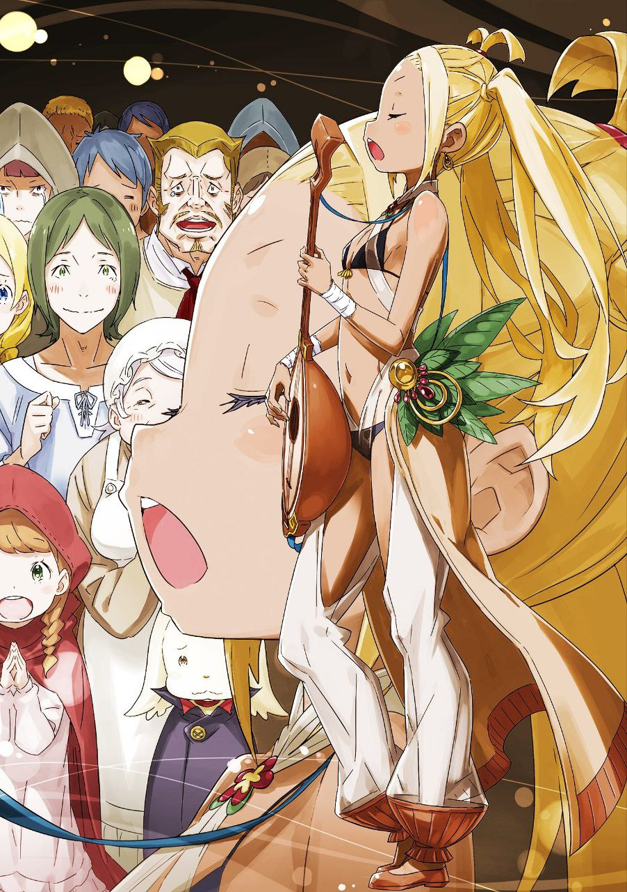

※ ※ ※ ※ ※ ※ ※ ※ ※ ※ ※ ※ ※

— «…»

Пальцы скользят по струнам люлиры, привычным движением перебирая натянутые нити. Сколько лет, сколько десятков тысяч раз я это делала — пальцы помнят эти движения с тех пор, как я себя осознала.

Для меня всё, что связано с пением, так же естественно, как дыхание. Настолько естественно, что смешно даже пытаться вспомнить, когда это началось.

Раскрываю горло, напрягаю живот и накладываю песню на рождающуюся музыку.

Пою слова, что всплывают в голове в этот самый миг, все свои эмоции.

И всё это ложится на музыку, точно так же вытащенную изнутри в это самое мгновение.

— «…»

Когда рождается новая песня, я говорю, что меня «осенило», но, по правде говоря, слово «осенило» — это слишком самонадеянно.

Проще говоря, ближе к истине будет сказать, что я её не придумала, а нашла. Мелодия и слова, всплывающие в моей голове в этот момент, — всё это изначально было где-то зарыто в этом мире.

По какому-то случаю эта зарытая в мире музыка откапывается.

Есть повод её найти, и так уж вышло, что нашла её именно я. Подарок, свалившийся как снег на голову — музыка озарения… ну, вот так я об этом и думаю.

Поэтому я и сказала Присцилле, что музыкой можно заниматься и без образования. Даже отбросив всю мудрость, знания и прочие сложности, всё равно что-то можно сделать, верно?

Ведь поют не только люди.

Разве вы не слышали пения птиц? Не прислушивались к хору насекомых? Не испытывали умиротворения от шелеста ветра или журчания ручья?

Есть ли у них то, что люди называют образованием? Может, и есть, но стоит полагать, что нет. То есть, нет его, по крайней мере, по-моему, нет! И не нужно!

Разве вы не чувствовали музыку в солнечном свете, в фазах луны, в запахе земли, в треске поленьев в костре? Я чувствовала! Это доказательство того, что мир полон музыки.

Этот мир создан из музыки, этот мир наполнен музыкой, этот мир связан музыкой — вот тому доказательство!

— «…»

Мы, барды, лишь заимствуем звуки в этом мире, полном музыки. Мы просто берём то, что всегда и везде было, и делаем это чуть более заметным — навязчивое самодовольство одиночек.

Бесстыдно, не скупясь, распространяем то, что считаем хорошим — эгоизм.

Пусть так и думают. Неважно, что о нас думают.

Но ведь эта музыка хороша, правда?

Есть радость в том, чтобы делиться интересным с незнакомцами, весёлым — с теми, кто рядом.

Есть радость в том, чтобы кричать во весь голос, когда интересно, когда весело.

В музыке это есть. Музыке это позволено.

Ведь поёт весь мир, так кто же осмелится осудить поющего?

Ну же, погружайся, погружайся, погружайся.

Ну же, увлекись, увлекись, увлекись.

Утопай в веселье, наполни сердце радостью, стань пленником интересного!

Не только ушами, но и глазами, носом, кожей, сердцем, душой — всем своим существом наслаждайся «звуком» и «радостью»!

Исступление поглощает толпу, разом смывая нарастающий «Гнев».

Телом задаю ритм, голосом становлюсь частью музыки. Встречаясь взглядами с соседом, понимаешь — сейчас ваши сердца чувствуют одно и то же.

Естественно. Музыка рядом с тобой, она твой друг от рождения до смерти, который никогда не покинет.

Видишь, слышишь, чувствуешь.

Существование музыки, что зовёт нас, говоря: «Мы всегда здесь»!

— «Эх, чёрт! Было совсем не тихо, но спасибо за внимание—ааа!!»

Я вам спела всё до конца, во как!!

※※ ※ ※ ※ ※ ※ ※ ※ ※ ※ ※ ※

Э-э, ну, как бы сказать, простите, я немного увлеклась.

Когда вот так заканчивается концерт с громкими заявлениями, вспоминаю своё недавнее воодушевление, и лицо начинает гореть, ай-яй-яй.

— «Это… сестрёнка, вы были потрясающи! Я так впечатлён!»

Угх! Чистый, без тени злого умысла взгляд Шульта так ранит! И больно, и приятно! Его незамутнённые, ясные алые глаза вонзаются прямо мне в сердце!

Н-нет, я понимаю, что у него нет никаких дурных намерений, это не сарказм, а совершенно искренний детский восторг, которым он прямо поделился. Понимаю, но не могу принять это с лёгким сердцем — вот такая я эгоистка!

Прости, Шульт… Становясь взрослым, пачкаешься.

— «? Не совсем понимаю. Простите мою необразованность».

Ух ты! Какое милое поникшее личико, просто нечестно!

От этого ребёнка так и веет аурой, вызывающей желание подшутить. Ч-чуть-чуть, самую малость прикоснуться… ухе-хе…

— «Лилиана. Твоё недавнее выступление было неплохим. Хвалю».

— «Гьяа!»

— «Что это за уродливый звук? Не подобает девице… тем более тебе, издавать такие звуки из горла».

Как только мои дурные взрослые помыслы чуть было не коснулись Шульта, появилась Присцилла, словно нарочно, чтобы помешать. Нет, я вовсе не замышляла ничего плохого. Мимолётное помешательство, честно, совсем нет.

Кстати, едва Шульт увидел Присциллу, его лицо тут же просияло, и он прильнул к ней где-то на уровне пояса. Не то чтобы обнял, а лишь скромно ущипнул за краешек её красного платья… эта скромность делает его ещё большим ангелом.

Ну вот, она пришла за Шультом и превратила место, где только что разыгралась настоящая трагедия, в банкетный зал…

— «Неужели это дало такой эффект… Возможно, я, сама того не зная, достигла вершин музыкального искусства. Да, самой вершины богини музыки!..»

— «Глупости. Важно понимать разницу между чернью и собственными возможностями, но и слишком высоко себя оценивать — дурной тон. Твоя песня имеет потенциал, но называть себя непревзойдённой ещё рано. В данном случае просто повезло, что они были в состоянии, когда их легко увлечь».

— «Легко увлечь?»

То есть, что это значит?

Присцилла, скучающе обмахиваясь веером, окинула взглядом зал. Я робко проследила за её взглядом и увидела множество людей.

Да, видно было, как те, кто только что ругался, дрался, хватал друг друга и покушался на чужое имущество, теперь освободились от этой напряжённости и немного успокоились.

Сейчас они немногословны, но помогают тем, кто пострадал в той толкотне, извиняются друг перед другом… да-да, это очень важно.

Ух ты, а моя песня-то чего-то стоит! Люди, которые так враждовали, стали такими спокойными. Настоящее мастерство!

— «Не зазнавайся. Воздействие на их нестабильные, словно у марионеток, сердца продолжается. Твоя песня лишь вывела яд из тех, кто до этого был скован подозрениями и страхом. В любом случае, если не устранить первопричину, рано или поздно всё вернётся на круги своя».

— «Буэ?! А, нет, но, смотрите, тогда каждый раз, когда их сердца будут бушевать, я смогу просто смыть всё это моими зажигательными песенками…»

— «Теоретически это возможно. Но как симптоматическое лечение — хуже не придумаешь. К тому же, этот безумный дебош происходит не только в этом зале».

— «Ч-ч-ч-что вы сказали?»

Ой, а этого я не знала. Хотя да, по дороге Присцилла вроде как избегала подобных стычек, и говорила, что это распространилось по всему городу… так это ведь довольно серьёзно, разве нет?

— «З-з-значит… с Пристеллой надо что-то делать…?»

— «Ну, вроде того. Честно говоря, у меня нет никаких обязательств спасать этот город, но…»

— «Присцилла…»

Опять эти бессердечные, хладнокровные, железная маска! — слова Присциллы, и Шульт смотрит на неё снизу вверх дрожащими глазами. Не знаю, но мне кажется, что этот Шульт, находясь рядом с Присциллой, ведёт себя совершенно обычно. Идеальная психика.

Ах, ну что поделать с этим ребёнком, он полностью соответствует условиям, когда хочется сказать: «Ну ладно, ладно».

Не знаю, поддалась ли Присцилла мольбам Шульта так же, как поддалась бы я, не устояв и растаяв, но она тоже как будто неохотно пожала плечами. Сердце забилось. Пристально смотрит на свою руку.

— «Присцилла, а сколько вам лет?»

— «Девятнадцать».

— «Ох, вот как. А мне, кстати, двадцать два».

— «Я не спрашивала».

Просто захотелось сказать. В чём дело, разница в питании? Профессиональный недостаток странствующего барда проявился именно здесь? Чёрт.

— «Не скажу, что поддалась на уговоры Шульта, но у меня нет такой трусости, которую путают с великодушием, чтобы прощать неуважение тех, кто дерзит во время моего пребывания. Необходимо схватить всех причастных из Культа Ведьмы, отрубить им головы и выстроить в ряд».

Пока я сжимала кулаки и дрожала, Присцилла, похоже, определилась с планом действий.

Опять она оправдывается на словах, но то, что её истинное желание — выполнить просьбу Шульта, мне совершенно ясно.

— «Ну надо же, а Присцилла у нас неожиданно за-бот-ли-ва-я♪»

— «…»

— «Гиньяа?! Горит, загорелось, подпалилось?!»

Загорелось?! Загорелось?!

В тот момент, как я ткнула Присциллу локтем в бок, пламя охватило мою макушку! Кончик собранных волос подпалился и скрутился?! В этот раз даже «Хо» не было!

Внезапное нападение! Вот это настоящая паника! Незабываемое известие!

— «С-сестрёнка, вы в порядке…?!»

Шульт с изменившимся лицом подбегает ко мне, катающейся по полу с горящей головой. Наверное, решив, что нужно срочно тушить огонь, он достаёт из своего свёртка бутылку и пытается вылить её содержимое на меня, мучаясь. А моя голова тем временем охвачена адским пламенем…

— «Прекрати, Шульт».

— «Н-но, Присцилла…!»

— «Это же мой вечерний напиток. Мало того, что это моя собственность, так если вылить его, певица просто превратится в огненный шар. Забавно, но только и всего».

— «Оё-ё-ё-ёй…»

Прежде чем меня превратят в огненный шар, я катаюсь, катаюсь, катаюсь по холодному полу. Шульт склоняет голову набок и неосторожно спрашивает: «А алкоголь горит?».

Ах вы! Хозяйка и слуга сговорились уничтожить меня огнём… но! Даже если я умру здесь, моя душа барда не погибнет, и каждую ночь у вашего изголовья будет звучать моя песня… ведь песни есть везде в этом мире!

— «Если тебя это устраивает, то и меня устраивает. И вообще, шумишь из-за подпаленного кончика волос. Вставай скорее».

— «А, что? А где же адское пламя мести? Я же должна была сгореть дотла в обжигающем пламени, разве нет?»

А, и правда, совсем не горит. Фух, зря перепугалась.

Я смущённо улыбаюсь, отряхиваю одежду и, чувствуя на себе пристальные взгляды окружающих, подхожу к Присцилле. И обращаюсь к ней напрямую.

— «Тогда, Присцилла! Давайте же, ради спасения Пристеллы, как следует врежьте Архиепископу Греха одним мощным, эффектным ударом! А я буду вас поддерживать изо всех сил!»

— «Не говори так, будто это тебя не касается. Разумеется, я возьму тебя с собой».

— «Ч-ч-ч-чтооооо?!»

Невероятно! Мир перевернулся! Красота недолговечна! Почему именно я?!

— «Я ведь всего лишь скромная певичка, чьи достоинства — только то, что я милая, умею петь и… милая. Если возьмёте меня с собой, я смогу лишь радовать ваш взор и слух, больше ни на что не гожусь».

— «Мне нравится эта прямота. К тому же, я уже говорила. Я присматриваюсь к тебе. Твой голос… жаль будет его потерять. Тем более, если ты останешься здесь с этой толпой глупцов и что-то случится. Будь в пределах досягаемости моего «Солнечного Диска»».

— «То есть… потому что я такая милая, что вы хотите меня защитить?»

— «…Хо».

— «Ух ты! Присцилла, вы так добры, что предупреждаете перед тем, как рассердиться!»

После шока от того, что мне без предупреждения подпалили волосы, Присцилла, которая хотя бы предупреждает, кажется мне какой-то доброй. Ой, что-то сердце заколотилось. Что это за чувство… пульс учащается, ладони потеют, дышать трудно, кровь от лица отхлынула…

— «Есть и другие причины взять тебя с собой. — То раздражающее заявление глупца, оно было сделано с помощью магического устройства в городской ратуше, так ведь?»

— «А? А, да, оно в городской ратуше. Каждое утро, просыпаясь рано и протирая сонные глаза, я выполняю свой долг… А! Но это не значит, что я пою спустя рукава! Честно говоря, до самого момента пения я сонная, точнее, наполовину сплю, или даже больше чем наполовину сплю, но как только начинаю петь — глаза широко открыты! Точно широко открыты!»

— «Достаточно знать, где оно. Нужно это магическое устройство и ты».

— «Я нужна…»

— «Твоё горло».

Меня поправили. Те-хе.

Но зато теперь я наконец-то поняла, что хочет сказать Присцилла. То есть, она хочет сказать вот что:

— «Сделать то же самое, что и в этом зале, но с помощью магического устройства на всю Пристеллу!..»

— «…»

— «Э, а, Присцилла? Что с вами?»

— «Какая наглость прямо передо мной. Ты, куда ты дел настоящую Лилиану? Настоящая не может быть такой сообразительной».

— «Умную и милую меня считают иллюзией!!»

Честно говоря, обидно, какой же образ у меня сложился.

Но я поняла замысел Присциллы. Действительно, если подобные беспорядки происходят по всему городу, то это мой выход.

Конечно, ездить по разным местам и давать концерты — это тоже мило, но в данном случае так мы не успеем! Значит, самый быстрый способ — ударить наверняка!

— «Да, я поняла! Точно, теперь всё ясно. Тогда намерение Присциллы взять меня с собой вполне естественно! К тому же, городская ратуша — это место, где собираются умы города! Наверняка и Киритака там, и, ну, в таких чрезвычайных ситуациях он, наверное, довольно надёжный человек!»

— «Однако, в городской ратуше наверняка находится Архиепископ Греха. Так что истребление вредителей неизбежно. Постарайся хотя бы не попасть под раздачу».

— «Я забыла!»

Точно. Сейчас в городской ратуше должен быть «Похоть». То есть, если ратуша стала их базой, то наш план проваливается с самого начала.

— «Нет-нет-нет-нет, но-но-но-но! Может быть, к этому времени этот Архиепископ Греха уже бросил ратушу и ушёл куда-нибудь! Там, из-за секретности и всего такого, много комнат, куда нельзя входить, так что там довольно скучно. Наверное, «Похоти» надоело убивать время, и он уже ушёл, как думаете?»

Хе-хе, блестящая дедукция. Идея, которая могла прийти только мне, ведь я хожу туда каждое утро на работу.

На самом деле, там все суетятся и работают, им не до меня, а детей, не знающих цифр, прогоняют, говоря, что им тут не место, ну, как-то так!

Поэтому наверняка городская ратуша сейчас пуста-а-а…

— «Яху. Яху-у. Яхо-хо-о».

Второе сообщение раздалось именно в этот момент.

※※ ※ ※ ※ ※ ※ ※ ※ ※ ※ ※ ※

Услышав второе сообщение, мы, понурив головы (Присцилла и Шульт внешне не изменились), вышли из зала.

Выход занял некоторое время, потому что после второго сообщения люди в зале снова стали нестабильны, и мне пришлось нейтрализовать это своей песней.

Честно говоря, это был концерт поневоле.

Конечно, какую бы песню я ни пела, я не стану халтурить или щадить голос, но по сути, в песне не должно быть никаких лишних примесей.

Показать песню, вовлечь в песню — вот мой подход, по крайней мере. Я не хочу думать о песне как о средстве противодействия каким-то ментальным атакам, вызывающим тревогу. Даже если в итоге так и получается, если я, поющая, буду так думать о песне, если не смогу быть искренней с ней, то не думаю, что смогу такой песней затронуть чьи-то сердца.

— «Захват контрольных башен и Большого Шлюза. И требования в следующем сообщении, значит…»

Выйдя из зала, я лишь плелась за Присциллой, которая уверенно шагала вперёд. Какая-то потеря уверенности, или скорее, потеря своего предназначения?

Я не сомневаюсь, что я — та, кто поёт песни, но то, что требуется в этой ситуации — это я, песня или результат?

Все три исходят от меня, это точно, но они не сочетаются друг с другом.

Такое вот чувство.

— «Добраться до магического устройства в ратуше можно будет только после третьего требования».

— «Почему так?»

— «Культу Ведьмы нужно использовать магическое устройство ещё один раз, чтобы объявить свои требования. После этого им достаточно будет удерживать четыре захваченные контрольные башни. Ратуша потеряет своё стратегическое значение, и они покинут её. Хотя, возможно, они оставят магическое устройство для своих дурных забав…»

— «Разве они так не сделают?»

— «Если заправляет та «Похоть», что использовала устройство, то не сделает. Она носит личину злодейки, но под ней скрывается весьма расчётливая и хитрая особа. Пример того, во что превращается умный дурак, получивший возможность».

Шульт опередил меня, задав Присцилле вопрос, похожий на тот, что мучил и меня. Шульт понимает (вероятно, неосознанно!), как не разозлить Присциллу, соблюдая нужную дистанцию, а Присцилла снисходительна к Шульту и терпеливо отвечает на его вопросы.

Объяснение понятное даже ребёнку, так что и мне легко понять.

То есть, ситуация развивается строго по плану Культа Ведьмы?

— «Поэтому — после третьего сообщения, после предъявления требований. Когда магическое устройство освободится, твоя песня сможет пригодиться. Пока город полон беспокойства, собрать силы толком не удастся. Никогда не знаешь, где может завестись внутренний враг».

— «А нельзя ли, прежде чем всё так усложнится, чтобы Присцилла своим сияющим мечом разделалась с Культом Ведьмы и отбила контрольные башни?»

— «Четыре контрольные башни. Если хоть один Большой Шлюз откроется, город затопит. Даже я одна не справлюсь. Не хватает рук для контратаки. Я знаю, что в городе есть несколько человек, которые могли бы стать моими руками и ногами… но чтобы собрать их, нужно магическое устройство».

Руки и ноги, о которых говорит Присцилла, — это боевая сила, способная противостоять Культу Ведьмы.

И насколько я знаю, в городе находятся те, кто добился немалых успехов в борьбе с Культом Ведьмы. Да, Нацуки Субару, «Повелитель лоли», и Эмилия, «Среброволосая ведьма», которая им повелевает!

— «П-понятно! Третье сообщение, идём в ратушу после него!»

Сжав кулаки, я невольно задышала чаще.

По правде говоря, не могу отрицать, что немного трушу. Но, но, если не пойти в ратушу, я не узнаю, в безопасности ли Киритака, да и… нет, даже если с Киритакой всё в порядке, в плане боевой мощи от него толку ноль.

Но мне кажется, что даже если он просто будет рядом, я смогу петь без камня на душе.

— «Тогда, до тех пор…!»

— «Мы возьмём Лилиану с собой и обойдём убежища!»

— «Да-да, возьмёте меня с собой в убежища… чтооооо?!»

— с энтузиазмом ответил Шульт, но что это значит?!

Присцилла удовлетворённо кивает, Шульт, видя это, краснеет и радуется, а я, хотя речь обо мне, остаюсь в стороне.

Так близко, но так одиноко.

— «Раз уж стало ясно, что твоя песня эффективна против этой неприятной волны, придётся тебе петь, независимо от твоего настроения. Ты с недавних пор о чём-то размышляешь, но сейчас у тебя нет времени на такие терзания».

— «Н-но какое отношение это имеет к обходу убежищ?!»

— «Разогнать проклятие разом с помощью магического устройства — тоже твоя задача, но до её выполнения пройдёт время. Значит, до тех пор сердца колеблющихся глупцов останутся без присмотра».

— «А…»

— «Не исключено, что к тому моменту, как ты встанешь перед магическим устройством, вся аудитория уже погибнет. Чтобы этого не случилось, обойти и предотвратить — это соответствует и твоим желаниям».

Предложение Присциллы наконец-то стало мне понятно.

Прежде чем моя песня достигнет людей, могут появиться те, кто начнёт ранить друг друга, как в том зале. И тогда, даже если доставить спасительную песню, будет уже поздно.

Наверное, всех спасти не удастся. Но протянуть руку туда, где ещё можно спасти, — это не бесполезно.

— «На мой взгляд, твоя сценическая смелость весьма неплоха. Но твоё нынешнее колебание немного опасно. Можешь оплошать в решающий момент. Поэтому набирайся опыта».

— «Опыта…?»

Опыта пения у меня не счесть. Не помню, чтобы я использовала слово «сценическая смелость», но я никогда не стыдилась выходить на сцену.

О чём же говорит Присцилла?..

— «Я не знаю, о чём твои переживания. Но нужна не песня, которую поёшь для себя. А песня, которую поёшь для других. Прими себя, поющую для других. Набирайся такого опыта».

— «…»

— «Дерзость заставлять меня ходить пешком искупишь результатом».

Сказав это, Присцилла снова привычно скрестила руки на груди. Подпрыгивающая грудь. Прижимаю ладонь к своей. Пристально смотрю на руку, крепко сжимаю кулак.

В песне — существование кого-то, кроме себя. Такой способ пения…

— «Всё-таки Присцилла очень добрая. Я это точно знаю!»

— «Замолчи, Шульт».

Кажется, у них там какой-то трогательный диалог, но я, со своей стороны, преисполнившись новой решимости, решила принять вызов и отправиться в обход убежищ.

Приняв смысл слов Присциллы — и то, что верно, и то, с чем хочется поспорить, — всё вместе, ради будущего поющей, играющей и танцующей бардессы Лилианы!

—

————

Ну, вот так я с энтузиазмом обходила убежища, утешая буйных или подавленных людей, а тем временем прозвучало то самое третье сообщение…

— «Хм. Опередили. Досадно».

— пробормотала Присцилла, глядя на потемневшее небо.

К чему относились эти её слова, было понятно и мне, слышавшей то же самое.

Прозвучало сообщение Нацуки Субару, использовавшего магическое устройство.

Его слова были неуклюжими, далеко не сильными, но, вероятно, смогли запечатлеть в сердцах людей по всему городу что-то, кроме тревоги и страха.

Так же, как и наша цель — сделать то же самое с помощью песни.

А раз так, то неважно, кто это сделал.

— «Хоть нас и опередили, но, как и ожидалось, городская ратуша освободилась. Давайте же присоединимся ко всем и начнём битву за возвращение города! Я! Я буду петь как следует!»

— «Не делай такое явно облегчённое лицо».

— «Н-нет, что вы, какое облегчение».

Немного облегчения и, по большей части, сожаление.

Ведь это тот случай, когда у меня отобрали мою роль и я упустила шанс стать «Дивой».

Хотя есть и удовлетворение от того, что я присутствовала при рождении «Героя».

— Вот только это удовлетворение испарилось в тот момент, когда из-за безрассудства Героя было решено, что мы с Присциллой пойдём в самоубийственную атаку!

Ура! Моей песне ещё нашлось место! Чёрт!

В следующей главе: столкновение женщин, не способных договориться

※ ※ ※ ※ ※ ※ ※ ※ ※ ※ ※ ※ ※
