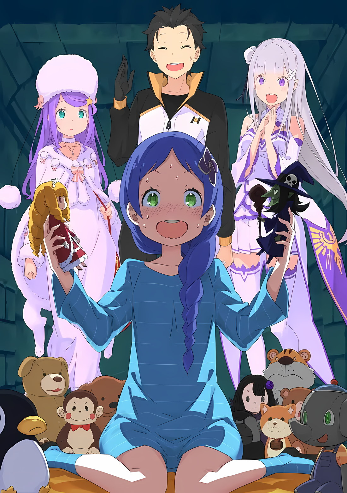

Фредерика: Как прошел ваш разговор с Розвалем-сама?

Субару: Можно сказать, что все прошло так же нормально, как и всегда, и что он раздражал меня больше, чем обычно. Посочувствуй мне немного.

Фредерика: Я просто скажу тебе «понятно».

Группа Субару покинула гостиную, и Фредерика повела их в восточное крыло особняка.

Эта страшноватая горничная с красивыми, длинными светлыми волосами, в своем вежливо ношенном наряде горничной, вежливо──наконец-то обменялась приветствиями с Анастасией и Юлиусом как одна из честных горничных особняка, и заговорила с Субару, который ходил с унынием.

Фредерика: Был ли Гааф-тян полезен в вашем путешествии и в городе? Чтобы он получил тяжелую травму до такой степени, что не смог вернуться, даже когда я дала ему конкретные инструкции…Я беспокоюсь о том, что он причинил неприятности Госпоже Эмилии и остальным.

Эмилия: Нет, не беспокойся об этом. В конце концов, мы заставляли Гарфиэля работать действи-и-ительно тяжело. Он сейчас отдыхает вместе с Отто-куном, не причиняя никаких неприятностей…ну, я не так уверена насчет того, что никаких проблем нет. Я надеюсь, что это так, но в любом случае мы попросили их просто отдохнуть.

Фредерика: Приношу свои извинения за то, что мой глупый младший брат доставил вам неприятности.

Эмилия впала в полусомневающееся состояния не закончив свои объяснения, в то время как Фредерика принесла свои извинения.

Как бы то ни было, Гарфиэль был человеком, который беспокоил Петру, Рам, Розваля и Фредерику своим поведением, но его менталитет так или иначе изменился во время инцидента в Пристелле. Если бы вам пришлось описать это, вы могли бы сказать, что он повзрослел. Да, он определенно повзрослел.

Сила Гарфиэля проявилась уже в 15-летнем возрасте.

Он все еще был далек от того, чтобы похвастаться своей силой как сильнейший, если принять во внимание битву с «Охотницей за потрохами» и битву с "Восьми Руким”. Но даже тогда у него определенно был уровень силы, который соперничал не только с лагерем Эмилии, но и с сильнейшими всего континента.

Самой большой проблемой была, вероятно, его незрелая психика. Если бы он мог контролировать свою умственную слабость, то поднялся бы на следующую ступень.

Просто, ну…это тоже было чем-то, что не следовало торопить. Это потому что неуклонно и уверенно становясь сильнее, чтобы твердо шагнуть по лестнице на следующую ступеньку, было подходящим способом созревания для 15-летнего парня.

Также― Субару: Есть еще одна причина, по которой он не вернулся сразу в этот раз.

Эмилия: Ты говоришь о Мими?

Субару: О ней тоже, но…

Эмилия вмешалась в разговор, и Субару криво улыбнулся ей в ответ.

Даже Эмилия, которая была плохо осведомлена о любви в отношениях, казалось, в какой-то степени интересовалась любовными делами других людей. Ее очень интересовали отношения Гарфиэля и Мими.

Конечно, Гарфиэль также рисковал своей жизнью и защищал себя, что, вероятно, вызвало у Мими чувства к нему, поскольку она ясно выражала свою привязанность как до, так и после битвы.

Откровенно говоря, нет такого мужчины, который не содрогнулся бы от любви девушки, которую он не ненавидит. Субару так же не был исключением.

Субару ничего не мог сказать об этом феномене, учитывая, что он был одним из тех, кто испытывал его раньше.

Он хотел проследить за изменениями, которые произойдут с этого момента, учитывая то, как Гарфиэль любил Рам и неуверенность в том, как он реагирует на чувства Мими.

Но это было совсем другим делом. У Гарфиэля осталось другое дело в Пристелле.

Фредерика: ──Субару-сама? Ты хочешь меня о чем-то спросить?

Субару: Нет, ничего особенного. С моей стороны было бы неправильно говорить об этом.

Он посмотрел на Фредерику глубокомысленным взглядом, и она спросила, что это значит.

Он думал об истинных чувствах Гарфиэля, скрывая ее сомнения. В Пристелле, семья, о которой беспокоился Гарфиэль——это была семья, у которой были золотые волосы и зеленые глаза, которые были чертами, которые напомнили бы о Фредерике и Гарфиэле, которые были братом и сестрой.

Отношения Гарфиэля с ними были похожи на его отношения с Фредерикой.

Конечно, Гарфиэль хотел гордиться этим и хотел сообщить об этом своей семье, Фредерике и Рюдзу. (imy: одна из Льюис вроде как.) Субару: Так что я ничего не скажу. Нацуки Субару оставит все как есть в ультра-крутом виде.

Эмилия: О, кстати о Гарфиэле, некоторые действи-иительно дружелюбные дети были в Пристелле. насчет тех детей…

Субару: Эмилия-тан Эмилия-тан, ты заставишь мой монолог пойти прахом!

Его объяснение почти превратилось в пустую трату времени, поэтому Субару остановил Эмилию.

Синергия была бы страшной, если бы он оставил все как есть, поэтому он решил, что найдет время, чтобы должным образом объяснить суть обстановки позже.

Субару с вымученной улыбкой помахал рукой Фредерике, лицо которой становилось все более и более озадаченным.

Фредерика: Извините, что прерываю вас, ребята, пока вы счастливо подогреваете свою близость, но куда вы направляетесь?

Субару: О, это место называется «Комнатой заключения». Человек, о котором мы говорили раньше, здесь.

Юлиус: Хм, обычный человек, хах. —Интересно, хорошо ли пойдет разговор?

Субару: Это то, что не было сделано раньше, так что я не знаю. В любом случае, я хотя бы попробую спросить, чтобы убедиться.

Юлиус ответил на объяснение Субару, погрузившись в глубокую задумчивость со сложным лицом, пока следовал за ним сзади.

На самом деле Субару также знал о количестве проблем, связанных с этим предложением. Однако если все пойдет хорошо, то они смогут значительно снизить риск своего путешествия.

Эмилия: Кроме того, эта девочка относительно знакома с Субару, так что разве это не должно быть прекрасно?

Субару: Эта девочка больше знакома с Гарфиэлем, чем со мной. Не думай, что я могу быть доволен ее кошачьей стороной.

Субару отреагировал на оптимизм Эмилии такой же кривой улыбкой, а затем Фредерика остановилась.

Субару и Эмилия тоже остановились, и тогда они явно вошли в другой уровень атмосферы в этом особняке.

Это был настоящий особняк Розваля, который устроен так, чтобы ничем не отличаться от прежнего особняка.

Однако подвальная часть восточного крыла──это было единственное место, которое имело явное отличие от предыдущего особняка.

В центре особняка находилось главное центральное крыло, в котором были сосредоточены удобства, необходимые для повседневной жизни.

В западном крыле располагались многофункциональные удобства, такие как комнаты для прислуги и гостей. А еще было восточное крыло, где хранилась история семейного наследства Мейзеров──место, которое служило хранилищем / сейфом, где хранились такие вещи, как книги.

Единственное место, которое отличалось в восточном крыле, было подвалом. У холодной каменной комнаты подвала благородного особняка была ясная цель.

Анастасия: Довольно неприятная атмосфера витает в этом месте, хах.

Анастасия фыркнула носом, а потом откровенно прокомментировала перемену в атмосфере.

В ее взгляде на атмосферу не было никакого отрицания, так что это была действительно четкая оценка, с которой все согласились. Атмосфера, царившая на этом уровне особняка, не могла быть описана никак иначе, как атмосфера, которая испускала «неприятное чувство».

Анастасия: Это все еще кажется другим, чем миазмы, но это, конечно, не дает хорошего ощущения телу.

Юлиус: Помимо вопроса о структуре здания──прежде всего, цель этого помещения… ну, это не имеет никакого отношения к этому, но я действительно верю, что эта структура позволяет кому-то в конечном счете быть скрытым внутри него.

Анастасия и Юлиус смотрели вниз на непрерывную лестницу, которая вела вниз в подвал особняка, наполненного темнотой, когда они обменивались этими словами.

Они уже говорили о «Комнате Заключения». Эти двое начали думать о почти бесконечных ответах, стоящих за смыслом помещения,которое находилось в подвале.

Фредерика: Ну что ж. Теперь я буду направлять вас всех. Пожалуйста, будьте осторожны, чтобы не споткнуться.

Фредерика произнесла эти слова и повела их вниз по лестнице. Субару и остальные последовали за этой высокой женщиной сзади, когда они спустились в подвал. Лицо Юлиуса также говорило о том, что он готовился к тому, что его ждет впереди.

Их шаги, сделанные во время ходьбы по каменной лестнице, очень отчетливо раздавались по всему пространству, в котором они находились. Холодный ветерок дул из подвала, заставляя его челку слегка дрожать, что до непостижимой степени действовало ему на нервы.

Фредерика: Я собираюсь открыть её.

Когда они спустились в подвал, их преградила железная дверь прямо перед ними. На двери было множество крепких замков. Фредерика открыла несколько из них один за другим.

Ключ от двери издавал звук, замки открывались, и затем дверь открылась со скрипом. За дверью расстилалась каменная дорожка, и они снова увидели другую дверь глубоко внутри этого места.

Фредерика: Человек, которого вы ищете, находится за этой дверью.

Когда она отступила в сторону двери, она освободила путь для них, чтобы войти, и затем поклонилась. Они сделали одобрительный жест подбородками в ответ на ее поклон, и четверо людей направлились прямо к двери, чтобы вести Субару. ──На двери в самой глубокой части подвала не было замка.

Он потянулся к дверной ручке. Если бы он толкнул ее, то, возможно, смог бы заглянуть внутрь.

Когда Субару нервно коснулся двери, ему стало трудно дышать, и он оглянулся. «―――—» Эмилия, Юлиус и Анастасия уставились на замершего Субару. Они кивнули Субару, и он сделал глубокий вдох.

Затем он вложил силу в свою руку, которая сжимала ручку.

Она издает какой-то звук, затем он толкает дверь, и… ???: Арррр, ррр, Яяя собираааюсь тебяяя съееесть! ???: Кьйааа. Помогите мне. Нееет. ???: гохихихихи. Никто не придет и не спасет тебя, даже если ты будешь так звать на помощь.

Дверь открывалась. Прекрасный голос можно было услышать, пока путь купался в свете.

По другую сторону открытой двери в комнате было видно одинокую девочку. Вокруг нее было расставлено множество кукол. Ее спина была обращена к остальным, в то время как она продолжала играть с куклами, используя обе руки.

Она перешла на имитирующий голос, хотя они не знали, что именно она имитирует. Тем не менее, он казался довольным. ???: Нет, они уже идут. Потому что они устроены так, чтобы приходить в трудную минуту……хмм?

Эта девочка, которая встала, вдруг что-то заметила, пока держала в руках своих маленьких кукол. Она робко оглянулась, увидев, что Субару и остальные ошеломленно стояли у входа, а затем раскрыла свои круглые, большие глаза.

У нее были заплетенные в косу светло-каштановые волосы и простые, но милые черты лица. (imy: ошибка англ. переводчика? они же у неё какие-то фиолетовые+- ) Субару: Йо. Как поживаешь?

Субару произнес эти слова и поднял руку, как будто ничего не произошло. ???: Б-братец, ты идиот! По крайней мере, стучи, прежде чем входииить!

И конечно же, она накричала на него, желая, чтобы он был в предыдущей сцене.

Субару: Так что да, это заключенный этого особняка.

Она будет слушать то, что мы говорим, как советник по отношению к Магверям*. (imy: Магические Звери/Демонические Звери) Мейли: Они грязныее. Брат причинил им боль…… сопение…

Когда Субару представил растроеную девочку, которая сидела на корточках в углу комнаты, окруженная мягкими игрушками——когда он представил Мейли, Юлиус покачал головой, и приложил палец ко лбу.

Видя девочку краем глаза, он заговорил так, словно обвинял увлекшегося Субару, Юлиус: Это было немного неуклюже с моей стороны, что я не получил больше информации об этом заранее……но бедность твоего характера проявляется.

Если ты не прекратишь так себя вести, то я буду очень недоволен.

Субару: Я не думаю, что веду себя так уж плохо, хотя……или, ладно, я согласен, что это было плохо.

Кроме того, она действительно была кем-то опасным раньше, понимаешь?

Субару дал объяснение этими словами, что заставило Юлиуса засомневаться. Эмилия и Анастасия выстроились в ряд чтобы поговорить с Мейли, проигнорировав Субару и Юлиуса.

Эмилия: Прости, Мейли. Позже мы будем ругать Субару за это, так что не волнуйся.

Анастасия: Боже, какая милая девочка, не правда ли?

Беатрис-тян, Петра-тян…не слишком ли это похоже на вкусы Нацуки-Куна?

Субару: Это нелепое мнение обо мне. Не могла бы ты сказать что-нибудь более подходящее!? Я думал собрать людей, а не конкретно лолей!

Внезапно в его прозвище “Лолимансер" появилось какое-то чувство реальности, поэтому он хотел, чтобы она не говорила пугающих вещей.

Оставив это в стороне, Мейли тоже не слушала Эмилию и ее слова, так как была совершенно зла. В этом смысле у людей с детской чувствительностью наблюдается дисбаланс.

Субару: Мейли Мейли: Не слышу тебяя.

Субару: Мейли, ну давай.

Мейли: Мне всеее равно.

Такова была ситуация. Она была помехой, которая вошла в режим “я тебя не слышу".

Таким образом, Субару быстро решил использовать последний способ. Субару потянулся себе за спину, и он показал Мейли свой туз в рукаве.

Субару: Смотри, Мейли. Это подарок. Возьми это. Это новая мягкая игрушка — Дарепанда.

Мейли: ——! Вау! Она милая!

То, что Субару показал Мейли, было мягкой игрушкой, которую он сделал в драконьей повозке на обратном пути из Пристеллы.

Как человек, который улучшил свои навыки в области домашней помощи за прошедший год, навыки шитья Нацуки Субару стали вдвое лучше, чем раньше. Он мог делать мягкие игрушки,а если бы захотел, то, возможно, даже шить одежду для женщин.

В любом случае, мягкая игрушка была новаторской работой, которая включала в себя тему панд, «ленивые из-за жары». Ему казалось, что он уже видел что-то подобное раньше, но это пересекало миры, и это не было бы большой проблемой, поэтому он проигнорировал это.

Он показал новую работу, в которой было то-то и то-то, и Мэйли приняла ее с сияющими глазами.

Мэйли: Милая! Это новое животное! Интересно, как я должна назвать его……ладно, я придумала! Я назову его Большой Пандой!

Субару: Ты назвала его так, как его зовут в буквальном смысле.

Если отбросить в сторону её желание именования, она была чрезвычайно искусна в понимании сути вещей.

Когда она с любовью обняла плюшевую панду, то посмотрела на Субару и остальных с выражением лица, которое свидетельствовало о том, что ее настроение улучшилось.

Мейли: Кстати, с возвращением Братец и Сестра.

Похоже, вы, ребята, приехали из довольно далекого места, хах. Петра была одинока, понимаешь?

Субару: В конце концов, нас не было целый месяц. И мы снова уезжаем немного далеко, так что я действительно не хочу думать о том, как это, вероятно, разозлит Петру, но……

Мейли: Петра-тян все-таки любит Братца. ……Хм?

Новички?

Мейли расставила разбросанные плюшевые игрушки по полкам, а потом вдруг сделала понимающее лицо на Юлиуса и Анастасию. Юлиус удивился такой перемене в ее настроении, но Анастасия просто кивнула с невозмутимым видом.

Анастасия: По сравнению с Мими, кажется, это только начало того, что она может показать.

Юлиус: …Теперь, когда вы сказали это, я согласен.

Давайте поблагодарим Мими.

Госпожа и слуга показазали странную сцену согласия, и после этого Юлиус внезапно осмотрел комнату. Он бросил быстрый взгляд на подвальную комнату и сказал, Юлиус: Тем не менее, я предполагал, что здесь будет суровая среда после того, как услышал, что это комната заключения……но вопреки моим ожиданиям, она кажется мирным местом для проведения времени.

Эмилия: Человек здесь — девочка. Не то чтобы они хотели ее мучить. ……Но, она так же не может выйти на улицу, так что все очень сложно.

Эмилия вяло опустила брови.

Как она и сказала, ”Комната заключения"—— откровенно говоря, обстоятельства жилой комнаты Мейли, в которой она была заключена, вызывали очень снисходительное чувство.

Она действительно казалась холодной именно из-за каменной дорожки, но в комнате этой девочки, которая находилась в самой глубокой части особняка, были красочные обои и ковер, так что она могла делать все, что хотела, с тем, что её не сдерживало. На полках стояли бесчисленные мягкие игрушки сделанные Субару, а также множество книг и других игрушек.

Казалось, что ей дают еду, и не было никаких проблем с тем, чтобы помыться или сходит в туалет. Короче говоря, это было место, где хикикомори мог жить в мире. Она была настолько удобна, что даже Субару захотелось оказаться в ней взаперти.

Однако―― Субару: Кажется, здесь особый воздух, похожий на миазмы, протекающие бесконечно.

Анастасия: Это похоже тоже этой девочки……верно?

В ответ на взгляд Анастасии и остальных, Мейли кивнула с улыбкой на лице.

У нее была честная улыбка, но что-то исходило от этой девочки, что было настолько ужасно и отвратительно, что это невозможно было скрыть. Это была главная причина, по которой Мейли была заключена здесь и не была освобождена.

Субару: Я действительно говорил об этом раньше, когда мы были в драконьей повозке, но эта девочка на самом деле пыталась убить таких людей, как Эмилию и других раньше…Уммм, что ж, она как профессиональный убийца. Наверное, можно сказать и так, верно?

Юлиус: Я чувствую, что это уже неправильно, но, пожалуйста, продолжай.

Субару: Такое чувство, что ты что-то подразумеваешь под тем, как ты это сказал……в любом случае, она профессиональный убийца. Итак, что касается того, что Мейли может сделать со своим маленьким телом, короче говоря, это манипулировать Магверями. Она «Повелительница Магверей».

Мейли: Ага, я очень сильно дружу с плохими животными.

Мейли сказала это с «Кхем», когда она надулась от гордости, но все равно, эти детали были слишком шокирующими.

Магвери были слишком опасны для человечества и никогда не были дружелюбны с людьми в первую очередь. Казалось, что было одно исключение, когда можно было договориться, чтобы он повиновался человеку: это сломать рог Магверя, но── Субару: В случае с Мейли, существование рога не имеет значения, хотя теория слаба, и даже если я объясню ее, вы не поймете.

Мейли: По словам моей мамы, у меня та же роль, что и у «рога» Магверя. Так что-о-о, я могу дружить с Магверями.

Исполнять роль рога Магверя──смысл этого был неясен.

Тем не менее, казалось, что никогда не проводилось никаких исследований по поводу Магверей. Конечно, существовала вероятность, что есть люди, которые зарабатывают себе на жизнь охотой на Магверей, но даже если они знали информацию об их чертах, они не рассматривали их с исследовательской точки зрения.

Эмилия: Сначала Мейли напала на нас с еще одним человеком. Гарфиэль напал на того человека, и эта девочка была поймана. С тех пор эту девочку всегда держат в особняке.

Анастасия: Почему они так много сделали? Неважно, что вы говорите, если она была врагом, мы должны быстро разобраться с……или не совсем, так как не похоже, что с этим ребенком нужно справлятся.

Эмилия: ……Мы никак не можем убить ее. Но в то же время мы не можем отпустить ее. Потому что эта девочка говорит, что если ее отпустят…

Мейли: Мама рассердится на меня. Эльза умерла, а я потерпела неудачу, так что она определенно убьет меня, если найдет. Так что оставаться здесь — самый безопасный вариант.

Мейли ответила спокойным тоном, но казалось, что она что-то скрывает в своем выражении лица.

Мейли потеряла Эльзу, с которой работала, и она провалила свою работу. Их опекуны, скорее всего, были кем-то вроде профессиональных менеджеров-убийц, и их неудачи определенно никогда не будут прощены.

Она будет изгнана и получит наказание──это, конечно, будет ее страдания из-за последствий, хотя Субару и другие не имели к этому никакого отношения.

Субару: Это тоже самое, что видеть плохие сны. В конце концов.

Юлиус: Это не первый раз, когда вы с Эмилией обсуждаете эту идею. Как бы вы на это ни смотрели, для нас было бы абсурдно говорить вещи, которые были не более чем бессмыслицей. ……Кстати, а кто ее мать?

Субару: Я не знаю. Любое другое имя, кроме “Мама”, неизвестно. Судя по тому, что сказала Мейли, мы даже не знаем, как выглядит ее лицо. Что это за семья такая?

Но, учитывая этот бизнес, возможно, что этому мрачному образу жизни нельзя помочь. Они догадывались, какой была эта мать, основываясь на том, что сказала Мейли, и казалось, что будет трудно избавиться от её беспокойства о будущем.

Субару: Этот ублюдок Розваль был также бесполезен после смерти Эльзы, так как не было никого, кто мог бы стать посредником.

Юлиус: Ты что-то сказал?

Субару: Просто разговариваю сам с собой.

В первый же день, когда Субару призвали, инцидент с эмблемой был вызван Розвалем.

Конечно, поскольку Эльза пыталась убить Эмилию по его приказу, если учесть ход событий, когда был сделан заказ, то сделать такой вывод было бы несложно.

Однако посредник этой временной линии каким-то образом умер, и, похоже, они не смогли установить контакт. Если верить словам Розваля, нападения Эльзы и Мейли после этого не были связаны с его намерениями──именно тогда мать стала предметом беспокойства.

Субару: Во всяком случае, так обстоят дела с Мейли.

Эта девочка здесь по необходимости. Это не для того, чтобы испортить ее.

Мейли: Учитывая это, Субару и все остальные ведут себя слишком мило.

Субару: Что касается этого, то это всего лишь хорошая часть твоих мечт!

Потому что, в конце концов, было больно видеть эту маленькую, юную девочку, запертую в холодном подвале. Это было не то, что вы могли просто решить забыть, и если вы попытаетесь игнорировать это, вам будут сниться плохие сны.

Так что не похоже, чтобы он имел на нее зуб, и поэтому ему было лучше быть с ней в хорошем настроении.

Анастасия: ……Разве обычно ты не держал на нее зла?

Субару: ……Должен ли я?

Анастасия: Я имею в виду, разве ты не говорил, что она пыталась убить тебя? Если так, то…

Субару: Ну, я имею в виду, что особой злости нету, хотя преступление есть преступление, независимо от возраста.

В ответ на вопрос Анастасии Субару задумался, почесав щеку. Как только он взглянул на Мейли сбоку, то увидел, что она смотрит на Субару с нечитаемыми эмоциями в глазах.

На самом деле он не беспокоился о ней, но честно высказал свои мысли.

Субару: Если кто-то приказывает человеку без суждения совершить преступление, то виновен должен быть тот, кто отдал приказ. Тем более, если это ребенок. У них есть голова, чтобы думать, но даже так, есть еще условия, которые идут с этим. Это не что иное, как минус к кодексу Хаммурапи “око за око”.

Анастасия: Это была какая-то пустая болтовня. Тогда ты думаешь, что люди, которых убила эта девочка, поймут это именно так?

Субару: Я так не думаю. Они вольны желать отомстить Мейли. Что касается меня, то если бы я умер, то даже я не думаю, что стал бы выражать свое прощение так, как сейчас.

В конце концов, мнение Субару и мысли об этом были основаны на том, как она встретит его.

Если ему скажут что-то вроде того, что его ключевой вопрос не был решен, или что он был захвачен своими эмоциями, то так тому и быть. Собственно, так оно и было.

Субару: Когда я был ребенком, я брал на себя ответственность, с которой не мог справиться сам, за родителей и взрослых. Так что, дети рядом со мной, или, ну, я думал, если дети, с которыми я мог бы подружиться, не могут взять на себя ответственность, как насчет того, чтобы я взял её вместо них? Вот и все.

Анастасия: …Это было ценное мнение. Спасибо.

Анастасия завершила слова Субару, так как она потеряла интерес на полпути.

Конечно, он чувствовал, что это была типичная реакция, поэтому его чувства не были задеты. Если его ненавистное суждение о преступлениях было организовано таким образом, что его можно было уважать, то преступление было бы признано неправильным, независимо от возраста.

Это было отложено из-за снисходительности лагеря.

Субару не испытывал неприязни к этой атмосфере и окружению.

Эмилия: Я…

Субару: ──Хм?

Эмилия: Я думаю, то, что ты говоришь, имеет смысл.

Субару: …Спасибо.

Он не ожидал полностью положительной реакции, но был спасен от этих слов.

А потом он переключился на Мейли, которую несколько забросили, хотя это был разговор о ней. Субару посмотрел ей в глаза и сказал: Субару: Мне нужно поговорить о том, В чем мне нужна твоя помощь. Не против пойти со мной?

Мейли: …Океей. Я пойду с Братцем.

Субару произнёс эту просьбу, и Мейли спокойно кивнула ему.

Субару никому не сказал о том, что ему показалось, будто он увидел легкие слезы, исходящие от девочки, которая спрятала лицо в объятиях панды.

Мейли: Я была в Песчаных Дюнах Аугрии только дважды.

Субару и другие объяснения закончились, и Мэйли сказала эти слова, играя со своими заплетенными волосами.

Она закрыла глаза, словно что-то вспоминала, и сказала: Мейли: Я приехала, чтобы пополнить количество Магверей. Там было много Магверей, так что был достигнут большой прогресс, но…

Субару: Но?

Мэйли: Вы действительно собираетесь туда идти?

Любой другой, кроме меня, вероятно, умрет, вы вкурсе…?

Казалось, что их поступки отражались как безрассудство в глазах этой девочки, которой не хватало моральной интерпретации. Мнение лидера Магверей имело вес в отношении того, насколько они были опасными.

Субару: Я действительно хочу использовать твой опыт в качестве ссылки, но твое мнение уже имеет резкий аргумент с тем, как ты говоришь, что мы умрем, если пойдем, так что уже слишком поздно для этого. Кроме того, если это просто пустынный лабиринт, то у нас есть способ, как вырваться из него.

Анастасия: Да, это я.

Анастасия помахала рукой, подчеркивая что вести их будет она.

Однако, просто пытаясь не заблудиться на пути в этом покорении пустыни, для того добраться до сторожевой башни, дали 30 очков──это была отметка, обозначающая неизбежную неудачу. Или, скорее, до тех пор, пока они не смогут найти ответ, как получить идеальный балл, им, вероятно, будет трудно выбраться живыми.

Тремя проблемами были “Песчаный Лабиринт”, “Логово Магверей” и “Око Мудреца”. “Песчаным Лабиринтом« займётся Анастасия, являющаяся Эридной, а что касается проблемы с “Логовом Магверей», то это то, к чему они хотели подготовиться.

Вот почему он хотел услышать подробности от Мейли, но―― Субару: Как бы это сказать… ты не знаешь, как избежать встречи с Магверями? Или наоборот, способы их заманить?

Мейли: Если ты побежишь один, то они обязательно сразу набросятся на тебя сразу все-е-е, понимаешь, братец?

Субару: Я уже делал это несколько раз, и это был довольно болезненный опыт.

Один раз это случилось год назад с китом на равнинах, а другой — чуть позже в особняке. Он чувствовал, что не хочет делать это ещё раз.

Конечно, он не отказался бы сделать это, если бы не было других мер, но он хотел избежать того, чтобы быть единственным, кто остался бы в середине пустыни, если это возможно.

Мэйли: Если братец не хочет этого делать, тогда, может быть, ты сможешь подготовить к этому других людей.

Все-е-е Магвери прыгают на живых существ вместо нормальной пищи, так что, что-то в этом роде.

Эмилия: Определенно нет! Я против этого! Я против этого!

Субару: Ты не должна так отчаянно возражать. Никто не будет выбран, так что все в порядке.

Тем не менее, казалось, что никаких полезных предложений не возникало.

Или, по крайней мере, в отношении Магверей; до тех пор, пока Мейли не придумает какой-нибудь эффективный план, как кто-то, кто лучший в обращении с ними, чем кто-либо другой, они были беспомощны.

Субару: Ага, думаю, нам придется победить Магверей, которые приходят к нам один за другим. Не ждите многого от Эмилии-тан или Юлиуса.

Юлиус: Я хочу знать твою собственную оценку, учитывая, что ты не включил себя туда……но ты говоришь, что мы можем это сделать?

Юлиус отреагировал на предложение Субару, спрашивая Мейли о его целесообразности. Услышав его, Мейли посмотрела на Эмилию и Юлиуса.

Мейли: Наверное, нет. Может ли Братец и другие использовать магию около недели без отдыха?

Субару: Ты хочешь, чтобы у нас было что-то вроде битвы на истощение!?

Эмилия: Я-я попробую…?

Субару: Тебе не нужно! Это просто поток неразумного разговора! Волосы и кожа Эмилии-тан высохнут, так что давай не будем! Ладно, отказано!

Казалось, что план прорыва силой уже имел некоторые неразумные детали.

На самом деле Мейли не знала, насколько серьезна была эта сцена, но если она не преувеличивала ее, как ребенок, то они никогда не поступят неразумно.

Субару: Как насчет того, чтобы размазать кровь Магверя по драконьей повозке и обмануть обоняние других Магверей?

Юлиус: Нет, земляному дракону их не одурачить, и есть вероятность, что они не соберутся вместе, как акулы.

Что-то вроде найма охранников… как насчет того, чтобы собрать большую армию для этого, как ты сделал с Белым Китом?

Субару: Это так же невозможно. Это уже делали люди, бросававшие вызов Сторожевой Башне Плеяд. Хотя она и не была такой большой, как армия, все же это была большая группа, которая бросила ей вызов. Ты можешь догадаться о результате. Как насчет того, чтобы сломать Рог мощного Магверя и использовать его как препятствие для других Магверей?

Юлиус: Если он не будет столь же подавляющим, как кит, тогда мы будем захвачены их числом. Было бы неплохо, если бы это было просто, и у нас было бы чтото вроде спрея от насекомых, чтобы избежать их.

Запах Субару──или, скорее, запах посланный ведьмой, был спреем, который наоборот привлекал, так что он был бесполезен.

Розваль был тем, кто постоянно управлял барьером, который защищал деревню Алам от Магверей. Если бы для людей вокруг него были бы созданы барьеры, и каждый из них использовал бы их для перемещения──казалось, что-то подобное сделать было бы невозможно.

Субару: Может быть, нам стоит, чтобы Розваль держал нас, и мы все атаковали бы с неба.

Юлиус: Если бы мы могли проскользнуть мимо Ока Мудреца, тогда, возможно, это был бы вариант.

Субару: Ахх, черт, точно. Мы также должны рассмотреть Мудреца.

Его нереалистическая точка зрения была опровергнута реалистической.

Даже если им удастся избежать встречи с Магверями и Пустыней, все равно придется беспокоиться о Мудреце.

Просто из-за того, что никто никогда не мог проскользнуть мимо этого человека, это было действительно единственное, с чем они не знали, как справиться.

Субару: Если бы мы могли сузить все хотя бы до двух проблем……

Мейли: ──Блииин, похоже, у меня нет выбора.

Субару: О?

Субару и все остальные сидели в кругу в комнате, испытывая головную боль от мыслей о том, что делать, и тогда, наконец, Мейли сказала эти слова. Она встала и качнула своей маленькой головкой на Субару и других, которые сидели, и сказала: Мейли: Я могу пойти с вами, ребята. Если я буду там, Магверям будет все равно, что вы будете делать. Вы будете свободны держаться от них подальше, делать их домашними животными, заставлять их убивать друг друга или заставить их съесть того мудрого человека.

Субару: Мы не будем делать вторую половину! В любом случае…

Он широко раскрыл глаза, услышав это довольно резкое замечание, но это предложение удивило его еще больше.

Он был удивлен, что Мейли высказала мнение, которое, как он думал, она никогда не скажет. Это означало, что она была готова к сотрудничеству, но еще больше его удивило то, что это означало, что она была в готова к выходу на улицу.

Субару: Тебе не страшно выходить на улицу? С тобой все будет в порядке?

Мейли: Это не значит, что Мама найдет меня, когда я выйду из особняка, понимаешь? Я боюсь, что меня найдут, но я не могу оставаться здесь всю свою жизнь.

Он был удивлен тем, что Мейли знала, что она должна была выйти в конце концов.

Но, возможно, это было естественно. Он продолжал находить время, чтобы посмотреть, как поживает девочка, но даже тогда было гораздо больше случаев, когда эта девочка была заперта в своей комнате одна. У нее наверняка было так много времени, чтобы подумать, что тишина станет пугающей.

Быть запертой в своей комнате в одиночестве было одновременно и успокаивающим, и пугающим.

И даже если эти ощущения когда-нибудь парализуют ее, ее сердце внезапно замучается.

Эмилия: Субару…

И когда Субару почувствовал необычную симпатию к сердцу Мейли, Эмилия мягко потянула его за рукав.

Субару знал, о чем она думает, и тоже был с этим согласен.

Субару: Мы идём туда не для развлечения. У нас есть проводник, но мы будем пересекать пустыню. И хотя у нас есть ты, мы должны пройти через логово Магверей.

И что еще хуже, Мудрец так же может нас увидеть.

Мейли: Разве не приятно прогуляться после некоторого времени?

Мэйли сказала эти слова Субару, продолжая быть сильной. Он не знал, насколько это был блеф, и насколько она говорила правду, но―― Эмилия: Она — козырная карта против Магверей, верно?

Субару: Ах, да, именно так. Мы рассчитываем на тебя, Мейли.

Мейли: Я буду стараться изо всех сил в любом случае.

Эмилия и Субару перегляделись, а затем кивнули Мейли. Девочка, которая приняла их слова, сказала это, как будто переоценивая себя, и крепко обнимала панду.

И это стало их первым шагом вперед к завершению их путешествия, поэтому Юлиус сложил руки на груди и произнес несколько коротких слов с выражением восхищения на лице, когда убедился в результате.

Юлиус: Я действительно не хочу этого говорить, но убеждать маленьких девочек действительно одна из твоих сильных сторон. ……Хотя, я не думаю, что это действительно хороший способ стать известным.

Субару: Это потому, что вы, ребята, постоянно обращаетесь со мной как с Лолимансером! Что касается того, что она маленькая девочка, то я хочу, чтобы вы знали, что Мэйли не так мала, как маленькая девочка, понятно!?

Субару в отчаянии указывал на вход в комнату в ответ на бесполезные слова Юлиуса. Как раз в тот момент, когда он это сделал, человеком, который появился по другую сторону двери, был…

Беатрис: ──Я думала о том, почему было так шумно, только чтобы узнать, что это просто снова Субару шумит, я полагаю.

Она закончила свой личный разговор с Розвалом и присоединилась к ним. Похоже, у нее была еще одна ссора, но ее отложили в сторону, как нечто не заслуживающее упоминания, и она попыталась прервать их для начала.

