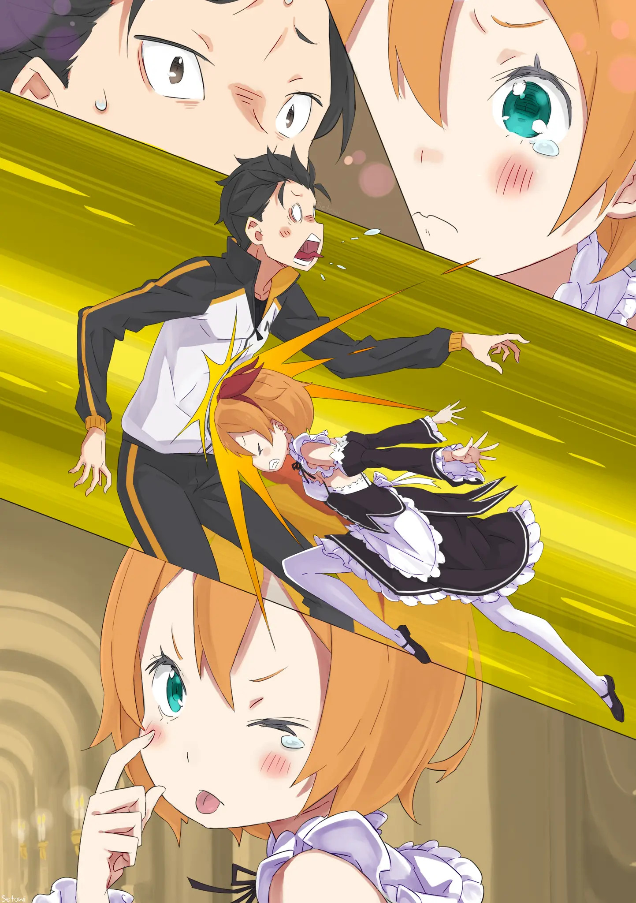

Покорение смертоносных Песчаных Дюн Аугрии, чтобы добраться до Сторожевой Башни Плеяд.

Повелительница Магверей Мейли присоединилась к группе Субару в качестве члена, что повысит их уверенность в побеге из песчаного лабиринта──лабиринта, содержащего огромное количество Магверей.

Они решили взять ее с собой. Однако эта девочка продолжала оставаться единственным человеком, проживающим в комнате заключения особняка в течении целого целого года, потому что она помогала Розвалю. Субару знал, что, естественно, будут споры по поводу освобождения Мейли, учитывая, что было событие, когда она напала на особняк вместе с коварной “Охотницей за Потрохами", но—— Мейли: В этом нет ни-и-ичего плохого, верно? Если будут другие люди, кроме Эмилии-сама и Субару-куна, тогда не должно быть особых проблем с моим уходом, верно? Даже если мое суждение было неточным и у нее оказались плохие намерения, вы, ребята, те, на кого она нацелилась, вы-ы-ы знаете.

Розваль ранее легко разрешил Мейли уйти. Специфика его ответа была такова, что вы не могли не признать, что его слова действительно звучали так, как он обычно говорит. Но в любом случае, она получила его разрешение. Таким образом, Мейли удалось благополучно освободиться из заточения, в котором она находилась целый год.

Мейли: Мм~! Как я и думала, атмосфера снаружи действи-и-ительно другая. Находясь в той тесной комнате так долго-о-о, мне было трудно дышать.

Субару: Но все же, он пытался сделать много разных вещей, чтобы заставить тебя чувствовать себя иначе, хах. Все было не так плохо, как ты говоришь, понимаешь?

Мейли: Пра-а-авда? Я ценю твое внимание, но возможность свободно двигаться вместе со своим телом

— это соверше-е-енно другое чувство. Братец, если ты не научишься ценить мелочи, тебя возненавидят сестра и сестрёнка задолго до того, как ты это поймешь.

Мейли надула губы, держа в руках множество мягких игрушек. Кстати, под «сестрой» она имела в виду Эмилию, а под «сестрёнкой» Беатрис. Петру она называла «Петра-тян”, Гарфиэля “Клыкастым братцем”, а Отто “слабым человеком».

Мейли: Можно мне отдохнуть в этой комнате?

Субару: Судя по тому, что мне сказали, проблем быть не должно. Кто-то пришел, чтобы убрать это место, несмотря на то, что это комната, которая используется не очень часто. Так что ты не должна чувствовать себя неловко из-за того, что она грязная или что-то в этом роде. Фредерика должна была прийти, чтобы убрать комнату как раз в то время, когда мы вынесли наш багаж, как-то так.

Мейли:…Окей.

Это место находилось в западном крыле особняка Розваля. Эта комната, которую Мейли продолжала с любопытством осматривать, была расположена в углу зоны для прислуги.

Мейли старательно пыталась прочувствовать, каково это быть свободной от заточения. Конечно, нужно было, чтобы кто-то наблюдал за особняком, чтобы им не пренебрегали. Но в чем именно заключалась ее роль?

Была ли она гостьей? Была ли она горничной? Ее роль была не так уж далека от роли гостьи, но было бы также несправедливо упустить ту ее часть, которая делала ее служанкой.

Таким образом, её можно было бы назвать рабочим помощником (?) особняка, поскольку было бы недостаточно назвать ее горничной, и было бы недостаточно назвать ее гостьей. Она будет заботиться только об этой комнате на этаже для прислуги, как если бы она представляла собой вторую половину её самой.

Она принесла все свои вещи, которые раньше хранились в ее комнате заключения, так что казалось, будто эта пустая ранее комната была окрашена в цвет.

Мейли: Даже если меня освободили вот так, я не знаю, как долго я здесь пробуду. Когда появится перспектива, которая будет выглядеть как возможность жить мирно, я немедленно уйду, в конце концов.

Субару: Ну, самое главное, чтобы ты не доставляла неприятностей. Так что, пока ты не приведешь меня к своей пугающей матери, ты можешь делать все, что захочешь. Ох, как только я позабочусь, что ты выполнила свою будущую задачу должным образом.

После этого ты сможешь делать все, что захочешь.

Мейли: Ты хочешь сказать, что когда я… обо всем позабочусь, я смогу умереть там, где захочу?

Субару: Почему я должен даже слышать о таких вещах?

Почему меня должно волновать, что кто-то где-то умирает? ……Вот что сказал бы циничный, претенциозный я из прошлого, но сейчас я не буду говорить ничего подобного.

После того, как Субару занёс все её вещи в комнату, он погладил Мэйли по голове, пока она стояла неподвижно у окна. Эта девочка с заплетенными в косу каштановыми волосами сверкнула глазами, пока Субару продолжал гладить ее по голове.

Субару: Я хочу, чтобы моя группа была готова честно рисковать своими жизнями, несмотря ни на что. Ты можешь сколько угодно делать всё что захочешь, но если ты собираешься это делать, то должна также следовать одной вещи, о которой говорилось в письме; то есть, ты должна просто наслаждаться этим временем так сильно, как только можешь.

В конце своего заявления он легонько погладил ее по голове, а затем убрал свою руку. Получив легкий шлепок по голове от руки, которая до этого гладила ее волосы, Мейли презрительно посмотрела на Субару.

Мейли: ……Братец, ты так победил Сестру и Петру-тян?

Го-о-осподи, даже постоянной осторожности с тобой недостаточно.

Субару: На самом деле это не входило в мои намерения, ты же знаешь.

После того, как Субару закончил помогать Мейли заносить ее личные вещи, он почесал голову и направился к выходу из комнаты. У него не было ни малейшего намерения помогать ей с перестановкой в комнате после того, как он закончит заносить ее вещи.

Вдобавок ко всему, у них так же были разные вкусы, поэтому он решил, что лучше всего будет уйти, прежде чем он сделает что-то ненужное, что могло бы вызвать у нее неприязнь к нему.

Мейли: Хорошо, я не буду отказываться от твоих слов.

Кроме того, тебе все равно скоро придется скоро расстаться с жизнью в Песчаных Дюнах Аугрии.

Субару: Мы не собираемся выбрасывать наши жизни; мы собираемся собрать наши жизни. И именно там мы будем очень сильно полагаться на твою силу, так что мы будем рассчитывать на тебя.

Мейли: Хорошо, хорошо.

Мейли помахала рукой взад-вперед, а затем вывела Субару из комнаты, держа его за руку. Она вытащила все свои вещи из коробки──с безразличным выражением лица, избегая желания бросить взгляд на Субару──и ее вещи начали формировать временную картину ее собственной комнаты. Как и сказала Мейли, эта комната заставляла ее чувствовать себя так, словно она не знала, как долго пробудет здесь и вернется ли вообще.

Мейли: Мне весело, аххх.

Эта девочка предавалась удовольствиям в своей собственной комнате, расхаживая по ней с безудержным энтузиазмом.

Субару был в состоянии частично видеть приятное зрелище живости этой девочки, что было живостью, которая проявлялась от того, что она была удовлетворена просто тем, что все ее любимые мягкие игрушки были расставлены по всей комнате. Это был тип живости, который напоминал, как реагировала бы любая другая девочка ее возраста, получив впервые свою собственную комнату.

С решением добавить Мейли в группу, участников «Захватывающего тура за ответами Мудреца» стало 7: Субару, Эмилия, Беатрис, и трое беспомощных──То есть, три человека, которыми были Юлиус, Анастасия и Мейли──и, наконец, единственная девушка, которую они, наконец, смогут вывести, Рем. Это был окончательный список, которому предстояло столкнуться с Песчаными Дюнами Аугрии, расположенными на самой восточной части мира.

Направление к Песчаным Дюнам Аугрии──это было место, которое находилось далеко в мире и было местом, которое было далеко от их группы──напоминало прямую линию, которая указывала прямо на восток от восточного особняка Розваля.

Однако этот путь был длиннее, чем путь, который нужно было бы пройти, чтобы дойти к Городу Водных Врат Пристелла; это займет около 20 дней только для поездки в один конец.

Другими словами, это путешествие займет в общей сложности 40 дней только для того, чтобы добраться туда и обратно. Они благополучно доберутся до Сторожевой Башни, и если они подумают о том, чтобы остаться там на пару дней, то продолжительность этой большой экспедиции вполне может превратиться в нечто вроде 2 месяцев вместо этих 40 дней. Проблема заключалась в том, что── Субару: Хей, Петра. Прости, что оставил тебя одну. Я заставлю тебя чувствовать себя лучше.

Петра: Не волнуйся~. Я не сержусь. Все нормально.

Субару-сама может отправиться в любое далекое и опасное место, как и всегда, верно?

Петра поддавалась жестокой депрессии, вызванной вынужденным пребыванием в Пристелле в течение месяца, что вскоре превратиться в ещё два месяца. Эта девочка порывисто расхаживала по особняку с холодным, ясным лицом, развивая свой наряд горничной──нарядом, который очень подходил ее миниатюрному телу. Что касается Субару, то он извинялся позади нее и старался придумать, что нужно было сказать, чтобы попытаться исправить ее настроение.

В любом случае, в то время как Субару безумно старался придумать как исправить настроение Петры, у девушек также было это общее предположение о парнях в отношении их настроения. Это общее предположение состояло в том, что во все времена и во всех местах, когда они становились недовольны, как Петра сейчас, как правило, это была вина парня.

На самом деле, Петра была девушкой с самой выдающейся женской силой в особняке. Она с гордостью демонстрирует эту девичью силу как представительница девочек. Единственными несчастными людьми в этом особняке, которые могли испортить ей настроение, были Субару, Розваль, Гарфиэль, Отто──Погодите-ка, разве это не много людей? И подождите…разве не все парни несчастливы, когда дело доходит до подобного? Пак также должен был принять эту жалкую силу людей, он должен был сделать это, чтобы осуществить свое возрождение. Это было за гранью жалости. Но в любом случае── Субару: Я знаю, что то, что мы оставляем тебя с Розвалем в особняке будет очень сильно напрягать тебя, так сильно, что тебе будет трудно дышать, но если ты просто подумаешь, что это просто еще одна работа, и сделаешь все возможное……Гуах!

Петра: Я не злюсь из-за таких вещей! Я не ребенок!

Перестань говорить такие странные вещи, когда у меня есть Сестра Рам и Сестра Фредерика!

Субару: Думать, что девочка, которая бьет головой в живот парня, может утверждать, что она не ребенок, это просто…

Петра, заставившая Субару чуть не упасть в обморок изза агонии от удара по жизненно важной части его тела, действительно напоминала чистый гнев. Она приняла горделивую позу, держась обеими руками за талию, и выпятила грудь, настойчиво убеждая его, что ее внешность напоминает фигуру, которая указывает на что угодно, только не на ребенка. Однако дух женщины

— это то, что созревает быстрее, чем тело успеет догонять. Что касается Беатрис, то скорость роста ее тела вообще не догоняла, так что казалось, что ее дух тоже стоит на месте, но…

Субару: Но Петра, разве ты не начала этот удар головой с более высокого места, чем предыдущий? Ну, даже тогда мне показалось, что в начале твоего предыдущего удара головой был небольшой момент, когда ты стояла на цыпочках, прежде чем полететь к моей груди.

Петра: ……Я ошарашена. Разве Беатрис это не говорила? Хей! Смотри! Через месяц я так же вырасту, потому что у меня подросла спина, подросли ноги, и разве мое лицо не стало милее?

Субару: Ах, я думаю, ты действительно немного подросла? Я имею в виду твою спину и волосы. Хотя, твое лицо было милым с самого начала.

Петра уже была красавицей деревни Алам. Быть выманенной из особняка в качестве одной из его служанок в то время было сложной ситуацией, поскольку у Петры был этот фиксированный образ девушки, на которой все хотели жениться. Если быть более точным, вы могли бы вызвать турнир по сумо, который развернулся бы в центре площади, если бы вы бросили вызов этим плаксам. Взрослые ворвались бы в конце, и празднование подъемом каким-то образом избитого Субару в воздух достигло бы своего конца. Это был бы загадочный обряд посвящения.

В любом случае, Петра была той девушкой, которую любили жители деревни. Она была девушкой, которая часто выражала свое горе желая помочь с особняком.

Он хотел как можно больше увеличить удобство ее пребывания в особняке ради неё в будущем. Тем не менее, в то же время у Субару не было никакой власти в особняке, поэтому он будет лелеять эти дни до такой степени, чтобы продолжать жить, не забывая этот тип обычной жизни, хотя── Субару: Кроме того, ты не смогла бы быть чрезвычайно игривой девочкой, какой являешься. Что же касается твоей сестры с ее очень хорошо известным характером…Я знаю, как ты задыхаешься от того, что она все время говорит тебе работать.

Петра: Но это не так……

Субару раскрыл обе руки, чтобы утешить надутую девочку. Петра сделала несколько неуверенный жест, а затем прыгнула в объятия Субару. Он обнял ее маленькое тельце, а затем погладил по голове, как будто хотел вознаградить ее.

Петра: Субару…Я имею в виду Субару-сама, ты снова собираешься делать что-то опасное?

Субару: Это не так опасно, как может показаться на первый взгляд, знаешь? На самом деле, хоть это и звучит так, как будто я говорю, что ты не должна рассматривать возможность того, что это опасно, но правда в том, что это действительно может быть достаточно безопасная экспедиция.

Петра: Какова вероятность каждого исхода?

Субару: Я думаю, что это будет соотношение 8:2, где безопасный исход это 2, наверное?

Петра: По-моему, тогда это было бы довольно опасно.

Раскрытие чего-то в конце разговора и неспособность лгать были двумя неудачными тенденциями Субару.

Субару почувствовал, как Петра начала испытывать недовольство, находясь в его объятиях. Затем он вздохнул, так как не понимал, почему она начала так себя вести. Внезапно Петра начала тереться лбом о его живот.

Петра: Я волнуюсь. Субару-сама всегда такой; с тех пор, как ты впервые пришел в особняк, и с тех пор, как я встретила тебя в деревне. Ты снова будешь усердно действовать повсюду, даже когда это кажется таким опасным. Было бы неплохо, если бы ты кое-чему научился у моего ленивого господина. (imy: мне лень переводить слова англ переводчика, скажу своими: «Петра обращается к розвалю даннасама, что значит господин(особняка), и бла-бла-бла». дальше — Розваль-сама. ) Субару: Умм. Несмотря на то, что Розваль дал свое одобрение, он, вероятно, все еще думает как нам напакостить, когда мы не видим этого. Я согласен, что он бесполезен, когда речь заходит об опасных для жизни вещах.

Петра: это было грубо с Магверями; это было грубо с Культом Ведьмы; это было грубо с грязными пауками; это было грубо со статуей богини; это было грубо с Элиорским лесом; и это было грубо с уборкой могил тоже. Несмотря на все это, вы все равно сражались с Культом Ведьмы в Пристелле, а затем Отто и другие…… все еще сражались. (imy: крч. опять своими словами: «ситуация с пауками очень слабо описывалась в 5 арке, поэтому вы можете этого не помнить. бла-бла-бла». -_-) Субару: Отто чуть не убил нас тогда. “Отто слишком часто умирал". Удивительно, но Субару был полностью согласен с этим, но он хотел, чтобы он просто не умер. Если бы Отто должен был умереть, Субару не мог бы позволить ему умереть──не преувеличивая, это была дружба, которая продолжится после смерти или как-то так.

Петра: Почему это не может сделать кто-то другой, кроме Субару-самы? Кто──другой человек…ты должен просто предоставить это кому-то более сильному или что-то в этом роде, как Розваль-сама, так как у него есть время.

Субару: Я…я понимаю. Я понимаю, как много разочарований накопилось у тебя из-за того, что Розваль так часто тратит свое время впустую.

Перестань пытаться что-то добавить в попытках загнать Розваля на верную смерть. Это создает сильное напряжение в лагере.

Это не было бы проблемой, если бы это были просто такие вещи, как выжатый сок из ткани в его чай.

Однако, очевидно, было бы плохо, если бы она начала явно демонстрировать свою враждебность и злобу.

Субару сказал это приказывающим голосом, прежде чем все обернулось бы так, но Петра посмотрела на Субару серьезным взглядом. Казалось, что полуобнаженный обман и неискренние слова не смогут убедить ее. Кроме того, Петра всерьез беспокоилась о безопасности Субару. Сказать что-нибудь ненужное и неосторожное в этой ситуации было бы неуважением к чувству тревоги Петры.

Субару: Ну, я понял твою точку зрения. Я действительно хочу. Это правда, что кажется, что на пути к башне мудреца есть магвери; это правда, что пустынный лабиринт, по слухам, страшен. И я знаю, как нелепо в первую очередь целиться в мудреца, который будет раздражен тем, что мы приближаемся к башне……но даже так, черт возьми, я ни за что не оставлю это комуто другому.

Петра: ……Почему? Субару-сама, не переоцениваешь ли ты свои силы? Просто позволь Гаф-сану сделать это.

Субару: Эта твоя сильная строгость абсолютно смешна!

Ни за что на свете я не оставлю это Гарфиэлю!

Эти суждения Петры были настолько грубые, что любой мужчина задрожал бы, услышав их. Было бы уместно охарактеризовать отношение Гарфиэля к своей слабости как одно из ложных ожиданий, оставаясь невозмутимым. Тем не менее, Гарфиэль убедился, что приложил серьезные усилия, чтобы превратить эти “ложные ожидания” в “реальность”. Кроме того, в данном случае проблема, вероятно, заключалась в том, что он интерпретировал свою способность создавать “ложные ожидания” как силу. Таким образом, Гарфиэль не мог справиться с этим вопросом, учитывая его интерпретацию своей силы и его фактическую силу.

Субару: Ну, убрав в сторону сопоставление впечатления Гарфиэля и его образа мыслей…это не то чтобы я…не то чтобы я думал, что нет человека, более подходящего для этого дела. И прежде всего, оставить все на Рейнхарда было бы безопаснее во всех отношениях, если бы был способ пройти пустынный лабиринт.

Петра: Тогда почему ты не позволишь ему сделать это?

Субару: Интересно, почему. Несмотря на то, что я человек, который любит быть избалованным, я думал, что я был кем-то, кто не жаждал чести.

На самом деле он действительно не понимал, почему ему так хочется это сделать. Таким образом, его дерзкие слова просто обретут форму. Всякий раз, когда его дерзкие слова обретали форму, это, вероятно, становилось чем-то вроде этого, может быть.

Субару: ──Неважно. В конце концов, это то, что я хочу сделать сам. Даже если найдется кто-то более подходящий для этого, даже если я знаю, что таким образом у меня будет больше шансов на успех, я все равно хочу это сделать.

Петра: Почему?

Субару: Это немного неловко, но…это потому что я хочу быть первым, кто увидит ее, когда она проснется. «────» Он не уточнил, кого именно. Даже если он не уточнил, Петра поняла, кто это был. Если бы в башне мудреца был найден способ разбудить эту девушку──девушку, которая продолжала пребывать в состоянии глубокого сна──он хотел бы быть тем, кто воспользуется им.

Даже если бы нашелся кто-то другой, более подходящий для этой работы, даже если бы у кого-то, кроме него самого, было больше шансов на успех, это было единственное, от чего он не отказался бы. Он не хотел сдаваться. Это было эго Субару.

Субару: Если бы я пренебрег своими чувствами и подумал об этом с рациональной точки зрения… любой мог бы разбудить ее. Если бы что-то вроде нелепой болезни, из-за которой никогда нельзя было бы проснуться, распространилось, и если бы мы только говорили о спасении их, мне было бы все равно, кто будет разрабатывать вакцину или конкретное лекарство от нее. Мне было бы наплевать на процесс, если бы это означало их спасение.

Петра: ……Ага.

Субару: Но если мои чувства берут верх, я хочу делать все по-своему. Я хочу быть тем, кто спасет их. Я хочу быть тем, кто их разбудит. Я хочу отдать этому все и спасти все. ──Таким образом, Нацуки Субару будет тем, кто пойдет.

Было бесчисленное множество других, кто был сильнее.

Было бесчисленное множество других, более надежных.

Было бесчисленное множество других, кто был мудрее.

Было бесчисленное множество других, кто подходил на это дело больше.

Но Нацуки Субару проигнорирует все это, и он будет тем, кто пойдет. Он сделает это только потому, что хотел, чтобы эта девушка похвалила его после того, как он спасет ее.

Субару: Прости, что разочаровал тебя своим эгоизмом.

Петра: ──Ты действительно разочаровал меня. Ничто из того, что ты сказал, не изменило моих чувств.

Петра: Хмм?

После того, как она признала его позорность, Субару погладил Петру по голове, пока он был готов к ненависти. Но после того, как Петра издала неясный голос, она подняла голову от рук Субару. Субару был удивлен, когда ее круглый, большой глаз затуманился гигантской слезой. И затем── Петра: Еей!

Субару: Еще один удар головой──!?

Петра наклонила свою заостренную голову вниз, а затем ее лоб причинил сильную боль Субару. Петра прицелилась в беззащитные жизненно важные органы Субару──что заставило Субару упасть на колени──и затем она вырвалась из его рук с разочаровывающим прыжком. Затем она закрыла один глаз и высунула язык.

Петра: Субару-сама ты идиот! Ты эгоист! Почему бы тебе просто не пойти и не сделать то, что ты хочешь!

Субару: Гх, ай……

Петра: Потому что когда пройдет 2 месяца и ты вернешься, я удивлю тебя, став действительно красивой девушкой. Не стесняйся сожалеть, что не сможешь увидеть этот рост своими глазами!

Субару: В этом действительно есть что-то печальное.

Это ненормально, когда ребенок так внезапно меняется в период своего роста. Но Петра так же была очаровательной 13-летней девочкой. Через 2 месяца у нее может сложиться совершенно другое впечатление.

Субару: По правде говоря, я тоже вырос на 19 сантиметров между 7-м и 8-м классом……

Петра: Хах? Это кажется немного невозможным…

Ну, это был редкий случай, когда Субару рос, потому что его первоначальный рост был коротким.Хотя Петра не оправдала его ожиданий, на которые он ставил, эта девочка сжала кулак вскоре после этого. Затем она протянула кулак к Субару и сделала заявление.

Петра: В! Любом! Случае! Вот что ты должен сделать: иди вперед и отправляйся в опасные места, как ты хочешь, беспокоя всех и мешая всем, а после этого возвращайся, как ты всегда делаешь.

Субару: Похоже, я довольно большая помеха для других, когда ты так говоришь……

Хотя, если посмотреть на это с другой стороны, то, как она описала его, на удивление, не звучало неправильно.

Как бы то ни было, Субару тоже вытянул руку, а затем сравнял кулак Петры со своим собственным.

Субару: Это всегда беспокоит Петру, но я буду небрежно направляться в опасные места, как я всегда делаю, а ты просто жди, когда я вернусь, как обычно, после того, как я закончу делать разные вещи──одну за другой. Петра имеет особое право приветствовать нас, как только мы вернемся из нашего путешествия.

Петра: ……Ты не позволишь Сестре Фредерике или Сестре Рам сказать это первее, верно?

Субару: Да. Я обещаю.

Петра: Включая Розваля-сама?

Субару: Даже если ты не волнуешься об этом, Розваль будет первым, от кого я получу удар, когда мы вернемся.

Петра: ……Мм, я понимаю. Ладно, это меня убеждает.

Она отвела назад свой кулак, который был связан с кулаком Субару, и затем торжествующие духи начали течь в вздыхающую Петру. Поток был значительным и должен был выглядеть как большая форма прощения, но── Петра: Господи, Субару-саме ничем не помочь…

Казалось, что она произнесла это утверждение таким тоном, словно обращалась ко всем подряд. Он не мог согласится с этим. Таковы были мысли Субару.

Хотя он не был обеспокоен до такой степени, чтобы решить неопределенный вопрос, который лежал в особняке, Субару, наконец, вошёл в эту комнату. «————» Вход в эту комнату был единственным случаем, когда Субару, естественно, задерживал дыхание и замедлял шаги. Но даже если бы он вошел в комнату, громко напевая и постукивая своими шагами, ситуация в комнате определенно не изменилась бы.

И все же, возможно, он бессознательно решил сохранить тишину в комнате просто ради девушки, которая лежала на кровати в комнате, чья фигура вызывала боль в его груди, если бы он посмотрел на нее слишком пристально.

Это был глубокий сон, в котором, если бы она могла проснуться в этот момент, он хотел бы, чтобы она проснулась. Однако он чувствовал, что даже если это случится, если он потревожит ее глубокий сон, то понесет какое-то наказание, похожее на проклятие. Эта девушка, погрузившаяся в глубокий сон вечных сновидений, была ему до такой степени дорога.

Субару: я говорю это, но это, конечно, просто мое собственное чрезмерно субъективное убеждение, хах…

Произнеся эти слова тоном недоверия, Субару отодвинул стул в сторону от кровати, чтобы сесть.

Точно так же прошел месяц, и он ступил в эту комнату, встретив лицо спящей Рем, чье состояние не изменилось с прошлого года, а теперь также продолжало находиться в состоянии глубокого сна.

Субару: Я вернулся, но извини, что пришел к тебе так поздно. У меня были кое-какие дела…и вдобавок ко всему я проявил некоторую нерешительность, сделав этот визит очень последним. «————–» Это было очевидно, но Рем, погруженная в глубокий сон, конечно, никак не отреагировала. Субару протянул руку со своим голосом, несмотря на то, что знал, что ответа не будет, и даже тогда сохранял спокойное выражение лица. У Нацуки Субару было такое выражение лица, которое он мог бы показать только этой девушке.

У него было такое решительное выражение лица, которое говорило о том, что он готов выбросить что-то, что он покажет только Эмилии. У него было такое преданное выражение лица, что казалось, будто он может доверить свою жизнь только Беатрис. И тогда у него появилось это выражение, которое выдавало его слабости, которые он так часто пытался скрыть, выражение, которое он показывал только Рем.

Субару: Интересно, все ли в порядке, если я говорю… На самом деле, есть так много вещей, о которых я могу поговорить с тобой, понимаешь? К сожалению, я не смог навестить тебя раньше, потому что был в Городе Водных Врат Пристелла, но было действительно много вещей, которые произошли там. Это был такой большой шум, что даже если бы я говорил с тобой об этом всю ночь, мне все равно было бы что тебе рассказать. …Но даже так, у меня достаточно времени, чтобы поговорить с тобой обо всем этом.

Субару осторожно просунул руку, ища руку девушки, у которой на груди было одеяло, и начал произносить речь, схватив Рем за руку. В ее длинных кончиках пальцев, в ее тонких бледных руках чувствовалась нежность и теплота, но почему-то казалось, что кровообращения в них──нет, в ней не было признаков жизни.

Одинокая сила внутри нее сохраняла жизнь внутри нее.

Однако в ней не было силы, которая могла бы помочь ей двигаться вперед.

Рем, с этой противоречивой ситуацией, происходящей внутри нее, все еще держала свое время замороженным, пойманным в ловушку в состоянии глубокого сна. Однако── Субару: Скоро я наконец-то доберусь до тебя. «————» Субару: Конечно, я также могу сделать свои ожидания слишком высокими и в конечном итоге не быть удовлетворенным. Конечно, мудрец также может не оправдать свое имя и остаться ни с чем, только в конце концов просить прощения за свою неточную информацию. «————» Субару: Но…

Наконец-то появлился ясный путь решения, отличный от победы над Обжорством. Хотя у других людей были бы ожидания и они были бы разочарованы решениями, которые были получены в результате такого путешествия, ответ, из-за которого он следовал этой дорогой, все еще напоминал символ надежды, который он, наконец, сможет взять в свои руки.

Субару: Потому что Ехидна испугалась и не послушала…

В Святилище, на кладбище Ведьм, когда он был приглашен на это сюрреалистическое чаепитие, встретив Ведьму Жадности вместе с Ехидной, Субару отверг ведьм, вырвавшись из-под контроля их рук.

Нацуки Субару принял это решение, чтобы защитить свою собственную хрупкую душу, но в то же время это было решение, которое дистанцировало его от людей, которые могли бы (возможно) помочь ему найти способ спасти Рэм.

Конечно, он не знал, каких мыслей Ехидна придерживалась об Архиепископах, размахивающих своей силой. Но, возможно, если бы он все же раскрыл свои обстоятельства, возможно, он смог бы найти решение после того, как услышал мнение Ведьмы.

Он был уверен, что принял правильное решение, и его немедленный отказ от требований Ведьмы был чем-то похожим на его решимость. Но время шло, и когда он осознал, что природа уходящих сезонов оставляет Рем позади, он забеспокоился о том, было ли его решение правильным в конце концов.

Даже если бы он пообещал от всего сердца, что спасет ее, он сам еще не предпринял никаких определенных действий, которые могли бы привести к этому. Он смог только выскользнуть из ловушки, в которую попал из-за безвыходного положения, в котором оказался, и теперь, наконец, смог что-то сделать для нее.

Чтобы спасти множество людей──множество людей в Пристелле, которых постигла та же участь, что и Рем──он отправится в путешествие к Сторожевой Башне Плеяд. Однако, если вы укажете на его истинный мотив, настоящая причина, по которой Субару двинулся вперед к этой сторожевой башне, была из-за Рем; ничто другое не было реальным возможным кандидатом на то, что могло быть его истинной причиной. Это было неразумно и неуместно, даже понимая это, Субару продолжал── Субару: Я спасу тебя, Рем. Это моя клятва.

Точно так же, как она была рядом с Субару в те хрупкие дни, в те времена… сейчас было время, когда Субару хотел быть рядом с ней и предложить свою руку, в эти времена, когда Рем больше всего нуждалась в чьей-то руке. «───Это больно.» Субару: ──!?

Субару, который крепко зажмурился, произнося слова решимости, услышал этот голос, который заставил его резко поднять лицо. Он взглянул на Рем с выражением непостижимого удивления в глазах, но обнаружил, что она тихо лежит с закрытыми глазами, молча держась за руку Субару. Если это так, то чей голос── Рам: Отпусти ее руку, Барусу. От одного взгляда на то, как сильно ты держишь ее за руку, мне становится больно.

Субару: ……Ох, это ты, Рам.

Когда Субару оглянулся, он увидел, что Рам стоит и смотрит на него с холодным выражением в глазах у входа в комнату. Почувствовав облегчение от ее взгляда, он понял, что держал руку Рем своей рукой крепче, чем ему казалось, и быстро отпустил ее.

Рам: Все в порядке, я могу спокойно смотреть, как Субару насилует белоснежные пальцы Рем из-за своих сексуальных желаний.

Субару: Разве ты не можешь так не говорить? Это заставляет меня чувствовать, что видимость моей прежней решимости полностью превратилась во что-то отвратительное.

После того, как Субару отпустил руку Рем, Рам, вошедшая в комнату, сразу же взяла ее за руку.

Старшая сестра нежно погладила тонкие белые пальцы младшей сестры, а затем искоса посмотрела на Субару.

Рам: Неужели твоя решимость была так чиста?

Внимательно поразмышляй над собой еще немного и произнеси свою речь снова. ……Если ты дашь волю своим сексуальным желаниям по отношению ко мне, кто очень похожа на Рем, Рам так же почувствует дрожь по спине и убежит.

Субару: Успокойся. Несмотря на то, что внешне вы очень похожи, я никогда не смогу ошибся, видя разницу в сиянии внутри вас двоих.

Рам: Это так. Тогда, наверное, все в порядке. Но даже если бы ты наконец нашел способ разбудить ее, если бы ты снова встретился с ней, не вспомнив, кто она такая, чувства Рем не были бы спокойны. Было бы удивительно, если бы она не питала к тебе никакой ненависти, если бы твои мысли о ней во время наших бесед не были просто дикими фантазиями.

Субару: Как же мало ты веришь в меня…мы уже давно знаем друг друга, понимаешь?

Рам: Хаах.

Фыркнув носом, как она всегда делала, Рам жестами показала, что она собирается встать со своего места.

Поднявшись со своего места, она оглядела комнату, а затем сказала: Рам: Мне нужно подготовиться к отъезду, так что кто-то также должен подготовить второй комплект одежды для Рем. На ее одежде не так много пота, так что менять ее на самом деле не нужно, но… ее тело все еще нужно вытирать. «————» Рам: Что-то расширяется под твоим носом, отвратительно.

Субару: Я ничего не сказал, потому что на самом деле мне нечего было сказать, но даже когда я ничего не говорю, что это за обращение, которое я получаю!?

Забота о теле Рем──той самой Рем, чье имя и воспоминания были съедены── по сути, никак не было связано с получением реакции от ее тела. Не было никакой реальной осязаемой практической причины делать такие вещи, как вытирание ее тела и смена одежды. Причина таких поступков была не более чем в том, чтобы время от времени утешать себя, напоминать окружающим о ее существовании, не позволяя забыть это.

Глядя на Рам с презрением, Субару казалось, что он неразумно собирается начать ломать комедию, но когда он вспомнил место, где он был, он отпустил свой кулак. «————» Только учитывая конечные результаты от всего этого, такие действия, как Субару, произносящий речь, и Рам, заботящийся о теле ее младшей сестры, ничто действительно не указывало на причины продолжать это. Он не останавливал людей от действий, которые можно было бы считать бессмысленными, потому что он понимал, что даже если люди не говорят об этом вслух, он знал, что люди все равно признают тот факт, что их действия не принесут реальных результатов.

Субару: Не пора ли тебе начать чувствовать, что Рем твоя настоящая сестра? «————» Субару неожиданно задал этот вопрос Рам, которая со своей заботливой манерой делать вещи смотрела на фигуру спящей Рем с добротой. Несмотря на то, что Рам мужественно заботилась о Рем, у нее не было никаких воспоминаний об этой девушке, которая представляла ее вторую половину. Девушка была так похожа на Рам, что вряд ли можно было утверждать, что они не родственники. Но если принять во внимание только истинные чувства Рам к ней, то можно сказать, что отношения Рам с Рем были слабыми.

И все же такие дни проходили целый год. Несмотря на то, что она потеряла свои воспоминания о Рем, у нее появилась возможность сформировать новые, отличные от прежних. Возможно, теперь определенные воспоминания обретали форму внутри Рам.

Рам: Искренние чувства — это не то, что прорастает так легко. У меня до сих пор нет воспоминаний о ней, и я никогда не видела эту девушку в бодрствующем состоянии. Хотя я могу себе представить, что она, вероятно, была кем-то выдающимся и достойным, похожим на меня.

Субару: Конечно, она была великолепна, но я действительно не помню, чтобы она была настолько достойной. Скорее, было много случаев, когда она удивительно спешила до такой степени, что была безрассудной, заставляя меня волноваться.

У Рем была и другая безрассудная часть ее натуры, которую она иногда проявляла. Рам ответила Субару “я понимаю" вялым голосом, похожим на ветер.

Рам: Говорить о воспоминаниях, которые я не помню, даже если это просто для развлечения, это не более чем движение назад. Это то, что мне не очень нравится, Барусу.

Субару: Это так? Если ты так говоришь, то я остановлюсь.

Рам: …После того, как она проснется, если я восстановлю свои воспоминания о ней, даже тогда, у меня будет много вещей, чтобы поговорить с ней. Но даже если сказать, что я не верну их, если она просто проснется, как бы сильно она ни хотела говорить об этом, я бы это сделала…

Взглянув в лицо младшей сестры, Рам с неизменным выражением лица поиграла с ее челкой. Волосы Рем свободно спадали с ее бледного лба, и Рем тихо вздохнула. Выражение ее лица показалось Субару жестоким, но в то же время мягким.

Даже если она ничего не помнит, даже если она потеряет свои воспоминания о ней, это не значит, что их связь исчезла. Даже если она исчезла, это не значит, что она не переплетется снова. Таковы были мысли Субару.

Субару: Ну, предоставь все это мне. Я завоюю Сторожевую Башню Мудреца, а потом обязательно заставлю Рем проснуться. А потом у вас, сестер, будет эмоциональное воссоединение.

Таким образом, Субару произнес эти слова в чрезмерно яркой манере, с намеренно громким голосом. Во всяком случае, этот момент между Субару и Рем не вписывался в спокойную атмосферу в комнате.

Субару произнес эту речь только для того, чтобы Рам оглянулась на него с крайне растерянным видом.

Рам: Что ты говоришь, Барусу?

Субару: Хах?

После этого, Рам посмотрела на Субару таким взглядом, что ему показалось, будто Субару выглядит полным идиотом.

Рам: Рам также будет сопровождать тебя в этом скором путешествии, так что говорить об этом довольно снисходительно. Если это будет эмоциональное воссоединение, Рам будет действовать по собственному желанию.

Субару: Это новость, которую я раньше не слышал, знаешь ли!

В ответ на удивленный взгляд Субару, Рам посмотрела на него с еще большим презрением. Даже если она посмотрела на него таким взглядом, он не мог знать, о чем ему не говорили, и не мог знать о вещах, о которых не мог слышать, так что это была неразумная ситуация. «————–» В ответ на вопрос Субару о том, о чем она говорит, Рам делала вид что его не слышит. Этот день подготовки также постепенно пройдет, так как они не могут вести прямой разговор. ──Было принято решение, что Рам будет сопровождать его, с целью воссоединения с сестрой.

Путешествие, начинающееся с целью встретиться с Мудрецом, путешествие, чтобы покорить Сторожевую Башню Плеяд── Всего будет участвовать в нем 8 человек. Именно такая ситуация, казалось, ждала его впереди.

