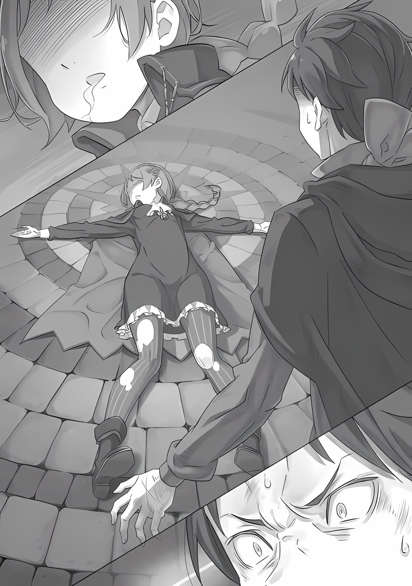

imy: У главы довольно низкое качество англ перевода. Я исправил многие моменты как смог, но я не знаю японский отлично, чтобы каждый момент сверять за минуту. Я и так потратил часов 12 на главу, больше както не хочется. Извините.

――Думай Думай, думай, думай-думай-думай-думай, он должен думать. «――――» Нацуки Субару продолжал думать, обхватив руками все ее тело, покрытое твердой, грубой чешуей. То, что произошло в его собственном теле, нелепые события внутри башни, люди, которые пытались убить его, люди, которые пытались убить кого-то, кроме него, различие друзей и врагов, и―― Беатрис: Субару, этого достаточно? Ты уже успокоился, я полагаю?

Субару: «――――» Субару медленно повернул голову в сторону голоса, который он услышал позади себя и который прервал его мысли. Беатрис, та, что окликнула его, сидела на кровати из плюща с надутым лицом и болтала ногами.

Ее рука была соединена с рукой Эмилии, которая сидела рядом с ней. Она пристально смотрела на Субару. ――Увидев этот взгляд, лицо Субару немного напряглось.

Эмилия: Эээй, Беатрис. Не говори так. Наверное, Субару удивился, когда проснулся. Я думаю, это неизбежно, что он начнёт обнимать Патраш.

Однако, Эмилия улыбнулась, опровергая ошибочные мысли Субару. Услышав, как она указала на это, Беатрис внезапно отвернулась от Субару и Эмилии.

Беатрис: Это не значит, что я злюсь. Это связано не только с твоим внезапным пробуждением, я полагаю.

Бетти и Эмилия тоже беспокоились за Субару; Земляной Дракон не единственный, кто беспокоится о тебе.

Эмилия: Хехе, да, я действительно беспокоилась о тебе.

Поглаживая Беатрис по голове, все еще отвернувшуюся от них, Эмилия посмотрела на Субару и подняла брови.

Субару затаил дыхание, глядя в аметистовые глаза Эмилии. Его грудь пронзила острая боль от глубокой привязанности в ее взгляде.

Ему напомнили. Они надеялись на “Нацуки Субару”, того, что был здесь. Ему было бы не по себе, если бы он не смог взять на себя это бремя. Тем не менее―― Субару: ――Эррм, извините, что беспокою вас всех. Мне очень жаль, я приношу свои глубочайшие извинения.

Это не похоже на меня — засыпать обнимая девушку, и это для того, чтобы скрыть свое смущение.

Расслабив лицо, Субару ответил, одновременно расплываясь в улыбке. На этот ответ Беатрис и Эмилия обменялись взглядами, и, Эмилия: Но… Патраш тоже девушка?

Субару: Ээээ!? Эй, подождите, Патраш — совершенно особенная.

Беатрис: Хмпф, это непростительно, я полагаю. Я не понимаю, почему ты так обращаешься только с этим земляным драконом. Я хотела бы получить объяснение, я полагаю.

Субару: Эй, не пытайся стоять с ней на одном ринге!

Этот Земляной Дракон…

Субару остановил свой ответ, так как лицо Беатрис становилось все более недовольным. Получив его ответ, казалось, что они обе не чувствовали, что что-то не так.

Почувствовав облегчение от этого, Субару повернул голову, чтобы посмотреть на ящерицу―― Нет, Патраш, которую продолжал гладить.

Субару: …Действительно, только ты особенная, Патраш. «――――» Субару прижался лбом к голове черного земляного дракона, которая издала слабое рычание, и закрыл глаза.

Эмилия: Итак, Субару, ты действительно хорошо себя чувствуешь?

Субару: Ах, да, да, я в порядке, я в порядке, никаких проблем вообще. Извините, что побеспокоил вас всех. Я, должно быть, очень устал и из-за этого случайно заснул.

Эмилия: Да… но ты скажешь нам, если устанешь, верно? Не заставляй себя слишком сильно.

Вращая руками, Эмилия сказала это Субару. Он ответил на эти слова “ОКЕЙ, капитан!”, полностью погрузившись в размышления.

Субару шел по четвёртому этажу вместе с Беатрис и Эмилией. Они направлялись в зал четвертого этажа, их целью было позавтракать―― Короче говоря, все трое шли, не имея никаких неотложных дел.

На этот раз Субару был полон решимости использовать другой подход, чем в прошлый раз. То есть―― он не станет рассказывать Эмилии и остальным о своей амнезии. «――――» Другими словами, эта ситуация требовала бы, чтобы Субару действовал так, как если бы он выдавал себя за другого.

Продолжая внимательно наблюдать за Эмилией и остальными, Субару увлажнил свои пересохшие губы языком.

Субару все еще не понимал, что за человеком “Нацуки Субару” был для остальных. В таких обстоятельствах было невозможно притворяться незнакомцем, но, это совсем другое дело, если нужно «Выдавать себя за самого себя». ――Независимо от места, “Нацуки Субару” это Нацуки Субару.

Даже если он провел год в этом параллельном мире, Субару знал, что основы человеческой природы останутся неизменными в нем самом. Тогда, если бы он просто обращал внимание на отношения , то он должен был бы в достаточной степени повторить* тот же характер. А затем, притворяясь* “Нацуки Субару”, он увидит, что произойдет. (imy: Вообще имеется в виду немного другое слово, но я использую повторить/притворяясь, ибо так больше понятен смысл.) Что произойдет в этой башне? Кто решит его убить? И кто кем будет убит.

На данный момент Субару проверит триггер, который приводил его к “смерти”, скрыв тот факт, что он потерял воспоминания. Другими словами, его убивает противник из-за его амнезии, или это не имело к этому никакого отношения? Как бы то ни было, честно говоря, у него не было особых ожиданий. Есть у Субару память или нет―― трудно себе представить ситуацию, из-за которой они могли бы быть потеряны. Однако, есть и исключения.

Субару: Например, преступник бы оказался в беде, если бы мне удалось восстановить память.

Субару вспомнил, что видел это раньше в фильме.

Очевидцы, которые были свидетелями убийства, потеряли память из-за какого-то шока. Преступник попал бы в беду, если бы к ним вернулись воспоминания. Вот почему в фильме преступник пытался убить свидетелей. Определенно можно думать, что в настоящее время аналогичная ситуация происходила с Субару. Прежде всего, обстоятельства, при которых Субару потерял свои воспоминания, были неясны―― Субару: Эмилия, ты нашла меня без сознания в библиотеке на третьем этаже?

Эмилия: Да, верно. Ты был на полу библиотеки… Мы с Беатрис в большой спешке отнесли тебя в Зеленую комнату.

Беатрис: Ну, поскольку тебя несла Эмилия, Бетти просто подбадривала её.

Субару пристально посмотрел на тонкие руки Эмилии, когда услышал дополнительные объяснения Беатрис, сопровождаемые вздохом. Спокойно подумав об этом, то для Субару было загадкой, как эти двое пронесли его всю дорогу от библиотеки до Зеленой комнаты. Нет никаких признаков того, что Беатрис полезна для тяжелой работы, и странно полагать, что Эмилия могла так легко перенести Субару.

Эмилия: Что случилось?

Субару: Ерррр, ничего. Ну, в любом случае, вы мне очень помогли. Я говорил это много раз, но мне очень жаль.

Эмилия: Не извиняйся, я буду рада, если поблагодаришь.

Когда Субару попытался склонить голову в знак извинения, Эмилия остановила его, положив ладонь на его лоб. Глаза Субару расширились от прикосновения гладких пальцев Эмилии, и он поспешно пробормотал: “Я думаю, ты права”.

Как Субару и думал до сих пор, чувство дистанции между ним и Эмилией было немного сильным; поэтому он не колебался и позволил ей прикоснуться к нему.

Если подумать, то, когда Субару проснулся, он обхватил её за шею. Тем не менее, она смотрела на Субару с умиротворенным выражением лица.

Субару: Как бы я не жил, я всегда буду чувствовать большую дистанцию с этой девушкой…

Или, может быть, Эмилия, вопреки своей ужасно аккуратной внешности, просто невероятно дружелюбна? Конечно, она также добра со всеми, и, вероятно, она не чувствовала никаких барьеров между кем-либо в результате воспитания и любви.

Скорее всего, она была девочкой, которую в детстве приютили, и на нее не повлияли какие-либо значительные трудности―― Если кто-то не обременен даже одним сожалением, то он может верить только в добродетель других и все время смотреть чопорно и красиво. ――Или все это было просто игрой? «――――» Глядя на Эмилию и Беатрис, Субару был глубоко погружен в свои мысли. Просто, когда он разобрал все до мельчайших деталей, когда дело дошло до последних мгновений Субару и трагедии в башне в последнем цикле, подозреваемыми, за которыми больше всего стоило следить, были Эмилия и Беатрис.

Субару видел трупы Шаулы, Ехидны, Рам, Юлиуса и Мейли. Его спасла Патраш и вывела из шатающейся башни; однако кто-то, стоявший позади него, отрубил ему голову, и он погиб. ――Он еще не видел, как умирают Беатрис или Эмилия.

Конечно, даже если бы они двое сговорились вместе, то он не знал, оставалась ли еще возможность убийства пяти человек. Субару думал, что это трудно. Но, если добавить другого человека―― если бы их число увеличилось до трех, то это была бы другая история. «???: ――Дальше, попробуй угадать, герой.» Субару не помнил незнакомый голос, который произнес эти слова в конце. Посреди хаоса, посреди вихря неразберихи, посреди отчаяния и желания, чтобы конец уже наступил, он услышал этот голос. Это, третье лицо, сотрудничающее с Эмилией и Беатрис―― может ли эта невидимая третья личность быть той, что перенесла Субару из библиотеки в Зеленую комнату? Вот почему эти двое извергали такую чушь―― Эмилия: Э-э, Субару, ты зашел слишком далеко.

Субару: А?

Очевидно, Субару прошел мимо комнаты, пока он был погружен в свои собственные мысли. Эмилия остановилась перед комнатой и положила руку на плечо Субару, чтобы он не ушел слишком далеко. В одно мгновение Субару почувствовал себя особенно неуютно, и он посмотрел на руку Эмилии, которая схватила его за плечо. А потом он взял ее за руку и пожал ее.

Беатрис: Субару? Что ты делаешь, я полагаю?

Субару: Ах, просто небольшой эксперимент… Эмилия, не хочешь ли ты сразиться со мной в силе?

Эмилия: Э, но я думаю, нам лучше не делать что-то опасное…

Не было никакого сопротивления, когда он пожал ей руку, и Эмилия продемонстрировала чувство отрицания на его предложение. Видя такое поведение, Субару стал более убежденным и решительно сказал: “Я прошу тебя об этом”. Если у Эмилии действительно нет сил чтобы нести Субару, то его предыдущий вывод был бы довольно надёжен. И теперь Эмилия не должна думать, что ее подозревают. Ему нужно наилучшим образом использовать это преимущество, такой шанс существовал только сейчас.

Субару: Я прошу тебя об этом, потому что это крайне необходимо.

Эмилия: …Поскольку Субару звучит довольно серьезно, это должно быть очень важно, верно?

Получив мольбу Субару, встревоженная Эмилия поджала губы и кивнула с решительным видом. Увидев это, Субару от всего сердца сжал кулак, сказав: “Готов”.

Если после этого он докажет ее слабость, то дедукция Субару продвинется гораздо дальше.

Беатрис: Ну, сделайте что-нибудь более безопасное, например, проведите арм-пул* матч. это нормально, я полагаю? (imy: arm-pull. я не знаю как это правильно перевести) Субару: Ах, это нормально!

Эмилия: Хорошо, поняла!

В соответствии с инструкциями Беатрис, Субару и Эмилия пожали друг другу руки и сделали некоторое расстояние между собой. Они взяли друг друга за правую руку, а затем посмотрели друг другу в глаза.

И затем――, Беатрис: Приготовились, начали! (П/п: Интересное примечание: она говорит это поанглийски.) По сигналу Беатрис Субару изо всех сил потянул Эмилию за руку.

Субару : Оооооо!!

Его сила захвата могла трескать яблоки, его сила захвата могла продолжать размахивать мечом кендо даже без цели, его сила захвата могла продолжать отжиматься. Сила мужчины против силы женщины―― он вложил все это в эту битву. ――И все же рука Эмилии не сдвинулась ни на дюйм.

Рассуждения Субару, в которых он сомневался в Беатрис и Эмилии, были возвращены на круги своя.

Однако Субару только подтвердил, что Эмилия несла его без помощи третьей стороны. Это не означало, что подозрения двух девушек были рассеяны. Субару все еще не видел трупов двух девушек. Эта резня в башне―― еще не решено, что преступник в этой ситуации кто-то отдельный.

Субару: В конце концов, тот парень в конце единственный преступник?

Он определенно убил Субару. Но был ли этот парень виноват в тени, окутавшей башню? А также тем, кто убил всех? Все убитые были убиты по-разному. Что выходит из этого объяснения?

Причины их смерти были легко видны с первого взгляда. Ехидна была убита одним ударом чего-то острого. У Юлиуса были перекрывающиеся раны. И разве Мейли не умерла от потери крови?

Не было никаких сомнений в том, что все умерли поразному, сражаясь с кем-то. Так и должно быть, но, ???: Так из-за чего, черт возьми, была эта шутка?

Голос, как будто удивленный, обратился к Субару, который был глубоко погружен в свои мысли. Этот голос принадлежал Рам, которая заканчивала готовить завтрак. Накрывая на стол воду и консервы, она потребовала объяснений по поводу состязания в силе с Эмилией―― эксперимента Субару, который он провел.

Состязание в силе, которое было направлено на определение доказательств дедукции Субару, было закрыто занавесом из-за его поражения Эмилии.

Именно то, что Рам присоединилась к ним перед залом, послужило толчком к его окончанию. Когда она увидела, как Субару покраснев борется, она положила конец всему, коротко бросив: “Ты тупой?” Эмилия: Меня попросил Субару, я не совсем понимаю, почему, но я уверена, что это имело какое-то действительно важное значение. Не так ли, Субару?

Рам: Это так? Как видит Рам, он просто захотел подержать Эмилию-саму за руку.

Субару: Ты слишком много думаешь об этом! Если хочешь, в следующий раз сразишься со мной в силе!?

Рам: Отвратительно.

Субару: Почему!?

Рам рассказала о своем ужасно жестоком впечатлении о нем Эмилии, которая пыталась заступиться за него.

Если бы он попытался рассеять это, в одно мгновение его положение стало бы значительно хуже.

Несомненный порочный круг.

Рам: Ха!

Презрительно усмехнувшись, Рам снова переключила свое внимание на стол. Увидев ее удаляющуюся фигуру, Субару втайне почувствовал облегчение от того, что, казалось, его нынешнее поведение не выдавало ничего, что могло бы показаться неуместным. Казалось, что он еще не сделал ничего, что отделило бы его от “Субару Нацуки”, известного девушкам. Это заставило его почувствовать облегчение, а также удивление. Делая это, он не должен склонять свое сознание в другую сторону, даже немного―― Субару: Урп-!

Внезапно Субару почувствовал рвоту, которая нахлынула на него, и он поднес руку ко рту. Её причиной была Рам, которая усердно работала, повернувшись к ним спиной. ――Удаляющаяся фигура девушки заставила его вспомнить, как та умерла.

Рам получила удар сзади, в результате которого часть ее живота была разорвана на части, убив ее. На её лице была тень, наполненная сожалением и гневом. В ее душе запечатлелся плач, который попытался бы разорвать любого, кто стал бы его свидетелем, на части. Владелец этого трупа двигался прямо у него на глазах и, несомненно, был жив.

Честно говоря, с того момента, как он впервые столкнулся с ней в зале, он отчаянно пытался смириться с противоречием между реальностью и этим неприятным чувством. Он почувствовал более или менее облегчение от того, что мог использовать приступ головокружения, который испытал, как оправдание, благодаря своим усилиям в недавнем соревновании сил с Эмилией.

Но он не обратил внимания на выражение лица Рам. «――――» Стиснув зубы, Субару направил свое сознание на то, чтобы вернуть себе сильный самоконтроль. Все люди, связанные с башней, один за другим входили в зал. Он не должен упускать из виду каждое из их выражений. ――Потому что это само по себе было бы ключом к выходу из ситуации. ???: Вооооаааа, какой хороший запах~! Роскошная еда в это освежающее утро! Я чувствую, что живу ради этого~!

Первый из них появился в зале, громко произнося эти слова. Красивая женщина, чьи длинные черные заплетенные в хвост волосы развевались, которая беззастенчиво обнажала большую часть своей огромной груди―― Шаула появилась в зале все еще с головой, определенно прижатой к телу.

Она смотрела на еду, приготовленную Рам, но потом заметила Субару в комнате и заговорила: Шаула: Мастер! Доброе утро! Вы хорошо выспались~?

Внезапно выражение ее лица озарилось, и она бросилась туда, где он был, с энергией, скажем, щенка.

А затем, схватив Субару за руку, она крепко обняла его грудью.

Субару: Ух……

Шаула: Кстати, яяяя спала невероятно хорошо! После такого долгого времени у меня были сны и все такое из прежних дней~. Яяяяяя и Мастер, и мать, а потом и потоооом Субару: Ааах, я понял тебя… подожди. Я как-нибудь хорошенько послушаю историю о твоем сне… Но ты случайно не видела меня сегодня утром?

Шаула: Эээ, опять эти ужасно невесомые вопросы? Как это типично для Мастера!

Каким-то образом высвободившись из ее рук, которые обнимали его, Субару спросил об этом, убегая от Шаулы. В ответ на это Шаула весело рассмеялась.

Шаула: Сёдзики*, то, что видит Мастер, не имеет большого значения! Как и в старые добрые времена, для меня вы навсегда самый сексуальный парень! Это предложение руки и сердца, которое ждало 400 лет! (imy: Тут от англ переводчика есть ссылка на ютуб, но это видео забанено. так что мы не узнаём к чему это референс) Субару: ……Вообще говоря, было бы хорошо, если бы эта шутка ничего не значила.

Шаула: ――? Это так? Если так, меня это не волнует~ Не получив желаемого ответа, Субару снял свои сомнения относительно Шаулы, чувствуя некоторое облегчение, смешанное с некоторыми следами разочарования. И, как только он это сделал, в комнате появилась следующая подозреваемая, Мейли.

Мейли: *Зевок*… Доброе утро. Я чувствую сонливость этим утром то~оже.

Девочка, войдя, сладко зевнула, прикрывая рот рукой.

Несмотря на это, она очень заботилась о том, чтобы поддерживать свою внешность, и он, безусловно, восхищался чувством красоты маленькой девочки.

Сильно отличается от Субару, который просто довольствовался тем, что взъерошил волосы и умылся.

В любом случае―― Субару: Доброе утро, Мейли! Ты проспала сегодня утром, а?

Мейли: Когда я думаю об этом, я чувствую, что у меня нет причин вставать одновременно с Братцем и другими. Эта башня на самом деле не имеет ко мне никакого отношения.

Беатрис: Девочка, которая говорит такие злые вещи. В общем, если Бетти и другие не завершат испытания так, чтобы покинуть башню, ты тоже не сможешь покинуть эту башню, я полагаю.

Мейли: Ну, это правда… но…

Имея в виду свои зевающие оправдания, Мейли поджала губы, выслушав мнение Беатрис. Сказав это, она переключила свое внимание на Шаулу и Субару, которые стояли у стены. Она помахала рукой, сопровождая это улыбкой. Увидев это, Субару приподнял бровь, а затем помахал в ответ.

Субару: Я как обычно слишком много думаю, сомневаясь даже в мертвом ребенке…?

Шаула: Мастер, когда у вас проблемы, возвращайтесь обратно к основанию. Начиная с того, как наносить удар.

Субару: ……Чье это ученье?

Шаула: Это ученье Мастера.

Субару: Неудивительно, что я думал, что это бесполезно.

Слушая этот монолог, Субару уклонился от легкомыслия Шаулы, содрогаясь в глубине души. В любом случае, он не мог получить желаемого ответа даже от Мейли.

Тогда оставалось только два человека, которые могли показать, является ли этот план вообще плодотворным―― ??? : ――Доброе утро.

С этими словами последние два человека вошли в комнату вместе. Ехидна и Юлиус. Ехидна в белом лисьем шарфе вошла в зал, а рядом с ней шел Юлиус.

Каждый из них по очереди поздоровался с Эмилией, Рам и остальными и обменялись словами доброго утра.

Между тем. «――――» Юлиус, шедший позади Ехидны, увидел Субару, стоявшего в дальнем конце комнаты, и его лицо напряглось. Он внезапно отвел глаза и вывел Субару из своего сознания.

Субару: ――Ты?

Реакция Юлиуса была довольно близка к той, которую искал Субару. И, поскольку никто другой не проявил такой реакции, вполне вероятно, что у него не было другого выбора, кроме как сказать, что именно он проявил самую резкую реакцию.

Субару: Шаула… у меня к тебе небольшая просьба.

Субару еле слышно пробормотал это. В его голосе были остатки ненависти, словно вскипевшие от пламени гнева, которое никак не могло погаснуть.

――Завтрак в зале начался и закончился встречей по поводу объяснения, что Ехидна = Анастасия.

Взглянув со стороны на удивленную реакцию Эмилии и других, Субару был впечатлен тем, что мир развивался, когда он не говорил о своей амнезии. До этого момента Субару с трудом осознавал свои собственные характеристики «Посмертного возвращения» из-за сочетания нереалистичных чувств и неправильного понимания фактов. Однако, точно так же, как скачки во времени, которые часто встречаются в фантастике, проблемы, которые не связаны с Субару, будут продолжаться так же, как обычно. Он понимал, что произошли изменения в затронутых проблемах.

Другими словами, до последнего времени он был вовлечен в суть их дискуссий из-за своей амнезии. Тот факт, что личность по имени Ехидна поселилась в теле молодой девушки по имени Анастасия, никоим образом не была глубоко изучена во время их бесед.

Но даже на этот раз он не нашел решения проблемы или чего-то, что открыло бы новые факты. Считается, что изменения происходят только в действиях Субару.

Если бы он хотел резко улучшить ситуацию, Субару нужно было бы активно что-то делать.

Следовательно―― Субару: ――Юлиус, я хотел бы перекинуться с тобой парой слов.

Завтрак закончился, и когда все они попытались выйти из зала, Субару окликнул Юлиуса, чтобы он остановился. Юлиус остановился как вкопанный, повернув голову, чтобы посмотреть на Субару. Субару вытянул шею, чтобы посмотреть на него, так как Юлиус был довольно высоким. Заметив его настроение, Юлиус устало вздохнул и сказал, Юлиус: В чем дело? Разве Эмилия-сама не предложила отдохнуть до полудня?

Слова Юлиуса были вдохновлены предложением Эмилии за завтраком. По-видимому, казалось, что Эмилия беспокоилась о том, что невидимая усталость изматывает всех, и высказала мнение, что Субару устал и из-за этого уснул в библиотеке.

На самом деле, хотя этого не было в воспоминаниях Субару, этой группе удалось пересечь пустыню всего несколько дней назад. Хотя Субару не удалось пересечь пустыню всего за несколько шагов, выполнить это, вероятно, было относительно сложно. Это тоже можно назвать изменением, вызванным речью Субару. Даже тривиальные слова иногда могут нарушить график дня.

Он должен быть осторожен в том, что он говорит и делает.

С этими мыслями Субару столкнулся с Юлиусом лицом к лицу. И, вздернув подбородок в ответ на его слова, он сказал: Субару: Я хочу поговорить о прошлой ночи.

Эффект от этих слов был мгновенным. «――――» Услышав слова Субару, в его желтых глазах вспыхнули сильные эмоции. Видя, какой немедленный эффект произвел его ответ, Субару укрепил свою веру в собственную дедукцию.

Субару: Пойдем. Давай сменим место.

Юлиус: ――Хорошо.

Юлиус последовал за ним с выражением покорности приглашению, которое он дал, вздернув подбородком.

Субару привел Юлиуса в подходящее место для разговора, в пустую комнату на четвертом этаже.

Естественно, это был секретный разговор, в который нельзя было впускать других.

Субару: Ну, с чего бы мне начать…

Внутри этой тесной комнаты Субару повернул голову и столкнулся лицом к лицу с Юлиусом. Он чувствовал легкое напряжение, но он не хотел совершать такую ошибку, как раскрытие этого. Мысль о том, что он должен в какой-то степени иметь эмоциональное преимущество, вдохновила Субару на храбрость. С другой стороны, выражение лица Юлиуса было сложное, и прочитать то, что лежало у него на сердце, было трудно. Но, похоже, это было что-то, что не было чувством спокойствия, которое сохранялось с места завтрака.

Субару: Прежде всего, о прошлой ночи.

Для начала Субару резко перешел к главному в вводной форме. В настоящее время он одерживает эмоциональное преимущество, но его противник имеет подавляющее преимущество в том, что он знает. Вопервых, Субару на самом деле не слишком много знал о том, что произошло прошлой ночью. Тем не менее, возможно, прошлой ночью Субару и Юлиус что-то делали в библиотеке. Субару думал, что, возможно, в результате этого “чего-то” он и потерял свои воспоминания.

Юлиус: О прошлой… ночи.

Повторив слова Субару, Юлиус закрыл свои глаза, окаймленные длинными ресницами. Субару сознательно продолжал глубоко и длинно дышать, стоя перед красивым мужчиной. Он не должен быть подавлен. По крайней мере, это то, что он чувствовал, чтобы не проиграть.

Юлиус: Если дело доходит до этого разговора, мы решили, что это закончилось в том месте. По крайней мере, я так думал, но для тебя все по-другому?

Субару: ――. Ааах, не совсем. Я, должно быть, не понял этого.

Увидев, что Юлиус присоединился к разговору, Субару также ответил. Голос Юлиуса был лишен каких-либо интонаций, и, так сказать, он был осторожен, чтобы не выдать больше эмоций, чем необходимо. Конечно, когда дело дошло до принимающей стороны, Субару, он выбрал вариант укусить таким образом.

Юлиус: Понял это…? Я понимаю, ну, это очень похоже на тебя. Короче говоря, ты хочешь сказать, что хочешь, чтобы я отложил чувства, которые у меня есть, и решил твои собственные проблемы, не так ли? Разве это не слишком эгоистично?

Субару: Это немного не так, и это не то, о чем мы говорим. Я, конечно, не в восторге от этого, но ты пытаешься выглядеть счастливым из-за этого? Мы оба ходим со злостью в наших сердцах, и ты говоришь, что я должен выглядеть так, как будто все в порядке? Ты думаешь, я мог бы это сделать?

Юлиус: ――Ну, тогда какой же есть другой выбор?

Юлиус спокойно контролировал свои эмоции. Но малопомалу эмоции начинали появляется в его голосе.

Субару чувствовал, как Юлиус смотрит на него яростным взглядом, Субару, конечно, все еще не знал подробностей, скрывающихся за вспышкой Юлиуса.

Какой выбор Субару хотел услышать? Какой выбор сделал Юлиус в отношении Субару, когда в нем была такая ярость? И как Субару позволил Юлиусу выбрать этот выбор?

Юлиус: Мои чувства такие же, как я и сказал прошлой ночью, и я не собираюсь продолжать упоминать об этом, так как я даже не заметил твою и Анастасиисама… твоей тайной связи с Ехидной.

Субару: Я и моя тайная связь с Ехидной…?

Всплыл неожиданный факт, и на этот раз именно Субару застали врасплох. По информации, которой он располагал в настоящее время, Субару должен был быть частью группы с Эмилией на вершине. Юлиус и Ехидна―― в данном случае он слышал, что первоначальная владелица тела Ехидны, Анастасия, является господином другой группы и, по большому счету, имеет с ними враждебные отношения. Однако он сказал, что Субару имел тайную связь с Ехидной.

Юлиус: Я знаю, что у тебя не было дурных намерений делать это. Даже если это Ехидна, я не могу сказать, что достаточно, но мы поговорили. Ей можно доверять…

Нет, нет другого способа, кроме как доверять ей.

Субару: «――――» Юлиус: У меня нет ничего, кроме как использовать эту возможность, чтобы спасти Анастасию-саму…… Даже если когда мы вернем ее, она не вспомнит меня.

Юлиус произнес эти слова ужасно одиноким голосом.

Субару слышал о его обстоятельствах. Как и спящая младшая сестра Рам, и многие люди из разных городов, Юлиус тоже был поражен этим. Ему сказали, что они столкнулись с чем-то ужасным, похожим на проклятие, в котором их забыли другие. Даже если Ехидна вернет контроль законному владельцу тела, маловероятно, что Анастасия вспомнит своего рыцаря Юлиуса.

Несмотря на это―― Юлиус: ――Я сделаю то, что намеревался сделать, и я не знаю, что, черт возьми, ты хочешь вытянуть из меня, но позволь мне сказать тебе это заранее.

Субару: ……что же?

Юлиус: Ради бога…… пожалуйста, не делай меня снова несчастным перед тобой.

Услышав слабый голос Юлиуса, Субару не смог сказать ни слова. «――――» Только в глубине своей груди он чувствовал что-то шумное, но Субару молчал. Юлиус взглянул на Субару, разжимая губы, чтобы издать лёгкий вздох, Юлиус: Кажется очевидным, что дальше будет только бесплодный обмен.

Сказав это, Юлиус отвернулся от Субару и собрался выйти из комнаты. Затем, как раз перед тем, как выйти из комнаты, Юлиус остановился всего один раз. И, все еще не поворачивая головы, он сказал: Юлиус: Вчерашний разговор поверг меня в шок. ――Что бы я делал, если бы ты извинился?

Субару: Если бы я извинился…?

Юлиус: Мне интересно, как бы я тогда ответил тебе.

Хотя даже этого я больше не знаю.

Юлиус вышел из комнаты, оставив после себя эхо самоиронии в этом бормотании. Убедившись, что его не видно, Субару глубоко вздохнул. Он вдруг почувствовал себя измученным, как будто ему на спину положили огромный камень. Он сильно вспотел. Он чувствовал себя так, словно стал ужасно отвратительным человеком.

Шаула: ――Мастер, все было хорошо?

Появилась Шаула и заглянула в комнату. Субару издал “Хах”, увидев ее совершенно безразличное поведение.

А затем, приложив руку ко лбу, он кивнул головой со словами: “Все было хорошо".

Субару: В том состоянии, в котором он находится, возможно, Юлиус не имел никакого отношения к библиотеке. …Но недоверие к себе, несомненно, стало еще немного сильнее.

Шаула: Я действительно не понимаю, но была ли я полезна вам, Мастер?

Субару: ――. Ах, действительно. Благодаря тебе я смог встретиться с Юлиусом лицом к лицу и обрести некоторое душевное спокойствие.

Шаула: Хе-хе-хе, это хорошо~ Тогда, тогда, тогда, Мастер, Мастер…

Шаула была в восторге, ее тело извивалось, а щеки раскраснелись. Она подошла к Субару. А затем нежно протянула руки, Шаула: Я хочу, чтобы вы крепко обняли меня в награду!

Субару: Ни за что!

Шаула: Эээээээ!? Как подло! Мастер, разве вы не говорили, что послушаете, что я скажу, если я не отклонюсь от уровня вознаграждения!?

Субару: Это желание выходит далеко за рамки моего чистого и невинного сердца…

Субару прямо отверг чрезмерные надежды и мечты Шаулы о тесном контакте. Тем не менее, это была правда, что Шаула, подстерегая его, давала ему достаточно самообладания в сердце, чтобы противостоять Юлиусу.

Когда он позвал Юлиуса, Субару попросил Шаулу остаться в засаде в соседней комнате в качестве помощника. Причина, по которой он выбрал ее, заключалась в том, что среди всех других девушек она, казалось, обладала лучшими спортивными способностями, а также в том, что она, казалось, прислушивалась к просьбам из-за своей симпатии к Субару. В результате расчета она, казалось, была готова помочь ему, не задавая слишком много вопросов.

Кроме этого, из числа подозреваемых девушка, чье мертвое тело он нашел первым, с наименьшей вероятностью представляла опасность со стороны всех них.

В любом случае―― Субару: Мои мысли, что именно Юлиус был противником, который украл мои воспоминания в библиотеке, были далеки от истины…

Судя по реакции, которую он увидел этим утром, он думал, что это был почти наверняка он, но эти размышления оказались неправильными. Что бы ни случилось в библиотеке, произошло событие, которое заставило его потерять память, но Юлиус вообще не упомянул об этом, и его эмоции были слишком естественными.

Было совершенно неясно, что за тайная связь была у “Нацуки Субару” с Ехидной. Но, по крайней мере, сейчас это была достаточно веская причина для Субару, чтобы питать недоверие к себе прошлой ночи. До того, как его воспоминания были потеряны, казалось, что между ним, Ехидной и Юлиусом произошла довольно непростая беседа.

Субару: Ты… что, черт возьми, ты делал, и кто, черт возьми, нацелился на тебя, “Нацуки Субару”…

Шаула: Мааастер, как тогда насчет того, чтобы прыгнуть в мою грудь? Ах, подойдите и обнимите мое пышногрудое тело, Мастер.

Субару: Это желание за гранью чистого сердца!

Шаула: Мастер подлый~!

Говоря о вещах, о которых он понятия не имел, Субару также понятия не имел, почему Шаула проявляла к нему такую странную привязанность. Почему она так сильно любила Субару? Оказалось, что Эмилия и все остальные вокруг нее тоже понятия не имели, почему она это делала. Говорили, что это было что-то, чем удобно пользоваться, но было ли это действительно так?

Его тайная связь с Ехидной, размытость поступков прошлой ночи и, в первую очередь, его отношения с девушками―― И теперь существо, о котором Субару меньше всего знал, насколько он был обеспокоен, было “Нацуки Субару”. С какими домыслами он столкнулся в отношении девушек и парней? ――Был ли “Нацуки Субару” вообще по-настоящему связан с ними? (Примечание TL: более точно “девушки”, вероятно, относятся к стороне Эмилии) Субару: Черт, мои мысли зашли в тупик… Давай ненадолго отправимся туда, где Патраш.

На данный момент он хотел отправиться туда, где мог бы успокоиться и подумать. Подумав о его величайшем союзнике, первое, что пришло в голову нынешнему Субару, это, безусловно, тот черный как смоль земляной дракон. У него не было другого выбора, кроме как довериться тому, кто рисковал своей жизнью, защищая его, независимо от того, сохранились у него воспоминания или нет.

Шаула: Эээ, этот земляной дракон~? Мне он не нравится, так как вечно злобно смотрит на меня.

Субару: Ты… оскорбления Патраш непростительны!

Даже если бы этот мир стал миром, в котором были бы допустимы оскорбления, я не смогу простить оскорбления Патраш.

Шаула: Мастер, как сильно тебя избил этот дракон!?

Шаула повысила голос, но Субару совершенно не обратил на это внимания. В любом случае, это было потому, что теперь он хотел погрузиться в свои мысли в покое, рядом с Патраш. Во всяком случае, их первоначальная цель — захват башни, начнется сразу после обеда. Поскольку он скрыл свою амнезию, остановить это было невозможно.

Субару: Вот почему мы тоже расстаемся здесь.

Увидимся.

Шаула: Увааах, вы даже не выдали награаааду. Но я все еще не могу этого выыынести. Я женщина для удобства Мастера, в этом смысл моей жиииизни.

Субару: «――――» Когда он попытался выйти из комнаты, Шаула произнесла это вслух и холодно попрощалась с ним.

Услышав ее слова, Субару затаил дыхание. Все еще держась к ней спиной, Субару опустил голову и закрыл глаза.

Субару: …Где находится эта ценность Нацуки Субару?

Шаула: ――? Владелец?

Субару: ――хк! Ах, черт возьми!

Не в силах вынести поднимающегося в нем раздражения, Субару грубо почесал голову и повернулся так, чтобы оказаться лицом к Шауле, которая склонила голову. А затем, подойдя к неподвижной девушке, он протянул обе руки и изо всех сил обнял ее стройное тело.

Саул: «hk» Субару: Ты не должна думать о себе просто как о женщине для удобства или что-то в этом роде. Это была моя вина.

Субару в конечном итоге стал бы таким же, как “Нацуки Субару”, если бы он просто использовал ее в одностороннем порядке. У Шаулы перехватило дыхание, и ее тело напряглось от поведения Субару, который отказался стать таким.

Шаула была высокой, примерно такого же роста, как Субару. Но даже в этом случае ее тело, которое он обнял, было стройным, гибким и мягким. Была большая разница между ее телом и его собственным телом.

Шаула: Ма … стер …

Субару: Ты помогла мне. …Вот и все.

Шаула «----» Прошло около 30 секунд, пока он обнимал Шаулу.

Субару медленно отпустил ее тело. Честно говоря, он чувствовал себя неловко, но его чувство достижения было сильнее. Если бы он стал парнем, который просто раздавал такие подарки. Если бы он стал таким же, как “Нацуки Субару”―― Шаула: Мастер …

Глядя на задумчивого Субару, Шаула головокружительно направилась к нему, ее щеки яростно покраснели. Ее глаза были влажными от слез, дыхание было несколько лихорадочным, и она смотрела на губы Субару, Шаула: Мастер, наконец-то вы проявили ко мне немного любви…

Субару: За гранью чистого сердца!

Шаула: Эй!

Оттолкнув ее лицо ладонью, Субару вернул Шаулу к реальности.

Субару: Независимо от того, вознаграждаю я тебя или нет, ты увлекаешься… Какой трудный характер…

Субару каким-то образом удалось успокоить возбужденную Шаулу и выпутаться из ситуации. Он вздохнул. В конце концов Шаула ушла, все еще пребывая в мечтательном состоянии, со словами: “Это признак хорошей женщины — видеть, когда приходит время уходить”. Честно говоря, хотя он и понятия не имел, что все это значит, вмешиваться в это было бы слишком утомительно.

Субару: Так как иногда в мире есть вещи, которые тебе не нужно знать.

В любом случае, вопреки такому неосторожному поступку, положение Субару выглядело не очень хорошо. По крайней мере, он ожидал, что то, что произошло в библиотеке, станет известно, если он надавит на Юлиуса. Но, поскольку он ошибся, он снова вернулся к исходной точке. Или, как он сначала и предпологал, другие вообще не были причастны к пропаже воспоминаний Субару? Хотя, это было просто из-за выражения лица Рам, которое он не смог проверить―― Субару: Она выглядела так, будто плакала… но, я больше не знаю, были ли это просто крокодиловы слезы…

Именно Рам изо всех сил старалась не поверить в историю о том, что Субару действительно потерял память. Конечно, все еще оставалась вероятность того, что она причастна; не исключено, что она могла быть причастна, и просто не призналась, но нет смысла говорить об этом. Реальность такова, что если вы во что-то не верите, вы даже не можете начать в чем-то сомневаться. Что касается Субару, то эта основа была―― Субару: ――Теперь это значит Патраш Заявив об этом, он был шокирован тем, что был человеком, который попал в ловушку полного недоверия ко всем окружающим. Но на самом деле, это была правда, что эта его сторона была довольно сильной. Его “полное недоверие ко всем” имело глубокие корни, и теперь он не мог поверить даже себе.

Субару: Что ж, было бы большим благословением, если бы мне довелось провести некоторое время в раю, в котором есть только Патраш и Земляные Драконы… ???: ――Ах, я это слы~ышала!

Субару: Вооа!?

В тот самый момент, когда он высказывал эти мысли вслух, из-за угла прохода проворно выскочила девочка.

Маленькую девочку звали Мейли, ее синяя коса раскачивалась, когда она хихикала, прикрыв рот рукой.

Субару устало опустил плечи при виде фигуры девочки, когда она услышала, как он озвучил свои скучные мысли.

Субару: Это просто что-то вроде шутки или чепухи. Ты, конечно, этого не поняла, верно?

Мейли: Ве~ерно. Но я не собираюсь смеяться над ними, даже если это истинные чувства Братца, знаешь.

Потому что если есть место, где можно просто жить с плохими животными-чанами, то я думаю, что это то, где я бы не возражала жить.

Субару: …… Ха В ответ на плохое оправдание Субару, Мейли сказала это, подняв свою юбку за подол жестом, по которому Субару не мог сказать, было ли это элегантно или дико.

Даже если он получил ответ, он действительно не знал, что ответить. Однако, похоже, ей не понравился этот ответ.

Мейли: Ах, э~это неопределенный ответ. Поскольку человек взял на себя труд прилежно произнести речь, я считаю, что не слушать ее должным образом — признак плохого человека.

Субару: Мне очень жаль. …Ты одна? Ты не с Беатрис?

Мейли: Без шансов! Зачем мне быть с Беатрис-тян?

Но~о, я думаю, что это вопрос, который я бы предпочла задать тебе, Братец.

Он думал, что девочки одного возраста будут тусоваться вместе, но, похоже, это было не так.

Конечно, было много случаев, когда Беатрис действовала вместе с Эмилией. ――Вот почему он подозревал их обоих; он не мог думать о них по отдельности.

Субару: Ну, все равно, это нормально. Хотя, чтобы ты знала, у меня нет времени играть с тобой. Извини, но если ты хочешь поговорить с кем-нибудь, поищи другого. Например, Шаула там, сзади.

Мейли: Я могла бы поговорить со своей полуголой сестрицей, но прямо сейчас у меня есть дела с Братцем.

Субару: Со мной?

Хотя Субару не хотел, чтобы его беспокоили в то время, когда он собирался погрузиться в свои неизбежные размышления, на своем тайном “свидании” с Патраш, он не мог не расширить глаза при неожиданном приглашении Мейли. Подумав об этом, маленькая девочка была очень похожа на Шаулу в том, что с ней было легко разговаривать по сравнению с Эмилией и другими. Даже в ее последние мгновения в последнем цикле ее труп не был оставлен в изуродованном состоянии, настолько, что на него было слишком больно даже смотреть. Поскольку она выглядела так, словно умерла во сне, шокирующие образы не накладывались друг на друга, даже когда он находится прямо напротив нее. Его сердцебиение также было спокойным.

Субару: В чем дело? Это быстро?

Мейли: Да, это не займет много вре~емени.

Субару почувствовал непреодолимое чувство безопасности; он решил послушать Мейли. А затем, увидев, как Субару изменил позу, показав, что он готов слушать, Мейли приложила палец к губам и облизала кончик пальца языком. Этот несколько соблазнительный жест не соответствовал ее детской внешности. Субару нахмурился, глядя на это.

Мейли: ――Интересно, насколько серьезно я должна отнестись к тому, о чем мы говорили прошлой ночью?

Вот что сказала маленькая девочка Субару, все еще мило улыбаясь.

Субару: ――Чт…а?

Внезапно Субару освободился от странной остановки своего сознания и схватил себя за шею. В его горле было что-то вроде чувства остроты и духоты. Он начал сильно кашлять.

Субару: Ак, Ак…

Прикасаясь к своему горлу, Субару кашлял снова и снова, испытывая болезненную жажду.

А затем, он внезапно обратил внимание.

Субару: А… Я… ――Что я делал?

Незадолго до этого он наверняка разговаривал с Юлиусом, потом был тот фарс с Шаулой, а после этого он попытался пойти туда, где была Патраш. И, наконец, он встретил Мейли на полпути туда―― Субару: АЙ…

Погруженный в раздумья, Субару потер руку и прищелкнул языком от острой боли. Посмотрев на свою руку―― обе руки. На запястьях его левой и правой руки было куча царапин, и из них сочилась кровь.

Субару: ТЧ, что это, черт возьми…

Раны были относительно глубокими, но сами раны были неровными. То, что это были царапины, было неплохой догадкой, они не могли быть от острого лезвия. Это были раны, нанесенные кем-то, кто изо всех сил вонзил ногти в его плоть. Откуда, черт возьми, у него были эти раны―― Субару: ――А?

Хмурясь от боли, Субару огляделся по сторонам. Он понял, что находится в каменной комнате на четвертом этаже. И тогда он заметил это. «――――» Белые ноги были разбросаны по полу. Ноги были неподвижны, сила в них иссякла. Он медленно перевел взгляд с ног; он увидел юбку, верхнюю часть тела… а затем.

А затем―― Субару: ――Что?

А затем, прямо там, фигура маленькой девочки, которая была абсолютно неподвижна, лежала перед ним. ――Мёртвая Мейли лежала перед глазами Субару.

