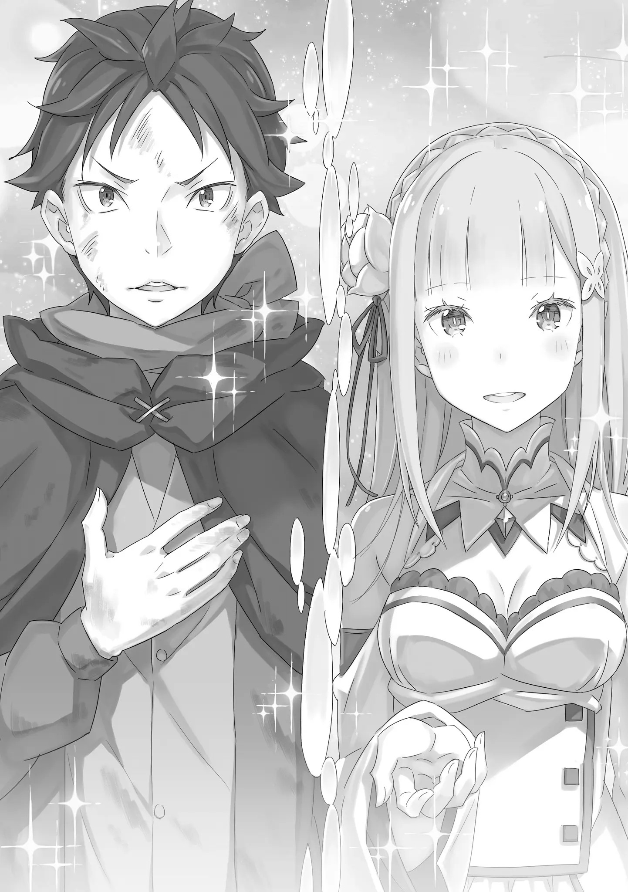

QC: Silly

――Мир вот-вот должен был погрузиться во тьму.

Тень протягивала бесчисленные руки к Субару, который обмяк и не мог пошевелиться.

Подобно спиралям или водоворотам, черные как смоль магические руки пытались заключить душу Нацуки Субару в объятия.

Места, к которым они прикасались, словно таяли, словно крошились, словно распадались на части; он чувствовал, как его существование становится пустым.

Но, как ни странно, он не чувствовал себя плохо.

Субару: «――――» Его тело должно было рассыпаться, само его существование должно было быть перезаписано, его душа должна была быть взбаламучена.

Несмотря на то, что он подвергался величайшему богохульству для живого существа, разум Нацуки Субару был достаточно спокоен, чтобы его можно было назвать умиротворённым.

Во многом это было связано с тем, что он был глубоко разочарован событиями прошедшего дня.

Но это была не единственная причина. ――Это было потому, что тень, её руки, это было единственное, что было честным.

Эта тень — единственная, кто понимает чувства Нацуки Субару, который хочет сейчас исчезнуть.

Он хочет умереть. Он хочет исчезнуть. Он хочет быть раздавленным, превращенным в пепел без следа.

Даже если он будет возрождаться, неважно сколько раз, приди и сотри мое тело в пепел снова и снова.

Эта черная тень исполнит такой искренний крик Субару, такое желанное желание. ――Я люблю тебя.

Единственное, что его раздражало, — это надоедливое повторение.

Как бы он ни старался заткнуть уши или закрыть свой разум, она просовывала пальцы в щели его закрытого разума, проскальзывала сквозь отверстия и прямо шептала о своей любви. ――Я люблю тебя. Я люблю тебя. Я люблю тебя.

Прекрати это. Меня тошнит от этого.

Мне все равно, сколько раз ты это повторишь. Я не люблю тебя. Я не люблю себя. Я знал, что меня любят. Я знал это.

Мои родители. Мои отец и мать оба любили меня, Субару, от всего сердца.

Он знал это. Как он мог не знать? Вот почему Субару хотел исчезнуть.

Его любили родители, но он никак не мог любить себя, который не был достоин любви. ――Я люблю тебя. Я люблю тебя. Я люблю тебя. Я люблю тебя. Я люблю тебя.

Прекрати, дай мне передохнуть. Хватит уже.

Независимо от того, сколько раз ты повторишь это, ты не сможешь получить ничего большего, чем это. Я уже давно пришел к этому. Я знал это. Я знал это, просто не хотел этого видеть.

Люди, которые изо всех сил так отчаянно беспокоились о Субару, не могли быть плохими.

Он знал это. Он не мог этого не знать. Вот почему Субару должен был просто умереть.

Ему следовало бы постараться не быть озаренным милостью тех, кого беспокоило существование Субару. ――Я люблю тебя. Я люблю тебя. Я люблю тебя. Я люблю тебя. Я люблю тебя. Я люблю тебя. Я люблю тебя. Я люблю тебя. Я люблю тебя. Я люблю тебя. Я люблю тебя.

Я люблю тебя. Я люблю тебя. Я люблю тебя. Я люблю тебя. Я люблю тебя. Я люблю тебя. Я люблю тебя. Я люблю тебя. Я люблю тебя. Я люблю тебя. Я люблю тебя.

Я люблю тебя. Я люблю тебя.

Прекрати, я сказал, что знаю.

Если я переживу эти мучения, ты исполнишь мое желание? Проглотишь ли ты меня, сломаешь, раздавишь и сотрешь в ничто, чтобы я никогда больше не мог посягнуть на другого?

Если это так――если это так, я приму это. Я хочу принять это. Если это конец.

Если это последний раз, Нацуки Субару, даже если он исчезнет―― ――Я люблю тебя. Я люблю тебя. Я люблю тебя. Я люблю тебя. Я люблю тебя. Я люблю тебя. Я люблю тебя. Я люблю тебя. Я люблю тебя. Я люблю тебя. Я люблю тебя.

Я люблю тебя. Я люблю тебя. Я люблю тебя. Я люблю тебя. Я люблю тебя. Я люблю тебя. Я люблю тебя. Я люблю тебя. Я люблю тебя. Я люблю тебя. Я люблю тебя.

Я люблю тебя. Я люблю тебя. ???: Достаточно!

Я люблю тебя. Я люблю тебя. Я люблю тебя. Я люблю тебя. Я люблю тебя. Я люблю тебя. Я люблю тебя. Я люблю тебя. Я люблю тебя. Я люблю тебя. Я люблю тебя.

Я люблю тебя. Я люблю тебя. Я люблю тебя. Я люблю тебя. Я люблю тебя. Я люблю тебя. Я люблю тебя. Я люблю тебя. Я люблю тебя. Я люблю тебя. Я люблю тебя.

Я люблю тебя. Я люблю тебя. ―― ―――― ―――――――― Прозвенел, голос.

Как будто для того, чтобы пробиться сквозь яростное признание в любви, которое окрасило весь мир и существование Нацуки Субару, звук голоса, напоминающий серебряный колокольчик, вспыхнул и достиг прямо Субару.

Субару: «――――» Вспыхнул свет.

Он вонзился в черную как смоль магическую руку, которая собиралась проглотить Субару. Создалась ударная волна, и рука, получившая прямое попадание, оторвалась. Однако это была всего лишь одна из бесчисленных извивающихся рук.

Это того не стоит, если то, что вы получите в обмен на отсечение одной из тысячи, — это враждебность тени с ее огромной силой. Но человек, нанесший удар, смело шагнул вперед и направился прямо к ненормальным рукам, уклоняясь, уклоняясь и уклоняясь. И затем―― ???: ――Субару!

Субару: «――хк» Выкрикнув имя Субару, который сидел ссутулившись, обладатель этого голоса крепко сжал его слабую руку.

Тело Субару резко дернулось вверх, и она изо всех сил потянула его от этого места.

Как бы говоря, что она не позволит им этого сделать, тень вытянула руки, блокируя их спереди и сзади, пытаясь преградить им путь вперед и путь к бегству.

Однако, даже этих препятствий перед ней было недостаточно, чтобы остановить ее от продвижения. ???: «Ри, яа!!» Рука, противоположная той, что держала Субару, была вытянута вперед, и возникло ослепительное сияние.

Сразу же после этого появился красивый, светящийся ледяной кристалл―― Этот завораживающий, храбрый удар льда, имел те же корни, что и ледяная клетка, в которую был захвачен Субару.

Она разбила черные как смоль руки, которые развернулись так, что образовали стену перед ними, и насильно открыла путь.

Субару, у которого сложилось впечатление, что странная тень поглотит все, заметил, что при виде того, как они в одно мгновение рассеялись, его сердце, которое, как он думал, никогда больше не сдвинется с места, слегка дрогнуло.

И, когда его тогда затвердевшее сердце начало шевелиться, его глаза обратились к красоте прямо рядом с ним.

Держа Субару за руку и целеустремленно глядя вперед, девушка с длинными, блестящими, похожими на лунный свет серебристыми волосами―― Эмилия бежала, забирая Субару с собой.

Хотя ее выживание теперь также было подтверждено, его сердце не было этим взволнованно.

Напротив, в глубине черепа Субару чувствовал, что чтото вот-вот треснет.

Он не рад своему выживанию. Конечно нет.

Он оставил умирать Юлиуса, Беатрис и Ехидну, тех, кто подтвердил его выживание.

Хотя он не видел решающей сцены, он мог только представлять, что случилось с Юлиусом, когда он остался под набегом кучи Магверей. Беатрис исчезла, защищая Субару, и он даже не смог облегчить смерть Ехидны, которая страдала.

Нацуки Субару был воплощением чумы. Смерть была присуща самому его существу.

Забыв, что смерть для него существует, он навязывает своё несчастье другим до такой степени, что можно выдвинуть нелепую гипотезу, что он — дитя черной судьбы―― Субару: ――хватит, уже Эмилия: А?

Субару: Я сказал, больше нет смысла бороться.

С силой сопротивляясь Эмилии, что тянула его за руку, Субару остановился как вкопанный. Эмилия снова попыталась дернуть Субару за руку, но на этот раз Субару был настроен решительно и отказался повиноваться ей.

Разница в силе между ними была очевидна, но воля Субару также была сильной. Возможно, обнаружив этот темный импульс в его черных глазах, Эмилия, у которой перехватило дыхание, перестала тянуть его за руку силой.

Эмилия: «――――» Они вдвоем, Субару и Эмилия, стояли лицом к лицу и смотрели друг на друга.

Он заметил, что тени, которая пыталась захватить его, нигде не было видно. Ему было интересно, стряхнули ли они тень, когда убегали с Эмилией, и если да, сможет ли он вновь найти ее, если вернётся назад?

Ему казалось, что это был самый подходящий способ устранить Нацуки Субару из существования.

Субару: Почему ты пришла спасти меня? Ты безумна, не так ли? Ты думала, что я фальшивка…… поэтому ты заперла меня в ледяной клетке и пыталась убить меня.

Его слова были обманом, произвольно искажающие реальность и намеренно обидчивые, чтобы ранить ее.

Он надеялся, что Эмилия никогда больше не подумает о том, чтобы взять его за руку.

Однако подлые намерения Субару были бесполезны против Эмилии, которая смотрела прямо на факты.

Ее глаза сузились от гнева, и она повысила голос на Субару.

Эмилия: Я не пыталась убить тебя! Я просто хотела услышать все напрямую у Субару, который вел себя странно. Ты ничего не рассказал про воспоминания, поэтому……

Субару: Что-то такое! Знаешь, это может быть просто уловкой! Ты так легко в это поверила? Это просто смешно. Ты с ума сошла! Ты, Юлиус, Беатрис!

Его заперли в ледяной клетке, и он рассказал им правду об амнезии, когда оказался в безвыходном состоянии.

Но никто в здравом уме не поверил бы в такую историю.

Отношение Рам и Ехидны было правильным. И несмотря на это, больше половины остальных были глупы.

Субару: Нет, нет…… Вы все идиоты! В конце концов… с такими вещами, в конце концов, даже Ехидна извинилась передо мной… Я этого не понимаю!

Эмилия: В конце концов, Ехидна……? Субару, что случилось? Ехидна и другие…

Эмилия начала задавать этот вопрос Субару, который бормотал и стонал, закрыв лицо руками. Даже ее мрачное выражение лица выглядело прекрасно, и ему хотелось вырезать ей ногтями сердце.

Чтобы сделать это, он бы обнажил свое собственное стеклянное сердце так сильно, как только мог.

Образ девушки, чья жизнь была разрушена, с не текущей больше кровью и слабым выражением на лице, счастливой от того, что ей не пришлось страдать от боли за свое драгоценное существование, с одним лишь таким болезненным и холодным желанием.

Образ девушки, которая потеряла свою жизнь, вернулся к нему в голову, и Субару закричал, когда он открыл эту рану в груди.

Субару: Мертва! Ехидна мертва! Обе ее ноги были оторваны, и она истекла кровью…… Короче говоря, она умерла в муках! И Беатрис тоже!

Эмилия: «――хк» Субару: Она даже… защитила меня… Что за абсурд… отрезание собственного хвоста… Если бы я только заметил раньше… Но я не заметил, и поэтому она умерла. Она сказала, что не забудет меня…

Даже если бы Субару забыл, Беатрис не забыла бы.

Беатрис твердо заявила, что непременно поможет Субару восстановить свои воспоминания.

Но, она погибла. Сразу после того, как она это сказала.

Это был сплошной лай и никакого укуса*. Слова — это ветер. И сразу же после того, как она это сказала, она уберегла Субару от смерти. И с лицом, полным облегчения, она исчезла из этого мира. (all bark and no bite — Быть словесно угрожающим, но не желающим делать ничего существенного. я хз как это переводится на русский правильно.) Субару: Если она собиралась вот так исчезнуть, я должен был остановить ее. Оттащить её? Я оттащил её?

Как бы то ни было, как это произошло, не имеет значения. Во всяком случае, если бы этого не делал… если бы я не оттаскивал, то…

Тогда бы все не закончилось тем, что она встретила такую судьбу, исчезла с таким выражением на лице.

Субару: То же самое относится и к Юлиусу. Уверен, что к настоящему времени… в месте, где так много страшных Магверей… и с этим парнем Рейдом, который причиняет ему неудобства, берет, и просит уйти……

Идиот Все здесь — идиоты. Чего, черт возьми, они ожидали?

Умоляя, возвращая назад, извинившись за то, что сомневалась в нем, что, черт возьми, они извергали?

Какой смысл просить об этом? Какой смысл возвращать его обратно? Разве это не естественно — быть подозреваемым?

Нацуки Субару здесь, потому что он предал все, что на него было возложено.

Он хочет исчезнуть, потому что ему невыносима мысль о том, что он единственный, кто выживает в мире.

Он был самым идиотским, глупым, совершенно беспомощным, он ничего не мог спасти―― Если бы это был не Нацуки Субару, то кем бы он был―― Эмилия: ――Мы с Субару впервые встретились в месте под названием «Склад краденных товаров» в Королевской столице ―― ―――― ―――――――― Субару: «――――» Субару погрузился в бездонное болото самообвинения и неуверенности в себе, не имея выхода; он даже не мог пошевелить собственным телом.

Внезапное признание Эмилии заставило барабанные перепонки Субару затрепетать―― ее слова прозвучали так, словно возвращали ей приятные, драгоценные, ностальгические воспоминания.

Субару: ……ха?

Субару был ошеломлен, все, что он мог сделать, это выпустить воздух из легких, когда он так внезапно получил эти слова без контекста.

Это никоим образом не означало презрение или насмешку над внезапными действиями Эмилии.

Сознание Субару просто не могло выдержать такого и было искренне ошеломлено молчанием.

И все же Эмилия проигнорировала его реакцию, протянув палец вниз, позволяя всплыть еще большему количеству воспоминаний.

Эмилия: Тогда Фельт-тян украла у меня очень важную эмблему. Мне нужно было вернуть ее, поэтому я очень торопилась с Паком…… А потом, после того, как мы преследовали ее, мы сражались с сестрой Мейли-сан…

Мы были в серьезной опасности, но Рейнхард пришел, чтобы спасти нас. И после этого, как только я вздохнула с облегчением, сестра Мейли направилась прямо ко мне… Субару спас меня от этого.

Субару: «――――» Эмилия: Именно тогда я впервые встретилась с Субару… Ты не помнишь?

Услышав ее вопрос, Субару покачал головой.

Несмотря на то, что она подробно пересказала эти воспоминания, он не знал даже малой части того, что она сказала.

Естественно, этого следовало ожидать. Это были воспоминания Эмилии и «Нацуки Субару». Несмотря ни на что, это были обрывки воспоминаний, вызванных «Нацуки Субару», который продолжал вести себя невообразимым для него образом―― Эмилия: Но Субару защитил меня, получив серьезные травмы, поэтому я привезла тебя с собой в особняк Розваля. И там, Беатрис жаловалась, пока обрабатывала твои раны. Рам и… конечно, даже Рем хорошо ладили с Субару.

Субару: «――――» Эмилия: А потом, без своей сестры, Мейли поступила нечестиво и подстегнула нападение некоторых Магверей. Субару и Рам сдерживали их, пока Розваль не прикончил их, а я присматривала за домом…… и ты обещал мне тогда «deeto»*…… ты не помнишь этого тоже? (, свидание.) Субару: «――――» Он покачал головой. Он этого не помнил. Он никогда не делал ничего подобного. Он никогда этого не делал.

Эмилия: И ты знаешь, мы так много всего сделали в особняке. Мы приготовили майонез, мы пили алкоголь со всеми, Пак сделал снег, мы играли в “Королевскую игру”… и после этого меня вызвали в Королевскую столицу для Королевского Отбора, верно?

Субару: «――――» Эмилия: Кроме того, это был первый раз, когда я серьезно поссорилась с Субару. Я больше не хотела причинять Субару боль или заставлять тебя переусердствовать, и я была напугана и не понимала, почему ты был так добр ко мне. Итак, я думала, что все должно было закончиться, когда мы поссорились…

Когда она пересказывала эти воспоминания, голос Эмилии начал слегка дрожать. В ее голосе была смесь радости и печали, тревоги и ожидания; различные противоречивые эмоции. Субару охватило чувство полного опустошения.

Обжигает, обжигает, обжигает. Его сердце пылает.

Все, что заставляет Эмилию выглядеть так―― нет, только один фактор, он пылает.

Эмилия: Я не понимала, что происходит, в то время, когда меня охватила непростая ситуация, а потом Субару прибежал ко мне, когда я была в самой депрессии, и после этого…

Субару: «――――» Эмилия: И после этого, что ты сказал?… Ты помнишь это?

Субару: Я не…

Я не помню.

Это не вышло наружу. Они действительно не собирались выходить.

Дрожащий голос Эмилии, ее мольба, ее гулкий голос, который цеплялся за него, — все это делало это очевидным.

Субару, котоый был здесь сейчас, не был «Субару Нацуки», которого она хотела.

Поставив перед собой этот очевидный факт, Субару закипел от зависти и ревности к самому себе.

Почему ты, «Нацуки Субару»?

Ты и я, почему мы такие разные, «Нацуки Субару»?

Все, даже Эмилия, думают об этом.

Мы хотим вернуть настоящего «Нацуки Субару». Ты, Нацуки Субару, должен просто умереть.

Как бы я хотел, чтобы здесь был ты.

Вот о чем он должен думать, и он должен чувствовать боль, страдание и скорбь.

И все же―― Эмилия: ――Но я все помню. Я помню, что Субару обещал мне, и что Субару сказал мне, и что Субару сделал. Я все помню.

Радость и надежда были заключены в этой улыбке, как будто всей этой печали и тревоги никогда не существовало.

Увидев улыбку Эмилии, губы Субару задрожали.

Там ничего не было. Это нигде не было.

Все, что он сказал, все, что он сделал, все, что он обещал.

Внутри этого тела, внутри этой головы, внутри этого сердца, в глубине его души не было ничего.

Так―― Субару: Я не помню. Я даже не помню этого. Ты… Ты!

Вы все! О ком, черт возьми, вы говорите!?

Взрыв.

Его эмоции вновь взревели, как и некоторое время назад, перед Беатрис и Ехидной.

Эмилия: «――――» Столкнувшись с его ревом, Эмилия широко раскрыла свои аметистовые глаза.

Все еще пристально глядя на нее, Субару быстро моргнул, смахивая горячие слезы, которые навернулись на его глазах, и еще более грязным голосом, который старался сохранить злобный тон, он продолжил реветь, Субару: Рисковать своей жизнью ради кого-то другого!

Сразу же бросаясь в бой ради кого-то другого! Бежать так, чтобы отдать все свои силы ради кого-то другого!

Достичь чего-то, рискуя своей жизнью ради кого-то другого! Как это вообще возможно? Ты можешь это сделать!?

Когда его спросили, помнит ли он, он ответил, что не может вспомнить.

Не будучи в состоянии ответить на слова Беатрис, она исчезла, и, не будучи в состоянии избавиться от сожаления об этом, Эмилия рассказала ему о своих воспоминаниях в мягкой, красноречивой манере.

Юлиус доверился ему, Беатрис поверила в него, Ехидна простила его, Эмилия желала его.

Все это для «Нацуки Субару». Того, кого вызвали в этот параллельный мир, настоящий он―― Субару: ――Не шути так! Таким парнем не может быть Нацуки Субару!

Нет никакого способа, чтобы кто-то мог доверить свои желания Нацуки Субару.

Субару: Я все слишком хорошо знаю! О том, какой жалкий, и отвратительный, и беспомощный, и какой гнилой ублюдок Нацуки Субару!

Никто не мог поверить в Нацуки Субару, в его сердце.

Субару: На кого ты на самом деле смотришь?! О чем ты говоришь?! Такого парня нигде не видно! Все это откровенная ложь! То, что этот парень показал, то, что он сказал, все, все! Это была просто случайная чушь, которую он извергал изо рта! Нет никакой ценности в том, чтобы верить в это!

Не было никакого способа, чтобы кто-то мог простить Нацуки Субару за его грехи.

Субару: Ты думаешь, что в Нацуки Субару есть какая-то ценность!? Нацуки Субару — подонок! Он бесполезный гнилой ублюдок! Я знаю это лучше, чем кто-либо другой!!

Нет никого, кто хотел бы, чтобы Нацуки Субару был с ним.

Субару: «――――» Он того не стоит. Нигде не было ничего стоящего или желанного.

Нацуки Субару — это предвестник несчастья. Если вы оставите его с кем-то, то вы обречете на боль, потеряете его и позволите ему умереть.

Итак, пора остановиться.

Эмилия, и все остальные больше не должны были страдать из-за такого человека.

Субару: …Мне не обязательно быть собой Он просто пробормотал эти слова.

Это не обязательно должен был быть он сам―― Нет, было бы намного лучше, если бы это был не Нацуки Субару.

Зачем доверять человеку, который ничего не может сделать? Зачем верить? Зачем прощать? Зачем надеяться?

Должен быть способ сделать это лучше. Должен был быть кто-то, кто мог бы сделать это лучше.

Даже если этот кто-то и был «Нацуки Субару», о котором все мечтали, его больше нигде не было видно.

Это ложный образ, которого никогда не существовало с самого начала. Это тщеславное существо.

Субару: Кого-то вроде меня, просто проигнорируй и выброси меня. Появится кто-то умнее меня, кто-то сильнее меня. Я…

Он сказал, что ничего не может сделать. Именно это чувство абсолютной беспомощности переполняло Нацуки Субару.

У каждого в жизни своя судьба. Подходящая для них.

Он хотел, чтобы все это поняли. Субару не имел права идти рядом с Эмилией и остальными. Он не имел права быть желанным для них.

Он не был ни сильным, ни умным. Им не нужно было желать, чтобы рядом был такой Субару.

Вот почему―― Эмилия: ――Меня зовут Эмилия. Просто Эмилия.

Субару: «――а?» Выплюнув свое чувство беспомощности, когда в его сердце доминировали вещи, которые он хотел выплюнуть, Субару, который думал, что он пуст, неожиданная атака голоса, похожего на серебряный колокольчик, заставила его издать звук.

Субару: «――――» Он не понимал значения этих слов. ――Нет, не смысл.

Это было намерение, вот что он не понимал.

Подняв голову, Субару посмотрел на человека, который представился как Эмилия, стоявшего прямо перед ним.

Она положила руку на свою пышную грудь. В ее больших, круглых, аметистовых глазах Субару мог видеть отражение своей собственной фигуры, у него перехватывало дыхание от их(глаз?) мерцания. Эмилия продолжила свою речь прямо перед Субару.

Эмилия: Есть так много вещей, которые я должна тебе сказать, и так много вещей, о которых я должна тебя спросить. Много-много-много всего. Но прямо сейчас я должна услышать только.

Субару: «――――» Эмилия: Юлиус, Беатрис и Ехидна. А теперь я взяла тебя за руку… убегая вместе, я хотела защитить тебя любой ценой, я не хотела, чтобы ты умер, поэтому, делая это…

Эмилия закрыла глаза и погрузилась в раздумья, полные эмоций.

Через несколько секунд она прервала свою речь. Он видел, что в ее груди бурлили различные эмоции. Это даже включало ее чувство тревоги за своих товарищей, которых здесь не было.

Вишневые губы Эмилии дрожали, сдерживая эти чувства, Эмилия: Ты, кто заставил нас так себя чувствовать, кто ты?

Субару: «――――» Эмилия: Пожалуйста. ――Позволь мне услышать твое имя.

От вопроса Эмилии самые глубины его сердца дрогнули в груди.

Проявлением ее намерений было не отрицать Нацуки Субару у нее перед глазами или вернуть старого Субару. ――Они были подтверждением Нацуки Субару.

Субару: «――――» «Тот, кто перед нами, — подделка, верните нам настоящую Нацуки Субару», слова в этом духе, поведение в этом духе, негодование в этом духе было бы легче вынести.

Потому что это было не что иное, как то, чего Субару желал сам.

Потому что сам Субару который хотел отрицать это, отмахнуться от этого и притвориться, что этого никогда не было, потому что он не мог быть «Нацуки Субару», которого они хотели.

Однако Эмилия――нет, не только она.

До этого момента все, кто разговаривал с Нацуки Субару, желали одного и того же.

Независимо от того, был ли он сильным или слабым.

Вот так он все забывает и показывает свое беспомощное уродство, но все остается прежним.

Своими словами, своим поведением, своей жизнью они показывали свою потребность в Нацуки Субару―― Субару: ……Почему?

Эмилия: «――――» Субару: Почему Нацуки Субару? Что может сделать этот парень? Чего вы ждете от него?……

Он не понимал, что это значит.

В этом всепоглощающем отчаянии, в их беспомощной численной неполноценности, что бы произошло, если бы Нацуки Субару был здесь? Каким образом ситуация улучшилась бы? Смогут ли они прорваться через это?

Субару: Слабый, тупой, несчастный, бесхребетный парень… что вы вообще в нем нашли?

Эмилия: ――Может быть, все так, как ты говоришь.

Неохотно покачав головой в сторону, Эмилия посмотрела на Субару, который умолял, а не отрицал.

Глаза, обрамленные длинными ресницами, звук серебряного колокольчика, прямо щекочущий его сердце, и все существование Эмилии, казалось, были клином, который связывал Нацуки Субару с этим миром.

С такими неуместными эмоциями в сердце, которое безусловно было связано с Субару, Эмилия продолжила говорить, Эмилия: Есть много людей сильнее Субару, и, конечно, есть много людей умнее Субару. Но я предпочитаю быть с тобой, Субару, независимо от того, в какое время. Я верю и надеюсь, что Субару сделает это. Потому что…

Субару: «――――» Эмилия: Потому что, если мне все равно собираются помочь, пусть это будет кто-то―― кто мне нравится, это сделает меня намного счастливее, чем если кто-то, кто просто сделает это, потому что он рядом и может.

И, улыбаясь, Эмилия сказала это.

Улыбаясь и слегка покраснев, она сказала это.

Субару: «――――» Субару вздохнул, как будто задыхаясь.

Получив слова Эмилии, в это мгновение, несомненно, все время остановилось в его теле.

Он чувствовал, как колотится его сердце. И в то же самое время, когда его чувства вскипели вместе с ним, поднялась другая эмоция; это было презрение к «Нацуки Субару».

Субару: «――ха» Понятно, «Нацуки Субару». Ты влюбился в эту красивую девушку?

Кто-то, кто, вероятно, не в моей лиге. Как будто такая молодая женщина вообще уделила бы время.

Такой крутой рыцарь, такая мудрая женщина, такая милая маленькая девочка.

И, наконец, такая красивая девушка прямо перед его глазами.

Доверяют тебе, верят в тебя, прощают тебя, желают, чтобы это был ты.

Не просят тебя быть спасителем и даже не ожидают, что ты станешь спасителем, просто, если они собираются преодолеть препятствия, с которыми столкнулись вместе, им не нужен кто-то, кто мог бы это сделать, они хотят тебя.

Эмилия: ――Меня зовут Эмилия. Просто Эмилия.

И снова Эмилия назвала молчащему Субару свое имя.

Она посмотрела на него своими аметистовыми глазами.

Черные глаза Субару посмотрели в эти глаза прямо перед ним.

И затем―― Эмилия: ――Пожалуйста. Позволь мне услышать твое имя.

Субару: Я…

Он заколебался, подбирая слова, снова услышав вопрос Эмилии.

Он столько раз отрицал это.

Он не мог этого сделать. Он не мог быть таким. Он продолжал отрицать, что это не так.

Так что, вероятно, это просто удобная игра словами. ――Доверенный, поверенный, прощенный, желанный.

Если Эмилия и остальные заслуживают того, чтобы к ним так обращались в этой пустынной башне.

Что, если в этой пустынной башне был кто-то, кто мог бы спасти Эмилию и остальных?

Если это был «Нацуки Субару», и если этого «Нацуки Субару» нигде не найти…

Субару: ――Меня зовут, Нацуки Субару.

Эмилия: «――――» Субару: Доверенный Юлиусом, поверенный Беатрис, прощенный Ехидной, желанный* Эмилией… Если этого человека зовут Нацуки Субару, то… (imy: раз уж англ переводчик написал, напишу и я.

Желанный не в сексуальном контексте. «просить; молить; желать, хотеть; мечтать».) Черноволосый мальчик ответил молодой женщине с мерцающими серебристыми волосами, глядя своими черными глазами в ее аметистовые.

На вопрос, который сорвался с ее губ цвета вишни, его окровавленные губы ответили в ответ.

Субару: Я, Нацуки Субару.

Прямо сейчас, слабый, без сил, с разумом и телом, охваченным отчаянием, но все же он заявил об этом.

Ради Эмилии, ради Эмилии и всех остальных, ради них, ради них и всех остальных, ради их безопасности, ради мира и покоя, так он желал; так он умолял.

Эмилия: «――――» Субару решительно заявил об этом.

В своем сердце он не полностью стер остатки недоверия к «Нацуки Субару».

Даже сейчас тот, кто вызвал «его» смерть, не выходил из головы Субару―― Нет, не его смерть, Мейли. Лицо и голос этого злого человека. Может быть, время, когда это будет стерто, никогда не наступит.

Но, все в порядке. Даже если так, все в порядке.

Не то чтобы он хотел, чтобы его спасли. Не похоже, чтобы он цеплялся за них, тоже желая спастись. «Я хочу, чтобы вы все были спасены» «Я хочу помочь вам всем» ――Если это может быть сделано «Нацуки Субару», то я это сделаю.

Я надеюсь, что мы одинаковы, причина, по которой мы начали бежать, цель, к которой мы бежали.

Пока наши пути совпадают, я никогда не буду жаловаться, даже если ты мне не нравишься.

Позволь мне, позволь «Нацуки Субару» спасти Эмилию и остальных.

Субару: Спасибо, Эмилия. ――Спасибо тебе за то, что заставила меня так себя чувствовать.

Эмилия: ――Субару, я…

С ответом Субару в аметистовых глазах Эмилии появилась рябь.

Ее губы задрожали, Эмилия начала каким-то образом связывать несколько слов в сторону Субару, который определил себя как такового.

И сразу после этого, Субару: «――хк» До этого момента ничто не мешало их разговору.

Ситуация, которая до сих пор оставалась мирной, рухнула в одно мгновение.

Субару: ――Эмилия!

Рядом с ними коридор, где они разговаривали, в мгновение ока был раздавлен и стерт в порошок тенью.

Коридор потерял свою форму, и Эмилия, потеряв равновесие, оступилась. Повернувшись к ней лицом, Субару, который едва удерживался на ногах, сильно ударился об пол.

В одно мгновение башня потеряла свою форму и превращалась в старый, разбитый кусок камня с запахом песка.

Посреди всего этого Субару с огромной силой прыгнул к падающей Эмилии. Расстояние сократилось, и догнав ее развевающиеся серебристые волосы он, наконец, обнял ее стройное тело.

Эмилия: Субару…!

Когда он обнял ее стройное, мягкое, теплое тело, Эмилия пошевелилась, выкрикивая имя Субару. Она, вероятно, пыталась изменить свое положение в его объятиях, пытаясь опуститься ниже.

И из-за этого тот, кто помог, и тот, кому помогли, поменялись местами.

Эмилия и все остальные были действительно сумасшедшими. Но, увы, усилия Эмилии в этой ситуации были совершенно бесполезны.

Эмилия, лежавшая спиной к земле и не видевшая, куда падает, вероятно, не поняла, в чем дело.

Ни твердый пол башни, ни раскинувшиеся снаружи песчаные дюны не должны были встретить Субару и ее.

Это были бы черные как смоль тени, окутывающие эту башню, которые привели бы к концу всего.

Таким образом, они оба в конечном итоге, обнимая друг друга, были бы поглощены тенью и встретили конец. ――Нет, наоборот.

Это, несомненно, станет началом.

То, что они начали однажды, он начнет снова, прямо здесь, с конца, заново.

По этой причине он дал бы обещание.

Прямо здесь, в этом мире, в этом месте, он сделает слова, которыми обменялся с Эмилией, реальными.

Будучи спасенным, он пожелал желать спасти их.

Он запомнит это все и начнет с конца. Время, которое они провели, тлея, закончилось.

Влюбленность, подобная проклятию, — это хорошо, не так ли? Это то, чего он хотел.

Он не знал, достоин ли Нацуки Субару того, чтобы его любили.

Но он знал, что заслуживают любви Эмилия, Эмилия и другие.

Даже если они не помнят или забыли слова, которые сказали ему, в этом кончающемся мире, в этом мире, начинающемся заново.

Даже если они не помнят или забыли слова, которые он вложил в них всех, в этом кончающемся мире, в этом мире, начинающемся заново.

Он будет помнить. Он будет помнить все. Потому что даже сейчас, даже если ему придется цепляться за них, он их не забудет.

Субару: Даже если вы забудете―― я не забуду никого из вас. ――Всегда помни, Нацуки Субару.

Тень приближалась все ближе, пока не поглотила Эмилию и Субару. Вот так, Эмилия и Нацуки Субару погружались, погружались в глубины тени.

Метемпсихоз, все разваливалось, все становилось нулевым, конец наступал, как и ожидалось.

И это началось в том месте, где все стало равным нулю. ――Битва за убийство Нацуки Субару и возвращение «Нацуки Субару».

Послесловие Таппэя: Название этой главы правильное, поэтому, пожалуйста, не поймите меня неправильно.

Возможно, было бы немного интересно сравнить эту главу с первой главой «Жизнь с нуля в альтернативном мире»

