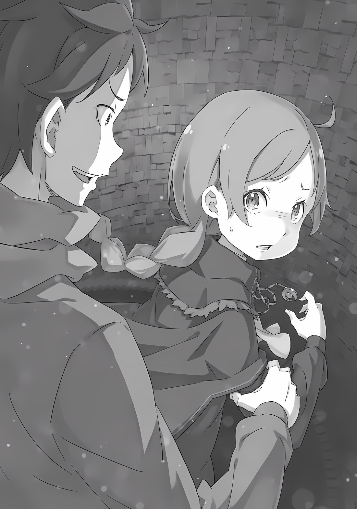

QC: Silly

――Черная, темная, далекая, плотная, глубокая, тяжелая, горькая тьма. «――――» Он чувствовал, как гнетущая, удушающая тьма, которая была словно смесью из всего плохого, обволакивает все его тело.

Его лицо, его тело, его конечности, его кожа — все было испорчено этой тьмой, и она даже сочилась в его кровь, вызывая бесконечный дискомфорт, который сопровождался жгучей жаждой.

Мыслимо это или нет, но ему казалось, что все части его тела были покрыты струпьями.

Его кожа была настолько натянута, что, когда он прикасался к ней, она не ощущалась как человеческая; кончики его пальцев, которые касались струпьев, сами были покрыты струпьями, поэтому он не мог распознать форму своего истинного «Я». ――Нет, в действительности он не понимал не только свой внешний вид. «――――» Что-то еще внутри, как будто его сущность.

Или, может быть, это следует описать как «душу»?

Это было так, словно он потерял из виду форму и состояние своей «души»; после неоднократных и необъяснимых блужданий он, наконец, нащупал ее кусочек.

Но поскольку его пальцы были покрыты, как уже было сказано, струпьями, это было напрасно; он чувствовал беспокойство и то, что можно было назвать чуть большим, чем просто отвращением. Он задавался вопросом, сможет ли он действительно справиться с этим. «――――» Действительно ли он найдет «себя», которого хочет в будущем?

Когда он доберется до конца своего путешествия, не окажется ли он в совершенно другой ситуации? Это странное воображение, но совсем не невозможное. На самом деле, то, что случилось с ним, вызывало аналогичное чувство внезапности и нереальности.

Воспринимая это как свое собственное дело, принимая это как испытание, которое выпало на его долю, он искал сцену, которую предстояло преодолеть. ――Сколько времени он потратил на это? «――――» Вот почему он испытывает сильное беспокойство.

Действительно ли это подходящее место для него? Если ли там место, в котором его примут, увидят понастоящему?

Место, где ему доверяться, где его простят, где ему поверят, где его желают, действительно ли оно есть для «Него»? ???: Я люблю тебя. ――Такое ни с чем не сравнимое беспокойство растаяло от голоса, который, казалось, указал путь, и затих. «――――» ――Он двигался к белому, яркому, высокому, драгоценному, красивому, сладкому, свету.

И душа, Нацуки Субару――

Мгновение спустя, Нацуки Субару проснулся, вытаскивая свое сознание из глубин слабого, глубокого сна.

Субару: “――а" Первый вздох слабо сорвался с его губ.

Он был очень хриплым и будто лишённым жизни, но это был безошибочно звук его собственного голоса. Он понял, что не был перевоплощен в одноклеточный организм, который даже не мог говорить.

Это был один шаг вперед. Теперь, если он сможет быстро подтвердить, что не был существом с совершенно новым набором ценностей―― ???: Ты не спишь, Субару?

Субару: «――――» Звон серебряного колокольчика, который раздался рядом, потряс барабанные перепонки Субару.

Звук ее голоса был прохладно-нежным, спокойносильным, цветуще-прекрасным.

Голос, который он слышал всего несколько минут назад, находясь в ужасном состоянии.

Его сердце подпрыгнуло, когда он услышал его сейчас.

Чувствуя боль в груди, Субару медленно повернулся боком. «――――» ――То, что там его ожидало, было темно-фиолетовым* блеском, глазами, наполненными нежным беспокойством. (imy: Англ переводчики постоянно использовали слово «аметистовый» для цвета глаз, и только сейчас до меня дошло чекнуть японский. Используется , синеватофиолетовый / темно-фиолетовый. Я буду использовать дальше это, но если хотите — верну аметистовый." Субару: ……Эми, лия?

Эмилия: Да, это я. Субару, ты в порядке? Ты можешь встать? Ты можешь говорить?

Субару: Гм…

Когда он окликнул ее по имени, обладательница этих темно-фиолетовых глаз, Эмилия, облизнула губы и наклонила голову. Красивые длинные серебристые волосы струились по ее белым плечам. Казалось, словно сияние луны грациозно плывет в свете; ее героическая красота опалила сердце Субару. ――Откровенно говоря, там стояла девушка, слишком красивая, чтобы думать, что она из мира сего.

Субару: Ум, а……

Как только он осознал это, кровь с огромной скоростью залила щеки Субару.

Его лицо вспыхнуло и покраснело, глаза заплыли, и он потерял голос. Его уши так налились кровью, что заболели, и из него вырвался голос: «Авава, авава……» Эмилия: Авава……?

Красивые брови Эмилии нахмурились от испуга Субару.

Даже этот маленький жест казался произведением искусства с предельной детализацией, написанным художником.

Видя её вблизи, так близко, что он мог чувствовать её дыхание, сердце Субару забилось еще сильнее, причиняя ему боль. «――――» Что это такое? Прямо сейчас, что это?

Это реально? Разве это не мираж или иллюзия? Говоря о миражах посреди пустыни, это чаще всего оазис―― или, другими словами, то, чего вы больше всего желаете в этот момент.

Если следовать этому правилу, то это определено мираж. Какая экстравагантная иллюзия―― Эмилия: Т-ты в порядке, Субару? В конце концов, что-то не так. В конце концов, ты был в обмороке.

Субару: «Бва!» (Возглас удивления) Эмилия: Вот, прямо сейчас, это «Бва»!

Субару был на пике замешательства, и неожиданное прикосновение гладкой ладони на его лбу заставило его плечи задрожать.

Увидев это, Эмилия моргнула, убедившись, что Субару в плохом состоянии; Субару, чья «Теория миража Эмилии» была опровергнута, испытывал то же чувство, что и ученый, чья геоцентрическая теория была опровергнута.

Тем не менее, он определенно почувствовал ощущение контакта. Реальность подтверждала ее существование.

И это не только подтверждало, что Эмилия действительно существовала, но и то, что он сам был Нацуки Субару.

И самое главное―― ???: ――Думаю, пора прекратить этот разговор, игнорирующий Бетти, я полагаю. Боже, беспокоится не только Эмилия.

Субару: «――хк» Услышав жалобный детский голос с другой стороны от Эмилии, Субару обернулся.

То, что бросилось ему в глаза, когда он оглянулся, было маленькой девочкой с мило надутыми щеками―― Субару: Беатрис……

Беатрис: Что за низкий голос, я полагаю…… как будто ты не можешь поверить, что Бетти здесь. Выражение твоего лица говорит о том же самом.

Услышав его слабый зов, Беатрис беспокойно нахмурила брови. Ее слова прозвучали как упрек, но в них слышались глубокие нотки беспокойства и облегчения.

Облегчение от пробуждения Субару и беспокойство о том, что Субару потерял сознание. Создавая такое впечатление, отношение Беатрис―― нет, все ее существование потрясло сердце Субару.

Иными словами―― Беатрис: “――Нья!?” Субару схватил Беатрис, у которой было серьёзное выражение лица, и сразу же прижал ее легкое тело к своей груди. Легкое. Её тело действительно было лёгким.

Не в силах сопротивляться его внезапному действию, Беатрис была полностью заключена в объятия Субару, и ее глаза округлились. На вершине зелёной кровати, покрытой плющом и лианами, Субару изо всех сил удостоверился в ее существовании.

Субару: Беатрис, Беатрис, Беатри-и-ис!

Беатрис: Ч-Ч-Ч-Что, я полагаю!? Что же произошло!? Это слишком неожиданно!

Субару: Ты, ты…… у тебя действительно такое умиротворяющее лицо! Такая миловидность, словно вернулась домой к своим родителям. Я влюблен в тебя Беатрис: Мне хотелось бы думать, что ты не имел в виду это как комплимент!?

Обнимая Беатрис и глядя ей в лицо, Субару искренне это сказал. Покраснев от его действий и слов, Беатрис крепко сжала лицо Субару своей маленькой ладошкой.

Когда маленькие пальчики девочки вцепились в его щеки и уши, наслаждаясь милой болью, Субару понял, что в этом месте действительно и по-настоящему была девочка по имени Беатрис.

Эмилия: Боже! Субару, прекрати валять дурака сразу после пробуждения! Мы ещё даже не знаем, почему ты потерял сознание……

Чувствуя себя немного обделенной, Эмилия резко обратилась к Субару, который был занят тем, что обнимал Беатрис.

Обеспокоенная состоянием Субару, Эмилия попыталась схватить его за плечо, но затем остановилась.

Эмилия: …Субару?

Эмилия была скорее встревожена, чем рассержена.

Эмоции в ее голосе сменились беспокойством. Ее глаза расширились от удивления, когда она посмотрела на плечо Субару, к которому собиралась прикоснуться.

Плечо Субару слабо дрожало, и он всхлипывал.

Субару: "……Уг, ку” Беатрис: Субару? Субару, что случилось, я полагаю?

Бетти прямо здесь. Все в порядке, все в порядке, я полагаю. Тебе не нужно плакать.

Заметив состояние Субару, который издал слабый стон и заплакал, Беатрис полностью стерла цвет хаоса со своего лица и погладила Субару по щеке, которая была запятнана слезами.

Его руки слегка дрожали, пытаясь удержать маленькое молодое тело Беатрис. Беатрис понимала, что причиной тому были тревога и страх.

Поэтому, Беатрис нежно, будто разговаривала с ним, взывала к сердцу Субару.

Ему не нужно плакать. Она здесь. С Субару все будет в порядке.

Эмилия: Не плачь, Субару. Нет нужды паниковать.

Медленно, сделай глубокий вдох и успокойся. Мы с Беатрис прямо здесь, с тобой.

Как и Беатрис, Эмилия утешила Субару на кровати.

Ее рука, которая ранее остановилась в нерешительности, теперь коснулась плеча Субару; голос Эмилии, похожий на звон серебряного колокольчика, уважал действия и решения Субару.

Субару: “――――” Эти двое, их существование и то, какие они есть, не изменилось.

В мире, где все рухнуло, было потеряно и больше не может быть восстановлено, эти двое, которые все еще ставили других и Субару выше себя и оставались благородными даже посреди смерти, не изменились.

Чтобы подтвердить это, найти это и пройти через это на этот раз.

Для того, чтобы Нацуки Субару вернул себе все как «Нацуки Субару»―― Субару: Я, вернулся…

С ситуацией, которая не могла быть более жалкой и позорной; С грязным от рыдания лицом и дрожащим голосом, ――Нацуки Субару начинает новый цикл, чтобы забрать все обратно.

Субару: Похоже, я действительно потерял память в библиотеке «Тайгета». Боюсь, я доставлю вам много хлопот, ребята, так как мы не всегда сможем найти общий язык, но я надеюсь, что вы поймете. “――――” За завтраком, Субару вежливо поклонился перед всеми своими товарищами, которые сидели в кругу.

Реакция каждого на эту сенсационную новость, или, скорее, ковровую бомбардировку заявлений от Субару была разнообразной. Тем не менее, самым глубоким цветом было смятение, а замешательство и горе, казалось, отошли на второй план.

Эмилия: Все очень беспокоятся за Субару. Но, Субару очень беспокоится за нас, так что……

Рам: ……Эмилия-сама может так говорить, но, Сидя рядом с Субару, который склонил голову, Эмилия поддерживала его с задумчивым выражением лица.

Однако, Рам скептически отнеслась к словам Эмилии.

Она сложила руки на груди и уставилась на Субару, прищурив свои светло-розовые глаза, Рам: Рам не видит, что Барусу — тот, кто больше всего беспокоится. Скорее, что это за фарс, Барусу Субару: Это не фарс. Я говорю от всего сердца о своем беспокойстве и правде, действительно честно. Я будто вижу, к какой трагедии это приведет, если я буду слишком упрям и не расскажу об этом, и это разрывает мне сердце.

Рам: “――――” Взгляд Рам становился все более подозрительным после ответа Субару, когда он ответил с мрачным выражением лица.

Наблюдая за их серьезным обменом, Эмилия, которая услышала о его обстоятельствах чуть раньше в зелёной комнате, в панике отреагировала на их напряженный разговор.

Как и в прошлом, Эмилия и Беатрис были расстроены, когда он рассказал им о своей «амнезии», но они приняли это из опасения за безопасность Субару―― Все было как и раньше, только, на этот раз он попросил её прикрыть его на этом признании. ――Выйдя из этой ранее ужасной среды, Нацуки Субару теперь ворвался в совершенно новую среду.

Если говорить в стильной манере, он принял решение снова начать жизнь в другом мире с нуля, но, конечно, реальность не так хороша.

Он был готов к хорошему, но, все могло закончиться в тот момент, когда он впервые столкнулся со «смертью».

Честно говоря, он не мог не чувствовать облегчение и благодарность за то, что до этого не дошло, и что у него появился шанс начать все сначала, «посмертно возвращаясь»―― Однако он не собирался полагаться на это.

Сила «Посмертного возвращения», которая обитала в теле Субару, — это мощная сила, которая способна исказить саму судьбу.

Хотя тот факт, что триггером является «смерть», болезненен для пользователя, Субару, но, если это считать компенсацией за искажение судьбы, то это было бы не менее чем уместно.

Форма компенсации―― да, Субару думал о «Смерти» как ни о чем ином, как о форме компенсации.

Естественно, что столь великая сила нуждается в какой-то компенсации. Конечно, Субару предположил, что это, естественно, относится и к его «Посмертному возвращению».

Высока вероятность, что это имеет ограниченное количество попыток или нужно что-то жертвовать, чтобы повторить это.

Субару не верил в то, что Богиня Судьбы проявила любовь к нему, выдав ему бесконечное количество попыток. Единственные люди, о которые можно с гордостью сказать, что они его любили, — это его родители.

В таком случае, выявление методом проб и ошибок пределов «Посмертного возвращения»―― Что-то такое, как наваливание на себя «смерти», — естественно, это не было вариантом. Не было бы ничего странного, если бы это был его последний шанс.

Если же все строилось на концепции жертвования чемто, то, вероятно, нужно было бы пожертвовать кем-то важным или важной памятью.

К сожалению для Субару, у которого не было воспоминаний, единственными людьми, которые могли бы быть важны для него, помимо его семьи в его родном мире, являются Эмилия и другие, с кем он общался в башне в этом мире.

И когда он подумал об этом―― Субару: «Я не думаю, что исчезновение моей памяти это компенсация за »Посмертное возвращение……« Ужасно думать об этом, но это была вполне реальная возможность. В обмен на »Посмертное возвращение« он лишается своих воспоминаний. Это была довольно порочная идея, но, само по себе »Посмертное возвращение" не было чем-то хорошим.

Но что было самым пугающим, так это то, что даже если это было так, не было никакого способа подтвердить это.

Правда в том, что связь между амнезией Субару и «Посмертным возвращением» была совершенно неизвестна. На данный момент, Субару, который уже четыре раза умирал с тех пор, как узнал о своей «амнезии», не потерял какую-либо память, по крайней мере, насколько он мог судить.

Его память ясна с самого начала, как он проснулся в этой башне, когда он возвращался домой из круглосуточного магазина. ――Он надеется, что в его памяти нет никаких бесчисленных провалов, которые он не помнит.

Рам: ――Эй, ты слушаешь, Барусу И, голос Рам, резкий, как лезвие, вернул Субару к реальности, после того как он полностью погрузился в свои мысли. Под ее пристальным взглядом, из горла Субару вырвалось “Чт……”, Субару: Аа, да, я слушаю. Я знаю, что удивил тебя. Это слишком неожиданно, и я понимаю, что ты не веришь, но……

Рам: Но?

Субару: Я……

Беатрис: У Субару нет никаких причин так дурно врать.

Рам также должна доверять словам Субару, я полагаю.

Беатрис ответила Рам вместо Субару, пока он был занят подбором слов. Сидя рядом с ним, она была полностью на его стороне и верила в его слова с тех пор, как он рассказал об этой ситуации в зелёной комнате.

Рам: Беатрис-сама……

Беатрис: Эмилия не врала, когда говорила свои слова.

Субару действительно тот, кто больше всего беспокоится о потере памяти, я полагаю. Вот почему он даже плакал, как маленький ребенок.

Субару: Упоминание этого эпизода делает разговор немного более неловким На это неожиданное откровение Субару почесал щеку и объяснил причину своих слез «этим». (?) На самом деле это было связано с тем, что он «Посмертно вернулся», что он смог воссоединиться с ними, что ему был предоставлен шанс начать все сначала. У этих слез было много причин, но слезы есть слезы.

Бессмысленно выяснять причину мужских слез.

Как бы то ни было, его благодарность Беатрис, когда она теперь встала на его сторону, была невыносимой.

Как и Эмилия, Беатрис сначала была смущена, когда услышала его историю в зеленой комнате, и ей потребовалось больше времени, чем Эмилии, чтобы понять ситуацию, но она пообещала поддержать Субару своей мудростью и восприимчивостью, которые не соответствовали ее внешности. ――Вспомнив конец последнего раза, когда на лице Беатрис показалось мимолетное облегчение, и вспомнив слова о «Выходе на улицу», Субару почувствовал боль, которая будто сжала его сердце в цепи.

Что, черт возьми, «Нацуки Субару» сделал с Беатрис?

Не зная этого, он чувствовал себя виноватым за то, что полагался на ее доверие. Он напоминал себе, что не должен принимать это как должное и наивно относиться к этому.

Субару: Честно говоря, было бы немного неразумно отвергать теорию о том, что у меня нет причин так прямо лгать о том, что я потерял свои воспоминания, но я надеюсь, что вы это проглотите Рам: Проглотите, говоришь……

Субару: Кроме того, давайте поговорим о чем-нибудь конструктивном. К счастью, мое нынешнее «я» обращено вперед. Я бы с большим удовольствием поговорил о продвижении вперед…… но если у вас есть что сказать, тогда я должным образом выслушаю это.

Под прикрытием комментариев Беатрис, Субару сказал это и снова склонил голову. Чтобы продолжить разговор с Субару, Эмилия также склонила голову, сказав: “Пожалуйста, доверьтесь ему”.

Рам: «――――» Наблюдая за кротким поведением Эмилии, Беатрис и Субару, даже Рам не смогла найти какие-либо слова опровержения. И затем, после рефлексивной реакции в виде шока, последовало обычное замешательство.

Конечно, Рам была не единственной, кто был шокирован объявленной Субару «амнезией». Она проявила наиболее выраженную реакцию, но реакции остальных―― Ехидны, Юлиуса и Шаулы — также совпадали с тем, что Субару уже дважды испытал. “――――” Честно говоря, воссоединение с Эмилией и Беатрис было довольно трогательным, но в тот момент, когда он смог увидеть здесь всех остальных людей сразу, сердце Субару было потрясено до глубины души.

Юлиус, которого он оставил на нижнем этаже вместе с Рейдом. Ехидна, которой оторвало обе ноги и которая погибла, извиняясь за то, что сомневалась в Субару.

Шаула, которую нигде не было видно посреди всего этого хаоса. И, наконец, Рам, у которой были самые сильные подозрения по отношению к Субару, и которую он больше никогда нигде не видел.

Все, все были здесь. Ему была предоставлена возможность еще раз обменяться словами со всеми.

И, прежде всего, тот, кто больше всего волновал Субару в этот момент―― Мейли: ――Однако, Братец действительно тако~ой проблемный человек~ Субару: “――хк”.

Мейли: Что это за реакция~? Делать такое лицо, как будто ты встретил мертвеца, разве это не ужа~асно грубо?

Девочка громко заявила это, так, словно не очень была удивлена, услышав историю Субару.

С темно-синими волосами, заплетенными в косу, молодая убийца в стильном черном наряде―― Мейли.

Мейли Портрут, несомненно, была здесь, двигалась и разговаривала.

Субару: Мейли……

Мейли: Ооо? Ты помнишь мое имя, не так ли~. …… можно сказать, я не знаю, что изменилось в Братце, так что ты забы~ыл?

Субару: ――. Да, это немного сложно? Может показаться, что в данный момент это не проблема для разговора, но если копнуть немного глубже, все довольно запутано. У меня так называемая эпизодическая потеря памяти, поэтому я довольно хорошо помню названия вещей, но мои воспоминания о людях довольно отрывочны.

Мейли: ……Ты имеешь в виду, например, то, что произошло вчера?

Субару: ……Правильно.

Мейли прищурила глаза, а ее голос стал чуть глубже.

Субару колебался лишь секунду над ее вопросом, но ответил, не поддаваясь давлению.

Возможно, он смог бы найти выход с помощью грубого оправдания, но он этого не сделал. Он решил этого не делать. ――Субару должен оставаться честным с ними как можно дольше.

Юлиус: ――Забыл о вчерашнем, хах. Это, это, вот как.

Субару: “――――” Услышав ответ Субару, людьми, кто получил будто больший шок, чем просто от его заявления об «Амнезии», были Юлиус, который пробормотал это, и Ехидна, о которой он слышал, что у них была какая-то подозрительная тайная встреча.

Однако, несмотря на их реакцию, Шаула: Мастер-сама, вы снова потеряли память~?

Сколько раз вам нужно забыть обо мне, что быть удовлетворённым этим? Аах, я Maicching*~ (imy: ?. Как я понял отсылка на «Miss Machiko, — манга, созданная Такэси Эбихарой. Стала известной благодаря откровенному сексуальному юмору». Я не знаю как это перевести.) А затем, сжимая свои пышные груди, Шаула разочарованно поджала губы.

Раньше бредни Шаулы можно было бы пропустить мимо ушей, но теперь, когда он(она?) достиг этого момента, у него сложилось сильное впечатление, что это замечания с тонкой, неуловимой атмосферой.

Субару: Углубляться в твою чушь странно, но, неужели этот твой Мастер-сама действительно продолжал так разбрасываться воспоминаниями?

Шаула: ――? Да, он довольно часто их разбрасывал.

Однажды он проснулся утром и когда я поздоровалась с ним, он спросил: “Еще раз, кто ты такая? Я тебя не помню. Я тебя не знаю” и обращался со мной как с женщиной по-настоящему старомодным способом.

Субару: Хм, если это на таком уровне, то трудно сказать, была ли это просто шутка или нет……

В теории, если бы он сблизился с Шаулой, он вполне мог бы подшутить так над ней в повседневной жизни, чтобы подразнить ее.

Однако Субару также осознает, что есть часть его, которая потеряла память, и предпочла не говорить Эмилии и остальным, что он потерял память.

Существует также способ прикрыться шутками, чтобы скрыть тот факт, что у него действительно нет памяти.

Это так раздражает, что просто убивает. На самом деле, он умирал уже четыре раза, так что это даже не смешно.

Ехидна: Вышеупомянутая амнезия понятна. Честно говоря, я должна сказать, что мне не потребуется много времени, чтобы принять это…… Я думаю, что лучше действовать так, как будто эта башня потенциально может вызвать такое явление, что-то вроде ловушки.

Субару: Наиболее вероятное место преступления Библиотека «Тайгета», где Эмилия-тян нашла меня в обмороке. Это также место, которое богато на истории.

Эмилия: тян……

Субару: “――?” Ехидна начала обсуждение с серьезным выражением лица, и Субару кивнул в знак согласия. Однако посреди всего этого одинокое бормотание Эмилии произвело сильное впечатление.

Ранее она также несколько раз демонстрировала реакцию с таким выражением лица во время разговора с Субару. В конце концов, причина этого все еще оставалась неясной.

Может быть, он упустил из виду что-то роковое? ――Это было, страшно.

Субару: ――В любом случае, все, извините, что удивил вас всех. Я думаю, что бессмысленно говорить, чтобы вы внезапно приняли это и продолжали в том же темпе.

Давайте пока сделаем перерыв. За это время, я схожу принесу воды с Рам или что-нибудь в этом роде.

Выдвинув это предложение, Субару встал. Рам подняла брови на его слова, а Эмилия и Беатрис с тревогой смотрели на Субару.

Однако, кивнув в ответ на взгляды этих двоих, Субару перевел свои черные глаза на Рам, Субару: Пойдем, Рам. ――У тебя просто такой вид, будто ты хотела сходить со мной за водой.

Рам: ――Отвратительно.

И, Рам пробормотала это в ответ на приглашение Субару, отводя взгляд.

Рам: Итак, в чем же был смысл этого фарса ранее? Раз ты вывел Рам, значит, ты собираешься поговорить об этом, верно?

С ведром в руке, Рам и Субару направились к колодцу подальше от места сбора. И как только решив, что они отошли на достаточное расстояние от Эмилии и остальных, Рам задала свой вопрос.

Каждый раз она не принимала всерьез заявление Субару об «амнезии». Речь идет не о доказательствах или упрямстве, а по более важной причине. ――Существование Рем. Любимая младшая сестра Рам, которая продолжает спать.

Беспокоясь за нее, Рам не могла смириться с Амнезией Субару.

Вот почему она упорно отрицала и отрицает Амнезию Субару. Он не знал никаких подробностей, но, несомненно, у Субару была какая-то связь с Рем, когда она бодрствовала.

И это было огромной поддержкой для Рам, для ее существования в качестве старшей сестры.

Вот почему―― Рам: Не вверяй Эмилии-сама и Беатрис-сама слишком важные роли. Это все еще слишком тяжело для Эмилии, не говоря уже о Беатрис. Итак, я отдаю тебе должное за то, что ты подумал о привлечении Рам сюда.

Подробности беседы……

Субару: ――Рам, это правда, что я потерял свои воспоминания. Это не ложь и не план.

Но, Субару пришлось отказать Рам, которая пыталась уцепиться за эту тонкую нить и положиться на нее.

Рам: “――――” Услышав прямые слова Субару, Рам прервала свою речь и прищурилась. То, что обитало в глубине её светлорозовых глаз, — это замешательство, тревога―― и сильная искра гнева Гнев, который мог опалить и сжечь душу Субару. И причиной его существования были ее подозрения в отношении Нацуки Субару.

Субару: Я потерял свои воспоминания. Я знаю имена и отношения всех, кто находится в башне, но я не могу вспомнить ничего, кроме этого. Это тоже правда.

Рам: Прекрати.

Субару: Я действительно разговаривал с Эмилией и Беатрис ранее, но я сказал им то же самое. Мне больше нечего говорить. Прямо сейчас все мои руки пусты.

Рам: Заканчивай, Барусу. Еще хоть слово……

Субару: Я знаю, что мы пришли в эту башню, чтобы вернуть себе многое из того, что у нас отняли. Что мы находимся в разгаре Испытаний. Но это все. Мой мотив……

Рам: Барусу, ещё хоть слово и……

Субару: Также насчет Рем, я, Рам: Барусу――!! «Я не помню», — Вот что Субару душераздирающе сказал Рам.

Рам, которая не хотела прислушиваться к словам Субару, схватила его в гневе, когда услышала извинения Субару.

Субару: “Гу!” Она схватила его за воротник и прижала спиной к стене. Сложно поверить, что в таких тонких ручонках было сколько силы.

В глубине её светло-розовых глаз он видел огонь, который искрил и горел так сильно, будто собирался поглотить Субару и Рам.

В тот момент, когда этот огонь опалит Субару―― нет, опалит Рам, трагедия повторится.

Рам: Каковы твои намерения? Говорить такую, такую глупую ложь!

Субару: Это не ложь…… Для меня, лгать тебе — это……

Рам: Так ты говоришь, что не солгал? Тогда что, по твоему мнению, мне следует делать? Рам должна тебе поверить? Что Барусу забыл Рем…… что-то, такое нелепое!

Субару: Рам……

Ее глаза стали еще острее, и Рам хмуро посмотрела на Субару с такого расстояния, что их губы могли соприкоснуться. Наконец Субару понял, что пылающее пламя скорее вызвано горем, чем гневом.

Ее конфликт был гораздо глубже, чем Субару мог себе представить.

После четырех повторений, Субару, наконец, удалось понять это. Насколько благоразумным нужно быть, чтобы думать, что можно понять эмоции, раны, которые другие таили в своей груди?

Субару осознал это, повторив один и тот же грязный прием четыре раза, в то время как Эмилия и другие поняли это сразу; это казалось ему, ослепительным.

Неспособный просто быть обожженным этим ослеплением, Субару―― Субару: ――Рем, я обязательно верну её.

Рам: “――хк!” Глядя в светло-розовые глаза, Субару влил силу в свое горло и ясно это сказал.

Услышав это, глаза Рам снова расширились от удивления, но ее гнев скрыл это.

Рам: Как ты можешь говорить… Забери эти слова назад, ведь ты, Барусу, забыл о Рем, не так ли!

Субару: Но все равно, я верну ее. Мы вернем Рем, мы вернем мои воспоминания, мы получим то, за чем пришли сюда, мы все это сделаем, и мы все вернемся домой. ――Естественно, мы получим эту награду.

Рам: ――Барусу?

Субару: Это естественно…… Учитывая то, что произошло в этой башне…

Ему было трудно дышать. Тем не менее, Субару исказил свои щеки по другой причине. Рам нахмурилась, увидев реакцию Субару, и её рука, схватившая его, слегка расслабилась.

Почувствовав это, Субару схватил ее за руки и развел их в стороны. Вот так, их тела поменялись местами.

Рам: ――Отвратительно. Отпусти.

Рам, которая теперь была прижата к стене, пристально посмотрела на него и сказала это Субару.

Однако Субару не испугали её слабые слова, в которых не было прежнего превосходства.

Субару: Рам. Я определенно верну и свои воспоминания, и Рем. Для этого, пожалуйста, помоги мне.

Рам: “――――” Субару: Мне нужна сила каждого. «Нацуки Субару», который был здесь до вчерашнего дня, которого вы все знали, возможно, не сказал бы что-то столь жалкое. Но, мое нынешнее «я»……

Юлиус вверил, Беатрис доверяла, Ехидна простила, а Эмилия желала.

Если бы это был «Нацуки Субару», на которого все возлагали надежды, то, возможно, даже один человек смог бы изменить эту тупиковую ситуацию.

Но нынешний Нацуки Субару не мог этого сделать.

Люди в этой башне слишком любили его, чтобы безответственным, сдаваться и жаловаться, что он ничего не может сделать.

Субару: Я знаю, ты не можешь мне поверить, и я знаю, что ты не можешь простить меня за то, что я забыл Рем.

Но сейчас ты можешь оставить этот гнев позади.

Вместо этого, я обещаю тебе.

Рам: Обещаешь…?

Субару: Я обязательно сделаю это. Я буду пробовать снова и снова. Если я нарушу это обещание, тогда я сдамся перед тобой, и ты сможешь избить меня или сжечь, всё что ты пожелаешь.

Рам: “――――” Глаза Рам расширились, и жар гнева в них ослаб. И то, что появилось вместо жара, было другой эмоцией, которая до этого была скрыта.

Уставившись взглядом, Субару отодвинул голову, находясь прямо перед ней―― то есть на том же расстоянии, как и тогда, когда они смотрели друг на друга через ледяную клетку.

Субару: Это моя решимость.

Рам: ……Зачем тебе заходить так далеко? Если Барусу действительно забыл о Рем, он бы так не стремился вернуть её.

Субару: “――――” Рам: Если ты забываешь, все становится пустым. Есть только пустота, все чувства, что были раньше, пропадают. Они исчезают. Любовь, ненависть, тепло, одиночество, все.

Спокойный тон Рам скрывал холодную твердость в её голосе.

Эти слова о пустоте звучали ужасно реальными, вероятно, потому, что она сама это испытала. Вот почему ей трудно поверить в решимость Субару.

Она верила, что невозможно обладать таким сильным желанием, когда тебя охватывает эта пустота.

Субару: Действительно, это так. Мои воспоминания пусты, и чувства, которые мое «я», которое было здесь до вчерашнего дня, испытывало к Рем, все выскользнули из моих рук, но……

Рам: Тогда почему?

Субару: Но я знаю, что ты дорожишь Рем и отчаянно хочешь вернуть ее.

Он видел, как Рам изо всех сил пытается вернуть Рем, свою любимую сестру.

Субару был ошеломлен, когда увидел желание и любовь, которые она так сильно держала. И отчаянная Рам также одна из тех, кого Субару хотел бы спасти―― Субару: Прямо сейчас причина, по которой я хочу вернуть Рем, — это «Нацуки Субару» и ты.

Рам: “――――” Субару: Так что, вот почему, когда я сдамся, тебе решать, что делать. Это мой способ искупить вину за то, что потеряв содержимое моей головы, заставил тебя плакать Рам: Рам никогда не плакала, не валяй дурака.

Субару: Ай, больно!?

Получив сильную пощечину, Субару рухнул на месте.

Положив руку на покрасневшую щеку, Субару посмотрел на Рам так, словно увидел что-то невероятное.

Субару: Т-Ты…… Сейчас, это было довольно смело с моей стороны…

Рам: Что в этом такого смелого? Не смеши меня, говоря, что Барусу дает обещание. Как ты смеешь, когда ты самый ненадежный в этом плане среди всех в мире?

Субару: Это то, что Эмилия-тян мне также говорила, сколько обещаний я нарушил до вчерашнего дня!?

Рам: Я не помню, когда ты в последний раз сдерживал обещание.

Субару: Такой уровень?

После того, как его оскорбили леденящим голосом, Субару снова изменил свое мнение о «Нацуки Субару». В лучшую сторону или в худшую, оно постоянно сильно колеблется, но нарушение обещаний является значительным понижающим фактором.

В общем, если вы даете обещание, то самое меньшее, что вы можете сделать, — это упорно трудиться, чтобы его выполнить.

Люди верят, что человек защитит своё обещание, даже если за ним не наблюдать. Если человек не способен на это, то это служит доказательством того, что он обладает слабым духом.

Субару: Думаю, «Нацуки Субару» — такой никудышный парень, не так ли……

Рам: Да, именно. Наверное, ты неправильно понимал, но Барусу также не был способным человеком, который мог бы справиться со всем самостоятельно. Скорее, он был простаком, и его специальностью было то, что всякий раз, когда он пытался справиться с чем-то самостоятельно, в конце концов он только увеличивал ущерб. Он также был вечной помехой для Рам.

Субару: Ты серьезно? Зачем вы привели такого парня в башню……

Рам: Он был назойлив. К тому же, он был человеком, который довольно хорошо чешет языком. В своём роде ловкий, хорошо справлялся с домашними делами. Он также хорошо заботился об Эмилии и Беатрис. И так далее……

Сидя на земле, скрестив ноги, Субару чувствовал себя слишком неуютно.

Его ругали за то, что его не касалось. Было довольно сложно заставить Эмилию и других говорить приятные вещи о «Нацуки Субару», но Рам же было просто невозможно остановить говорить плохие вещи о «Нацуки Субару».

В этот момент Субару решил задать все возможные вопросы.

Субару: Что еще? Короткие ноги, плохая память, нездоровая диета, упрямый?

Рам: Короткие ноги, плохая память, нездоровая диета, упрямый.

Субару: Вот как~ Рам: ――И он хорошо заботился о Рем.

Субару: “――――” Внезапно тон её голоса изменился, и ледяные эмоций Рам приобрели окраску.

Он был теплым―― если бы у голоса был цвет, то у нее он был бы бледным, но обернутым в мягко-розовый.

Её голос, когда она думала о Рем, о своей сестре, был наполнен привязанностью, и когда она думала о том времени, когда «Нацуки Субару» Был рядом с сестрой, она показала проблеск нежной любви, которая никогда не исчезнет.

Субару казалось, что такой розовый был цветом доброты, нежности.

Рам: Барусу. ――Ты действительно забыл Рем?

Субару: ……Да.

В глазах Рам отражался Субару, и она никогда не отводила их. По-настоящему, уважаемо.

В подобных ситуациях, когда он слышал слова, которые не хочет слышать, Субару отворачивался. И все же она, Рам, ни разу не попыталась отвести взгляд.

Рам: Барусу. ――Ты действительно снова вспомнишь Рем?

Субару: Да, я снова ее вспомню. И не только Рем, но и все остальное тоже.

Рам: Мне все равно, даже если все остальное пропадет.

Просто вспомни о Рем.

Субару: Не говори глупостей. Позволь мне вернуть все обратно……

Рам: Я повторяю. Вспомни только о Рем, даже если это убьет тебя.

Субару: Да, я клянусь. ――Даже если я умру, я снова все вспомню.

Буквально, даже если придется умереть, он все вспомнит.

Что «Нацуки Субару» видел, слышал, чувствовал, создал, чтобы зайти так далеко в этом другом мире. ――Все это Нацуки Субару вернет себе.

Рам: ……Хорошо. На этот раз я закрою глаза.

Когда она услышала его ответ, устрашение, исходящее от Рам, внезапно исчезло.

Почувствовав это, Субару, продолжая сидеть на полу, спросил: «Ты уверена?», Субару: Я знаю, что просил об этом, но тебя действительно устраивает только это?

Рам: Ты мужчина. Отнесись к этому спокойно.

Решимость Барусу была услышана. И вдобавок ко всему, ты даже сказал, что с тобой можно сделать все, что угодно, сжечь, исцарапать, раздавить или избить, если ты сдашься. Если ты не послушаешь меня, я подвергну сомнению по-матерински любящее сердце Рам.

Субару: Я ничего не помню о исцарапать и раздавить……

Рам: Ты что-то сказал?

Субару: Я ничего не говорил.

Покачав головой, Субару вежливо ответил Рам.

Называть ее «По-матерински любящей» было довольно трудно, но, учитывая пословицу «и Будду можно вывести из себя», Субару уже принял свой пятый вызов*, который даже Будда не мог позволить.

Если он не может довериться ни Богу, ни Будде, возможно, было бы хорошей идеей оставить суд поматерински любящему сердцу. (imy: Даже терпение святого в конце концов иссякает, (если вы прикоснетесь) к лицу Будды три раза(*) (он будет раздражен)." Рам: Встань, Барусу. Рам не позволит тебе сдаться или встать на колени.

Субару: Не соединяй их вместе, сидя на земле…… оп Встав, Субару отряхнул зад и повернулся лицом к Рам.

Рам, прислонившись спиной к стене и сложив руки на груди после того, как поправила свою растрепанную одежду, уже вернулась в свое нормальное состояние―― Рам пристально посмотрела на Субару, намекая ему, что это ее “нормальное состояние”.

Рам: ……Ты сказал Эмилии-сама и Беатрис-сама то же самое?

Субару: Эти двое…… Кажется, они даже не думают о том, что я могу сдаться.

Рам: Это и правда так. ――Вина в том, что они заражены Барусу.

Субару: Вот почему я не мог попросить этих двоих. И у Юлиуса и Ехидны, из-за эмоционального уровня.

Эмилия и Беатрис, Юлиус и Ехидна.

Он полагал, что слышал их мысли во время событий, которые произошли в прошлый раз.

Поэтому, он собирался выяснить остальные ответы.

Субару: Но, ты знаешь…… Из того, что ты мне рассказала, похоже, что до вчерашнего дня я был не очень хорошим парнем.

Рам: Для Рам твоя ценность сильно меняется в зависимости от того, есть ли у тебя воспоминания о Рем или нет. Будь осторожен с тем, что говоришь.

Рам повернулась спиной к Субару и пошла, холодно бросив это.

Они вдвоем надолго остановились посреди похода за водой, и если бы они вернулись с пустыми руками, это могло бы заставить Эмилию и остальных странным образом забеспокоиться.

Субару с ведром в руке последовал за Рам и встал рядом с ней.

И, Субару: Я…… «Нацуки Субару», определенно был здесь, верно?

Слабым голосом Субару направил свой вопрос в сторону профиля Рам.

Это было скорее тревожное хныканье, чем поиск подтверждения. Вероятно, это было не совсем правильно говорить сразу после того, как он поклялся не сдаваться.

Неудивительно, если Рам накажет его еще до того, как произнесёт свои слова.

Рам: ――Воистину дурак.

Но Рам не сделала этого, она не остановилась, она со вздохом оскорбила Субару и, Рам: Сейчас, он просто на мгновение скрылся из виду.

Это только кажется, что все пропало, потому что так много вещей накапливается и прячется в глубине.

Подобно цветку, погребенному в холодном снегу, он раскроется, когда снег растает. ――Я уверена, что это все, что нужно.

Да, Субару не мог показать свое нынешнее выражение лица Рам, которая скрывала свое собственное.

Он не мог показать такое жалкое лицо сразу после того, как поступил так смело.

Вот почему образ Рам, ничего не говорящий и даже не поглядевший на него, в этот момент действительно казался Субару по-матерински любящим.

Ситуация в значительной степени изменилась―― по крайней мере, ему хотелось так думать, но перемены были не столь велики.

Это был не первый раз, когда Субару раскрывает о своей потере памяти, и шок, которые все почувствовали, был тем, что он уже видел.

Но, если он изменит свое мышление и займет другую позицию, то и то, как на него смотрят другие, тоже изменится.

В прошлый раз Субару подозрительно относился к Эмилии и остальным, подвергая сомнению каждое их движение, отношение и комментарий. Он предполагал, что они, должно быть, что-то замышляют.

Однако, если убрать фильтр подозрительности, то в каждом аспекте их действий, отношений и заявлений можно увидеть их заботу о Субару и, в основном, их самобичевание.

В конце концов, они сознательно сдерживали себя и старались не заставлять Субару чувствовать себя неловко.

Проблема Субару заключалась только в том, что он считал такое поведение подозрительным и неестественным.

Субару: Сделай это как следует. Сделай это правильно, Нацуки Субару……

Сказав себе это, Субару взглянул на свою ладонь.

Весьма вероятно, что причина потери памяти Субару связана с «Тайгетой». Хотя важно было пройти Испытания, но также необходимо срочно выяснить причину потери памяти.

Не было никакой гарантии, что в конечном итоге это не перерастет в нелепую ситуацию, когда все забудут друг друга и начнут при встрече говорить «Приятно познакомиться, кто вы?» Кроме того, он не думал, что может позволить себе быть слишком медлительным.

Субару: В прошлый и в позапрошлый раз внутри башни царил беспорядок.

В позапрошлый раз Субару последовательно обнаружил «Мертвые тела» Эмилии и других―― нет, всех, кроме Эмилии и Беатрис.

В прошлый же раз все было по-другому, он своими глазами увидел «Смерть» своих товарищей, и его сердце погрузилось в отчаяние и разруху.

Однако все эти аномалии были катастрофами, которые должны произойти в башне в близком будущем.

Как человек, который знал об ущербе, причиняемом этими бедствиями, Субару должен попытаться предотвратить их.

Для этой цели он должен посвятить всю силу, которой обладал. ――Вот почему, во-первых, Субару, ???: “――――” За спиной Субару, стоявшего на большой высоте, послышалось слабое дыхание.

Если вы осознаёте, вы сможете уловить край присутствия, который умеренно пытается скрыть себя.

Он почувствовал это нарушение правил со своим предварительным знанием и обернулся как раз вовремя. ???: "――хк”.

Субару: Воа, это было опасно. ――Не упади вместо меня.

Когда его вытянутые руки взметнулись в воздух, импульс удара заставил его противника упасть вперед, и Субару быстро использовал свои вытянутые руки, чтобы поддержать его тело и оттащить назад, чтобы он(противник) не упал.

Это тело было легким. Легкость, которая уместна внешнему виду молодой девочки―― да, назвать ее молодой девочкой было бы правильно.

Субару: Хорошо, давай поговорим. ――Я попрошу тебя взять на себя ответственность за то, что ты убила меня.

С этими словами Субару улыбнулся девочке, которую схватил за руку―― Мейли, и обрушил свой кульминационный вывод на виновника, который дважды толкнул его в прошлом.

