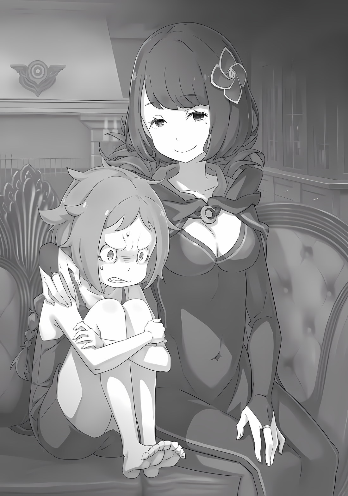

QC: Silly японского, поэтому, разумеется, возможно я что-то не так понял.

Мейли: «――――» Удерживая её тело, которое чуть не упало с винтовой лестницы вниз, девочка―― Мейли, удивлённо посмотрела на него.

Глядя в ее большие, раскрывшиеся глаза, Субару не мог не испытывать смешанных чувств по поводу завершения ситуации, в которой он до конца сомневался.

Он был рад, что смог вернуться к жизни с помощью «Посмертного возвращения» и в конце концов предотвратить трагедию. Тем не менее, теперь к тому же было доказано, что именно эта маленькая девочка дважды толкнула его в прошлом, в разное время.

Подумать только, что преступником, который столкнул Субару с высоты и обрек его на гибель―― был тот, кто в прошлый раз был убит руками «Нацуки Субару», Мейли Портрут.

Мейли: ……«Ответственность за то, что убила меня», опять ты говоришь странные вещи, Братец~ На мгновение ее глаза расширились с намеком на тревогу, но Мейли тут же разжала губы, провела пальцами по руке Субару, обвивающей ее торс, и очаровательно улыбнулась.

Затем она отступила назад и повернулась лицом к Субару, держась на расстоянии от винтовой лестницы.

Мейли: Возможно, помимо потери воспоминаний, что-то ещё случилось с тобой. Иначе бы этого недоразумения бы не случилось~ Субару: Недоразумения?

Мейли: Да, ты так не думаешь~? ――Это ужасное недоразумение, что я пыталась убить Братца~ Сцепив руки за спиной, Мейли сказала это с невинной улыбкой на лице. Увидев ее наглое отношение, Субару опешил.

Он не думал, что она посмеет уклониться, даже когда её поймали на месте преступления. Тем не менее, это сопротивление понятно, если это /я/―― Нет, если это Мейли.

В лучших случаях она действует решительно, в худших

— оппортунистически.

Она выбирает лучшее решение для каждой ситуации, и таков ее образ жизни.

Грубо говоря, именно таким и должен быть «Зверь».

Мейли: Мне не нравится мысль, что меня подозревают.

Если бы я действительно хотела убить Братца, мне было бы легче сделать это в дюнах, чем в башне, не так ли~?

Ох, ты ведь не помнишь, так что, возможно, не поймешь~ Субару: Да, верно. Это странная история, это точно.

Если бы ты с самого начала хотела убить нас, у тебя было много возможностей сделать это. Но, ты этого не сделала.

Мейли: Всё так~. Тогда…

Субару: Тем не менее, вопрос о твоей мотивации убить меня, прорастающей и растущей с сегодняшнего утра, это совершенно отдельный вопрос. Правильно ли я говорю, — это цепная реакция из-за того, что произошло прошлой ночью?

Мейли: «――――» Выражение лица Мейли изменилось после того, что упомянул Субару. Она сжала губы, стерла улыбку, а затем глубоко вздохнула.

Затем, пожав плечами с неприязненным видом, не соответствующим ее внешности, Мейли: Похоже, меня подставили?

Субару: Что ты имеешь в виду под “Подставили”?

Мейли: Ты ведь сделал это специально, верно? Солгал о своей потере памяти, чтобы посмотреть, толкну ли я Братца…… Чтобы устранить любые препятствия, которые могут возникнуть на вашей стороне. Чтобы увидеть, насколько я полезна в этой башне? ……Это было бы идеальное время и шанс, чтобы сделать это.

Девочка, которая пыталась подтвердить подлинность ситуации, была недовольна своим невыгодным положением.

На самом деле, даже если у него не было таких плохих намерений, Субару действительно следил за поведением Мейли. Отрицание этого факта ничего не изменило бы в сознании Мейли.

Однако есть одна вещь, которую он мог сказать наверняка. То есть―― Мейли: Что ж, и что же ты собираешься делать со мной?

Почему бы тебе просто не вышвырнуть меня отсюда, чтобы поквитаться? Так как плохих животных-чан сейчас со мной нет, ты легко сможешь позаботиться обо мне сам, верно~?

Субару: Не пойми меня неправильно, Мейли. Моя потеря памяти — это не ложь, чтобы обмануть тебя. Это реально, и это серьезно.

Мейли: Я действительно думала, так ли это, но, тогда…… В конечном счете, так что Братец собирается делать? Думаешь, что сможешь почувствовать месть без действий?

Субару: “――уг".

Сказав это, девочка обхватила руками свою тонкую шею и высунула язык.

На мгновение сердце Субару сильно подпрыгнуло в груди от этого действия. Однако эта насмешка не значила, что она вспомнила о собственной смерти; это было просто ироничной метафорой убийства.

Если подумать, она мелкая убийца, которая каждый раз делает что-то критическое для чувств Субару. Итак, Субару не хотел мстить, но―― Мейли: Я не рекомендую убивать долго~. Отчасти потому, что я не хочу страдать, но также и потому, что Братец, похоже, не о~очень хорошо умеет что-то скрывать……

Субару: ――Я не собираюсь убивать или причинять тебе боль. Даже после этого, и завтра тоже, что бы ни ждало, я намерен обращаться с тобой так же, как и до сих пор.

Мейли: Ха?

После ответа Субару, выражение лица Мейли вновь изменилось.

Однако этот случай принципиально отличался от предыдущего изменения, когда она смогла сразу выбрать следующее лучшее решение. На лице Мейли отразилось явное смятение, и она посмотрела на Субару глазами, полными непонимания.

Субару кивнул в ответ на ее пристальный взгляд.

Субару: К счастью, твое преступление было предотвращено, так что мы, причастные к этому преступлению, могли бы притвориться, что ничего не было, чтобы сохранить это в секрете. Если мы просто избежим этого, ты могла бы подумать о том, чтобы убить меня по-другому, поэтому мне пришлось бы предотвратить и это преступление. Если ты думаешь, что это дурная идея, я не могу этого отрицать. Извини.

Мейли: А…… Ч, что……

Субару: Но, ну, ты поняла на этот раз? Для тебя также довольно рискованно пытаться иметь дела со мной.

Если это так, то знаешь что? Давай хотя бы поговорим об этом. Если ты несчастна, я сделаю все возможное, чтобы выслушать тебя……

Мейли: Несчастна? Несчастна, говоришь……

Внезапно Мейли прошептала это тихим, дрожащим голосом: Затем, крепко сжав свои губы, Мейли: Несчастна, сейчас, я несчастна только от этой ситуации! Я не могу в это поверить!

Используя все слова, которые он мог подобрать, Субару пытался убедить её найти мирное решение. Однако, в ответ Мейли повернула свои неверящие глаза к Субару и рявкнула.

Мейли: Я не могу в это поверить, я не могу в это поверить, я не могу в это пове~ерить……

Рыча это, ее руки деловито перебирали собственные косы.

Это была ее попытка сохранить ментальное состояние посреди замешательства―― Субару мог видеть, что это был признак ее зависимости от кого-то, у кого была такая же стрижка.

Мейли: Сейчас, что я пытаюсь сделать, Братец понятия не имеет! Было бы странно, если бы он это понимал.

Было бы странно, если бы он……

Ее слова запинались, и она отчаянно жаловалась на неестественность происходящего.

Это был первый раз, когда Субару видел ее такой расстроенной―― нет, он определенно видел ее однажды такой в «Книге мертвых».

Вчерашнее событие, встреча с Субару в «Тайгете», расстроило ее, затем она поговорила с «Нацуки Субару» и решила убить Нацуки Субару, который потерял память.

Однако наспех разработанный план его убийства, должно быть, был обоюдоострым мечом и для нее.

У самого Субару не было возможности узнать, после того, как его толкнут и он упадет насмерть, как ей сойдет с рук убийство после смерти Субару?

Конечно, всегда существовала вероятность, что это будет расценено как случайная смерть. ――Нет, они не могли не узнать.

Теперь, когда он знал Эмилию, Беатрис, Рам и других, Субару был уверен, что они не оставят правду о его «смерти» без ответа.

В таком случае, преступление Мейли было бы неизбежно раскрыто.

Рам, Юлиус и Ехидна были намного умнее Субару и смогли бы раскрыть правду, не умерев ни разу. Он не мог даже представить, что Мейли не подумает о таком.

Итак, это―― Субару: Ты решила сделать это просто под влиянием момента. Просто, у тебя убийство вошло в привычку. Ты просто не можешь придумать других вариантов решения проблем. Это не твоя вина.

Мейли: ――КХ! Не говори так, как будто ты понимаешь!

Братец…… ты! Что ты знаешь обо мне?!

Субару: ――Я знаю.

Мейли: «――――» Разъяренная и сжавшая зубы Мейли напряглась, как будто ее окатили холодной водой.

Глядя прямо на нее, Субару сделал сильное и решительное заявление.

Субару: Мейли. Я знаю, кто ты. Это может показаться неприятным, но, возможно, в мире нет других людей, которые знали бы тебя лучше, чем я.

Он пожал плечами и сказал это; слова Субару заставили Мейли выглядеть ужасно испуганной.

Он принимал это как должное, но в то же время у Субару был неоспоримый факт этого―― Он также боролся с этой искаженной «любовью к себе» глубоко в своем сердце.

Искушение «Я», которое повторялось много раз, чтобы её запомнили.

Шепчущий голос, казалось, эхом отзывался прямо перед тем, как Нацуки Субару пытался предпринять какиелибо действия, неоднократно соблазняя Субару решить свои проблемы с помощью убийства, худшего способа, наполненного трусостью.

Прочитав «Книгу мертвых», Субару идентифицировал внутри себя умершего человека, призрака, Мейли портрут, которая искушала его―― Субару: «――Нет, это не так» Субару покачал головой; Он перекладывал вину на девочку, которую убил. "В этот момент я не в своем уме. Посмотри на замешательство и разочарование девушки перед тобой.

Прежде всего, вспомни «Книгу мертвых» Мейли, которую видел сам." Учитывая боль, которую она испытывала, у нее не могло быть личности, которая могла бы удобно предложить убийство.

Это была не та Мейли, которую он увидел в Книге мертвых.

Это была просто уловка его слабого ума.

В доказательство этого, девочка с голосом ни разу не появлялась перед Субару, ни разу.

Субару: «――――» В те дни была пустота, которую Мейли не могла видеть, переживание, которое вызывало у нее «страх», который соперничал с размером пустоты, и только одна сияющая привязанность.

И имя этой привязанности было―― Субару: ――Эльза Гранхирт.

Мейли: «――хк» Субару: Вот почему ты пыталась убить меня, ведь так?

При этом вопросе выражение лица Мейли исказилось горечью.

Это был гнев из-за того, что он прикоснулся к месту, к которому он не должен был―― Нет, это был гнев из-за того, что он наступил туда, куда ни в коем случае и никогда не должен был ступать.

Но Субару осмелился это сделать. Потому что, Субару: Есть обычай в семье Нацуки — снимать обувь, входя в чей-то дом, но заходить в сердца других без всякого стеснения.

И как член этой семьи, Нацуки Субару без стеснений зашёл в сердце молодой убийцы.

Глубоко внутри неё есть фактор, который толкает ее на импульсивные акты насилия.

Убийца в черном, которую Нацуки Субару не знал, но чувствовал невероятно близким.

Когда он думал о ней, он чувствовал облегчение, тоску, горе, гнев и пустоту―― Чувства, которые Мейли испытывала к ней, были такими сложными и в то же время такими простыми. ――Мейли, тосковала по Эльзе, любила ее и восхищалась ею.

Вот почему она почувствовала печаль, боль, ненависть, ярость, жажду убийства и разочарование, когда у нее её отняли.

Тот факт, что она сопровождала Субару и остальных в их путешествии, не показывая этого, был актом мести―― Она была недостаточно хороша, чтобы сказать это.

Скорее, можно сказать, что неуклюжесть Мейли была чрезвычайно высокой.

Она была девочкой с печальной историей, которая была настолько невежественна в эмоциях, что даже не знала, насколько глубоко было ранено ее собственное сердце. ――Она была искусным убийцей, созданным ее окружением, вот кем была Мейли Портрут.

Субару: Ты хотела отомстить, так?

Мейли: ……Я не знаю.

Субару: Даже если бы ты сделала это, Эльза никогда……

Мейли: Я не хочу этого. Я знаю это.

В ответ на вопрос Субару Мейли дважды подряд покачала головой.

Субару мог понять, что чувствовала Мейли. И Мейли также понимала, что слова Субару попали точно в цель.

В этой ситуации Мейли и Субару были равны.

Вот почему, переполненная чувствами, с которыми она не знала что делать, не зная правильного ответа и оказавшись в тупике, у нее не было другого способа развеять эти сомнения, кроме «убийства», к сожалению.

В то же время, она ненавидит мир, который дал ей только такую возможность.

То, как Мейли сгорала от любви к Эльзе, невозможно было изменить.

Эльза, возможно, была светом для Мейли, но идти по пути, освещенному этим светом, слишком сложно для обычных людей.

Субару: Я знаю, что тебе трудно справиться со своими чувствами. Но ответ, который ты ищешь, вероятно, не может быть найден таким образом. Вот почему…

Мейли: «――――» Субару: Оставь это мне. Я не сделаю ничего хуже. По крайней мере, я постараюсь не усугубить ситуацию.

Если ты, тоже, поверишь в это.

Мейли: ……Я не могу в это поверить. Чтобы Братец не говорил, это лишь слова.

Выслушав уговоры Субару, Мейли, которая держала лицо опущенным, даже легко не кивнула.

Естественно. Это требование изменить образ жизни, который был у неё на протяжении всей жизни, найти образ жизни, которого нет в словаре.

Вдобавок, человеком, который предложил это, был Нацуки Субару, который по той или иной причине, читал ей лекции с очень знающим лицом.

К тому же, даже Субару, готовый к тому, что его сбросят, если бы его пригласил товарищ в подобное место, счёл бы это подозрительным.

Так что, ожидая подробное, он приготовил более лучший план.

Субару: Когда люди говорят, что не могут поверить моим словам, я очень сожалею об этом. Очевидно, до вчерашнего дня я был обычным нарушителем обещаний, так что……

Мейли: Так что?

Субару: Вместо обещания между тобой и мной, давай дадим обещание между тобой и нами.

Мейли: «――――» Услышав слова Субару, Мейли нахмурилась, непонимая его намерения.

Однако ответ на ее сомнения был обнаружен вскоре после этого.

Это было―― ???: Ммм, все в порядке. Я тоже внимательно слушала, и я свидетель его обещания.

Мейли: “――хк”.

Услышав этот голос, Мейли, вздрогнув, резко обернулась. Затем, краем глаза, она увидела невероятную красоту, девушку, которая настолько хороша, что сложно не сомневаться в ее существовании.

При ее появлении глаза Мейли расширились, а губы задрожали.

Мейли: Сестра…… ты, все слышала? ???: Субару попросил меня быть тут. ……Он попросил меня остановить тебя в случае опасности, вот что он сказал.

Говоря это, Эмилия вышла к ним, и от света ее серебристые волосы мерцали, как отблеск лунного света, а ее фигура была похожа на отрывок из мифа.

Услышав слова Эмилии, Мейли удивлено повернула голову.

Мейли: Если бы я сделала что-то опасное……? Нет, Братец……?

Эмилия: Да, если бы Мейли сделала что-то опасное. Это то, чего ты хотел, верно, Субару?

Субару: ――. Аа, да, именно так. Просто кое-что заставило немного забеспокоиться.

Эмилия: ――? Почему ты отворачиваешься от меня?

Субару, что случилось?

Субару: Нет, просто, это слишком красиво, чтобы смотреть прямо……

Когда Эмилия склонила голову набок, Субару ответил приглушенным голосом. Эмилия, не слыша, что он говорит, углубила угол наклона шеи, но Субару замаскировал свое смущение кашлем и снова обратил свое внимание на сбитую с толку Мейли Поскольку Субару предвидел нападение, он был уверен в том, что остановит преступление Мейли. Проблема заключалась в появлении «Нацуки Субару» Если, гипотетически говоря, целью «Нацуки Субару» во время цикла, в котором была убита Мейли, было защитить себя от попытки убийства, не было никаких гарантий, что сразу после того, как он предотвратил её преступление, «Нацуки Субару» не предпримет действия против воли Субару.

Поэтому Субару решил, что оставит эту проблему людям, которые сильнее его.

Даже если бы он потерял сознание и появился «Нацуки Субару», он был уверен, что Эмилия――Нет, он верил, что его друзья смогут что-то с этим сделать.

Эмилия: Послушай, Мейли. Я верю тому, что сказал Субару. Если Мейли не может в это поверить, тогда просто внимательно наблюдай за ним. И, если он нарушит обещание, я разозлюсь на него.

Мейли: Наблюдать за Братцем……? Это странно. Это так странно. Но ведь Братец и Сестра должны наблюдать, за мной……

Эмилия: Мейли попытается сделать что-то плохое только если Субару нарушит свое обещание, так? Тогда нужно следить за тем, сдержит ли Субару свое обещание или нет. В таком порядке, верно?

Мейли: «――――» Слова Эмилии, которая наклонилась чтобы оказаться на уровне ее глаз, смутили Мейли.

В ее сознании факты, ситуации, меры и решения перемешались в беспорядке.

Субару: Ты чуть не сделала кое-что не то, но хорошее спасение, сделанное мной и Эмилией-тян, каким-то образом предотвратило это. Так что у тебя появился шанс узнать, что тебе следовало сделать. Можешь ли ты воспользоваться этим шансом и каким-то образом найти способ сделать что-то другим способом, кроме как убить меня? ……Спорим?

Мейли: Спорим……?

Субару: Когда ты разберешься со своими беспорядочными эмоциями, ты все еще будешь чувствовать, что должна убить меня или нет? ……Я также сделаю все возможное на уроках этики.

Почесав голову, Субару указал такой путь растерянной Мейли.

Честно говоря, было бы излишним говорить, что это не его дело. У Мейли есть образ жизни, который был у неё до сих пор, и Субару взял на себя смелость попытаться добавить к нему новые возможности.

Однако, если она откажется это сделать, ее путь будет закрыт в этой песчаной башне. С тем, как она воспитывалась до сих пор, она не сможет пересечь эту песчаную башню вместе.

И―― Субару: Я не позволю тебе сойти с этого поезда. Я не знаю точно, сколько тебе лет, но…… когда я был в твоем возрасте, мне очень помогали окружающие взрослые.

Мейли: «――――» Субару: Поэтому и я постараюсь помочь тебе, даже если ты этого не хочешь. Ты не знаешь, что делать. Ты все еще слишком молода, чтобы отвергать руки вокруг тебя.

Когда он сказал это, Субару сократил расстояние между ним и Мейли на один шаг.

Увидев, как сокращается между ними дистанция, у Мейли задрожали плечи. Как бы то ни было, Мейли встревоженно подняла глаза, и Субару без колебаний похлопал ее по голове.

Он не собирается душить эту тонкую шею. Он собирается предложить другое решение, чем «Нацуки Субару».

Мейли — девочка, которой не нужно умирать. И―― Эмилия: Я искренне прошу, пожалуйста, доверься Субару…… Доверься нам, Мейли.

Мейли: “――а”.

Эмилия обняла Мейли сзади, а Субару гладит ее по голове, и она не могла пошевелиться. Она нежно обняла Мейли, которая слегка прикусила губу, и Эмилия прижилась щекой к ее щеке.

Эмилия: Эта песчаная башня — слишком маленькое место, чтобы ты могла решить что-то большое.

Мейли: «――――» Эмилия: Покинь это место. Получи ответы на вопросы в более крупном месте. Мы будем действи-и-ительно усердно работать.

Учить ее чувствам, будучи запертой в такой клетке, было не совсем лучшим решением.

Даже стараясь подобрать правильные слова, Субару не смог придумать сказать что-то подобное; Эмилия сказала это Мейли нежными и искренними мыслями.

Мейли: «――――» В ответ Мейли несколько раз задумчиво моргнула, прежде чем сказать, Мейли: Эльза…… Я не хочу, забывать о ней Субару: Ах, все хорошо. Тебе не нужно забывать о людях, которых ты любишь. Просто, ну, в общем……

Оборвав свои слова на этом, Субару подумал о красивой женщине в черном, которую он видел в «Книге мертвых».

Какое странное впечатление. Хотя между ними не было никакой связи, ему казалось, что он очень хорошо ее знает. По какой-то причине Субару бессознательно погладил себя по животу, вспомнив этого человека.

Субару: «――Даже если я тебе нравлюсь, я надеюсь, что ты не будешь копировать мои методы» Да, вот что она бы хотела. ――Только после десятков секунд молчания, Мейли бессильно и нерешительно кивнула.

