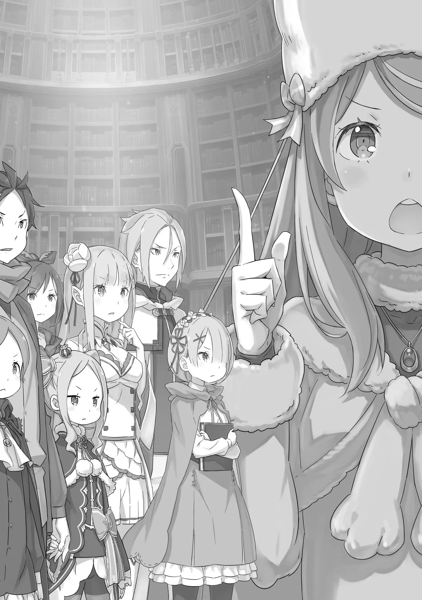
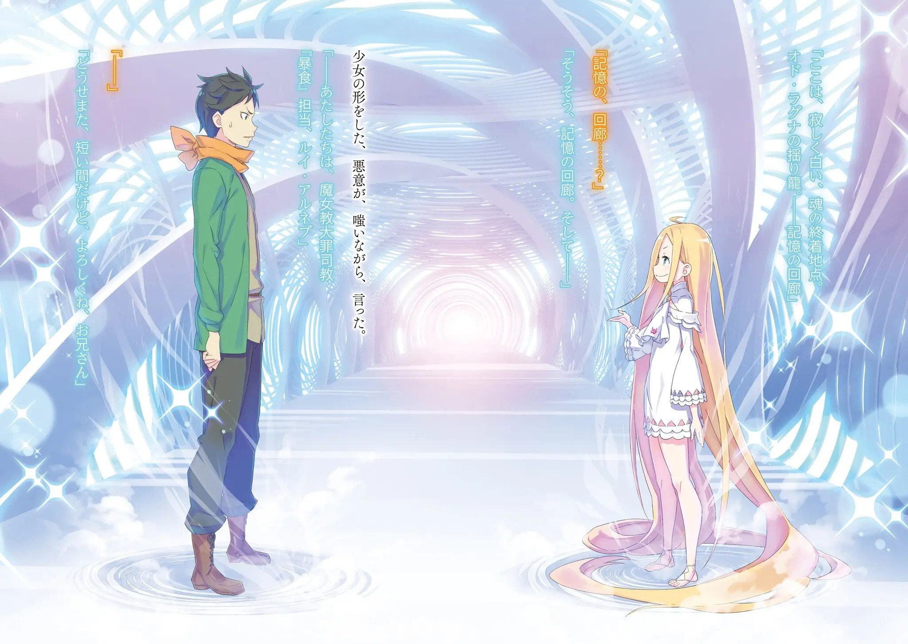

――Это есть это, Сие есть сие.

Их разговор закончился таким образом, и Субару с Юлиусом разделили странное чувство.

Честно говоря, он не был уверен, что смог бы помочь Юлиусу с его сложными чувствами. Он не мог не думать, что существовали более лучшие слова, более совершенный способ, более красивый способ обращения с ним.

То есть, не с помощью диких выводов вроде «Это есть это», а более элегантных слов, которые могли переписать абсурдную реальность.

Юлиус: Но, это вполне в твоем духе. Хорошо это или же плохо, хах.

Субару: ……вот как? Я не уверен, насколько то, что я говорю, типично для меня, и насколько это совпадает с тем, что я говорил до вчерашнего дня, но это в значительной степени имеет отношение к моей нынешней идентичности.

Юлиус: Что касается самоутверждения, то некоторое время назад я тоже был очень сильно потрясен. Позволь мне, как человеку, который прошел через такое же затруднительное положение, дать совет. ――Это есть это, Сие есть сие.

Субару: Ой, да заткнись уже!

Тонко смеясь, Юлиус подшутил над их недавним разговором, и Субару, не выдержав, рявкнул на него.

В самом деле, похоже, Юлиус смог немного восстановить свое истинное эмоциональное состояние; Хоть питчер был незрел и неопытен, способности кетчера спасли его.

Во всяком случае, пока эти двое общались подобным образом―― Шаула: ――Мастер-сама~, вы закончили~?

Субару: О? Шаула?

Позади них, выглядывая сверху лестницы на третий этаж, Шаула окликнула его.

Заглядывая вниз со своей черной косой, свисающей с плеч, и пышными грудями, прижатыми к полу(?. — пол), она смотрела на них.

Субару: Почему так скромно? Ты разве была такой персоной, хм?

Шаула: Ну, когда Мастер-сама разговаривает с кем-то наедине, он часто сразу переходит к сути дела*, верно~? Ах, вы давным-давно сказали мне держаться от вас подальше, потому что мое присутствие испортило бы настроение, вот я и последовала вашим словам~. Вы что, забыли…… о, точно, Мастер-сама ведь все забыл~!

Субару: Удар убеждения* и порча настроения…… (Игра слов, которую невозможно перевести. Шаула говорит (): суть, сущность, существо (дела и т. п.), а Субару (): уверенность, убеждённость / убеждение, вера) Субару озадаченно нахмурился от слов Шаулы, которая открыто засмеялась. Прежде чем Субару успел отреагировать, произнеся «оп», Шаула спрыгнула с лестницы на одном дыхании.

Шаула перепрыгнула более чем через двадцать ступенек и беззвучно приземлилась на пол. Сломя голову, она бросилась к Субару и прижала его руку к своей груди.

Субару: Я уже много раз говорил тебе, не делай так.

Эмилия-тян неправильно поймет.

Юлиус: Хмм. Эмилия-сама?

Субару: Не делай это «хмм». Знаешь, все же есть небольшая вероятность. Даже если это что-то столь незначительное, как поиск иглы посреди пустыни, это не ноль.

Говоря это, Субару с силой разжал руки Шаулы. Увидев его отношение, «Аах», щеки Шаулы разочарованно надулись.

Шаула: Мастер-сама такой по~подлый. Обращаетесь так со мной, когда я, ах, жажду тепла~ Субару: Если ты жаждешь тепла, прижимайся к Мейли или Беатрис. Они обе дети, и у них высокая температура тела…… Несмотря на то, что Беатрис четыреста лет, она все еще довольно теплая.

В свете шокирующего факта, который недавно был раскрыт, и того факта, что он уже подтвердил это, обняв ее много раз, Субару был потрясен энергией маленькой девочки Беатрис.

В заключение, маленькая девочка оставалась маленькой девочкой, сколько бы лет она ни прожила.

Шаула: Хммм. Тогда, я даже не буду отчитываться перед таким бессердечным Мастером-сама. Ваш ученик басту~ует. Руководство должно прислушиваться к работникам~ Субару: Ах, боже, хорошо, хорошо. Я сделаю все возможное, чтобы улучшить условия труда, поэтому, позволь мне выслушать твой отчет.

Шаула: Сомнительно, что вы действительно что-нибудь с этим сделаете~. Ах, но я отвечу, потому что я милый, честный ученик! ――Мы нашли книгу Рейда~ Субару: ……ха?

Покачав плечами и заставив свою косу подпрыгнуть, словно указывая на свою милоту, Шаула с улыбкой сказала это.

Резкость её слов заставила Субару вытаращить глаза.

Реакция Юлиуса не отличалась, у него они также расширились.

Юлиус: Мисс Шаула, только что, что вы сказали?

Шаула: Как — я — и — сказала, мы нашли книгу Рейда.

Ах, и я думаю, что было бы лучше сжечь книгу с именем этого подонка как можно скорее~. Верно, Мастер-сама?

Субару: Ха, ха, ха……

Шаула: Хахаха? Мастер-сама, это смех~?

Шаула слегка наклонилась и посмотрела прямо в лицо Субару. Глядя в ее простодушные черные глаза, Субару открыл рот.

И закричал.

Субару: ――С этого и надо было начинать!!

Эмилия: Ах! Субару, смотри! Мы нашли книгу Рейда!

Когда Эмилия заметила Субару, показавшегося со стороны лестницы, она вспыхнула в мгновение ока и сказала об этом своим похожим на серебряный колокольчик голосом.

Радуясь, она указала на Рам, которая держала толстую книгу. По-видимому, это и была «Книга мертвых» Рейда.

Он был удивлен, что они нашли её так быстро.

Куда бы он не посмотрел, везде лежали книги―― он не знал, как долго эта библиотека существует, но если здесь действительно находятся записи всех умерших людей в этом мире, то такое ощущение, что книг здесь столько же, сколько звезд на небе, и это не метафора.

Субару: Среди всех, так быстро нашли нужную нам книгу, молодцы. Я же в это время консультировал* Юлиуса…… в терапии*? Ароматерапии*?

Эмилия: Каунсеирингу*? Ах, я действи-и-ительно не понимаю, но, хе-хе-хе, вероятно это что-то потрясающее? Но, это не я нашла её. (Субару сказал это на английском(катакане)) Выпячив свою грудь, Эмилия гордо сказала, что эта заслуга принадлежала не ей.

Что это означало? Почти сразу стало понятно, что она имела в виду: Эмилия легонько подтолкнула темносиневолосую девочку, которая обнимала ее за талию, и, Эмилия: Это Мейли нашла её. Хороший подвиг, да?

Субару: В наши дни никто не говорит «хороший подвиг»…… Но, кроме этого, я рад, что Мейли нашла её!

Это, несомненно, выдающееся достижение! Хорошая работа.

И, в ответ на слова Эмилии, Субару также похвалил неожиданно достойного человека.

Мейли, которая обнимала Эмилию за её тонкую талию и которую та гладила по голове, смущённо отвернулась от слов Субару.

Мейли: Н-ничего особенного. Просто, я случайно указала на неё, потому что это была первая книга, которую я увидела~. Я всего лишь нашла её немного раньше, но не думаю, что это имеет большое значение~ Субару: Не говори глупостей. Ты можешь гордиться тем, что сделала. Так держать, Мейли. Теперь, ты погасила тот случай, когда пыталась столкнуть меня, и вернулась из минуса к нулю!

Мейли: Вернулась с помощью чего-то столь простого!?

Субару погладил Мейли по голове, которая удивленно раскрыла глаза. Хоть Мейли это и не понравилось, «Ты растреплешь мне волосы!», щеки Субару расслабились.

Субару: Все в порядке. В любом случае, давай просто скажем, что это была всего лишь попытка, и ты компенсировала ее этим большим достижением.

Мейли: «――――» Субару: Итак, книга Рейда…… никто её ещё не читал, верно?

Казалось, будто Мейли хочет что-то сказать улыбающемуся Субару, но, тем не менее, она все же осталась с закрытым ртом.

Держа ее нерешительность на краю своего поля зрения, Субару повернул тему к книге, которую обнаружили.

Книга, которую держала Рам―― Рисунок на корешке книги был символами, которые Субару не мог прочитать.

К тому же, на первый взгляд, вокруг книги не было такого же странного ощущения, как вокруг Рейда.

Субару: Несмотря на то, что он такой необычный, книга абсолютно ничем не выделяется, хах?

Рам: Если бы переплет был бессмысленно разукрашен или название агрессивно самоутверждалось, её было бы легче найти. Нам очень помогло, что Мейли нашла её.

Субару: Смотри, смотри, Мейли! Даже Рам хватит тебя!

Рам! Вот эта Рам! Ты действительно можешь гордиться этим…… «Гхе» Рам: Заткнись.

Субару рухнул на месте, когда её пальцы вонзились ему в бок. Рам, которая таким образом заставила Субару замолчать, слегка встряхнула книгу в своих руках, и, Рам: То, что случилось с Барусу. Если бы мы повели себя как Барусу и сделали что-то столько преждевременное, и наша память тоже бы пропала, у нас были бы огромные проблемы. Вот почему её никто ещё не открывал.

Субару: Н-ну, мы еще не подтвердили, что именно книга заставила мою память исчезнуть……

Рам: “Ха!” Рам презрительно засмеялась над его собственным неубедительным заявлением.

В действительности, вероятность того, что амнезия Субару и «Книга мертвых» не связаны между собой, очень сильно близилась к нулю. И теперь, когда нужная книга была найдена, неизбежно возник бы спор о том, как с ней обращаться.

Беатрис: Итак, мы благополучно нашли книгу. Теперь, нам просто нужно выяснить, каким образом мы её используем, я полагаю.

Думая о том же, о чем Субару, Беатрис высказала это вслух.

После ее слов, все в библиотеке почувствовали напряжение, которое омрачило радость от нахождения книги. Это была книга, которая при неправильном обращении могла вызвать потерю воспоминаний. Это ничем не отличалось от того, как если бы им сказали принять подозрительное зелье неизвестного происхождения. Было естественно испытывать чувство сопротивления.

Ехидна: Что ж, давайте поговорим о предполагаемых опасностях.

Субару: Предполагаемые опасности…… У тебя есть какие-то идеи, Ехидна?

Ехидна: Я просто предполагаю, основываясь на том, что произошло, и на той небольшой информации, которой я располагаю.

Сказав это, Ехидна, пожав плечами, подняла руку.

Затем, подняв указательный палец вверх, Ехидна: Во-первых, опасности «Книги мертвых»…… Как показывает нынешняя ситуация Нацуки-куна, есть вероятность, что можно потерять свою собственную память. По-видимому, согласно рассказу Нацуки-куна, выплескивающиеся воспоминания отрывочны…… В таком случае, было бы точнее сказать, что оставшиеся воспоминания фрагментированы.

Количество, которое выплеснулось было больше, чем количество, которое осталось. Слова Ехидны были верны.

Однако, небольшое отклонение от истины здесь заключалось в том, что Субару использовал потерю и остатки памяти в качестве камуфляжа, чтобы скрыть свое «Посмертное Возвращение».

Действительно, в самом начале Субару на самом деле потерял всю память―― Он потерял их, но с небольшой оговоркой: Он потерял воспоминания, которые обрел в этом альтернативном мире.

В связи с этим, лучше стоило предположить, что воспоминания пропадают не на своё усмотрение, а полностью. Амнезия Субару была лучшим прецедентом только потому, что он не потерял себя.

Что, если бы он потерял не только свою эпизодическую память, но даже самого себя?

Когда он подумал об этом, его передернуло. ――В то же время, внутри Субару возник вопрос: почему он потерял воспоминания только о другом мире?

Ехидна: Также можно предположить возможную причину потери памяти. Во-первых, память теряется как плата за прочтение «Книги мертвых». Но, это трудно себе представить из-за разницы в случаях между Нацуки-куном, который однажды прочитал книгу, и Юлиусом, который также прочитал книгу.

Беатрис: ……Я не хочу думать об этом слишком много, но, возможно, теряется лишь несколько воспоминаний.

Скорее всего, объем прочитанного пропорционален количеству потерянной памяти, я полагаю.

Юлиус: Я согласен. Иначе говоря, разница между моей ситуацией и ситуацией Субару заключается в разном количестве книг, которые мы прочитали…… Это совпадет с действиями Субару прошлой ночью, как засвидетельствовала мисс Мейли.

Субару: «――――» Беатрис возразила на рассуждения Ехидны, с чем затем согласился Юлиус.

Внимательно впитав разговор сообразительных членов, Субару кивнул в знак согласия с их рассуждениями.

Субару: То есть, может ли быть так, что количество прочитанных книг как-то связано с потерей памяти?

Ехидна: Вполне можно так считать. Если мы подтвердим это рассуждение, то те из нас, кто никогда не читал «Книги мертвых», должны будут прочесть «Книгу мертвых» Рейда. Нацуки-кун и Юлиус, которые уже однажды прочитали их, могут быть в опасности.

Субару: «――――» Перед ними встали два противоречивых мнения: то, что следует прочитать её опытным людям и то, что следует прочитать её неопытным людям.

Обе идеи имеют смысл, и трудно представить, что какая-то из них ошибочна. Но вот тут-то и возникает его беспокойство―― Субару: Тогда, как насчет меня, который уже однажды потерял воспоминания? Если условием потери памяти является накопление информации от Книг мертвых, был ли я обнулен? Или нет?

Рам: Это серьезная проблема. Я не могу себе даже представить, что мне придется вновь проходить через это объяснение, если воспоминания Барусу ускользнут…… Одна только мысль об этом заставляет содрогаться.

Субару: Само то, как ты это говоришь, заставляет меня содрогаться!

Эмилия: Нн…… Я тоже действи-и-ительно беспокоюсь об этом. Я не хочу, чтобы Субару снова забыл разные вещи.

Эмилия и Рам подтвердили свои опасения за Субару каждый по-своему.

Правда заключается в том, что они ничего не знают. Они не знают, у кого вероятность пропажи воспоминаний больше, у тех, кто уже читал их ранее, или у тех, кто еще этого не делал.

Хотя он не мог сказать этого в открытую, Субару помнил, как читал «Книгу мертвых» Мейли в предыдущем цикле. Считается ли это за то, что он уже прочитал одну книгу на этот раз?

Мейли: ……Что~о? Ты смотришь на меня так, как будто думаешь, что это нормально — позволить мне прочитать её, чтобы искупить свои грехи, х~м? А~а~й.

Субару: Разумеется я бы так не поступил. Не говори глупостей, или я тебя ударю.

Мейли: Это жесто~око. Обращение с военнопленными хуже, чем было в особняке~ Субару отругал Мейли за несмешную шутку в ответ на его пристальный взгляд на нее. При этих словах Мейли надула щеки и схватила Эмилию и Шаулу за руки, чтобы спрятаться за ними.

Это совершенно меркантильно(?), но для детей лучше быть такими милыми. Субару рассмеялся над поведением Мейли и повернулся к Ехидне.

Субару: Итак, у тебя есть какие-нибудь другие идеи?

Ехидна: Нет, ты прав. Эту книгу должны прочитать либо мы, свободные духом но не опытные по сравнению с Юлиусом, либо Юлиус, который уже имеет опыт, или же Нацуки-кун, который однажды переполнился……

Субару: Могу я сделать невероятно эгоистичное заявление? ――Я думаю, что я лучший кандидат на эту роль.

Беатрис: Субару…

Беатрис схватила Субару за руку, когда он сказал это перед Ехидной, которая вывела список кандидатов.

Субару подмигнул девочке, в взгляде которой было больше беспокойства, чем тревоги.

Беатрис: Сейчас не время для скверных шуток. Субару, твои воспоминания уже……

Субару: Нет, разумеется я не хочу терять воспоминания.

Но, с точки зрения управления рисками, это правильное решение. Как бы вы не считали, я тот, кто с наименьшей вероятностью подвергнет всех опасности в результате потери памяти. Я самый слабый среди нас.

Нет, правильнее сказать, что он слабее всех, кроме Мейли; ни для кого не секрет, что он не смог бы победить кого-либо другого.

В случае чего, его будет легко усмирить, и так как он уже однажды потерял память, с этим будет легко справиться.

Проблема лишь в том, что у Субару уже есть четыре круга накопленных воспоминаний, которые он ни за что не может потерять.

Вот почему―― Субару: Я не желаю и не намереваюсь забывать. Но мы команда. Каждый должен что-то делать для всех остальных. «――――» Субару: Юлиус отвечает за борьбу, Ехидна отвечает за интеллигентность, Рам отвечает за едкие замечания, Мейли отвечает за милоту, Беатрис отвечает за прекрасность, Эмилия-тян отвечает за красивую героиню, а Шаула отвечает за фотомодельные сцены; Если так думать, то я должен отвечать за это.

Беатрис: Почему-то мне кажется, что ты перечислил слишком много бесполезных позиций……

Шаула: Верно! При затемнении сцены, важно снимать сцены, показывающие привлекательность женщин! Ах, я готова снять одежду ради искусства и Мастера-сама!

Субару: Нет, если ты снимешь еще что-нибудь, я просто уйду, так что можешь не стараться так сильно.

Шаула: Лестница пропа~ала!* (: Слово, которое означает впасть в состояние одиночества/изоляции после того, как тебе польстили и рядом нет никого, кто мог бы встать на твою сторону.) Присутствующие здесь понимали, что это был способ Субару успокоить их. Первым, кто вздохнул от слов и действий Субару, была Беатрис, которая держала его за руку.

Она глубоко вздохнула и уставилась на Субару своими глазами, Беатрис: Боже, если Субару становится упрямым, то он всегда такой непреклонный, я полагаю. Эта твоя часть не изменилась, даже когда ты потерял память. Один лишь опыт с Мейли уже произвел такое впечатление, я полагаю.

Субару: Хехе, но, я тебе нравлюсь таким, ведь так? Я щас покраснею~ Беатрис: Не увлекайся!

Раскрасневшаяся Беатрис безжалостно хлопнула его по бедрам.

Тем не менее, в ее словах не было и намека на отрицание. И, похоже, что все, кроме Беатрис, думали также.

Рам: Если ты забудешь свое обещание данное Рам, я тебя раздавлю.

Субару: Почему именно сейчас, когда я призносил такой приятный монолог, ты решила сказать это!?

Рам: Действительно, почему.

Фыркнув, Рам прижала книгу, которую держала в руках, к Субару.

Почувствовав серьезную, но приятную тяжесть на своих руках, Субару горько улыбнулся Эмилия: Даже если ему сказать не быть безрассудным, Субару все равно будет безрассуден. ……Я думаю, что это очень несправедливо с его стороны. Я всегда беспокоюсь о нем.

Субару: Я ничего не могу, кроме как извиниться. Но, так же сильно, как Эмилия-тян беспокоится обо мне, я так же беспокоюсь о тебе… что я щас сказал? Интересно, не слишком ли это дерзко…?

Эмилия: Я рада, что Субару так думает. Поэтому, я действи-и-ительно запутанна. Ты определенно вернёшься…… если мы пообещаем друг другу это, то Субару нарушит это обещание, поэтому, я не буду обещать.

Субару: Тот факт, что вы все так сильно не доверяете мне, заставляет мое сердце биться сильнее. Что вчерашний я успел натворить?

Пожав плечами в ответ на радостные слова Эмилии, Субару спросил окружающих его людей, «Эй?». После этого, все, кроме Шаулы и Мейли, отвернулись.

Помимо Беатрис и Рам, которые находились в том же лагере, что и он, похоже, что нарушенные обещания Субару распространились и на Юлиуса с Ехидной. Он был действительно серьезным рецидивистом.

В любом случае―― Субару: Я собираюсь прочитать её. Никаких возражений, верно?

Ехидна: ……В конце концов, любые дальнейшие рассуждения будут просто излишней подозрительностью. Если бы я могла, то в идеале выбрала вариант с наименее опасными ставками для всех здесь присутствующих.

Ехидна виновато опустила брови глядя на Субару, который слегка приподнял книгу.

Не было никаких сомнений в том, что ее слова были правдой и что она действительно пыталась позаботиться обо всех. Вот почему Субару мог честно сказать ей «Не беспокойся об этом», Субару: Что ж, думаю, настало время нанести удар. Если у меня пропадет память, немедленно положите меня на лед и прочтите мне серьезную лекцию.

Беатрис: Никто не будет так груб с тобой……

Субару: Я знаю. Потому что ты добрая.

С хлопком, Субару погладил встревоженную Беатрис по голове и слабо оттолкнул ее пальцем, надавив на ее широкий лоб. Беатрис недовольно надула щеки и сделала один шаг назад.

И когда все взгляды сосредоточились на нем, Субару сел на пол, скрестил ноги и сделал очень глубокий вдох. ――На коленях у него лежала «Книга мертвых» Рейда Астрея.

Субару: «――――» Сосредоточившись, можно было почувствовать определенную зловещность в книге.

У него было похожее чувство, когда он попытался прочитать книгу Мейли, ее «Книгу мертвых», но устрашение, которое он испытывал от этой книги, было чем-то большим. Интересно, зависит ли это от того, чью книгу он взял? ――Интересно, о какой жизни он сейчас будет читать?

И смогут ли воспоминания Субару выдержать это? «――――» Положив руку на обложку книги, Субару один раз посмотрел на всех, кто наблюдал за ним.

Беатрис, Мейли, Рам, Ехидна, Юлиус и Шаула. Все они наблюдали за ним.

И―― Эмилия: ――Субару.

Субару: Ну что ж, я ухожу. Я могу вернуться немного поздно, так что, можете начинать ужинать без меня.

Эмилия: ……дурак Провожаемый улыбкой Эмилии, Субару перевернул обложку «Книги мертвых».

Мгновенно, написанные слова словно ожили, и информация начала входить в мозг Субару будто через его глазные яблоки. Затем, через мгновение, его сознание было поглощено книгой―― ――Его сознание отрезало от Библиотеки, и погрузилось во тьму.

――Чувство, которое у него возникло, когда он прочитал «Книгу мертвых» Мейли, было довольно смутное.

Сцены, которые она видела, путь её жизни, по которому она следовала, были по-своему ясны.

Однако, на самом деле, все эти сцены он смотрел словно своими глазами, будто сам это проживал; грубо говоря, он сливался с заглавным персонажем «Книги мертвых», и был вынужден заново пережить его субъективные мысли и косвенный опыт.

Проще говоря, путешествие по содержанию «Книги мёртвых», — это ассимиляция с другим человеком.

В тот момент, Нацуки Субару, который шел по содержанию книги, был «Мейли Портрут».

Вот почему сознание Субару всегда преследовало странное самосознание /меня/, несущее тень Мейли.

Если такова сила «Книги мертвых», то то, что Субару должен был увидеть в этот момент, — это жизнь Рейда Астрея, его субъективный мир в непостижимой форме мыслей.

Что он думал, что ему нравилось, что ему не нравилось, что он любил, что ненавидит, что он совершил.

Он должен был стать единым целым с философией Рейда Астрея и увидеть его жизнь своими глазами.

Поэтому, Субару сразу заметил нечто ненормальное. ――Место, где он сейчас был, определенно не было прошлым Рейда.

Субару: ……а?

Он стоял в белом-белом месте.

Вокруг него простиралось широкое, бесконечное белое пространство правды и лжи, и Субару, не понимая, где он находится, растерялся.

Он мог видеть свои руки. Он мог видеть свои ноги. Когда он повернул шею, его туловище и бедра тоже были там.

Другими словами, тело Субару находилось тут. Явления, которые происходили с ним в «Книге мертвых» Мейли, не совпадали с текущей ситуацией. Он был брошен в неестественную ситуацию, которая не соответствовала его ожиданиям.

Судя по всему, одежда Субару была такой же, как и тогда, когда он решил прочитать «Книгу мертвых».

Было ли это результатом того, что разум Субару осознавал «текущую ситуацию» в такой форме, или какая-то другая воля, подобная воле духа книги, работала над воссозданием Субару в такой форме?

Он не хотел думать о том, что его тело было похищено в этот момент, когда он читал книгу, но―― ???: О~ох? Братец, ты снова пришел сюда?

Субару: “――хк".

Внезапно, Субару услышал голос, который не был его собственным и принадлежал третьей стороне, и его плечи дёрнулись.

Голос раздался сзади; Субару инстинктивно нырнул вперед и осторожно развернулся по кругу. Увидев судорожные действия Субару, глаза человека сзади округлились.

Субару: ――Ты?

Увидев этого человека, Субару пробормотал это себе под нос в замешательстве и недоумении.

Это была встреча с кем-то совершенно неожиданным, с кем-то, кого Субару никогда не представлял, с кем-то, кого он не знал.

Там стояла девочка, которую Субару никогда раньше не видел.

У неё были светлые волосы, похожие на прозрачные золотые нити, и которые были длинные, действительно длинные. Они растекались по белому полу, заполняя пространство вокруг ног девочки и словно создавая золотое море.

У нее были большие круглые голубые глаза и белое тело, похожее на полупрозрачный фарфор. С другой стороны, ее тело было облачено в поношенную одежду, которая выглядела так, словно она была сделана из плохо сотканной тонкой ткани, что портило ее прекрасное впечатление.

Субару: «――――» Это была девочка, которую он, разумеется, никогда раньше не видел.

Однако, Субару прищурился на фигуру девочки и грубо протер свои веки тыльной стороной ладони. Это был жест, словно он пытался восстановить свое затуманенное зрение, но фигура девочки никуда не пропадала.

И вновь, он видел незнакомую девушку. ――Ему показалось, будто он почувствовал слабую пульсацию в памяти. ???: Немного расслабился, братец?

Субару: Это место…… Нет, ты? Что я должен спросить первым? ???: Ты такой жадный, братец. Но, я не возражаю, что ты хочешь спросить и то, и другое. Мы очень любим жадных людей.

Затем, губы девочки горизонтально раскрылись и она рассмеялась над сбитым с толку Субару.

Да, это была улыбка, которую можно было описать только как смех.

Девочке было на вид от тринадцати до четырнадцати лет, но она производила впечатление еще более юной.

В сочетании с ее аккуратной внешностью, несомненно, улыбка подошла бы ей, но все же.

В глазах Субару ее улыбка казалась зловещей.

Как будто его инстинкты подсказывали ему, что душа девочки пренебрегла над огромным количеством жизней.

И затем, пока Субару слабо дрожал перед ней, она рассказала, ???: Это место, — одинокое, белое, финальное назначение души. Колыбель Од Лагуны. ――Коридор воспоминаний.

Субару: Коридор воспоминаний……? ???: Да-да, коридор воспоминаний. И―― Глаза Субару широко раскрылись от незнакомого термина.

Удовлетворенная реакцией Субару, девочка, заговорила.

Злоба, в облике девочки, смеясь, сказала, ???: Мы — Архиепископ Культа Ведьмы, отвечающий за «Обжорство», Луис Арнеб.

Субару: «――――» Луис: И вновь, хоть и на короткое время, приятно познакомиться, Братец.

