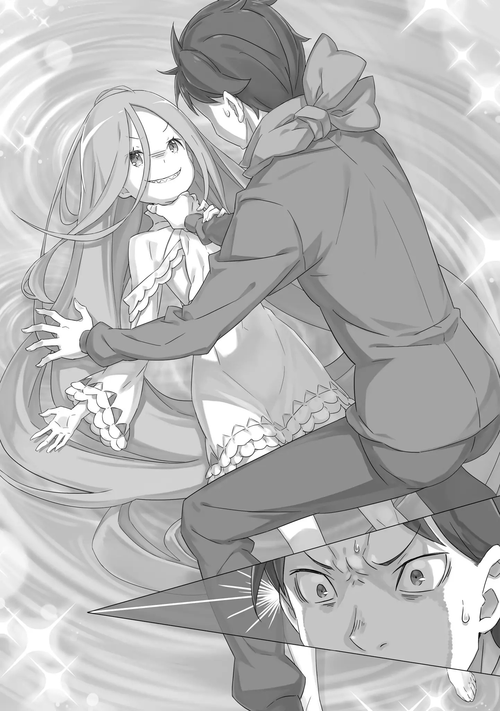

――Коридор воспоминаний и Луис Арнеб.

Субару: «――――» Стоя перед девочкой со светлыми волосами, Луис, которая ответила на его вопрос, Субару хранил молчание.

В белом пространстве, которое он совершенно не ожидал увидеть, он случайно встретил девочку, которую он также совершенно не ожидал увидеть. И эта девочка со всезнающим лицом, казалось, была готова рассказать ему абсолютно все―― Субару: ……Во-первых, что такое Культ Ведьмы, «Обжорство» и taizaishikyō*? (Видимо, он не понял, что она сказала и говорит . Это (архиепископ (смертного) греха) на катакане. не представляю как это передать на русском.) Луис: “Ахааа ~цу” Субару сложил руки, и наклонив голову спросил это; Луис приложила руку ко рту и расплылась в улыбке.

Если вырезать только этот момент, то фотография этой девочки, посреди фантастического белого зрелища, могла стать одной из самых популярных, но, несмотря на это, с самого начала, инстинкты Субару громко били в колокола.

Полагаться на инстинкты выживания Субару, было, вероятно, почти бесполезно, ибо он вырос в современной, мирной Японии. Однако, раз уж даже они поднимали тревогу, то, само собой разумеется, эта девочка обладала воистину уникальным присутствием.

Кроме того, это было наполовину неизбежно, ведь он был застан врасплох непредвиденными обстоятельствами, но также―― Знаний Субару об этом всезнающем существе было совершенно недостаточно.

То же самое касалось и Культа Ведьмы, Архиепископов Греха, и, раз уж на то пошло, Од и Коридора воспоминаний. Возможно, это было нечто общеизвестное в этом мире, но, к сожалению, у Субару не имелось даже таких базовых знаний.

Поэтому, задавать конструктивные вопросы было трудно―― Луис: ――Если говорить просто, то Культ Ведьмы — это собрание людей, ненавидимых всем этим миром.

Субару: о?

Луис: Даже кто-то такой, как Братец, должен был слышать имя Ведьма Зависти, верно? Культ Ведьмы тесно связан с Ведьмой-сама…… Ты можешь думать о Культе как о религии.

Субару: ……Тогда, твои недавние слова означали Архиепископ Греха? (В этот раз правильно, ) Сочетание слов «Смертный грех» и «Архиепископ» вызывало очень сильное чувство противоречивости, но вкусы Субару сразу поняли, что значило это название.

Во всяком случае, услышав это один раз, сразу становилось понятно, Субару: Понятно, это злодейские имена Луис: Нет, это не так, абсолютно нет, совершенно точно нет, ты говоришь неверно, это не так, Братец.

Качая головой в знак отказа, Луис обняла свое тонкое тело. Хоть она и отрицала это, улыбка даже не собиралась исчезать с ее губ, — вероятно, это отрицание носило лишь формальный характер.

Она девочка, чьи истинные намерения невозможно увидеть. ――Нет, правильнее сказать, она неопределённа и неуловима.

Луис: Не издевайся над невинной девочкой такими словами, Братец. Нам ведь тоже бывает больно, понимаешь? У нас более хрупкое и уязвимое сердце, чем у других.

Субару: Совсем не убедительно. Кроме того, это множественное первое лицо — твоя особенность? Или ты просто пытаешься выглядеть крутой, как армия из одного человека? Говорить «мы» или «нас» не очень уж стабильно.

Луис: А~ах…… Не беспокойся об этом. Коротко говоря, внутри слишком много эго, и мы не уверены, какое из них будет главным. Я* уже порядком подустала от этого. (Как я понял, она всегда употребляет «мы», но, из-за разных условностей, придется делать так. учитывайте это в дальнейшем.) Сказав это, Луис слегка опустила взгляд, «Но,» Луис: С этим ничего не поделаешь, верно? Ведь это подарок от онии-тяна и нии-самы, и если я не приму его как следует, я не смогу называться сестрёнкой. Ведь братья и сестры не могут не помогать друг другу, правда?

Субару: ……Ты очень милая младшая сестра, внимательная к старшим братьям. Я был единственным ребенком, так что, я несколько завидую.

Луис: Вот как? Может, у Братца уже есть младший брат или сестра?

Субару: Не могла бы ты не говорить ужасные вещи!? Я не хочу это даже представлять!?

Как бы то ни было, его родители были достаточно близкой парой, так что, подобное могло быть даже не шуткой.

Если бы родители Субару обнаружили его пропажу, то следующий ребенок―― нет, это невозможно. «――――» Если он исчезнет, его родители будут продолжать искать его, пока не найдут.

Интересно, что чувствовала его мать, когда ее сын, уходя, не попрощался? Что почувствовал его отец, когда узнал об этом?

Вот почему, во что бы то ни стало, Субару хотел, чтобы его призыв в другой мир был реинкарнацией.

Вместо того, чтобы его родители испытывали боль от поисков своего пропавшего сына, он бы предпочел, чтобы они знали, что Субару умер и попал в альтернативный, другой мир. Это было бы намного проще. Гораздо, гораздо большее спасение.

Вот почему―― Луис: ――Мы понимаем, Братец.

Субару: ――хк! Не шути так!

Субару разозлился на Луис, которая обхватывая руками свои волосы, заглянула в его лицо.

Она высказала эти слова не из-за того, что он говорил в слух о том, что его сейчас беспокоило. Просто она увидела его мрачное выражение лица и сказала это так, как будто понимала чувства Субару.

Это его ужасно разозлило, поэтому Субару выкрикнул на Луис и повернулся к ней спиной.

Субару: Ты понятия не имеешь, что я чувствую! Так своевольно говорить что-то такое……

Луис: ――Ты чувствуешь вину перед отцом и матерью, не так ли? Ты сожалеешь, что не смог даже попрощаться с ними, и ты сожалеешь, что был таким непочтительным сыном. Нет, ты всегда сожалел об этом. И сейчас, и раньше, верно?

Субару: «――――» Продолжая говорить в понимающей манере, словно строя из себя гуманиста, Луис слегка обняла Субару изза спины.

Маленькое, легкое тело. Субару задержал дыхание и напрягся.

Но дело было не в том, что девочка прижалась к нему.

Дело было в содержании её слов.

Эта понимающая речь, определено, угадала, что чувствовало сердце Субару.

Луис: Откуда мы это знаем? Это ведь уже решено, верно? Просто нет никого, кто знал бы Братца так же хорошо, как мы*. ( — Мы и мы. Одно для Луис, другое для других.) Субару: ――Не прикасайся!

Луис: «Ан» Луис поджала губы, когда Субару, стряхнув её руки и отстранившись от неё, со вздохом повысил голос.

Что, черт возьми, это значит? Неужели все неизвестные женщины этого мира без колебаний вступают в контакт кожа к коже с мужчинами? Это слишком непринуждённо.

Он боялся, что может случайно отдать свое ослабевшее сердце теплу этого тела.

Субару: Что ты хочешь! Что ты пытаешься сказать!

Луис: Мы просто хотим, чтобы Братец почувствовал спокойствие, вот и все. Все в порядке, все в порядке. Ты должен как сле~едует поставить точку этим прилипшим мыслям об отце и матери. Даже если это односторонне, надо встретится лицом к лицу. Сердце должно расслабиться и открыться.

Субару: «――――» Со смехом, Луис вцепилась ногтями в свою левую руку правой рукой. Со скрежетом, она начала царапать свою тонкую белую руку с такой силой, что на это было больно смотреть.

Когда Субару нахмурился от её действий, Луис показала ему свой длинный, ужасно красный язык, Луис: Якобы совершенно здоровый. Выглядишь так, словно ты ничего не держишь на душе. Ты искусен в этом, Братец. Как жаль, что ты такой.

Губы Субару изогнулись в ответ на ужасный, душераздирающий комментарий.

Дальше, чтобы не позволить ей прилипнуть к нему, он должен прилипнуть к изменениям звона своих инстинктов и следовать им, Субару: Я не совсем понимаю и не знаю, что ты пытаешься сказать, но ты делаешь мне больно, так что, прекрати. Ладно, давай продолжим наш кетчболлразговор. Однако, никаких быстрых мячей. Давай стараться бросать только крученые.

Луис: Взаимно?

Субару: Взаимно. Да, например…… давай продолжим недавний разговор об Архиепископах Греха.

Дальше, чтобы случайно не поддаться интонации Луис, Субару перевел разговор на другую тему.

Если он правильно понимает, что taizaishikyō Архиепископ Греха, то он имеет некоторое представление о том, какую связь имеют слова смертных грех и «обжорство».

Субару: Если ты Обжорство, то, где-то есть еще шесть подобных тебе людей, я прав?

Луис: Если учитывать Онии-тяна и нии-сама, то будет ровно шесть? Ахх, точно, недавно этот список уменьшился на двоих, то есть, сейчас четыре человека.

Эх, хорошо если эти двое умерли быстро.

Субару: ……судя по этому тону, у вас не было особого товарищества.

Луис: Это ведь естественно, верно? Хоть мы и называем себя Архиепископами Греха, так или иначе, мы всего лишь кучка людей, которых ненавидит весь мир. Мы совсем как Ведьма, только зовемся по-другому.

Сказав это, Луис села, сложив колени. Когда она сделала это, ему показалось, словно её длинные золотистые волосы погружались внутрь пола, что было очень странно.

Субару немного смутился, но потом сел рядом, стараясь не задеть ее волосы, и наклонив голову, «Ведьма?», Субару: Ты имеешь в виду ту ведьму, которая обычно бывает в разных сказках, и описывается как действительно страшная и ужасная?

Луис: Как и следует ожидать, мы не хотим, чтобы нас путали с Ведьмой Зависти, ведь её натура намного хуже. В остальном мы идентичны. По сути, Ведьма и Архиепископы Греха — это одно и тоже, просто разные имена. Просто никчёмных людей, которые совместимы с ведьмовскими факторами, в разное время и в разных положениях называют по-разному.

Субару: «――――» Луис: Ны~ынешний Братец забыл о Ведьмах, Архиепископах Греха и даже о нас, так что, может быть, это и не имеет значения в любом случае. Мы понимаем, мы действительно понимаем, мы хорошо понимаем, но потому, что мы понимаем, именно потому, что мы понимаем, именно потому, что мы так хотели понять……

Субару: Заткнись.

Луи: “Ах”.

Устав от этих слов, что обрушались на него, как волна, Субару остановил ее и положил руку на подбородок.

Почему-то он почувствовал, что ему говорят что-то важное. Хотя все это не имело смысла для Субару, казалось, что ему не придется возвращаться к Эмилии и остальным без какого-либо урожая.

Однако сейчас Субару размышлял не о наличии или отсутствии причин для такой заслуги.

То, о чем сейчас размышлял Субару, было неизбежным и неизвестным чувством дискомфорта от ответов Луис до сих пор―― Нет, это чувство было ему известно.

Если этим ответам и была какая-то причина, то ответ, который приходил ему в голову―― Субару: Ты, возможно, кто-то вроде Бога?

Луис: Бога…… ах, вот что? Кто-то вроде того, кто реинкарнирует в альтернативный мир? Я ничего не знаю об этом, но это не имеет к нам никакого отношения. Несомненно, это место может вызывать странные чувства, но…

Хихикая и смеясь, Луис, командуя своими светлыми волосами, развернулась на месте, указывая на пустой белый мир своими мягко развевающимися волосами.

Луис: Это место такое, каким ты его видишь. Место, где всё становится ниче~ем, поэтому здесь ничего нет.

Лишь стоя в подобном месте, ты уже будешь выглядеть как Бог-хранитель, разве не так?

Субару: Колыбель Од Лагуна, так ты сказала? Но, ни названия Коридор воспоминаний, ни этой колыбели, в моей голове с самого черт возьми начала нет ничего такого, так что, я не могу думать о чем-то другом.

Луис: Хм, хм, хм, хмм, верно. ……Коротко говоря, именно здесь фильтруется душа.

Субару: Фильтруется, душа?

От незнакомого выражения у Субару в голове появились вопросительные знаки.

Фильтрация, это слово имеет то же значение, что и процеживание, но он не слышал, что у души есть остаток, для которого нужно сие действие.

Только, Луис радостно сказала «Да-да», — и притянув к себе свои колени, Луис: Используя тряпку один раз, ее стирают и сушат, а затем используют снова. То же самое и с душой.

Удаляется прилипшая грязь, а затем ее используют вновь, уже в чистом состоянии.

Субару: Эта прилипшая грязь…… ты имеешь в виду воспоминания и опыт?

Луис: Если тебе так легче понять, то почему бы и нет?

Говори как тебе нравится, Братец. «Бее», Лицо Субару скривилось, когда Луис показала ему свой язык, и он повертел шеей по кругу.

По-прежнему, в белом месте―― В Коридоре воспоминаний, не было ничего нового. В бесконечном белом мире не было каких-либо легко-понятных доказательств слов Луис.

Если это место было таким, как говорила Луис, то должны были плавать блуждающие души, или фильтрация воспоминаний и опыта должна была быть визуализирована хоть каким-либо другим способом, разве не так?

Луис: Подобное не так уж легко понять.

Субару: Бог этой Од Лагуны довольно злобный, хах?

Луис: Кто-то, подобно Богу, не имеет большого значения, как-то так. К этому месту не применимо столь великолепное понятие. Это просто механизм. Механизм, не позволяющий этому миру разрушиться.

Субару: Механизм……

Луис: Даже хоть имей ты Фактор ведьмы, Божественную защиту, будь ты Святым Меча, Ведьмой, всё это не имеет значения. Если и есть что-то хорошее в Од Лагуне, так это то, что оно справедливое, равное, без фаворитизма и безразличное.

Скучающе прищурив глаза, Луис уткнулась лицом в колени. Субару слегка вздохнул, когда искоса посмотрел на нее: ее щеки были искажены от прикосновения к белым коленным чашечкам.

До сих пор, девочка была очень честна с ним. Возможно, она даже ни разу не солгала. Вот почему, Субару облегчённо выдохнул.

Кашлянув, вздохнув, затем вновь кашлянув, он посмотрел на девочку.

И затем, он спросил.

Субару: ――Вчера, это ты отняла у меня воспоминания.

Луис: Полагаю, что так?

Преступник слишком быстро ответил на вопрос Субару.

Субару: «――――» Его вопрос был легко подтвержден, и Субару закрыл глаза.

У него было очень сильное чувство, что она не скажет «нет». Хоть они и провели вместе крайне маленькое количество времени, у него сложилось именно такое мнение, что она не была из тех людей, которые могли бы сделать что-то подобное.

Луис знала слишком много. Она слишком глубоко понимала чувства Субару.

То, что Луис Арнеб знала о «Нацуки Субару», включало вещи, которые нынешний Нацуки Субару не мог знать.

Это было не то, что можно было замаскировать такими словами, как «исключительная наблюдательность». Вот почему Субару абсолютно честно задал этот вопрос и получил подтверждение.

К удивлению, в его груди поднялся не гнев, а понимание.

Иначе говоря―― Субару: ――Значит, вчерашний я уже был здесь, да?

Луис: Технически, однако, это произошло немного подругому. Но~о, цель была та же самая. Просто результат был немного другим. Тем не менее, это поразительно. Это прекрасно. Сколько раз тебе потребовалось, чтобы добраться сюда?

Субару: «――――» Луис: Ээй, ответь, Братец. Мы ведь тебе отвечали, верно? ――Братец, сколько раз потребовалось с момента, как мы съели тебя?

От вопроса Луис по спине Субару пробежал холодок.

Ее глаза, ее вопросы — все это отчётливо давало понять, что она была убеждена и знала о существовании «Посмертного Возвращения».

Нет, естественно. Это вполне естественно.

Это не удивительно, ведь если она отняла воспоминания «Нацуки Субару», то не странно, если она могла свободно их прочитать, и таким образом узнать об «Посмертном Возвращении». «Посмертное возвращение» — это не сила, которой обладал только Субару, потерявший память, но определенно сила, которой «Нацуки Субару» обладал еще до того, как потерял память.

Несомненно, «Нацуки Субару» использовал эту силу для преодоления многих трудностей. Результатом этого является доверие Эмилии, Беатрис и других товарищей, так сказать, не честная игра = доказательство Субару.

Субару не собирался упрекать его в этом. Независимо от того, является ли это читерством или грязной техникой, если на карту поставлена чья-то жизнь, то это без всяких колебаний должно использоваться.

Выбор «Нацуки Субару» был правильным. Вот почему Субару использует это, когда «Нацуки Субару» сейчас здесь нет.

Полностью осознав её ценность, он решил использовать силу «Посмертного Возвращения».

Однако, несмотря на свою решимость, Субару испытывал странное чувство тревоги и беспокойства в своем сердце.

Этот неизбежный страх был вызван нарушением табу, был вызван вторжением Луис Арнеб.

Это―― Луис: ――Значит ли это «это не твое дело»? Если ты это имеешь в виду, то теперь уже слишком поздно, Братец.

Потому что мы уже вчера познакомились с Братцем, не так ли?

Субару: «――――» Луис: Если существует «правило», запрещающее об этом знать, то я его уже давным-давно нарушила. Однако, событиям в Коридоре воспоминаний нелегко просочиться во внешний мир. Вот почему страшная, страшная «Ведьма» не сдвинется с места.

Внезапно, все еще держа руки и ноги на земле, Луис посмотрела на Субару, который сидел на земле. Она улыбнулась чарующей улыбкой, неуместной для ее возраста, и ее красный язычок высунулся из губ, Луис: Нуу, братец? Сколько раз?

Звук голоса, как будто её язык проникал прямо в мозг, заставил Субару почувствовать оцепеневшую боль.

Затем, с легкой дрожью своего языка и горла, Субару: ……Пять, раз Луис: ――цу! Поразительно, как поразительно, просто поразительно, крайне поразительно, поразительно, не правда ли, как поразительно звучит, именно потому, что это поразительно, именно потому, что это настолько поразительно-восхитительно…… пьянка, цу! обжорство, цу!

Субару: Агх!

Луис: Мы так сильно хотим попробовать Братца на вкус, что щас живот лопнет! По нашему опыту, аппетит и половое влечение очень похожи. Половое влечение — это любовь, не так ли? Другими словами, мы Братца―― Луис оттолкнула Субару и села на него, и с возбужденным лицом выдохнула горячее дыхание. С приподнятыми щеками и восхищенными глазами, Луис, не колеблясь, провела языком по шее Субару.

Как бы то ни было, она собиралась продолжить свои слова, и он мог представить, что она собиралась сказать―― «――Я люблю тебя».

И, его сердце лопнуло, когда он вспомнил слова любви, которые много раз бросали Субару в предыдущем цикле, когда он хотел умереть в отчаянной ситуации.

Субару: ――Х-хватит ко мне цепляться, ты, молодая женщина с большим количеством поверхностных знаний о сексе*! (Это буквально значение . не нашел русского аналога) Луис: «Ухи» Широко раскрыв глаза, Субару схватил девочку за воротник и грубо толкнул ее на белый пол. Сменив позу, теперь Субару был сверху.

Тонкое, легкое тело. Ее длинные светлые волосы распространились по полу, словно ее толкнули на золотую кровать; Субару обхватил ее шею рукой и оскалил зубы.

Субару: Ты ослабила бдительность, не так ли? Как досадно! У меня есть огромное преимущество в этой позиции! Если ты не хочешь, чтобы тебя вот так задушили, тебе придется мои воспоминания……

Луис: Вернуть? Если не верну их, ты задушишь меня?

Шею маленькой девочки?

Находясь в состоянии, когда он схватил её за шею и имел в руке власть над жизнью и смертью, Луис посмотрела на гордого Субару глазами, в которых не угасло прежнее возбуждение, и её губы слегка разжались.

Затем, разомкнув губы, она спросила заклинающим тоном, Луис: Братец, ты действительно сделаешь что-то Такое?

Субару: ――Думаешь, я не смогу?

Луис: Можно сказать, мы знаем тебя. Ведь, мы знаем Братца лучше, чем ты сейчас, понимаешь?

Сказав это, Луис легонько ткнула в свои щеки указательными пальцами обеих рук и провокационно наклонила голову. Затаив дыхание от ее действий, Субару посмотрел вниз на свою правую руку, сжимающую шею Луис.

Немного, просто чтобы показать ей, что он серьезен, он должен вложить немного силы.

Если он докажет, что говорит серьезно, Луис должна будет изменить взгляд.

Если спросить его, может ли он убить, то это действительно трудно. Это трудно.

Даже как кайсяку, Субару не смог исполнить такой великий принцип и долг, обрушив камень на голову товарища.

Вот почему, даже зная, что это его враг, он не может задушить девочку перед собой.

Нет, ему необходимо только надавить посильнее.

Эмилия, Беатрис, Рам, Мейли, Юлиус, Ехидна, Шаула, Патраш, все они пришли ему в голову, и затем.

И затем―― Луис: ――Сила пропала из твоей руки, Братец.

Субару: «――――» Луис: Мы ведь действительно не собирались сопротивляться, понимаешь? Потому что здесь мы просто слабая девочка, какой кажемся. В отличие от Онии-тяна и Нии-сама, мы не можем использовать наши силы, если не примем форму людей, которых мы едим.

Субару: «――――» Луис ткнула в правую руку Субару, которая держала ее за шею, пальцем, которым она чуть ранее ткнула в свою щеку. От этой слабой силы ладонь Субару просто оторвалась от ее шеи.

Субару: Дерьмо……ц!

Луис: Не расстраивайся, Братец. Прекрасная работа, прекрасная. Честно говоря…… Мы даже не думали, что ты сможешь вернуться сюда.

Субару: Ты действительно думаешь, что это хоть какое-то утешение?

Он все еще был в том же положении, когда толкнул её, и лицо Луис, лежавшей на земле, выглядело так, словно худшее уже было позади. Его лицо сморщилось, и он искал правильные слова, чтобы выразить свое требование, но не мог найти нужных.

Поэтому, в конечном счете, Луис, увидев как Субару закончил тем, что сделал лишь комментарий, который звучал так, словно он отказывался признавать поражение, она издала «ахаха», как будто наблюдала за рыбой, плавающей в аквариуме, и, Луис: Но~о, это ведь хорошо, не так ли? Вернув себе воспоминания «Нацуки Субару», нынешний Братец умер бы, даже не закончив чем-то столь глупым, как самоубийство.

Субару: «……А?» Луис: Хм? Что это за странная реакция? Ты что, не думал об этом? Когда твои воспоминания вернутся, они перезапишут твое нынешнее «я», прекратив твое существование. ……Это то же самое, что стать мертвым, не правда ли? ――Субару застыл, услышав тон Луис, словно говорящий, что ее попросили решить какую-то очевидную загадку, Он умрет. Он исчезнет. Да, именно так она и сказала.

Когда воспоминания «Нацуки Субару» вернутся, сознание и воспоминания Субару здесь и сейчас будут перезаписаны и исчезнут, вот что она сказала.

Если спросить его, является ли это «смертью», то―― Луис: ――«Нацуки Субару» сейчас мертв, не так ли? Его нигде не найти. Но если «Нацуки Субару» вернется, на этот раз Братец умрет, верно? Ты никуда не сможешь пойти.

Субару: «――――» Луис: Думаешь, действительно стоит так сильно беспокоиться ради возвращения «Нацуки Субару»?

Братец мог бы сделать то же самое, да? Братец, должно быть, точно так же влюбился в окружающих его людей, я права? И люди вокруг Братца будут любить его точно так же. ――А что в этом плохого?

Субару: Что плохого…

Если спросить его, что в этом плохого, то он уверен, что в этом не было ничего плохого.

Он уверен, что нет ничего плохого в «Нацуки Субару» или в Нацуки Субару.

Субару — человек со многими недостатками. Он настолько полон недостатков, что испытывает отвращение к самому себе. Если бы спросили его, кого он ненавидит больше всего в этом мире, то он бы без колебаний ответил «себя».

Вот почему, безнадёжный Субару ничего не мог сделать.

Однако, ошибки Субару в этом не было. ――Есть только один неизбежный факт: существует всего одно место под солнцем.

Субару: Я, Эмилии-тян и другим……

Он хотел вернуть им «Нацуки Субару».

Вот почему, если бы у него был шанс вернуть воспоминания, он бы без колебаний воспользовался им; он был уверен, что готов к этому.

Однако, в таком случае, ему придётся полностью отвернуться от своего собственного существования.

Если это было возможно, то он надеялся, что воспоминания обоих смешаются, или что нынешний Субару останется где-то в «Нацуки Субару», или что-то в этом роде, и что это будет улажено каким-то хорошим способом, вот на какое чудо он надеялся.

Такие неопределенные ожидания Субару―― Луис: Что же все таки произойдет? Мы не знаем, мы никогда не видели, как к кому-то возвращалась память.

Луис показала зубы в насмешку над борьбой Субару с таким взглядом, словно она была котом, что играл с мышью.

Преступник, который украл у него воспоминания, безответственно сказал, что не знает, что произойдет дальше. Это была не ложь, а, несомненно, факт.

Луис Арнеб не отдает другим то, что отнимает.

Так что она действительно не знала, что случится с Нацуки Субару в результате возвращения его памяти.

Луис: Братец, зачем же это, ведь ты родился со своей собственной жизнью, ты должен это превозносить.

Такой безответственный узурпатор продолжал пялиться в лицо Субару, которое находилось совсем рядом.

Луис: В результате того, что мы съели воспоминания «Нацуки Субару», Братец стоит здесь. Другими словами, мы похожи на биологических родителей Братца. Это не сыновняя почтительность*, если ты решил умереть на глазах у своих родителей, Братец. (Сыновняя почтительность сяо — одно из центральных понятий в конфуцианской этике и философии, важный компонент традиционной восточно-азиатской ментальности. В базовом значении относилось к уважению родителей; в более широком смысле распространялось на всех предков.) Субару: Говорить что-то настолько абсурдное…… "хк” Луис: ――Воспоминания формируют людей, Братец.

Субару: «――――» Низко, холодно, Луис стёрла выражение лица и произнесла эту пару слов серьезным тоном.

У Субару перехватило дыхание и он невольное ахнул от резкости звука, и замолчал.

В то же время он чувствовал, что уже не в первый раз слышит эти слова. Этот звук, слова, вероятно, это было как раз перед его второй смертью―― Луис: Нынешний Братец создал свои собственные отношения. Почему бы ему не попробовать жить новой и позитивной жизнью? Мы думаем, что это один из возможных путей.

Субару: «――――» Луис: Кроме того, не знаю, должны ли мы это говорить, но…… «Нацуки Субару» на самом деле не кажется слишком уж идеальным мужским образом, не так ли?

Закрыв один глаз, Луис поразила сердце Субару взглядом, который достаточно трудно описать.

Все еще продолжая быть под Субару, она сложила свои руки на груди и мечтательно посмотрела в его черные глаза―― Луис: Бедная Эмилия! Бедная девочка, которую все избегают только потому, что она родилась такой же, какой была ведьма! А~ах, как мило с моей стороны все еще оставаться с ней!

Субару: Чт……

Луис: Слабая и хрупкая Беатрис! Одинокая девочка, которой не на что положиться, которая провела всю свою жизнь в одиночестве и заперти! Я должен помочь ей на ее темном и опасном пути!

Перед изумленными глазами Субару Луис весело продолжила перечислять имена двух девушек, которые молились за безопасность Субару и сопровождали его, а также свои ужасно искаженные впечатления о них.

Субару мог видеть, чей это был разум и что Луис пыталась сказать.

Он понимал, что это.

Луис: Рем, такая преданная, готовая посвятить себя безвозмездной любви! Как глупо, как красиво, как чисто. Она, должно быть, несовершенное существо, которое обретает смысл жизни, отчаянно существуя ради другого существа! Это именно то, что мне, как существу, нужно, чтобы направлять ее!

Субару: Что…… что ты черт возьми несёшь!?

Луис: Это голос того, о чем думал «Нацуки Субару». Все, чего он хочет, — это чувствовать свое превосходство. Ты не хочешь всегда быть рядом с кем-то. Ты окружён только теми, кто тебе удобен, и они пьянеют от удовольствия протягивать к тебе руку помощи. Они не кормят щенков, которые их не любят. Держи их подальше.

Субару: «――――» Луис: Ты действительно собираешься передать свое нынешнее «я» этому «Нацуки Субару»?

Вопрос повторился вновь.

Это была просьба исповедоваться от Луис, «Обжорства».

Высказать что у него на душе, вот что Луис просит у Субару.

Он не хочет умирать, он хочет умереть, и если бы ему пришлось умереть, умер бы он за кого-то подобного? ――Нет, Субару не умрет ради «Нацуки Субару». ――Нет, Субару с самого начала не собирался умирать.

Он хотел вернуть «Нацуки Субару» Эмилии и остальным, но между этим и его собственной смертью была разница. ――Нет, но может ли он действительно доверять «Нацуки Субару»? По крайней мере, «Нацуки Субару» убил Мейли и даже вырезал на стене слова, смысл которых он не мог понять.

Луис: ――И~и, что же ты хочешь, Братец?

Субару: «――хк» Сказав это, Луис схватила Субару за руку своей тонкой рукой и положила ее себе на шею.

Снова, на этот раз направляемый ею, Субару положил руку на тонкую шею Луис. Если бы он вложил всю свою силу в обе руки, то наверняка смог бы легко сломать её.

Но он уже пришел к выводу, что не может.

Однако, решение не делать этого будет равно тому, что выбрать убийство «Нацуки Субару». ――По крайней мере, так сказала Луис.

В таком случае, какой смысл Субару набираться того малого мужества, которое у него есть, и действовать?

Луис: И~и Субару: «――――» Луис: Что же? Что ты будешь делать? Что же ты будешь делать? Что ты собираешься делать? Что же ты всётаки собираешься делать? Что ты хочешь сделать? Как ты хочешь это сделать? Ты можешь это сделать как угодно, знаешь? Ты можешь это сделать неважно как, знаешь? Ты можешь сделать со мной все что захочешь, знаешь? Я позволю все, неважно что ты сделаешь―― Слова Луис, поддразнивающие, насмешливые и заклинательные, ударили в барабанные перепонки Субару.

Луис Арнеб, «Обжорство», Архиепископ Греха, маленькая девочка, ненавидимое существо, биологический родитель.

Это существо заставляло Нацуки Субару сделать выбор, что же он хочет сделать с «Нацуки Субару».

Луис: И~и И.

Луис: ――Что же ты хочешь, Братец?

