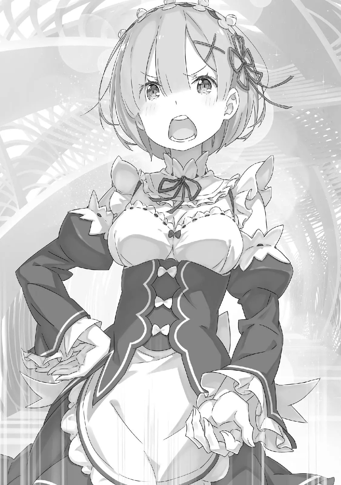
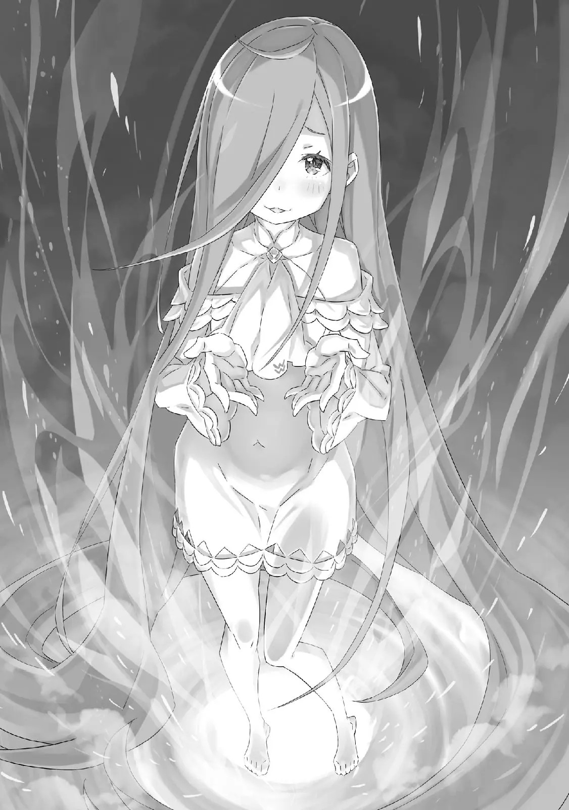

QC: Silly

Это первая глава, сделанная мною полностью с японского. По сути это все, что могу сказать в начале, кхм. Приятного чтения.

――Выбор, жестокий выбор, изъедал Нацуки Субару.

Все сильнее и сильнее что-то горящее в глубине его груди издавало звук.

Может быть, это была его человечность, его вера в себя, мысли о «Нацуки Субару» или же что-либо другое, что могло быть сожжено.

Держа руки на шее девочки и подвергаясь насмешкам с её стороны, Нацуки Субару находился в ситуации, которая решит его судьбу и судьбу «Нацуки Субару». «――――» Сердцебиение, он его не слышал. Он тяжело дышал, но не чувствовал, чтобы его легкие функционировали.

Несмотря на безвыходное положение, на его лбу не было ни капли холодного пота.

Должно быть, это потому, что тело Нацуки Субару в этом месте не было настоящим.

Открыв книгу, в это место засосало лишь его душу―― То, что он обдумывал что-то такое неуместное, было просто еще одним способом уйти от реальности.

Таким образом, отослав свои мысли прочь, разум Субару пытался обрести временное спокойствие.

Однако ни время, ни пространство, ни другая сторона не допустили бы Субару такого отступления.

Луис: И~и, как же ты хочешь это сделать, Братец?

Девочка, прижатая к полу, смотрела на застывшего и колеблющегося Субару, и садистски улыбалась.

Она смотрела в черные глаза Субару, словно хотела их облизнуть своим высовывающимся языком, Луис: Так прижимаешь слабую и хрупкую девушку, положив руки на тонкое горло. Разве это не заставляет трепетать? Или же, это обычное явление для кого-то с телосложением как у Братца?

Субару: «――хк» Луис: Дрожишь, как ми~ило. Так сможешь ли ты сделать такой важный, важный выбор?

Наклонив и подняв голову, Луис поцеловала запястье Субару. Ужасающий жест, жар, льющийся из ее слезящихся глаз, и жестокие слова напомнили Субару о сцене.

Это была безжалостная сцена, которую Субару видел однажды. ――Однако, он видел это с противоположной стороны. Это было то, что он видел глазами человека напротив, а не своими собственными.

Сцена, в которой Субару завалил на пол и со злым выражением на лице начал душить.

Нынешняя ситуация была точно такой же, как и та сцена, в которой «Нацуки Субару» задушил Мейли―― Субару: «Уг» ――В тот момент, когда он заметил, что эта сцена имела схожесть с той, все тело Субару, его щеки, напряглись.

Луис: Как и ожидалось, тебе это что-то напомнило?

Субару: Чушь! Эта чушь……

Луис: Нет, это не~е чушь. Скорее, разве это не Братец ведёт себя несерьёзно? Ты должен любить себя более серьезно, искреннее, по-настоящему.

Субару: «――――» Луис: Аах, вот именно. Люби себя. Хаа, люби. ――Люди, о которых братец хочет заботиться, хотят, чтобы братец любил и себя.

В легкомысленном тоне, эти похожие на волну слова были небрежны.

Собирались ли они быть услышанными, или же, с самого начала, их функция откликаться в сердце была мертва?

Были ли они направленными или естественными, или насмешливыми, или успокаивающими?

Расплывчато. Образ жизни Луис Арнеб был совершенно расплывчатым.

Расплывчато, это было совершенно расплывчато.

Фундамент слов Луис, ее слов, был шаткий, нестабильный словно вода или как качающиеся листья деревьев. Все это самовольное и искривленное, если он сможет найти чёткое решение и положить этому конец, рассеется ли даже эта нерешительность?

Нет, прежде всего, насколько опасно доверять ее словам?

Субару: Ты…… прежде чем что-то говорить вот так, словно это абсолютная правда, нужны доказательства.

Луис: Доказательства?

Субару: Доказательства того, что если я верну «Нацуки Субару», нынешний я исчезнет……!

Луис: Нет. Это не так. Говоря так, ты не прав.

Совершенно не так. Ты не прав. Но, ух, нет. Но, это не так. Но, эти слова не верны. Но, вот почему, говоря так, ты не прав. ……Это должно быть утешительно?

Субару: «――――» Луис: Мы ходим по кругу, Братец. Мы не можем говорить о том, чего не знаем. Мы не знаем, будет ли возвращена съеденная еда, если мы, Онии-тян и Ниисама умрем. ――Честно говоря, мы не знаем, потому что мы ни~икогда не возвращали то, что съели. Ведь в конце концов, это было съедено «А~а», Луис открыла рот, обнажив свои ужасно острые клыки и красный язык, и выставив даже заднюю часть своего горла, показывая Субару, что там ничего нет.

Воспоминания других, воспоминания других о ком-то, Если изъятие таких вещей называется «поеданием», то нет никакого способа, что останутся какие-либо физические следы.

Тем не менее, слова «это было съедено» показались Субару жестокими и тяжелыми.

Луис: Что же ты сделаешь, Братец?

И вновь Луис задала Субару этот вопрос.

Во время этих вопросов и ответов, руки Субару продолжали оставаться на шее Луис. Не в силах вложить в них силу или, наоборот, полностью убрать их, неспособный Субару продолжал сомневаться в своем существовании.

Субару: «Гх, к……кх» Умирать, страшно. Ужасно.

Однако этот страх отличался от страха «Посмертного возвращения», который Субару испытывал четыре раза до этого.

Предложение, которое давило на душу Субару здесь и сейчас, словно заставляло его выбрать между двух вариантов, которые вели к «Потере себя», смерти.

Исконно, «Смерть» была именно такой.

Когда люди умирают, они теряют сознание своего существования, и больше им не дают шанса начать все сначала.

Поэтому, Субару, который обладает этим шансом, не может продолжать быть неуверенным и не имеет прав жаловаться на это.

Возможно, это роскошь — иметь время страдать о таких вещах, иметь возможность выбирать, исчезать или не исчезать.

Но, это его жизнь.

Вынужденный выбирать самостоятельно, задувать этот огонь или нет, сердце Субару разрывалось с каждой секундой.

Субару: «――――» В этом другом мире, Субару уже умирал четыре раза.

Всё это произошло за короткий промежуток времени.

Он был брошен в незнакомый мир, встретил людей, которых никогда раньше не встречал, и непосредственно после этого был застигнут неизбежной, трудной ситуацией, что приводила его к смерти.

Общее количество времени, которое он провел в сознательном состоянии, было, вероятно, меньше двух дней.

Короткое, очень короткое время. ――Однако, помимо этих двух дней в этом другом мире, Нацуки Субару провел семнадцать лет в своем родном мире.

У него был отец. У него была мать. У него было не так много друзей, и он не был уверен, что может назвать их друзьями, но у него были люди, которые приветствовали бы его в ответ. Оглядываясь в прошлое, он понимал, что были люди, с которыми он дружил в начальной и средней школе, и он знал многих людей, которые жили по соседству.

Дела у него шли не очень хорошо. Субару не был хорош в жизни.

Тем не менее, у него был свой безуспешный стиль, что вел его методом проб и ошибок, но хоть и не было никаких опасных для жизни ситуаций, несмотря на это, он все еще считал, что пробивался через большую сцену по-своему, как Субару.

Такие всевозможные времена, целая куча воспоминаний, собирается ли он отказаться от них?

Если «Нацуки Субару» вернется, тот факт, что все это произошло, никуда не исчезнет. Но, нынешний он, который, безусловно, думал о этих временах, исчезнет.

Обещание Рам, клятва защищать Мейли, хорошо запечатленное в его сознании прощение Ехидны, увещевание Юлиуса, что он сможет победить, и, дорогая вера в Беатрис, Эмилию―― ――Эмилию, полюбив её, он, собирается исчезнуть?

Субару: я не хочу этого……

Это осознание заставило тело Субару треснуть, без какого-либо метафорического выражения.

На его щеке появилась трещина, а на руках, обвивавших шею Луис, появилась паутина из трещин.

Боли не было. Из трещин не текла кровь. Как ни странно, за трещинами была темнота. Не плоть и кости, а лишь непостижимая, неестественная тьма.

Похоже, его предположение, что сюда не перенесло его настоящее тело, было верным.

Тело Субару в этом месте не было настоящим. Тогда, поскольку оно ненастоящее, оно напрямую отражало его текущие чувства: тело Субару трескалось и разбивалось на кусочки.

Трещины расширились, и поверхность отслоилась.

Несомненно, это скорлупа обмана, «Нацуки Субару», которую Нацуки Субару накинул на себя.

В то же время, большими каплями, вместе с этой скорлупой, отклеилась и его бравада.

Субару: я не хочу этого, я не хочу, не хочу…… не хочуу…… «хк» Луис: Верно. Это естественно.

Он в отрицании качал головой, боясь смерти, которая ждала его―― нет, он боялся потерять.

Почему он должен это терять? Он только заметил, что ему нравятся другие люди, что он их любит.

Субару: не хочу……

Луис: Да, да. Понятно. Понятно, разумеется. Но, понятно. Конечно, это понятно Субару: я не хочу этого…… «хк» Луис: Это жизнь Братца. Почему ты должен отдавать ее кому-то другому?

Субару: Я, всё…… всё, больше……

Он хочет всё и больше одновременно.

Он полюбил. Он полюбил их. Менее чем за два дня, он не раз сомневался в них, хотел убить их, убежать от них и погрузиться в свои сомнения.

Но Субару влюбился в этих девушек. Теперь, он любит их.

Если бы он мог быть с ними, если бы они считали, что Субару им важен, тогда он смог бы полюбить себя, даже если бы ненавидел себя.

Вот что он думал. Устремленный в будущее, вот что он думал.

Субару все это время был обращён спиной к жизни, но вот, наконец, он нашел в ней место под солнцем.

Почему он должен отпускать его?

Подобное―― Субару: ――я не хочу.

Луис: Верно. Это верно. ――Ита~ак, что же ты решил?

Субару: ……я, таким, какой я есть Луис: Да, Братец будет таким, какой есть. Это правильно. Однажды это уже забрали. Это как игра в музыкальные стулья. Тот, кто сядет на пустом кресло, король.

Субару: «――――» Луис: Ты должен желать, чтобы человек, который толкнул тебя, ушел. Ты должен это признать. Свое существование. Ты должен громко кричать, что ты настоящий! Ведь та~ак!

Прямо под ним, на таком расстоянии, что чувствовалось её дыхание, с широко раскрытыми сверкающими и сияющими глазами, Луис рычала.

С кусающей силой―― Нет, она буквально укусила запястье Субару, которое находилось на её шее, и вместе с яркой болью вырезала предупреждение для Субару.

Глядя в его колеблющиеся черные глаза, Луис Арнеб крикнула.

Луис: Признай! ――«Нацуки Субару» — самый близкий человек Братца ~цу! (?) Лай взывал к нему, чтобы он решил.

Чтобы он прекратил думать о чем-то таком глупом, как умереть ради кого-то.

Почему он должен жертвовать собой ради кого-то другого? ――К тому же, это не ради себя, а ради другого существа, называющего себя им, из-за которого он больше никогда не сможет встретиться с теми людьми, которых он любил.

Уступить ему всё это время, драгоценное и уникальное, что он провел с ними.

Как он может сделать что-то настолько глупое?

Луис: Ну~у же, убей! Давай, убей! Сделай же, убей!

Убей же! Убьёшь! Если убьёшь! Убей полностью! Ты сможешь убить! Ты сможешь закончить убийство! Стоит только убить! Посвяти в убийство все силы!

Субару: «Нацуки Субару»……

Луис: Братец — единственный в этом мире, тот, кого не сможет заменить кто-то другой, ты есть Нацуки Субару!

Субару: «――хк» Единственный в этом мире, тот, кого не сможет заменить кто-то другой, Нацуки Субару.

Браться за руки с Беатрис, шутливо общаться с Рам, заставлять Мейли делать угрюмый взгляд, быть ошеломленным открытостью Шаулы, обмениваться улыбками с Ехидной из-за нелепой болтовни, поворачиваться друг к другу спинами с Юлиусом, получать безвозмездную любовь от Патраш, жить с Эмилией, — он достоин этого.

Если чтобы обладать этим, нужно быть «Нацуки Субару», то, Субару как раз этот человек. «――――» «кап», почувствовав этот прилив эмоций, его зрение расплылось.

Разум оказывал прямое воздействие на тело. Сейчас, он отчётливо ощущал биение своего сердца и боль в лёгких при дыхании.

Но, то, что он сейчас чувствовал сильнее всего, так это невыносимые слезы.

Будь то гнев или печаль, ревность или зависть, чувство вины или страх.

Субару понятия не имел, что вызвало это сильное волнение. Было много вещей, которых он не понимал.

Однако, в своем залитом слезами видении, Субару видел. ???: «――――» Кто-то, на Субару, на Луис, смотрел сверху.

Прижимая Луис, прикасаясь к её шее, со слезами на глазах, плачевно выглядевший Субару пристально смотрел на нее.

Этот кто-то, насколько Субару мог понять, был только один.

Субару: ……я, ты вышел, потому что испугался меня, «Нацуки Субару»? ???: «――――» Расплывчатая фигура ничего не сказала.

Стоя на белом полу, с белым миром позади него, в белом дымке, эта фигура смотрела на Субару.

К существу, которое выскочило в спешке, Субару повернул свое промокшее лицо, и сказал.

Субару: Я…… я, не исчезну. Я не хочу умирать. Поэтому, я…… ???: «――――» Субару: Я хочу быть со всеми. Мне все нравятся.

Поэтому, я…… ???: «――――» Субару: Поэтому, я……

Словно оправдания, слёзные жалобы накапливались.

Это было так же, как и тогда, когда он положил руки на шею Луис. ――Он не желает терять себя, Субару вынес такое решение. Поэтому, тени, которая появилась вот так, он говорил это.

Даже если это означает убийство человека перед ним, у которого, наверняка, такое же лицо, как у него.

Ведь он, «Нацуки Субару», самый близкий ему человек.

Поэтому, Субару должен иметь на это право.

Нацуки Субару убьет «Нацуки Субару», и одно место под солнцем―― Субару: Поэтому, я, не ты! Ты и я……!

Отличаются, — сказав это ясно, он хотел исключить эту возможность.

Но в момент, когда это должно было произойти, Луис: ……Братец, с кем ты, разговариваешь?

Ошеломлённо, округлив глаза, Луис прервала его, и задала этот вопрос.

Она наклонила голову и уставилась в том же направлении, что и Субару, пытаясь разглядеть фигуру.

Но, она в сомнении нахмурилась, ее острые клыки задрожали, Луис: ――С кем ты говоришь, здесь никого, пусто, Братец Субару: «――――» Со стуком клыков, Луис, с недоверчивым лицом, пробормотала это себе под нос.

Неохотно, она утратила прежнее выражение лица и выглядела так, словно чего-то испугалась, Луис: Это наше место…… нас ведь не могут здесь побеспокоить. В этом месте, говоришь с кем-то еще, кроме нас……прекращай. Братец наш, мы…… ~цу!

Слова Луис, казалось, пытались зацепить его, но, сознание Субару ни капельки не двинулось.

Сознание Субару все еще было сосредоточено на фигуре в поле его зрения, которая не исчезала. Его зрение расплылось из-за слез, но очертания колеблющейся фигуры стали немножко четче.

Чья-то, совершено незнакомая, фигура.

Очертания фигуры постепенно становились четче, и Субару показалось, что она слегка улыбается.

Покачав головой, сильно моргнув и попытавшись ещё яснее разглядеть эту улыбку―― ???: ――Почему ты пытаешься выбрать только одно или другое?

Вопрос, ему был задан вопрос.

Это был голос, которого он никогда раньше не слышал, голос того, кого здесь не должно было быть.

Он никогда раньше не видел, чтобы она улыбалась―― Девушка с синими волосами, стояла там и улыбалась.

Улыбающаяся девушка, продолжая улыбаться молчаливому Субару―― ???: ――Встань!! ――Это было первое, что она сказала. ――Её грозный крик был первым в этом мире, направленным на Нацуки Субару.

???: ――Встань!!

Крик ударил потрескавшегося Субару, сбив его с ног, ранив его.

Без пощады, без колебаний, рёв расколол Нацуки Субару и ускорил распространение трещин. ――Это было так, словно в его обнаженное сердце воткнули ногтями. ???: Встань!

Синеволосая девушка кричала в сторону Субару.

Уставившись на Субару, она громко кричала. Она кричала. Вопила.

На ошеломлённом лице Нацуки Субару, все ещё стоявшем на коленях, прижимавшем девочку, появились трещины. ???: Встань!!

Крик повторялся.

Снова и снова это безжалостно и безудержно поражало сердце Субару.

Почему он должен подвергаться бомбардировке таких слов?

Больно. Мучительно. Тяжело. Грустно. Его сердце вотвот разорвется.

Не каждый день в жизни вы сталкиваетесь с такой серией трудных решений, одно за другим, без какойлибо подготовки. ――Он перестал сокрушаться, почему оказался в таком затруднительном положении.

Так что, по крайней мере, он пришел к выводу. Так что, сейчас, это хорошо, верно? ???: Встань!

Девушка, стоявшая перед ним, не хотела позволить его хныканью, его упрямому умозаключению и страху потери сьеживать его сердце. Решительно, не принимая это, она с силой повторяла слова.

Он принял решение. Было бы неплохо, если бы и она приняла это. По крайней мере, пусть покажет своим видом, что обеспокоена этим. Это хорошо, так? Он уже достаточно думал об этом. Но почему, несмотря на это, она продолжает так поступать с Субару? ???: Встань――!

Она не позволит Субару принять решение с разбитым, продолжающим разбиваться сердцем. ???: Встань――!

Она все еще говорит это?

Для чего эта девушка кричит?

Это так тяжело, больно. ???: Встань……! Встань! Встань! Встань же!

Кто эта девушка?

Где воспоминания об этой девушке?

Они никогда не обменивались словами. В нынешнем Субару нет воспоминаний о ней.

Этот кто-то неизвестный, тот, кого он знает всего лишь поверхностно.

У них такие отношения, которые никогда не станут причиной для того, чтобы держаться до последнего.

Несмотря на это, почему, почему же у него так горит в груди?

Почему из глубины его груди поднимается жар? ???: Встань, Нацуки Субару! Встань! ――Герой Рем!!

Плачущий голос девушки, которую он не помнил, ее голос, кричащий ему, что он был героем, заставил его сердце дрожать.

Дрожащему сердцу Субару эти глупые слова показались действительно ритмичными, настолько, что ему хотелось рассмеяться.

Трещины, расколы, ускорились.

Это была сцена, которая буквально заставляла Нацуки Субару вырываться из своей оболочки «Нацуки Субару».

Но то, что лежало внутри этой оболочки, прямо перед этим, немного изменилось. ――Нет, если оно действительно изменилось, то это началось из-за этого. «Встань», — она хотела, чтобы он пережевал свое испуганное сердце, и встал. ???: Если ты можешь встать, то, прошу тебя. Иди, и спаси, всё Всё? Что значит всё?

Её слова были рассеянными. Всё, что, черт возьми, это значило? ???: Всё всё. Всё, что угодно. Всё, всех, даже себя, даже самого близкого человека!

Что это значит?

Может ли он сделать что-то такое? Неужели эта молодая девушка действительно думает, что он сможет?

Он не может спасти даже себя, ему так многого не хватает.

Для людей, которые полюбили Субару, для людей, которым небезразличен Субару, для людей, о которых Субару хотел бы заботиться, для людей, о которых он не хотел терять воспоминания.

Она действительно думает, что Субару, который собирался отпустить одно из этого, сможет это сделать? ???: Ты сможешь, ведь, Ведь.

Ведь что?

Дай мне силы, дай мне ответ. Если ты можешь дать это мне, дай мне это этими словами.

Я надеюсь, ты, синеволосая девушка, своими словами, дашь мне―― ???: ――Ведь Нацуки-кун герой Рем.

Субару: «――――» «Бум», что-то сломалось в его сердце.

Это нечто было черным и застоявшимся, но слова девушки, похожие на слова любви и признания, полностью очистили это. ――Нет, это не было похоже.

Это и было любовью и признанием.

Количество причин, по которым он не хочет отдавать свое место «Нацуки Субару», увеличилось на еще одну.

Субару: «――ха» В то же время, это не единственное, что увеличилось.

Очищенное словами девушки, нечто черное и застоявшееся увеличило свое сияние, засияло сильнее, изменяя свою форму.

И затем, в самом центре, сильные желания Нацуки Субару начали пульсировать. «――――» Он пульсировал. Он потерял все, и оставил все.

Несмотря на это, он все еще хотел искать и желать, он хотел держаться за все, он не хотел, чтобы что-то выскользнуло из его рук, он не хотел даже отпускать самого себя из своих собственных рук.

В ответ на его молитвы, трусливая «Жадность» расцвела в силу, способную воплощать желания в реальность. ――Колеблющийся фактор, связанный с существованием.

Субару: Пойдем же, ――Кор Леонис Семя «Жадности», которому больше некуда было деться, проросло в Субару.

И затем, когда он твердо встал, девушка―― ???: «――――» В этот момент, синеволосая девушка лишь улыбнулась, желая ему удачи.

Луис: ――Братец?

Субару: «――――» Луис подняла глаза и окликнула Субару, который медленно встал.

Он убрал руки с её шеи; выражение её лица все еще было озадаченным, а когда он встал с золотой кровати из ее собственных волос, она растерянно моргнула.

Луис: Что, случилось? Что щас было, ты ведь продолжишь…… продолжишь?

Субару: «――――» Луис: Продолжай……

После её просьбы о продолжении, Субару увлажнил губы языком.

Если думать, что его существование здесь было лишь духовным, то это было просто еще одно успокаивающее и бессмысленное действие, которое почти вошло в привычку.

Однако было еще кое-что, что он заметил. ――К удивлению даже для него самого, сейчас, его голова была довольно ясна.

Непостижимое смятение и безумие, которые продолжались вплоть до предыдущего момента, словно смыло волной, и ему было так спокойно, будто он плыл в самом центре штиля в море.

Так что―― Субару: Тебе не нужно больше что-либо говорить. Я сыт по горло твоими выворачивающими наизнанку объяснениями.

Субару мог без колебаний признать, что эта масса злобы в виде девочки перед ним искажала его волю и пыталась использовать его для своего блага.

И на эти слова, «нетнетнетнет», Луис замотала головой.

Луис: Выворачивает наизнанку…… это жесто~око. Мы только по-своему переживали о Братце и дали всего лишь разнообразные советы……

Субару: И перестань намеренно сквернословить обо мне* словами, которые я и так знаю. Нет смысла пытаться так повлиять на меня. ――С нынешним мной это больше не сработает ( — сквернословить о ком-то так, чтобы его намеренно подслушали) Луис: «――――» Луис прищурилась, услышав его слова. Она не понимала обстоятельств изменений, произошедших в теле Субару. Субару также не все понимал.

Однако «Жадность», которую ничем нельзя было поколебать, окончательно определила Нацуки Субару.

Субару также определил себя.

В форму, которую хотела девушка, которая в тот момент кричала только на Субару.

Субару: «――――» Оглянувшись, Субару посмотрел не на Луис, а на другую сторону от нее.

Не было никаких признаков девушки, которая только что бросала безжалостные слова в Субару. В тот момент, когда Субару встал и посмотрел вперед, она исчезла.

Но, может быть, это нормально.

Воссоединение с девушкой не должно было состояться ни здесь, ни с Субару.

Нет, это тоже не совсем точно. Просто, тем, кто должен воссоединиться с ней, должен быть Нацуки Субару, который восстановил свои воспоминания о ней и свои чувства к ней.

И нет необходимости проводить различие между «Нацуки Субару» и Нацуки Субару.

Субару: Снова и снова…… мне говорили это ――Ему говорили, что даже потеряв свою память, Субару все равно оставался Субару.

То, что он упрямо думал, что существует четкое, заметное несоответствие, которое он должен различать, было для Субару бременем, проклятой цепью.

Но, и что с того?

Теперь, когда Субару определил, что ему нужно делать, для него это был указатель, нить надежды.

Идя за ней, наматывая её, Субару несомненно дойдет до конца этой нитки, благополучно достигнув особенных для него людей.

Поэтому―― Субару: ――Убирай нож и вилку, ты, беглый едок. Я для тебя не суп с лапшой.

Луис: «――――» Ее глаза расширились.

Глаза Луис Арнеб расширились, и она впилась глазами в Субару, который ткнул сам в себя пальцем. Увидев, что на лице Субару не было никаких эмоций, она опустила голову.

Луис: «Аа» Опустив голову, она испустила хриплый вздох.

Это был глоток воздуха, наполненный эмоциями, которые трудно описать.

Присев, плечи Луис задрожали, и она подтянула к себе колени и свернулась калачиком на своем собственном золотом ковре.

Затем, медленно подняв свое опущенное лицо―― Луис: ――Ааа, дерьмо, дерьмо-дерьмо-дерьмо. Один шаг, оставался всего один шаг С ненавистью в глазах, Луис уставилась на Субару и напряжённым голосом заругалась.

Субару: «――――» Луис: Оставался один шаг, тц. Как жаль, тц. Почему, изза чего, где мы допустили ошибку, тц. ――Братец, кто, тебя обманул, тц.

Ее тон голоса приводил к бессознательному заключению: Ненависть в ее голове была похожа на безнадежную изоляцию, такую, как у мертвых из глубин ада, завидующих образу жизни живых, наслаждающихся раем на поверхности.

С наполненным ненавистью голосом, Луис продолжила.

Луис: Один шаг, и мы смогли бы разорвать «Нацуки Субару» и Нацуки Субару……!

Субару: ……Что это черт возьми значит? Зачем тебе это делать?

Луис: ――Разумеется потому, что раньше нам никогда не удавалось съесть одного и того же человека дважды ~цу!?

Субару: «――хк» Луис перекрыла сомневающийся голос Субару своим надтреснутым криком, который звучал так, словно она кашляла кровью.

Она встала на четвереньки, и её выражение лица кардинально изменилось по сравнению с предыдущим―― Она уставилась на Субару с лицом животного, потерявшего свою человечность.

Луис: Вы должны были быть разделены! «Нацуки Субару», который был съеден один раз, и Нацуки Субару, который остался полусъеденым, должны быть отдельны. Вот почему, тем или иным способом, мы пытались воплотить тщательно продуманный план…… это целый пар*! Это так смешно! (?. В гольфе «пар» — количество ударов (строуков), которое, как ожидается, потребуется опытному гольфисту для завершения отдельной лунки или для завершения всех лунок на гольф-поле. Пар (par) — это стандарт, к которому стремятся все игроки в гольф.) Субару: ……Это не смешно. Во всем этом нет ничего смешного.

Луис: Да? Разве так!? Мы не нравимся Братцу, не так ли? Разве это не весело, что нам грустно? Это приятно, не так ли? Братец…… Ты был единственным, кто смог насытить нас, тех, кто устал есть…… ты единственный, кто смог нас «насытить» ~цу!

В ответ Луис, чьи глаза налились кровью, Субару лишь слабо пробормотал под нос «Насытить».

Если он не ошибается, то титул, которым она представилась, был «Обжорство». Тогда, почему щас она говорила о «Насыщении»?

Стоя перед замешанным Субару, «Во-первых!», Луис подняла глаза кверху, к белому небу, и закричала, Луис: «Гурман» Лей! И «Блюдоман*» Рой! Вы ни~ичего не знаете! Одного за другим, необдуманно и с беспредельной глупостью, поедаете кого попало…… мы* заперты здесь, без свободы выбора? Не смешите меня, непригодные братья ~цу! (1: Мне не нравится перевод «причудливое поедание», поэтому я буду использовать это. В общем: Человек, который ест всё подряд. Для него главное насытиться. 2: Напомню, что даже имея в виду себя, она употребляет «мы».) Обхватив свои светлые волосы, Луис начала взъерошивать их и пускать повсюду слюни.

Субару не мог понять значения ее криков. Она сказала «Лей» и «Рой», были ли это имена?

Подумав об этом, он сразу вспомнил, что она говорила о существовании нескольких «Обжорств»―― Субару: Ты, вместе с товарищами, воспоминания и имена других людей…… вы воры, я правильно выражаюсь? Как бы там ни было, вы забираете это снова и снова. Поедаете снова и снова. Верно?

Субару — пример человека, чьи воспоминания были съедены, и который забыл, кем он был.

Юлиус — пример человека, чье имя было съедено, и которого забыли все окружающие, из-за чего он страдал.

И Рем, у которой было съедено и то, и другое, из-за чего её позабыл весь мир, и она впала в вечный сон.

Все это было делом рук «Обжорства», Луис и её товарищей, тех, кого она только что назвала―― Субару: Какого черта вы это делаете? Какова ваша цель?

Луис: ――Все это ради счастья Субару: «――――» На одном дыхании, она немедленно ответила ему, и от ответа у Субару перехватило дыхание.

Не обращая никакого внимания на его реакцию, Луис, с психически неуравновешенным выражением в глазах, защелкала зубами, Луис: Все ради счастья. Какие еще могут быть намерения? Разве цель жизни не в том, чтобы быть счастливым? Или ты думаешь, что мы, люди, которых ненавидят, не такие? Неправда. Это неправда. Более того, неправда. Потому что неправда. Более того, ты продолжаешь быть неправ. Поэтому сейчас неправ.

Ведь ты говоришь неправду. Ведь поэтому, говоря так, ты неправ! Аах, боль в душе…… ~цу!

Субару: Связь между тем, чтобы быть счастливым и отнимать воспоминания у других людей……

Луис: Брате~ец, ты когда-нибудь думал, что жизнь несправедлива?

Субару: Разумеется.

Луис: «Аха ~цу» Прикусив тыльную сторону своей белой ладони, Луис спросила Субару. Когда Субару немедленно кивнул головой, «Верно», Луис неприятно рассмеялась.

Луис: Мы тоже. Иными словами, жизнь сама по себе несправедлива. Нельзя выбрать свое рождение, Нельзя выбрать своих родителей, Нельзя выбрать свое окружение, нельзя выбрать свое будущее, нельзя выбрать ничего из этого. Система уже настроена таким образом. Мы находимся на конвейерной ленте.

Субару: «――――» Луис: ――Но что, если будет не так?

Стоя перед хранившим молчание Субару, Луис наклонила голову.

Луис: Что, если бы мы могли выбрать свое рождение?

Что, если бы мы могли выбирать своих родителей? Что, если бы мы могли выбрать свое окружение? что, если бы мы могли выбрать свое будущее? Что, если бы у нас был выбор выбирать что угодно? ……Каждый выбрал бы лучшую жизнь, верно? не правда ли?

Субару: Это…… может быть правдой, но Субару сомневался, какая связь была между этим и убийственными действиями Луис и других.

Тем не менее, на такое сомнение Субару, Луис щёлкнула зубами, Луис: ――Это так Субару: ……А?

Луис: Если бы мы могли выбирать наше рождение, выбирать наших родителей, выбирать наше окружение, выбирать наше будущее, если бы у нас был любой выбор, который мы захотим, каждый выбрал бы лучшую жизнь. ――Вот почему мы тратим так много времени и сил на поиски лучшей жизни для нас Субару: «――――» Луис: Несомненно, она где-то есть, ~цу! Мы те, кто сможет с поднятой грудью стать самими собой! Мы так рады, что можем жить эту жизнь, у нас такое радужное будущее! До тех пор, пока мы не встретим свою судьбу, мы будем есть, грызть, пожирать, лизать, сосать, ненасытно пьянствовать ~цу! Обжорство ~цу!

С горящими и сверкающими глазами Луис Арнеб во всю силу кричала о своих прекрасных амбициях.

Потому что внутри неё, жизнь девочки по имени Луис Арнеб, с самого начала была неудачной. ――Поэтому она хотела притворяться, что ничего не произошло.

Она хотела быть осчастливлена и заполучить свое рождение, своих родителей, свое окружение, свое будущее, свои таланты и все остальное.

Это было тем, что она определяла как необходимое условие для того, чтобы наслаждаться жизнью в полной мере.

Вот почему―― Субару: Вот почему ты берешь воспоминания других людей и съедаешь их……?

Луис: Когда мы найдем ту жизнь, о которой мечтаем, прикрепив «Воспоминания» и «Имя», мы будем жить этой жизнью с высоко поднятой головой. К сожалению, до сих пор все были исключены из отбора…… Были жизни, которые шли по правильному пути, но, нас больше нельзя удовлетворить простым опытом.

Лихорадочно произнеся это дрожащим голосом, Луис нежно провела пальцами по своему худому телу под рваной одеждой, делая похотливый жест, неуместный для её возраста―― Нет, это не так.

Если то, что она сказала о «Обжорстве», правда, то она прожила до сих пор бесчисленное множество жизней других людей, приобретя такой опыт, который не может получить ни один нормальный человек.

Мужчин, женщин, детей, пожилых людей, и, возможно, даже разных видов и существ, способных перепрыгивать через заборы; насыщаясь опытом всех возможных существований, пробуя их до конца, она была человеком, что наслаждался поеданием жизней.

Луис, так она назвала себя.

Она устала от этого. Она устала пожирать жизни других людей.

Съев тысячи людей, ее перестало удовлетворять воровство и поедание «вкусный частей» других людей, и для нее каждый новый случай стал обыденным, скучным и старомодным, без какой-либо новизны.

Но, в тот самый момент, когда стал понятен внутренний мир Луис, это перестало быть чем-то непонятным.

Это―― Субару: Ты ведь однообразный едок, так почему же ты пошла на все эти неприятности, чтобы снова попытаться откусить от меня кусочек? Это потому, что ты профессиональный едок*, который терпеть не может объедки? (competitive eater) Луис: Здесь ни при чём такая ничтожная причина. ――Это потому, что Братец — наша судьба.

Субару: «――――» Субару посмотрел на Луис с негодованием и осторожностью, понимая, что он будет выглядеть дураком, если примет это за чистую монету.

Однако в жаре в глазах Луис, когда она смотрела на Субару, не было ничего фальшивого. Она действительно страстно любила Субару―― Правильнее сказать, она любила «Жизнь» Субару.

Почему? Просто―― Луис: Мы пробовали все виды пищи, молодых и старых, мужчин и женщин, всех видов людей, рас, должностей, всего и вся, но есть кое-что, вкус чего мы не знаем. Ты знаешь, что это?

Субару: Трудно сказать. Я не знаю. Мой никчемный способ скорбеть или что-то в этом роде?

Луис: ――Опыт «Смерти».

Услышав её слова, Субару, с одним закрытым глазом, резко перестал двигаться.

Глядя на Субару, Луис подняла свои тонкие руки и повернула обе ладони к себе.

Луис: Неважно, сколько воспоминаний других людей мы съедим, это невозможно. Память о смерти — это единственное, чего у нас не может быть. Ведь так?

Воспоминания — это запись жизни. Вот почему невозможно обладать воспоминаниями о «смерти». ――Только, Братец исключение Луис от всего сердца завидовала, ревновала и влюблена в силу «Посмертного Возвращения».

Девушка, которой наскучил этот мир, сгорала от любви к единственному мужчине, способному дать этот свежий момент.

Луис: Эээй, а каково это — умирать? Это трудно, да? Это мучительно, да? Это ужасно, да? Это больно, верно?

Бывали времена, когда это не причиняло боли, не так ли? Некоторые говорят, что это приятно, но правда ли это? Когда ты умираешь, ты всегда радуешься этому?

Или, тебя больше не волнует это? Лёгкая победа? Эй, эй эй, эй-эй-эй!

Субару: ……Если у тебя есть мои воспоминания до вчерашнего дня, ты ведь это знаешь, разве не так?

Луис: Это воспоминания! Но, в конце концов, они ведь старые, ненастоящие! Мы хотим более чистые ощущения. Мы не можем повторно использовать этот несвежий, использованный продукт. То, что наполняет нас, — это новые, свежие, любые неизвестные обстоятельства ~цу! «Поэтому», — продолжила она, Луис: Особое воспоминание, уникальное в этом мире, которое никто другой не может испытать! И не только это, ведь если ты совершил ошибку, легко просто умереть и начать все сначала! Даже после того, как вы нашли свою лучшую жизнь, всегда есть шанс, что что-то может пойти не так и разрушить ее, верно? Но не в жизни Братца! Не волнуйся, мы все сделаем так, что никто не узнает!

Субару: «――――» Луис: Ни Эмилия, ни Беатрис, ни Рам, ни Мейли, ни Юлиус, ни Ехидна, ни Шаула, ни Патраш, ни Петра, ни Отто, ни Гарфиэль, ни Фредерика, ни Рюдзу, ни Розваль, ни Клинд, ни Аннерозе, ни Фельт, ни Рейнхард, ни Старик Ром, ни ТонЧинКан, ни Круш, ни Феррис, ни Вильгельм, ни Рикардо, ни Мими, ни Хетаро, ни Тиви, ни Присцилла, ни Ал, ни Шульт, ни Хейнкель, ни Киритака, ни Лилиана, никто никто никто! Обманув их всех, мы будем жить счастливо до конца своих дней!

Луис очаровательно наклонила голову и протянула к нему свои выставленные руки.

Луис: Поэтому, пожалуйста. ――Можем мы досыта наесться жизнью Братца?

Выпрашивая таким способом, она, должно быть, использовала наиболее подходящие для такого слова, подбирая их из своих многочисленных воспоминаний.

Это доказывает, что независимо от того, какие ингредиенты у повара есть под рукой, если он плохой, то результат никогда не будет хорошим. «Нет невкусных ингредиентов, есть только невкусные блюда*», — одна из любимых цитат Субару.

Никогда ещё раньше он не чувствовал так остро её правоту. (Согласно гуглу — слова из Osama no Restaurant, комедийный минисериал 1995 года.) У нее был бесчисленный, многочисленный, большой опыт, которого не может быть ни у одного нормального человека.

Субару никогда еще не видел существ, которые бы так напрасно тратили свои силы.

Субару: ――Только не в третий раз. Мои страдания, моя смерть, моя жизнь — все принадлежит мне. Нет ни единой вещи, которую я бы тебе отдал!

Луис: «――――» Субару: Умри с голоду, чертова идиотка. Если бы ты могла выбрать только один способ умереть, я бы порекомендовал тебе именно его. ――Страдать больше всех на свете.

Луис: «――――» Большим пальцем Субару провел по своей шее, решительно заявляя это.

От этих слов у Луис округлились глаза, а затем, посмотрев на свои руки, она закрыла ими свое лицо, подняла глаза к белому небу, «Аааааааа» и застонала.

Луис: Мы, провалились. Провалились. Мы закончили провалом. Поэтому мы провалились. Мы кончили провалом. Мы действительно провалились. Мы закончили провалом, ведь так. Из-за того, что мы провалились…… Аа, Аааааааа Её колени подогнулись, и она рухнула на пол.

Один лишь факт, что она была по-настоящему шокирована, был доказательством того, что она серьезно пыталась уговорить Субару. Излишне говорить, что результатом этой серьезности являлось утверждение, что её психика была не в порядке.

Что касается Субару, то ему вообще не нужно было менять позицию Субару: Я не стану тем, кого ты хочешь. Меня зовут Нацуки Субару. Это имя, которое мне дали Нацуки Кеничи и Нацуки Наоко. ――Нет ничего и никого другого. Я тот, кто я есть.

Луис: Что, если ты будешь перезаписан и исчезнешь?

Субару: Я научу тебя кое-какому магическому заклинанию. ――Это есть это, сие есть сие.

Магическое заклинание, которое он наложил на Юлиуса, теперь он наложил и на себя самого.

Если он вернет «Нацуки Субару», Субару этого момента может исчезнуть. Но он может и не исчезнуть.

Возможно, есть способ не исчезнуть.

Возможно, они смогут найти способ разделить одно место под солнцем.

Субару: Мне нет нужды уютно устраиваться на солнышке, ведь я тот, кто проникает в сердца других людей без всякого стеснения. Вот мой ответ. Рви свои волосы, идиотка.

Субару повернулся спиной к Луис, сказав это так, словно это были его последние слова.

Он не повернулся, чтобы посмотреть на то, как она сидела на полу и держалась за голову. Что сейчас было важнее, так это найти способ выбраться из этого непонятного пространства.

Он должен как можно скорее вернуться к Эмилии и остальным и снова бросить вызов «Книге мертвых» Рейда.

Во-первых, почему это место является «Книгой мертвых» Рейда―― Луис: ――Ааа, вот как. Дальше все зависит от Онии-тяна и Нии-самааа?

Субару: «――――» Позади Субару, который глубоко задумался, Луис сожалеюще вздохнула.

Услышав её, Субару, который прижал ухо к полу и начал постукивать по земле, обернулся. Луис лежала на собственных золотистых волосах, закрыв лицо ладонями и болтая ногами.

Онии-тян и Нии-сама.

Это были имена, которые Луис упоминала много раз.

Если то, что представлял себе Субару, было верно―― Субару: ――Лей и Рой. «Гурман» и «Блюдоман»?

Луис: Мы не можем покинуть это место. Поэтому, если перед Онии-тяном и Нии-сама появится еда, они не будут выбирать, что есть. ……Вот почему мы просили Субару: Просила……

Чувствуя неприятное предчувствие, Субару побудил её продолжить слова.

Ему казалось, словно Луис требовалось ужасно много времени, чтобы произнести следующие слова. Вскоре, словно прослеживая нетерпение Субару, красные губы Луис задрожали, Луис: ――Это уже второй раз после вчерашней ночи, как Братец приходит ко мне. ――Так что, Онии-тян и Ниисама это уже заметили. Заметили, где находится Братец.

Субару: «――――» ――Он узнал, что две угрозы приближались к Сторожевой Башне Плеяд.

Луис: Они оба очень заинтересованы в Братце. Это очевидно. ――Ведь у Братца большой опыт, которого у нас никогда раньше не было~ Субару: Ч-черт……! Ты…… «кх» Луис: ――А~ах, как нече~естно Когда у Субару, узнав об этом факте, задрожали плечи, она внезапно куда-то посмотрела и пробормотала это.

Луис пробормотала что-то без всякого контекста, но смысл дошел до Субару сразу.

Субару: Это, выход!?

Позади Субару, который обернулся, в белом пространстве, появилась трещина, и другая сторона трещины, казалось, мерцала.

Внутри было очевидное физическое нарушение, скачок в пространстве, которого там не должно было быть.

Пространство откликнулось на мысли Субару, что он должен вернуться в библиотеку.

Субару: «――――» Луис: Ты не сможешь этого сделать. Братец никогда не сможет этого сделать. Хотя мы бы хотели, чтобы ты смог~ Прежде, чем Субару успел войти в появившийся выход, Луис озадачила его своими словами.

Вероятно, это правда, что она настолько сильная, насколько выглядит, учитывая то, как он обхватил ее за горло, и то, как она вела себя после того, как раскрыла свои намерения.

Поэтому, Субару может без особых проблем физически позаботиться о Луис прямо здесь и сейчас.

Как только он подумал об этом и бросил на неё нерешительный взгляд, она сразу увидела его насквозь.

Луис: Даже с необоснованными опасениями, с отчаянием, ты не можешь убить ни себя, ни других, ни даже тех, кого ты ненавидишь. Слабовольный трус. ――Несмотря на то, что мы нежно лизнули тебя.

Субару: ――. Нет, это, должно быть, ударило по твоим зубам. Исправь их, дура.

Субару поднял средний палец в сторону Луис, которая смотрела на него с отвратительным выражением лица.

Не оборачиваясь, чтобы посмотреть на реакцию Луис, Субару попытался просунуть свое тело в щель в пространстве. Как раз перед тем, как он это сделал, в нем появилось небольшое колебание.

Дело было не в том, что он сожалел о Луис. Он просто был рад, что ему больше не придется видеть её лицо.

То, из-за чего сожалел Субару, было не в том, что он покидает Луис, а в голосе, который заставил его встать.

Девушка, которая появилась лишь на момент, чтобы вдохновить Нацуки Субару.

Девушка, у которой отняли память и имя, и которая была единственной, кто окликнул Субару на краю света.

Субару: Все в порядке. ――Я запомню свое обещание.

Он уверен, что Нацуки Субару никогда этого не забудет.

Так что он уверен, что они еще встретятся. ――В тот момент ему хотелось бы услышать нежный голос, а не просто грозный. «――――» С таким энтузиазмом, Субару прыгнул в трещину, чтобы вернуться к своим друзьям.

Луис: Аа, аах, аах, черт возьми! Даже не оглянулся, что за человек ~цу!

Луис: Не простим. Не позволим тебе сбежать.

Абсолютно, абсолютно…… ~цу!

Луис: Не думай, что это конец, Нацуки Субару…… ~цу!

Луис: Твоя жизнь принадлежит на-а-а-а-ам―― ~цу!!

