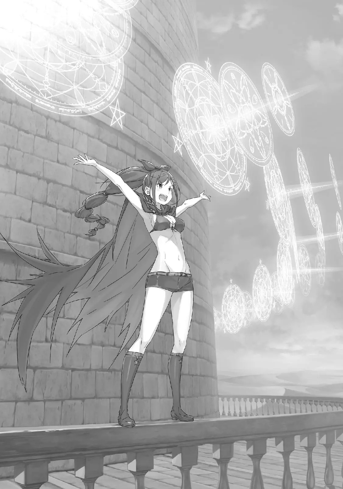

Глава 63 — «Пять препятствий» QC: Silly

――Прибытие Магверей в сторожевую башню.

Когда Субару и остальные получили отчет Юлиуса о том, что все магические звери в Песчаных Дюнах Аугрии разом направляются к ним, их выражения стали напряженными, а в глазах появился серьезный оттенок.

То, что они чувствовали своими подошвами, — это гул и грохот земли, слегка сотрясающий пол башни―― Трудно не почувствовать волнение, услышав, что звуки, которые отдавались эхом по всей башни, были шагами и ржанием магверей.

Субару: У меня есть лишь смутное представление о том, насколько велика эта пустыня……

В одном из прошлых циклов, он был настроен скептически касательно суровости дюн и попытался сбежать из башни, однако при первом же шаге его план побега провалился, и Субару познал на личной шкуре насколько они опасны.

Просто вспоминая этот незабываемый пейзаж, когда везде, куда ни посмотришь, был песок, он мог представить, насколько эта суровость соответствует им.

При всём этом, трудно представить пустыню, полную жизни―― Юлиус: Песчаные Дюны Аугрии к тому же являются первоначальной землёй Магверей. Ущерб, который причинили магические звери, нападая на людей в песках, более серьезный, чем от суровой природы.

Ехидна: В свое время была даже послана армия, чтобы истребить магверей в дюнах. Однако, по этому гулу вполне можно представить себе итоговый результат.

На вопрос Субару Юлиус и Ехидна ответили каждый посвоему.

Короче говоря, надежды Субару, что этот гул окажется ничем иным, как бумажными тиграми, а что количество приближающихся врагов будет максимум на уровне зоопарка, были полностью разрушены.

Что ж, эту ситуацию действительно хотелось считать просто безнадежной.

Тем не менее―― Мейли: ――Ведь именно поэтому меня сюда позвали, верно~?

И, параллельно теребя пальцами свою косу, Мейли подняла голос.

Среди тех, кто услышал о приближении магверей, она была единственной, на лице кого не было ни капли волнения. Её реакция не означала, что она не была удивлена.

Просто она не чувствовала угрозы от Магверей, вот какого рода была ее реакция.

Юлиус: Хоть это и довольно бесчувственно, все абсолютно так. Мы хотим одолжить твою силу.

Юлиус, у которого затвердели щеки, кивнул в ответ на вопрос Мейли.

Чтобы справиться с большим количеством наступающих магических зверей, они поручат это задание Мейли, которая умеет отдавать приказы магическим зверям. ――Он понимал, к чему клонит Юлиус. Первые мысли Субару были точно такими же.

Однако, странное чувство внутри груди Субару громко било тревогу.

Беатрис: Субару? В чем дело, я полагаю? У тебя странное выражение.

Субару: ……У меня странное лицо с того момента, как я родился, это моя судьба.

Беатрис: Это лишь касается твоих глаз, я полагаю.

Находящаяся рядом Беатрис заметила горькое лицо Субару и подняла на него свои наполненные беспокойством глаза.

Выдыхая большое количество углекислого газа, он также выдыхал своего рода бесформенную тревогу.

Однако она была расплывчата и неопределенна.

Юлиус: Субару, что тебя беспокоит?

Субару: Не надо задавать вопросы один за другим. Это моя вина, что я делаю такое многозначительное лицо. Я прошу прощения за это, но мне нужно сказать еще коечто. Я обладаю кое-какой сенсацией, которую почерпнул из Книги мертвых. «――――» Вокруг Юлиуса, который услышав эти слова задержал дыхание, Беатрис и остальные, которые также услышали эти слова, внимательно уставились на него.

Честно говоря, реакция вполне предсказуема, но все же он не мог молча объяснить ситуацию.

Причина этой внезапной перемены, причина большого количества магических зверей, прибывающих в башню―― Субару: ――Дело в Обжорстве. Архиепископ Греха «Обжорства» направил к башне магверей.

Юлиус: ――хк, почему?

Субару: Я сожалею об этом. Я встретил одного из Обжорств в Книге мертвых Рейда. Или, точнее, я снова встретился с одним из Обжорств. Мы уже встречались прошлой ночью, и……

Юлиус: Это причина потери твоей памяти, вот что ты хочешь сказать?

У Субару отвисла челюсть, когда Юлиус прервал его заключение и сказал об этом.

Может показаться странным, если сказать, что все было так, как и ожидалось, но понимание Юлиуса было действительно высоким. Он связал имя «Обжорства» и их способности, и сразу пришел к выводу, не дослушав его даже до конца.

Юлиус: Это не значит, что я не волнуюсь. Я спрошу ещё раз, на этот раз у тебя ничего не отняли, так?

Субару: К счастью, если не считать того, что на мою жизнь объявили охоту, с моим красивым телом все нормально. Я буквально пару минут назад все объяснил Беатрис и остальным.

Юлиус: Понятно. ……Беатрис-сама?

Беатрис: Твои опасения это также беспокойство Бетти.

Пока что я не заметила ничего необычного, я полагаю.

Субару: Никакого доверия……

Юлиус с понимающим выражением лица немедленно попросил у Беатрис подтверждение. Субару понимал, что он ничего не может сделать, но он все равно не мог не испытывать по этому поводу сложных чувств.

Как бы то ни было―― Субару: По-видимому, благодаря вчерашнему визиту, они поняли, где мы находимся. С тех пор прошло только около половины дня…… Чтобы доставить нам проблем, они также привели с собой зверушек, хах?

Ехидна: Трудно представить, что можно добраться до этой башни всего за полдня при нормальной скорости движения. Особенно если учесть, что снаружи еще и магвери, преграждающие путь. Но……

Субару: Но?

Ехидна: Если, в отличие от нашего трудного путешествия, Обжорство обладает способностью подчинять магверей…… это становится просто вопросом скорости передвижения.

Закончив свое замечание, Ехидна пожала плечами, а Субару с серьезным лицом скрестил руки.

Следует предположить, что «Обжорство» обладает способностью подчинять себе магверей. По крайней мере, нет никаких сомнений в том, что враг ведет магических зверей в башню.

Они должны иметь в виду, что у них возможно есть средства для этого.

Субару: Что значит вопрос скорости передвижения?

Ехидна: ……Это песчаная земля. Даже если на пути нет магверей, застревание ног в песке замедляет. Честно говоря, даже если не упускать из вида башню, надо полагать, что это займет несколько дней.

Субару: Но, какие еще есть возможности?

Ехидна: ――Если наземный маршрут занимает слишком много времени, то передвижение по воздуху — совсем другое дело.

Субару: Передвижение по воздуху……!

Черные глаза Субару расширились от удивления, когда он услышал об неожиданном средстве.

Передвижение по воздуху, действительно, значительно изменило бы скорость передвижения, если бы такие средства были доступны. Само собой разумеется, что птица, летящая в небе, передвигалась быстрее, чем человек, идущий по земле.

Субару: У меня было ошибочное, предвзятое мнение, что средство полета — это нечто особенное. Но раз уж существует магия, то полет — это совершенно обычное дело, хм?

Беатрис: Эти слова неверны, я полагаю. Полет — это разновидность сложной магии, и способ её работы очень запутан. А учитывая опасность крушения, это вообще слишком рискованно, я полагаю. Только дурак или гений, или гениальный дурак мог бы это делать.

Юлиус: Есть известный слух, что Маркграф Мейзерс посещает королевский замок через небеса……

Беатрис: Этот парень — гениальный дурак, я полагаю.

Вероятно, Беатрис не нравился этот маркграф.

Взглянув на Беатрис, которая выглядела очаровательно угрюмой, Субару наклонил голову, когда ему рассказали, что полет с помощью магии также не был обычным делом.

Субару: Тогда, если не магия, то большая птица……

Точно, дракон! Можно добраться верхом на спине летающего дракона!

Ехидна: Техника управления летающим драконом передающийся из рода в род секрет, что принадлежит Империи на юге, Волакии. Империя обладает монополией на эту технику, но «Обжорство» вполне легко могло ею овладеть.

Субару: Эти парни могут легко узнать что-то такое, просто съев немного воспоминаний, хах?

Если так подумать, то это враг, который слишком силен для информационной войны.

Если они съедят «Воспоминания», то узнают и заберут абсолютно все, от тайн до правды, а если съедят «Имя», то сотрут даже тот факт, что этот другой человек существовал. ――Он часто слышал такие слова, что воспоминания формируют человека.

Субару: «――――» Ценность человека, его прогресс, — Субару верил, что это всё было запечатлено в воспоминаниях и истории.

В системе ценностей, которая казалась особенно актуальной сейчас, Субару искренне ненавидел силу мерзкого «Обжорства».

Она разрушает.

Способность «Обжорства» красть чужие воспоминания это злоба, которая оскверняет и разрушает все.

Это просто бред, делать это ради собственного счастья, использовать это в погоне за счастьем. Это неправильный метод, неразумный способ, искажающий судьбу. «――Это говорит Братец, использующий »Посмертное возвращение«?» Субару: «――Кха» Беатрис: Субару!

Неосознанно, Субару сильно укусил свою губу, и Беатрис окликнула его.

Почувствовав, как кто-то потянул его за руку, он перевел туда взгляд, и его глаза встретились с встревоженными голубыми глазами. В уголке его рта была острая боль, из-за чего ему было печально, ведь это была рана, которую он сам же и прокусил.

Слизывая кровь с раны языком, Субару склонил голову, «Извини», Субару: На мгновение, у меня в голове промелькнуло саркастическое лицо.

Сделать так, чтобы у неё было совершенно заплаканное и жалкое лицо, — одна из великих целей, но……

Предстоящая проблема — это её старшие братья.

Юлиус: Мы уже знаем, что Архиепископов Греха «Обжорства» больше одного, но, ты узнал еще что-то?

Субару: Очень сложно понять, что она говорила из-за невероятно запутанного первого лица, но, возможно. Я думаю, что она, сидя в Книге мертвых, играет на дудке и говорит что делать этим двоим братьям.

В «Коридоре воспоминаний», Луис часто упоминала «Онии-тяна» и «Нии-сама». Если принять это за чистую монету, то речь идет о том, что у Луис есть два старших брата.

Доказывает это или нет, что они являются тремя «Обжорствами», было уже совсем другой историей―― Субару: По крайней мере, она не из тех, кто использует такие хитрости. Нуу, хотя, я не могу так говорить, ведь я чуть не проиграл из-за этого трюка.

Интересно, что бы произошло, если бы он поддался её намерениям и задушил ту тонкую шею?

Если бы не голос синеволосой девушки, появившейся в том месте, то безусловно, он бы уже это знал.

Мейли: ――Ита~ак, что Братец пытается сказать? То, что Братец вечно ходит всевозможными обходными путями и рассказывает истории окольными путями дурная привычка.

И, когда у нее словно лопнуло терпение, Мейли встряхнула всем телом и выразила свое недовольство.

Девочка, которой в первую очередь следовало дать ее роль, казалась очень недовольной тем, что её заставляют ждать.

Понимая ее недовольство, Субару удержал ее рукой, сказав «Хорошо», Субару: Я понимаю, что ты чувствуешь, но это меньшее, что мне нужно было сказать. Это определенно моя плохая привычка ходить вокруг да около, но я думаю, что это моя прелесть, и что это нравится другим……

Мейли: Ты хочешь, чтобы тебя съели?

Субару: Извини! Итак, к нам идут огромное множество Магверей! Значит, нужно попросить Сенсея Мейли, лучшего знатока Магверей, помочь нам в этом! Говоря об этом, этот поток не имеет проблем, верно? Как я уже говорил, наши основные противники — эти парни, что забрали мои воспоминания.

Мейли: Это~о……

Заметив осторожный тон Субару, Мейли тоже понизила голос. Даже она могла понять истинное значение того, что хотел донести Субару.

То же самое касалось и других людей вокруг, которые изменили свое выражение лица.

Субару оглядел лица этих людей, продолжая чесать в затылке, Субару: Я начну с того, что скажу, что это моя вина, хорошо? Но, у них есть мои воспоминания. ――Они знают сильные стороны каждого из нас, и они собираются устроить нам ловушку. Мы должны превзойти это.

――Тот, кто выиграет информационную битву, выиграет войну.

Это была формула победы в современных войнах, которую понимал Нацуки Субару из-за плохого влияния всевозможных игровых культур современной Японии.

Невозможно выиграть в покер, если противник видит вашу руку, — эту формулу мог бы понять даже ребенок Так что―― Юлиус: Неудивительно, что ты беспокоишься, раз они знают нашу силу.

Ведя группу вперед, Юлиус прищурил глаза и не оборачиваясь бросил свое замечание назад.

После краткого объяснения ситуации, все обрели совместное понимание того, что их напарники могут оказаться в беде. Несмотря на добавленный элемент беспокойства, в виде того, что они не знают о их действиях, мысль, что баланс был сломан, не заставит их опустить голову―― Беатрис: Гораздо страшнее, если ты узнаёшь важную информацию слишком поздно. Я правильно интерпретирую нынешние мысли Субару?

Субару: Правда? Все нормально? Вы все не возненавидите меня?

Беатрис: Почему ты об этом волнуешься? Все хорошо, я полагаю. Все мы неспособны ненавидеть Субару.

Скорее, лю, лю, лю……

Субару: Понятно―понятно. Все в порядке, я успокоился.

Я люблю тебя Держась за руки и идя бок о бок, он кивнул Беатрис, которая пыталась сказать ему ободряющее сообщение.

Честно говоря, его больше смущало, когда другие люди облекали в слова те стороны своей жизни, которые не могли выразить словами.

Гораздо легче сказать слова любви, чем услышать их от других. Тебе не нужно сомневаться в своих чувствах.

Субару: Итак, где Шаула!?

Юлиус: Ах, уже почти…… пришли.

Юлиус, бежавший впереди, указал вперёд каменного коридора. Казалось, что там был тупик, но чуть правее был скрыт замаскированный боковой проход.

Согнувшись в талии, он последовал за Юлиусом, который нырнул сквозь стену, и как только его тело оказалось за пределами башни, его встретил сильный ветер, наполненный песком, и цепочка незнакомых звуков. ――Для ушей Субару это звучало так, словно одновременно разбилось бесчисленное множество стекол. ???: Уааа―, Рьярьярьярьярьярьярьярьярьярья!! «――――» Это место представляло собой похожее на балкон пространство, встроенное в стену башни.

Как он знал по большой винтовой лестнице, ведущей на нижние этажи, четвертый этаж находился более чем в нескольких десятках метров над землей.

Высоко в небе, на балконе, где дул ветер, от которого хотелось пить, прыгая из стороны в сторону, словно танцуя, стояла красивая женщина с великолепным стилем и блестящей черной косой, развевающейся в воздухе―― Субару: ――Шаула!

Шаула: А! Вы пришли, Мастер-сама!? Я так рада~а!

А~ах, это такой важный момент, вы пришли посмотреть на мою работу ли~ично! Это словно когда отец приходит на день наблюдения родителей, вы должны посмотреть, а~ах!

Прикрывая глаза руками от песка и ветра, Шаула громким голосом ответила кричащему Субару. То, как она выглядела в этот момент, — выглядело как сцена из невероятного фэнтези.

Вся ширина балкона была заполнена бесчисленными пушками в воздухе, развернутыми в горизонтальную линию.

Слово «пушка» немного преувеличено, но он не мог найти для них другого подходящего слова. Амбразура, дуло, отверстие для выброса―― В любом случае, должна была быть полость, чтобы что-то запустить.

Белые магические круги, плывшие по воздуху, были выходом пушек, которые целились под сильным углом вниз, к земле.

И―― Шаула: ――Бесконечный Адский Бекас!!

Субару: Что за, это круто!

В тот момент, когда Шаула выкрикнула название техники, белая пушка ярко засветилась.

Глупый выкрик Субару сразу же закрасило звуком бьющегося стекла, который эхом раздавался в небе над дюнами один за другим. В то же время пушки потеряли свою форму и растворились в атмосфере, словно растаяли.

Такова была истинная природа легкого звука, который приветствовал Субару и остальных в тот момент, когда они вышли на балкон. И у Шаулы была одна цель играть на них. ――Артиллерийский залп, ограниченный одним выстрелом, испустил белый свет, который и впрямь со скоростью света приблизился к земле.

Когда белый свет упал на песок, он сильно взорвался и сдул землю. То же, что случилось с песком, произошло и с яростно бегущими по песку магверьми, когда свет упал на их спины.

Магические звери, которые поднимали облака пыли, пока неслись к башне, были поражены белым светом, и в итоге от силы которого их кровь и куски плоти разбросало по песку. Пока жаждущий песок всасывал одну часть плоти и крови, другую часть разбросанных трупов топтали другие магические звери; Ковровая бомбардировка белым светом лишь немного сократила общее количество магических тварей, которые продолжали приближаться.

Количество белого света приближалось к сотне, и сила каждого выстрела могла сокрушить сразу двух или трех магических зверей.

За такой короткий промежуток времени Шауле удалось сделать такое количество выстрелов. Если подумать, за тот промежуток времени, пока Юлиус звал сюда Субару и остальных, она продолжала в одиночку вести упорный бой, и, вероятно, число её убийств уже приблизилось к нескольким тысяч.

Однако, подобная ковровая бомбардировка Шаулы была как капля в море, и она не могла оказать сокрушительное сопротивление толпе магических зверей, которые заполнили все окружение вокруг башни, словно рой муравьев.

Вот насколько огромным было общее количество магверей, собранных в дюнах.

Субару: Эй-эй-эй…… Я не хочу об этом слышать, но неужели все так Ехидна: С этого балкона мы можем видеть только одну сторону башни. Но, с другой стороны башни должна разворачивается та же самая сцена. Мы можем в этом не сомневаться.

Субару: Может, есть шанс, что только одну сторону башни намазали медом?

Беатрис: Если бы кто-нибудь был настолько глуп, чтобы сделать такое, Бетти бы серьезно ударила его по голове, я полагаю.

Земля непрерывно грохотала, и перед их глазами шевелилась черная толпа.

Когда он услышал, что они приближались буквально со всех сторон башни, Субару почувствовал, что вот-вот рухнет от реальности ситуации. В качестве маленького отступления, хотелось бы сказать кое-что о визуальном изображении магических зверей на расстоянии.

Они были гротескны, жуткие, необъяснимые, — Бог дал им дизайн C- ранга.

Шаула: Что думаете, Мастер-сама! А~ах, как вам мое выступление!? Кроме того, этот крутой небрежный угол со спины был специально для Мастера-самы. Как вам и это!?

Субару: У тебя такой удивительный склад ума, который не дрогнет даже перед такой ситуацией, я просто впечатлен! Я видел, что ты относишься к тому типу людей, которые становятся лучше, когда хвалят процесс, а не результат, так что, хорошо, это было крайне хорошо! Nice bulk*! Кроме того, у меня не было возможности рассматривать углы, так что давай просто сосредоточимся!

Шаула: Окей, Гугл*! Защита! Нападение! (1: Как я понял, это выражение, которое используется в качестве комплимента мышечной массы?. 2: Буквально, .) По правде, он действительно был поражен неустрашимым складом ума Шаулы. Он чувствовал вину за то, что на его довольно грубые слова ободрения, Шаула ответила галантно.

По меньшей мере, он хотел бы её немного вознаградить, когда эта битва закончится―― Субару: Начнем с того, что наш максимальный приоритет — пройти через это……! Мейли!

Мейли: Знаешь, тебе не обязательно называть меня таким громким голосом. Но……

Субару: Но!? Что значит но!? «Но, ты не возражаешь, если я истреблю всех магверей?», ты имеешь в виду это? Да, хорошо, я доверяю тебе это!

Мейли: Не жди, что я буду настолько хороша. Даже я не смогу справиться с таким количеством плохих животных-чан.

Зажимая уши руками, Мейли посмотрела вниз с балкона с угрюмым выражением лица.

Как бы то ни было, она пропустила мимо ушей тираду надежды Субару и напрягла свой прекрасный юный профиль. Затем, несколько романтически, она облизнула свои губы персикового цвета, Мейли: ――Вот почему, я заставлю этих детишек встретиться друг с другом~ ―― В тот же момент, как Мейли указала рукой на землю, огромная масса вылетела из дюн, сметая все на поверхности земли.

С их позиции, которая находилась на довольно большом расстоянии, фигура крупного магического зверя выглядела всего лишь размером с горошину, однако фигуру этого существа, сдувшего поверхность земли, было видно отчётливо.

Другими словами, это значит, что это существо просто гигантских размеров. ――Вероятно, длиной два или три десятка метров, появился гигантский дождевой червь, который раздавил всех магверей вокруг своим гигантским телом.

Субару: Он……

Мейли: Я гото~овилась к тому, что произойдет нечто подобное. Я действительно собиралась тайком улизнуть, но убегать в такого рода место было бы ошибкой~ Мейли показывала свой язык Субару, у которого перехватило дыхание от гигантского червя перед глазами.

К сожалению, Субару был больше удивлен тем фактом, что он вспомнил червя, чем самим червем. Это был магический зверь, с которым Субару однажды столкнулся, когда пытался сбежать из башни.

Оглядываясь назад, Субару тоже стал жертвой этого дождевого червя, который за раз вылетел из под земли.

После этого, червя сдуло белым светом, который определенно был в уголке его памяти.

Означает ли это, что червем была Мейли, а светом была Шаула?

Смакуя неожиданность и удивление от своего запоздалого осуждения, Субару положил руку на голову Мейли, которая пыталась выглядеть хуже, чем есть на самом деле; Когда она попыталась сбежать от этого, он приложил больше сил в руку.

Мейли: Ваа, аах, хватит уже!

Субару: Я не знаю, из-за натуры ли это или из-за привычки, но тебе не обязательно быть плохой. Я не верю, что ты попыталась бы сбежать без нас или что-то в этом роде, я прав?

Мейли: Мх, почему ты так уверен в этом~?

Субару: Это потому, что я — это ты, а ты — это я, все разные и все хорошие, возможно.

Мейли: Хаа?

Мейли выразила свое непонимание словам Субару, но Субару не собирался давать ей понять.

В конечном счете, обман в словах Мейли было легко разгадать для Субару на нынешнем этапе. Во всяком случае, хоть она однажды и умерла, он все равно воспринимал ее прочитанные воспоминания как свои собственные.

Пока в этой башне её система ценностей не изменилась, он наверняка может говорить с ней так, как будто понимает ее.

А затем, продолжая держать руку на голове Мейли, «У―», которая стонала с недовольным видом, Субару, глядя на ситуацию, которая происходила в данный момент―― он осознал совпадение с событиями, произошедшими в предыдущем цикле.

Большое количество магических тварей, надвигающихся в башню, скорее всего, имело что-то общее с ситуацией, которая позволила пылающим кентаврам войти в башню в прошлый раз. Другими словами, магвери смогли прорваться в башню в прошлый раз. И тем, кто был вынужден иметь дело с этим, был Юлиус, который боролся на нижнем этаже.

Итак, Шаула тоже принимала меры с балкона против магверей снаружи, как и в этот раз?

И поскольку им не хватило рук, в результате они позволили им войти?

Тем не менее, в этот раз этого не произойдет.

Против этого полчища магверей у них было совсем другое преимущество, чем в прошлый раз.

Этим преимуществом была Мейли―― Девочка, которая непреднамеренно погибла от рук Субару в прошлый раз, была тем, кто держит ключ к разрешению этой ситуации.

Субару: Все будет по-другому, если Мейли будет сражаться с магверями вместе с Шаулой. Означает ли это, что руки Юлиуса будет свободны? Тогда…… ――Юлиус — боевая единица, которую можно использовать для решения других проблем.

Субару: «――――» В тот момент, когда он пришел к этому выводу, Субару понял, что крайне важно переместить необходимый персонал на необходимые должности, чтобы справиться с многочисленными проблемами, которые одновременно возникли в этой башне. ――Полчище магических зверей, заполняющих песчаные дюны. ――Архиепископы Греха «Обжорства», планирующие атаковать башню. ――Злобный гигантский скорпион, который бродит по башне, как будто он здесь хозяин. ――Огромная черная тень, которая угрожает поглотить не только башню, но и дюны. ――И наконец, Рейд Астрея, который свободно ходит по башне.

Субару: Все наши силы здесь, — это Я и Беатрис, Эмилиятян и Рам. Мейли и Шаула, а также Ехидна и Юлиус……

Ехидна: Ты можешь добавить и двух земляных драконов в качестве дополнения и духа зеленой комнаты, который может исцелять? Это неплохая идея — иметь их в качестве вариантов.

Ехидна пожала плечами на слова Субару, который начал на пальцах сравнивать количество друзей и врагов.

Кивнув на ее слова, Субару добавил Патраш и большого земляного дракона на нижнем этаже к количеству карт в своей руке.

Как и сказала Ехидна, это была не та ситуация, перед которой они могут прятать какие-либо карты.

Кто бы это ни был, они должны привлечь абсолютно всех, и напрягая все свое остроумие, Субару должен достичь условий победы для себя и других.

В этом смысле, он хотел бы держать всех своих союзников на расстоянии вытянутой руки―― Субару: Эй, подождите. Какими бы ни были обстоятельства, не слишком ли это долго? «――――» Субару: Эмилия-тян и Рам пошли только забрать Рем и остальных из зеленой комнаты, верно?

Задержка с присоединением двух союзников, которых здесь не было, заставила Субару почувствовать жажду.

Зеленая комната была расположена на четвертом этаже, на том же этаже, где сейчас находились Субару и остальные. Вполне возможно, что они не знали, где находится это место, и просто заблудились в башне.

Юлиус: Ситуация такова: Если Мисс Рам не знает, где находится нужное место, она найдет способ добраться до него тем или иным способом. Либо, вероятно, Эмилия-сама сломает стену или что-то в этом роде и покажется нам.

Субару: Одно дело Рам, но что черт возьми с твоим мнением об Эмилии-тян? Она ни за что не сможет пробить стену своими милыми тонкими ручками. Даже если бы могла, то ей не хватит характера, чтобы сломать её, не так ли?

Беатрис: Это хорошее доказательство того, что ты теряешь уверенность в себе. Но всё же, у Бетти тоже плохое предчувствие насчет этого, я полагаю.

Субару: ――хк! Шаула! Мейли! Могу я доверить это вам!?

Получив утверждения Юлиуса и Беатрис, Субару окликнул Шаулу и Мейли. В ответ Шаула, которая продолжала устанавливать и стрелять из световых пушек, подняла большой палец вверх, а Мейли, убрав в сторону свою собственную косу, выпятила тонкую грудь.

Шаула: Можете дальше доверить это мне~!

Мейли: С таким количеством, я сделаю все, что в моих си~илах. Если ты не придёшь с целыми и невредимыми сёстрами, я тебя не прощу~ Когда Шаула сказала лучшую фразу, которую можно было бы сказать перед смертью, а Мейли показала свою надежную спину, Субару кивнул Беатрис и остальным и побежал.

Нырнув в стену, они появились в коридоре, Субару: Хоть Мейли и Шаула пытаются сдерживать их, каковы шансы, что магвери попадут в башню?

Ехидна: Не много, но что касается подземного песчаного храма, в который мы упали…… Нацуки-кун не помнит этого, верно? Оттуда вполне можно попасть в башню. Но, нам удалось это только благодаря Мейликун.

Субару: Когда земляной червь взбунтовал, под землей все завалило?

Ехидна: В подземном туннеле было слишком много развилок. Я не думаю, что он(туннель) достаточно силен, чтобы выдержать это.

Кулаки Субару сжались от утверждения Ехидны.

Другими словами, в двойном смысле присутствие Мейли сдерживало магических зверей от панического бегства.

Если магвери не смогут проникнуть внутрь ни сверху, ни снизу, они смогут хорошо защититься.

Если они смогут разобраться с полчищем магических зверей, то вместо пяти проблем осталось бы четыре.

Тем не менее, хоть это и был неимоверно сложный путь, важно одно: он будет уничтожен.

После этих пяти трудных моментов―― Субару: Нами, эта башня будет……

Захвачена, — перед тем, как Субару произнес эти слова, случилось это. ???: ――Субару!!

Субару: ――хк! Рам!?

Во время их пути в зеленую комнату, с другой стороны коридора раздался голос, и он перевёл туда взгляд. Он увидел угольно-черную тень, яростно бегущую к ним четверым, к Субару и другим―― Патраш.

Также, помимо острого лица земляного дракона, он увидел Рам, цепляющуюся за её спину, и которая крепко обнимала тело спящей Рем своими тонкими руками.

Субару: Рам! И Патраш и Рем, вы в порядке!?

Рам: Как видно, так или иначе, да. У меня было много неприятностей, пока Барусу дремал. Я не представляю, как ты мог продолжать спать в такой ситуации. Живо вставай.

Субару: Извини! Обе сестры, не нужно упрекать меня!

Посмотри на меня, я стою прямо! Я бегу!

Спустившись со спины земляного дракона, она оставила Рем в седле и поразила его своим острым языком.

Они были похожи на грубые слова Рем, которые замотивировали его во сне, поэтому он почувствовал странное чувство, что они были сестрами не только внешне.

Рам: ――? Странное отношение Барусу беспокоит меня, но это не главное сейчас Услышав слова Субару, Рам слегка вопросительно нахмурилась, но быстро покачала головой и переключила свое внимание на спину.

Проход, из которого она только что вышла―― Именно в том направлении находилась зеленая комната.

Субару также показалось странным, что Рам взяла с собой только Патраш и Рем, а не Эмилию, которая должна была пойти с ним.

Субару: Аа, у меня есть несколько вопросов и кое-что, о чем я хочу с тобой поговорить. Ты должна была быть……

Рам: ――С противоположной стороны коридора, я столкнулась с оппонентом, который представился как Архиепископ Греха «Обжорства» «――――» Прервав его вопрос, Рам четко заявила это.

Сила её слов заставила Субару, а также Беатрис и Юлиуса хранить молчание. Поэтому, вместо них отреагировала Ехидна, наименее расстроенная из всех них.

Ехидна: Ты сказала, что это был Архиепископ Греха «Обжорства»? На той стороне коридора?

Рам: Да, все так. ――И кто-то борется с этим Архиепископом.

Субару: ……кто-то?

Это объяснение создавало все более странное впечатление.

Слова Рам оставались прежними, переполненными превосходном и уверенностью, из-за чего эта неясная часть производила ужасно далекое и непростое впечатление.

Когда Субару повторил неясную часть, «Да», Рам кивнула головой.

Она кивнула, и сказала.

Рам: ――Сереброволосый, незнакомый человек, сражается с Архиепископом Греха «Обжорства». Даже сейчас, после того, как она сказала Рам и остальным убегать.

